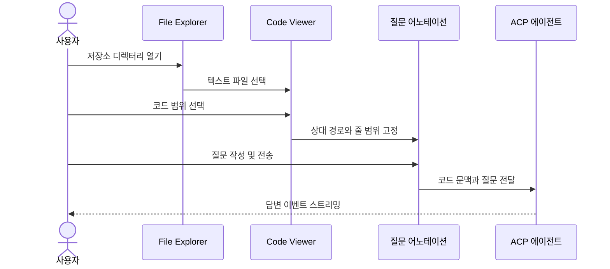
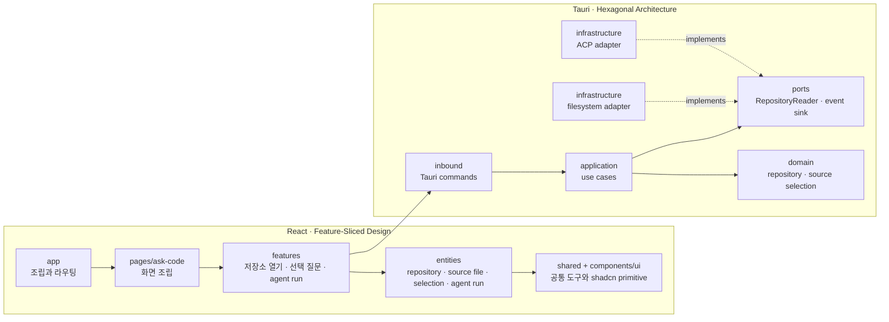

# Ask Code 목표

> 앱 별칭: `AC` (`apps/ask-code`)

## 제품 목표

Ask Code는 로컬 코드 저장소를 읽고, 사용자가 선택한 코드 문맥을 바탕으로 ACP 에이전트에게 질문하는 데만 집중하는 데스크톱 앱이다.

사용자는 File Explorer에서 저장소의 파일을 열고 특정 코드 범위를 선택한 뒤 질문 어노테이션을 작성한다. 앱은 저장소 상대 경로, 줄 범위, 선택한 원문과 질문을 하나의 문맥으로 구성해 에이전트에게 전달하고 답변을 스트리밍한다.

이 문서에서 에이전트는 사용자가 언급한 HP 에이전트를 HL에 이미 적용된 기능과 같은 **ACP 에이전트**로 해석한다. 다른 에이전트 종류를 뜻한 경우 이 전제를 먼저 수정한다.

## 핵심 사용자 흐름



## MVP 범위

### 저장소와 File Explorer

- 사용자가 로컬 저장소 디렉터리 하나를 연다.
- 저장소 루트를 벗어나지 않는 상대 경로만 허용한다.
- 디렉터리는 지연 로딩하고 `.git`, `node_modules`, `target`, 숨김 디렉터리와 일반적인 빌드 산출물을 기본 제외한다.
- UTF-8 일반 텍스트 파일만 미리 보고, 큰 파일은 명시적인 크기 제한과 잘림 상태를 제공한다.
- AW의 `worktree_file` domain/application/infrastructure 구현과 파일 트리 모델을 출발점으로 삼는다.

### 코드 선택과 질문 어노테이션

- 코드 뷰어는 줄 번호와 연속 텍스트 선택을 제공한다.
- MVP 어노테이션 종류는 `question` 하나로 제한한다.
- 어노테이션 anchor는 저장소 상대 경로, 시작/끝 줄과 열, 선택 원문을 가진다.
- 한 질문에는 우선 하나의 선택 범위만 첨부한다.
- MA의 선택→anchor→프롬프트 흐름은 UX 참고 대상으로 사용한다. Markdown AST에 종속된 어노테이션 모델은 임의의 소스 코드에 직접 재사용하지 않는다.

### 최소 ACP 에이전트

- Rust는 `acp-agent-core`, TypeScript는 `@yoophi/agent-client`를 재사용한다.
- HL처럼 앱별 Tauri command 조립과 `RunEventSink`만 Ask Code에 둔다.
- 저장소별로 하나의 실행 중 세션을 유지하며 첫 질문은 `start_agent_run`, 후속 질문은 `send_prompt_to_run`으로 전달한다.
- 권한 모드는 `ReadOnly`로 고정하고 에이전트의 코드 수정은 허용하지 않는다.
- `NoopAcpSessionStore`를 사용해 앱 재시작 후 세션 복원은 지원하지 않는다.
- 필요한 최소 동작은 run 시작, 후속 질문, 취소, 권한 응답, `agent-run-event` 스트리밍이다.

## MVP에서 제외하는 것

- 코드 편집, patch 적용, 파일 생성·삭제 등 저장소 쓰기
- Git history, branch, worktree 관리 등 GE/AW의 Git 기능
- 일반 문서 검토용 어노테이션 종류와 어노테이션 영속화
- 여러 저장소를 동시에 여는 workspace
- 에이전트 오케스트레이션, child agent, Ralph Loop, MCP tool host
- 세션 resume, 대화 로그 영속화, 모델·에이전트 선택 설정
- IDE 수준의 language server, symbol index, semantic search

## 아키텍처

프론트엔드는 React + TypeScript + Vite + Tailwind CSS 4 + shadcn/ui를 사용하고 Feature-Sliced Design을 따른다. shadcn/ui primitive는 GE와 동일하게 `@yoophi/ui`를 우선 재사용하며, Ask Code에만 필요한 생성 컴포넌트가 생기면 `src/components/ui`에 둔다.

Tauri 백엔드는 hexagonal architecture를 따른다. `domain`과 `ports`는 Tauri와 파일시스템 구현을 모르며, `inbound` command는 `application` 유스케이스에만 위임한다. 파일시스템과 ACP 결합은 `infrastructure` adapter에 둔다.



### 주요 module과 seam

- 저장소 읽기 module의 interface는 디렉터리 목록과 제한된 텍스트 읽기만 노출한다. 경로 정규화, 탈출 방지, 제외 규칙, 파일 크기 제한은 구현 내부에 숨긴다.
- 질문 문맥 module의 interface는 `selection + question`을 받아 에이전트 prompt를 반환한다. prompt 형식은 한곳에서만 관리한다.
- ACP module의 외부 seam은 기존 `acp-agent-core`와 `@yoophi/agent-client` 계약이다. AW의 앱 전용 설정·오케스트레이션 interface는 가져오지 않는다.
- 테스트는 실제 filesystem adapter와 in-memory adapter가 동일한 저장소 읽기 interface를 통과하도록 구성한다.

## 기본 디렉터리 구조

```text
apps/ask-code/
├── GOAL.md
├── components.json
├── package.json
├── src/
│   ├── app/                 # provider, router, 전역 스타일
│   ├── pages/ask-code/      # Ask Code 화면 조립
│   ├── features/            # 사용자 행동 단위
│   ├── entities/            # 프론트 도메인 모델과 Tauri adapter
│   ├── shared/              # 앱 공통 유틸리티
│   └── components/ui/       # 앱 전용 shadcn/ui 생성 컴포넌트
└── src-tauri/
    └── src/
        ├── domain/          # 순수 도메인 모델
        ├── ports/           # port 정의만
        ├── application/     # 유스케이스와 규칙
        ├── inbound/         # Tauri command adapter
        └── infrastructure/  # filesystem·ACP adapter
```

## 구현 단계

- [x] Phase 0: pnpm/Cargo workspace에 앱 등록, React/Tauri/shadcn/FSD/hexagonal 기본 골격과 Storybook 구성
- [ ] Phase 1: 안전한 저장소 열기, 디렉터리 지연 로딩, 텍스트 파일 읽기
- [ ] Phase 2: 코드 뷰어, 선택 anchor, 질문 어노테이션과 prompt formatter
- [ ] Phase 3: HL 방식의 최소 ACP adapter와 읽기 전용 Q&A 스트리밍
- [ ] Phase 4: 파일 변경 감지, 오류·빈 상태, 계약/통합 테스트와 접근성 검증

## MVP 완료 기준

- 저장소를 열고 파일 트리에서 UTF-8 텍스트 파일을 선택할 수 있다.
- 코드 일부를 선택해 질문하면 정확한 상대 경로와 줄 범위가 prompt에 포함된다.
- ACP 에이전트 답변이 화면에 스트리밍되고 같은 저장소 세션에서 후속 질문을 보낼 수 있다.
- 모든 agent run은 읽기 전용이며 저장소 파일을 변경하지 않는다.
- 프론트엔드 계층 규칙과 백엔드 hexagonal 의존 방향을 테스트와 정적 검사로 검증한다.
