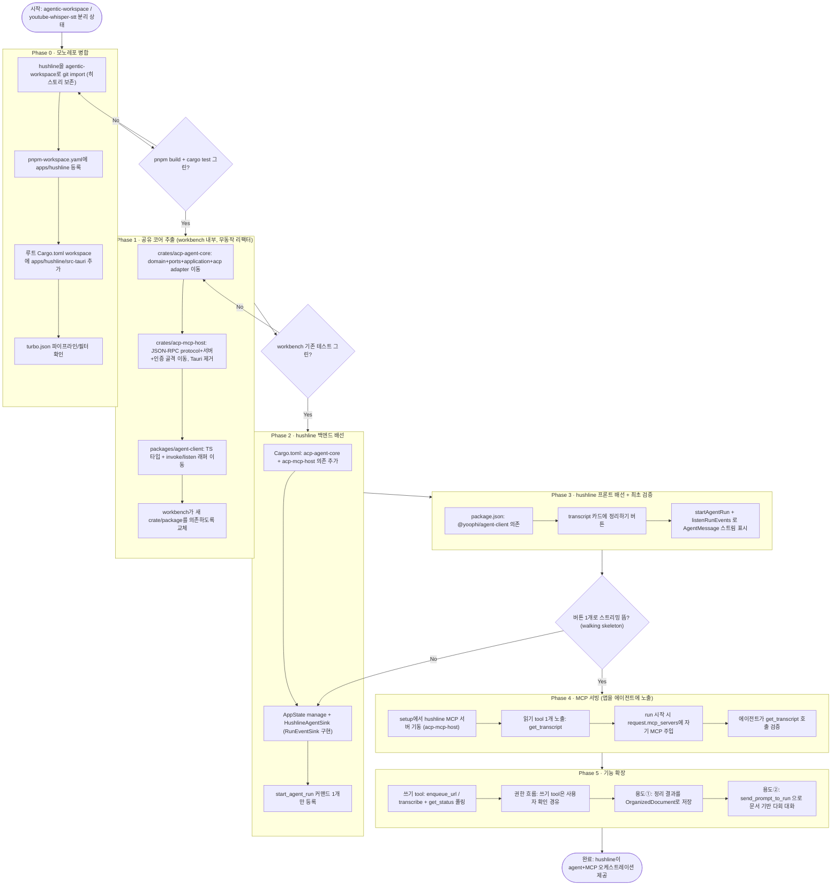
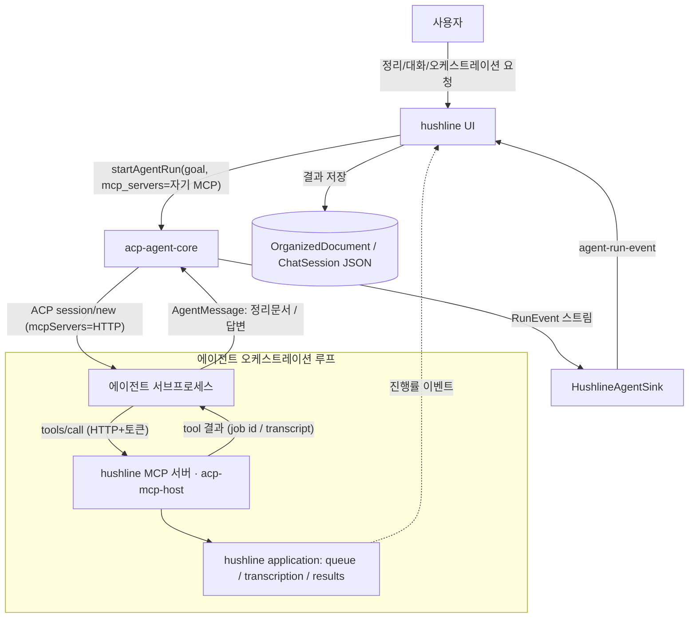

# ACP Agent 통신 기능 재사용 전략 (결정 문서)

## 문서 위치와 목적

이 문서는 `agentic-workbench`의 **agent 통신 기능**(ACP 기반 run 실행 + 이벤트 스트리밍)을
다른 앱에서 재사용하기 위한 결정 문서다. 1차 이식 대상은 `~/project/youtube-whisper-stt`의
`hushline` 앱이며, 이후 임의의 Tauri 앱에서 agent를 호출하고 결과를 소비하는 것을 목표로 한다.

이 문서는 "무엇을 공유할지", "어떤 방식으로 공유할지", "어떤 순서로 실행할지"를 확정한다.
기존 `docs/git-feature-sharing-monorepo-strategy.md`(git-core 공유)의 원칙과 결론을 그대로 계승한다.

## 현재 상태 (실측 기준)

### 두 프로젝트는 동일 스택

| | agentic-workspace | youtube-whisper-stt (hushline) |
|---|---|---|
| 구조 | pnpm workspace + Turbo | pnpm workspace + Turbo |
| 백엔드 | Tauri 2 + Rust (hexagonal) | Tauri 2 + Rust (hexagonal) |
| 프론트 | React 19 + Vite + TS | React + Vite + TS |
| Cargo workspace | 루트 `[workspace]` 존재 | 루트 `[workspace]` 존재 |
| 워크스페이스 crate 공유 선례 | `crates/git-core` 존재 | 아직 없음 |

동일 스택 + 동일 workspace 레이아웃이라 재사용 이식 비용이 낮다.

### agent 통신 코드는 이미 재사용 가능한 형태에 가깝다

`agentic-workbench`의 백엔드는 hexagonal(ports & adapters)로 짜여 있고,
`grep`으로 확인한 Tauri 결합 지점이 극소수다.

```
apps/agentic-workbench/src-tauri/src/
├─ domain/            ← Tauri 의존 0   (RunEvent, AgentRunRequest, PermissionMode …)
├─ ports/             ← Tauri 의존 0   (SessionLauncher, SessionHandle, RunEventSink, SessionRegistry)
├─ application/       ← Tauri 의존 0   (StartAgentRunUseCase, SendPromptUseCase …)
├─ infrastructure/
│  ├─ acp/            ← Tauri 의존 0   ★ 실제 ACP 통신 (runner/client/transport/terminal)
│  ├─ agent_session_registry(AppState) ← Tauri 의존 0
│  ├─ permission_broker, agent_catalog ← Tauri 의존 0
│  ├─ json_acp_session_store           ← Tauri 참조 1곳 (앱 데이터 경로 획득 뿐)
│  └─ tauri_run_event_sink             ← Tauri 결합 (이벤트 emit)
└─ inbound/tauri_commands.rs           ← Tauri 결합 (조립 + #[command])
```

**통신 엔진 자체(domain + ports + application + infrastructure/acp + registry)는 Tauri를 전혀 모른다.**
Tauri에 묶인 건 (1) 이벤트를 창으로 보내는 sink, (2) `#[tauri::command]` 조립 지점,
(3) 저장 경로 획득뿐이다.

전체 백엔드에서 `use tauri` / `tauri::`를 참조하는 파일:

```
inbound/tauri_commands.rs                    ← 조립 지점 (앱별 유지)
infrastructure/tauri_run_event_sink.rs       ← 이벤트 emit (앱별 유지)
infrastructure/json_acp_session_store.rs     ← 앱 데이터 경로만 (주입식으로 전환)
infrastructure/json_*_repository.rs          ← workbench 전용 (추출 대상 아님)
infrastructure/{mcp, native_window_menu, window_manager, perf_log}.rs  ← workbench 전용
lib.rs                                        ← 앱별 유지
```

`agent_session_registry`(AppState), `permission_broker`, `agent_catalog`,
`infrastructure/acp/*`는 Tauri 참조 0으로 확인됨.

## 무엇을 공유하는가 (공유 경계)

앱 통째로가 아니라 **Tauri / UI 디자인 시스템에 묶이지 않은 코어만** 공유한다.
공유 유닛은 3개(Rust 코어 + TS 클라이언트 + MCP 서빙 스캐폴딩)이고,
나머지 얇은 접착층과 앱별 tool 정의는 앱별로 남긴다.

| 대상 | 공유 단위 | 시점 |
|---|---|---|
| ACP run 실행/스트리밍 domain + ports + application + acp adapter (에이전트→MCP 소비 배선 포함) | `crates/acp-agent-core` (Rust) | 1순위 |
| run 실행/이벤트 TS 계약 + invoke/listen 래퍼 | `packages/agent-client` (`@yoophi/agent-client`) | 2순위 |
| 앱을 MCP로 노출하는 서빙 골격(JSON-RPC protocol + axum 서버 + 토큰/origin 인증 + run-scoped env 주입) | `crates/acp-mcp-host` (Rust) | 3순위 (MCP 확장 시) |
| 이벤트 sink, `#[command]` 조립, 저장 경로, **앱별 MCP tool 정의** | 각 앱 `src-tauri` (공유 안 함) | 앱별 |

### 유닛 A — Rust 코어 crate: `crates/acp-agent-core`

추출 대상 (거의 그대로 이동):

- `domain/` 중 agent-run 관련: `run.rs`, `events.rs`, `agent.rs`, `permission.rs`,
  `acp_session.rs`, `agent_tool_candidate.rs`
- `ports/` 전체: `session_launcher`, `session_handle`, `session_registry`, `event_sink`,
  `acp_session_store`, `agent_catalog`, `permission`
- `application/` 중 통신 유스케이스: `start_agent_run`, `send_prompt`, `steer_prompt`,
  `cancel_prompt_and_send`, `cancel_agent_run`, `set_permission_mode`, `agent_run_errors`
- `infrastructure/` 중: `acp/*` 전체, `agent_session_registry`, `permission_broker`, `agent_catalog`

공개 계약 (crate가 밖으로 내보내는 것):

```rust
// 앱이 구현 없이 바로 쓰는 것
pub use domain::{events::RunEvent, run::AgentRunRequest, ...};
pub use application::{StartAgentRunUseCase, SendPromptUseCase, ...};
pub use infrastructure::acp::AcpAgentRunner;      // SessionLauncher 구현체
pub use infrastructure::agent_session_registry::AppState;

// 앱이 구현해서 주입하는 것 (Tauri 탈착 지점)
pub trait RunEventSink { fn emit(&self, run_id: &str, event: RunEvent); }  // ports
pub trait AcpSessionStore { ... }   // 저장 경로/영속 — 앱이 위치 결정
```

손봐야 할 유일한 결합: `json_acp_session_store`가 Tauri로 앱 데이터 경로를 얻는 부분.
→ 경로를 **생성자 인자로 주입**받도록 바꿔 crate에서 Tauri 제거.
(또는 이 store 구현만 앱에 남기고 `AcpSessionStore` 포트만 crate에 둔다.)

### 유닛 B — TS 클라이언트 패키지: `packages/agent-client` (`@yoophi/agent-client`)

프론트 소비 계약은 이미 `entities/agent-run`에 깔끔하게 모여 있다. 추출 대상:

- `agent-run/model/types.ts` — `AgentRunRequest`, `RunEventEnvelope`, `PermissionMode` 등
  (Rust `domain`과 1:1, camelCase 직렬화 일치)
- `agent-run/api/agent-run-repository.ts` — `startAgentRun`, `sendPromptToRun`,
  `listenRunEvents(cb)` 등 `invoke`/`listen` 래퍼
- (선택) run 이벤트를 상태로 접는 React hook / reducer

앱은 이 패키지를 import 해서 **UI만 자기 취향대로** 그린다. 타입이 Rust와 한 소스이므로
계약 드리프트가 사라진다.

### 유닛 C — MCP 서빙 스캐폴딩 crate: `crates/acp-mcp-host`

앱이 **자기 기능을 MCP 서버로 노출**하고, 그 앱 안에서 도는 에이전트가 그것을 소비하는
패턴을 위한 골격이다. workbench에 이미 구현돼 있다(현재 `set_window_title` MCP가 실사례).

- **소비 측(agent→MCP)은 이미 `acp-agent-core` 안에 있다.** `AgentMcpServerConfig`(HTTP),
  `AgentRunRequest.mcp_servers`, 그리고 `acp/runner.rs`가 이를 ACP `session/new`의
  `mcpServers`로 전달하는 배선까지 완비. **추가 작업 없음** — 앱은 `request.mcp_servers`만 채우면 된다.
- **서빙 측(app→MCP)만 신규 추출.** workbench `infrastructure/mcp/`에서:
  - `protocol.rs`(JSON-RPC MCP 헬퍼) + axum 서버 + 토큰/origin 인증 +
    run-scoped env 주입 헬퍼(`McpLaunchEnv::server_config()`, `AW_MCP_URL/TOKEN/RUN_ID`)는 제네릭 → 추출.
  - `title_tool.rs`는 workbench 전용 tool → 추출하지 않고, 앱별 tool 작성의 참고 템플릿으로만 사용.
- **관건**: 이 crate를 **tool 핸들러 레지스트리에 대해 제네릭**하게 만들고, Tauri 의존(AppHandle emit)을
  걷어낸다. 각 tool = `{ name, input_schema(JSON), async handler }`; host가 `tools/list`·`tools/call`을 자동 라우팅.

앱은 자기 application 서비스를 캡처한 tool 핸들러만 등록한다(같은 프로세스라 직접 참조 가능).

### 앱별로 남는 얇은 접착층 (각 앱 `src-tauri`에 유지)

- `tauri_run_event_sink.rs` (창으로 emit — 앱마다 창 구조가 달라 공유 부적합, ~60줄)
- `#[tauri::command]` 핸들러 + `invoke_handler` 등록 (조립 지점, 각 유스케이스 3~5줄)
- 저장 경로 결정 (`app_data_dir`)

## 어떤 방식으로 공유하는가 (배포)

두 레포가 별도 git 저장소라 코어를 물리적으로 전달할 방법이 필요하다.

| 방식 | 장점 | 단점 | 적합성 |
|---|---|---|---|
| **A. 단일 모노레포 병합** | 원자적 빌드/테스트, drift 0, 리팩터 즉시 반영 | 초기 병합 비용, 히스토리 정리 | git-core 전략 문서가 이미 채택 |
| **B. git subtree / submodule** | 레포 분리 유지 | 양방향 동기화 수작업, 버전 어긋남 | 임시방편 |
| **C. 패키지 배포** (Cargo git-dep / npm 사설) | 명시적 버전 | 매 변경마다 publish→bump, 반복 개발 느림 | 코어 안정 후반 |

**권장: A(병합) → 실패 시 C.**
기존 `git-feature-sharing-monorepo-strategy.md`가 git-core 공유에서 "병합 먼저"로 결론냈고,
hushline이 이미 동일한 workspace 레이아웃이라 병합 비용이 낮다. 병합하면
`crates/acp-agent-core`와 `packages/agent-client`를 두 앱이 workspace 의존성으로 즉시 공유한다.

지금 병합이 부담이면, 먼저 **코어를 crate/package로 잘라 workbench 안에서 안정화**한 뒤
(무동작 변경 리팩터라 리스크 낮음) 병합/배포를 결정한다.

### 방식 A(병합) vs 방식 C(배포) 상세 비교

이 프로젝트의 구체 조건(Rust 코어 + TS 계약 **이중 공유**, 코어가 아직 불안정, 동일 스택 솔로 개발,
git-core 병합 선례)에서의 트레이드오프.

**방식 A — 모노레포 병합**

- 장점: (1) **원자적 변경** — Rust 코어·TS 계약·두 앱 호출부를 한 PR로. 최대 리스크인 camelCase
  드리프트가 한 CI(`cargo test`+`tsc`)에서 즉시 잡힘. (2) **리팩터 마찰 0** — publish/bump 왕복 없음.
  (3) 버전 협상 불필요(항상 HEAD). (4) pnpm+Turbo+Cargo workspace·git-core 선례로 검증됨.
  (5) 한 트리 탐색/디버깅.
- 단점: (1) 초기 병합 비용(히스토리 합치기, 사실상 1회성 결단). (2) 레포 비대화(현재 규모엔 미미).
  (3) crate 경계가 강제되지 않아 규율 필요. (4) 권한/CI 공유(솔로면 무관).

**방식 C — 패키지 배포(Cargo git-dep / 사설 npm)**

- 장점: (1) semver로 코어 API 고정. (2) 공개 API만 소비 → 캡슐화 자동 강제. (3) 레포/권한/CI 독립.
  (4) 병합 리스크 없음.
- 단점: (1) 코어 변경마다 publish→bump→통합 **왕복**, 게다가 **이중 계약(Rust+TS)** 이라 배포 채널 2개와
  버전 정합을 사람이 관리. (2) 코어 vX ↔ TS 계약 vY **드리프트 위험**(A와 정반대). (3) 초기 반복 개발 저하.
  (4) 사설 레지스트리+인증 인프라, 로컬 `pnpm link`/Cargo `[patch]` 우회 함정.

| 기준 | A. 병합 | C. 배포 |
|---|---|---|
| Rust↔TS 계약 드리프트 방지 | 강함(한 CI) | 약함(버전 어긋남) |
| 코어 변경 반복 속도(초기) | 빠름 | 느림(왕복) |
| 경계·캡슐화 강제 | 규율 의존 | 자동 |
| 버전 독립성/외부 소비 | 약함 | 강함 |
| 되돌리기 | 어려움 | 쉬움 |

**결론**: 지금은 **A**. 코어가 자주 바뀌는 초기 + 이중 계약 드리프트 위험 + 동일 스택 솔로라
C의 독립성 이점이 아직 값이 없다. C는 **코어 API가 안정되고 외부 소비자가 생길 때** 승격.
"A로 시작 → 경계가 굳으면 그 crate/package를 그대로 C로 떼어내기"는 매끄럽지만 역방향은 낭비이므로,
**A로 시작하는 것이 옵션을 열어두는 선택**이다.

## 실행 순서 (병합 후 기준)

1. **코어 추출 (workbench 내부, 무동작 변경 리팩터)** — `crates/acp-agent-core` 생성,
   위 모듈 이동, `json_acp_session_store` 경로를 주입식으로 전환. workbench가 새 crate에
   의존하도록 교체. 기존 테스트 그린 유지가 완료 기준.
2. **TS 패키지 추출** — `packages/agent-client` 생성, `entities/agent-run` 이동,
   workbench가 `@yoophi/agent-client`로 import.
3. **레포 병합** (또는 C 방식 배포 설정).
4. **hushline 배선** — `hushline/src-tauri/Cargo.toml`에 `acp-agent-core` 추가,
   `AppState` manage, 유스케이스별 `#[tauri::command]` 5개 + `HushlineEventSink` 작성.
   `package.json`에 `@yoophi/agent-client` 추가.
5. **hushline 기능 구현** — 예: "이 transcript를 요약/교정해줘" 버튼 →
   `startAgentRun({ goal, agent_id, cwd })` → `listenRunEvents`로 스트리밍 표시.
   UI는 hushline 고유.

## 주의점 / 리스크

- **camelCase 직렬화 계약**: `RunEvent` 등이 `#[serde(rename_all="camelCase")]`에 의존.
  TS 타입을 Rust에서 자동 생성(`ts-rs`/`specta`)하거나 계약 테스트로 고정 권장.
- **`agent_catalog`의 에이전트 실행 명령/경로**가 환경 의존적 → 앱별 설정으로 노출.
  workbench는 `agent_run_settings`로 override를 지원하지만, 재사용 시 단순화 가능.
- **MCP / 창 메뉴 / goal / saved_prompt / git 기능은 추출 대상 아님** — workbench 전용.
  hushline엔 순수 "run 실행 + 이벤트 스트림"만 필요.
- **동시 실행 상한** `ACP_WORKBENCH_MAX_RUNS` env 이름을 중립적(`ACP_MAX_RUNS` 등)으로 리네임 고려.

## hushline 통합 (1차 이식 대상)

### hushline이 agent로 하려는 것 (용도)

기존 기능(YouTube 자막 생성 + queue 관리)에 에이전트를 결합해 다음을 제공한다.

| 용도 | run 패턴 | 코어 사용 | 컨텍스트 전달 |
|---|---|---|---|
| **① 문서 정리** (자막 → 사용자 지정 방식 재구성 → 새 문서 저장) | 단발 run | `start_agent_run` + `AgentMessage` 스트림 수집 | cwd=결과 폴더, goal에 "이 자막을 ~방식으로 정리: `transcript.txt`" |
| **② 지식 기반 대화** (문서 기반 다회 Q&A) | 장수(long-lived) run | `start_agent_run` + `send_prompt_to_run` 반복 | 첫 프롬프트에서 문서 로드, 이후 세션 컨텍스트 유지 |
| **③ 오케스트레이션** (에이전트가 hushline 기능을 도구로 구동) | run + MCP tools/call | `mcp_servers` 주입 + `acp-mcp-host` | 에이전트가 MCP로 큐·자막·결과에 접근 |

정리는 짧은 run 하나, 대화는 문서당 세션 하나 유지, 오케스트레이션은 에이전트가 MCP로 앱을 되부르는 형태다.

### hushline이 노출할 MCP tool 후보

```
읽기:  list_queue, get_status(id), list_results, get_transcript(url|id), get_organized_docs
쓰기:  enqueue_url(url, model, lang), remove_from_queue(id), transcribe(url, ...),
       save_organized_document(source_id, title, content)
```

### hushline 측 신규 모델 (코어 아님, 앱 고유)

```
domain(hushline): OrganizedDocument{source_transcript_id, style, content, created_at, path}
                  ChatSession{document_id, run_id, messages[], created_at}
features(FSD):    features/organize-transcript, features/chat-with-document, features/ask-agent
widgets:          기존 result-grid 카드에 "정리하기" / "대화하기" 액션 추가
```

### 이 용도가 강제하는 추가 결정

- **세션 지속성(resume)**: 대화(②)가 앱 재시작 후에도 이어져야 하면 `AcpSessionStore` 포트 + 저장 경로 필요.
  권장(MVP): 1차는 세션 내 대화만(noop), 지속 대화는 2차. 정리 결과/대화 로그는 hushline 자체 JSON으로 영구 저장.
- **정리 결과 저장 주체**: (a) 에이전트가 직접 파일 write vs (b) `AgentMessage` 스트림을 hushline이 수집해 저장.
  권장: 정리(①)는 **(b)** — 저장 위치·포맷 통제, 권한 흐름 불필요. 에이전트 write는 옵션.
- **권한 모드**: 읽기 tool은 자유, **쓰기 tool(enqueue/transcribe/save)은 코어 Permission 흐름 또는 UI 확인 경유**.
- **에이전트 선택**: MVP는 1종 하드코드 → 이후 설정 UI. `AgentRunRequest`가 해석된 명령·env를 받는 계약 유지.
- **MCP 보안/스코프**: 토큰+origin(기존) + run-scoped `RUN_ID`로 호출 세션 추적.
- **장기 작업 표현**: `transcribe`는 즉시 job id 반환 → 에이전트가 `get_status` 폴링 → 완료 후 `get_transcript`
  (동기 블로킹 금지). 진행률은 기존 hushline 이벤트로 UI에 별도 표시.
- **MCP 서버 수명**: 앱 부팅 시 1개 기동(`setup()`), run마다 자기 URL+토큰+RUN_ID 주입(workbench와 동일).

### 통합 진행 플로우차트 (작업 흐름)



### 완성 후 런타임 동작 플로우차트



**두 채널 구분이 핵심**: (1) `RunEvent` 스트림은 에이전트→UI 표시용, (2) MCP `tools/call`은
에이전트→앱 기능 실행용. transcribe 같은 장기 작업은 MCP로 job id만 받고 폴링하며,
진행률은 기존 hushline 이벤트로 UI에 별도 표시한다.

## 구현 결과 (spec 030, 2026-07 착수)

이 전략을 `specs/030-hushline-monorepo-integration`에서 실제 구현했다.

- **편입**: hushline을 `apps/hushline`로 스냅샷 복사(방식 C) 후 pnpm/Cargo workspace에 등록.
  모노레포 hoist된 `@types/react@19`가 lucide-react를 통해 새던 문제는 hushline tsconfig의
  `paths`로 로컬 18 고정하여 해결.
- **공유 코어 추출**: `crates/acp-agent-core`(domain/ports/application/infrastructure 하위집합)로
  workbench에서 무동작 리팩터 이동. workbench는 `mod.rs` re-export로 소비, registry의 workbench
  전용 트레이트 2개는 orphan rule로 workbench에 잔류. env는 `ACP_MAX_RUNS`(+ 레거시 폴백)로 중립화.
  `packages/agent-client`(계약 타입 + invoke/listen 래퍼)로 TS 계약 공유, workbench는 타입 re-export.
- **hushline agent 기능**: `HushlineAgentSink` + run-control command(start/send/cancel/permission)
  + `save_organized_document`/`save_chat_session`. cwd 안전 경계·소유 검증·창종료 정리 포함.
  프론트는 `features/organize-transcript`(정리·저장)와 `features/chat-with-document`(세션 내 다회 대화).
- **검증**: `cargo test`(acp-agent-core 84, agentic-workbench 113, hushline 6), `cargo check --workspace`,
  `pnpm check-types` 11/11, `pnpm test` 전체 green. 실제 agent 스트리밍 런타임 확인은 agent CLI 설치 필요.

## 결정 요약

- 공유 단위 3개: `crates/acp-agent-core`(Rust, 에이전트→MCP 소비 배선 포함) +
  `packages/agent-client`(TS) + `crates/acp-mcp-host`(MCP 서빙 골격, MCP 확장 시).
- 앱별 유지: 이벤트 sink, `#[command]` 조립, 저장 경로, **앱별 MCP tool 정의**.
- 공유 방식: 모노레포 병합(A) 우선. 코어 API 안정 + 외부 소비자 발생 시 배포(C)로 승격.
- 진행 순서: Phase 0 병합 → 1 코어 추출 → 2 백엔드 배선 → 3 walking skeleton 검증 →
  4 MCP 서빙 → 5 기능 확장(정리/대화/오케스트레이션).
- 첫 착수: workbench 내부 코어 추출 리팩터(무동작 변경). 첫 관문은 Phase 3(command 1개 + 버튼 1개 스트리밍).
- hushline 용도: ① 자막 문서 정리·저장, ② 문서 기반 지식 대화, ③ MCP로 hushline 기능을 구동하는 오케스트레이션.
