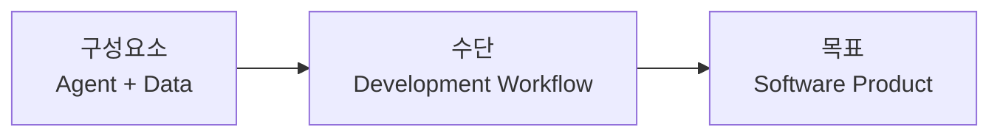
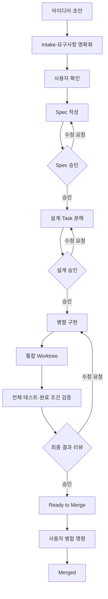
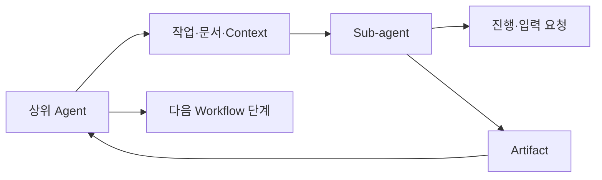

# Agentic Workbench 제품 정체성과 가치

## 제품 정의

> Agentic Workbench는 Agent와 Data로 구성된 개발 Workflow를 실행해 소프트웨어 제품을 만드는 Human-in-the-loop 플랫폼이다.

이 제품의 목표는 코딩 에이전트를 실행하거나 워크플로를 편집하는 행위 자체가 아니다. 최종 목표는 **실제로 동작하는 소프트웨어 제품을 만드는 것**이다.



이 위계를 기준으로 제품을 설명한다.

- **목표**: 검증 가능한 소프트웨어 제품을 만든다.
- **수단**: 제품 개발 과정을 Workflow로 설계하고 실행한다.
- **구성요소**: Agent가 Data를 읽고 작업하며 Artifact를 다음 단계에 전달한다.
- **사용자의 역할**: 목표를 정하고 산출물을 검토하며 중요한 결정을 내린다.
- **Workbench의 역할**: 실행을 지속하고 Agent, Data, Artifact, 결정과 상태를 연결한다.

## 확정된 초기 제품 범위

- **사용자**: 자신의 로컬 저장소에서 여러 AI 코딩 Agent를 운영하는 1인 개발자 또는 기술 창업자
- **제품 단위**: 초기에는 Product 하나에 Repository 하나를 연결한다.
- **대표 결과**: 기능 요구사항으로부터 테스트를 통과한 `Ready to Merge` 변경을 만든다.
- **실행 환경**: 로컬 Background Service가 Workflow Run과 Agent Loop를 소유한다.
- **주 인터페이스**: Desktop UI를 우선하고 Local Web UI는 이후 같은 상태에 접속하는 보조 인터페이스로 확장한다.
- **Workflow 제공 방식**: 초기에는 제품이 검증된 기본 Workflow를 제공한다.
- **사용자 설정 범위**: Agent와 모델, 병렬 Agent 수, 재시도, 권한, 추가 검토 지점, 테스트 명령과 예산을 설정한다.
- **범위 제외**: 초기부터 자유형 Workflow 그래프 편집, 다중 저장소, 원격 실행, 팀 협업과 자동 병합을 목표로 하지 않는다.

Product, Project와 Repository는 개념적으로 분리한다. 초기의 `Product 1개 = Repository 1개`는 제품 범위 제약이며, 향후 여러 Repository를 연결할 수 있는 확장 가능성은 유지한다.

## 제품이 해결하려는 문제

일반적인 에이전트 코딩 도구에서는 사용자가 대화를 이어가며 다음 작업을 계속 지시해야 한다. 진행 과정과 결과가 메시지에 흩어지고, 중요한 판단과 실행 상태가 하나의 제품 개발 과정으로 관리되지 않는다.

Agentic Workbench는 제품 개발 과정을 실행 가능한 기본 Workflow로 바꾼다.



Intake는 아이디어를 개발 가능한 요구사항으로 정리하는 준비 과정이다. 사용자가 요구사항을 확인한 시점부터 정식 Workflow Run을 시작한다.

기본 필수 Decision Gate는 `Spec 승인`, `설계 승인`, `최종 결과 리뷰` 세 곳이다. 반복 가능하고 검증 가능한 작업은 Agent가 자동으로 수행하고, 제품 범위, 설계 방향과 최종 수용은 사용자가 통제한다.

## 승인 Artifact 계약

| Decision Gate | 공식 검토 Artifact | 가능한 결정 |
|---|---|---|
| Spec 승인 | 사용자 시나리오, 요구사항, 제외 범위, 완료 조건 | 승인·수정 요청·중단 |
| 설계 승인 | 기술 설계, 변경 대상, Task·의존성·병렬화 계획, 검증 전략 | 승인·수정 요청·중단 |
| 최종 결과 리뷰 | 변경 요약, 주요 Diff, 테스트 결과, 완료 조건 충족 여부, 미해결 위험 | 승인·수정 요청·중단 |

수정 요청은 문서 주석과 함께 해당 Artifact를 만든 단계로 돌아간다. 최종 승인은 저장소 병합을 자동 실행하지 않는다. Workflow Run을 `Ready to Merge`로 전환하고 사용자가 별도의 병합 명령을 내려야 한다.

## 핵심 제품 가치

### 실행 가능한 개발 과정

요구사항, Spec, Task, 구현, 테스트와 리뷰를 대화의 연속이 아니라 저장하고 다시 실행할 수 있는 Workflow로 만든다.

### 통제 가능한 자동화

Agent Loop는 백그라운드에서 지속되지만 사용자가 중요한 순간을 놓치지 않도록 Decision Gate와 Artifact Review를 제공한다.

### 누적되는 제품 자산

실행 결과를 일회성 메시지가 아니라 코드, 문서, Artifact, 사용자 결정과 실행 이력으로 축적한다.

### 사람과 에이전트의 공동 운영

초기에는 제품이 제공하는 기본 Workflow를 중심으로 사용자가 자동화 정책을 설정하고 실행을 점검한다. 장기적으로 사람은 Visual UI와 DSL을 통해 Workflow를 설계하고, Agent는 MCP 같은 구조화된 인터페이스를 통해 Workflow와 Task를 조회하고 변경안을 제안한다.

## Workflow의 구성요소

Workflow는 Agent와 Data가 상호작용하는 실행 구조다.

### Agent

Agent는 Workflow 안에서 역할과 목표를 부여받아 작업한다.

- 상위 Agent가 작업을 분해하고 Sub-agent를 호출한다.
- Sub-agent는 필요한 문서와 Context를 전달받는다.
- 진행 상황, 입력 요청과 실패 상태를 상위 Agent에 보고한다.
- 결과를 검증 가능한 Artifact로 반환한다.
- 상위 Agent는 여러 Artifact를 종합해 다음 단계로 전달한다.



### Data

Data는 단순한 입력값이 아니라 제품 개발 과정의 지속적인 맥락이다.

- 요구사항과 제품 목표
- 프로젝트 규칙과 기술 제약
- Spec, 설계 문서와 Task
- 코드와 Git 변경
- 테스트와 검증 결과
- 사용자 결정과 그 근거
- Agent가 생성한 Artifact와 상태

Agent가 필요한 자료를 정확히 찾고 읽을 수 있도록 문서의 목적, 범위, 버전과 관계를 관리해야 한다. 문서 관리 시스템은 부가 기능이 아니라 Workflow 품질을 결정하는 핵심 기반이다.

### Artifact

Artifact는 Agent 사이와 Workflow 단계 사이에서 전달되는 결과물이다.

- 출처와 생성 Agent
- 관련 Task와 Workflow Run
- 버전과 생성 시각
- 완료 및 검증 상태
- 사용자 리뷰와 결정
- 다음 단계에서 사용할 수 있는 구조화된 내용

Agent 응답을 Artifact로 승격하면 작업 결과를 추적하고 검토하며 재사용할 수 있다.

모든 Sub-agent는 자유 형식 완료 선언 대신 표준 `Task Result Artifact`를 제출해야 한다.

- 수행한 작업 요약
- 변경한 파일
- 실행한 테스트와 결과
- 완료 조건별 충족 여부
- 생성한 문서와 코드 Artifact
- 발견한 위험과 미해결 항목
- 다음 Task가 알아야 할 내용
- 관련 commit 또는 변경 식별자

Agent 프로세스가 종료되었다는 이유만으로 Task를 완료 처리하지 않는다. Result Artifact가 제출되고 기본 검증을 통과해야 `Completed`가 된다.

## Agent 자율성 및 실패 정책

설계 승인 후 Coordinator Agent는 승인된 범위 안에서 다음 작업을 자율적으로 수행한다.

- Sub-agent 생성과 종료
- Task별 worktree 할당
- 승인된 Task 범위 안의 작업 세분화
- 실패한 Task 재시도와 재배정
- Artifact 수집과 결과 종합
- 단순한 통합 충돌 해결

다음 변경은 사용자 승인 없이 수행할 수 없다.

- Spec, 사용자 가치와 완료 조건 변경
- 설계의 핵심 방향과 검증 전략 변경
- 기능 범위 확대
- 의미적 통합 충돌 해결
- 최종 저장소 병합

일시적인 실행 실패와 테스트 실패는 최대 2회까지 자동으로 진단·수정·재시도한다. 이후에는 실패 상태, 오류와 재현 방법, 시도한 해결책, 영향받는 완료 조건, 가능한 선택지와 추천안을 포함한 Failure Artifact를 제출한다.

변경이 필요할 때는 영향 범위에 따라 회귀한다.

- 사용자 가치, 범위, 완료 조건 변경 → Spec 수정 및 재승인
- 기술 구조, Task 분해, 병렬화·검증 전략 변경 → 설계 수정 및 재승인
- 승인된 범위 안의 구현 세부 변경 → Coordinator 자율 처리
- 영향 판단이 모호한 변경 → Spec 수정 및 재승인

## Worktree의 역할

Worktree는 제품이나 Workflow의 중심 객체가 아니다. 병렬 기능 개발 Task를 안전하게 격리하는 실행 자원이다.

```text
Product
└─ Workflow Run
   └─ Task
      └─ Agent Run
         └─ Worktree
```

Child Agent는 Task별 worktree에서 작업하고 검증한다. Coordinator Agent는 별도의 통합 worktree에서 Child 변경을 결합하고 전체 테스트와 완료 조건을 검증한다. 최종 승인 전에는 기본 브랜치를 변경하지 않는다.

## Context Bundle과 문서 관리

Task 시작 시 Workbench는 역할과 Task에 맞는 `Context Bundle`을 구성한다.

- 프로젝트 지침과 개발 규칙
- 승인된 Spec과 설계
- 현재 Task와 완료 조건
- 의존 Task의 Artifact
- 관련 소스 파일과 테스트
- 사용자 결정과 제약
- 허용된 작업 범위와 권한

Agent는 Context Bundle을 기본 입력으로 사용하고 필요하면 추가 문서를 탐색하거나 요청한다. 저장소 전체를 무작정 읽게 하지 않으면서 서로 다른 Agent가 같은 전제를 공유하게 한다.

장기 보존할 Spec, 설계, Task와 주요 결과 보고서는 프로젝트 Repository의 Markdown 파일을 원본으로 삼는다. Workflow Run, Agent 세션, 이벤트, 승인 기록과 임시 Artifact는 Workbench 데이터 저장소에 둔다. 코드와 테스트는 기존 프로젝트 파일로 관리하고, Workbench는 문서·Task·Agent·Run 사이의 참조 관계를 유지한다.

## 완료 판단 책임

- **자동 검사**: 테스트, 빌드, 타입 검사와 정적 분석 결과 생성
- **Coordinator Agent**: 완료 조건과 코드·테스트·Artifact의 대응 관계 설명
- **Workbench**: 누락된 근거와 실패 항목 표시
- **사용자**: 최종 결과 리뷰에서 수용 여부 결정

Agent는 근거 없이 완료를 선언할 수 없다. 각 완료 조건에는 테스트 결과 또는 Artifact 참조가 필요하다.

## 제품이 제공해야 할 도구

### Agent를 다루는 UI

- Agent의 역할, 목표와 담당 Task 확인
- 실행, 대기, 실패와 입력 요청 상태 확인
- Sub-agent 관계와 결과 수집 과정 확인
- 중지, 재시도, 재배정과 사용자 개입

### Workflow 설계 도구

- 초기에는 기본 Workflow의 Agent, 모델, 병렬도, 재시도, 권한, 검증 명령과 예산 설정
- 이후 단계, Agent, Data와 Artifact 연결
- 이후 분기, 반복, 병렬 실행과 Decision Gate 구성
- 검증된 이후 재사용 가능한 Workflow 편집과 버전 관리

### Workflow 점검 도구

- 누락된 입력과 산출물 확인
- 모순된 조건과 도달 불가능한 단계 탐지
- Agent 권한과 데이터 접근 범위 점검
- 예상되는 사용자 결정과 위험 구간 확인

### Workflow Run 상태 도구

- 현재 단계와 전체 진행 상황 확인
- 실행 중인 Agent와 대기 중인 Task 확인
- 생성된 Artifact와 문서 변경 검토
- 실패, 재시도와 복구 상태 확인
- 사용자의 결정이 필요한 항목 표시

이 도구들은 각각 다른 데이터 모델을 가져서는 안 된다. 하나의 Workflow Definition과 Workflow Run을 설계, 점검, 실행과 리뷰 관점에서 다르게 보여줘야 한다.

## 기술과 제품의 관계

- **ACP**는 Agent를 연결하고 실행하는 통신 계층이다.
- **MCP**는 Agent가 Workflow, Task, Artifact와 문서를 구조적으로 다루는 인터페이스다.
- **Desktop·Web·CLI·메신저**는 사용자가 Workflow를 관찰하고 제어하는 접점이다.
- **Markdown Annotator**는 문서와 Artifact를 검토하고 피드백을 구조화하는 전문 UI다.
- **Background Runtime**은 UI와 독립적으로 Workflow와 Agent Loop의 실행을 소유한다.

특정 프로토콜이나 UI는 교체 가능한 수단이다. 제품의 본질은 Workflow가 Agent와 Data를 조율해 소프트웨어 제품을 만드는 과정에 있다.

초기에는 Desktop UI와 로컬 Background Service를 제공한다. Local Web UI, 원격 실행, 클라우드 동기화와 메신저 연동은 대표 Workflow가 검증된 이후 확장한다.

## 워크플로와 스킬

Workflow와 Skill은 역할을 분리한다.

- **Workflow**: 무엇을 어떤 순서와 조건으로 실행할지 정의한다.
- **Skill**: 개별 작업을 어떤 절차로 수행할지 정의한다.

프로젝트는 사용할 Workflow, Skill과 버전을 선언한다. 실제 Skill은 실행 시 준비하고 lockfile로 재현성을 확보한다. 이 구조는 서로 다른 Agent에서도 같은 개발 과정을 반복할 수 있게 한다.

## 제품의 차별화 방향

Agentic Workbench의 목적은 또 하나의 AI 채팅 또는 코딩 도구를 만드는 것이 아니다. **Agent와 Data를 연결하는 개발 Workflow를 제품 자산으로 만들고, 이를 지속적으로 실행해 실제 소프트웨어를 완성하는 것**이 핵심이다.

- **결과 지향성**: Workflow가 아니라 완성된 소프트웨어 제품으로 성공을 판단한다.
- **지속성**: UI가 닫혀도 Agent Loop와 Workflow Run이 지속된다.
- **통제 가능성**: 중요한 결정과 위험한 변경에는 사용자가 개입한다.
- **추적 가능성**: 코드가 어떤 Workflow, Artifact와 결정에서 만들어졌는지 확인한다.
- **재사용성**: 성공한 제품 개발 과정을 다른 프로젝트에서 다시 실행한다.
- **확장성**: 새로운 Agent, Skill, Data Source와 사용자 접점을 연결한다.

## 초기 성공 기준

사용자가 기능 요구사항 하나를 입력한 뒤 필수 Gate 세 곳에서만 개입하고, 나머지 과정은 백그라운드로 진행되어 테스트를 통과한 `Ready to Merge` 변경을 반복적으로 얻을 수 있어야 한다.

- UI를 닫아도 Workflow가 계속 실행된다.
- Spec, 설계와 최종 리뷰에서 기본적으로 사용자를 호출한다.
- 병렬 Task가 서로 격리되어 진행된다.
- 모든 Task 결과가 표준 Artifact로 수집된다.
- 완료 조건과 테스트 근거가 최종 리뷰에 표시된다.
- 실패하거나 UI가 종료되어도 상태와 맥락을 복구한다.
- 사용자 승인 없이 기능 범위나 핵심 설계를 변경하지 않는다.

## 핵심 용어

| 용어 | 의미 |
|---|---|
| Product | 사용자가 만들고 있는 소프트웨어 제품 |
| Project | Product를 관리하는 Workbench 작업공간 |
| Repository | 초기에는 Product에 하나만 연결되는 코드 저장소 |
| Workflow Definition | 제품 개발 절차 |
| Workflow Run | Workflow Definition의 실제 실행 |
| Stage | Spec, 설계, 구현, 검증 같은 큰 단계 |
| Task | Agent가 수행하는 작업 단위 |
| Agent Run | Agent의 한 실행 |
| Artifact | 단계와 Agent 사이에 전달되는 결과물 |
| Decision Gate | 사용자의 승인이 필요한 지점 |
| Worktree | 병렬 Task를 격리하는 실행 자원 |
| Context Bundle | Agent에게 제공되는 Task별 문서와 Data 묶음 |

현재 코드의 `OrchestrationSession`, `ThreadGoal`, `Main/Child`는 내부 실행 개념으로 유지할 수 있지만 제품 UI와 문서에서는 위 용어를 우선한다.

## 핵심 메시지

> Workflow는 수단이고, 목표는 소프트웨어 제품이다.

> Agent는 Data를 읽고 Artifact를 만들며, Workbench는 그 과정과 사용자의 결정을 연결한다.

> 사람은 중요한 방향을 통제하고, Agent는 제품이 완성될 때까지 실행 가능한 개발 과정을 수행한다.
