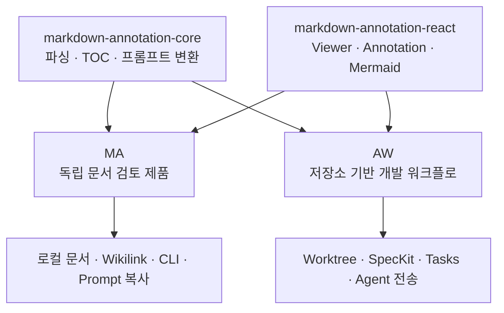
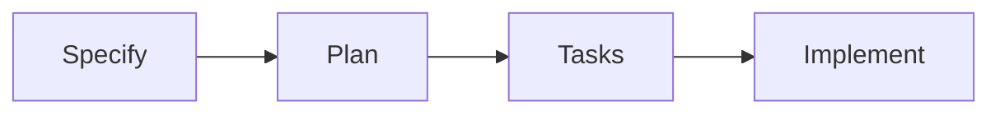

# MA와 AW의 Markdown 기능 비교

## 분석 목적

현재 레포지터리 구현을 기준으로 Markdown Annotator(MA)와 Agentic Workbench(AW)의 Markdown 기능이 공유하는 기반과 제품별 차이를 구분한다.

## 결론

MA와 AW는 Markdown 파싱·렌더링·annotation이라는 핵심 엔진을 공유하지만, 제품 안에서 맡는 역할은 다르다.

- **MA**는 임의의 Markdown 문서를 독립적으로 열고 검토하여 에이전트용 프롬프트로 변환하는 범용 문서 검토 애플리케이션이다.
- **AW**의 Markdown 기능은 현재 worktree의 일반 문서와 SpecKit 산출물을 검토하고, 그 결과를 에이전트 실행 및 SDD 워크플로에 연결하는 통합 기능이다.

## 기능 비교

| 구분 | MA — Markdown Annotator | AW — Agentic Workbench |
|---|---|---|
| 기본 목적 | 임의의 Markdown 문서 열람·주석·프롬프트 변환 | 현재 worktree의 문서와 SpecKit 산출물 검토 |
| 문서 범위 | 로컬 `.md`, `.markdown`, `.mdx` 파일 | 선택된 worktree 내부 Markdown 파일 |
| 렌더링 엔진 | 공유 패키지 사용 | 동일한 공유 패키지 사용 |
| Annotation | 선택 영역·블록 annotation CRUD | 거의 동일한 annotation CRUD |
| 문서 탐색 | OS 파일 선택, 창·탭, CLI, wikilink | 저장소 파일 트리, SpecKit 기능별 문서 목록 |
| 에이전트 연결 | 프롬프트를 클립보드로 복사 | 현재 AW 에이전트 흐름으로 직접 전송 |
| 프롬프트 설정 | 목적·파일 경로·사용자 지침 편집 | 기본 포맷 중심이며 별도 설정은 제한적 |
| 워크플로 인식 | 없음 | Spec → Plan → Tasks → Implement 단계 인식 |
| Tasks 지원 | 일반 체크리스트 렌더링과 TOC 요약 | Markdown 보기와 Tasks/Kanban 보기 |
| 변경 감지 | 개별 문서 watcher와 polling | worktree watcher와 React Query 갱신 |
| Annotation 영속화 | 없음 | 없음 |

## 공통 기반

두 앱 모두 다음 패키지를 사용한다.

- `@yoophi/markdown-annotation-core`
- `@yoophi/markdown-annotation-react`
- `@yoophi/workspace-auto-refresh`

공통으로 제공되는 기능은 다음과 같다.

- Markdown 블록 파싱과 GFM 렌더링
- Mermaid 감지·렌더링·확대
- 문서 목차 생성
- 선택 영역과 블록 단위 annotation
- `delete`, `question`, `change-request`, `note`, `approve` annotation 유형
- Annotation을 에이전트 프롬프트로 변환
- 체크리스트 진행률 계산

따라서 Markdown을 파싱하고 표시하는 저수준 기능은 이미 상당 부분 통합되어 있다. 앱마다 다른 UI kit은 adapter를 통해 공유 React 컴포넌트에 주입한다.

## MA에 더 잘 구현된 기능

### 독립적인 문서 열기

MA는 프로젝트나 저장소에 소속되지 않은 Markdown 파일도 열 수 있다. 브라우저 파일 입력과 Tauri 파일 선택을 지원하며, Tauri에서는 별도 창 또는 macOS 탭으로 문서를 열 수 있다.

### Wikilink 이동

`[[target|label]]` 형식의 wikilink를 렌더링하고, 링크를 선택하면 현재 문서와 같은 디렉터리의 Markdown 문서를 불러온다. AW에는 현재 같은 문서 이동 동작이 연결되어 있지 않다.

### 프롬프트 편집과 외부 전달

MA에서는 annotation 처리 목적을 `문서 수정`, `검토 참고`, `사용자 지정` 중에서 선택하고, 대상 파일 경로와 추가 지침을 편집할 수 있다. 완성된 프롬프트는 클립보드로 복사하므로 특정 에이전트에 종속되지 않는다.

### 문서 중심 보조 기능

- `ma` CLI 설치
- 예제 문서
- 개별 문서 변경 감시
- stale 및 오류 상태 표시와 재시도
- TOC·문서·annotation/prompt로 구성된 전용 화면

현재 MA는 독립적인 문서 열람과 검토 경험에서 AW보다 기능이 풍부하다.

## AW에만 있는 기능

### Worktree 문맥

AW는 임의의 파일을 여는 대신 현재 worktree에서 Markdown 파일을 조회한다. 에이전트가 작업하는 코드와 검토 대상 문서가 동일한 작업 공간에 속한다는 문맥을 유지한다.

### SpecKit 전용 workspace

AW는 일반 Markdown과 별도로 SpecKit workspace를 제공하며 다음 산출물을 구조화해서 다룬다.

- `spec.md`
- `plan.md`
- `tasks.md`
- `.specify/feature.json`의 활성 기능 포인터

문서를 기능별로 묶고 Tasks 진행률과 현재 SDD 단계를 계산한다.

### SDD 워크플로 실행

문서 존재 여부와 Tasks 진행률을 바탕으로 다음 단계를 판단한다.

각 단계에서 `$speckit-specify`, `$speckit-plan`, `$speckit-tasks`, `$speckit-implement` 요청을 에이전트 실행 흐름에 전달할 수 있다. MA는 문서를 검토하지만, AW는 문서를 워크플로 상태이자 다음 실행을 결정하는 산출물로 해석한다.

### Tasks 전용 보기

`tasks.md`를 일반 Markdown 또는 작업 보드 형태로 전환할 수 있다. 현재 구현은 완료·미완료 필터와 compact/detailed 표시를 제공하는 읽기 중심 시각화이며, Tasks를 직접 편집하는 작업 관리 시스템은 아니다.

### 에이전트 세션으로 직접 전달

AW에서는 annotation 프롬프트를 클립보드로 복사하는 대신 현재 연결된 에이전트 입력 흐름으로 바로 보낸다. MA가 에이전트 중립적인 프롬프트 생산 도구라면 AW의 Markdown 기능은 에이전트 실행 워크플로의 일부다.

## Annotation 상태 관리 차이

MA는 현재 문서에 대한 하나의 annotation 배열을 사용하며 다른 문서를 열면 초기화한다.

AW의 일반 Markdown workspace와 SpecKit annotation model은 파일 경로별로 annotation을 보관한다. 같은 workspace에서 파일을 오가면 파일별 annotation이 유지된다.

그러나 두 앱 모두 annotation을 React 메모리에만 보관한다. 파일이나 데이터베이스에 저장하지 않으므로 애플리케이션 재시작 또는 컴포넌트 해제 후에는 복구할 수 없다.

## 현재 성숙도 판단

| 영역 | 판단 |
|---|---|
| 순수 Markdown 열람·검토 UX | MA가 더 성숙함 |
| 저장소 내부 문서 탐색 | AW가 더 적합함 |
| 에이전트 워크플로 연결 | AW가 더 성숙함 |
| 프롬프트 커스터마이징과 외부 활용 | MA가 더 유연함 |
| Annotation 영속화와 리뷰 이력 | 두 앱 모두 미완성 |
| 저수준 구현 재사용 | 공유 패키지를 통해 잘 통합됨 |
| 상위 상태·화면 로직 재사용 | 앱과 AW 내부 workspace 사이에 중복이 남아 있음 |

## 제품 경계에 대한 판단

현재 코드와 가장 잘 맞는 제품 경계는 다음과 같다.

- **MA:** 범용 Markdown Review & Annotation 애플리케이션
- **AW:** 제품 개발 워크플로 안에서 Markdown 산출물을 검토하고 에이전트에게 전달하는 통합 환경
- **공유 패키지:** Markdown 파싱·렌더링·annotation·프롬프트 변환의 단일 기반

MA를 먼저 완성하는 전략은 AW와 경쟁하는 별도 기능을 만드는 것이 아니다. MA에서 문서 검토 UX를 성숙시키고 재사용 가능한 부분을 공유 패키지로 승격하면, AW는 저장소·SpecKit·에이전트 실행이라는 제품 고유 문맥을 유지하면서 그 성과를 흡수할 수 있다.

다만 현재 공유 범위는 저수준 렌더링과 annotation 유틸리티에 집중되어 있다. AW의 일반 Markdown workspace, SpecKit workspace, MA의 `AnnotatorPage`에는 상위 annotation 상태와 interaction orchestration이 각각 구현되어 있어 향후 중복 축소가 필요하다.

## 주요 코드 근거

- `packages/markdown-annotation-core/src/`
- `packages/markdown-annotation-react/src/`
- `apps/markdown-annotator/src/pages/annotator/AnnotatorPage.tsx`
- `apps/markdown-annotator/src/features/open-document/openMarkdownDocument.ts`
- `apps/markdown-annotator/src-tauri/src/inbound/tauri_commands.rs`
- `apps/agentic-workbench/src/features/worktree-workspace/ui/worktree-workspace-panel.tsx`
- `apps/agentic-workbench/src/features/worktree-workspace/model/use-markdown-annotation-workspace.ts`
- `apps/agentic-workbench/src/features/worktree-workspace/model/sdd-workflow.ts`
- `apps/agentic-workbench/src/features/worktree-workspace/ui/tasks-kanban-panel.tsx`
