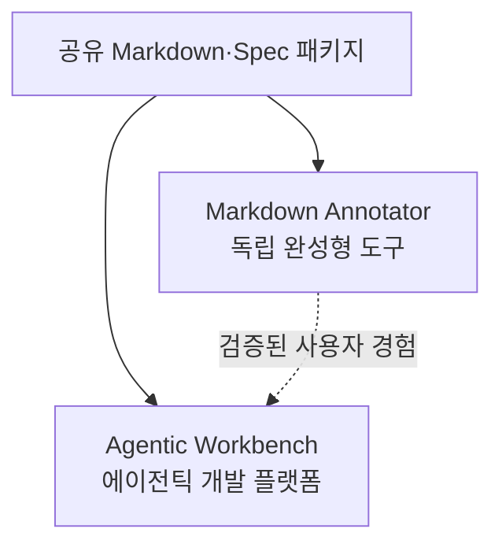
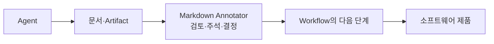
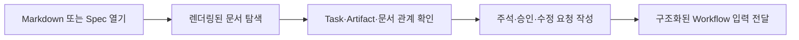

# 마크다운 어노테이터 제품화 전략

## 배경

현재 Agentic Workspace의 기능별 완성도에는 차이가 있다.

- 파일 정보와 Git 정보를 보여주는 영역은 아직 핵심 사용자 경험으로 내세우기에 완성도가 낮다.
- Markdown 표시 기능은 Spec의 Task 표시 기능과 함께 꾸준히 성숙하고 있다.
- 상대적으로 검증된 Markdown 경험을 먼저 독립 제품으로 완성하면 제품 방향과 사용자 가치를 더 빠르게 검증할 수 있다.

## 전략적 판단

**Markdown Annotator를 독립 제품 수준으로 먼저 완성한다.**

Agentic Workbench의 모든 영역을 동시에 끌어올리기보다 현재 강점이 형성되고 있는 Markdown·Spec 경험에 우선 집중한다. 이후 Agentic Workbench는 완성된 Markdown 기능을 재사용하면서 Git, 에이전트, 워크플로를 통합하는 상위 플랫폼으로 발전시킨다.

> Markdown Annotator를 먼저 명확한 문제를 해결하는 독립 제품으로 완성하고, Agentic Workbench는 이를 포함해 Git·에이전트·워크플로를 통합하는 상위 플랫폼으로 발전시킨다.

## 분리 원칙

제품 경계와 코드 경계를 구분한다.

### 제품은 분리한다

- Markdown Annotator를 독립적으로 실행하고 배포할 수 있게 한다.
- Markdown 문서 탐색, 주석, Spec과 Task 표시 및 편집에 집중한다.
- Git 그래프, worktree, 에이전트 세션 관리를 독립 제품의 완료 조건에 포함하지 않는다.

### 핵심 구현은 공유한다

- Markdown 파싱과 문서 구조 모델
- 주석 도메인 모델과 프롬프트 변환
- Spec Task 추출과 상태 표시
- Mermaid 및 코드 블록 렌더링
- 재사용 가능한 Markdown UI 컴포넌트

공통 기능은 `packages/markdown-annotation-core`와 `packages/markdown-annotation-react`에 유지하여 Markdown Annotator와 Agentic Workbench가 함께 사용한다.

## Markdown Annotator의 제품 역할

Markdown Annotator는 단순한 Markdown 뷰어가 아니라, **Workflow에서 Agent가 읽는 Data와 생성한 Artifact를 사용자가 검토하고 다음 실행 입력으로 연결하는 문서 작업 도구**를 지향한다.

Agentic Workbench의 목표·수단·구성요소 관계에서 Markdown Annotator는 다음 위치를 가진다.

- Agent가 읽어야 할 요구사항, Spec, 결정과 프로젝트 규칙을 탐색한다.
- Agent가 생성한 설계, Task, 보고서와 검증 결과를 Artifact로 보여준다.
- 사용자의 주석, 승인과 수정 요청을 구조화된 Workflow 입력으로 변환한다.
- 문서의 출처, 관계, 상태와 최신성을 이해할 수 있게 한다.

초기 기본 Workflow에서 Markdown Annotator가 지원할 필수 검토 지점은 세 곳이다.

| Gate | 검토 내용 |
|---|---|
| Spec 승인 | 사용자 시나리오, 요구사항, 제외 범위, 완료 조건 |
| 설계 승인 | 기술 설계, 변경 대상, Task·의존성·병렬화 계획, 검증 전략 |
| 최종 결과 리뷰 | 변경 요약, 주요 Diff, 테스트 결과, 완료 조건 충족 여부, 미해결 위험 |

각 Gate에서 사용자는 `승인`, `수정 요청`, `중단`을 선택한다. 수정 요청은 문서 주석과 함께 해당 Artifact를 만든 단계로 전달된다.

핵심 사용 흐름은 다음과 같다.

## 문서와 Artifact 관리

Agent가 안정적으로 작업하려면 단순한 파일 목록보다 문서의 의미와 관계를 관리해야 한다.

- 문서의 목적과 적용 범위
- 관련 Workflow, Run과 Task
- 작성자 또는 생성 Agent
- 버전과 최신성
- 입력 문서와 파생 Artifact 관계
- 검토, 승인과 수정 요청 상태
- 다음 단계에서 필요한 전달 범위

Markdown Annotator는 모든 지식 저장소를 직접 구현하기보다, 이러한 메타데이터와 관계를 사람이 확인하고 교정할 수 있는 리뷰 표면을 제공한다.

## 우선 완성 범위

### 문서 탐색과 렌더링

- Markdown 파일을 안정적으로 열고 탐색한다.
- 제목 구조와 목차를 제공한다.
- Mermaid와 코드 블록을 정확히 표시한다.
- 대용량 문서에서도 탐색과 렌더링 성능을 유지한다.
- 로딩, 빈 문서, 파싱 실패 등 예외 상태를 명확하게 보여준다.

### 주석 작업

- 문서의 특정 구간에 주석을 작성한다.
- 주석을 수정, 삭제하고 해결 상태로 관리한다.
- 원문 변경 후에도 가능한 범위에서 주석 위치를 유지한다.
- 여러 주석을 구조화된 작업 요청으로 변환한다.

### Spec과 Task 연계

- Spec 문서의 Task를 탐색하고 상태를 표시한다.
- Task와 관련 Markdown 구간을 연결한다.
- 완료 여부와 문서 변경 사항을 함께 확인한다.
- Task 단위로 에이전트에게 전달할 컨텍스트를 구성한다.

### Artifact 리뷰

- Artifact의 생성 Agent, 관련 Task와 Workflow Run을 표시한다.
- 입력 문서와 결과 Artifact의 관계를 확인한다.
- 검토 대기, 승인, 수정 요청과 폐기 상태를 관리한다.
- 리뷰 결과를 다음 Workflow Transition의 입력으로 전달한다.
- 완료 조건과 테스트·Artifact 근거의 연결을 보여준다.
- 최종 승인과 실제 저장소 병합을 별도 행위로 구분한다.

### 에이전트 연결

- 선택한 문서와 주석을 구조화된 프롬프트로 내보낸다.
- 사용자가 전달 범위와 내용을 검토할 수 있게 한다.
- 초기에는 특정 에이전트 실행 기능보다 이식 가능한 출력 포맷을 우선한다.
- 장기적으로는 프롬프트 내보내기를 넘어 Artifact Review와 Decision Gate 결과를 Workflow Runtime에 직접 전달한다.

### 독립 제품 품질

- 독립 실행과 배포가 가능하다.
- 최근 문서와 작업 상태를 복원한다.
- 파일 변경을 안전하게 감지하고 새로고침한다.
- 오류 메시지와 복구 동작을 제공한다.
- 주요 재사용 컴포넌트를 Storybook에 등록한다.

## 당분간 분리할 범위

다음 기능은 Agentic Workbench 또는 Git Explorer의 별도 트랙으로 유지한다.

- Git 저장소 요약과 상태 표시
- 커밋 그래프와 diff 탐색
- 브랜치 및 worktree 관리
- ACP 에이전트 세션 실행
- 권한 승인과 실행 로그 스트리밍
- 프로젝트 전반의 워크플로 오케스트레이션

이 기능을 Markdown Annotator의 제품화 완료 조건에 포함하면 범위가 다시 커지고, 이미 강점이 형성된 Markdown 경험의 완성이 늦어질 수 있다.

## 제품화 단계

### 1단계: 핵심 경험 안정화

- Markdown 렌더링과 파일 탐색의 오류를 정리한다.
- 주석 생성부터 프롬프트 내보내기까지의 대표 흐름을 완성한다.
- Spec Task 표시와 문서 구간 연결을 안정화한다.

### 2단계: 독립 앱 완성

- 앱 실행, 설정, 상태 복원과 배포 흐름을 다듬는다.
- 빈 상태, 오류 상태, 대용량 문서 등 경계 조건을 처리한다.
- 독립 앱 기준의 사용성 검증을 진행한다.

### 3단계: Agentic Workbench 재통합

- 검증된 Markdown·Spec 기능을 공유 패키지로 Agentic Workbench에 제공한다.
- 문서의 Task, Artifact와 Workflow Run을 연결한다.
- 주석, 승인과 수정 요청을 Decision Gate 결과로 전달한다.
- Markdown Annotator의 독립성을 유지하면서 상위 플랫폼과의 연동을 확장한다.

Workbench의 Gate에서는 공유 리뷰 컴포넌트를 사용한 내장 화면을 기본으로 제공한다. 사용자는 필요할 때 동일한 Artifact와 리뷰 상태를 독립 Markdown Annotator에서 더 깊게 검토할 수 있다.

## 성공 기준

- 사용자가 Markdown 또는 Spec 문서를 열어 구조를 빠르게 파악할 수 있다.
- 사용자가 문서의 특정 부분에 수정 요청을 남길 수 있다.
- 주석과 Task를 에이전트가 실행할 수 있는 입력으로 변환할 수 있다.
- Agent가 읽은 문서와 생성한 Artifact의 관계를 확인할 수 있다.
- 사용자의 리뷰 결과가 다음 Workflow 단계에 구조적으로 전달된다.
- 독립 앱의 핵심 흐름이 Git이나 ACP 기능 없이도 완결된다.
- 동일한 Markdown·Spec 기능을 Agentic Workbench에서 중복 구현 없이 재사용할 수 있다.

## 결론

Markdown Annotator의 독립 제품화는 Agentic Workbench를 포기하거나 기능을 영구적으로 분리하는 결정이 아니다. 현재 가장 성숙한 사용자 경험을 먼저 완성하고 검증한 뒤, 이를 Agentic Workbench에서 Agent와 Data, Artifact와 사용자 결정을 연결하는 핵심 리뷰 모듈로 사용하는 단계적 전략이다.
