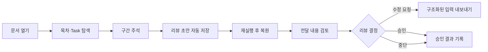
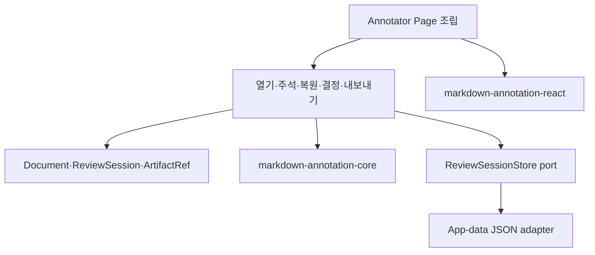
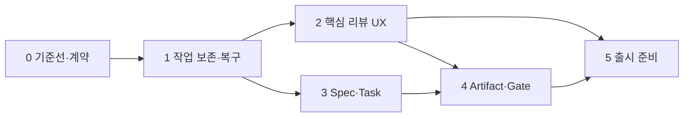

# Markdown Annotator 독립 제품화 작업 계획

## 목적

`docs/20260801-markdown-annotator-product-strategy.md`의 방향을 실제 개발 순서로 구체화한다. Markdown Annotator(MA)를 Git 저장소나 ACP 세션 없이도 완결되는 **범용 Markdown Review & Annotation 데스크톱 제품**으로 만든다.

첫 출시의 핵심 약속은 다음과 같다.

> 사용자는 로컬 Markdown 문서를 안전하게 열고 탐색하며, 특정 구간에 피드백을 남기고, 작업을 중단했다가 다시 이어서, 검토 결과를 에이전트가 실행할 수 있는 구조화된 입력으로 전달할 수 있다.

## 현황과 간극

현재 구현은 다음 기반을 이미 갖추고 있다.

- 로컬 파일, 내장 예제, CLI와 wikilink를 통한 문서 열기
- 공유 패키지 기반 Markdown/GFM, 목차, Mermaid와 체크리스트 렌더링
- 블록·선택 영역 annotation 생성, 수정과 삭제
- 문서 변경 감지, stale 표시와 재시도
- 목표·파일 경로·사용자 지침을 포함한 프롬프트 복사
- Tauri 독립 번들, 일부 Vitest와 Storybook 사례

독립 제품 기준으로 남은 핵심 간극은 다음과 같다.

| 영역 | 현재 상태 | 제품화에 필요한 상태 | 우선순위 |
|---|---|---|---|
| 작업 보존 | annotation이 React 메모리에만 존재 | 앱 재시작과 문서 전환 뒤에도 초안 복원 | P0 |
| 대표 흐름 | 열기·주석·복사는 연결됨 | 실패·충돌·복구까지 포함한 일관된 리뷰 세션 | P0 |
| 문서 변경 대응 | stale 감지와 재읽기 중심 | annotation 재결합 결과를 사용자가 확인·교정 | P0 |
| 화면 구조 | `AnnotatorPage.tsx`에 대부분의 orchestration 집중 | 기능별 상태·유스케이스 분리와 테스트 가능한 경계 | P1 |
| Spec/Task | 체크리스트 렌더링과 진행률 중심 | Task와 문서 구간·내보내기 컨텍스트 연결 | P1 |
| 리뷰 상태 | annotation type 중 `approve`만 존재 | 리뷰 세션의 초안·수정 요청·승인·중단 상태 | P1 |
| Artifact 관계 | 별도 모델 없음 | 출처·관련 Task·검토 상태를 보여주는 최소 메타데이터 | P2 |
| 배포 품질 | 번들 생성 가능 | 설치·업데이트·서명·릴리스 검증과 사용자 문서 | P1 |

## 범위 원칙

### 첫 안정 릴리스에 포함

- 단일 사용자, 로컬 우선 문서 리뷰
- 문서별 annotation과 리뷰 초안 영속화
- 최근 문서와 마지막 작업 상태 복원
- 원문 변경 뒤 annotation 위치 복구와 충돌 처리
- Spec/Task 읽기, 연결과 프롬프트 내보내기
- 문서 단위 리뷰 결과(`draft`, `changes-requested`, `approved`, `stopped`)
- macOS 우선 독립 설치와 릴리스 검증

### 첫 안정 릴리스에서 제외

- Git 그래프, diff, branch와 worktree 관리
- ACP 에이전트 실행과 로그 스트리밍
- 다중 사용자 동시 편집과 클라우드 동기화
- 범용 프로젝트 관리 또는 지식 저장소
- 자동 병합과 저장소 배포 승인
- 제품 UI에서 내장 예제 문서를 선택·브라우징하는 기능

Artifact와 Workflow Run 연계는 데이터 계약을 먼저 정의하되, 실제 런타임 연결은 MA의 핵심 리뷰 흐름이 안정된 뒤 진행한다.

## 목표 사용자 흐름



## 구현 원칙과 목표 구조

- `packages/markdown-annotation-core`는 파싱, anchor 재결합, Task 추출과 출력 포맷 같은 순수 도메인 로직의 정본으로 유지한다.
- `packages/markdown-annotation-react`는 앱 상태나 Tauri API를 소유하지 않는 재사용 UI를 유지한다.
- MA의 `entities`에는 문서, 리뷰 세션, annotation 저장 모델과 adapter를 둔다.
- MA의 `features`에는 문서 열기, annotation 편집, 리뷰 복원, 결과 내보내기와 결정 기록 유스케이스를 둔다.
- `pages/annotator`는 화면 조립과 라우팅 상태만 담당한다.
- Tauri command는 application service에 위임하고, 파일·저장소 구현은 infrastructure에 둔다.
- 저장 포맷에는 `schemaVersion`을 포함하고 원본 Markdown 파일을 수정하지 않는 sidecar/app-data 방식을 기본으로 한다.



## 단계별 작업 계획

### 0단계 — 기준선과 제품 계약 확정

목표는 기능 추가 전에 출시 범위와 회귀 기준을 고정하는 것이다.

- [ ] 대표 시나리오를 `열기 → 탐색 → 주석 → 재실행 복원 → 프롬프트 복사`로 고정한다.
- [ ] 1차 지원 파일 형식(`.md`, `.markdown`, `.mdx`)과 인코딩·최대 권장 크기를 명시한다.
- [ ] `ReviewSession`, `ReviewDecision`, `DocumentIdentity`, `ArtifactRef` 데이터 계약을 정의한다.
- [ ] annotation 저장 위치, 보존 기간, 원문 삭제 시 정책과 schema migration 정책을 결정한다.
- [ ] 현재 렌더링·자동 새로고침·wikilink·CLI 테스트를 기준선으로 실행하고 알려진 실패를 기록한다.
- [ ] 대표 문서 fixture에 일반 문서, 대용량 문서, Spec, Tasks, Mermaid 오류와 외부 변경 사례를 포함한다.
- [ ] 예제 Markdown은 사용자 기능이 아니라 자동 테스트와 Storybook fixture로만 유지한다.

완료 조건:

- 첫 안정 릴리스의 포함/제외 범위와 데이터 계약에 미결정 P0 항목이 없다.
- 대표 흐름을 재현하는 수동 quickstart와 자동화 가능한 acceptance scenario가 있다.

### 1단계 — 작업 보존과 복구

목표는 사용자의 피드백이 앱 종료나 파일 변경으로 유실되지 않게 하는 것이다.

- [ ] 문서 identity를 정규화된 경로와 content fingerprint로 정의한다.
- [ ] `ReviewSessionStore` port와 app-data JSON adapter를 구현한다.
- [ ] 문서별 annotation, 프롬프트 설정, 리뷰 결정과 마지막 선택 탭을 자동 저장한다.
- [ ] 최근 문서 목록과 마지막 활성 문서를 복원하되, 존재하지 않거나 권한이 없는 파일은 복구 UI로 보낸다.
- [ ] atomic write, 손상 파일 격리, schema version migration과 백업 복구를 구현한다.
- [ ] 외부 변경 시 anchor 재결합 결과를 `유지`, `이동`, `충돌`, `고아`로 분류한다.
- [ ] 충돌·고아 annotation을 원래 context와 후보 위치를 비교해 재연결하거나 폐기할 수 있게 한다.

완료 조건:

- 강제 종료 후 재실행해도 저장이 끝난 annotation과 프롬프트 설정이 복원된다.
- 문서가 이동·수정·삭제된 각 경우에 데이터가 조용히 유실되거나 다른 문서에 잘못 결합되지 않는다.
- 저장 파일 손상 시 앱이 실행되며 복구 또는 초기화 선택지를 제공한다.

### 2단계 — 핵심 리뷰 경험 완성

목표는 문서 한 개의 검토를 처음부터 끝까지 빠르고 예측 가능하게 수행하는 것이다.

- [ ] `AnnotatorPage`의 문서 lifecycle, annotation state, prompt state와 watcher orchestration을 feature/model 단위로 분리한다.
- [ ] 시작 화면을 최근 폴더·최근 문서, 폴더 열기, 파일 열기와 CLI 안내 중심으로 정리한다.
- [ ] 제품 UI와 production bundle에서 내장 예제 selector와 example 전용 navigation 분기를 제거한다.
- [ ] 로딩, 빈 문서, 지원하지 않는 파일, 읽기 실패, 파싱 경고와 Mermaid 실패 상태에 복구 action을 제공한다.
- [ ] annotation 목록에서 유형·상태 필터, 원문 위치 이동, 수정·삭제·해결 처리를 제공한다.
- [ ] 키보드만으로 문서 탐색, annotation 생성과 내보내기가 가능하게 한다.
- [ ] 프롬프트 미리보기에서 전달 파일, annotation 범위, 사용자 지침과 제외 항목을 최종 확인하게 한다.
- [ ] 클립보드 실패 fallback으로 파일 저장 또는 전체 선택 가능한 결과 화면을 제공한다.
- [ ] 대용량 문서의 파싱·렌더링·목차 이동 성능 예산을 정하고 측정한다.

완료 조건:

- 신규 사용자가 별도 설명 없이 대표 흐름을 완료할 수 있다.
- 모든 오류 상태에 원인과 다음 action이 표시된다.
- 5MB 또는 합의된 상한 fixture에서 UI가 장시간 멈추지 않고 성능 예산을 만족한다.

### 3단계 — Spec과 Task 리뷰

목표는 일반 체크리스트 표시를 넘어 문서 구간과 실행 단위를 연결하는 것이다.

- [ ] 공유 core에 Task identity, 상태, source range와 chapter 관계를 명시하는 모델을 확정한다.
- [ ] `spec.md`, `plan.md`, `tasks.md`를 같은 디렉터리의 관련 문서 묶음으로 탐색할 수 있게 한다.
- [ ] Task를 선택하면 원문 구간으로 이동하고 관련 annotation을 함께 보여준다.
- [ ] annotation 또는 문서 구간을 하나 이상의 Task와 연결한다.
- [ ] Task별로 필요한 문서 context와 annotation만 선택해 프롬프트를 생성한다.
- [ ] 외부 파일 변경으로 Task 상태가 바뀌면 리뷰 세션과 비교해 변경 사항을 표시한다.

완료 조건:

- 사용자가 특정 Task의 요구사항·설계 근거·수정 요청을 한 번에 내보낼 수 있다.
- Task source line 변경 뒤에도 잘못된 Task로 annotation이 조용히 연결되지 않는다.
- 일반 Markdown 사용자는 Spec 전용 UI 없이 기존 흐름을 유지한다.

### 4단계 — Artifact 리뷰와 Decision Gate

목표는 리뷰 결과를 다음 workflow가 소비할 수 있는 명시적 계약으로 만드는 것이다.

- [ ] `ArtifactRef`에 출처, 생성 주체, 관련 Task, 입력 문서, 생성 시각과 버전을 표현한다.
- [ ] 문서 단위 `draft`, `changes-requested`, `approved`, `stopped` 상태와 결정 사유를 기록한다.
- [ ] 승인과 저장소 병합을 UI와 데이터 모델에서 별도 행위로 유지한다.
- [ ] 내보내기 포맷에 review session id, artifact 관계, decision, annotation과 task context를 포함한다.
- [ ] 사람이 읽는 Markdown과 기계가 읽는 versioned JSON 출력을 함께 제공한다.
- [ ] Workflow Runtime이 없어도 파일/클립보드 export만으로 흐름이 완결되게 한다.
- [ ] AW가 같은 계약을 adapter로 소비할 수 있는 contract test를 추가한다.

완료 조건:

- Spec 승인, 설계 승인, 최종 결과 리뷰 세 시나리오를 동일한 상태 모델로 표현할 수 있다.
- 같은 입력에서 JSON export가 결정적으로 생성되고 schema validation을 통과한다.
- MA는 AW 또는 ACP 없이도 리뷰 결정과 결과 전달을 완료한다.

### 5단계 — 독립 앱 출시 준비

목표는 개발 환경이 아닌 설치된 앱으로 신뢰성 있게 사용할 수 있게 하는 것이다.

- [ ] 앱 아이콘과 native About 메뉴를 제공하고 제품 설명, 지원 형식, 버전·commit·tag, 라이선스와 로컬 저장 원칙을 표시한다.
- [ ] homepage·사용자 문서·문제 보고 링크는 실제 공개 URL을 확정한 뒤 연결한다.
- [ ] third-party notices의 생성·배포·표시 경로를 정리한다.
- [ ] CALVER를 빌드 시점에 주입해 release candidate와 stable artifact를 생성한다.
- [ ] macOS 서명·notarization·설치·삭제·업그레이드 경로를 검증한다.
- [ ] CLI 설치의 PATH 안내, 재설치, 제거와 앱 이동 후 복구를 검증한다.
- [ ] 이전 schema의 review session migration과 downgrade 실패 메시지를 검증한다.
- [ ] clean machine smoke test와 RC 사용자 검증을 수행한다.
- [ ] crash/error 진단 정보를 민감한 문서 내용 없이 내보낼 수 있게 한다.
- [ ] 릴리스 체크리스트와 rollback 절차를 문서화한다.

완료 조건:

- clean macOS 환경에서 설치, 문서 열기, 복원, 내보내기, CLI와 업그레이드 시나리오가 통과한다.
- 치명적 데이터 유실, 문서 오결합과 blocker 접근성 문제가 없다.
- RC 피드백에서 대표 흐름 완료율과 실패 원인이 기록된다.

## 의존성과 병렬화



- 0단계 데이터 계약 전에는 저장 adapter 구현을 시작하지 않는다.
- 1단계의 저장·복구 기반이 끝나면 2단계 UX와 3단계 Spec/Task를 병렬 진행할 수 있다.
- 5단계의 서명·패키징 spike와 사용자 문서 초안은 일찍 시작할 수 있지만, stable 출시는 4단계 export 계약 이후로 둔다.
- 공유 패키지 변경은 MA와 AW의 contract/test를 함께 통과시켜 회귀를 방지한다.

## 권장 PR 분할

| PR | 범위 | 선행 조건 |
|---|---|---|
| PR 1 | 제품 계약, fixture와 baseline acceptance test | 없음 |
| PR 2 | `ReviewSession` 도메인과 저장 port | PR 1 |
| PR 3 | app-data JSON 저장, migration과 복구 | PR 2 |
| PR 4 | 최근 문서·세션 복원 UI | PR 3 |
| PR 5 | anchor 재결합 상태와 충돌 해결 UI | PR 3 |
| PR 6 | `AnnotatorPage` orchestration 분리 | PR 2 |
| PR 7 | 오류·빈 상태·접근성·내보내기 UX | PR 4, PR 6 |
| PR 8 | Task 모델과 문서 묶음 탐색 | PR 1 |
| PR 9 | Task 연결과 범위 내보내기 | PR 5, PR 8 |
| PR 10 | Artifact·Decision 계약과 JSON export | PR 7, PR 9 |
| PR 11 | AW contract adapter와 양쪽 회귀 테스트 | PR 10 |
| PR 12 | RC 패키징, migration과 clean-machine 검증 | PR 10 |

각 PR은 도메인/adapter/UI/검증을 가능한 한 하나의 사용자 가치 단위로 닫고, 중간 상태에서도 앱이 빌드되고 기존 문서를 열 수 있게 한다.

## 검증 전략

### 자동 검증

- core: parser, Task 추출, fingerprint, anchor 재결합과 export golden test
- React: annotation·충돌 해결·빈 상태 컴포넌트 interaction test와 Storybook
- MA frontend: 문서 전환, 자동 저장, 복원, 외부 변경과 export integration test
- Rust: 경로 검증, atomic write, watcher lifecycle, schema migration과 손상 저장소 복구 test
- contract: MA export schema와 AW adapter 호환성 test
- 성능: 대용량 fixture의 parse/render 시간과 메모리 기준 회귀 test

기본 검증 명령은 다음과 같다.

```sh
pnpm --filter @yoophi/markdown-annotation-core test
pnpm --filter @yoophi/markdown-annotation-react test
pnpm --filter @yoophi/markdown-annotator check-types
pnpm --filter @yoophi/markdown-annotator test
pnpm --filter @yoophi/markdown-annotator build
pnpm build-storybook:annotator
cd apps/markdown-annotator/src-tauri && cargo test && cargo check
```

공유 패키지를 변경한 PR은 AW의 타입 검사와 관련 Markdown 테스트도 함께 실행한다.

### 수동 acceptance 시나리오

1. Finder, 앱 파일 선택기와 `ma` CLI에서 각각 문서를 연다.
2. wikilink로 관련 문서를 이동하고 원래 문서의 리뷰 상태가 유지되는지 확인한다.
3. 여러 블록에 annotation을 남긴 뒤 앱을 종료·재실행해 복원을 확인한다.
4. 외부 editor에서 원문을 삽입·삭제·이동하고 annotation 재결합과 충돌 해결을 확인한다.
5. Task를 선택해 관련 문서 구간과 피드백만 내보낸다.
6. 수정 요청 또는 승인을 기록하고 Markdown/JSON 결과를 검증한다.
7. 읽기 권한 제거, 파일 삭제, 손상 저장소와 clipboard 실패에서 복구한다.
8. release artifact를 clean machine에 설치하고 이전 RC에서 업그레이드한다.

## 출시 판단 지표

| 관점 | 지표 |
|---|---|
| 흐름 완결성 | 대표 시나리오를 외부 도움 없이 완료한 비율 |
| 신뢰성 | 데이터 유실·다른 문서 오결합 0건 |
| 복구성 | 외부 변경 충돌이 감지되고 사용자가 해결 가능한 비율 |
| 효율 | 문서 열기부터 첫 annotation, 리뷰 완료까지 걸린 시간 |
| 품질 | P0/P1 결함, crash-free session, 접근성 blocker 수 |
| 재사용 | 공유 기능에 대한 MA/AW 중복 구현 추가 0건 |

## 즉시 착수 순서

문서 브라우징 이식의 상세 소스 분석과 seam은 `docs/20260802-markdown-browser-migration-preparation.md`를 따른다.

1. 0단계 산출물로 `ReviewSession`, 저장 정책과 `DocumentBrowserSnapshot`을 SpecKit feature spec으로 확정한다.
2. PR 1에서 현재 대표 흐름과 `폴더 열기 → 문서 탐색 → 문서별 annotation 복원` acceptance fixture를 고정한다.
3. 문서별 review session 영속화를 먼저 구현한 뒤 MM 기반 browser backend와 tree model을 연결한다.
4. 영속화·복원·anchor 충돌 처리와 root watcher lifecycle을 완성한다.
5. 단일 페이지 책임을 분리하면서 핵심 리뷰 UX를 닫는다.
6. 이후 Spec/Task와 Artifact Gate를 수직 슬라이스로 추가한다.

첫 번째 사용자 가치 마일스톤은 **“문서를 검토하다 앱을 닫거나 원문이 바뀌어도 피드백을 잃지 않고 다시 이어서 프롬프트로 전달한다”**이다. 이 마일스톤이 독립 제품의 신뢰 기반이며, 이후 Spec/Task와 Workflow 연계의 선행 조건이다.
