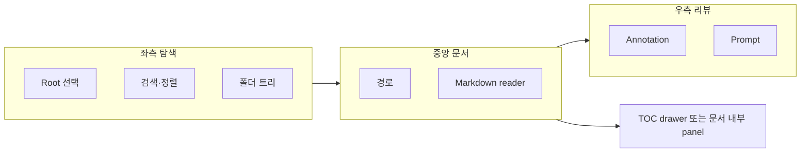
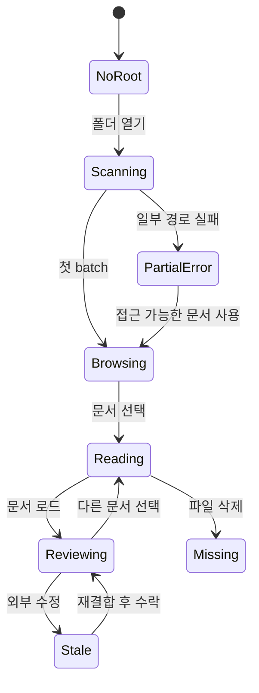
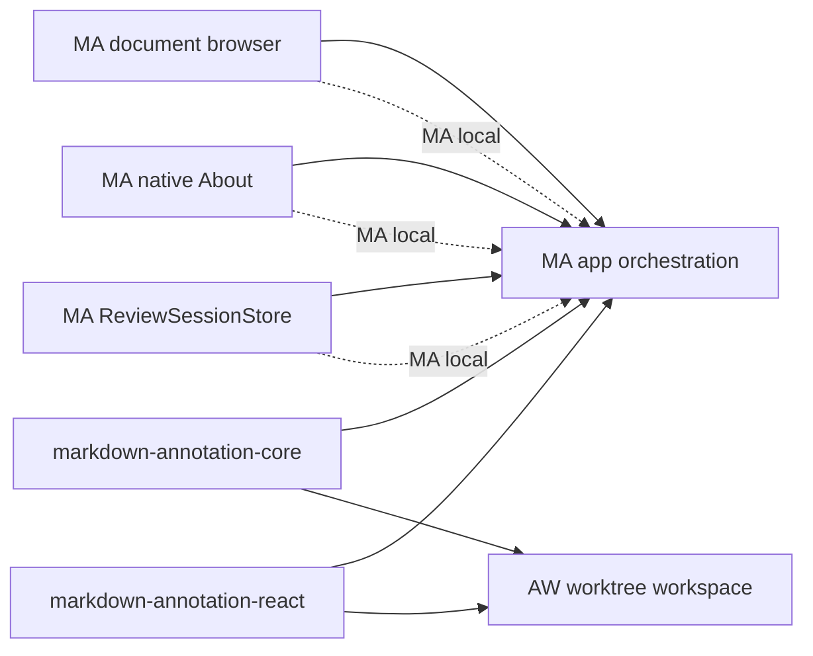

# Markdown Annotator 문서 브라우저 이식 준비

## 목적

Markdown Annotator(MA)가 단일 파일을 여는 도구를 넘어, 폴더의 Markdown 문서를 편리하게 탐색하고 문서별 annotation을 작성하는 독립 앱이 되도록 `~/project/markmini`(MM)와 `~/project/markdeck`(MD)의 구현을 분석하고 이식 seam과 실행 순서를 정한다.

이 문서는 기능 구현 전 준비 산출물이다. 원본 코드를 통째로 복사하지 않고, MA의 Feature-Sliced Design과 Tauri 헥사고날 구조에 맞게 동작과 테스트를 이식한다.

## 제품 목표


첫 번째 완성 흐름은 다음과 같다.

1. 사용자가 폴더를 연다.
2. 스캔이 끝나기 전부터 발견된 문서가 트리에 점진적으로 표시된다.
3. 사용자가 검색·정렬·폴더 접기/펼치기로 문서를 찾는다.
4. 문서를 전환해도 각 문서의 annotation 초안이 유지된다.
5. 외부 파일 변경은 현재 문서와 트리에 안전하게 반영된다.

## 프로젝트별 분석

### MM에서 이식할 동작

MM은 MA와 동일한 Tauri 2, React, TypeScript, Vite, Zustand 조합이므로 주 소스로 삼는다.

| 영역 | MM 구현 | MA 적용 판단 |
|---|---|---|
| 실행 대상 | 디렉터리 또는 Markdown 파일을 root/selected file로 정규화 | 채택. 기존 `ma file.md`와 `ma folder/`를 함께 지원 |
| 점진 스캔 | Rust background thread가 64개 단위 progress event emit | 채택. 큰 폴더의 first-result latency 개선 |
| 파일 metadata | 상대 경로, 수정 시각, 크기 | 채택. 트리 정렬·보조 정보에 사용 |
| 제외 규칙 | `.git`, `node_modules`, `target`, `dist`, `.next` | 기본값으로 채택하되 MA 정책으로 명시 |
| 경로 안전 | canonical root 밖 symlink 차단, 목록에 있는 상대 경로만 읽기 | 반드시 채택 |
| watcher | window별 recursive watcher, tree change와 content change 구분 | 개념 채택. MA의 기존 watcher lifecycle과 통합 |
| 트리 UI | 검색, 강조, 이름/경로/수정일/크기 정렬, 확장 상태 | 채택. shadcn base-ui에 맞춰 재작성 |
| 최근/즐겨찾기 | root별 local storage | 최근 문서 우선 채택, 즐겨찾기는 P1 |
| 경쟁 요청 방지 | document load token으로 오래된 응답 무시 | 반드시 채택 |
| multi-window | root별 독립 session과 watcher | 기존 MA 창/탭 모델과 조정 후 P1 |

직접 복사하지 않을 부분:

- MM의 Markdown renderer, TOC와 Mermaid 구현: MA 공유 패키지가 정본이다.
- MM의 큰 단일 Zustand store: 브라우저 상태와 annotation 리뷰 상태를 분리한다.
- MM의 `src-tauri/src/lib.rs` 단일 파일 구조: MA의 domain/application/inbound/infrastructure 계층으로 분해한다.
- `HOME` 환경 변수에 직접 의존하는 기본 root 선택: 앱 설정 또는 dialog 흐름을 우선한다.

### MD에서 참고할 동작

MD는 Electron/Node 기반이므로 구현보다 제품 UX와 seam을 참고한다.

| 영역 | MD 구현 | MA 적용 판단 |
|---|---|---|
| 콘텐츠 root 선택 | 폴더 선택, 최근 root, 존재하지 않는 root 정리 | 채택 |
| tree 조회 | directory node를 필요할 때 lazy load | 대규모 root 성능 측정 후 P1 선택 |
| 확장 상태 | root scope별 펼친 폴더 복원 | 채택 |
| reader layout | tree/document/feedback/TOC 표시와 폭 복원 | 개념 채택, MA annotation panel에 맞춰 단순화 |
| breadcrumb | 현재 문서의 root-relative 위치 표시 | 채택 |
| recent/pinned | 최근 문서와 고정 문서 | recent는 P0, pinned는 P1 |
| application seam | content root use case와 repository/watcher adapter 분리 | MA Rust 구조 설계에 참고 |

직접 이식하지 않을 부분:

- Electron preload, IPC와 Node filesystem 구현
- URL route 중심 문서 navigation
- 웹/데스크톱 이중 platform abstraction
- MA의 annotation core와 겹치는 MD feedback 모델

## 이식 우선순위

### P0 — 단독 제품의 기본 브라우징

- 폴더 선택과 최근 폴더 열기
- Markdown 점진 스캔과 진행·부분 실패 상태
- 검색 가능한 폴더 트리
- 문서 선택과 현재 경로 표시
- 현재 문서 외부 변경 및 파일 추가·삭제·이름 변경 반영
- 문서별 annotation 상태 분리
- canonical root 밖 경로와 symlink 차단
- 내장 예제 selector와 example 전용 문서 전환 제거

### P1 — 반복 사용 효율

- 이름, 경로, 수정 시각과 크기 정렬
- 폴더 확장 상태 복원
- 최근 문서와 즐겨찾기
- resizable tree/document/annotation layout
- root를 받는 CLI와 root별 multi-window

### 보류

- 전체 내용 검색
- 문서 생성·이름 변경·삭제
- 파일 이동과 drag-and-drop
- lazy directory scan
- 여러 root를 한 창에 결합

## 목표 도메인 모델

```ts
type DocumentRoot = {
  absolutePath: string;
  displayName: string;
};

type MarkdownDocumentEntry = {
  relativePath: string;
  modifiedAt: number | null;
  sizeBytes: number | null;
};

type DocumentBrowserSnapshot = {
  root: DocumentRoot;
  documents: MarkdownDocumentEntry[];
  selectedRelativePath: string | null;
  scanStatus: "scanning" | "completed" | "error";
  skippedPaths: string[];
  error: string | null;
};

type DocumentChange = {
  changedRelativePaths: string[];
  treeChanged: boolean;
};
```

annotation은 root-relative 경로만으로 식별하지 않는다. 향후 root 이동과 파일 변경을 견딜 수 있도록 제품화 계획의 `DocumentIdentity`와 결합한다.

```ts
type ReviewDocumentKey = {
  canonicalRoot: string;
  relativePath: string;
  contentFingerprint: string;
};
```

## 목표 모듈과 seam

### 백엔드

호출자가 알아야 할 외부 인터페이스는 작게 유지한다.

```rust
pub trait DocumentBrowser {
    fn open_root(&self, target: OpenTarget) -> Result<BrowserSnapshot, BrowserError>;
    fn refresh(&self, session_id: &str) -> Result<BrowserSnapshot, BrowserError>;
    fn read_document(
        &self,
        session_id: &str,
        relative_path: &str,
    ) -> Result<MarkdownDocument, BrowserError>;
}
```

실제 Tauri command는 직렬화와 window/session 식별만 담당하고 application module에 위임한다. 다음 복잡성은 infrastructure adapter 안에 숨긴다.

- 디렉터리 순회와 batch progress
- 제외 디렉터리 정책
- canonical path와 symlink 검증
- metadata 수집
- recursive watcher와 event 분류
- window 파괴 시 watcher/session 정리

호출자는 filesystem adapter의 세부 interface를 알 필요가 없다. 로컬 파일시스템 seam은 browser module 내부에 두고 실제 임시 디렉터리를 사용하는 테스트로 검증한다. watcher도 별도 public port로 노출하지 않고 같은 module의 내부 seam으로 둔다.

### 프론트엔드

브라우저 feature는 annotation 구현을 알지 않는다.

```ts
type DocumentBrowserModel = {
  snapshot: DocumentBrowserSnapshot | null;
  query: string;
  sort: { mode: "name" | "path" | "modified" | "size"; direction: "asc" | "desc" };
  expandedPaths: ReadonlySet<string>;
  openRoot(): Promise<void>;
  selectDocument(relativePath: string): Promise<MarkdownDocument>;
  refresh(): Promise<void>;
};
```

`selectDocument`의 결과만 annotator workspace에 전달한다. 리뷰 상태는 `ReviewSessionStore`가 문서 identity별로 소유한다. 이로써 트리를 교체하거나 search/sort를 변경해도 annotation 로직은 영향을 받지 않는다.

## 목표 디렉터리 구조

```text
apps/markdown-annotator/src/
  pages/annotator/
    AnnotatorPage.tsx                 # browser + reader + review 조립
  features/document-browser/
    model/use-document-browser.ts
    model/document-tree.ts
    ui/DocumentBrowserPanel.tsx
    ui/DocumentTree.tsx
  features/open-document/
    openMarkdownDocument.ts           # 단일 파일/폴더 dialog 진입점
  entities/document/
    api/documentBrowserApi.ts          # Tauri adapter
    model/document-browser.ts
  entities/review-session/
    ...                               # 문서별 annotation 소유

apps/markdown-annotator/src-tauri/src/
  domain/
    document_browser.rs               # 모델·port
  application/
    document_browser_service.rs       # open/scan/read/refresh 규칙
  inbound/
    document_browser_commands.rs      # Tauri command
  infrastructure/
    fs_document_browser.rs            # scan/read/path safety
    fs_document_browser_watcher.rs    # recursive watcher adapter
```

기존 `fs_document_reader.rs`, `fs_document_watcher.rs`, `document_service.rs`는 새 module과 역할이 겹치므로 얇은 wrapper를 추가하지 않는다. 새 interface가 기존 단일 파일 열기와 폴더 browsing을 모두 만족하면 구현을 교체하고 기존 shallow module과 테스트를 정리한다.

## UI 배치

현재 MA의 왼쪽 TOC, 중앙 문서, 오른쪽 annotation/prompt 구성을 다음처럼 바꾼다.



- 데스크톱 기본: tree 260~320px, document flexible, review 360~440px
- 좁은 창: tree와 TOC를 drawer로 전환하고 review panel을 유지
- 문서 집중 모드: tree와 review를 숨길 수 있지만 annotation highlight는 유지
- active 문서의 상위 폴더를 자동 확장하고 선택 항목을 스크롤 영역 안으로 이동

## 상태 전환 규칙



중요 규칙:

- tree scan 실패와 현재 문서 read 실패를 별도 상태로 관리한다.
- tree refresh 때문에 현재 annotation을 초기화하지 않는다.
- 문서 선택 경쟁에서 가장 최근 요청만 화면과 리뷰 세션을 변경한다.
- 삭제된 문서의 review session은 즉시 삭제하지 않고 missing 상태로 보존한다.
- rename은 watcher event만으로 동일 문서라고 추정하지 않고 fingerprint와 사용자 확인을 사용한다.
- 정상 렌더링 확인용 예제 문서는 production browser tree나 시작 화면에 노출하지 않는다.

## 소스 매핑

| MM/MD 근거 | MA 목적지 | 이식 방식 |
|---|---|---|
| MM `src-tauri/src/lib.rs`의 scan/path safety | `infrastructure/fs_document_browser.rs` | 동작과 Rust 테스트 이식 후 계층 분리 |
| MM `populate_session_async` | browser application/infrastructure | batch/event 계약을 MA 명칭으로 재정의 |
| MM `classify_event` | browser watcher | 기존 MA watcher와 통합, event 중복 제거 |
| MM `src/components/file-tree.tsx` 순수 함수 | `features/document-browser/model/document-tree.ts` | 순수 로직과 테스트 이식 |
| MM `FileTree` | `DocumentTree.tsx` | MA UI kit과 접근성 규칙으로 재작성 |
| MM `app-store.ts` load token | `use-document-browser.ts` | 경쟁 요청 방지 규칙만 채택 |
| MM 최근/즐겨찾기 storage | browser view state | review 영속화와 분리해 root scope 저장 |
| MD `content-root-use-cases.js` | browser application | 최근 root와 missing root 처리 규칙 참고 |
| MD `document-tree.tsx` | `DocumentTree.tsx` | active ancestor 확장·상태 복원 참고 |
| MD `document-reader-layout.tsx` | annotator page layout | panel visibility/width persistence만 참고 |

## 구현 준비 작업

### 준비 PR 1 — 계약과 fixture

- [ ] `DocumentBrowserSnapshot`, `MarkdownDocumentEntry`, `DocumentChange` 계약을 확정한다.
- [ ] 지원 확장자를 기존 MA와 맞춰 `.md`, `.markdown`, `.mdx`로 결정한다.
- [ ] 제외 디렉터리와 symlink 정책을 명시한다.
- [ ] nested folders, unreadable folder, outside-root symlink, rename, large tree fixture를 만든다.
- [ ] MM의 관련 테스트를 MA 용어와 observable outcome 기준으로 옮길 목록을 확정한다.
- [ ] 현재 내장 예제 문서는 제품 탐색 데이터가 아니라 test/Storybook fixture로 재분류한다.

### 준비 PR 2 — backend browser module

- [ ] domain model과 application `DocumentBrowser` module interface를 추가한다.
- [ ] 임시 디렉터리 fixture로 open/refresh/read interface 테스트를 먼저 작성한다.
- [ ] filesystem adapter에 streaming scan, metadata와 path safety를 구현한다.
- [ ] Tauri command와 scan progress event adapter를 추가한다.
- [ ] 기존 단일 문서 command가 새 module을 사용하게 해 중복 검증을 제거한다.

### 준비 PR 3 — tree model과 UI

- [ ] build/filter/sort/flatten tree 순수 module을 이식한다.
- [ ] MA Storybook에 empty, scanning, partial error, deep tree와 active item 사례를 추가한다.
- [ ] keyboard navigation과 ARIA tree 동작을 검증한다.
- [ ] 폴더 선택 dialog, recent roots와 breadcrumb를 연결한다.
- [ ] header의 Examples selector를 제거하고 빈 화면을 `폴더 열기`, `파일 열기`, `최근 폴더` action으로 교체한다.

### 준비 PR 4 — annotation workspace 결합

- [ ] `AnnotatorPage`의 단일 `annotations` 배열을 document identity별 review session으로 교체한다.
- [ ] 문서 전환 시 현재 session을 저장하고 대상 session을 복원한다.
- [ ] load token으로 경쟁 요청을 차단한다.
- [ ] tree refresh와 document stale/reload의 event 경로를 분리한다.
- [ ] wikilink도 browser selection을 통해 이동하도록 단일 진입점으로 수렴한다.

### 준비 PR 5 — watcher와 lifecycle

- [ ] 단일 파일 watcher와 root recursive watcher를 하나의 window-scoped 구현으로 통합한다.
- [ ] modify는 현재 문서 reload, create/remove/rename은 tree refresh로 분류한다.
- [ ] debounce와 progress event 중복을 검증한다.
- [ ] 창 파괴, root 교체와 앱 종료 시 watcher가 정리되는지 Rust 테스트를 추가한다.

### 준비 PR 6 — 독립 앱 About와 제품 정보

- [ ] AW의 native menu 구성을 참고해 macOS 앱 메뉴와 Windows/Linux Help 메뉴에 `About Markdown Annotator`를 추가한다.
- [ ] MA `build.rs`가 package version, commit hash와 tag를 빌드 시점에 주입하게 한다.
- [ ] build metadata를 `AppBuildInfo` 하나로 조립해 About 표시와 진단 정보가 같은 값을 사용하게 한다.
- [ ] About에 제품 설명, 지원 문서 형식, 로컬 데이터 처리 원칙과 라이선스 정보를 표시한다.
- [ ] 홈페이지·문서·문제 보고 링크는 실제 공개 URL이 확정된 항목만 제공한다.
- [ ] commit/tag를 얻지 못하는 source archive와 release build에서도 `unknown` fallback으로 dialog가 열린다.

권장 표시 정보:

| 구분 | 내용 |
|---|---|
| 제품 | Markdown Annotator 이름, 아이콘과 한 줄 설명 |
| 빌드 | CALVER release version, short commit, tag |
| 기능 | Markdown 탐색·annotation·구조화된 agent prompt export |
| 지원 형식 | `.md`, `.markdown`, 확정 시 `.mdx` |
| 데이터 | 문서와 annotation이 기본적으로 로컬에 저장됨 |
| 법적 정보 | copyright, license, third-party notices 진입점 |
| 지원 | 문서·homepage·issue tracker 링크가 확정된 경우에만 표시 |

`AppBuildInfo`는 단순한 값 객체로 유지한다.

```rust
pub struct AppBuildInfo {
    pub product_name: &'static str,
    pub version: &'static str,
    pub commit_hash: &'static str,
    pub commit_tag: &'static str,
}
```

native dialog의 문자열 조립과 메뉴 위치는 infrastructure 책임으로 두고, 값 정규화와 `unknown` fallback은 순수 함수로 테스트한다. 초기 버전은 Tauri message dialog로 제공하고, 링크·third-party notices처럼 상호작용이 늘어날 때 별도 About webview dialog로 승격한다.

## 검증 체크리스트

### Backend

- root 밖 absolute path와 `..` traversal을 거부한다.
- root 밖을 가리키는 file/directory symlink를 목록과 read에서 거부한다.
- unreadable directory를 기록하고 나머지 스캔은 계속한다.
- scan batch가 정렬·중복 제거되고 최종 snapshot과 일치한다.
- file modify와 tree change event가 정확히 분류된다.
- window/root별 session과 watcher가 섞이지 않고 정리된다.

### Frontend

- 깊은 경로의 모든 부모 폴더가 보존된다.
- 검색 결과에서 부모 경로와 active 문서가 유지된다.
- 이름·경로·수정 시각·크기 정렬이 결정적이다.
- 오래된 read 응답이 최신 문서를 덮어쓰지 않는다.
- 문서 A → B → A 전환 후 A의 annotation이 복원된다.
- tree refresh가 annotation, prompt 설정과 scroll state를 불필요하게 초기화하지 않는다.
- scanning, empty, partial error, missing와 stale 상태에 복구 action이 있다.

### 통합 acceptance

1. 1,000개 이상의 Markdown 파일이 있는 root를 열고 첫 batch가 빠르게 표시되는지 확인한다.
2. 검색으로 문서를 선택하고 annotation을 만든 뒤 다른 문서와 왕복한다.
3. 외부 editor에서 현재 파일을 수정하고 anchor 재결합 흐름을 확인한다.
4. 파일 추가·rename·삭제 후 tree와 missing review session을 확인한다.
5. root 밖 symlink가 노출되거나 읽히지 않는지 확인한다.
6. 앱 재시작 후 최근 root, active 문서, tree 상태와 review session을 복원한다.
7. 플랫폼별 native 메뉴에서 About을 열고 제품·빌드·로컬 데이터·라이선스 정보를 확인한다.

## 주요 위험과 대응

| 위험 | 대응 |
|---|---|
| MM watcher와 MA watcher를 병렬 유지해 event 중복 | 하나의 window-scoped watcher 구현으로 교체 |
| tree 선택 때 annotation 유실 | browser와 review session 소유권 분리, document identity 기반 복원 선행 |
| 큰 폴더에서 scan/렌더 지연 | batch progress, metadata-only scan, 필요 시 tree virtualization/lazy scan 측정 |
| symlink 또는 상대 경로로 root 탈출 | canonical root 검증을 목록과 read 양쪽에서 수행 |
| `.mdx` 정책 차이 | 계약 단계에서 MA 기존 지원 범위로 통일하고 fixture 추가 |
| MM/MD 코드를 그대로 복사해 아키텍처 퇴행 | observable behavior와 테스트를 이식하고 MA 계층으로 재작성 |
| root 이동 후 review session 고아화 | canonical root+relative path+fingerprint, 사용자 재연결 흐름 |
| About의 링크나 법적 문구가 실제 배포 정보와 불일치 | 확정된 값만 표시하고 package/release metadata와 단일 build info 사용 |

## Agentic Workbench 영향 분석

폴더 tree 모델과 안전한 filesystem list/read를 양쪽에서 재사용하는 대안은 `docs/20260802-shared-folder-browser-module-strategy.md`에서 별도로 다룬다. 아래의 “직접 변경 없음” 결론은 MA-local 구현을 선택했을 때의 기준선이며, 공통 module 전략을 선택하면 AW를 첫 소비자로 단계적으로 전환한다.

### 결론

현재 계획을 MA 앱 내부 module로 구현하면 Agentic Workbench(AW)에 필요한 직접 코드 변경은 없다. MA와 AW가 공유하는 seam은 Markdown 파싱·annotation 도메인과 React renderer이며, 폴더 browsing, root watcher, 최근 root, 제품 About와 내장 예제 제거는 이 seam 밖의 MA 전용 기능이다.



### 변경별 영향

| 변경 | AW 직접 영향 | 근거와 조건 |
|---|---|---|
| 내장 Examples selector와 example navigation 제거 | 없음 | `exampleMarkdownDocuments`와 `@examples` alias는 MA에서만 사용하며 AW는 해당 경로를 import하지 않는다. fixture 파일 자체는 공유 렌더링 검증을 위해 유지할 수 있다. |
| 폴더 열기·트리·검색·정렬 | 없음 | 새 `features/document-browser`, MA Tauri browser command와 UI는 앱 전용 module이다. AW는 이미 worktree file provider와 자체 tree를 사용한다. |
| root recursive watcher | 없음 | MA는 window/root watcher, AW는 `fs_worktree_watcher`와 worktree query invalidation을 사용한다. 구현을 공유하지 않는다. |
| 최근 root·최근 문서·layout 상태 | 없음 | MA app-data/local view state로 한정한다. AW의 worktree/session state와 key를 공유하지 않는다. |
| MA About dialog와 build metadata | 없음 | MA `build.rs`, native menu와 dialog만 변경한다. AW의 `AGENTIC_WORKBENCH_*` build env와 menu event는 유지한다. |
| 문서별 annotation session | 조건부 | MA-local `ReviewSessionStore`로 구현하면 영향이 없다. `AnnotationDraft` 또는 anchor 규칙을 공유 core에서 변경하면 AW annotation workspace가 영향을 받는다. |
| anchor 재결합·Task 추출·prompt export | 직접 영향 가능 | AW가 `parseMarkdownToBlocks`, `formatAnnotationsForAgent`, `isFullBlockAnnotation`과 annotation types를 직접 소비한다. 공유 interface나 의미 변경 시 AW 회귀 검증이 필수다. |
| Markdown viewer/annotation UI | 직접 영향 가능 | AW가 `MarkdownViewer`, `MarkdownToc`, `AnnotationInputDialog`, selection helper를 직접 소비한다. required props 또는 렌더 의미 변경을 피한다. |
| auto-refresh event/selection staleness | 직접 영향 가능 | 두 앱이 `@yoophi/workspace-auto-refresh`를 소비한다. MA root watcher용 event 계약을 이 패키지의 기존 event에 억지로 합치지 않는다. |

### 확인된 AW 접점

- `apps/agentic-workbench/src/features/worktree-workspace/model/use-markdown-annotation-workspace.ts`
  - 파일 경로별 annotation을 메모리에 유지한다.
  - 공유 core의 formatter와 annotation helper, 공유 React selection/viewer helper를 사용한다.
- `apps/agentic-workbench/src/features/worktree-workspace/ui/markdown-annotation-workspace.tsx`
  - 공유 `MarkdownViewer`와 `AnnotationInputDialog` interface에 직접 의존한다.
- `apps/agentic-workbench/src/features/worktree-workspace/ui/worktree-workspace-panel.tsx`
  - AW 자체 worktree file tree, SpecKit navigation과 annotation prompt 전송을 조립한다.
- `apps/agentic-workbench/src-tauri/src/infrastructure/fs_worktree_file_provider.rs`
  - `.md`, `.markdown`, `.mdx`를 이미 동일하게 지원하므로 MA 확장자 정책과 충돌하지 않는다.
- `apps/agentic-workbench/src-tauri/src/infrastructure/fs_worktree_watcher.rs`
  - MA watcher와 별개의 worktree-scoped 구현이다.
- `apps/agentic-workbench/src-tauri/build.rs`와 native menu
  - About 구현은 MA에 복제 가능한 패턴이지만 런타임이나 설정을 공유하지 않는다.

### AW 영향 방지 규칙

1. `DocumentBrowser`, root session, scan progress와 watcher event는 `apps/markdown-annotator` 안에 둔다.
2. `ReviewSessionStore`와 최근 root 저장 형식도 먼저 MA-local로 구현한다.
3. 공유 core의 `AnnotationDraft`, `AnnotationAnchor`, `MarkdownDocument` 기존 필드를 변경하거나 required field를 추가하지 않는다.
4. 공유 React module의 기존 props는 optional 확장만 허용하고 MA 전용 tree/layout props를 추가하지 않는다.
5. MA root watcher event를 `MARKDOWN_DOCUMENT_CHANGED_EVENT` 또는 `WORKTREE_CHANGED_EVENT`의 의미 변경으로 구현하지 않는다.
6. 예제 UI를 제거해도 `packages/markdown-annotation-core/src/quality` fixture와 AW Storybook 사례는 삭제하지 않는다.
7. 공유 module 변경이 필요하면 MA adapter만 우회 수정하지 않고 AW adapter와 contract test를 같은 PR에서 닫는다.

### 검증 범위

| PR 종류 | MA 검증 | AW 검증 |
|---|---|---|
| Examples UI 제거, MA browser/About/backend만 변경 | MA typecheck, test, build, Rust test/check | 필수 아님. root workspace typecheck/build에서 간접 확인 |
| `@yoophi/markdown-annotation-core` 변경 | core test + MA 검증 | AW typecheck와 worktree Markdown/SpecKit annotation test |
| `@yoophi/markdown-annotation-react` 변경 | React package test/Storybook + MA 검증 | AW typecheck, Markdown viewer/annotation/agent-run Markdown test와 Storybook |
| `@yoophi/workspace-auto-refresh` 변경 | package test + MA reload test | AW workspace auto-refresh와 stale selection test |
| shared export 또는 dependency 변경 | package별 typecheck/build | AW production build까지 실행 |

따라서 초기 browser 이식 PR에서는 AW 코드를 수정하지 않는 것을 acceptance criterion으로 둔다. AW 변경이 diff에 나타나면 공유 interface 변경이 정말 필요한지 먼저 재검토한다.

## 착수 조건

구현에 들어가기 전에 다음 결정을 닫는다.

- [ ] 첫 릴리스에서 즐겨찾기를 포함할지 여부
- [ ] 스캔 제외 목록을 고정값으로 둘지 사용자 설정으로 열지 여부
- [ ] 폴더 root 하나를 창 하나에 대응시킬지 여부
- [ ] `.mdx`를 탐색·렌더 지원 범위에 포함할지 여부
- [ ] annotation 영속화가 browser 이식과 같은 feature에서 선행되는지 여부

권장 기본값은 **최근 문서만 P0**, **고정 제외 목록**, **창당 root 하나**, **기존 MA와 동일하게 `.mdx` 포함**, **문서별 annotation session을 tree 결합 전에 구현**이다.

## 결론

MM의 Tauri scan/path safety/watcher와 tree 순수 로직을 주 기반으로 사용하고, MD의 root 선택·최근 root·layout UX를 선택적으로 반영한다. 가장 중요한 seam은 browser가 문서를 찾고 읽는 책임까지만 갖고, annotation은 문서 identity별 review session이 소유하도록 분리하는 것이다.

첫 구현 마일스톤은 **“폴더를 열어 문서를 검색·선택하고, 여러 문서를 오가며 각각의 annotation을 잃지 않는다”**로 잡는다. 이 마일스톤 이후에 정렬·즐겨찾기·multi-window와 Artifact 리뷰를 확장한다.
