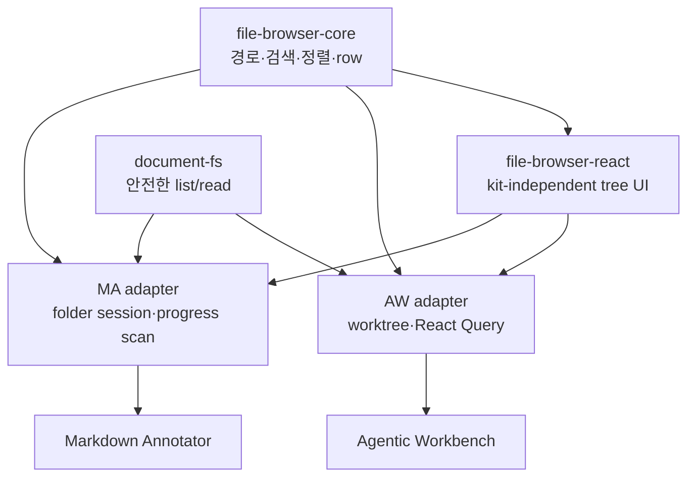

# MA·AW 폴더 브라우저 공통 모듈화 전략

## 목적

Agentic Workbench(AW)의 기존 worktree 파일 탐색 구현과 Markdown Annotator(MA)에 추가할 Markdown 폴더 브라우징을 비교해, 공통 module로 분리할 범위와 두 앱의 구성 방식을 정한다.

목표는 두 앱의 UI를 똑같이 만드는 것이 아니다. 경로 안전성, 트리 계산과 접근성처럼 동일한 문제를 한 번 해결하고, AW와 MA가 각자의 제품 문맥을 adapter로 결합하게 하는 것이다.

## 결론

공통화는 세 층으로 나누되 한 번에 모두 추출하지 않는다.

1. **우선 추출:** 순수 TypeScript 트리 모델
2. **두 번째 추출:** kit-independent React 문서 트리
3. **검증 후 추출:** 안전한 root-relative filesystem Rust crate

watcher, query/store orchestration, root 선택과 annotation 상태는 앱별로 유지한다.



## 현재 구현 비교

### AW

- backend `fs_worktree_file_provider.rs`
  - worktree root canonicalization
  - root-relative list/read
  - path traversal 방어
  - hidden/build directory 제외
  - `all`/`markdown`, `dir`, `depth` scope
  - 큰 text file truncate
- frontend `features/worktree-workspace/model/file-tree.ts`
  - 여러 lazy query 결과 merge·중복 제거
  - expanded folder에 따른 visible row 계산
  - path depth 계산
- UI `worktree-workspace-panel.tsx`
  - 일반 file tree와 Markdown annotation tree가 같은 row button을 사용
  - React Query cache와 worktree watcher로 refresh
  - worktree, SpecKit, agent prompt 전송 문맥 포함

### MA 목표

- 사용자가 임의의 로컬 folder를 root로 선택
- Markdown 파일만 점진적으로 탐색
- 검색, 이름/경로/수정 시각/크기 정렬
- 최근 root·문서와 펼침 상태 복원
- root watcher로 create/remove/rename/modify 반영
- 선택 문서를 document identity별 annotation session에 연결

### 공통점과 차이

| 영역 | 공통 | AW 고유 | MA 고유 |
|---|---|---|---|
| path | `/` 기준 상대 경로, ancestor, depth | worktree root | 사용자 선택 root |
| tree | folder/file, 펼침, active row | lazy directory query | progressive full scan |
| filter | extension/path predicate | all text + Markdown scope | Markdown product scope |
| metadata | size, modified time | preview truncation | 정렬·보조 label |
| watcher | filesystem change 감지 | worktree query invalidation | root scan과 active document reload |
| selection | file path 선택 | worktree preview/SpecKit/agent | annotation review session |

## 공통화 후보 평가

| 후보 | 판단 | 이유 |
|---|---|---|
| 상대 경로 정규화·ancestor·depth | 공유 | 순수 계산이며 두 앱의 의미가 같다. |
| entry merge·dedupe | 공유 | lazy query와 progress batch 모두 필요하다. |
| tree build·flatten·expanded visibility | 공유 | 입력 전략과 무관한 순수 계산이다. |
| search·highlight·sort | 공유 | AW에도 즉시 사용자 가치가 있고 MA 요구사항과 동일하다. |
| metadata formatting | 공유 | 표시 규칙을 한곳에서 검증할 수 있다. |
| tree row UI와 keyboard navigation | 공유 | UI kit adapter를 주입하면 두 앱에서 동일한 접근성 동작을 보장한다. |
| secure list/read | 조건부 공유 | backend 정책 대부분이 같지만 scope와 결과 모델을 먼저 일반화해야 한다. |
| watcher | 앱별 유지 | watch root, event 의미, debounce 소비자가 다르다. |
| React Query/Zustand model | 앱별 유지 | 상태 수명과 loading 전략이 다르다. |
| 최근 root·폴더 dialog | MA-local | AW root는 project/worktree가 결정한다. |
| annotation/SpecKit/agent 연결 | 앱별 유지 | 각 제품의 핵심 문맥이다. |
| panel layout | 기존 `packages/ui` 활용 | 새 browser package 책임이 아니다. |

## 확정 1 — `@yoophi/file-browser-core`

순수 TypeScript module로 시작한다. React, Tauri, browser storage와 특정 앱 타입에 의존하지 않는다.

```text
packages/file-browser-core/
  src/
    types.ts
    paths.ts
    merge-entries.ts
    build-tree.ts
    search-tree.ts
    sort-tree.ts
    visible-rows.ts
    format-metadata.ts
    index.ts
```

### 외부 interface

```ts
export type DocumentTreeEntry = {
  relativePath: string;
  kind: "directory" | "file";
  sizeBytes?: number | null;
  modifiedAt?: number | null;
};

export type DocumentTreeOptions = {
  query?: string;
  sort?: {
    mode: "name" | "path" | "modified" | "size";
    direction: "asc" | "desc";
  };
  expandedPaths: ReadonlySet<string>;
};

export type DocumentTreeRow = DocumentTreeEntry & {
  name: string;
  depth: number;
  isExpanded: boolean;
  matchedRanges: ReadonlyArray<{ start: number; end: number }>;
};

export function createDocumentTreeRows(
  entries: readonly DocumentTreeEntry[],
  options: DocumentTreeOptions,
): DocumentTreeRow[];
```

caller가 `buildTree`, `filterFiles`, `sortTree`, `flattenVisibleTree`의 호출 순서를 알 필요가 없게 하나의 깊은 interface로 제공한다. 내부 helper는 테스트 때문에 export하지 않는다.

### 앱 adapter

AW:

```ts
function toDocumentTreeEntry(entry: WorktreeFileEntry): DocumentTreeEntry {
  return {
    relativePath: entry.relativePath,
    kind: entry.isDir ? "directory" : "file",
    sizeBytes: entry.size,
    modifiedAt: entry.modifiedMs,
  };
}
```

MA:

```ts
function toDocumentTreeEntry(entry: MarkdownDocumentEntry): DocumentTreeEntry {
  return {
    relativePath: entry.relativePath,
    kind: "file",
    sizeBytes: entry.sizeBytes,
    modifiedAt: entry.modifiedAt,
  };
}
```

MA의 flat file 목록에서 directory row를 합성하는 동작은 core 구현이 숨긴다. AW처럼 backend가 directory entry를 주는 입력과 중복되어도 relative path 기준으로 하나로 합친다.

## 확정 2 — `@yoophi/file-browser-react`

공유 core row를 표시하는 kit-independent React module이다. Markdown renderer와 동일하게 앱별 UI primitive를 interface로 주입한다.

```text
packages/file-browser-react/
  src/
    DocumentTree.tsx
    DocumentTreeRow.tsx
    use-tree-keyboard-navigation.ts
    types.ts
    index.ts
```

### 외부 interface

```ts
export type DocumentTreeProps = {
  rows: readonly DocumentTreeRow[];
  activePath: string | null;
  loadingPaths?: ReadonlySet<string>;
  onToggleDirectory(path: string): void;
  onSelectFile(path: string): void;
  components: DocumentTreeComponents;
};
```

공유 module이 소유할 동작:

- `role="tree"`, `treeitem`, `aria-level`, `aria-expanded`, `aria-selected`
- Arrow Up/Down 이동
- Arrow Right 펼침 또는 첫 자식 이동
- Arrow Left 접기 또는 부모 이동
- Home/End 이동
- active row focus/scroll
- search match highlight 표시
- loading directory 상태

앱 adapter가 소유할 표현:

- Button, Tooltip, ScrollArea primitive
- file/folder/chevron/loading icon
- badge, context action과 색상
- root header, search/sort control, empty/error state

AW는 Radix 기반 adapter, MA는 base-ui 기반 adapter를 제공한다. `DocumentTree`에 worktree, annotation, recent root 또는 query object를 전달하지 않는다.

## 제안 3 — `crates/document-fs`

Rust 공통화는 frontend module이 두 앱에서 안정된 뒤 진행한다. filesystem은 local-substitutable dependency이므로 crate의 외부 interface에 reader/walker 세부 port를 노출하지 않고 임시 디렉터리 fixture로 검증한다.

```text
crates/document-fs/
  src/
    lib.rs
    model.rs
    scan.rs
    read.rs
    path_policy.rs
```

### 외부 interface

```rust
pub struct ScanRequest<'a> {
    pub root: &'a Path,
    pub directory: Option<&'a str>,
    pub max_depth: Option<usize>,
    pub include: FilePredicate,
    pub skip_hidden: bool,
}

pub enum FilePredicate {
    AllFiles,
    Markdown,
}

pub fn scan_documents(request: ScanRequest<'_>) -> Result<ScanResult, DocumentFsError>;

pub fn read_text_document(
    root: &Path,
    relative_path: &str,
    limit: Option<u64>,
) -> Result<TextDocument, DocumentFsError>;
```

crate가 숨길 구현:

- root와 candidate canonicalization
- `..`, absolute path와 root 밖 symlink 차단
- hidden/build directory skip
- depth 제한과 directory entry 합성
- metadata 수집과 stable ordering
- UTF-8 read와 size/truncated 처리
- unreadable entry 수집

### 앱 구성

AW adapter:

- `working_directory`를 root로 전달
- `WorktreeFileListScope`를 `ScanRequest`로 변환
- `WorktreeFileEntry`/`WorktreeTextFile` 응답으로 매핑
- 기존 worktree watcher와 React Query invalidation 유지

MA adapter:

- selected folder를 root로 전달
- Markdown predicate와 full recursive scan 사용
- scan 결과를 batch progress event로 분할·emit
- MA root watcher와 review session lifecycle 유지

### crate에서 제외할 것

- Tauri command와 event
- window/session registry
- `notify` watcher
- Git/worktree 판정
- recent root와 app-data
- annotation identity와 fingerprint

watcher까지 공통화하면 interface가 app event 의미를 알아야 하므로 module이 얕아진다. path 분류 helper가 실제로 중복될 때만 작은 순수 함수 공유를 검토한다.

## 고려한 대안

### 대안 A — MA가 AW feature를 직접 import

기각한다. `worktree-workspace`는 React Query, GitWorktree, AW UI, agent prompt와 SpecKit 문맥에 결합되어 있다. 삭제 테스트를 적용하면 browser 복잡성이 사라지지 않고 MA 호출부로 퍼진다.

### 대안 B — AW file tree 전체를 `packages/ui`로 이동

기각한다. `packages/ui`는 UI primitive 성격이며 tree domain 계산과 filesystem 계약을 소유할 위치가 아니다.

### 대안 C — frontend만 공유

1차 구현으로 채택한다. 가장 안정적이고 두 앱 adapter가 즉시 생겨 seam이 실제가 된다. backend 중복은 작동 계약이 확인된 후 제거한다.

### 대안 D — backend까지 한 PR에서 공유

기각한다. AW의 lazy scope/truncation과 MA의 progressive scan/skipped paths를 동시에 바꾸면 회귀 표면이 너무 넓다.

## 단계별 전환 계획


### PR 0 — 공통 계약과 cross-app fixture

- AW flat directory entries, MA flat Markdown files, deep path, Korean path와 metadata fixture를 고정한다.
- 동일 입력·options가 동일 row를 만드는 contract test를 작성한다.
- case sensitivity, directory-first ordering, search locale와 missing metadata 정책을 결정한다.

### PR 1 — core 추출과 AW 소비

- `@yoophi/file-browser-core`를 생성한다.
- AW `file-tree.ts`의 merge/visibility/depth 테스트를 새 interface 테스트로 옮긴다.
- AW의 일반 file tree와 Markdown tree가 core row를 소비하게 한다.
- 기존 shallow helper와 중복 테스트를 삭제한다.

AW를 첫 소비자로 선택하는 이유는 현재 monorepo 안에 구현과 회귀 테스트가 이미 있기 때문이다.

### PR 2 — MA adapter와 search/sort 확장

- MM의 build/filter/sort/format 동작을 core 내부에 추가한다.
- MA `MarkdownDocumentEntry` adapter를 연결한다.
- AW에도 search/sort를 노출할지는 별도 UI decision으로 두되 core 계약은 같이 검증한다.

### PR 3 — React tree 추출과 AW 소비

- AW `FileTreeRowButton`의 tree row 동작을 kit-independent `DocumentTree`로 이동한다.
- AW Radix adapter와 Storybook 사례를 추가한다.
- keyboard/ARIA test를 공유 package의 interface에서 수행한다.

### PR 4 — MA UI adapter

- MA base-ui adapter를 추가한다.
- root header, recent root, search/sort와 empty/error는 MA feature에서 조립한다.
- 문서 선택을 `ReviewSessionStore`와 연결한다.

### PR 5 — Rust 공통 crate spike

- AW/MA의 path canonicalization, skip, scan, metadata와 read 동작을 fixture로 비교한다.
- `crates/document-fs`가 두 앱의 기존 observable contract를 만족하는지 spike한다.
- streaming callback이 아닌 최종 `ScanResult`로도 MA first-result latency를 유지할 수 있는지 측정한다.

MA가 streaming scan을 반드시 요구하면 crate 내부 iterator/callback을 추가할 수 있지만, Tauri event는 adapter에 둔다.

### PR 6~7 — backend 소비자 전환

- AW를 먼저 전환해 lazy scope, truncation과 path security 회귀를 닫는다.
- MA를 전환해 progress scan, skipped paths와 watcher lifecycle을 닫는다.
- 양쪽 기존 filesystem 구현을 제거하고 crate interface 테스트로 대체한다.

## 상태 소유권

| 상태 | 공유 core | 공유 React | AW | MA |
|---|---|---|---|---|
| normalized entries/rows | 소유 | 소비 | adapter | adapter |
| query/sort 계산 | 소유 | 소비 | UI 상태 | UI 상태 |
| expanded paths | 계산에 사용 | event emit | React state/query | persisted view state |
| active path | 계산에 사용 | 표시 | worktree panel | browser session |
| loading/error | 모델 표시만 | 표시 | React Query | progressive scan model |
| selected document content | 없음 | 없음 | worktree query | document browser model |
| watcher | 없음 | 없음 | worktree watcher | root watcher |
| annotation | 없음 | 없음 | AW workspace | ReviewSessionStore |

## 검증 전략

### 공유 core

- entry dedupe와 stable ordering
- flat file 입력의 directory 합성
- lazy directory entry 입력과 합성 entry 병합
- 모든 ancestor가 펼쳐져야 보이는 row
- active path ancestor 자동 확장 helper
- search 시 parent 유지와 highlight range
- name/path/modified/size 양방향 정렬
- Windows separator normalization, Unicode와 case 정책

### 공유 React

- WAI-ARIA tree semantics
- keyboard navigation과 focus 복원
- expand/select event가 한 번만 발생
- loading/active/search highlight 표시
- AW Radix와 MA base-ui adapter contract

### Rust crate

- traversal, absolute path와 outside-root symlink 거부
- hidden/build directory skip
- scope directory와 depth
- Markdown predicate에 `.md`, `.markdown`, `.mdx` 포함
- unreadable entry를 전체 실패로 만들지 않음
- metadata, UTF-8 error, read limit와 truncation

### 소비 앱

- AW: 일반 file tree, Markdown tree, SpecKit file list, stale selection, watcher invalidation
- MA: folder open, progressive scan, search/sort, document switching, annotation 복원, root watcher

## 위험과 대응

| 위험 | 대응 |
|---|---|
| 공통 interface가 AW와 MA 상태 전략까지 노출 | core는 entries→rows 순수 변환만 소유 |
| UI kit 차이로 조건문 증가 | primitive/icon을 adapter interface로 주입 |
| AW lazy tree와 MA full scan 차이 | 입력 entry를 공통 정규형으로 변환하고 loading은 앱이 소유 |
| Rust crate가 watcher/Tauri까지 흡수 | list/read/path policy만 포함 |
| 공통화 중 AW 회귀 | AW를 첫 소비자로 전환하고 기존 테스트를 interface 테스트로 이전 |
| package가 shallow helper 모음이 됨 | `createDocumentTreeRows` 중심의 작은 외부 interface 유지 |
| Git Explorer file tree와 혼동 | Git diff tree는 상태/압축 의미가 달라 이번 범위에서 제외 |

## 성공 기준

- AW와 MA가 동일한 core 및 React tree interface를 서로 다른 adapter로 소비한다.
- tree 검색·정렬·접근성 버그를 공유 module 한곳에서 수정할 수 있다.
- AW worktree/SpecKit/agent 문맥과 MA root/review 문맥이 공유 package로 유출되지 않는다.
- 초기 frontend 공통화 PR에서는 backend와 watcher 동작이 바뀌지 않는다.
- Rust crate 전환 후 양쪽 앱에 중복 canonicalization, scan과 safe read 구현이 남지 않는다.

## 권장 착수점

`@yoophi/file-browser-core`와 `@yoophi/file-browser-react`를 만들고 AW adapter와 MA browser가 같은 계약을 소비하도록 구현했다. Rust 경계는 앱 shell과 파일시스템 권한이 달라 현재 MA의 `file-access` port/adapter에 유지하며, AW backend 요구가 같은 fixture로 고정될 때 workspace crate로 승격한다.
