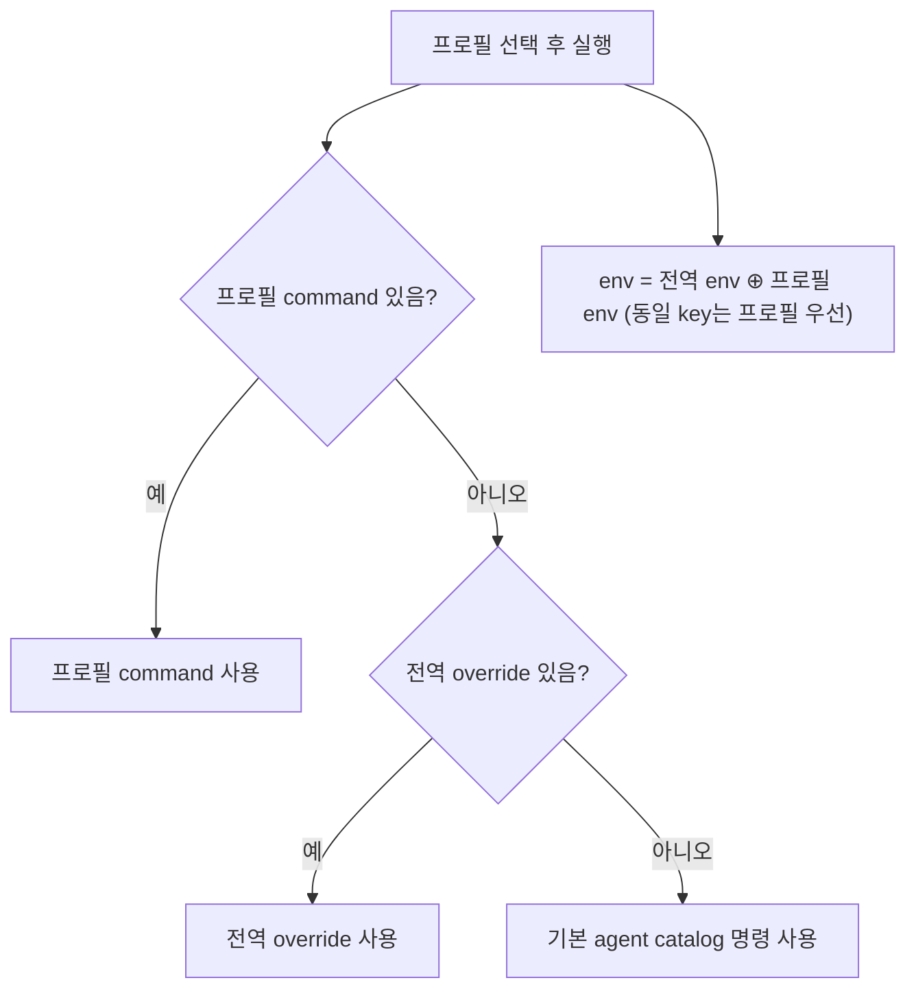

# ACP Agent 프로필 (실행 명령 · 환경변수)

## 개요

`agentic-workbench`는 ACP agent 실행 구성을 **프로필** 단위로 관리한다
(GitHub 이슈 #121, specs/008). 프로필은 표시 이름, agent 종류(type), 실행
명령(선택), 환경변수(선택), 활성 여부를 가지며, 같은 종류의 agent를 서로 다른
구성으로 여러 개 등록할 수 있다 — 예: "Claude (기본)", "Claude (프록시 경유)".

세션 시작 화면에는 **활성(enabled) 프로필만** 표시되고, 선택한 프로필의
명령·환경변수로 agent 프로세스가 실행된다.

## 기본 프로필과 커스텀 프로필

- 최초 실행 시 `codex`, `claude-code`, `opencode`, `pi-coding-agent` 4개가
  **기본 프로필**로 자동 등록된다(저장 데이터에 없으면 로드 시 자동 seed).
- 기본 프로필은 명령/환경변수 수정과 활성/비활성 전환만 가능하고 **삭제할 수
  없다**. 기본 프로필의 id는 agent catalog id와 동일해 세션 재사용 등 기존
  agent id 기반 흐름과 호환된다.
- **기본 프로필 중 최소 1개는 항상 활성**이어야 한다. 마지막 활성 기본
  프로필의 비활성화는 UI에서 차단·안내되고, 저장 시에도 거부된다.
- 커스텀 프로필은 자유롭게 추가/수정/삭제할 수 있다.

## 실행 구성 결정 규칙

- 명령: 프로필 command → 전역 override → 기본 catalog 명령.
- 환경변수: 전역 env와 프로필 env를 병합하고, 동일 key는 프로필 값이 우선한다.
- 병합된 환경변수는 agent child process spawn 시 주입된다. `PATH`를 지정하면
  `사용자 PATH:보강 PATH` 순으로 결합되어 npx/node 탐색이 깨지지 않는다.
- 환경변수 key가 비어 있거나 공백뿐인 항목은 저장 시 제거된다(빈 value는 허용
  — "빈 값 설정"과 "미설정"은 다르다).

## 저장과 하위 호환

프로필 설정은 기존 agent run settings 저장소의 override 항목
(`commandOverrides`)에 `profiles`/`globalEnv` 필드로 함께 저장된다.

- 구버전(command-only) 저장 데이터(`globalCommand`, `agentCommands`)는
  migration 없이 로드되며, `agentCommands`의 값은 대응하는 기본 프로필의
  command 초기값으로 반영된다.
- legacy 필드는 저장 파일에서 제거되지 않으므로 앱을 구버전으로 되돌려도
  기존 설정이 유지된다.

## secret 취급

환경변수 값은 로컬 설정 파일에 평문으로 저장된다(기존 설정과 동일 신뢰 수준).
env 값은 **오류 메시지·로그에 노출하지 않는다**. OS keychain 연동 등 암호화
저장은 범위 밖이다.

## 실패 처리

잘못된 명령을 저장하면 agent 실행 시 명령 파싱 또는 프로세스 시작이 실패할 수
있다. 이 경우 run 화면은 실패 메시지를 표시하고 사용자가 설정 페이지로 이동해
프로필을 수정할 수 있는 경로를 제공한다. 실행 실패는 기존 세션 목록, worktree
정보, 권한 상태, 다른 설정값을 변경하지 않아야 한다.

## 이슈 #121 수용 기준 대조

| 수용 기준 | 상태 |
|---|---|
| Settings에서 global env와 agent별(프로필) env 저장/수정/초기화 | 충족 |
| 실행 시 저장된 env가 child process에 주입 | 충족 (`Command::envs`) |
| agent별 env가 global env와 병합, 동일 key는 agent별 우선 | 충족 |
| 기존 command-only 데이터 migration 없이 로드 | 충족 (serde default + seed 매핑) |
| override 없는 agent는 기본 catalog 명령 유지 | 충족 |
| 빈/공백 env key 미저장 | 충족 |
| 최초 실행 시 기본 프로필 4개 자동 등록 | 충족 (seed) |
| 커스텀 프로필 추가/수정/삭제, type·이름·command·env 지정 | 충족 |
| 동일 type 프로필 복수 등록 | 충족 |
| 기본 프로필은 수정/enable/disable만, 삭제 불가 | 충족 |
| 활성 기본 프로필 최소 1개 유지(마지막 disable 차단·안내) | 충족 (UI 차단 + 저장 거부) |
| 커스텀 프로필 삭제 가능 | 충족 |
| 세션 시작 UI에 enabled 프로필만 표시, 선택 구성으로 spawn | 충족 |
