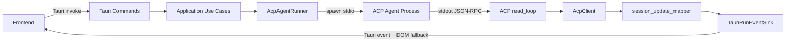
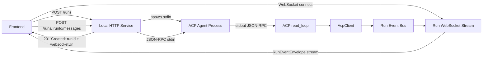
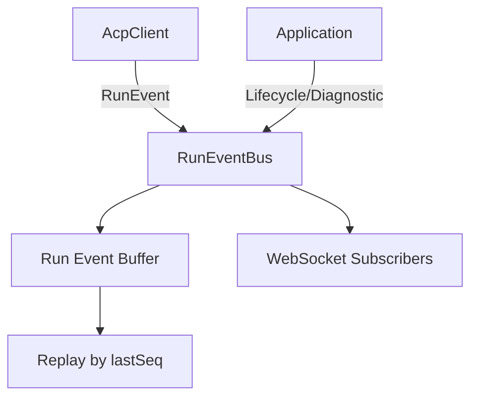
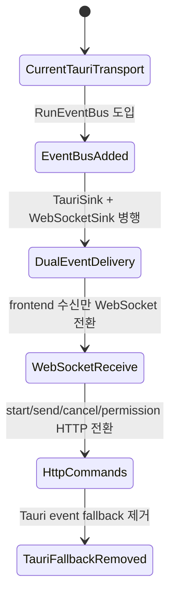
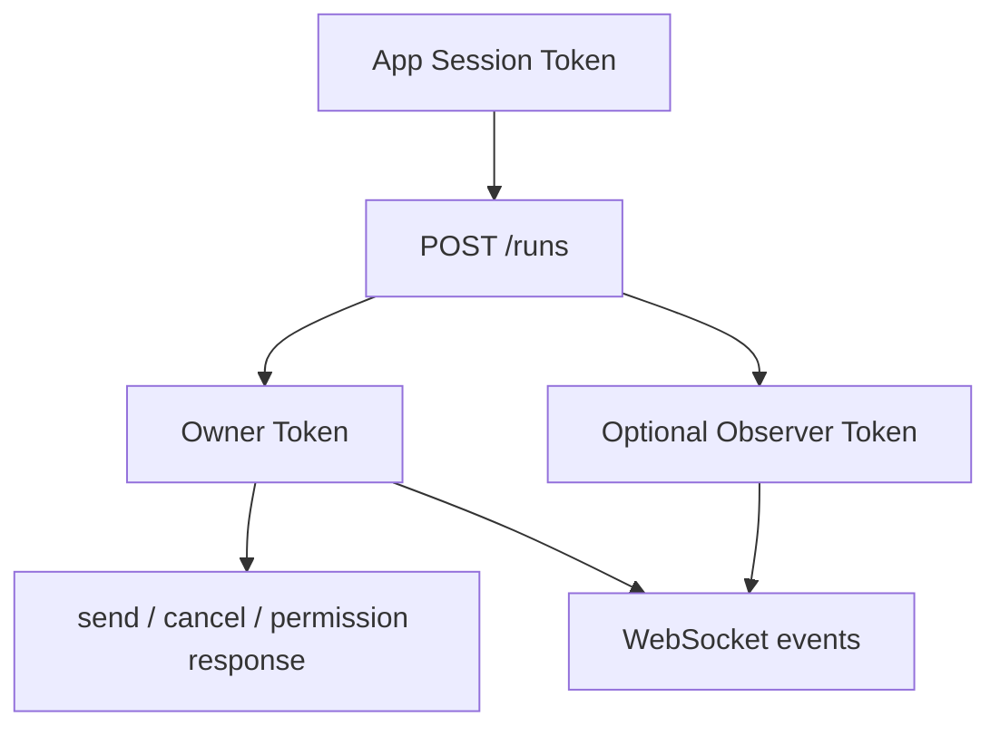

# ACP HTTP / WebSocket Transport 설계 검토

## 배경

현재 agentic workbench는 Tauri command와 Tauri window event를 통해 ACP agent run을 제어한다. Frontend는 `start_agent_run`, `send_prompt_to_run`, `cancel_agent_run`, `respond_agent_permission` 같은 Tauri command를 호출하고, backend는 `TauriRunEventSink`를 통해 run event를 window로 emit한다.

현 구현은 단일 Tauri 앱 내부 UI에는 단순하지만, 다음 확장 요구가 생기면 transport 경계가 좁아진다.

- Tauri window event가 아닌 표준 browser API로 agent event를 수신하고 싶다.
- UI, CLI, 테스트 클라이언트, 외부 디버거가 같은 agent run API를 사용하게 하고 싶다.
- 멀티 윈도우와 멀티 세션에서 event subscriber를 명시적으로 관리하고 싶다.
- Tauri frontend와 backend 사이의 결합을 줄이고, agent 실행 core를 local service로 분리하고 싶다.

이 문서는 앱 실행 시 local HTTP service를 시작하고, agent 실행 후 Rust 기반 WebSocket stream으로 메시지를 수신하는 설계를 검토한다.

## 현재 구조



현재 frontend는 ACP JSON-RPC 원문을 직접 받지 않는다. Backend가 `session/update`, `session/request_permission`, file system, terminal request를 처리하고 앱 내부 `RunEventEnvelope`로 정규화한 뒤 frontend에 전달한다.

현재 수신 경로의 특징:

- Backend event 이름은 `agent-run-event`다.
- Frontend 구현은 Tauri event API가 아니라 `agent-run-event-fallback` DOM CustomEvent를 수신한다.
- `RunEventEnvelope`는 `runId`와 `RunEvent`만 포함한다.
- Frontend는 현재 active run id와 envelope run id가 다르면 이벤트를 무시한다.

## 제안 구조



핵심 방향은 command성 요청과 streaming 수신을 분리하는 것이다.

- Agent 실행: `POST /runs`
- Prompt 발송: `POST /runs/{runId}/messages`
- Permission 응답: `POST /runs/{runId}/permissions/{permissionId}/response`
- Permission mode 변경: `POST /runs/{runId}/permission-mode`
- Cancel: `POST /runs/{runId}/cancel`
- Event 수신: `GET /runs/{runId}/events` WebSocket upgrade

`POST /runs` 응답은 최소한 다음 값을 포함한다.

```ts
export type StartRunResponse = {
  runId: string;
  websocketUrl: string;
};
```

WebSocket event envelope는 현재 타입을 확장하는 편이 좋다.

```ts
export type RunEventEnvelope = {
  runId: string;
  seq: number;
  createdAt: string;
  event: RunEvent;
};
```

`seq`는 reconnect와 replay에 필요하다. `createdAt`은 UI 정렬, 로그 상관관계, 테스트 fixture에 유용하다.

## 장점

### Transport 표준화

HTTP와 WebSocket은 browser, CLI, 테스트 도구에서 모두 사용하기 쉽다. Tauri window event와 `window.eval` fallback에 의존하지 않아도 되므로 frontend adapter가 단순해진다.

### 클라이언트 확장성

Tauri frontend 외에도 다음 클라이언트를 붙일 수 있다.

- 독립 web frontend
- Playwright 또는 integration test client
- CLI debug client
- 외부 log viewer
- run monitor dashboard

API가 local service로 노출되면 agent run core를 UI와 독립적으로 검증할 수 있다.

### 송수신 책임 분리

명령성 요청은 HTTP POST, 지속 event stream은 WebSocket으로 분리된다. 이 구조는 API 의미가 명확하고, frontend 상태 관리에서도 request lifecycle과 event lifecycle을 구분하기 쉽다.

### 멀티 세션 라우팅 명시화

현재도 run id와 window label로 event를 구분하지만, WebSocket 구조에서는 run별 subscriber 목록을 explicit하게 관리할 수 있다. 하나의 run을 여러 client가 관찰하거나, owner connection만 write permission을 갖게 하는 정책도 표현하기 쉽다.

### 테스트 용이성

Tauri webview 없이도 다음 테스트가 가능하다.

- `POST /runs`가 agent process를 생성하고 run id를 반환하는지 검증
- mock ACP stdout을 흘려 WebSocket event가 순서대로 오는지 검증
- permission request와 response round trip 검증
- reconnect 후 replay 검증

## 단점

### 구현 복잡도 증가

현재 구조는 Tauri command와 event sink 중심이다. 제안 구조는 다음 요소를 새로 운영해야 한다.

- local HTTP server
- WebSocket upgrade와 connection registry
- run별 event bus
- event buffer와 replay 정책
- port discovery
- app shutdown과 server shutdown 연결
- HTTP API 보안 정책

단순한 Tauri 내부 UI만 목표라면 과한 구조가 될 수 있다.

### 로컬 보안 표면 확대

`localhost` API는 앱 내부 함수 호출보다 공격 표면이 넓다. 특히 agent 실행, prompt 발송, permission response는 권한이 큰 동작이다.

검토해야 할 위험:

- 임의 웹페이지가 local HTTP endpoint로 요청하는 상황
- 같은 머신의 다른 process가 run API를 호출하는 상황
- CORS와 Origin 검증 미비
- token이 없는 WebSocket URL 유출
- 고정 port 사용 시 port scanning과 충돌

최소한 random loopback port, per-app-session secret token, Origin 검증, CORS 차단, WebSocket token 검증이 필요하다.

### Event 유실과 순서 문제

`POST /runs` 직후 frontend가 WebSocket에 연결하기 전에 `initialized`, `sessionCreated`, `diagnostic` 같은 초기 이벤트가 발생할 수 있다. 이를 버리면 UI가 run 상태를 잃는다.

해결책은 둘 중 하나다.

- WebSocket 연결이 완료된 뒤 agent를 실제 start하는 2-phase 방식
- run별 event buffer를 유지하고 WebSocket 연결 시 replay하는 방식

현실적으로는 event buffer와 `lastSeq` 기반 replay가 더 유연하다.

### HTTP request와 WebSocket event 간 일관성

Prompt 발송은 HTTP로 성공했지만 WebSocket 연결이 끊겨 event를 못 받을 수 있다. 반대로 HTTP 응답이 timeout 되었지만 backend에서는 prompt가 agent stdin에 이미 들어갔을 수 있다.

이를 줄이려면 prompt 발송에 `clientMessageId`를 받는 idempotency 정책이 필요하다.

```ts
export type SendPromptRequest = {
  prompt: string;
  clientMessageId: string;
};
```

Backend는 같은 `clientMessageId`가 재시도되면 중복 발송하지 않아야 한다.

### Tauri lifecycle과 service lifecycle 결합

앱 종료, window close, dev server hot reload, sleep/wake, crash 상황에서 HTTP server, WebSocket connection, child process를 정리해야 한다. 현재 Tauri command 구조보다 lifecycle 관리 범위가 커진다.

## 구현시 어려운 점

### RunSession aggregate 재설계

각 run은 다음 자원을 하나로 묶어야 한다.

- ACP child process handle
- stdin writer 또는 `RpcPeer`
- stdout read loop task
- stderr read task
- current ACP session id
- permission broker state
- event sequence counter
- event buffer
- WebSocket subscribers
- cancellation handle
- owner client 또는 owner window identity

현재 `agent_session_registry.rs`, `SessionHandle`, `RunCommander`, `PermissionBroker`, `RunEventSink`가 나눠 가진 책임을 HTTP/WebSocket 모델에 맞게 재배치해야 한다.

### EventSink 추상화

기존 `RunEventSink`는 `emit(run_id, event)`만 가진다. WebSocket replay와 순서 보장을 위해서는 내부적으로 sequence를 부여하고 buffer에 저장하는 event bus가 필요하다.

권장 구조:



`RunEventBus`는 `RunEventSink`를 구현해 기존 ACP client와 runner가 큰 변경 없이 사용할 수 있게 한다.

### 초기 이벤트 replay

`POST /runs` 응답 전에 WebSocket URL을 반환하려면 run을 등록한 뒤 agent start를 background task로 넘겨야 한다. 이 경우 start 실패도 WebSocket `error` 또는 `lifecycle cancelled/completed` 이벤트로 전달해야 한다.

대안으로 `POST /runs`가 agent 초기화까지 기다리면 응답 시간이 길어지고, WebSocket 연결 전에 초기 이벤트가 더 많이 쌓인다. 따라서 응답은 빠르게 주고 event stream으로 진행 상태를 전달하는 편이 맞다.

### Permission owner 검증

현재 permission response는 Tauri window label을 기준으로 owner window인지 검사한다. HTTP API로 바꾸면 다음 중 하나를 선택해야 한다.

- run 생성 시 발급한 owner token만 permission response를 허용한다.
- WebSocket owner connection만 permission response endpoint를 호출할 수 있게 한다.
- UI client id를 발급하고 run owner client id와 비교한다.

가장 단순한 방식은 `POST /runs` 응답에 owner token을 포함하고, 이후 write API는 `Authorization` header로 검증하는 것이다.

### Local server discovery

Frontend가 local HTTP service 주소를 알아야 한다. 선택지는 다음과 같다.

- Tauri command로 service base URL과 token만 조회한다.
- 앱 bootstrap 시 frontend HTML에 base URL을 주입한다.
- 고정 port를 사용한다.

보안과 충돌 회피를 고려하면 random loopback port를 사용하고, Tauri command로 bootstrap 정보를 받는 방식이 안전하다. 이 경우 모든 기능을 HTTP로 바꾸더라도 discovery만큼은 Tauri에 남는다.

### Rust async runtime 통합

Tauri 앱 안에서 `axum` 또는 `hyper` server를 띄울 수 있지만, shutdown을 명확히 연결해야 한다.

필요한 구현 항목:

- 앱 startup에서 HTTP server task spawn
- random port bind
- app state에 `LocalServiceHandle` 저장
- app exit에서 graceful shutdown signal 전송
- active run cancellation 또는 orphan process 정리
- WebSocket connection close 시 subscriber 제거

### Frontend repository 교체

현재 `entities/agent-run/api/agent-run-repository.ts`는 Tauri `invoke` 기반이다. 새 구조에서는 adapter를 분리하는 편이 좋다.

```ts
export interface AgentRunTransport {
  startRun(request: AgentRunRequest): Promise<StartRunResponse>;
  sendPrompt(runId: string, input: SendPromptRequest): Promise<void>;
  cancelRun(runId: string): Promise<void>;
  respondPermission(runId: string, permissionId: string, optionId: string): Promise<void>;
  subscribeRunEvents(runId: string, options: SubscribeOptions): RunEventSubscription;
}
```

초기에는 Tauri transport와 HTTP/WebSocket transport를 병행할 수 있게 두고, 기능 flag로 전환하는 방식이 안전하다.

## API 초안

### Start Run

```http
POST /runs
Content-Type: application/json
Authorization: Bearer {appSessionToken}
```

```json
{
  "goal": "Implement feature",
  "cwd": "/Users/yoophi/project/agentic-workbench",
  "agentId": "codex",
  "agentCommand": "npx -y @zed-industries/codex-acp",
  "permissionMode": "default",
  "modelId": null,
  "contextSize": "default",
  "resumeSessionId": null,
  "resumePolicy": "new"
}
```

```json
{
  "runId": "run_123",
  "websocketUrl": "ws://127.0.0.1:49152/runs/run_123/events?token=...",
  "ownerToken": "..."
}
```

### Send Prompt

```http
POST /runs/{runId}/messages
Content-Type: application/json
Authorization: Bearer {ownerToken}
```

```json
{
  "clientMessageId": "msg_01J...",
  "prompt": "다음 작업을 진행해주세요."
}
```

### Subscribe Events

```http
GET /runs/{runId}/events?token=...&lastSeq=42
Upgrade: websocket
```

Server는 `lastSeq` 이후 이벤트를 replay한 뒤 live event를 이어서 보낸다.

### WebSocket Message

```json
{
  "type": "runEvent",
  "runId": "run_123",
  "seq": 43,
  "createdAt": "2026-06-25T12:34:56.789Z",
  "event": {
    "type": "agentMessage",
    "text": "작업을 시작하겠습니다."
  }
}
```

## 단계적 전환 전략

한 번에 transport 전체를 바꾸면 위험이 크다. 다음 순서를 권장한다.



1. Backend 내부에 `RunEventBus`를 추가하고 기존 `TauriRunEventSink`가 이 bus를 구독하게 한다.
2. Local HTTP/WebSocket service를 앱 startup에서 띄우되, 초기에는 read-only event stream만 제공한다.
3. Frontend `listenRunEvents`를 WebSocket adapter로 교체한다.
4. `start_agent_run`은 Tauri command를 유지한 채 WebSocket 수신 안정성을 검증한다.
5. `send_prompt_to_run`, `cancel_agent_run`, `respond_agent_permission`을 HTTP endpoint로 이동한다.
6. 마지막으로 `POST /runs` 기반 실행으로 전환한다.
7. Tauri event fallback과 `window.eval` 경로를 제거한다.

## HTTP / WebSocket 보안 권장사항

HTTP와 WebSocket으로 agent 실행 기능을 노출하면 Tauri 내부 command보다 공격 표면이 넓어진다. 특히 `POST /runs`, prompt 발송, permission 응답은 로컬 파일 접근과 프로세스 실행에 직접 연결되므로 local-only API라도 외부 입력으로 취급해야 한다.

### 네트워크 노출 범위

- HTTP server는 `127.0.0.1` 또는 `[::1]`에만 bind한다. `0.0.0.0` bind는 금지한다.
- port는 고정값 대신 OS가 배정한 random port를 사용한다.
- service base URL은 Tauri bootstrap command 또는 안전한 in-memory channel로만 frontend에 전달한다.
- server URL과 token을 파일, 환경 변수, stdout log에 남기지 않는다.
- 개발 모드에서만 외부 host bind가 필요하다면 별도 feature flag와 명시적 경고를 둔다.

### 인증과 권한

- 앱 실행마다 app session token을 새로 발급한다.
- `POST /runs`는 app session token을 요구한다.
- run 생성 시 owner token을 별도 발급한다.
- prompt 발송, cancel, permission response, permission mode 변경 같은 write API는 owner token을 요구한다.
- read-only observer가 필요하면 owner token과 별도의 observer token을 둔다.
- token은 충분한 entropy를 가진 난수로 만들고, run 종료 또는 앱 종료 시 즉시 폐기한다.
- token 비교는 constant-time 비교 함수를 사용한다.

권한 모델은 다음처럼 분리한다.



### CORS와 Origin 검증

- CORS는 기본적으로 허용하지 않는다.
- browser frontend에서 CORS가 필요하면 정확한 origin만 allowlist에 등록한다.
- `Origin` header가 존재하면 HTTP와 WebSocket upgrade 모두에서 검사한다.
- `Origin: null`은 기본 거부한다. 필요할 때만 Tauri webview 동작을 확인한 뒤 제한적으로 허용한다.
- preflight 요청도 token 없이 넓게 허용하지 않는다.
- localhost API라고 해서 browser same-origin 정책에 의존하지 않는다.

### WebSocket 보호

- WebSocket URL은 token 없이는 연결할 수 없게 한다.
- token을 query string에 넣으면 browser history, proxy log, error log에 남을 수 있다. 가능하면 `Sec-WebSocket-Protocol` 또는 첫 client message로 token을 전달한다.
- query token을 쓰는 경우 token logging을 명시적으로 마스킹한다.
- 연결 직후 server가 인증 완료 전까지 event replay를 시작하지 않는다.
- `lastSeq` replay 요청에는 최대 replay 개수와 최대 buffer byte 제한을 둔다.
- connection별 send queue 크기를 제한하고, 느린 subscriber는 끊는다.
- ping/pong 또는 idle timeout을 두어 죽은 connection을 정리한다.
- 같은 run에 붙을 수 있는 WebSocket connection 수를 제한한다.

### 요청 검증과 제한

- 모든 endpoint의 JSON body 크기를 제한한다.
- prompt 길이, path 길이, environment override 개수, MCP server 설정 크기에 상한을 둔다.
- `cwd`는 canonicalize 후 허용된 workspace boundary 안에 있는지 검증한다.
- agent command는 임의 shell string으로 실행하지 않고 argv 배열 또는 등록된 agent catalog id만 허용한다.
- shell interpolation을 피하고 `Command::new(program).args(args)` 형태를 유지한다.
- `clientMessageId`를 요구해 prompt 재시도 중복 발송을 방지한다.
- 같은 token 또는 run에 대한 rate limit을 둔다.

### 민감 정보와 로그

- token, prompt 전문, permission input, file content는 기본 application log에 남기지 않는다.
- debugging raw ACP log는 사용자가 명시적으로 켠 경우에만 저장한다.
- raw log에는 token과 authorization header를 기록하지 않는다.
- crash report나 error event에 local path와 secret이 과도하게 포함되지 않도록 redact한다.
- WebSocket close reason에도 token, prompt, file content를 넣지 않는다.

### Lifecycle 정리

- run 종료 시 owner token, observer token, event buffer, pending permission을 폐기한다.
- 앱 종료 시 HTTP server를 graceful shutdown하고 active child process를 정리한다.
- WebSocket disconnect가 owner UI 종료를 의미하는지, 단순 reconnect인지 정책을 분리한다.
- 일정 시간 owner가 reconnect하지 않으면 run을 cancel하거나 read-only 상태로 전환하는 timeout 정책을 둔다.
- permission request가 떠 있는 상태에서 owner가 사라지면 deny, timeout, cancel 중 하나를 명시적으로 선택한다.

### 기본 권장 정책

MVP의 기본값은 다음으로 둔다.

- loopback-only bind
- random port
- app session token 필수
- run별 owner token 필수
- CORS deny by default
- strict Origin allowlist
- WebSocket 인증 후 replay
- bounded event buffer
- prompt idempotency key 필수
- token과 prompt log redaction

## 결론

HTTP/WebSocket transport는 장기 확장성, 테스트 용이성, 클라이언트 독립성 측면에서 타당하다. 특히 Tauri window event와 DOM fallback에 의존하는 현재 수신 방식을 제거할 수 있다는 점이 크다.

다만 로컬 보안, event replay, idempotency, lifecycle 관리가 새 부담으로 생긴다. 단일 Tauri UI만 계속 목표라면 비용 대비 효과가 낮을 수 있다. 반대로 여러 클라이언트, 원격 디버깅, 통합 테스트, agent run core의 독립 실행 가능성을 목표로 한다면 충분히 투자할 만하다.

구현은 수신 경로를 먼저 WebSocket으로 전환하고, 발송과 실행 경로를 HTTP로 옮기는 순서가 가장 안전하다. 핵심 선행 작업은 `RunEventBus`와 run별 event buffer를 도입하는 것이다.
