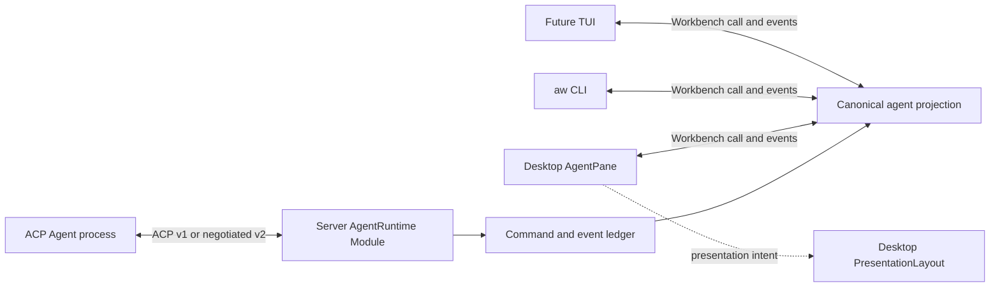
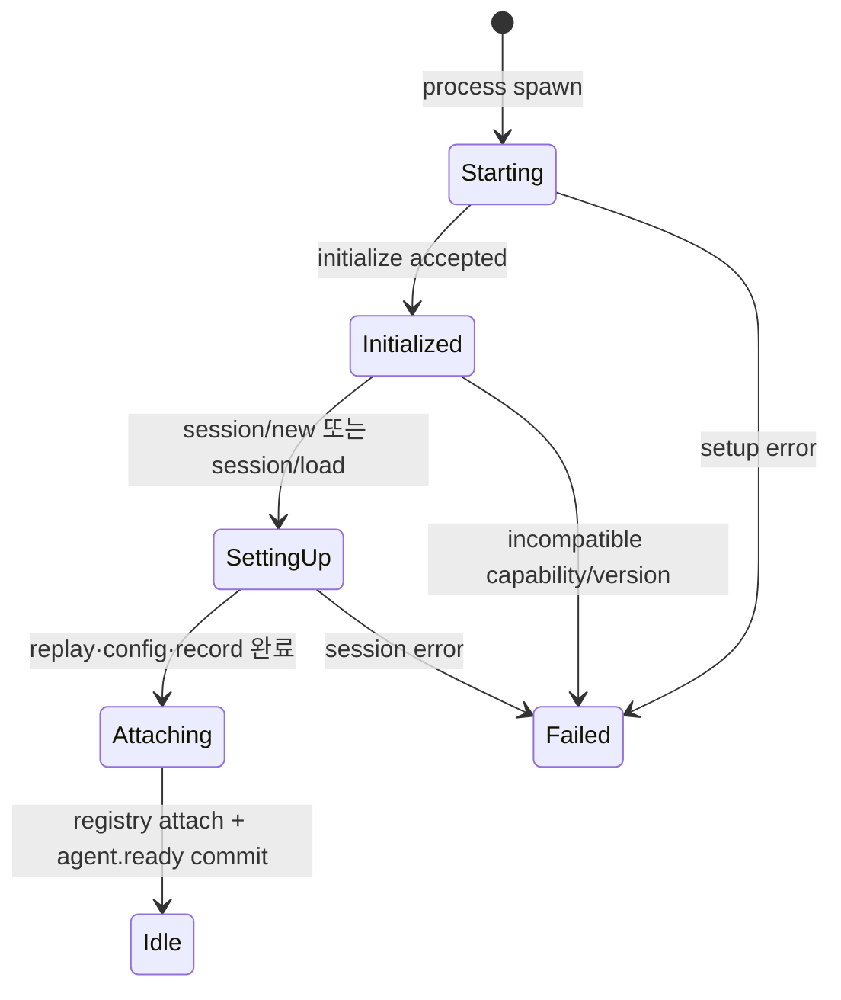
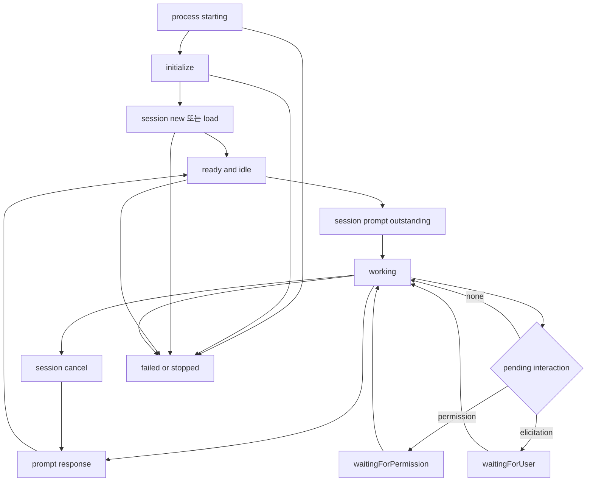

# AW ACP-native agent Interface 조사와 설계

> 조사 기준일: 2026-08-29
>
> 범위: 터미널 화면과 키 입력을 흉내 내지 않고, ACP v1의 구조화된 계약을 AW 서버·Desktop·CLI의 공통 agent Interface로 사용하는 방안
>
> 전제: 서버가 ACP process·Run·Session과 canonical event를 소유하고, Desktop은 tab·pane layout과 xterm.js renderer를 소유한다. ([서버-클라이언트 전환 조사](client-server-architecture-research.md), [pane·tab 식별자 설계](pane-tab-identifier-design.md))

## 결론

AW의 agent 제어면은 **terminal multiplexer 호환층이 아니라 ACP-native command·event·projection**으로 설계하는 것이 적합하다. ACP는 이미 protocol version과 capability 협상, session 생성·복원, prompt turn, typed stop reason, cancellation, message·thought·plan·tool·usage·session metadata update, permission, filesystem·command 실행, structured elicitation을 정의한다. 따라서 화면을 읽어 agent 상태를 추측할 이유가 없다. ([Initialization](https://agentclientprotocol.com/protocol/v1/initialization), [Session Setup](https://agentclientprotocol.com/protocol/v1/session-setup), [Prompt Turn](https://agentclientprotocol.com/protocol/v1/prompt-turn), [ACP v1 schema](https://agentclientprotocol.com/protocol/v1/schema))

권장 원칙은 다음과 같다.

1. `working`은 prompt request가 outstanding인지로, `settled`은 그 request의 response와 `stopReason`으로 판정한다. stdout 문구, cursor, ANSI screen은 사용하지 않는다. ([Prompt Turn lifecycle](https://agentclientprotocol.com/protocol/v1/prompt-turn#the-prompt-turn-lifecycle))
2. ACP 표준 payload를 최대한 보존한 append-only ledger를 서버의 source of truth로 둔다. Desktop·CLI·TUI는 같은 projection을 읽는다.
3. ACP가 주지 않는 `runId`, `commandId`, 순서·replay, queue, client별 seen/unseen, orchestration은 AW가 명시적으로 보강하되 ACP 사실처럼 꾸미지 않는다.
4. `_meta`는 extension evidence일 뿐 generic activity reducer의 권위 있는 입력으로 사용하지 않는다. ACP schema는 `_meta` 값에 대한 가정을 금지하고, extension은 capability로 먼저 광고하도록 권고한다. ([Extensibility](https://agentclientprotocol.com/protocol/v1/extensibility), [SessionInfoUpdate schema](https://agentclientprotocol.com/protocol/v1/schema#sessioninfoupdate))
5. ACP `terminal/*`은 agent가 호출하는 **구조화된 비대화형 command 실행 Interface**다. 사용자가 조작하는 xterm.js PTY pane과 동일한 resource로 취급하지 않는다. ([Terminals](https://agentclientprotocol.com/protocol/v1/terminals))
6. agent CLI에는 `send-keys`와 screen scraping을 제공하지 않는다. turn 취소는 `session/cancel`, agent가 만든 command 관찰은 tool/terminal ledger로 제공하고, raw key·resize·ANSI scrollback은 별도 `aw terminal` Interface에만 둔다. ([Prompt cancellation](https://agentclientprotocol.com/protocol/v1/prompt-turn#cancellation))
7. production 기본 protocol은 stable v1로 두고, Draft v2는 version negotiation과 feature flag 뒤의 별도 Adapter로 실험한다. ACP 공식 발표도 v1과 v2를 한동안 side-by-side 지원하고 v2를 기본 production으로 내보내지 말라고 명시한다. ([ACP v2 Draft announcement](https://agentclientprotocol.com/announcements/acp-v2-draft))

## ACP-native가 주는 제품적 장점

| 장점 | ACP-native 설계 | terminal emulation 방식과의 차이 | 근거 |
|---|---|---|---|
| 결정적인 상태 | request outstanding, permission/elicitation pending, typed response로 상태를 계산 | 화면 문구·prompt glyph·cursor 위치를 추측 | [Prompt Turn](https://agentclientprotocol.com/protocol/v1/prompt-turn), [Tool permission](https://agentclientprotocol.com/protocol/v1/tool-calls#requesting-permission) |
| provider 교체 가능성 | initialize에서 version과 capability를 협상하고 지원 기능만 호출 | binary 이름·TUI 버전마다 detector 필요 | [Capabilities](https://agentclientprotocol.com/protocol/v1/initialization#capabilities) |
| 구조화된 UX | plan checklist, tool timeline, file location, usage meter, permission form을 payload에서 직접 생성 | ANSI text를 다시 parse해 의미를 복원 | [Agent Plan](https://agentclientprotocol.com/protocol/v1/agent-plan), [Tool Calls](https://agentclientprotocol.com/protocol/v1/tool-calls), [Usage update](https://agentclientprotocol.com/protocol/v1/prompt-turn#session-usage-updates) |
| headless·다중 client | server ledger를 Desktop·CLI가 동일한 cursor로 replay | 보이지 않는 terminal viewport가 사실상 상태 저장소 | ACP message 자체는 구조화되어 있고, AW의 sequenced journal 기반은 이미 존재한다. ([현재 journal](../apps/agentic-workbench/src-tauri/src/infrastructure/in_memory_runtime_event_journal.rs)) |
| 정확한 완료 사유 | `end_turn`, `max_tokens`, `max_turn_requests`, `refusal`, `cancelled` 보존 | “idle 화면이 보임”을 성공 완료로 오판 가능 | [Stop Reasons](https://agentclientprotocol.com/protocol/v1/prompt-turn#stop-reasons) |
| 안전한 사용자 개입 | permission option과 elicitation action을 typed response로 반환 | 임의 키 입력이 잘못된 화면이나 process에 전달될 수 있음 | [Permission response](https://agentclientprotocol.com/protocol/v1/tool-calls#requesting-permission), [Elicitation](https://agentclientprotocol.com/protocol/v1/elicitation) |
| 풍부한 transcript | message ID와 ContentBlock을 그대로 보존 | terminal wrapping, ANSI, alternate screen 때문에 원문 손실 | [Message IDs](https://agentclientprotocol.com/protocol/v1/prompt-turn#message-ids), [Content](https://agentclientprotocol.com/protocol/v1/content) |
| command 관찰 | tool call ID, status, locations, embedded terminal ID를 연결 | command 문자열과 화면 출력의 관계를 추정 | [Tool Calls](https://agentclientprotocol.com/protocol/v1/tool-calls), [Embedding terminals](https://agentclientprotocol.com/protocol/v1/terminals#embedding-in-tool-calls) |

ACP-native는 “terminal을 제거한다”는 뜻이 아니다. agent가 테스트나 빌드를 실행하기 위한 ACP `terminal/*` Adapter와 사용자가 직접 shell을 조작하는 xterm.js `TerminalSession` Module을 서로 다른 목적과 수명으로 분리한다는 뜻이다.

## 표준화할 대상

표준화의 대상은 agent가 어느 terminal 모양으로 보이는지가 아니라 **agent와 주고받는 의미**다.

| 표준화 대상 | ACP-native 표현 | 표준화하지 않을 것 |
|---|---|---|
| 연결 | protocol version, implementation info, capability snapshot | executable 이름으로 agent 종류 추측 |
| 대화 | session, prompt turn, message ID, ContentBlock | terminal 한 줄을 user/agent message로 역추론 |
| 작업 | plan, tool call ID·kind·status·content·location | spinner·색상·prompt glyph 해석 |
| 사용자 개입 | permission option, elicitation form/URL | “승인할까요?” 같은 자연어 정규식 |
| 완료 | typed stop reason과 settled command | 화면이 조용한지 검사 |
| 복구 | session list/load/resume와 AW event replay | scrollback만 복원하면 session도 복원됐다고 간주 |

이 결정은 현재 pane이 모두 ACP라는 사실을 장점으로 바꾼다. 기존 `AgentRunPanel`을 terminal 호환 view로 일반화하지 않고 structured `AgentPane`로 깊게 만들 수 있다. 이후 xterm.js pane은 agent pane의 다른 렌더 모드가 아니라 `PaneContent`의 별도 variant로 추가한다.

```ts
type PaneContent =
  | { kind: "agent"; runId: RunId }
  | { kind: "terminal"; terminalSessionId: TerminalSessionId }
  | { kind: "empty" };
```

같은 server Run은 pane 없이 background로 계속될 수도 있고, 여러 Desktop presentation에 동시에 보일 수도 있다. 따라서 pane close와 run stop을 묶지 않는다.

## 서버가 유일한 ACP Client가 되는 구조

Desktop·CLI·TUI가 각자 agent subprocess에 연결하면 capability snapshot, pending permission, elicitation의 사용자 identity, prompt 순서가 client마다 갈라진다. AW 서버 하나만 ACP Client가 되고 나머지 client는 `Workbench` Interface를 사용한다.



이 구조에서 ACP의 `Client`는 Desktop 화면이 아니라 AW 서버다. 서버는 filesystem·command 실행·permission·elicitation callback의 실제 수신자이며, 인간 응답이 필요한 작업만 인증된 presentation client에 interaction intent로 전달한다. Desktop 연결이 끊겨도 ACP session과 prompt는 서버 정책에 따라 계속되고, 새 client는 snapshot과 cursor replay로 같은 상태를 본다.

## identity와 수명

ACP와 AW의 ID를 한 namespace로 합치지 않는다.

| identity | issuer | 범위·수명 | public target 사용 |
|---|---|---|---|
| `protocolSessionId` | ACP agent | 해당 agent implementation이 정의한 conversation 수명 | 직접 target하지 않고 server mapping 안에 보존 |
| `runId` | AW 서버 | process·connection·active session을 감싼 runtime 수명 | agent command의 기본 target |
| `commandId` | AW 서버 | 한 prompt/config/cancel command가 최종 결과를 얻을 때까지 | `prompt --wait`, audit, idempotency correlation |
| `toolCallId`·`messageId` | ACP agent | 해당 protocol session 안 | structured read와 event correlation |
| `tabId`·`paneId` | Desktop presentation | layout item 수명 | presentation target; occupant를 통해 `runId`로 해석 |

외부 응답에는 raw `protocolSessionId` 대신 server가 발급한 opaque `agentSessionRef`를 제공한다. server mapping은 최소 `(profileId, agent implementation identity, protocolVersion, protocolSessionId)`를 보존한다. 서로 다른 agent가 같은 session 문자열을 발급해도 충돌하지 않으며, ACP connection-local JSON-RPC request ID를 `commandId`로 노출하지 않는다.

## 기능 분류

### A. ACP 표준으로 직접 판정하거나 제공할 수 있는 기능

| 기능 | 권위 있는 입력 | AW에서 제공할 결과 | 근거 |
|---|---|---|---|
| protocol 호환성 | initialize request/response의 `protocolVersion` | 지원하지 않는 major는 session 생성 전 실패 | [Version negotiation](https://agentclientprotocol.com/protocol/v1/initialization#version-negotiation) |
| capability 조회 | `clientCapabilities`, `agentCapabilities`, `agentInfo` | provider별 기능 표와 UI/CLI command availability | [Capabilities](https://agentclientprotocol.com/protocol/v1/initialization#capabilities) |
| 새 session ready | `session/new` response | 새 prompt를 받을 수 있는 session | [Creating a Session](https://agentclientprotocol.com/protocol/v1/session-setup#creating-a-session) |
| session load ready | `session/load` replay 종료 뒤 response | history projection을 복구한 live session | [Loading Sessions](https://agentclientprotocol.com/protocol/v1/session-setup#loading-sessions) |
| session discovery | advertised `sessionCapabilities.list`와 `session/list` | agent가 소유한 session history 조회·pagination | [Session List](https://agentclientprotocol.com/protocol/v1/session-list) |
| session resume | advertised `sessionCapabilities.resume`와 `session/resume` | history replay 없이 active session 재연결 | [Resuming Sessions](https://agentclientprotocol.com/protocol/v1/session-setup#resuming-sessions) |
| active session close | advertised `sessionCapabilities.close`와 `session/close` | ongoing work 취소와 active resource 해제 요청 | [Closing Active Sessions](https://agentclientprotocol.com/protocol/v1/session-setup#closing-active-sessions) |
| session history delete | advertised `sessionCapabilities.delete`와 `session/delete` | 향후 `session/list`에서 제거 | [Session Delete](https://agentclientprotocol.com/protocol/v1/session-delete) |
| prompt 제출 | `session/prompt` request | typed content prompt command | [User Message](https://agentclientprotocol.com/protocol/v1/prompt-turn#1-user-message) |
| working | 해당 `session/prompt` response가 아직 없음 | `activity=working` | [Prompt Turn lifecycle](https://agentclientprotocol.com/protocol/v1/prompt-turn#the-prompt-turn-lifecycle) |
| turn settled | `session/prompt` response | `activity=idle`, typed `stopReason` 기록 | [Check for Completion](https://agentclientprotocol.com/protocol/v1/prompt-turn#4-check-for-completion) |
| turn 취소 | `session/cancel`, 뒤따르는 `stopReason=cancelled` | `cancelRequested → settled(cancelled)` | [Prompt cancellation](https://agentclientprotocol.com/protocol/v1/prompt-turn#cancellation) |
| transcript | `user_message_chunk`, `agent_message_chunk`, optional `messageId`, ContentBlock | message 단위로 합쳐지는 rich transcript | [SessionUpdate schema](https://agentclientprotocol.com/protocol/v1/schema#sessionupdate) |
| thought stream | `agent_thought_chunk` | 별도 thought projection | [SessionUpdate schema](https://agentclientprotocol.com/protocol/v1/schema#sessionupdate) |
| plan | complete `plan.entries` update | update마다 전체 replace하는 checklist | [Updating Plans](https://agentclientprotocol.com/protocol/v1/agent-plan#updating-plans) |
| tool 상태 | `tool_call`, `tool_call_update`, `toolCallId` | pending/in_progress/completed/failed timeline | [Tool call status](https://agentclientprotocol.com/protocol/v1/tool-calls#status) |
| file follow | tool `locations` | 파일·line 이동 intent | [Following the Agent](https://agentclientprotocol.com/protocol/v1/tool-calls#following-the-agent) |
| usage | `usage_update.used`, `size`, optional `cost` | context 사용량과 누적 비용 | [Session Usage Updates](https://agentclientprotocol.com/protocol/v1/prompt-turn#session-usage-updates) |
| session metadata | `session_info_update.title`, `updatedAt` | provider-neutral title·last activity | [SessionInfoUpdate schema](https://agentclientprotocol.com/protocol/v1/schema#sessioninfoupdate) |
| session 설정 | setup response와 `config_option_update` | model·mode·reasoning 등 typed selector와 현재 값 | [Session Config Options](https://agentclientprotocol.com/protocol/v1/session-config-options) |
| advertised command | `available_commands_update` | provider가 제공하는 command picker와 input hint | [Slash Commands](https://agentclientprotocol.com/protocol/v1/slash-commands) |
| permission blocked | unresolved `session/request_permission` | `activity=waitingForPermission`과 option UI | [Requesting Permission](https://agentclientprotocol.com/protocol/v1/tool-calls#requesting-permission) |
| structured user input | advertised `elicitation` mode의 unresolved `elicitation/create` | `activity=waitingForUser`, form 또는 safe URL consent | [Elicitation capabilities](https://agentclientprotocol.com/protocol/v1/elicitation#checking-support) |
| filesystem callback | advertised `fs` method | workspace 정책 안의 text read/write | [File System](https://agentclientprotocol.com/protocol/v1/file-system) |
| agent command 실행 | advertised `terminal` methods | create/output/wait/kill/release와 exit status | [Terminals](https://agentclientprotocol.com/protocol/v1/terminals) |

### B. ACP 위에 AW projection·ledger가 추가로 필요한 기능

ACP가 대화 protocol이라는 사실과 AW가 여러 client를 가진 durable workbench라는 사실은 다르다. 다음 기능은 ACP event를 근거로 만들 수 있지만 ACP 자체에 존재하지 않는다.

| 기능 | 필요한 AW 보강 | ACP와 섞지 않아야 하는 이유 |
|---|---|---|
| `runId`와 agent alias | server resource ID와 workspace-scoped alias | ACP `sessionId`는 agent가 발급한 conversation identity이며 AW Run 수명과 다르다. ([Session ID](https://agentclientprotocol.com/protocol/v1/session-setup#session-id)) |
| `commandId` | 각 prompt submission에 AW가 발급하고 ACP request ID와 연결 | JSON-RPC request ID는 한 connection의 transport correlation이고 durable public ID가 아니다. ([JSON-RPC transport](https://agentclientprotocol.com/protocol/v1/transports)) |
| start `--wait-ready` | setup 완료와 registry attach 뒤 `agent.ready` event | `session/new/load` response는 protocol ready를 알려주지만 server registry publish 완료까지 보장하지 않는다. 현재 AW는 background launch를 즉시 반환한다. ([현재 start use case](../crates/acp-agent-core/src/application/start_agent_run.rs)) |
| queue·replace policy | `direct`, `queue`, `cancelAndSend` command ledger | ACP v1은 session prompt turn을 정의하지만 AW의 다중 caller queue 정책은 정의하지 않는다. 현재 AW도 in-flight mutex로 이를 별도 구현한다. ([현재 prompt guard](../crates/acp-agent-core/src/infrastructure/acp/runner.rs)) |
| `agent wait` | snapshot + event cursor + terminal condition | reconnect·timeout·여러 CLI process의 wait는 Workbench server의 전달 계약이다. |
| replay | `epoch`, per-stream `sequence`, durable retention, gap recovery snapshot | `session/load` replay는 agent conversation 복구이고, AW network event replay와 목적이 다르다. ([Session load replay](https://agentclientprotocol.com/protocol/v1/session-setup#loading-sessions), [현재 bounded journal](../apps/agentic-workbench/src-tauri/src/infrastructure/in_memory_runtime_event_journal.rs)) |
| `idle` snapshot | session live + active prompt/permission/elicitation 없음 | ACP에는 지속적으로 전송되는 `idle` notification이 없다. request 상태에서 계산해야 한다. |
| `done/unseen` | completion sequence와 client별 seen cursor | 이는 presentation attention 상태이며 provider나 ACP session의 전역 상태가 아니다. |
| 권한 응답 소유권 | verified human principal, claim/timeout/handoff, durable audit | ACP는 option payload를 정의하지만 AW 다중 client 중 누가 답할지는 정의하지 않는다. |
| orchestration | task/node/parent/goal ledger와 agent command 연결 | ACP prompt turn은 AW task DAG가 아니다. |
| pane·tab 연결 | `PaneContentRef → runId` client projection | pane은 Desktop presentation resource이고 ACP session resource가 아니다. ([pane·tab 식별자 설계](pane-tab-identifier-design.md)) |
| embedded command output 보존 | terminal release 전 final snapshot을 tool ledger에 저장 | ACP는 release 후에도 embedded terminal 출력을 표시하길 권고하므로 server projection이 snapshot을 유지해야 한다. ([Releasing Terminals](https://agentclientprotocol.com/protocol/v1/terminals#releasing-terminals)) |
| provider extension 해석 | 명시적으로 등록된 namespace Adapter와 capability gate | `_meta`의 임의 값을 generic contract로 승격하면 provider 교체 가능성을 잃는다. ([Advertising Custom Capabilities](https://agentclientprotocol.com/protocol/v1/extensibility#advertising-custom-capabilities)) |

### C. terminal-only로 분리할 기능

| 기능 | agent Interface | terminal Interface | 이유 |
|---|---|---|---|
| arbitrary key·문자 입력 | 제공하지 않음 | `terminal.input` | ACP prompt는 ContentBlock이고 stdin keystroke가 아니다. ([Prompt request](https://agentclientprotocol.com/protocol/v1/prompt-turn#1-user-message)) |
| `Esc`, control sequence | 제공하지 않음 | interactive PTY에만 전달 | agent turn 의미가 provider TUI key binding에 종속되면 표준화가 깨진다. |
| `Ctrl+C` | `agent.cancel-turn`으로 semantic mapping | interactive shell에서는 raw control byte 가능 | ACP는 turn 취소를 `session/cancel`로 정의한다. ([Prompt cancellation](https://agentclientprotocol.com/protocol/v1/prompt-turn#cancellation)) |
| resize·rows·cols | 해당 없음 | `terminal.resize` | ACP `terminal/create`에는 PTY geometry나 input method가 없다. ([Terminal create](https://agentclientprotocol.com/protocol/v1/terminals#executing-commands)) |
| ANSI screen·cursor·alternate screen | 읽지 않음 | xterm renderer/client-local viewport | ACP agent output은 structured ContentBlock·tool update다. |
| scrollback read | `agent.read --view transcript|tools|events` | `terminal.read --mode raw|screen|scrollback` | 서로 다른 data model을 같은 `read` source 이름으로 위장하지 않는다. |
| shell job control·interactive auth | agent process 제어에 사용하지 않음 | user TerminalSession 또는 ACP terminal authentication | ACP command terminal과 interactive authentication은 별도 capability다. ([Terminal authentication](https://agentclientprotocol.com/protocol/v1/initialization#terminal-authentication)) |
| process/TUI 자동 감지 | 필요 없음 | terminal diagnostics에서만 가능 | AW agent 대상은 등록된 ACP runtime이므로 screen detector로 occupant 종류를 추정할 이유가 없다. |

## 공식 ACP 기능과 현재 AW 구현의 차이

### 1. initialize와 capability negotiation

ACP는 session 생성 전에 initialize를 의무화하고, 누락된 capability는 unsupported로 취급하도록 한다. client와 agent는 protocol version에 합의해야 하며, rich prompt content도 agent가 광고한 범위로 제한해야 한다. ([Initialization](https://agentclientprotocol.com/protocol/v1/initialization))

현재 AW는 typed `InitializeRequest`를 보내고 `fs.readTextFile`, `fs.writeTextFile`, `terminal`을 광고한다. agent response에서는 `agentInfo`, `loadSession`, HTTP MCP capability를 일부 사용한다. 그러나 협상 결과 전체를 durable 상태로 보존하거나 CLI에 노출하지 않고, capability에 따라 모든 후속 Interface를 일관되게 gate하지는 않는다. ([initialize·capability 처리](../crates/acp-agent-core/src/infrastructure/acp/runner.rs))

권장 변경은 `AcpCapabilityProfile`을 session의 immutable setup 결과로 저장하는 것이다.

```ts
type AcpCapabilityProfile = {
  negotiatedProtocolVersion: number;
  agentInfo: { name: string; title?: string; version: string } | null;
  agent: {
    loadSession: boolean;
    session: {
      list: boolean;
      resume: boolean;
      close: boolean;
      delete: boolean;
      additionalDirectories: boolean;
    };
    prompt: {
      text: true;
      resourceLink: true;
      image: boolean;
      audio: boolean;
      embeddedContext: boolean;
    };
    mcp: { http: boolean; sse: boolean };
    extensions: Record<string, unknown>;
  };
  client: {
    fs: { readTextFile: boolean; writeTextFile: boolean };
    terminal: boolean;
    elicitation: { form: boolean; url: boolean };
  };
};
```

이 profile로 `agent capabilities`, Desktop composer의 attachment 종류, CLI schema validation, permission·elicitation UI를 함께 구동한다. provider 이름으로 기능을 추측하지 않는다.

initialize 결과만으로 session surface 전체를 알 수는 없다. `session/new|load|resume` response와 이후 update에서 받은 `configOptions`, legacy `modes`, `availableCommands`를 별도 `SessionFeatureSnapshot`으로 유지한다. Config Options가 있으면 전용 mode보다 우선하고, advertised slash command는 별도 RPC method처럼 실행하지 않고 ACP가 정한 대로 일반 prompt content로 전송한다. ([Session Config Options](https://agentclientprotocol.com/protocol/v1/session-config-options), [Slash Commands](https://agentclientprotocol.com/protocol/v1/slash-commands))

capability 하나만으로 command를 노출해서도 안 된다. 실제 availability는 다음 네 gate의 교집합이다.

```text
peer protocol support
∩ AW implementation support
∩ caller principal scope
∩ current runtime precondition
= operation availability
```

예를 들어 agent가 `session/delete`를 광고해도 AW Adapter가 아직 구현하지 않았거나 caller가 agent principal이면 삭제 command를 노출하지 않는다. 반대로 현재 AW에 handler가 있어도 peer가 capability를 누락했다면 호출하지 않는다. `aw agent capabilities`와 `system.describe`는 각 operation을 `available` boolean 하나로 평탄화하지 않고 다음 reason을 함께 반환한다.

- `peerNotAdvertised`
- `awNotImplemented`
- `principalNotAuthorized`
- `invalidRuntimeState`
- `experimentalFeatureDisabled`

### 2. session new/load와 ready

ACP에서 `session/new` response는 새 session ID를 반환하고, `session/load`는 과거 대화를 `session/update`로 모두 replay한 뒤에야 원 요청에 응답한다. 그 시점부터 client는 prompt를 계속 보낼 수 있다. ([Session Setup](https://agentclientprotocol.com/protocol/v1/session-setup))

현재 AW는 `session/new`와 capability-gated `session/load`를 구현한다. 하지만 `SessionCreated`를 session 설정 적용과 session record 저장보다 먼저 emit하고, `StartAgentRunUseCase`가 session registry에 attach하기 전에 외부에 노출될 수 있다. start call 자체도 background task를 만든 뒤 즉시 `AgentRun`을 반환한다. ([setup 순서](../crates/acp-agent-core/src/infrastructure/acp/runner.rs), [registry attach 순서](../crates/acp-agent-core/src/application/start_agent_run.rs))

따라서 외부의 ready 기준을 다음처럼 강화한다.



`agent.ready`는 ACP notification이 아니라 AW canonical event이며, **session setup response 수신, replay 반영, config 적용, session record 저장, registry attach를 모두 완료한 transaction 이후** 한 번만 기록한다. `agent start --wait-ready`는 이 event를 기다린다.

`session/load` 중 받은 update에는 `phase="replay"`, live turn update에는 `phase="turn"`을 붙인다. replay message를 현재 active prompt의 출력으로 잘못 연결하지 않는다.

#### 최신 stable v1 session 관리 기능

현재 공식 ACP v1에는 `new/load` 외에도 capability-gated `list`, `resume`, `close`, `delete`가 stable Interface로 정의되어 있다. `list`는 agent가 아는 session을 opaque cursor로 조회하고, `resume`은 history replay 없이 reconnect하며, `close`는 active work와 resource 해제를 요청하고, `delete`는 session history 목록에서 제거한다. 각 method는 해당 `sessionCapabilities.*`가 없으면 호출하면 안 된다. ([Session List](https://agentclientprotocol.com/protocol/v1/session-list), [Session Setup](https://agentclientprotocol.com/protocol/v1/session-setup), [Session Delete](https://agentclientprotocol.com/protocol/v1/session-delete))

현재 AW locked SDK는 `agent-client-protocol 0.15.1`이고 runner가 실제 사용하는 session 기능은 `new`와 legacy `loadSession` boolean으로 gate한 `load`뿐이다. `sessionCapabilities.list/resume/close/delete`를 읽거나 해당 method를 호출하는 구현은 없다. 따라서 “ACP v1에 없음”이 아니라 **최신 stable v1에는 있지만 현재 AW Adapter가 아직 사용하지 않음**으로 분류해야 한다. ([Cargo lock](../Cargo.lock), [현재 runner](../crates/acp-agent-core/src/infrastructure/acp/runner.rs))

AW의 `agent sessions`와 `agent stop`을 곧바로 이 method에 1:1로 묶지는 않는다. AW Run 종료, active ACP session close, provider history delete는 서로 다른 수명이다. capability가 있을 때 다음처럼 명시적인 operation으로 제공한다.

```text
agent session list      -> session/list
agent session resume    -> session/resume
agent session close     -> session/close
agent session delete    -> session/delete
agent stop              -> AW Run/process lifecycle 종료
```

### 3. prompt turn, stopReason, cancel

ACP prompt turn은 `session/prompt` request부터 response까지의 명확한 구간이고 response에는 stop reason이 필수다. cancel은 `session/cancel`을 보내고 최종 `stopReason=cancelled`를 확인하는 feature-specific 흐름이다. 일반 `$/cancel_request`도 2026-06-29 안정화됐지만, 공식 문서는 prompt에는 더 풍부한 `session/cancel` 의미가 계속 존재한다고 구분한다. ([Prompt Turn](https://agentclientprotocol.com/protocol/v1/prompt-turn), [Cancellation](https://agentclientprotocol.com/protocol/v1/cancellation), [stabilization announcement](https://agentclientprotocol.com/announcements/request-cancellation-stabilized))

현재 AW는 active prompt의 JSON-RPC request ID를 추적하고 응답을 기다리지만, stop reason을 `PromptCompleted.message="stopReason=..."` 문자열로 평탄화한다. turn 취소도 `session/cancel`이 아니라 active request에 `$/cancel_request`를 보낸다. public send use case는 background task만 만들고 command ID를 반환하지 않는다. ([prompt 구현](../crates/acp-agent-core/src/infrastructure/acp/runner.rs), [cancel notification](../crates/acp-agent-core/src/infrastructure/acp/transport.rs), [send use case](../crates/acp-agent-core/src/application/send_prompt.rs))

목표 ledger는 다음 상관관계를 보존한다.

```ts
type AgentCommandRecord = {
  commandId: string;
  runId: string;
  sessionId: string;
  kind: "prompt";
  delivery: "direct" | "queue" | "cancelAndSend";
  requestId: number | null;
  state: "accepted" | "queued" | "active" | "settled" | "failed";
  stopReason:
    | "end_turn"
    | "max_tokens"
    | "max_turn_requests"
    | "refusal"
    | "cancelled"
    | null;
};
```

`agent prompt --wait --command <commandId>`는 다른 turn의 idle 전이를 잡지 않고 정확히 이 record의 `settled|failed`를 기다린다. cancel은 `session/cancel`을 우선 사용하며, unresolved permission에는 ACP가 요구하는 `cancelled` outcome을 돌려주고, outstanding tool을 projected `cancelled`로 먼저 표시한다. ([ACP cancellation requirements](https://agentclientprotocol.com/protocol/v1/prompt-turn#cancellation))

active-turn steer는 ACP v1 표준 기능으로 제공하지 않는다. 현재 AW도 steer를 항상 unsupported로 반환한다. provider extension을 도입하더라도 capability-advertised optional command로만 노출한다. ([현재 steer 구현](../crates/acp-agent-core/src/infrastructure/acp/runner.rs), [Extensibility](https://agentclientprotocol.com/protocol/v1/extensibility))

### 4. session/update를 손실 없이 보존

현재 mapper는 표준 update를 AW `RunEvent`로 바꾸지만 일부 ACP 의미를 잃는다. ([현재 update mapper](../crates/acp-agent-core/src/infrastructure/acp/session_update_mapper.rs), [현재 RunEvent](../crates/acp-agent-core/src/domain/events.rs))

| ACP update | 현재 보존 | 현재 손실 | 목표 projection |
|---|---|---|---|
| user message | raw fallback | typed message·ContentBlock grouping | `message.delta(role=user, messageId, content)` |
| agent message | text | `messageId`, non-text ContentBlock | `message.delta(role=agent, messageId, content)` |
| thought | text | `messageId`, non-text ContentBlock | 접근 정책을 가진 `thought.delta` |
| plan | content, status | required priority | complete replacement `plan.replaced` |
| tool call/update | ID, status, title, locations, 추출한 file change | kind, full content, raw input/output와 patch semantics 일부 | tool ID 기반 merge ledger + presentation-safe projection |
| usage | used, size | optional cost/currency | `usage.updated(used,size,cost)` |
| session info | title, updatedAt, Codex `_meta` status | 표준 field와 provider extension이 한 event에 혼합 | 표준 metadata와 extension evidence 분리 |

ACP는 message chunk의 `messageId`를 optional opaque ID로 정의하고, plan update는 매번 전체 목록을 보내 client가 완전히 replace하도록 요구한다. Tool update는 `toolCallId` 외 필드가 partial이고, content·location·raw input/output까지 포함할 수 있다. Usage에는 cost도 포함될 수 있다. 이 규칙을 canonical projection의 reducer semantics로 그대로 채택한다. ([SessionUpdate schema](https://agentclientprotocol.com/protocol/v1/schema#sessionupdate), [Updating Plans](https://agentclientprotocol.com/protocol/v1/agent-plan#updating-plans), [Updating Tool Calls](https://agentclientprotocol.com/protocol/v1/tool-calls#updating), [Session Usage Updates](https://agentclientprotocol.com/protocol/v1/prompt-turn#session-usage-updates))

### 5. permission과 elicitation

Permission은 tool call과 선택 가능한 option을 포함한 request이며, client는 selected 또는 cancelled outcome으로 응답한다. Client는 user 설정에 따라 자동 allow/reject할 수 있다. ([Tool permission](https://agentclientprotocol.com/protocol/v1/tool-calls#requesting-permission))

현재 AW는 permission ID를 별도로 발급하고 `requires_response=true` event 뒤 waiter를 기다려 응답한다. 이것은 structured blocked 상태의 좋은 기반이다. 하지만 waiter가 memory에 있고 server/client 분리 후 승인 client 연결이 끊길 때의 timeout·handoff가 필요하다. ([현재 permission flow](../crates/acp-agent-core/src/infrastructure/acp/permission_flow.rs), [현재 permission broker](../crates/acp-agent-core/src/infrastructure/permission_broker.rs))

Elicitation은 2026-07-24 ACP v1에 안정화되어 form과 URL mode를 정의한다. Form은 non-sensitive 정보에만 사용하고, URL은 사용자가 전체 URL을 확인하고 동의한 뒤 secure context에서 열어야 한다. Agent는 client가 광고하지 않은 mode를 요청할 수 없다. ([Elicitation](https://agentclientprotocol.com/protocol/v1/elicitation), [stabilization announcement](https://agentclientprotocol.com/announcements/elicitation-stabilized))

현재 AW의 dependency는 `agent-client-protocol 0.15.1`이고 schema는 `0.14.0`이다. 이 SDK에서 elicitation은 default가 아닌 `unstable_elicitation` feature이며, AW Cargo dependency는 feature를 켜지 않았다. initialize도 elicitation을 광고하지 않고 incoming request dispatcher도 `elicitation/create`를 처리하지 않는다. 따라서 **공식 최신 ACP에는 표준이지만 현재 AW에는 아직 미구현**이다. ([Cargo lock](../Cargo.lock), [core dependency](../crates/acp-agent-core/Cargo.toml), [현재 initialize](../crates/acp-agent-core/src/infrastructure/acp/runner.rs), [현재 request dispatcher](../crates/acp-agent-core/src/infrastructure/acp/client.rs), [ACP Rust SDK 1.0 announcement](https://agentclientprotocol.com/announcements/sdk-1-0-releases))

권장 순서는 ACP Rust SDK 1.x로 올리고 typed handler를 추가한 뒤 `form`만 먼저 광고하는 것이다. `waitingForUser`는 unresolved elicitation에서만 설정한다. agent가 message text로 질문했다는 이유만으로 blocked를 추론하지 않는다. URL mode는 user identity binding, consent, secure browser Adapter와 완료 notification 검증이 갖춰진 뒤 별도 enable한다.

### 6. filesystem과 ACP terminal client methods

ACP filesystem method는 Agent가 Client environment의 text file을 읽고 쓰는 표준 callback이다. Agent는 initialize에서 광고된 method만 호출해야 한다. ([File System](https://agentclientprotocol.com/protocol/v1/file-system))

현재 AW는 두 method를 광고하고 workspace 내부로 path를 제한하여 실제 파일을 읽고 쓴다. server 구조에서는 이를 `WorkspaceFileAccess` Module 뒤로 옮겨 session의 workspace scope, symlink-safe path policy, principal과 audit를 한곳에서 적용한다. Desktop unsaved buffer까지 제공하려면 session별로 어느 Desktop overlay가 authoritative인지 명시해야 하며, 합의되지 않은 상태에서는 disk Adapter만 광고한다. ([현재 filesystem handler](../crates/acp-agent-core/src/infrastructure/acp/client.rs))

ACP terminal methods는 command·args·env·cwd를 구조적으로 받고 terminal ID를 즉시 반환한 뒤 output, wait, kill, release를 제공한다. `terminal/release`는 실행 중인 command를 kill하고 resource를 해제해야 하며, retained output을 byte limit로 자를 때 character boundary를 보존해야 한다. ([Executing Commands](https://agentclientprotocol.com/protocol/v1/terminals#executing-commands), [Releasing Terminals](https://agentclientprotocol.com/protocol/v1/terminals#releasing-terminals))

현재 AW `TerminalHandler`는 stdin을 null로 두고 stdout/stderr를 bounded buffer에 수집하므로 interactive PTY가 아니라 ACP command executor라는 점은 올바르다. 그러나 `release`는 map에서 state를 제거하고 reader task만 abort하며, running child를 명시적으로 kill/reap하지 않는다. byte buffer는 임의 byte 위치에서 앞을 잘라 UTF-8 character boundary를 보장하지 않는다. SDK 1.x 전환과 함께 ACP conformance test로 보완해야 한다. ([현재 TerminalHandler](../crates/acp-agent-core/src/infrastructure/acp/terminal.rs))

### 7. extensibility와 provider-specific `_meta`

현재 ACP v1은 custom field를 root에 추가하지 말고 `_meta` 안에 넣도록 하며, custom method는 `_`로 시작하도록 예약한다. Extension은 capability object의 `_meta`에서 먼저 광고하고, unrecognized custom request에는 Method not found, unrecognized notification은 ignore하는 동작을 권고한다. ([Extensibility](https://agentclientprotocol.com/protocol/v1/extensibility))

현재 AW는 `session_info_update._meta.codex.threadStatus.type`을 `RunEvent::SessionInfo.thread_status`로 승격한다. 또한 `ext/`로 시작하는 모든 request를 성공 `{}`로 응답하고 raw event만 남긴다. 두 동작 모두 provider-neutral core의 권위 있는 표준 상태로 사용하기에는 부적합하다. ([현재 session info mapping](../crates/acp-agent-core/src/infrastructure/acp/session_update_mapper.rs), [현재 extension request 처리](../crates/acp-agent-core/src/infrastructure/acp/client.rs))

권장 extension 규칙은 다음과 같다.

- generic ACP reducer는 표준 field만 해석한다.
- `_meta` 원문은 size·redaction 정책 아래 `extensionEvidence`로 보존할 수 있다.
- `ExtensionRegistry`에 namespace와 negotiated capability가 등록된 경우에만 해당 Adapter가 typed projection을 생성한다.
- extension projection은 `source="providerExtension"`, `provider`, `namespace`, `confidence`를 표시한다.
- provider thread status는 standard `working/idle/permission/elicitation`보다 우선하지 않는다. 충돌하면 diagnostic만 남긴다.
- catch-all request에 거짓 성공을 반환하지 않는다. 공식 prefix와 capability를 만족하지 않는 request는 Method not found로 응답한다.

### 8. stable v1과 Draft v2의 side-by-side Adapter

ACP v2는 2026-07-20 현재 공식적으로 **Draft**다. v2는 prompt response를 work 완료가 아니라 message acknowledgement로 바꾸고, agent가 별도 idle state를 알리며, session update가 prompt lifecycle 밖에서도 계속될 수 있게 하는 등 activity model을 크게 바꾼다. 공식 발표는 v2 구현을 version negotiation과 feature flag 뒤에 두고 production 기본값으로 내보내지 않으며 v1 peer도 계속 지원하라고 요구한다. ([ACP v2 Draft announcement](https://agentclientprotocol.com/announcements/acp-v2-draft), [v2 migration guide](https://agentclientprotocol.com/protocol/v2/migration))

따라서 reducer에 `if version == 2` 분기를 흩뿌리지 않고 protocol Adapter seam을 둔다.

```ts
interface AcpVersionAdapter {
  negotiate(connection: RpcConnection): Promise<NegotiatedAcpSession>;
  startSession(input: SessionStartInput): Promise<SessionReady>;
  dispatch(command: ProtocolCommand): Promise<ProtocolCommandResult>;
  reduce(message: JsonRpcMessage): ProtocolEvent[];
}
```

- `AcpV1Adapter`: stable production Adapter. outstanding `session/prompt`와 stop reason을 turn lifecycle의 권위로 사용한다.
- `AcpV2Adapter`: experimental Adapter. feature flag가 있고 peer가 v2를 협상했을 때만 사용하며 explicit processing/idle state와 session-wide update를 해석한다.
- 두 Adapter는 동일한 AW canonical event를 출력하지만, version-specific 사실을 억지로 동일시하지 않는다. 예를 들어 v1의 prompt settled와 v2의 message acknowledged는 같은 event가 아니다.
- contract test는 같은 fixture를 공유하는 대신 version별 official golden frame을 각 Adapter Interface에서 검증한다.

#### v2 display terminal은 interactive PTY가 아니다

v2는 v1의 client-side `fs/*`와 `terminal/create|output|wait|kill|release`를 제거하고, client tool은 MCP server로 제공하도록 바꾼다. 대신 agent-owned terminal의 `terminal_update`와 `terminal_output_chunk`를 session update로 전달한다. 이 surface는 output snapshot·chunk·exit state를 표시하기 위한 것이며 input, resize, interrupt, kill, wait, release, execution semantics가 전혀 없는 display-only terminal이다. ([v2 migration: Agent-owned terminal display](https://agentclientprotocol.com/protocol/v2/migration#agent-owned-terminal-display), [v2 migration: Client execution removed](https://agentclientprotocol.com/protocol/v2/migration#client-file-system-and-terminal-execution-removed), [v2 Terminal schema](https://agentclientprotocol.com/protocol/v2/schema#terminal))

따라서 terminal resource는 세 종류를 구분한다.

| 종류 | 소유자 | 제어 | renderer | 수명 |
|---|---|---|---|---|
| ACP v1 client command terminal | AW ACP client Adapter | agent가 v1 `terminal/*` 호출 | tool output 또는 sanitized transcript | ACP v1 session 내부 |
| ACP v2 agent-owned display terminal | agent | AW는 snapshot/chunk/exit를 관찰만 함 | isolated read-only xterm 또는 sanitized transcript | ACP v2 session item |
| AW interactive PTY TerminalSession | AW server + user principal | input·resize·signal·terminate | Desktop xterm.js | Workbench resource, ACP와 독립 |

v2 terminal ID를 AW `TerminalSessionId`로 승격하거나 CLI `terminal input` 대상으로 사용하면 안 된다. 동일 xterm.js renderer를 재사용하더라도 v2 display Adapter는 read-only이며 키 입력·resize·process control Interface를 노출하지 않는다.

## 목표 Module과 event model

복잡한 JSON-RPC·capability·correlation·reducer를 각 Desktop/CLI caller에 노출하지 않고 서버의 깊은 `AgentRuntime` Module 안에 숨긴다. Production ACP Adapter와 deterministic fake ACP Adapter가 같은 Interface를 만족하므로 seam이 실제로 유효하다.

```ts
interface AgentRuntime {
  execute(command: AgentCommand): Promise<AgentCommandAccepted>;
  snapshot(query: AgentSnapshotQuery): Promise<AgentSnapshot>;
  subscribe(cursor: AgentEventCursor): AsyncIterable<AgentEventEnvelope>;
}
```

외부 Interface는 세 동작만 알면 된다.

- `execute`: start, prompt, cancelTurn, stop, permission response, elicitation response를 discriminated command로 받는다.
- `snapshot`: run, transcript, plan, tools, usage, pending interaction을 consistent revision에서 읽는다.
- `subscribe`: epoch·sequence cursor부터 replay 후 live event를 받는다.

내부 Implementation은 ACP connection supervisor, capability profile, command ledger, transcript/tool reducer, interaction broker, process containment를 소유한다. caller에게 JSON-RPC request ID, mutex, provider `_meta` 경로를 노출하지 않는다.

### canonical event envelope

```ts
type AgentEventEnvelope = {
  eventId: string;
  streamId: `agent:${string}`;
  epoch: string;
  sequence: number;
  occurredAt: string;
  runId: string;
  agentSessionRef: string | null;
  commandId: string | null;
  phase: "setup" | "replay" | "turn" | "outOfBand";
  source: "acpStandard" | "providerExtension" | "awRuntime";
  schema: string;
  payload: unknown;
};
```

표준 event schema의 최소 집합은 다음과 같다.

아래 `.v1` suffix는 ACP version이 아니라 **AW event schema의 major**다. ACP v1 Adapter와 v2 Adapter가 같은 canonical 의미를 만들면 같은 event schema를 사용한다.

- `aw.agent.capabilitiesNegotiated.v1`
- `aw.agent.ready.v1`
- `aw.agent.commandAccepted.v1`
- `aw.agent.promptStarted.v1`
- `aw.agent.messageDelta.v1`
- `aw.agent.thoughtDelta.v1`
- `aw.agent.planReplaced.v1`
- `aw.agent.toolUpserted.v1`
- `aw.agent.usageUpdated.v1`
- `aw.agent.sessionInfoUpdated.v1`
- `aw.agent.permissionRequested.v1`
- `aw.agent.permissionResolved.v1`
- `aw.agent.elicitationRequested.v1`
- `aw.agent.elicitationResolved.v1`
- `aw.agent.promptSettled.v1`
- `aw.agent.failed.v1`
- `aw.agent.stopped.v1`

raw ACP frame log는 diagnostic·보안 감사용 별도 저장소다. 안정적인 Desktop/CLI contract는 raw JSON path에 직접 의존하지 않는다. 현재 AW가 `.acp-raw-events/<runId>.jsonl`에 수신 frame을 저장하는 기반은 유지할 수 있지만, secret/redaction·retention·access policy를 추가해야 한다. ([현재 raw event log](../crates/acp-agent-core/src/infrastructure/acp/client.rs))

### 권위 있는 상태 reducer



이 흐름의 `prompt response`는 stable v1 Adapter의 완료 입력이다. Experimental v2 Adapter에서는 빠른 prompt acknowledgement가 아니라 `state_update(state=idle, stopReason=...)`를 같은 canonical settled 전이로 변환한다.

상태는 두 축으로 노출한다.

```ts
type AgentRuntimePresence =
  | "starting"
  | "live"
  | "stopping"
  | "stopped"
  | "failed"
  | "lost";

type AgentActivity =
  | "idle"
  | "working"
  | "waitingForPermission"
  | "waitingForUser"
  | "unknown";
```

우선순위는 `failed/stopped/lost → unresolved permission → unresolved elicitation → outstanding prompt → live idle → unknown`이다. `done`은 server activity가 아니라 `lastSettledSequence > clientSeenSequence`인 client별 attention projection으로만 제공한다.

## Desktop UI 설계

모든 현재 AW pane이 ACP agent pane이라는 장점을 이용해, agent pane은 terminal emulator가 아니라 다음 structured view를 기본으로 한다.

| 영역 | ACP/AW projection | UI 동작 |
|---|---|---|
| header | agentInfo, capability profile, runtime presence, activity | provider·version·지원 content·정확한 상태 표시 |
| transcript | message ledger와 messageId | rich ContentBlock 렌더, message 단위 copy/link |
| plan | complete plan projection | pending/in-progress/completed checklist |
| tools | tool ID ledger, kind, status, content, locations | 진행 상태, file follow, diff, embedded terminal output |
| usage | used/size/cost | context gauge와 비용 표시 |
| session controls | config options, available commands | model·mode·reasoning selector와 command picker를 capability에 맞게 구성 |
| interaction tray | pending permission·elicitation | human-owned 응답 card, decline/cancel 제공 |
| composer | prompt capabilities | 지원하는 text/image/audio/resource만 enable |
| attention | client seen cursor | background completion badge; read만으로 global state 변경 금지 |

`pane close`는 presentation만 닫고 server Run을 자동 종료하지 않는다. `agent stop`은 명시적인 runtime command다. 같은 Run을 여러 Desktop pane에서 볼 수 있으며, 각 Desktop의 focus·seen은 서로 독립적이다.

## CLI 설계

CLI는 ACP JSON-RPC를 그대로 노출하지 않고 `AgentRuntime`의 stable projection을 사용한다.

```sh
# server resource
aw agent start --workspace <workspace-id> --profile codex --name reviewer --wait-ready
aw agent capabilities reviewer --output json
aw agent prompt reviewer --input - --wait --output json
aw agent status reviewer --output json
aw agent wait reviewer --command <command-id> --until settled
aw agent cancel-turn reviewer --command <command-id>
aw agent stop reviewer

# capability-gated ACP session lifecycle
aw agent session list --workspace <workspace-id> --profile codex
aw agent session load --workspace <workspace-id> --profile codex --session <agent-session-ref> --name reviewer
aw agent session resume --workspace <workspace-id> --profile codex --session <agent-session-ref> --name reviewer
aw agent session close reviewer
aw agent session delete --profile codex --session <agent-session-ref>

# session-defined controls
aw agent config list reviewer
aw agent config set reviewer --id model --value <model-id>
aw agent command list reviewer
aw agent command invoke reviewer --name test --input "unit"

# structured read
aw agent read reviewer --view transcript --after <cursor>
aw agent read reviewer --view plan
aw agent read reviewer --view tools
aw agent read reviewer --view usage
aw agent events reviewer --follow --after <sequence>

# human interaction; agent principal에는 기본적으로 허용하지 않음
aw agent interaction list --run reviewer
aw agent interaction respond <interaction-id> --action selected --option <option-id>
aw agent interaction respond <interaction-id> --action accept --json '{"strategy":"balanced"}'
aw agent interaction respond <interaction-id> --action decline

# Desktop presentation; ACP resource operation과 분리
aw pane open --client <client-id> --agent reviewer
aw pane focus --client <client-id> --pane <pane-id>
```

지원하지 않을 command는 availability reason을 가진 stable `unsupportedCapability`를 반환한다. `session delete`는 destructive operation이므로 human scope와 명시적 확인을 요구한다. `agent send-keys`, `agent read --source screen`, `agent read --source ansi`, generic `agent steer`는 stable agent Interface에 넣지 않는다.

`agent command invoke`는 현재 `availableCommands`에 있는 이름과 input shape를 검증한 뒤 `/<name> <input>`을 일반 prompt로 보낸다. 별도 protocol method를 발명하지 않으며 다른 prompt와 같은 `commandId`와 wait semantics를 사용한다.

JSON 응답은 최소 `runId`, `agentSessionRef`, `commandId`, `state`, `stopReason`, `lastSequence`, `capabilities`를 typed field로 제공한다. 사람이 보는 label은 추가할 수 있지만 machine caller가 message 문자열을 parse하게 만들지 않는다.

agent가 `aw`를 실행하는 경우 해당 process의 principal은 상태 조회, pane 생성 intent, 허용된 child start·prompt 정도만 가진다. Permission·elicitation 응답은 기본적으로 human principal 전용이다. agent가 자기 tool 실행을 스스로 승인하는 privilege escalation을 막기 위해서다.

## 구현 배치

### Rust backend

Tauri command나 HTTP handler에 ACP 분기를 넣지 않는다. AW의 hexagonal architecture에 맞춰 다음처럼 배치한다.

- pure `Run`, `AgentSessionRef`, `AgentCommand`, `AgentEvent`, `Interaction` 모델과 reducer는 `domain`에 둔다.
- `AgentRuntime`, `AgentEventJournal`, `InteractionBroker`, `ProcessSupervisor` Interface 정의는 `ports`에만 둔다.
- start/prompt/wait/session lifecycle use case와 authorization·idempotency·availability 계산은 `application`에 둔다.
- `AcpV1Adapter`, experimental `AcpV2Adapter`, provider extension Adapter, durable store는 `infrastructure`에 둔다.
- Tauri compatibility command와 새 HTTP/WebSocket handler는 `inbound` Adapter이며 같은 application use case만 호출한다.

기존 `acp-agent-core`가 이미 domain·application·ports를 나누고 있으므로 새 protocol type을 `apps/agentic-workbench/src-tauri`에 복제하지 않는다. 다만 현재 `RunEvent`처럼 ACP 의미를 일찍 평탄화하는 DTO는 lossless canonical event로 교체하고, Workbench wire schema는 `workbench-protocol` 한곳에서 Rust와 TypeScript로 생성한다.

### React frontend

FSD 기준으로 server projection과 UI 동작을 분리한다.

- `entities/agent-run`: generated contract Adapter, snapshot reducer, message·tool·plan·usage model
- `entities/terminal-session`: interactive PTY state와 xterm.js Adapter; agent model에 의존하지 않음
- `features/agent-prompt`: composer, command dispatch, command-correlated wait
- `features/agent-interaction`: permission·elicitation tray와 human response
- `features/agent-session-config`: config option과 advertised command controls
- `pages`: tab·pane composition과 presentation intent routing

`AgentPane` 안에서 xterm.js를 전체 transcript renderer로 사용하지 않는다. ACP v2 display terminal처럼 byte rendering이 필요한 tool item만 isolated read-only Adapter를 사용하고, 나머지는 ContentBlock별 UI로 렌더링한다.

## 구현 우선순위

### 0단계: ACP contract 기준선 정렬

- ACP Rust SDK를 공식 1.x line으로 올리고 현재 v1 stable schema와 맞춘다. 공식 Rust/TypeScript SDK 1.0은 2026-06-25 발표됐다. ([SDK 1.0 announcement](https://agentclientprotocol.com/announcements/sdk-1-0-releases))
- initialize, new/load, prompt, cancel, update union, permission, fs, terminal, elicitation, extension의 golden JSON contract test를 추가한다.
- dependency upgrade와 server extraction을 한 commit에서 섞지 않고 ACP Adapter parity를 먼저 확인한다.

### 1단계: lossless event와 command correlation

- `AcpCapabilityProfile`, typed stop reason, `commandId`, `phase`, message ID, rich ContentBlock을 canonical event에 추가한다.
- `SessionFeatureSnapshot`에 config options, available commands와 `sessionCapabilities.list|resume|close|delete` availability를 보존한다.
- setup 완료 뒤에만 `agent.ready`를 commit한다.
- `session/cancel`과 pending permission cancellation을 구현한다.
- Rust event와 TypeScript generated union을 단일 schema에서 생성한다.

### 2단계: server-owned durable projection

- command ledger, transcript, plan, tool, usage, interaction projection을 durable store와 같은 transaction/outbox로 갱신한다.
- live와 replay가 같은 envelope를 사용하고 gap이면 snapshot으로 재동기화한다.
- Desktop 종료를 Run 취소로 해석하지 않는다.

### 3단계: permission·elicitation broker

- permission claim, human principal 확인, timeout, disconnect handoff, cancel outcome, audit를 구현한다.
- form elicitation을 먼저 지원하고 capability를 광고한다.
- URL elicitation은 consent와 secure browser Adapter를 갖춘 뒤 enable한다.

### 4단계: ACP client method conformance

- filesystem의 path·symlink·workspace scope와 audit를 강화한다.
- terminal release가 running process tree를 kill/reap하도록 하고 UTF-8 boundary truncation을 보장한다.
- tool call에 embedded terminal이 있으면 release 전 final output projection을 남긴다.

### 5단계: extension registry

- 공식 `_` method namespace와 capability-advertised Adapter만 허용한다.
- Codex thread status 등 provider metadata는 별도 optional projection으로 이동한다.
- extension 없이도 모든 core status·wait·read가 동작하는 contract test를 둔다.

### 6단계: v2 experimental Adapter

- stable v1 Adapter를 유지한 채 profile별 feature flag로만 v2 negotiation을 시도한다.
- v2 prompt acknowledgement와 `state_update` completion을 별도 golden fixture로 검증한다.
- v2 display terminal은 read-only tool projection으로만 제공하고 `TerminalSession` control Interface에 연결하지 않는다.
- v2 Draft가 안정화되기 전에는 production 기본 version을 바꾸지 않는다.

## 검증 기준

다음 조건을 모두 만족해야 ACP-native 장점을 실제 제품 장점으로 전환했다고 판단한다.

- 서로 다른 두 ACP agent Adapter가 같은 start→ready→prompt→settled test를 통과한다.
- ANSI output이나 provider 문자열 없이 outstanding request만으로 `working`을 판정한다.
- 다섯 stop reason을 문자열 parsing 없이 typed field로 round-trip한다.
- cancel 뒤 unresolved permission은 `cancelled` outcome으로 닫히고 prompt도 `cancelled`로 settle된다.
- `session/load` replay message는 live command에 귀속되지 않고 message ID를 보존한다.
- plan update는 append가 아니라 complete replace이며 priority를 잃지 않는다.
- tool partial update를 tool ID로 merge하고 kind·content·locations·raw data의 redacted form을 보존한다.
- usage cost와 session standard metadata가 provider extension 없이 표시된다.
- `_meta.codex.threadStatus`가 표준 상태와 충돌해도 activity reducer 결과를 바꾸지 않는다.
- capability를 광고하지 않은 rich prompt, fs, terminal, elicitation 호출은 dispatch 전에 거절된다.
- terminal release 뒤 child process가 남지 않고 retained output은 valid UTF-8이다.
- Desktop 재연결과 CLI 동시 관찰에서 같은 epoch·sequence·command ID·stop reason을 본다.
- pane close 뒤 Run은 계속되고, `agent stop`에서만 runtime이 종료된다.
- agent Interface에는 raw key, screen, ANSI, cursor detector가 존재하지 않는다.

## 쉽게 이해하기

터미널 기반 방식은 교실 밖 CCTV로 칠판을 보고 “선생님이 지금 설명 중인가, 질문을 기다리는가”를 맞히는 것과 비슷하다. 화면 색이나 글자 위치가 바뀌면 판단도 쉽게 깨진다.

ACP 방식은 선생님과 학생이 표준 상태 카드를 주고받는 것에 가깝다.

- `prompt` 카드를 보냈고 답이 아직 없으면 `working`
- “이 파일을 바꿔도 됩니까?” permission 카드가 열려 있으면 `waitingForPermission`
- 선택지가 있는 elicitation 카드가 열려 있으면 `waitingForUser`
- 답과 stop reason 카드가 돌아오면 그 command는 `settled`
- plan·tool·usage도 각각 이름 붙은 카드이므로 Desktop과 CLI가 같은 내용을 본다.

xterm.js terminal pane은 이 교실과 별개인 실제 작업실이다. 사람이 shell에 키를 입력해야 할 때만 사용한다. Agent가 내부에서 `cargo test`를 실행한 기록은 ACP tool 카드 안에 보여 주고, 그 기록에 키를 보낼 수 있는 interactive terminal인 것처럼 취급하지 않는다.

## 최종 판단

AW는 “터미널 안에서 coding agent를 돌리는 앱”보다 **ACP session을 구조적으로 실행·관찰·조율하는 Workbench server**로 정의할 때 차별점이 커진다. Terminal emulation 호환은 xterm.js pane과 agent가 실행한 command output을 보여주는 보조 기능으로 남기고, agent의 identity·상태·입력·완료·승인·계획·도구·사용량은 ACP와 AW ledger가 소유해야 한다.

가장 먼저 할 일은 새 UI가 아니라 현재 mapper의 정보 손실과 lifecycle ambiguity를 제거하는 것이다. capability profile, ready event, public command ID, typed stop reason, lossless update ledger, `session/cancel`을 먼저 만들면 Desktop UI와 CLI는 같은 깊은 `AgentRuntime` Interface 위에서 자연스럽게 얇아진다.

## 1차 자료

### 공식 ACP

- [Initialization](https://agentclientprotocol.com/protocol/v1/initialization)
- [Session Setup](https://agentclientprotocol.com/protocol/v1/session-setup)
- [Session List](https://agentclientprotocol.com/protocol/v1/session-list)
- [Session Delete](https://agentclientprotocol.com/protocol/v1/session-delete)
- [Prompt Turn](https://agentclientprotocol.com/protocol/v1/prompt-turn)
- [Cancellation](https://agentclientprotocol.com/protocol/v1/cancellation)
- [Content](https://agentclientprotocol.com/protocol/v1/content)
- [Agent Plan](https://agentclientprotocol.com/protocol/v1/agent-plan)
- [Tool Calls and Permission](https://agentclientprotocol.com/protocol/v1/tool-calls)
- [File System](https://agentclientprotocol.com/protocol/v1/file-system)
- [Terminals](https://agentclientprotocol.com/protocol/v1/terminals)
- [Elicitation](https://agentclientprotocol.com/protocol/v1/elicitation)
- [Extensibility](https://agentclientprotocol.com/protocol/v1/extensibility)
- [ACP v1 schema](https://agentclientprotocol.com/protocol/v1/schema)
- [Rust and TypeScript SDKs reach 1.0](https://agentclientprotocol.com/announcements/sdk-1-0-releases)
- [Request Cancellation is stabilized](https://agentclientprotocol.com/announcements/request-cancellation-stabilized)
- [Elicitation is stabilized](https://agentclientprotocol.com/announcements/elicitation-stabilized)
- [ACP v2 is available in Draft](https://agentclientprotocol.com/announcements/acp-v2-draft)
- [ACP v2 migration guide](https://agentclientprotocol.com/protocol/v2/migration)
- [ACP v2 schema](https://agentclientprotocol.com/protocol/v2/schema)

### 현재 저장소 구현

- [ACP runner](../crates/acp-agent-core/src/infrastructure/acp/runner.rs)
- [ACP client request/update dispatcher](../crates/acp-agent-core/src/infrastructure/acp/client.rs)
- [session update mapper](../crates/acp-agent-core/src/infrastructure/acp/session_update_mapper.rs)
- [permission flow](../crates/acp-agent-core/src/infrastructure/acp/permission_flow.rs)
- [ACP terminal handler](../crates/acp-agent-core/src/infrastructure/acp/terminal.rs)
- [JSON-RPC transport](../crates/acp-agent-core/src/infrastructure/acp/transport.rs)
- [RunEvent domain](../crates/acp-agent-core/src/domain/events.rs)
- [start use case](../crates/acp-agent-core/src/application/start_agent_run.rs)
- [send prompt use case](../crates/acp-agent-core/src/application/send_prompt.rs)
- [runtime event journal](../apps/agentic-workbench/src-tauri/src/infrastructure/in_memory_runtime_event_journal.rs)
- [Tauri run event sink](../apps/agentic-workbench/src-tauri/src/infrastructure/tauri_run_event_sink.rs)
- [TypeScript agent contract](../packages/agent-client/src/types.ts)
- [Cargo dependency lock](../Cargo.lock)
