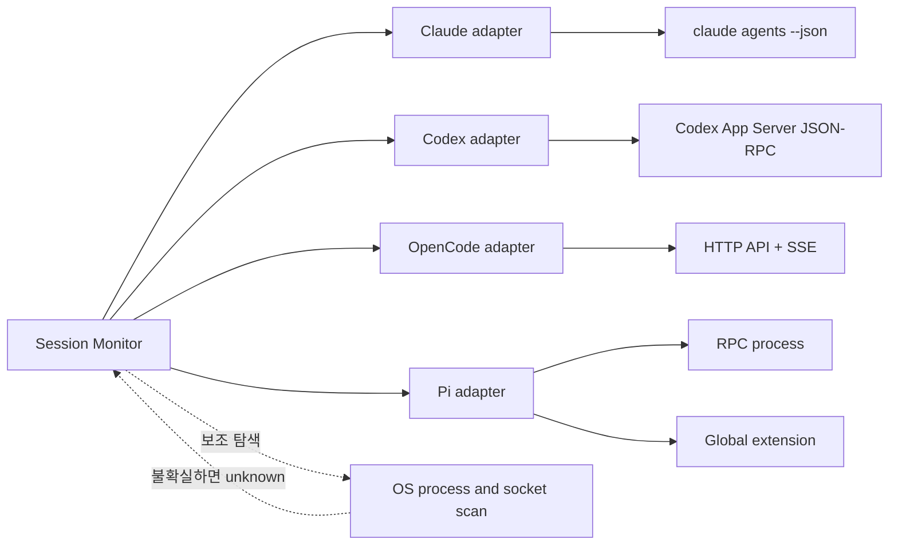

# 활성 코딩 에이전트 세션 조회 조사

- 조사일: 2026-08-28
- 로컬 CLI 검증 버전: Claude Code 2.1.250, Codex CLI 0.150.1, OpenCode 1.18.18, Pi Coding Agent 0.78.1
- Pi 최신 소스·문서 확인 버전: 0.84.3
- 대상: Claude Code, Codex, OpenCode, Pi Coding Agent

## 결론

네 도구를 모두 조회하는 공통 API는 없다. 모니터링 프로그램은 도구별 어댑터를 두고, 가능한 경우 공식 런타임 인터페이스를 사용해야 한다.

| 도구 | 이미 실행 중인 세션을 찾는 우선 수단 | 작업 상태 판별 | 정확도 | 주요 제약 |
| --- | --- | --- | --- | --- |
| Claude Code | `claude agents --json` | `status`, `state`, `waitingFor` | 높음 | 최근 버전의 agent view 기능이 필요함 |
| Codex | 모니터가 관리하는 Codex App Server의 `thread/list`, `thread/loaded/list` | `Thread.status`, `thread/status/changed` | 높음 | 한 App Server는 자신이 로드한 스레드만 정확히 앎 |
| OpenCode | 고정 주소로 실행한 HTTP 서버의 `/api/session/active` 또는 `/session/status` | HTTP 상태 조회와 SSE 이벤트 | 높음 | 임의 TUI는 서버 포트가 무작위일 수 있음 |
| Pi Coding Agent | 모니터가 시작한 `pi --mode rpc` 또는 전역 extension | RPC 이벤트 또는 extension 이벤트 | 높음 | 임의로 실행된 기존 TUI의 전역 active 목록은 없고 버전별 이벤트 차이가 있음 |

따라서 가장 안정적인 설계는 모니터가 Codex, OpenCode, Pi의 실행 진입점이 되어 서버나 RPC 연결을 소유하는 것이다. 이미 임의로 실행된 프로세스는 프로세스 탐색으로 존재 여부를 보완하되, 작업 중인지까지 확정하지 못하면 `unknown`으로 표시해야 한다. Claude Code는 예외적으로 공식 전역 조회 명령이 제공된다.

## 먼저 정의할 것: active의 두 의미

`active`를 하나의 불리언으로 저장하면 실제 상태를 오해하기 쉽다.

1. **런타임 존재 여부**: 프로세스가 살아 있거나 서버 메모리에 세션이 로드되어 있음
2. **활동 상태**: 현재 모델이 작업 중인지, 사용자 입력을 기다리는지, 쉬고 있는지

예를 들어 Codex의 `thread/loaded/list`에는 마지막 구독자가 사라진 뒤에도 최대 30분 동안 유휴 스레드가 남을 수 있다. 반대로 Claude Code의 background session은 연결된 터미널 프로세스가 종료되어도 supervisor 아래에서 계속 작업하거나 입력을 기다릴 수 있다. 프로세스 존재만으로 두 경우를 올바르게 구분할 수 없다.

권장 공통 상태는 다음과 같다.

```ts
type RuntimeState = "alive" | "loaded" | "managed" | "stopped" | "unknown";
type ActivityState =
  | "working"
  | "waiting_user"
  | "idle"
  | "retrying"
  | "error"
  | "unknown";

interface AgentSession {
  tool: "claude" | "codex" | "opencode" | "pi";
  instanceId: string;
  sessionId?: string;
  name?: string;
  cwd?: string;
  runtime: RuntimeState;
  activity: ActivityState;
  pid?: number;
  startedAt?: string;
  lastEventAt?: string;
  source: "official-api" | "process-scan" | "file-heuristic";
  confidence: "authoritative" | "partial" | "heuristic";
}
```

## 권장 수집 구조



수집 우선순위는 `공식 런타임 상태 > 공식 이벤트 > 프로세스·소켓 탐색 > 세션 파일 변경 시각` 순서가 적절하다.

## 1. Claude Code

### 권장 조회법

Claude Code는 네 도구 중 이미 실행 중인 전체 세션을 조회하기 가장 쉽다.

```bash
claude agents --json
```

특정 작업 디렉터리로 제한할 수 있다.

```bash
claude agents --json --cwd /path/to/project
```

완료된 background session까지 포함할 때만 `--all`을 붙인다.

```bash
claude agents --json --all
```

[Claude Code agent view 공식 문서](https://code.claude.com/docs/en/agent-view)에 따르면 기본 JSON 결과에는 살아 있는 모든 세션과, 프로세스가 종료되었더라도 아직 작업 중이거나 막혀 있는 background session이 포함된다. 주요 필드는 다음과 같다.

| 필드 | 의미 |
| --- | --- |
| `cwd`, `kind`, `startedAt` | 공통 메타데이터 |
| `pid`, `status` | 살아 있는 프로세스의 PID와 `busy`, `waiting`, `idle` 상태 |
| `sessionId`, `name` | 설정된 경우의 대화 ID와 표시 이름 |
| `id`, `state` | background session ID와 `working`, `blocked`, `done`, `failed`, `stopped` 상태 |
| `waitingFor` | permission prompt, input needed, sandbox request 등 기다리는 이유 |

상태 정규화 예시는 다음과 같다.

```ts
if (row.status === "waiting" || row.state === "blocked") {
  activity = "waiting_user";
} else if (row.status === "busy" || row.state === "working") {
  activity = "working";
} else if (row.status === "idle") {
  activity = "idle";
}
```

### 구현 메모

- 2~5초 간격으로 명령을 실행하는 polling만으로도 첫 버전을 만들 수 있다.
- `waitingFor`는 알림 제목이나 필터에 그대로 활용할 수 있다.
- background session의 내부 상태는 `~/.claude/jobs/<id>/`에도 저장되지만, 공식 CLI 결과를 우선하는 편이 호환성에 유리하다.
- 세션 transcript 파일만 보고 active를 판정하지 않는다. 저장된 대화와 실행 중인 세션은 다른 개념이다.

## 2. Codex

### 권장 조회법: Codex App Server

Codex의 공식 프로그램 통합 지점은 `codex app-server`다. 기본 transport는 stdio이고 WebSocket 또는 Unix socket으로도 구성할 수 있다. 연결 뒤에는 먼저 `initialize` 요청과 `initialized` 알림을 보내야 한다. 자세한 프로토콜은 [Codex App Server 공식 문서](https://developers.openai.com/codex/app-server)를 따른다.

```bash
codex app-server
```

설치된 Codex 버전에 정확히 맞는 타입과 JSON Schema도 생성할 수 있다.

```bash
codex app-server generate-ts --experimental --out ./generated/codex
codex app-server generate-json-schema --experimental --out ./generated/codex-schema
```

세션 조회에는 다음 요청을 조합한다.

| 요청·알림 | 용도 |
| --- | --- |
| `thread/list` | 저장된 스레드를 페이지 단위로 조회하며 각 `Thread.status`도 받음 |
| `thread/loaded/list` | 현재 이 App Server 메모리에 로드된 thread ID 조회 |
| `thread/status/changed` | 로드된 스레드의 런타임 상태 변경 구독 |
| `turn/*`, `item/*` | 더 상세한 실행 진행 상태 추적 |

현재 생성되는 `Thread.status`의 핵심 형태는 다음과 같다.

```ts
type ThreadStatus =
  | { type: "notLoaded" }
  | { type: "idle" }
  | { type: "systemError" }
  | {
      type: "active";
      activeFlags: ("waitingOnApproval" | "waitingOnUserInput")[];
    };
```

정규화 규칙은 다음이 적절하다.

| Codex 상태 | 공통 상태 |
| --- | --- |
| `active`, 대기 flag 없음 | `working` |
| `active` + `waitingOnApproval` 또는 `waitingOnUserInput` | `waiting_user` |
| `idle` | `idle` |
| `systemError` | `error` |
| `notLoaded` | 런타임 세션 아님 |

### 중요한 조회 범위 제한

App Server는 자신이 관리하거나 로드한 스레드의 상태만 권위 있게 안다. 별도 터미널에서 독립적으로 실행된 여러 `codex` TUI를 나중에 하나의 App Server에 연결해 전역 조회하는 인터페이스는 아니다. 또한 `loaded`는 곧 `working`이라는 뜻이 아니다. 공식 문서상 마지막 subscriber와 활동이 사라져도 30분의 grace period 뒤에야 unload된다.

따라서 모니터 제품의 실행 구조는 다음 중 하나가 좋다.

1. 모니터가 하나의 App Server를 띄우고 모든 Codex 작업을 그 서버를 통해 시작한다.
2. 각 Codex App Server 인스턴스를 모니터에 등록하고 인스턴스별 결과를 합친다.
3. 관리 밖에서 실행된 Codex TUI는 별도의 process fallback 결과로만 표시한다.

`codex agents` 명령도 존재하지만 사람용 TUI이므로 기계 판독용 수집 인터페이스로 삼지 않는 편이 좋다.

### 이미 실행된 독립 TUI의 보조 탐색

Codex 소스에는 `$CODEX_HOME/thread-writer-locks/<thread-id>.lock`에 writer lock을 두는 구현이 있다. 자세한 동작은 [Codex `writer_lock.rs`](https://github.com/openai/codex/blob/main/codex-rs/thread-store/src/local/writer_lock.rs)에서 확인할 수 있다. macOS에서는 열린 lock 파일을 PID에 대응시켜 볼 수 있다.

```bash
lsof "$CODEX_HOME"/thread-writer-locks/*.lock
```

다만 이것은 공개 세션 조회 API가 아닌 구현 세부사항이다. 한 프로세스가 여러 lock을 잡을 수도 있어 `lock 하나 = 화면의 세션 하나`로 간주하면 안 된다. `process-scan`, `partial` 또는 `heuristic` 신뢰도로만 기록한다.

## 3. OpenCode

### 권장 조회법: 고정 주소의 서버와 SSE

OpenCode는 HTTP server API를 제공한다. 모니터가 서버 주소를 알고 있도록 고정된 loopback 주소로 시작하는 구성이 가장 단순하다.

```bash
opencode serve --hostname 127.0.0.1 --port 4096
```

사용자는 필요하면 해당 서버에 TUI를 붙인다.

```bash
opencode attach http://127.0.0.1:4096
```

[OpenCode server 공식 문서](https://opencode.ai/docs/server)에 공개된 주요 endpoint는 다음과 같다.

| endpoint | 용도 |
| --- | --- |
| `GET /global/health` | 해당 포트가 OpenCode server인지 확인 |
| `GET /session` | 저장된 세션 목록 |
| `GET /session/status` | 세션 런타임 상태 맵 |
| `GET /event` | 해당 인스턴스의 SSE 이벤트 스트림 |
| `GET /global/event` | 전역 SSE 이벤트 스트림 |

OpenCode 1.18.18 소스에는 새 protocol endpoint인 `GET /api/session/active`도 있다. 이 endpoint는 현재 실행 중인 session ID를 `{ type: "running" }`으로 반환한다. 아직 공개 문서 경로가 버전마다 다를 수 있으므로, 서버의 `/doc` OpenAPI 문서를 먼저 읽어 endpoint 지원 여부를 capability detection하는 것이 안전하다. 근거 구현은 [`session.ts` protocol 정의](https://github.com/anomalyco/opencode/blob/v1.18.18/packages/protocol/src/groups/session.ts)와 [server handler](https://github.com/anomalyco/opencode/blob/v1.18.18/packages/server/src/handlers/session.ts)에서 확인할 수 있다.

권장 순서는 다음과 같다.

1. `/doc`에 `/api/session/active`가 있으면 사용한다.
2. 없으면 `/session/status`를 사용한다.
3. `/event` 또는 `/global/event`를 계속 구독해 상태를 갱신한다.

기존 `/session/status`의 `SessionStatus`는 `busy`, `retry`, `idle`이다. 단, 1.18.18 구현은 idle이 되면 상태 맵에서 해당 ID를 삭제한다. 즉 응답에 없는 세션은 반드시 종료된 것이 아니라 idle일 수 있다. 이는 [OpenCode session status 구현](https://github.com/anomalyco/opencode/blob/v1.18.18/packages/opencode/src/session/status.ts)에서 확인된다.

```ts
type OpenCodeStatus =
  | { type: "busy" }
  | { type: "retry"; attempt: number; message: string; next: number }
  | { type: "idle" };
```

permission 또는 question을 기다리는 상태는 `busy` 하나만으로는 구분하기 어렵다. SSE에서 현재 서버 버전이 내보내는 `permission.*` 및 `question.*` 요청·응답 이벤트를 추적해 `waiting_user` 상태를 덧씌워야 한다. 이벤트 이름도 `/doc` 스키마를 기준으로 처리한다.

### 임의로 실행된 TUI 탐색

OpenCode TUI는 내부 서버를 띄우지만 별도 설정이 없으면 포트가 무작위일 수 있다. 전역 server registry는 제공되지 않으므로 다음 순서의 fallback이 필요하다.

1. `opencode` 프로세스를 찾는다.
2. 각 PID가 listen 중인 loopback TCP 포트를 OS별로 찾는다.
3. 후보 포트의 `/global/health`를 호출해 OpenCode server인지 검증한다.
4. 검증된 서버별로 status와 SSE를 구독한다.

`opencode session list --format json`은 저장된 session history 조회에는 유용하지만 현재 실행 중이라는 증거는 아니다. CLI 사용법은 [OpenCode CLI 공식 문서](https://opencode.ai/docs/cli)를 참고한다.

## 4. Pi Coding Agent

### 모니터가 프로세스를 시작하는 경우: RPC

Pi는 `--mode rpc`로 시작하면 표준 입력과 출력에서 줄 단위 JSON 프로토콜을 제공한다.

```bash
pi --mode rpc
```

상태 스냅샷 요청은 다음과 같다.

```json
{"type":"get_state"}
```

응답에는 `isStreaming`, `isCompacting`, `sessionFile`, `sessionId`, `sessionName`, `messageCount`, `pendingMessageCount` 등이 포함된다. 최신 0.84.3의 [Pi RPC 공식 문서](https://github.com/earendil-works/pi/blob/main/packages/coding-agent/docs/rpc.md)에 정의된 주요 이벤트는 다음과 같다.

| 이벤트 | 모니터 상태 |
| --- | --- |
| `agent_start` | `working` 시작 |
| `agent_settled` | 모든 continuation과 auto-retry까지 끝난 `idle` 경계 |
| `turn_start`, `turn_end` | 세부 turn 진행 상황 |
| `tool_execution_*` | 도구 실행 세부 상태 |
| `queue_update` | 대기 중인 입력 변화 |
| `compaction_*`, `auto_retry_*` | compact 또는 retry 상태 |

`agent_end` 뒤에도 auto-retry나 continuation이 이어질 수 있으므로 완전한 idle 판정은 `agent_settled`를 기준으로 한다. 다만 로컬에서 확인한 0.78.1에는 `agent_settled`가 없다. 구버전은 `agent_end` 뒤 `get_state`에서 `isStreaming=false`, `isCompacting=false`, `pendingMessageCount=0`을 재확인하고 짧은 debounce를 거친 뒤 `idle`로 추정해야 하며, 이 결과의 신뢰도는 `partial`로 낮춘다.

### 사용자가 직접 실행하는 TUI까지 포함하는 경우: 전역 extension

Pi에는 이미 실행 중인 모든 TUI를 나열하는 전역 명령이 없다. 사용자가 앞으로 시작할 Pi TUI를 모두 추적하려면 global extension을 설치해 monitor daemon으로 상태를 발행하는 방식이 적합하다. 최신 [Pi extension 공식 문서](https://github.com/earendil-works/pi/blob/main/packages/coding-agent/docs/extensions.md)의 다음 이벤트를 이용할 수 있다.

| extension 이벤트 | 발행할 정보 |
| --- | --- |
| `session_start` | PID, cwd, `ctx.sessionManager.getSessionFile()` 등록 |
| `agent_start` | `working` |
| `agent_settled` | `idle` |
| `ui_prompt_start` | `waiting_user` |
| `ui_prompt_end` | 이전 작업 상태로 복귀 |
| `session_shutdown` | registry에서 제거 또는 `stopped` 기록 |

`agent_settled`와 `ui_prompt_start/end`는 0.78.1 문서에는 없고 최신 0.84.3 문서에 존재한다. extension은 설치 버전을 확인해 이벤트를 조건부로 등록해야 한다. 구버전에서 `ui_prompt_start/end`가 없으면 extension UI prompt 대기를 `waiting_user`로 정확히 구분할 수 없다.

extension은 Unix domain socket 또는 loopback HTTP로 heartbeat와 상태를 monitor daemon에 보내면 된다. 세션은 기본적으로 `~/.pi/agent/sessions/`에 JSONL로 저장되지만, [Pi session 문서](https://github.com/earendil-works/pi/blob/main/packages/coding-agent/docs/sessions.md)의 저장 파일은 history이며 현재 active 여부를 보장하지 않는다.

임의로 이미 실행된 Pi TUI에는 process scan을 사용할 수 있으나, 이 경우 확실히 알 수 있는 것은 주로 PID와 cwd다. session file의 최근 수정 시각으로 `working`을 추정하지 말고 활동 상태는 `unknown`으로 두는 것이 안전하다. 참고로 `pi list`는 실행 중 세션이 아니라 설치된 extension·package 목록을 보여준다.

## 공통 process fallback

### macOS

```bash
ps -axo pid=,ppid=,etime=,state=,command=
lsof -a -p "$PID" -d cwd -Fn
```

listen socket이 필요한 OpenCode는 PID별 `lsof -Pan -p "$PID" -iTCP -sTCP:LISTEN` 결과를 추가로 확인한다.

### Linux

- 실행 파일: `/proc/<pid>/exe`
- 작업 디렉터리: `/proc/<pid>/cwd`
- socket: `/proc/<pid>/fd`, `/proc/net/tcp*` 또는 `ss -ltnp`

프로세스 이름의 부분 문자열만 검색하면 Electron helper, crashpad, app-server 같은 보조 프로세스를 실제 TUI로 오인할 수 있다. 가능한 경우 executable의 canonical path와 argv 구조를 확인하고, PID 재사용에 대비해 시작 시각까지 instance key에 포함한다.

```ts
instanceId = `${tool}:${pid}:${processStartTime}`;
```

## 구현 권장안

### 1단계: 빠른 MVP

- Claude: `claude agents --json`을 2~5초 간격으로 polling
- Codex: 모니터가 시작한 App Server 한 개를 연결하고 status 이벤트 구독
- OpenCode: 고정 포트 server 한 개의 HTTP API와 SSE 구독
- Pi: 모니터가 `--mode rpc`로 실행한 프로세스만 지원
- 그 외 프로세스: `runtime=alive`, `activity=unknown`, `confidence=partial`

### 2단계: 임의 실행 세션 지원

- OpenCode 프로세스와 listen socket을 찾아 server endpoint 자동 등록
- Pi global extension을 배포해 TUI 상태를 daemon에 등록
- Codex 여러 App Server 인스턴스 등록 지원
- 이벤트 연결이 끊겼을 때 snapshot 재조회와 heartbeat 만료 처리

### 3단계: 운영 안정성

- adapter별 capability detection과 버전 기록
- 원본 상태와 정규화 상태를 함께 저장해 진단 가능하게 유지
- 이벤트 sequence 또는 `lastEventAt` 기반 stale 판정
- 프로세스 종료와 PID 재사용 처리
- 서버 노출은 기본적으로 `127.0.0.1` 또는 Unix socket으로 제한
- 외부 interface로 열 경우 인증 적용. OpenCode는 `OPENCODE_SERVER_PASSWORD`를 설정하고, Codex도 사용하는 transport의 인증 옵션을 적용

## 최종 판단

“현재 실행 중인 프로세스를 보여주는 프로그램”은 네 도구 모두 process scan으로 만들 수 있다. 그러나 “현재 모델이 일하는 중인지, 사용자를 기다리는지, 쉬고 있는지”까지 정확히 보여주려면 다음 경로가 필요하다.

- Claude Code: `claude agents --json`
- Codex: App Server를 통한 lifecycle 관리 및 `Thread.status`
- OpenCode: server API와 SSE, 버전별 endpoint capability detection
- Pi: RPC lifecycle 또는 global extension instrumentation

기존 임의 세션까지 100% 정확히 복원하는 것은 특히 Codex와 Pi에서 공식 전역 registry가 없기 때문에 불가능하다. 제품 UI에서는 이 차이를 숨기지 말고 `authoritative`, `partial`, `heuristic` 신뢰도와 `unknown` 상태를 함께 표현하는 것이 좋다.
