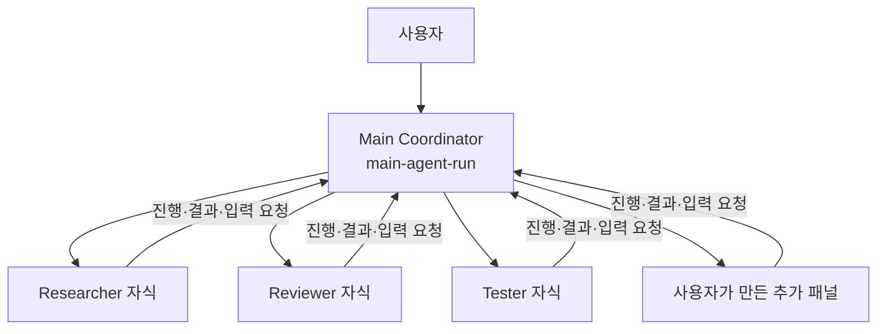
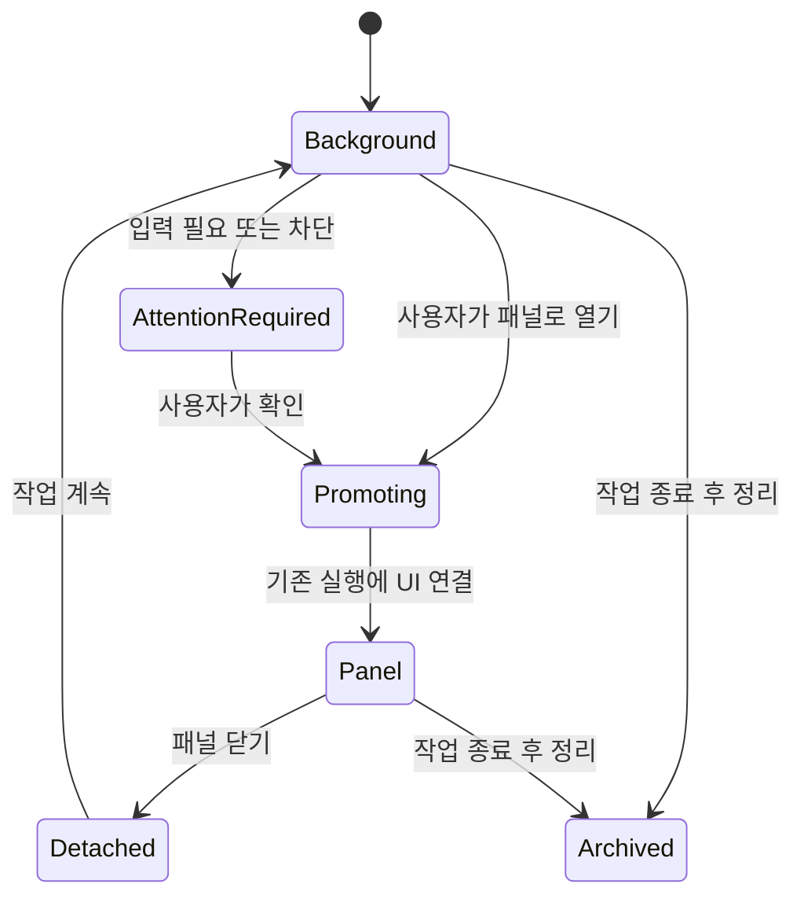
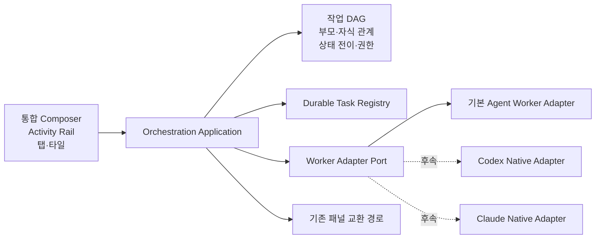
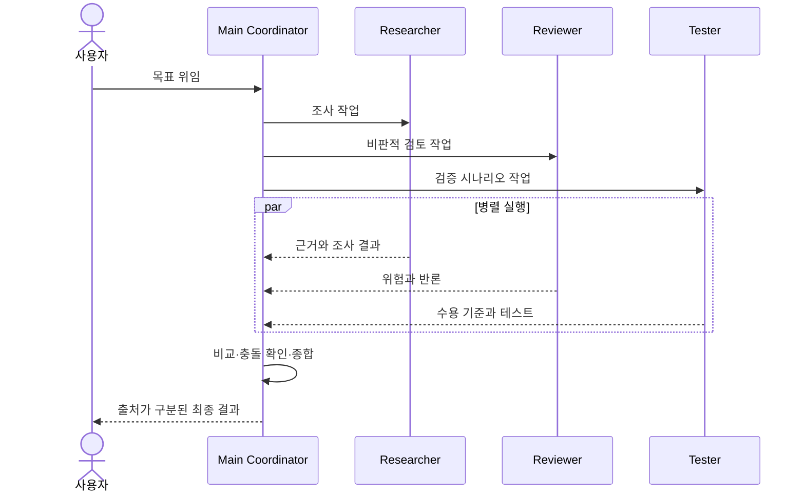
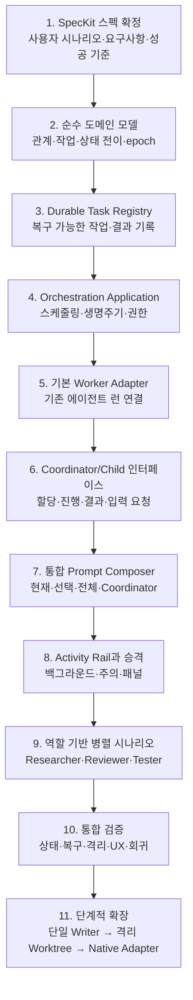
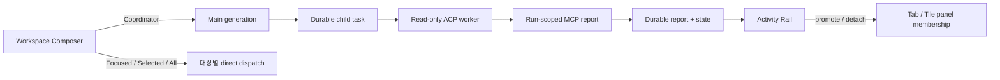
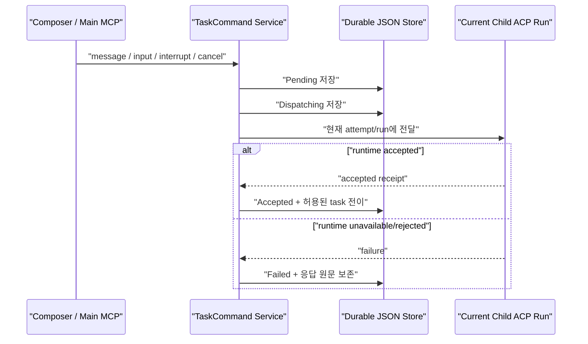
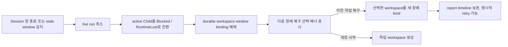

# Main Coordinator 기반 에이전트 오케스트레이션

## 배경

Agentic Workbench는 한 Worktree Session 창에서 여러 에이전트 런 패널을 탭 또는 타일로
표시하고, 패널 사이에 명시적인 메시지를 전달할 수 있다. 다음 단계의 목표는 단순한
패널 간 통신을 넘어, 사용자가 하나의 목표를 주면 주 에이전트가 하위 작업을 나누고
여러 역할의 에이전트에게 맡긴 뒤 결과를 취합하는 협업 워크스페이스를 만드는 것이다.

이 문서는 현재 합의된 제품 모델과 구현 순서를 정리한다. 사용자 관점의 정식 요구사항은
`specs/033-agent-orchestration/spec.md`에서 관리한다.

## 목표

1. 각 Worktree Session 창의 `main-agent-run`을 고정된 부모이자 **Main Coordinator**로
   사용한다.
2. 이후 생성되는 모든 에이전트 패널과 백그라운드 에이전트는 Main Coordinator의
   직접 자식으로 관리한다.
3. Main Coordinator가 목표 분해, 역할 배정, 진행 관찰, 입력 요청 처리, 결과 취합을
   담당하도록 한다.
4. 프롬프트 입력 영역을 워크스페이스 단위 하나로 통합하고, 현재 패널·선택 패널·전체
   패널·Coordinator 중 대상을 선택해 명령을 보낼 수 있게 한다.
5. 작업 실행 상태와 패널 표시 상태를 분리하여, 백그라운드 작업을 필요할 때만 패널로
   승격하고 다시 백그라운드로 내릴 수 있게 한다.
6. 첫 버전은 읽기 전용 병렬 조사와 검토에 집중하여 같은 worktree에 대한 동시 쓰기
   충돌을 방지한다.

## 비목표

- 첫 버전에서는 자식이 다시 손자 에이전트를 생성하지 않는다.
- 다른 Worktree Session 창 또는 다른 worktree의 에이전트와 협업하지 않는다.
- 여러 에이전트의 동시 파일 쓰기, 자동 병합과 충돌 해결을 제공하지 않는다.
- 패널을 닫는 동작을 작업 취소로 해석하지 않는다.
- 특정 공급자의 에이전트 기능을 제품의 유일한 오케스트레이션 모델로 삼지 않는다.

## 핵심 개념

### Main Coordinator

`main-agent-run`은 Main Coordinator 역할이다. 창마다 하나만 존재하며 삭제할 수 없다.
사용자 목표를 받아 작업을 나누고, 직접 자식에게 할당하고, 진행 상태와 결과를 모아
최종 응답을 만든다.

Main 패널과 Main의 현재 실행은 구분한다. 패널은 안정적인 부모 신원이고 실행은 교체될
수 있다. Main 실행이 재시작되면 새 Coordinator epoch를 만들며, 진행 중 작업을 새 실행에
인계할지는 요약과 함께 명시적으로 결정한다.

### 부모·자식 관계

첫 버전은 별 모양 토폴로지를 사용한다. 수동으로 추가한 패널과 Coordinator가 생성한
백그라운드 에이전트 모두 Main의 직접 자식이다. 형제 간 요청은 기본적으로 Main을
경유한다.

관계는 다음 세 축을 독립적으로 관리한다.

| 구분 | 부모 | 자식 | 수명 |
| --- | --- | --- | --- |
| 패널 관계 | Main 패널 | 자식 패널 또는 백그라운드 슬롯 | Worktree Session 창 |
| 실행 관계 | 현재 Main 실행 | 현재 자식 실행 | 각 실행 |
| 작업 관계 | Coordinator 작업 | Worker 작업 | 작업 완료·취소까지 |

### 작업과 표시 상태

에이전트 작업의 실제 상태, 실행 프로세스의 상태, UI 표시 상태는 서로 다르다.

| 상태 축 | 값 |
| --- | --- |
| 작업 | `pending`, `ready`, `running`, `input_required`, `blocked`, `completed`, `failed`, `cancelled` |
| 실행 | `unassigned`, `starting`, `active`, `idle`, `stopped` |
| 표시 | `background`, `attention_required`, `promoting`, `panel`, `detached`, `archived` |

예를 들어 작업이 `running`인 동안 패널은 `background`일 수 있다. 패널을 닫으면 표시만
`detached`로 바뀌며 작업은 계속된다. 작업 취소는 별도의 명시적 명령이다.

## 사용자 인터페이스

### 통합 프롬프트 작성 영역

각 패널의 프롬프트 작성 영역을 워크스페이스 하단의 하나의 작성 영역으로 통합한다.
사용자는 다음 대상 중 하나를 선택한다.

- **현재 패널**: 현재 초점 패널 하나에 일반 명령을 전송한다.
- **선택 패널**: 사용자가 선택한 여러 패널에 같은 명령을 각각 전송한다.
- **전체 패널**: Main과 열린 모든 자식 패널에 브로드캐스트한다.
- **Coordinator**: Main에게 목표를 위임하고 필요한 하위 작업 생성과 결과 취합을 맡긴다.

브로드캐스트와 Coordinator 위임은 의미가 다르므로 별도 동작으로 표시한다. 다중 전송은
하나의 전송 묶음 아래 대상별 상태를 보여 주며, 일부 대상 실패가 성공한 대상의 전송을
되돌리지 않는다.

### Task Activity Rail

패널로 표시되지 않는 작업도 항상 찾을 수 있도록 Task Activity Rail을 제공한다.

- 작업명, 역할과 부모
- 작업·실행·표시 상태
- 경과 시간과 마지막 활동
- 실행 프로필
- 입력 요청, 오류와 재시도 가능 여부
- 결과 요약과 생성 산출물
- 패널로 열기, 다시 시도, 취소

### 패널 승격

기본 정책은 `onAttention`이다. 입력 요청, 차단 또는 사용자가 직접 관찰해야 하는 사건이
발생하면 Activity Rail에 주의를 표시하되 자동으로 초점을 빼앗지 않는다. 사용자가 열기를
선택하면 기존 탭·타일 레이아웃에 패널로 승격한다.

후속 정책은 `manual`, `always`, `onFailure`, `onCompletion`을 지원할 수 있다. 승격과
분리는 실행을 재시작하거나 중단하지 않아야 한다.

## 오케스트레이션 책임

### Main Coordinator

- 사용자 목표를 독립적으로 검증 가능한 하위 작업으로 분해한다.
- 각 작업에 역할, 목표, 제약, 예상 결과 형식을 지정한다.
- 자식의 시작, 대기, 중단, 취소와 재배정을 관리한다.
- 진행 보고와 입력 요청을 사용자에게 연결한다.
- 중복되거나 충돌하는 결과를 비교하고 출처를 유지한 채 종합한다.
- 창 범위, 동시 실행 한도와 쓰기 권한 정책을 적용한다.

### Child Worker

- 자신에게 할당된 작업과 제약만 수행한다.
- 진행, 결과, 차단 사유와 사용자 입력 요청을 부모에게 보고한다.
- 첫 버전에서는 다른 자식을 생성하지 않고 형제에게 직접 명령하지 않는다.
- 읽기 전용 작업을 기본으로 하며 쓰기가 필요한 경우 Coordinator의 별도 결정을 요구한다.

## 권장 구조

제품의 지속 가능한 작업·관계·상태 모델은 AW가 소유한다. 실행 공급자의 고유한 하위
에이전트 기능은 추후 어댑터로 연결한다. 이를 통해 Codex 계열의 병렬 생성·대기·결과
수집 패턴과 Claude Code 계열의 foreground/background, 역할·권한·도구 범위 패턴을
활용하면서도 UI와 저장 모델이 특정 공급자에 종속되지 않게 한다.

완료 판정은 자식의 구조화된 결과 보고를 우선한다. 일반 실행 완료 이벤트는 보조
신호이며, 프로세스 종료나 파일 생성 감시는 결과 보고가 불가능한 외부 작업의 최후
fallback으로만 사용한다. 파일 존재만으로 작업 성공을 판정하지 않는다.

## 대표 협업 시나리오

사용자가 “현재 구조에서 가장 안전한 오케스트레이션 전략을 조사해 줘”라고 Coordinator에
위임한다.

1. Main은 `Researcher`, `Reviewer`, `Tester` 세 작업을 만든다.
2. Researcher는 현재 구조와 대안을 조사한다.
3. Reviewer는 권한, 장애 복구와 상태 일관성 관점에서 비판한다.
4. Tester는 독립적으로 검증 가능한 수용 시나리오를 작성한다.
5. 세 작업은 백그라운드에서 병렬 실행되고 Activity Rail에 표시된다.
6. 입력이 필요한 작업만 주의 상태가 되며 사용자가 패널로 승격할 수 있다.
7. Main은 각 결과의 출처와 불일치를 보존한 채 최종 권고안을 합성한다.

## 작업 순서

### 단계별 산출물

| 단계 | 주요 산출물 | 통과 조건 |
| --- | --- | --- |
| 1. 스펙 | `spec.md`, 요구사항 체크리스트 | 모호한 요구사항 없이 독립 테스트 가능 |
| 2. 도메인 | 관계·작업·상태 모델과 불변식 | UI/실행 공급자 없이 상태 전이 테스트 통과 |
| 3. Registry | 작업, 이벤트, 결과, epoch 저장 경계 | 재시작·중복 요청·부분 실패 복구 가능 |
| 4. Application | 생성, 할당, 대기, 중단, 취소, 수집 | 권한과 동시 실행 제한을 일관되게 적용 |
| 5~6. 실행 연결 | 기본 Worker와 양방향 보고 | 명시적 결과가 정확히 한 번 귀속 |
| 7~8. UX | 통합 Composer, Activity Rail, 승격 | 백그라운드 작업을 잃지 않고 제어 가능 |
| 9. 시나리오 | 세 역할 병렬 협업 | Main이 결과를 비교·종합해 사용자에게 반환 |
| 10. 검증 | 단위·통합·UI·backend 검증 | 기존 탭·타일·메시지 기능 회귀 없음 |

## 안전과 복구 원칙

- 자식 생성, 취소와 재배정 권한은 Main에만 둔다.
- 자식은 자기 작업과 부모에게 필요한 최소 범위만 접근한다.
- 모든 관계와 메시지는 동일한 Worktree Session 창 범위를 검증한다.
- 재시도 요청은 중복 실행되지 않아야 하며 대상별 결과를 유지한다.
- Main 실행이 바뀌면 진행 중 작업을 자동으로 숨겨서 인계하지 않는다.
- 한 작업의 실패가 다른 성공 결과를 폐기하지 않는다.
- 첫 버전은 읽기 전용 Worker를 기본으로 한다.
- 쓰기 지원은 단일 Writer부터 시작하고, 병렬 쓰기는 격리된 worktree와 명시적 병합
  정책이 마련된 뒤 확장한다.

## 완료 기준

- 창마다 Main이 하나뿐이며 모든 추가 에이전트가 Main의 직접 자식으로 표시된다.
- Main이 하나의 목표를 세 역할에 병렬 배정하고 구조화된 결과를 취합할 수 있다.
- 백그라운드 작업의 상태, 마지막 활동, 입력 요청과 결과를 항상 확인할 수 있다.
- 승격과 분리가 실행을 중단하거나 새로 시작하지 않는다.
- 통합 Composer의 대상별 전송 결과와 부분 실패가 명확히 표시된다.
- Main 재시작, 자식 실패, 사용자 입력 대기와 취소가 유실 없이 처리된다.
- 다른 창, 오래된 실행과 권한 없는 자식 요청이 거부된다.
- 기존 탭·타일 전환, `1:1:1` 초기 비율과 패널 메시지 교환이 회귀하지 않는다.

## 구현 현황

2026-07-27 기준으로 첫 버전의 vertical slice가 AW에 연결되었다.

| 계층 | 구현 |
| --- | --- |
| Domain | Main 1개와 direct Child만 허용하는 star topology, task/execution/presentation 분리, generation과 explicit result 규칙 |
| Persistence | app-local `orchestration-sessions.json` 원자 저장, revision/idempotency, 손상 시 backup 복구 |
| Runtime | 기존 ACP runner를 감싼 read-only Worker adapter, FIFO scheduler, run별 bounded event journal |
| MCP | run capability에서 caller를 파생하는 Coordinator/Child 전용 `aw_*` tool과 stale generation 폐기 |
| UI | 단일 Composer, 대상별 dispatch 상태, Activity Rail, 동일 run의 promote/detach, explicit Main handoff |
| Recovery | durable snapshot과 live ACP run 대조, runtime 유실을 retry 가능한 `blocked` 상태로 복구 |

패널을 닫는 동작은 이제 orchestration Child에 대해 `detach`로 처리한다. 실제 취소는
Activity Rail의 별도 action이다. Worktree Session이 다시 열리면 durable node/task/report를
먼저 복원하고, backend registry에 없는 active run만 `runtimeLost`로 표시한다.

### 보안 경계

- Main과 Child는 app-global secret이 아니라 각 run에 발급된 opaque capability를 쓴다.
- tool caller는 payload의 run ID가 아니라 capability principal에서 결정한다.
- Main generation을 인계하면 이전 generation capability를 폐기한다.
- 자동 Child는 `readOnly`, `autoAllow=true`로 실행한다. read-only를 보장하지 못하는
  profile은 시작 전에 거부하며, 이 범위 안에서 발생하는 tool permission은 background
  실행이 멈추지 않도록 `allow_once`를 우선 자동 선택한다.
- file artifact는 workspace 상대 경로만 허용하고 `..`, 절대 경로와 symlink escape를
  거부한다.
- Child 실행 전 Git fingerprint를 기록하며 위반을 발견하면 변경을 되돌리지 않고
  검토 가능한 실패로 남긴다.

## 양방향 runtime 통신과 복구

UI와 Main MCP는 Child panel의 React 상태를 직접 성공 기준으로 사용하지 않는다.
모든 명령은 동일한 durable `TaskCommand` outbox에 먼저 기록된 뒤 현재
`taskId + attempt + nodeId + runId` binding의 ACP worker로 전달된다. 따라서 panel이
background, visible, detached 중 어느 상태여도 전달 의미가 같다.

Child의 progress/result/input/blocked/message report는 report와
`CoordinatorNotification`을 한 번의 저장으로 만든다. notification은 active
Coordinator generation의 Main run에 짧은 report ID와
`aw_collect_child_results` 호출 지시를 전달하며, Main은 해당 도구로 원문을 조회한다.
Main이 이전 turn을 처리 중이면 notification prompt를 ACP session의 FIFO queue에
등록하고 child report 요청은 즉시 반환한다. Main이 없으면 `Pending`, queue 등록 전
일시 실패하면 retryable `Failed`로 남고 다음 dispatch/recovery pass에서 재시도한다.
handoff 뒤 이전 generation notification은 `Superseded`가 되어 새 Main과 이전 Main에
중복 전달되지 않는다.

### Runtime 재수화

- Workspace가 소유하는 `AgentRunControllerRegistry`가 run별 controller를 하나만 유지한다.
- background observer와 visible panel은 같은 controller를 사용한다.
- journal replay payload와 live event는 sequence로 중복 제거한다.
- `idle/loading`, `ready`, `gap`, `runtimeLost`를 서로 다른 상태로 표시한다.
- panel 승격 시 durable `currentRunId`를 authoritative binding으로 사용하고 hydration 전
  빈 mount callback이 이를 덮어쓰지 못하게 한다.

### Crash 및 lifecycle 복구 규칙

- Worktree Session 창이 닫히면 해당 창의 live run을 먼저 취소하고 durable workspace의
  창 binding을 해제한다. 프로세스 비정상 종료로 destroy event를 받지 못한 경우에는
  다음 session 창이 실제 Tauri window 목록과 저장된 binding을 대조해 stale binding을
  같은 방식으로 해제한다.
- 창을 잃은 active Child는 완료 처리하지 않는다. Node는 `Stopped`와
  `AttentionRequired`, task는 retry 가능한 `Blocked/RuntimeLost`로 전환하고 report,
  command, generation과 이전 run ID는 감사·재수화 이력으로 보존한다.
- recoverable workspace는 새 창에 자동 연결하지 않는다. 사용자가 상단 배너의
  `이전 작업 복구` 또는 `새로 시작`을 선택한 뒤에만 workspace를 bind한다.
- `Dispatching`에서 중단된 command는 자동 중복 전송하지 않고 `Pending`과 명시적 재시도
  사유로 복구한다. 이미 `Accepted`인 command는 다시 보내지 않는다.
- input response는 최신 `inputReportId`와 current attempt/run을 확인하며 실제 worker가
  수락한 뒤에만 task를 `Running`으로 되돌린다. 실패하면 입력 text와
  `InputRequired` 상태를 보존한다.
- cancel은 runtime receipt 뒤 상태를 확정한다. result가 먼저 terminal이 되었다면
  terminal result를 되돌리지 않는다.
- retry/reassign은 이전 worker를 중단하고 run capability를 폐기한 뒤 attempt를 올려
  scheduler를 거쳐 새 worker를 시작한다.
- 이전 run의 늦은 report는 감사 이력으로 저장하지만 현재 task 상태와 Main
  notification을 변경하지 않는다.

