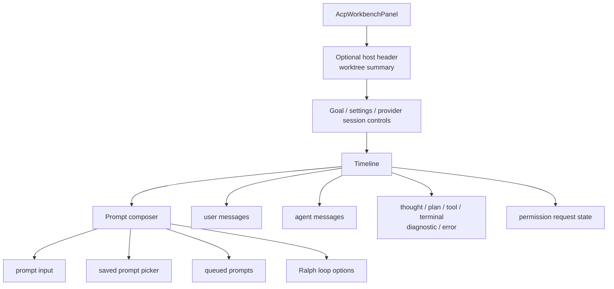
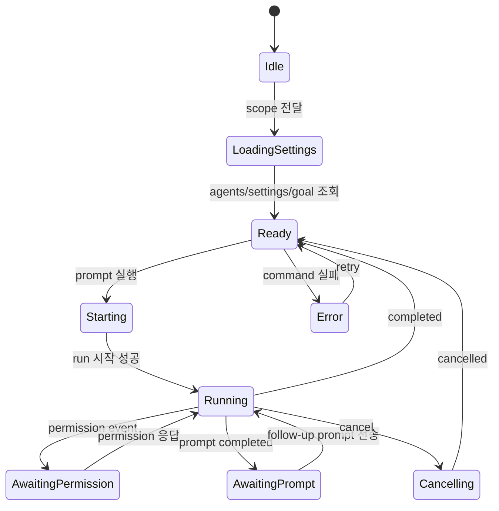
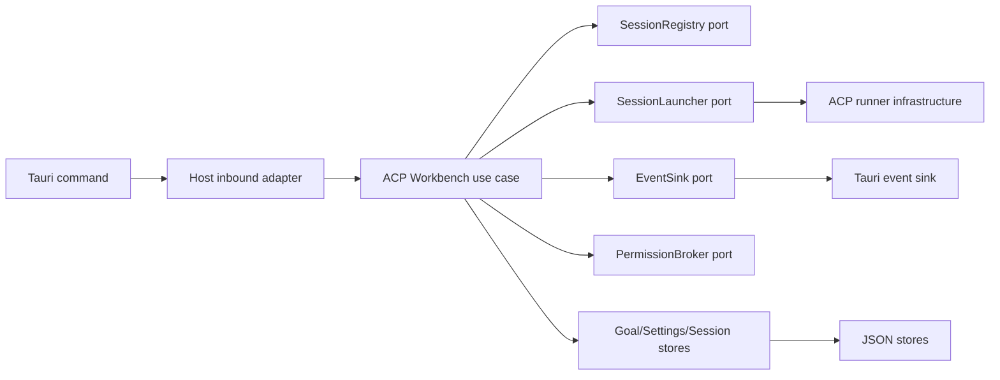
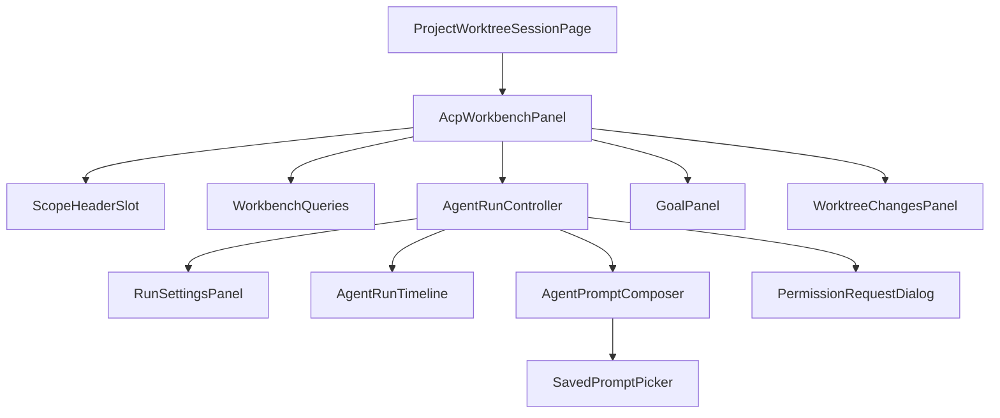

# ACP Agent Run / Worktree Session 모듈 설계

## 배경

현재 worktree session 화면은 선택한 Git worktree에서 ACP agent를 실행하는 앱의 중심 기능이다. 사용자는 worktree 상태를 확인하고, agent/provider/model/context size/permission mode를 선택하며, prompt를 보내고, permission request에 응답하고, run event timeline을 확인한다. 또한 worktree별 goal, saved prompt, Ralph loop, 변경 파일 검토가 같은 화면에 결합되어 있다.

이 기능을 다른 앱으로 이식하려면 단일 `AgentRunPanel`을 그대로 복사하는 방식보다, 실행 core와 UI 조립 단위를 나눠야 한다. 이 문서는 ACP agent run/worktree session 기능을 portable module로 만들기 위한 화면 동작, 데이터 모델, Rust/React 책임 경계, 후속 구현 단위를 정의한다.

## 현재 코드 기준 출발점

- 화면 진입점: `pages/project-worktree-session/ui/project-worktree-session-page.tsx`
- 주 실행 UI: `features/agent-run/ui/agent-run-panel.tsx`
- run 상태 helper: `features/agent-run/model/*`
- 프론트 API: `entities/agent-run/api/*`, `entities/worktree-change/api/*`, `entities/saved-prompt/api/*`
- Rust inbound: `src-tauri/src/inbound/tauri_commands.rs`
- Rust use cases: `application/start_agent_run.rs`, `send_prompt.rs`, `cancel_agent_run.rs`, `set_permission_mode.rs`, `goal_service.rs`
- ACP infrastructure: `infrastructure/acp/*`, `agent_session_registry.rs`, `tauri_run_event_sink.rs`, `permission_broker.rs`
- persistence: JSON repositories for goal, saved prompt, agent run settings, ACP session store

## 목표

- worktree session 화면을 host route와 분리된 `AcpWorkbenchPanel`로 사용할 수 있게 한다.
- agent run 실행 흐름을 provider, permission, event sink, persistence adapter 뒤에 둔다.
- timeline, prompt composer, run settings, goal, saved prompt, worktree changes를 조립 가능한 컴포넌트로 나눈다.
- current app에서는 기존 UX를 유지한다.
- target 앱에서는 `scope`, `client`, optional slot만 제공해 같은 agent run 기능을 붙일 수 있게 한다.

## 비목표

- ACP protocol adapter를 모든 provider의 완전한 abstraction으로 일반화하지 않는다.
- target 앱의 project/workspace CRUD를 이 module이 소유하지 않는다.
- 이 문서에서 dual pane, app-wide context summary, MCP server 주입을 구현하지 않는다.
- agent response의 임의 HTML 렌더링을 허용하지 않는다.
- provider별 model catalog를 UI에 하드코딩하지 않는다.

## 사용자 화면 설계

portable workbench panel은 다음 영역으로 구성한다.



host app이 제공할 수 있는 slot:

- `headerSlot`: project/worktree title, branch badge, back button
- `contextSlot`: worktree changes, custom task status, external dashboard
- `toolbarSlot`: host-specific actions
- `emptyStateSlot`: agent catalog가 비어 있을 때 안내

초기 이식 단위에서는 worktree changes를 panel 안에 포함할 수 있지만, target 앱에서 별도 diff UI가 있으면 `contextSlot`으로 대체할 수 있게 한다.

## 화면 흐름



## 데이터 모델

### Workbench Scope

React public API는 host 앱의 project 모델을 직접 받지 않고 workbench scope를 받는다.

```ts
export type WorkbenchScope = {
  kind: "localWorktree";
  workingDirectory: string;
  projectId?: string;
  projectName?: string;
  worktreeLabel?: string;
};
```

query key는 scope helper에서 만든다.

```ts
export function workbenchScopeKey(scope: WorkbenchScope) {
  return [
    "acp-workbench",
    scope.kind,
    scope.projectId ?? null,
    normalizePathForKey(scope.workingDirectory),
  ] as const;
}
```

path normalization은 display path가 아니라 cache identity를 만들기 위한 helper다. symlink canonicalization이 필요한 경우 host client가 resolver 결과를 scope에 넣거나 별도 `scopeId`를 제공한다.

### Run Controller State

UI 내부 state는 run lifecycle과 prompt draft를 분리한다.

```ts
export type RunControllerState = {
  activeRunId: string | null;
  lifecycle: "idle" | "starting" | "running" | "awaitingPermission" | "awaitingPrompt" | "cancelling";
  selectedAgentId: string;
  selectedSessionId: string;
  permissionMode: PermissionMode;
  modelId: string;
  contextSize: ContextSizePreset;
  timelineItems: TimelineItem[];
  error: string | null;
};
```

prompt composer state는 별도 helper에 둔다.

```ts
export type PromptComposerState = {
  prompt: string;
  queuedPrompts: QueuedPrompt[];
  ralphLoop: RalphLoopDraft;
  inputMode: "prompt" | "ralphLoop";
};
```

### Event Contract

run event는 backend event를 그대로 화면에 흘리지 않고 timeline item으로 변환한다.

```ts
export type RunEventEnvelope = {
  runId: string;
  event: RunEvent;
};

export type TimelineItem = {
  id: string;
  runId: string;
  group: EventGroup;
  title: string;
  body: string;
  tone?: "info" | "success" | "warning" | "danger";
  createdAt: number;
  event: RunEvent;
};
```

portable feature의 event listener는 `AcpWorkbenchClient.listenRunEvents` 하나만 사용한다. Tauri event, DOM fallback event, WebSocket event 같은 transport 차이는 client adapter가 숨긴다.

## API 설계

portable client는 command 이름 대신 use case 이름을 드러낸다.

```ts
export type StartWorkbenchRunInput = {
  scope: WorkbenchScope;
  goal: string;
  agentId: string;
  agentCommand?: string;
  resumeSessionId?: string;
  resumePolicy?: ResumePolicy;
  permissionMode?: PermissionMode;
  modelId?: string;
  contextSize?: ContextSizePreset;
  ralphLoop?: RalphLoopRequest;
};

export type AcpWorkbenchClient = {
  listAgents(): Promise<AgentDescriptor[]>;
  listProviderSessions(input: {
    agentId: string;
    scope?: WorkbenchScope;
  }): Promise<ProviderSession[]>;
  startRun(input: StartWorkbenchRunInput): Promise<AgentRun>;
  sendPrompt(input: { runId: string; prompt: string }): Promise<void>;
  cancelRun(runId: string): Promise<void>;
  setPermissionMode(input: {
    runId: string;
    permissionMode: PermissionMode;
  }): Promise<void>;
  respondPermission(input: {
    runId: string;
    permissionId: string;
    optionId: string;
  }): Promise<void>;
  listenRunEvents(callback: (event: RunEventEnvelope) => void): () => void;
};
```

현재 Tauri adapter는 다음처럼 mapping한다.

```ts
export const tauriAcpWorkbenchClient: AcpWorkbenchClient = {
  listAgents,
  listProviderSessions: ({ agentId, scope }) =>
    listProviderSessions(agentId, scope?.workingDirectory),
  startRun: (input) =>
    startAgentRun({
      goal: input.goal,
      agentId: input.agentId,
      cwd: input.scope.workingDirectory,
      agentCommand: input.agentCommand,
      resumeSessionId: input.resumeSessionId,
      resumePolicy: input.resumePolicy,
      permissionMode: input.permissionMode,
      modelId: input.modelId,
      contextSize: input.contextSize,
      ralphLoop: input.ralphLoop,
    }),
  sendPrompt: ({ runId, prompt }) => sendPromptToRun(runId, prompt),
  cancelRun: cancelAgentRun,
  setPermissionMode: ({ runId, permissionMode }) =>
    setRunPermissionMode(runId, permissionMode),
  respondPermission: respondAgentPermission,
  listenRunEvents,
};
```

## Rust 책임 범위



### inbound adapter

- Tauri request/response 직렬화를 담당한다.
- window label, app handle, state를 host context로 변환한다.
- use case를 호출하고 오류를 문자열 또는 typed error DTO로 변환한다.
- capability와 permission 설정은 host 앱의 Tauri config와 함께 관리한다.

### application service

- run id 보장, unsupported field 제거, Ralph loop sanitize 같은 request normalization을 수행한다.
- registry에 active run을 등록하고 lifecycle을 관리한다.
- session launcher, event sink, permission broker를 port로 호출한다.
- owner 검증은 port 또는 policy object로 분리한다.

### infrastructure

- ACP JSON-RPC transport, process spawn, session new/load/resume, prompt dispatch를 담당한다.
- provider session file discovery를 담당한다.
- Git CLI 기반 worktree changes 조회를 담당한다.
- Tauri event emit과 DOM fallback event 세부사항을 담당한다.

### domain

- run, event, permission, goal, saved prompt, settings 타입만 가진다.
- Tauri, filesystem, JSON, ACP process spawn에 직접 의존하지 않는다.

## React 배치

Feature-Sliced Design 기준 배치는 다음과 같다.

- `entities/agent-run`
  - public type과 event model
  - host-independent timeline formatter
- `entities/saved-prompt`
  - saved prompt type과 repository contract
- `entities/worktree-change`
  - worktree change type
- `features/acp-workbench`
  - workbench client interface
  - run controller hooks
  - timeline/composer/settings/goal UI
  - fake client fixture
- `pages/project-worktree-session`
  - route param 해석
  - project/worktree lookup
  - host header와 navigation
- `components/ui`
  - shadcn/ui generated primitives
- `shared`
  - cross-domain helpers, Storybook providers

권장 컴포넌트 구조:



## 상태 관리

서버 상태는 React Query를 사용한다.

- agent 목록
- provider session 목록
- agent run settings
- goal
- saved prompt
- worktree changes

run 중 streaming event state는 React local state 또는 reducer를 우선 사용한다. event가 매우 많아지면 windowing과 reducer snapshot을 추가한다.

Zustand가 필요한 상태:

- workbench layout preference
- selected pane 또는 dual pane 상태
- app-level project modal state

```mermaid
flowchart TD
  Scope[WorkbenchScope] --> Queries[React Query]
  Queries --> Ready[Workbench ready]
  Ready --> Start[startRun mutation]
  Start --> Active[active run id]
  Active --> Events[listenRunEvents]
  Events --> Reducer[timeline reducer]
  Reducer --> Timeline[render timeline]
  Active --> Prompt[sendPrompt mutation]
  Active --> Permission[respondPermission mutation]
  Active --> Cancel[cancelRun mutation]
```



## 성능과 UX 기준

- timeline item은 일정 수 이상에서 virtual list 또는 windowing을 적용한다.
- long markdown response는 접기/펼치기 또는 streaming-friendly rendering을 지원한다.
- prompt composer height는 stable min/max를 둬 timeline layout shift를 줄인다.
- run event listener는 panel unmount 시 반드시 dispose한다.
- permission dialog는 owner run id를 명확히 표시하고 stale permission 응답을 막는다.
- saved prompt 삽입은 즉시 실행하지 않고 draft에 넣는다.
- Ralph loop는 run 시작 시점에만 설정을 고정하고, 실행 중 변경은 후속 기능으로 둔다.

## 후속 구현 이슈

1. `AcpWorkbenchClient`와 `WorkbenchScope` 도입
   - Tauri adapter 작성
   - fake client fixture 작성
   - query key helper 작성

2. `AcpWorkbenchPanel` 추출
   - 기존 `AgentRunPanel` props를 client/scope 기반으로 변경
   - host header slot 도입
   - Storybook organism/page story 추가

3. Agent run controller 분리
   - timeline reducer 분리
   - prompt composer state helper 분리
   - permission dialog 분리
   - run settings panel 분리

4. Rust core boundary 정리
   - `AcpWorkbenchServices` factory 추가
   - inbound command 조립 축소
   - request normalization test 이동

5. Event contract 고정
   - event envelope schema 문서화
   - owner policy adapter화
   - listener cleanup 테스트

6. Target app dry-run
   - host project/workspace scope mapping
   - command/capability mapping
   - persistence adapter 목록 작성

## 검증 관점

- agent catalog가 비어 있으면 실행 UI가 명확한 empty state를 보여야 한다.
- run 시작 request는 항상 working directory와 run id를 포함해야 한다.
- resume session id와 resume policy는 request normalization에서 보존되어야 한다.
- permission response는 owner가 다른 run/window에서 거부되어야 한다.
- event listener는 unmount 후 timeline을 갱신하지 않아야 한다.
- goal 진행 기록은 run usage event와 충돌하지 않아야 한다.
- saved prompt 삽입은 prompt draft만 바꾸고 자동 실행하지 않아야 한다.
- Ralph loop 설정은 backend safety limit 안으로 sanitize되어야 한다.
- worktree changes refresh는 run settled 후 다시 조회되어야 한다.
- fake client만으로 panel story와 rendering test를 실행할 수 있어야 한다.
