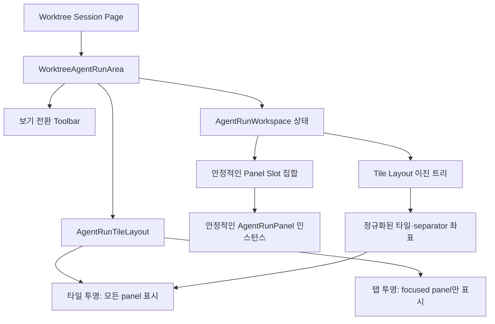
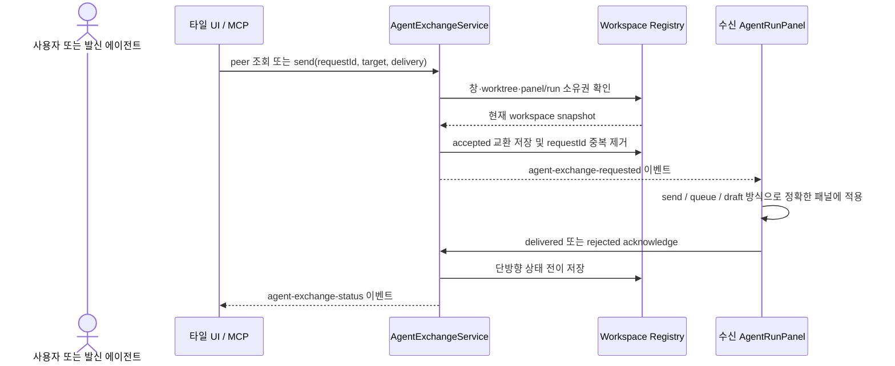
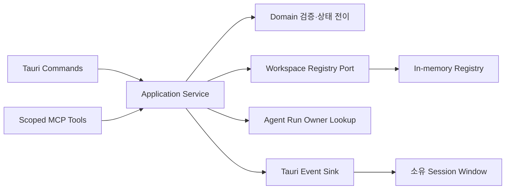

# 에이전트 런 탭·타일 워크스페이스

## 개요

Agentic Workbench의 에이전트 런 영역은 기존 탭 보기를 유지하면서 동일한 패널 집합을 타일 보기로 투영한다. 보기 전환은 패널을 다시 만들지 않으므로 실행 중인 세션, 출력 스트림, 입력 상태와 스크롤 위치가 유지된다.

타일 배치는 자유 좌표가 아니라 가로·세로 이진 분할 트리로 표현한다. 탭 보기에서 타일 보기로 진입할 때 열린 패널을 탭 순서대로 동일한 가로 비율로 정규화하므로 세 패널은 `1:1:1`로 표시된다. 타일 보기 상단의 `새 에이전트 패널`은 현재 초점 타일 오른쪽에 패널을 열며, 각 타일 헤더에서는 오른쪽 또는 아래 방향을 직접 선택할 수 있다. 사용자는 이후 분할 경계를 조절하거나 추가 타일을 닫을 수 있다. 한 세션 창에서 최대 8개 패널과 4단계 분할을 허용한다.

## 범위

현재 범위는 한 Worktree Session 창 안의 탭·타일 보기, 오른쪽·아래 분할, 크기 조절, 초점·닫기와 명시적인 텍스트 메시지 교환이다. 창 간 또는 worktree 간 통신, 자유형 캔버스, 파일 전달, 공유 메모리, 자동 무제한 에이전트 대화와 앱 재시작 후 복원은 포함하지 않는다.

## 프론트엔드 구조

`entities/agent-run`은 레이아웃 트리, 패널 슬롯, 초점, 교환 DTO와 Tauri API 어댑터를 가진다. `features/agent-run`은 보기 전환, 인접 타일 생성, 크기 조절, 닫기와 피어 메시지 같은 사용자 상호작용을 제공한다. 패널은 보기 모드와 무관하게 안정적인 패널 ID를 React key로 사용하며, 표시 방식만 변경한다.

분할 노드는 방향, 비율과 두 자식을 가진다. 오른쪽 열기는 가로 분할, 아래 열기는 세로 분할을 생성한다. 타일을 닫으면 부모 분할을 제거하고 형제 노드를 승격하여 빈 공간을 남기지 않는다. 분할 비율은 15%에서 85% 사이로 제한하며 pointer와 키보드 방향키를 모두 지원한다.

## 런 간 메시지 교환

메시지 교환 범위는 동일한 Worktree Session 창으로 제한한다. 안정적인 패널 ID와 현재 런 ID를 함께 검증하고, 닫히는 패널이나 오래된 런에는 전달하지 않는다. 사용자 UI와 실행 중인 에이전트의 MCP 도구가 같은 application service를 사용한다.

지원 전달 방식은 다음과 같다.

- `send`: 수신 패널에 즉시 프롬프트로 전달한다.
- `queue`: 현재 작업을 취소하지 않고 다음 요청으로 대기시킨다.
- `draft`: 수신 패널 입력 초안으로 준비한다.

메시지는 UTF-8 기준 16,384 bytes 이하의 비어 있지 않은 문자열이어야 한다. 요청 ID가 같은 재시도는 동일 payload일 때 기존 결과를 반환하고, 다른 payload라면 충돌로 거부한다. 상태는 `accepted`에서 `delivered`, `rejected`, `failed`, `cancelled` 중 하나로만 전이하며 종료 상태에서 역행하지 않는다. 교환 기록은 창 수명 동안 최대 500개를 메모리에 유지한다.

## 백엔드 경계

- `domain`: workspace endpoint, exchange, 전달 방식과 상태 전이 규칙
- `application`: sync, peer 조회, send, acknowledge와 소유권 검증
- `ports`: workspace registry, run owner 조회, event sink 계약
- `infrastructure`: 메모리 snapshot/교환 저장소, Tauri event와 MCP adapter
- `inbound`: 프론트엔드가 호출하는 Tauri command

세션 창이 파괴되면 해당 window label의 workspace snapshot과 교환 기록도 제거한다. 다른 창이나 다른 worktree의 대상을 직접 지정하는 우회 경로는 제공하지 않는다.

## 구현 단계와 완료 기준

구현은 순수 레이아웃·workspace 모델, 탭/타일 투영, 인접 생성·크기 조절·닫기, 교환 domain/application/adapter, 문서·Storybook 순서로 구성한다. 완료 여부는 `specs/032-agent-run-tiles/tasks.md`에서 추적한다.

다음 조건을 모두 만족하면 기능 구현이 완료된 것으로 본다.

- 보기 전환 중 패널 인스턴스와 런 상태가 보존된다.
- 오른쪽·아래 생성, 중첩 크기 조절과 닫기 후 레이아웃 불변식이 유지된다.
- `send`, `queue`, `draft`가 정확한 대상 패널에 한 번만 적용된다.
- 다른 창, 오래된 런, 닫히는 패널과 잘못된 메시지가 거부된다.
- 프론트엔드 타입 검사·전체 테스트와 Rust 전체 테스트·검사가 통과한다.

## 확장 지점

왼쪽·위쪽 열기는 현재 이진 트리의 자식 순서만 확장하면 지원할 수 있다. 레이아웃과 교환 기록의 재시작 복원은 현재 범위 밖이며, 추가할 경우 workspace 상태를 별도 persistence port 뒤에 두어 UI와 domain 규칙을 유지한다. 자동 에이전트 협업 정책은 현재의 명시적 대상·전달 방식·소유권 검증 위에 별도 application use case로 추가한다.
