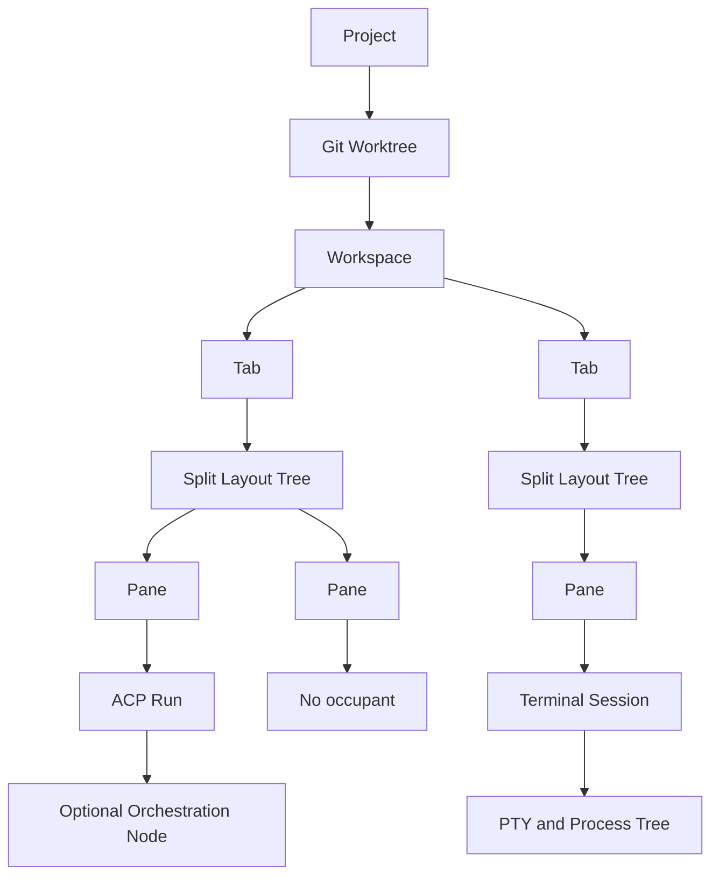
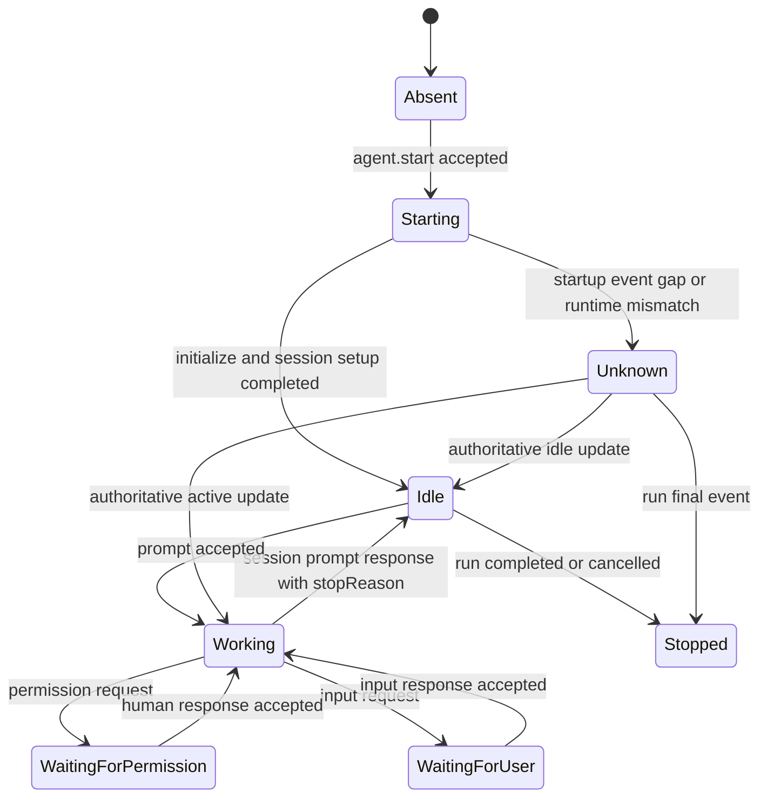
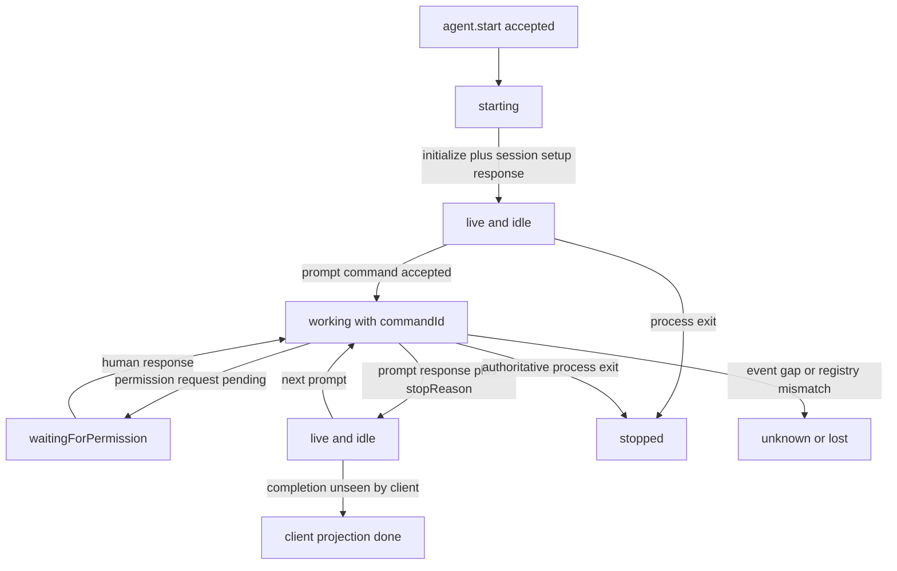
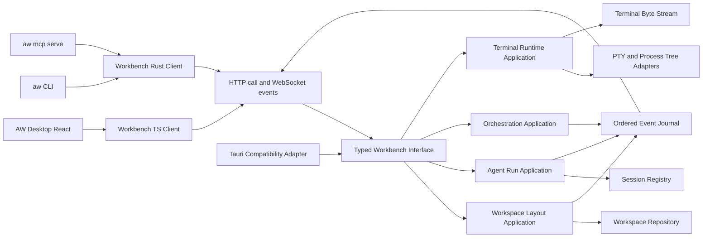
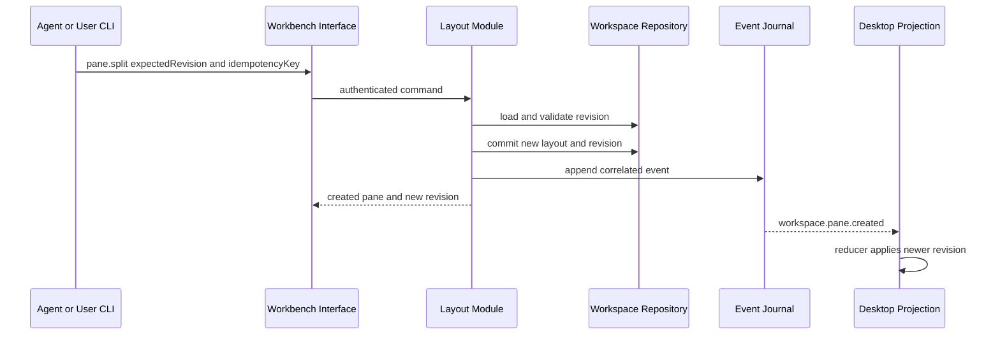
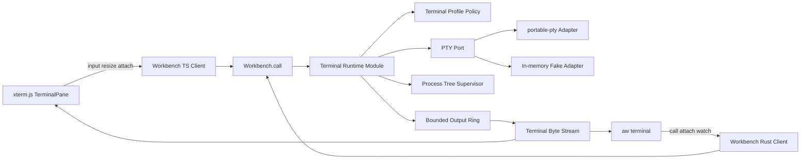
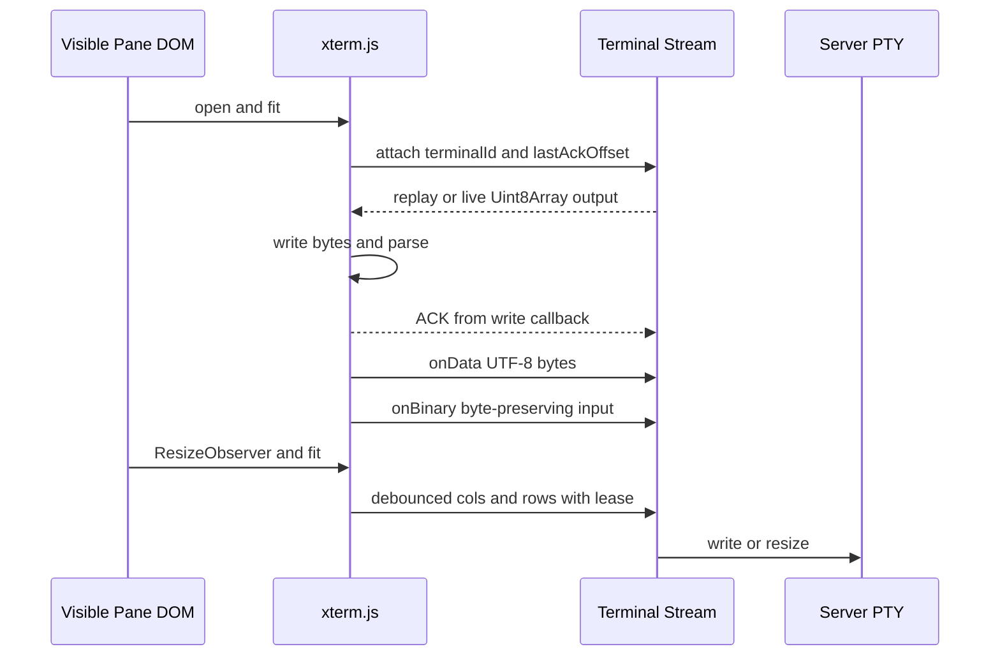
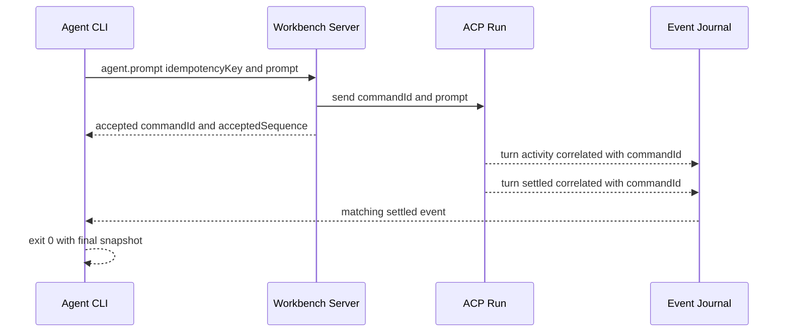
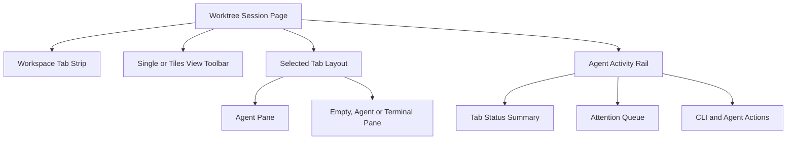
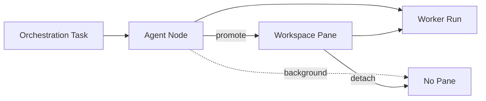

# Agentic Workbench CLI 인터페이스 조사와 설계 제안

> 조사 기준일: 2026-08-29
>
> 범위: AW의 worktree session에서 탭·pane을 만들고, pane·탭별 agent 활성 상태를 조회하며, xterm.js terminal pane을 실행·attach하고, agent가 CLI로 안전하게 후속 동작을 수행하게 하는 control plane
>
> 결론: **UI 내부 상태를 직접 조작하는 CLI가 아니라, AW 서버가 소유하는 typed `Workbench` 인터페이스를 Desktop UI와 `aw` CLI가 함께 사용해야 한다.**
>
> 후속 소유권 정정: [서버-클라이언트 전환 조사](client-server-architecture-research.md#기능-배치-제안)를 상위 결정으로 적용한다. ACP Run·TerminalSession은 서버가 소유하지만 tab·pane layout은 Desktop presentation 상태다. 이 문서의 server-owned logical Tab/Pane 제안은 여러 client가 topology 자체를 공유하기로 별도 결정할 때의 확장안이며, 기본 CLI는 target Desktop의 presentation intent와 ACK를 사용한다. ID 계약은 [pane·tab 식별자 설계](pane-tab-identifier-design.md)를 따른다.
>
> ACP 우선 보강: agent pane을 terminal emulation이 아닌 structured session·turn·tool·interaction projection으로 만드는 상세 계약과 v1/v2 Adapter 전략은 [ACP-native agent Interface 설계](acp-native-agent-interface-research.md)를 기준으로 한다.

## 요약

권장안은 다음과 같다.

1. `aw` CLI를 독립된 UI 자동화 도구가 아니라 AW application module의 공식 클라이언트로 만든다.
2. worktree session을 `Workspace`, 화면 상단의 실제 그룹을 `Tab`, 분할 레이아웃의 leaf를 `Pane`, pane에 붙는 ACP 실행을 `Run`으로 구분한다.
3. 현재 React가 소유하는 `AgentRunWorkspaceState`를 서버가 소유하는 revision 기반 aggregate로 옮긴다. Desktop, CLI, 향후 TUI는 같은 명령과 이벤트를 소비한다.
4. `isRunning` 한 값으로 agent 상태를 표현하지 않는다. `run lifecycle`, `agent activity`, `attention`, `presentation`을 분리하고, 탭 상태는 pane 상태의 집계로 계산한다.
5. agent에게는 현재 `workspace/tab/pane/run` ID와 제한된 capability를 주입한다. 기본 권한은 현재 workspace 조회이며, pane·tab 생성과 child agent 시작은 Main Coordinator에만 선택적으로 허용한다.
6. background 생성은 focus를 바꾸지 않는 것이 기본이다. 조회는 seen/unseen 상태를 바꾸지 않으며, focus는 별도의 presentation effect다.
7. 유한 명령은 단일 JSON, watch 명령은 JSONL event stream을 출력한다. ID는 응답에서 읽고, mutation은 `requestId`, `idempotencyKey`, `expectedRevision`을 구분한다.
8. terminal은 xterm.js가 process를 직접 소유하는 구조가 아니라, backend가 PTY·process·raw output journal을 소유하고 xterm.js와 CLI가 attach하는 구조로 만든다.
9. terminal control metadata는 기존 JSON operation을 사용하되 PTY byte stream은 offset·ACK 기반 binary subprotocol로 분리한다. 한 terminal session에는 동시에 여러 observer가 붙을 수 있지만 input·resize lease는 하나만 허용한다.
10. 첫 단계는 read-only snapshot/status CLI와 공통 application seam이다. 그다음 tab/pane mutation, terminal PTY와 attach, agent start/prompt/wait, 독립 daemon 순으로 확장한다.
11. Herdr agent 기능은 그대로 복제하지 않는다. ACP의 prompt turn·permission·stop reason으로 `working/idle/blocked`를 만들고, command correlation과 client별 seen cursor를 보강한다. PTY 전용 `send-keys`와 screen read는 agent 명령에서 제외한다.

이 방향은 이미 정리된 로컬 우선 AW 서버 제안의 `call`·`events` 모델, typed operation registry, JSON/JSONL CLI 계약을 그대로 좁혀 적용한다. 해당 문서는 Tauri 명령을 한 번에 네트워크 Interface로 치환하지 말고 compatibility adapter를 유지한 채 domain별로 전환하라고 권고한다. ([서버-클라이언트 조사](client-server-architecture-research.md#결론), [일반 CLI 인터페이스](client-server-architecture-research.md#일반-cli-interface))

## 조사 범위와 제약

### 사용한 1차 자료

- 현재 AW/OpenWiki 문서와 AW·`acp-agent-core`·`agent-client` 소스
- 현재 저장소의 기존 서버/CLI 아키텍처 결정 문서
- 로컬 Herdr 공식 스킬 문서 `/Users/yoophi/.agents/skills/herdr/SKILL.md`
- xterm.js 공식 API·security·flow control·addon 문서와 공식 repository
- `portable-pty` 0.9.0 공식 Rust API 문서
- 로컬 명령으로 확인한 실제 source symbol과 Tauri command 목록

외부 블로그나 비교 리뷰 같은 2차 자료는 사용하지 않았다.

### Herdr 실시간 CLI 조사 제약

Herdr 스킬은 어떤 Herdr 명령보다 먼저 다음 검사를 요구한다. 실패하면 focused Herdr session을 조회하거나 제어하지 말아야 한다. ([Herdr 스킬 8–18행](/Users/yoophi/.agents/skills/herdr/SKILL.md#L8-L18))

```sh
test "${HERDR_ENV:-}" = 1
```

이 세션에서 검사는 출력 없이 exit status `1`을 반환했다. 따라서 `herdr --help`, `herdr --skill`, `herdr agent`, `herdr pane`을 실행하지 않았다. 설치된 바이너리가 실제 구문과 옵션의 최종 권위라는 스킬 규칙도 따른 것이다. ([Herdr 스킬 20–44행](/Users/yoophi/.agents/skills/herdr/SKILL.md#L20-L44))

그러므로 이 문서의 Herdr 관련 내용은 **설치 바이너리로 재검증되지 않은 공식 스킬 기반 설계 참고사항**이다. 구현 전에는 `HERDR_ENV=1`인 pane 안에서 별도의 read-only 검증을 수행해야 한다.

검증할 명령은 다음으로 제한한다.

```sh
herdr --help
herdr --skill
herdr agent
herdr pane
herdr tab
herdr workspace
herdr session
```

bare `herdr`는 TUI를 시작할 수 있고, 일부 mutation subcommand는 인자를 생략해도 실행될 수 있으므로 discovery에 사용하지 않는다. ([Herdr 스킬 28–44행](/Users/yoophi/.agents/skills/herdr/SKILL.md#L28-L44))

## 현재 AW에서 재사용할 수 있는 기반

### 다중 panel과 tile layout

현재 frontend 모델은 다음 기반을 이미 제공한다.

- 고정 main panel ID `main-agent-run`
- panel 최대 8개, tile depth 최대 4
- panel slot별 `isRunning`, `activeRunId`, close state, pending exchange count
- `tabs`와 `tiles` projection
- 오른쪽 또는 아래 split, resize, close, focus
- extra panel 종료 전 active run 취소 확인

근거는 [`agent-run-workspace.ts` 14–54행](../apps/agentic-workbench/src/entities/agent-run/model/agent-run-workspace.ts#L14-L54)과 [156–198행](../apps/agentic-workbench/src/entities/agent-run/model/agent-run-workspace.ts#L156-L198)이다. 기존 설계 문서도 layout을 이진 split tree로 표현하고 panel ID와 run ID를 함께 검증한다. ([에이전트 런 탭·타일 워크스페이스](agent-run-tile-workspace.md))

하지만 이 상태는 frontend `WorktreeAgentRunArea`가 소유한다. backend의 `sync_agent_workspace`는 frontend가 보낸 snapshot을 in-memory registry에 반영할 뿐이다. ([`tauri_commands.rs` 990–1011행](../apps/agentic-workbench/src-tauri/src/inbound/tauri_commands.rs#L990-L1011)) CLI와 UI가 동시에 layout을 바꾸려면 서버가 canonical aggregate를 소유해야 한다. 그렇지 않으면 CLI mutation 직후 다음 UI sync가 상태를 덮어쓸 수 있다.

### agent 실행과 prompt 제어

현재 backend에는 이미 다음 얇은 Tauri inbound adapter가 있다.

- `start_agent_run`
- `send_prompt_to_run`
- `steer_prompt_to_run`
- `cancel_current_prompt_and_send_to_run`
- `set_run_permission_mode`
- `cancel_agent_run`
- `respond_agent_permission`

실제 구현은 application use case와 session registry에 위임된다. ([`tauri_commands.rs` 1675–1854행](../apps/agentic-workbench/src-tauri/src/inbound/tauri_commands.rs#L1675-L1854), [OpenWiki AW 106–117행](../openwiki/agentic-workbench.md#L106-L117)) 따라서 CLI 전용 business logic을 새로 만들 필요는 없다. 같은 use case 앞에 typed Workbench operation adapter를 두는 것이 맞다.

### 현재 상태 어휘

현재 wire contract는 agent thread를 `active | idle | unknown`으로 표현하고, run lifecycle은 `started`, `initialized`, `sessionCreated`, `sessionIdle`, `promptSent`, `promptCompleted`, steer 상태, `completed`, `cancelled`를 제공한다. ([`packages/agent-client/src/types.ts` 67–70행](../packages/agent-client/src/types.ts#L67-L70), [108–124행](../packages/agent-client/src/types.ts#L108-L124))

오케스트레이션은 더 정교하게 세 축을 이미 분리한다.

| 축 | 현재 값 |
|---|---|
| Task | `pending`, `ready`, `running`, `inputRequired`, `blocked`, `completed`, `failed`, `cancelled` |
| Execution | `unassigned`, `starting`, `active`, `idle`, `stopped` |
| Presentation | `background`, `attentionRequired`, `promoting`, `panel`, `detached`, `archived` |

근거는 [`agent_orchestration.rs` 80–159행](../apps/agentic-workbench/src-tauri/src/domain/agent_orchestration.rs#L80-L159)이다. panel을 닫아도 task를 취소하지 않는 정책도 이미 문서화되어 있다. ([OpenWiki agent flow 160–166행](../openwiki/agent-run-flow.md#L160-L166)) 새 CLI 상태 모델은 이 분리를 보존해야 한다.

### 현재 seam의 한계

| 현재 상태 | CLI 도입 시 문제 |
|---|---|
| frontend가 panel layout의 canonical owner | CLI/UI 동시 mutation에서 lost update 가능 |
| backend panel 상태가 `idle | running | closing` | working, 입력 대기, unseen completion, unknown을 구분할 수 없음 |
| `window_label`이 workspace/run owner 역할 | headless CLI와 daemon 수명을 표현하기 어려움 |
| Tauri event가 window에 직접 전달됨 | CLI reconnect, replay, cursor가 없음 |
| run-scoped MCP는 일부 agent tool만 노출 | 일반 CLI operation catalog와 권한 모델이 따로 생길 위험 |
| 세션 창 파괴 시 소유 run 취소 | desktop 종료 뒤 CLI 관찰·제어 불가 |

현재 backend panel endpoint가 `panel_id`, `run_id`, `Idle | Running | Closing`만 갖는 사실은 [`agent_exchange.rs` 3–58행](../apps/agentic-workbench/src-tauri/src/domain/agent_exchange.rs#L3-L58)에서 확인할 수 있다. 창 종료와 run lifetime 결합은 [OpenWiki agent flow 218–233행](../openwiki/agent-run-flow.md#L218-L233)에 기록되어 있다.

## Herdr에서 참고할 설계 원칙

다음은 로컬 공식 스킬에서 확인한 원칙이며 live binary 검증 전까지 명령 호환성으로 간주하면 안 된다.

### topology와 occupant를 분리한다

Herdr는 `workspace → tab → pane`을 layout topology로 다루고, pane은 agent 없이도 존재한다. pane 명령은 raw terminal/process를, agent 명령은 pane occupant로 인식된 coding agent를 다룬다. `agent start`는 pane을 생성하거나 분할하지 않는다. ([Herdr 스킬 46–58행](/Users/yoophi/.agents/skills/herdr/SKILL.md#L46-L58))

AW에도 같은 분리가 필요하다. `pane split`은 빈 pane을 만들고, `agent start --pane` 또는 `terminal start --pane`이 occupant를 붙인다. topology operation은 PTY나 agent process를 암묵적으로 시작하지 않는다.

### ID는 opaque handle이며 응답에서 읽는다

Herdr는 workspace/tab/pane 공개 ID를 opaque stable handle로 보고 닫힌 ID를 재사용하지 않는다. 생성 응답이 다음 명령에 사용할 ID를 돌려준다. ([Herdr 스킬 60–88행](/Users/yoophi/.agents/skills/herdr/SKILL.md#L60-L88))

AW도 type prefix가 있는 opaque ID를 사용하되 prefix나 생성 순서를 business logic으로 해석하지 않는다. 서버-클라이언트 전환 결정에 따라 Run·TerminalSession은 서버 resource이고 tab·pane은 Desktop presentation resource다. 상세 발급·ACK·migration 계약은 [pane·tab 식별자 설계](pane-tab-identifier-design.md)를 따른다.

| 리소스 | 예시 | 규칙 |
|---|---|---|
| Workspace | `wsp_<uuid>` | server-owned worktree identity |
| Presentation | `prs_<uuid>` | Desktop-local layout document의 stable identity |
| Client instance | `cli_<uuid>` | 현재 Desktop process/connection identity |
| Tab | `tab_<uuid>` | presentation-local layout group, Desktop가 발급 |
| Pane | `pan_<uuid>` | presentation-local layout leaf, Desktop가 발급 |
| Run | `run_<uuid>` | server-owned ACP 실행, pane 수명과 분리 |
| Command | `cmd_<uuid>` | server command correlation identity |

v1 issuer는 현재 Rust/browser 지원과 맞춘 UUID v4를 사용한다. pane은 같은 presentation/workspace 안에서 tab을 이동해도 ID를 유지한다. 다른 presentation이나 workspace로 이동은 v1에서 금지하며 copy가 필요하면 새 ID를 발급한다. tab/pane 생성 결과는 target Desktop가 layout을 commit하고 ACK한 뒤 반환한다.

### caller context와 UI focus를 구분한다

Herdr는 caller pane에 workspace/tab/pane ID를 주입하고, target 생략이 UI-focused pane을 잡을 수 있으므로 `--current` 또는 explicit ID를 권한다. background 작업은 `--no-focus`가 원칙이다. ([Herdr 스킬 70–106행](/Users/yoophi/.agents/skills/herdr/SKILL.md#L70-L106), [187–195행](/Users/yoophi/.agents/skills/herdr/SKILL.md#L187-L195))

AW는 더 엄격하게 다음 규칙을 적용한다.

- agent principal에서 `--current`는 주입된 caller context만 뜻한다.
- target과 `--current`가 모두 없으면 mutation을 거부한다. UI focus로 암묵 fallback하지 않는다.
- `tab create`, `pane split`, `agent start`는 기본적으로 user focus를 바꾸지 않는다.
- focus 변경은 `presentation.focus` effect이며 별도 scope를 요구한다.
- status 조회는 read-only이며 unseen/seen을 바꾸지 않는다.

### 상태와 관찰 여부를 분리한다

Herdr의 `idle`과 `done`은 underlying idle은 같지만 background completion을 사용자가 보았는지로 구분된다. CLI read는 seen 처리하지 않는다. `blocked`는 승인/질문 UI, `unknown`은 분류 불확실이며 완료를 뜻하지 않는다. ([Herdr 스킬 54–58행](/Users/yoophi/.agents/skills/herdr/SKILL.md#L54-L58))

AW는 이 장점을 취하되 `done`을 canonical run state로 만들지 않는다. 서버는 `activity=idle`, completion event sequence와 canonical attention reason을 저장하고, 각 client는 자기 seen cursor로 `unseenCompletion`을 계산한다. CLI read는 어떤 client의 seen cursor도 전진시키지 않는다.

## 목표와 비목표

### 목표

- agent가 자기 worktree의 tab·pane topology, agent activity, terminal session lifecycle을 안정적으로 조회한다.
- Main Coordinator가 background tab/pane을 만들고 child agent를 시작·prompt·wait할 수 있다.
- 허용된 principal이 terminal tab/pane을 만들고, 등록된 terminal profile을 시작하며, output을 watch하거나 제한된 input을 보낼 수 있다.
- 사용자는 Desktop UI에서 CLI로 생긴 layout과 상태 변화를 즉시 확인한다.
- Desktop UI와 CLI가 같은 operation, authorization, revision, event contract를 사용한다.
- pane/tab별 live agent 수, working/blocked/idle/unknown 수와 attention 여부를 조회한다.
- stale target, duplicate request, reconnect, desktop 재시작에 예측 가능한 동작을 제공한다.

### 비목표

- agent principal에 임의 executable·cwd·environment·signal을 직접 선택하게 하지 않는다. 등록된 terminal profile과 allowlist operation만 제공한다.
- v1에서 cross-workspace pane 이동이나 여러 worktree 동시 쓰기를 허용하지 않는다.
- CLI가 permission 승인 또는 위험 권한 mode 선택을 사람 대신 수행하지 않는다.
- CLI로 DOM click이나 React component state를 직접 변경하지 않는다.
- 현재 orchestration task와 pane을 같은 entity로 합치지 않는다.
- 일반 CLI와 MCP에 모든 operation을 자동 노출하지 않는다.
- terminal output 문자열을 ACP agent activity나 orchestration task 완료의 authoritative signal로 사용하지 않는다.

## 권장 도메인 모델



### `Workspace`

```ts
type Workspace = {
  id: WorkspaceId;
  projectId: string;
  worktreePath: string;
  tabIds: TabId[];
  mainPaneId: PaneId;
  revision: number;
  createdAt: string;
  updatedAt: string;
};
```

불변식:

- canonicalized worktree 하나의 active workspace당 main pane은 정확히 하나다.
- main pane은 닫거나 다른 workspace로 이동할 수 없다.
- 전체 pane 수는 기존 제한과 동일하게 우선 8개로 유지한다.
- 모든 mutation은 aggregate `expectedRevision`을 검사한다.
- Desktop window와 workspace identity를 분리한다. 여러 client가 같은 workspace를 관찰할 수 있다.

### `Tab`

```ts
type WorkspaceTab = {
  id: TabId;
  workspaceId: WorkspaceId;
  title: string;
  root: LayoutNode;
  ordinal: number;
  createdBy: ActorRef;
  createdAt: string;
};
```

tab 생성은 root pane을 원자적으로 함께 만든다. tab이 empty layout을 갖는 중간 상태는 외부에 보이지 않는다. tab close는 모든 child pane의 처리 정책이 필요하므로 기본적으로 `conflict`를 반환하고, 사람이 명시적으로 각 run을 cancel/detach한 뒤 닫게 한다.

### `Pane`

```ts
type Pane = {
  id: PaneId;
  workspaceId: WorkspaceId;
  tabId: TabId;
  title: string;
  content:
    | { kind: "empty" }
    | { kind: "agent"; runId: RunId }
    | { kind: "terminal"; terminalSessionId: TerminalSessionId };
  orchestrationNodeId: string | null;
  lifecycle: "open" | "closing" | "closed";
  createdBy: ActorRef;
  createdAt: string;
};
```

pane은 layout leaf이며 process owner가 아니다. `content.kind=empty`를 정상 상태로 인정한다. agent run과 terminal session은 pane에서 detach되어도 backend에서 계속 살 수 있고, pane 하나는 한 시점에 occupant 하나만 투영한다. orchestration child는 background 상태로 pane 없이 실행할 수 있고, 사용자가 promote할 때 pane을 만들거나 기존 pane에 연결한다. 현재 구현처럼 orchestration node ID를 panel ID로 재사용하지 않고 별도 참조로 둔다.

### layout tree

```ts
type LayoutNode =
  | { type: "pane"; paneId: PaneId }
  | {
      type: "split";
      id: SplitId;
      direction: "horizontal" | "vertical";
      first: LayoutNode;
      second: LayoutNode;
    };
```

서버는 leaf membership, child order, split direction과 depth 같은 **논리 topology**만 소유한다. split ratio, pixel size와 separator 위치는 viewport별 **client-local geometry**다. 기존 `tile-layout.ts`의 pure function 중 topology 불변식은 server domain으로 옮기거나 mirror하고, 15–85% ratio 처리는 frontend에 유지한다. server와 frontend의 golden fixture는 leaf order/direction/close 결과만 비교한다.

## tab 용어 충돌 해결

현재 AW에는 이미 서로 다른 두 종류의 tab이 있으며, 이 문서가 세 번째 의미를 제안한다.

| 구분 | 현재/제안 의미 | 소유자 | `aw tab`과 관계 |
|---|---|---|---|
| macOS native window tab | 여러 Tauri session window를 `NSWindow` tab group으로 묶음 | macOS/Tauri Desktop shell | 관계없음. CLI logical topology로 노출하지 않음 |
| 기존 agent `tabs` view | 동일 panel slot 중 focused panel 하나만 보여 주는 React projection | 각 Desktop client | `single` view로 rename |
| 제안 logical agent Tab | workspace 안 하나의 split topology와 여러 pane을 포함 | AW server/domain | `aw tab *`의 유일한 대상 |

macOS 구현은 `TABBING_IDENTIFIER = "acp-session"`을 사용하고 open mode가 `tab`이면 native `open_as_tab` 경로로 분기한다. ([`window_manager.rs` 19–20행](../apps/agentic-workbench/src-tauri/src/infrastructure/window_manager.rs#L19-L20), [93–112행](../apps/agentic-workbench/src-tauri/src/infrastructure/window_manager.rs#L93-L112)) 이는 window composition 기능이며 logical agent Tab과 수명·ID·권한을 공유하지 않는다.

현재 `AgentRunViewMode = "tabs" | "tiles"`의 `tabs`는 동일한 panel slot 집합에서 focused panel 하나만 보여 주는 **projection**이다. 새 logical Tab은 여러 pane layout을 포함하는 **domain entity**다. 셋을 같은 이름으로 유지하면 CLI의 `tab create`가 native window tab, 기존 UI projection, logical group 중 무엇을 만드는지 모호해진다.

권장 migration은 다음과 같다.

| 현재 용어 | 새 domain/UI 용어 | 설명 |
|---|---|---|
| `AgentRunViewMode.tabs` | `PaneViewMode.single` | 현재 tab projection, focused pane 하나 표시 |
| `AgentRunViewMode.tiles` | `PaneViewMode.tiles` | 현재 tile projection |
| `AgentRunPanelSlot` | `PaneProjection` | server `Pane`의 UI projection |
| 새 `WorkspaceTab` | `Tab` | 하나의 split tree와 여러 pane을 포함 |

초기 호환 기간에는 TypeScript alias를 유지하되 wire contract에는 처음부터 `single | tiles`를 사용한다.

## 서버 topology와 client geometry seam

CLI가 layout을 제어하려면 공유해야 하는 것은 논리 구조이지 특정 창의 pixel 배치가 아니다. Desktop 두 대, TUI와 headless agent는 viewport가 서로 다르므로 geometry를 server canonical state로 만들면 한 client의 resize가 다른 client의 화면을 흔든다.

| server-owned logical state | client-local presentation/geometry |
|---|---|
| Workspace/Tab/Pane ID, 이름과 생성 actor | macOS native window tab group |
| tab 순서와 pane membership | 선택된 logical tab, focused pane |
| split tree의 parent/child와 direction | `single | tiles` view mode |
| pane occupant run과 orchestration node binding | split ratio, pixel size, separator 위치 |
| run lifecycle/activity와 canonical attention reason | scroll, composer draft, selection |
| logical revision, event cursor와 audit | pane visibility, client별 seen cursor |
| capacity/depth/close 불변식 | window bounds와 auxiliary panel widths |

server의 topology revision은 create/split/move/close/rename/occupant attach에만 증가한다. tab/pane focus, resize, view mode와 seen 처리는 topology revision을 바꾸지 않는다.

`aw tab focus`와 `aw pane focus`는 server state mutation이 아니라 특정 Desktop client에 보내는 `presentation.intent`다. `--client <client-id>` 또는 caller와 명시적으로 연결된 presentation client가 필요하며, 대상이 없으면 `noPresentationTarget`을 반환한다. headless agent가 임의의 사용자 창을 고르는 fallback은 제공하지 않는다.

logical topology event를 받은 client는 자기 geometry 정책으로 새 split을 렌더링한다. 기본 ratio는 0.5로 시작할 수 있지만 이후 resize는 해당 client의 presentation store에만 저장한다. 기존 worktree별 auxiliary panel 폭과 창 bounds도 이 client-local 범주를 유지한다.

## agent 활성 상태 모델

### 한 개의 `isRunning`을 사용하지 않는 이유

현재 panel slot의 `isRunning`은 process가 살아 있는지, active turn이 실행 중인지, prompt를 받을 수 있는 idle인지, permission을 기다리는지 구분하지 못한다. Herdr의 `done`/`idle` 차이와 AW orchestration의 task/execution/presentation 분리도 한 boolean이 부족함을 보여 준다.

권장 snapshot은 다음 네 축을 가진다.

```ts
type AgentPresence = "absent" | "present" | "lost";

type RunLifecycle =
  | "starting"
  | "live"
  | "cancelRequested"
  | "completed"
  | "cancelled"
  | "failed";

type AgentActivity =
  | "starting"
  | "working"
  | "waitingForPermission"
  | "waitingForUser"
  | "idle"
  | "unknown"
  | "stopped";

type AttentionReason =
  | "none"
  | "inputRequired"
  | "completion"
  | "error";

type AgentActivitySnapshot = {
  paneId: PaneId;
  runId: RunId | null;
  presence: AgentPresence;
  lifecycle: RunLifecycle | null;
  activity: AgentActivity | null;
  attentionReason: AttentionReason;
  activeCommandId: CommandId | null;
  lastSettledCommandId: CommandId | null;
  lastStopReason:
    | "end_turn"
    | "max_tokens"
    | "max_turn_requests"
    | "refusal"
    | "cancelled"
    | "unknown"
    | null;
  providerThreadStatus: "active" | "idle" | "unknown" | null;
  lastActivityAt: string | null;
  activityRevision: number;
  lastEventSequence: number | null;
  lastCompletionSequence: number | null;
  confidence: "authoritative" | "corroborated" | "derived" | "unknown";
  evidence: Array<
    "runtimeRegistry" | "acpPrompt" | "acpPermission" | "orchestration" | "providerExtension"
  >;
};

type ClientAttentionProjection = {
  clientId: string;
  lastSeenSequence: number;
  unseenCompletion: boolean;
};
```

`AgentActivitySnapshot`은 server canonical 상태다. `ClientAttentionProjection`은 `--client <id>` 또는 Desktop rendering처럼 특정 presentation client를 명시한 조회에만 합성한다.

### projection 우선순위

| 우선순위 | 관찰 | `activity` | canonical `attentionReason` |
|---:|---|---|---|
| 1 | run이 completed/cancelled/failed lifecycle에 도달 | `stopped` | completion 또는 error |
| 2 | run registry는 active였으나 process/session 없음 | `unknown` + presence `lost` | `error` |
| 3 | 응답이 필요한 ACP permission request | `waitingForPermission` | `inputRequired` |
| 4 | orchestration input request 또는 협상된 elicitation | `waitingForUser` | `inputRequired` |
| 5 | Workbench가 추적하는 `session/prompt`가 응답 전 | `working` | 기존 error가 없으면 `none` |
| 6 | live ACP session이며 active prompt가 없음 | `idle` | settled event가 있으면 `completion` |
| 7 | registry/event gap 또는 서로 충돌하는 관찰 | `unknown` | 보수적으로 기존 attention 유지 |

Codex의 `_meta.codex.threadStatus` 같은 provider extension은 5·6번 결정을 **확인하거나 불일치를 탐지하는 보조 증거**일 뿐 우선순위를 뒤집지 않는다. ACP의 `_meta`는 표준 상태 필드가 아니며 capability 협상 없이 범용 의미를 가정하면 안 된다. `unknown`은 완료나 idle로 간주하지 않는다. state reducer의 입력은 canonical run event와 orchestration event여야 하며 workspace terminal output 문자열을 agent 상태 판별에 사용하지 않는다.

### tab·workspace 집계

Tab의 “agent가 활성인가?”는 단일 boolean 대신 다음 summary로 응답한다.

```ts
type AgentActivitySummary = {
  paneCount: number;
  occupiedPaneCount: number;
  liveAgentCount: number;
  workingCount: number;
  waitingCount: number;
  idleCount: number;
  unknownCount: number;
  terminalPaneCount: number;
  attentionCount: number;
  unseenCompletionCount: number | null;
  hasLiveAgents: boolean;
  hasWorkingAgents: boolean;
  needsAttention: boolean;
};
```

`hasLiveAgents`는 start/working/waiting/idle/unknown live run을 포함한다. `hasWorkingAgents`는 실제 active turn만 뜻한다. `unseenCompletionCount`는 client presentation overlay를 요청하지 않은 canonical 조회에서는 `null`이다. UI와 agent가 “active”라는 단어를 서로 다르게 해석하지 않도록 CLI 필드명을 이처럼 구체화한다.



## Herdr agent 기능과 ACP 연계 가능성

### 판단 기준

이 절은 Herdr 공식 스킬에 문서화된 `agent start/list/get/prompt/wait/send-keys/read`와 focus·seen 의미를 기준으로 한다. 현재 세션은 `HERDR_ENV=1`이 아니므로 설치된 Herdr binary의 전체 subcommand나 JSON schema를 확인하지 못했다. 따라서 아래 표는 명령 호환표가 아니라 **기능 의미의 매핑**이다.

분류는 다음과 같다.

| 등급 | 의미 |
|---|---|
| A — 직접 제공 가능 | ACP 표준 신호 또는 AW가 직접 소유한 runtime/topology 상태로 provider 공통 구현 가능 |
| B — 추가 projection 필요 | 제공 가능하지만 command correlation, read model, client seen cursor 등 AW 상태를 추가해야 함 |
| C — 범용 제공 어려움 | ACP 표준에 해당 개념이 없거나 raw terminal UI가 필요해 provider 공통 보장을 할 수 없음 |

등급은 현재 public `aw` 명령이 이미 존재한다는 뜻이 아니다. A는 기존 ACP/AW 신호로 의미를 정확히 만들 수 있고, B는 새로운 server-owned 상태가 있어야 하며, C는 provider-neutral contract로 보장하지 말아야 한다는 구현 가능성 분류다.

판단할 때 사용하는 신호 우선순위는 다음과 같다.

1. AW가 직접 소유한 process/session registry, active prompt command, pending permission
2. ACP 표준 `initialize`, `session/new|load`, `session/prompt`, `session/update`, prompt `stopReason`
3. capability가 협상된 provider extension
4. 화면 문자열, process 이름, prompt glyph 같은 heuristic

1·2번은 canonical state를 만들 수 있다. 3번은 보조 증거이며 confidence를 표시한다. 4번은 ACP agent pane에서는 사용하지 않는다. ACP 공식 prompt turn은 `session/prompt` 요청부터 응답의 `stopReason`까지를 한 turn으로 정의하고, 그 사이 output과 permission을 구조적으로 전달한다. ([ACP Prompt Turn](https://agentclientprotocol.com/protocol/v1/prompt-turn))

### 기능별 판정

| Herdr 기능 의미 | 등급 | ACP/AW 근거와 차이 | AW 권장 기능 |
|---|---|---|---|
| live agent 목록 | B | AW registry는 active run을 알고 있지만 현재 public list/snapshot과 pane occupant alias가 없음 | `agent list [--workspace <id>\|--tab <id>\|--pane <id>]` |
| agent 상세·상태 조회 | B | lifecycle event와 journal은 있으나 상태 reducer가 frontend와 orchestration에 나뉘어 있음 | server `AgentActivitySnapshot` 하나로 `agent get` 제공 |
| 기존 empty pane에서 agent 시작 | B | spawn·initialize·session setup은 이미 있으나 `start_agent_run`은 session ready 전에 accepted run을 반환하고 초기 goal과 launch가 결합됨 | session-only `agent start`, 별도 `agent prompt`; CLI `--wait-ready`는 wait를 합성 |
| unique agent name으로 targeting | B | 이름은 ACP identity가 아니라 pane occupant의 control-plane alias여야 함 | workspace 범위 unique name + pane ID target |
| `working` | A | Workbench가 시작한 `session/prompt` 요청이 응답 전인지 직접 추적 가능 | `activeCommandId != null`을 authoritative signal로 사용 |
| `idle` | A | live session이 setup 완료됐고 active prompt·permission·structured input request가 없으면 ACP 관점에서 다음 prompt를 받을 수 있음 | provider thread status 없이 계산 |
| approval `blocked` | A | `session/request_permission`과 pending response가 명시적 | canonical `waitingForPermission`; Herdr 호환 projection에서 `blocked` |
| 질문/사용자 입력 `blocked` | C, 일부 B | 일반 message가 질문인지 표준 prompt response만으로는 알 수 없음. AW orchestration input request는 구조화되어 있고 ACP elicitation은 현재 AW에서 미지원 | `waitingForUser`는 orchestration 또는 협상된 elicitation에만 사용; message text 추론 금지 |
| `done` | B | ACP state가 아니라 idle turn completion을 특정 presentation client가 아직 보지 않은 상태 | `idle + completionSequence + client.lastSeenSequence`; client 미지정 조회는 `done` 대신 `unseenCompletion=null` |
| `unknown` | A | startup gap, runtime lost, journal gap, 상충하는 extension 관찰을 보수적으로 표현 가능 | 완료로 취급하지 않고 evidence/recovery reason 반환 |
| prompt 전송 | A | ACP 표준 `session/prompt`; terminal paste나 Enter encoding이 필요 없음 | `agent prompt --input - --delivery direct` |
| prompt queue | B | 현재 `in_flight` mutex를 기다리는 `queue_prompt`가 있지만 public command ledger와 queue position이 없음 | `--delivery queue`, queue position과 command ID 반환 |
| active turn steer | C | ACP v1 표준 steer method가 없고 현재 `AcpSession::steer_prompt`도 unsupported를 반환 | capability-gated extension으로만 노출; 기본은 queue 또는 cancel-and-send |
| prompt 후 wait | B | prompt response는 확실하지만 현재 `PromptSent/PromptCompleted` event에 public command ID가 없어 다른 turn과 correlation 불가 | command ID를 active ACP request에 결합하고 해당 `stopReason`까지 대기 |
| standalone state wait | B | bounded sequence journal이 있으나 snapshot/reducer를 공통 server Module로 옮겨야 함 | snapshot과 cursor를 원자적으로 얻은 뒤 event subscribe |
| Ctrl-C로 현재 turn 취소 | B | raw key가 아니라 ACP `session/cancel` 의미로 제공해야 함. 현재 구현은 `$/cancel_request`, whole-run cancel은 process 종료임 | `agent cancel-turn`; ACP `session/cancel`과 `stopReason=cancelled` 확인 |
| Esc·임의 logical key | C | ACP stdio는 JSON-RPC transport이므로 raw byte를 쓰면 protocol을 손상시킴 | agent surface에서 `send-keys` 미제공; terminal pane에만 제공 |
| 최근 agent 응답 읽기 | B | `agent_message_chunk`, thought, plan, tool event가 있으나 현재 mapper는 message ID를 버리고 journal은 512 event in-memory 제한 | `read --source messages|transcript|events`, truncation/gap 명시 |
| visible/recent/unwrapped/detection/ANSI screen 읽기 | C | ACP agent pane에는 terminal screen·viewport·soft-wrap·alternate screen이 없음 | xterm.js terminal pane의 `terminal read`로만 제공; agent read source와 분리 |
| focus와 seen 처리 | B | ACP와 무관한 presentation effect이며 여러 Desktop client 중 대상을 정해야 함 | `agent focus --client`; 성공한 client만 seen cursor 전진 |
| read가 seen을 바꾸지 않음 | A | read operation과 presentation mutation을 분리하면 됨 | 모든 `list/get/read/events/wait`는 seen cursor 불변 |
| pane에서 agent detach/release | B | Pane과 Run을 분리한 topology에서는 가능하지만 현재 frontend panel/run 결합을 server-owned occupant로 옮겨야 함 | `agent detach`; run은 유지, name policy에 따라 해제 또는 background alias 유지 |
| agent process 종료 | A | 현재 run cancel이 registry에서 run handle을 제거하고 process future를 중단함 | `agent stop`; turn cancel과 다른 destructive operation |
| 기존 terminal의 coding agent 자동 인식 | C | AW가 시작하지 않은 terminal process에는 ACP connection, run ID, session lifecycle이 없음 | v1 미지원; 명시적 ACP launch/handshake Adapter가 생길 때만 attach |
| native agent args 전달 | C, 의도적 제한 | Herdr는 `-- <agent-args>`를 지원하지만 agent principal에 arbitrary args/env를 열면 profile policy를 우회함 | 등록 profile만 허용; human admin이 profile을 관리 |

### 상태를 만드는 authoritative reducer



`working`은 provider가 보내는 status 문자열이 아니라 outstanding prompt command로 결정한다. ACP `session/prompt` 응답은 turn 완료 시 반드시 `StopReason`을 포함하므로 `idle` 전환도 표준 신호로 만들 수 있다. `end_turn`, `max_tokens`, `max_turn_requests`, `refusal`, `cancelled`를 문자열 message에 묻지 말고 typed event field로 보존해야 한다. ([ACP Prompt Turn의 completion과 stop reason](https://agentclientprotocol.com/protocol/v1/prompt-turn#4-check-for-completion))

기본 `agent status`와 `agent wait`는 AW canonical activity를 사용한다. Herdr 호환 표현이 필요한 client에는 별도 projection을 제공한다.

| canonical 값 | Herdr projection | 조건 |
|---|---|---|
| `working` | `working` | active prompt command가 있음 |
| `waitingForPermission` 또는 `waitingForUser` | `blocked` | structured pending request가 있음 |
| `idle` | `idle` | completion이 없거나 지정 client가 이미 봄 |
| `idle` | `done` | 지정 client의 seen cursor보다 새 completion sequence가 큼 |
| `unknown` 또는 `presence=lost` | `unknown` | 완료로 해석하지 않음 |

`done`은 canonical run state가 아니므로 `agent wait --until done`은 `--client <id>` 없이는 거부한다. presentation client가 없는 headless CLI 조회는 global done을 발명하지 않고 canonical `idle`과 `lastCompletionSequence`를 반환한다. run `completed/cancelled/failed`는 Herdr 5-state와 별도 lifecycle field로 유지한다.

현재 AW는 prompt 시작·완료 event를 내지만 완료의 `stopReason`을 `message="stopReason=..."` 문자열에 넣고, `send_prompt_to_run`은 background task를 spawn한 뒤 command identity 없이 반환한다. ([`runner.rs` 650–738행](../crates/acp-agent-core/src/infrastructure/acp/runner.rs#L650-L738), [`send_prompt.rs` 26–59행](../crates/acp-agent-core/src/application/send_prompt.rs#L26-L59)) 다음처럼 contract를 바꾼다.

```ts
type AgentCommandEvent =
  | { type: "accepted"; commandId: CommandId; kind: "prompt"; sequence: number }
  | { type: "working"; commandId: CommandId; sequence: number }
  | {
      type: "settled";
      commandId: CommandId;
      stopReason:
        | "end_turn"
        | "max_tokens"
        | "max_turn_requests"
        | "refusal"
        | "cancelled"
        | "unknown";
      sequence: number;
    }
  | { type: "failed"; commandId: CommandId; error: WorkbenchError; sequence: number };
```

한 ACP session에 prompt 하나만 in-flight라는 현재 불변식을 유지하면 그 사이의 message/tool/permission event를 server가 command ID에 안전하게 correlation할 수 있다. agent가 `_meta`를 echo해 주는 데 의존하지 않는다. `agent prompt --wait`는 이 command의 `settled|failed`만 기다리고, standalone `agent wait --until idle`은 상태 기반으로 동작한다. Herdr처럼 이미 진행 중이던 다른 turn의 완료가 새 prompt wait를 만족시키는 문제를 피할 수 있다.

### provider thread status의 제한

현재 `session_info_update` mapper는 `_meta.codex.threadStatus.type`을 읽고 frontend가 `active | idle | unknown`으로 normalize한다. ([`session_update_mapper.rs` 105–118행](../crates/acp-agent-core/src/infrastructure/acp/session_update_mapper.rs#L105-L118), [`format.ts` 198–227행](../apps/agentic-workbench/src/entities/agent-run/model/format.ts#L198-L227)) 그러나 ACP의 `SessionInfoUpdate` 표준 필드에는 범용 thread status가 없고 `_meta`는 extension 영역이다. ACP는 custom 기능을 namespaced metadata와 advertised capability로 협상하라고 요구한다. ([ACP Extensibility](https://agentclientprotocol.com/protocol/v1/extensibility))

따라서 이 값은 다음처럼 취급한다.

- Codex Adapter가 capability/version을 확인한 경우에만 `providerThreadStatus`로 저장한다.
- outstanding prompt와 일치하면 `confidence=corroborated`로 높인다.
- canonical state와 충돌하면 provider 값을 따라가지 않고 diagnostic을 남긴다.
- Claude Code, OpenCode 등 다른 agent에 같은 metadata path를 기대하지 않는다.
- `done`, permission block, process presence를 이 extension으로 계산하지 않는다.

### `blocked` 호환성의 한계

Herdr의 `blocked`는 terminal UI에서 approval 또는 question을 인식한 상태다. AW에서는 이를 하나의 canonical enum으로 합치지 않는다.

| canonical AW activity | Herdr 호환 표시 | 신뢰도 |
|---|---|---|
| `waitingForPermission` | `blocked` | authoritative ACP request |
| `waitingForUser` from orchestration | `blocked` | authoritative AW event |
| negotiated elicitation pending | `blocked` | capability-dependent |
| idle turn whose last text ends with a question | `idle`, `attentionReason=completion` | question으로 추정하지 않음 |

일반 agent message를 정규식이나 마지막 `?`로 분석해 `blocked`로 만들면 언어·Markdown·코드 예시 때문에 false positive가 발생한다. 최신 ACP 문서는 form/URL elicitation을 정의하지만, AW가 고정한 Rust SDK/schema에서는 feature flag 뒤에 있고 AW는 해당 capability를 광고하거나 request를 처리하지 않는다. 따라서 현재 구현 범위에는 넣지 않고, capability negotiation·broker·응답 UI를 함께 구현하는 후속 기능으로 둔다. ([ACP Elicitation](https://agentclientprotocol.com/protocol/v1/elicitation), [`acp-agent-core/Cargo.toml`](../crates/acp-agent-core/Cargo.toml))

### 먼저 바로잡아야 할 현재 계약

Herdr 호환 surface를 추가하기 전에 다음 wire/runtime 문제를 해소해야 한다. 이를 그대로 두면 Desktop 표시와 CLI `wait`가 서로 다른 상태를 말하게 된다.

| 현재 문제 | 영향 | 선행 수정 |
|---|---|---|
| Rust `SessionInfo.thread_status`는 `Option<String>`인데 TypeScript는 `{ type, activeFlags }` 객체를 기대함 | Codex 보조 status가 frontend normalize 과정에서 무시될 수 있음 | Rust DTO·JSON Schema·TypeScript fixture를 하나의 contract로 통일하고 provider extension으로 명명 |
| TypeScript의 `sessionIdle`은 Rust event가 아니라 frontend가 active→idle 전환에서 합성함 | server-side CLI가 이를 canonical wait event로 사용할 수 없음 | server가 `ready`와 command-correlated `settled`를 발행하고 UI도 같은 reducer 사용 |
| `SessionCreated`가 config 적용·store 기록·active registry attach보다 먼저 emit됨 | `start --wait-ready`가 너무 일찍 성공할 수 있음 | 실제 prompt 수신 가능 시점 뒤 `ready` event 발행 |
| `send_prompt_to_run`은 `void`를 반환하고 stop reason은 message 문자열에 포함됨 | 특정 prompt wait, typed error/stop 처리 불가 | public command ID 반환, event에 typed `stopReason` 보존 |
| runtime journal은 run당 512 event의 memory ring이며 gap이 가능함 | `read`가 완전한 history처럼 보이거나 wait가 event를 놓칠 수 있음 | snapshot+cursor 원자 조회, `gapDetected`와 first/last sequence 반환, 필요 시 durable transcript 추가 |
| backend journal은 `Completed/Cancelled`만 terminal로 표시하지만 frontend는 `Error`도 종료 처리함 | `wait --until terminal` 결과가 client마다 다름 | failed/error를 포함한 final-state 의미를 server contract로 통일 |

근거는 [`events.rs`](../crates/acp-agent-core/src/domain/events.rs), [`types.ts`](../packages/agent-client/src/types.ts), [`format.ts`](../apps/agentic-workbench/src/entities/agent-run/model/format.ts), [`runner.rs`](../crates/acp-agent-core/src/infrastructure/acp/runner.rs), [`send_prompt.rs`](../crates/acp-agent-core/src/application/send_prompt.rs), [`in_memory_runtime_event_journal.rs`](../apps/agentic-workbench/src-tauri/src/infrastructure/in_memory_runtime_event_journal.rs), [`tauri_run_event_sink.rs`](../apps/agentic-workbench/src-tauri/src/infrastructure/tauri_run_event_sink.rs)에서 확인했다.

### `read`의 대체 Interface

Herdr의 `agent read`는 terminal screen을 읽지만 AW agent pane은 structured ACP projection이다. 같은 source 이름을 흉내 내지 않고 다음을 제공한다.

| source | 내용 | 지원 수준 |
|---|---|---|
| `messages` | command별 user/agent message를 Markdown text로 조립 | v1 권장 |
| `transcript` | message + plan + tool summary + permission 결과 | v1 권장 |
| `events` | typed event envelope JSONL | v1 권장 |
| `visible`, `recent`, `recent-unwrapped`, `detection`, ANSI | terminal emulator snapshot | agent pane 미지원 |

현재 mapper는 `agent_message_chunk`의 text만 보존하고 ACP가 선택적으로 주는 `messageId`를 버린다. ([`session_update_mapper.rs` 59–68행](../crates/acp-agent-core/src/infrastructure/acp/session_update_mapper.rs#L59-L68)) `messages` source를 만들기 전에 `messageId`, command ID, content type, event sequence를 보존하고 retention gap을 응답에 표시해야 한다. full history가 retention을 벗어나면 빈번한 terminal scrollback 확대 대신 ACP `session/load` replay 또는 durable transcript policy를 사용한다. ACP는 session load 시 conversation을 `session/update`로 replay하도록 정의한다. ([ACP Session Setup](https://agentclientprotocol.com/protocol/v1/session-setup))

### 권장 Agent Runtime Module

CLI와 Desktop이 세부 ACP lifecycle을 각각 재구현하지 않도록 `AgentRuntime` Module을 깊게 만든다.

```ts
interface AgentRuntime {
  start(input: StartAgent): Promise<AcceptedAgentStart>;
  command(target: AgentTarget, command: AgentCommand): Promise<AcceptedAgentCommand>;
  observe(target: AgentTarget, query: AgentObservation): Promise<AgentObservationResult>;
}
```

- `start` implementation은 profile 검증, process spawn, initialize, session setup, pane attach와 ready event를 숨긴다.
- `command`는 prompt, queue, cancel-turn, stop의 authorization·idempotency·correlation을 숨긴다.
- `observe`는 snapshot, wait cursor, messages/transcript/events를 같은 reducer와 journal에서 만든다.

production ACP Adapter와 deterministic fake ACP Adapter가 같은 Interface를 만족하므로 이 seam은 실제 테스트 가치가 있다. Desktop UI와 CLI contract test는 내부 `_meta` parser나 registry를 직접 읽지 않고 이 Interface의 결과만 검증한다.

### 권장 agent CLI 조정

```sh
aw agent start --pane pan_... --profile codex --name reviewer --wait-ready
aw agent prompt reviewer --input - --delivery direct --wait --timeout 120s
aw agent get reviewer --output json
aw agent read reviewer --source messages --command cmd_... --output json
aw agent wait reviewer --until waitingForPermission --timeout 120s
aw agent cancel-turn reviewer
aw agent detach reviewer
aw agent stop reviewer
aw agent focus reviewer --client desktop_...
```

target은 현재 workspace에서 unique한 live name 또는 agent occupant가 붙은 pane ID다. terminal ID나 profile kind만으로 target하지 않는다. `agent start`는 session ready까지 기다리는 CLI convenience이며 underlying mutation은 즉시 `runId`와 start command ID를 반환한다. Desktop의 기존 “시작하며 첫 prompt 전송” action은 `start → wait-ready → prompt`를 합성한다.

`agent send-keys`는 만들지 않는다. `ctrl+c` 의도가 현재 turn 취소라면 `agent cancel-turn`, raw terminal control이라면 `terminal send-keys`를 사용한다. `agent steer`는 `system describe`에서 provider extension capability가 확인된 경우에만 보이고, 기본 workflow는 `queue` 또는 `cancel-and-send`다.

## 권장 architecture



핵심은 HTTP나 WebSocket 자체가 아니라 `Workbench.call`과 `Workbench.events`라는 application seam이다. 이 결정은 기존 서버-클라이언트 조사와 같다. ([`client-server-architecture-research.md` 9–19행](client-server-architecture-research.md#L9-L19), [199–210행](client-server-architecture-research.md#L199-L210))

`Workbench`는 `call`, `events`, `describe`만 외부에 보이고 authorization, validation, idempotency, revision 검사, dispatch, event ordering/replay를 implementation 안에 숨기는 깊은 module이다. 기존 Tauri compatibility adapter, HTTP/WebSocket adapter, in-memory test adapter가 같은 Interface를 만족하므로 이 seam은 실제로 교체 가능하다. caller와 contract test는 모두 이 Interface만 사용하며 내부 repository나 reducer를 우회하지 않는다.

### operation source of truth

`crates/workbench-protocol`의 registry가 다음 metadata를 한곳에서 소유한다.

- operation ID와 version
- typed input/output schema
- `read | modify | process | presentation` effect
- required scope
- idempotent 여부
- expected revision 필요 여부
- CLI command projection
- MCP 노출 allowlist
- event schema와 stream 종류

Desktop, CLI, MCP가 각각 command 이름과 schema를 손으로 복제하지 않는다. 범용 escape hatch인 `aw call <operation>`은 진단과 미투영 operation용으로 남기되, 안정적인 주요 기능에는 typed subcommand를 제공한다.

### canonical owner 전환

현재의 `sync_agent_workspace`를 장기적으로 제거하고 다음 흐름으로 바꾼다.



mutation과 event append를 같은 atomic commit에서 보장해야 한다. 독립 daemon과 다중 client mutation 전에 기존 서버 조사에서 권고한 storage coordinator 또는 SQLite/WAL gate를 충족해야 한다. ([서버-클라이언트 조사 23–33행](client-server-architecture-research.md#L23-L33))

## xterm.js terminal pane 설계

### 먼저 구분할 두 terminal

현재 `acp-agent-core`의 `TerminalHandler`는 ACP agent가 tool call로 실행한 **비대화형 명령**을 관리한다. `tokio::process::Command`에 stdin을 `null`로 두고 stdout/stderr를 pipe로 받아 하나의 제한된 byte buffer에 합친다. input, resize, PTY, foreground process group이 없으며 `release`는 reader task만 중단한다. ([`terminal.rs`](../crates/acp-agent-core/src/infrastructure/acp/terminal.rs))

새 UI terminal은 사용자가 shell·REPL·TUI와 상호작용하는 **workspace terminal session**이다. 둘은 identity와 수명이 다르므로 기존 `TerminalHandler`를 확장해 pane에 붙이지 않는다.

| 구분 | ACP tool terminal | workspace terminal session |
|---|---|---|
| owner | 특정 ACP run | Workbench server/daemon |
| I/O | stdin 없음, stdout/stderr capture | PTY의 양방향 raw byte stream |
| 수명 | agent tool request에 종속 | pane attach/detach와 분리 |
| resize/TTY mode | 없음 | canonical rows/cols, foreground process |
| 공개 ID | run 내부 terminal ID | workspace 범위 `trm_*` ID |
| 사용처 | agent가 command 결과 수집 | xterm.js pane, human CLI attach, 제한된 agent CLI |

장기적으로 process tree containment와 executable profile 검증은 공통 하위 Module로 추출할 수 있지만, 두 terminal의 public Interface와 상태를 합치지는 않는다.

terminal 안에서 사용자가 `codex` 같은 프로그램을 직접 실행해도 v1에서는 opaque PTY process일 뿐 `AgentRun`으로 자동 등록하지 않는다. agent 활성 상태는 ACP lifecycle event가 authoritative하다. 나중에 terminal-hosted agent가 필요하면 명시적 launch profile과 handshake Adapter로 `TerminalSession ↔ AgentRun` 관계를 등록해야 하며, process 이름이나 output prompt 탐지로 추정하지 않는다.

### `TerminalSession`과 수명

```ts
type TerminalSession = {
  id: TerminalSessionId;
  workspaceId: WorkspaceId;
  attachedPaneIds: PaneId[];
  profileId: TerminalProfileId;
  cwd: string;
  lifecycle: "starting" | "running" | "exited" | "terminating" | "lost";
  size: { cols: number; rows: number };
  process: {
    pid: number | null;
    exitCode: number | null;
    signal: string | null;
  };
  output: {
    firstOffset: number;
    nextOffset: number;
    truncated: boolean;
  };
  controlLease: {
    holderClientId: string;
    leaseId: string;
    expiresAt: string;
  } | null;
  createdBy: ActorRef;
  createdAt: string;
};
```

수명 규칙은 다음과 같다.

- terminal session은 server가 소유한다. xterm.js는 emulator/view이며 process owner가 아니다.
- pane close·tab switch·client disconnect는 기본적으로 `detach`다. shell 종료는 `terminal terminate`라는 별도 process effect다.
- pane에는 한 occupant만 붙지만 session에는 여러 observer pane/client가 붙을 수 있다.
- server가 재시작해 OS PTY handle을 잃으면 persisted metadata를 `lost`로 표시한다. 살아 있지 않은 process를 `running`으로 복원하지 않는다.
- v1 output은 메모리의 quota 제한 raw-byte ring에만 둔다. shell output에는 secret이 포함될 수 있으므로 기본 영속화하지 않는다.
- headless 기본 크기는 `80x24`다. control lease를 얻은 presentation client가 canonical PTY size를 바꾼다.

`tab close`와 `pane close`는 attached terminal이 있어도 process를 암묵적으로 죽이지 않는다. 응답에서 detached session ID를 돌려주고, orphan session은 명시적 TTL 정책 또는 사용자 `terminal terminate`로 정리한다. agent run detach 정책과 동일한 원칙이다.

### backend-owned PTY Module



application에는 transport나 `portable-pty` type을 노출하지 않는 작은 `TerminalRuntime` Interface를 둔다. 외부 Workbench operation은 `start`, `attach/read/watch`, `control`, `terminate` 정도로 유지하고 spawn 세부사항·reader task·ring buffer·lease·process reap을 implementation 안에 숨긴다.

Rust `portable-pty` adapter는 `MasterPty::try_clone_reader`, `take_writer`, `resize`를 구현에 사용한다. `ChildKiller`만으로 descendant 정리가 보장된다고 가정하지 않고 별도 `ProcessTreeSupervisor` port를 둔다. Unix에서는 새 session/process group, Windows에서는 ConPTY와 Job Object에 대응하는 adapter가 전체 descendant를 단계적으로 종료하고 reap해야 한다. production adapter와 같은 Interface를 만족하는 fake PTY adapter를 contract test에 사용한다. ([`MasterPty`](https://docs.rs/portable-pty/0.9.0/portable_pty/trait.MasterPty.html), [`ChildKiller`](https://docs.rs/portable-pty/0.9.0/portable_pty/trait.ChildKiller.html))

종료는 `EOF/HUP → grace period → TERM → KILL → wait/reap` 순서의 명시적 policy로 구현한다. `interrupt`는 foreground process group에 전달하고, 단순 pane detach와 혼동하지 않는다.

### control plane과 byte stream 분리

Workspace/Tab/Pane/Terminal metadata와 lifecycle은 기존 ordered `Workbench.events` JSON stream에 실어 audit·replay한다. 반면 PTY output은 양이 크고 byte 경계가 중요하므로 일반 event journal이나 Tauri global event에 넣지 않는다.

| 채널 | payload | 용도 |
|---|---|---|
| `Workbench.call` | typed JSON | start, attach, lease, resize, signal, terminate |
| `Workbench.events` | ordered JSON | session lifecycle, attach/detach, lease, exit, replay gap |
| terminal stream | binary data + 작은 control frame | PTY input/output와 ACK/credit |

embedded Tauri 단계에서는 ordered streaming에 적합한 `tauri::ipc::Channel` adapter를 사용한다. Tauri 공식 문서도 event system은 작은 JSON message용이며 streaming에는 Channel을 권장한다. 다만 Channel의 `Serialize` 비용과 `Vec<u8>` 전달량은 실제 PTY load로 benchmark하고, budget을 넘으면 Desktop도 조기에 같은 loopback binary WebSocket adapter를 사용한다. 독립 server 단계에서는 인증된 WebSocket 하나를 client별로 열고 terminal stream을 multiplex한다. ([Tauri calling Rust](https://v2.tauri.app/develop/calling-rust/), [`tauri::ipc::Channel`](https://docs.rs/tauri/latest/tauri/ipc/struct.Channel.html))

WebSocket subprotocol `aw-terminal.v1`은 다음 frame을 갖는다.

| frame | 방향 | 핵심 필드 |
|---|---|---|
| `hello/attached/resumed` | 양방향 | protocol version, numeric stream handle, offsets |
| `output` | server → client binary | stream handle, start offset, raw PTY bytes |
| `input` | controller → server binary | stream handle, lease ID, raw input bytes |
| `ack` | client → server | processed output offset, receive credit |
| `resize` | controller → server | lease ID, cols, rows, resize revision |
| `exit/gap/error` | server → client control | final status 또는 retained range |

binary payload는 base64로 감싸지 않는다. output offset은 terminal별 단조 증가하는 byte 위치이며 WebSocket frame 번호와 구분한다. reconnect 시 client는 마지막 처리 offset을 제시하고 server는 ring에 남아 있으면 replay한다. 없으면 `terminalReplayGap`을 반환한다.

xterm.js의 `write`는 parser queue에 비동기로 적재되므로 socket 수신 성공을 render 완료로 간주하면 안 된다. `write(Uint8Array, callback)` callback에서 ACK를 보내고 server는 high/low watermark 또는 credit window로 송신을 조절한다. 느린 client 하나가 PTY reader와 다른 observer를 막지 않도록 observer별 queue와 gap policy를 둔다. ([xterm.js flow control](https://xtermjs.org/docs/guides/flowcontrol/), [Terminal API](https://xtermjs.org/docs/api/terminal/classes/terminal/))

### input, resize와 다중 client lease

PTY에는 입력 writer와 크기가 하나뿐이므로 모든 observer가 동시에 `onData`와 `resize`를 보내게 해서는 안 된다.

- `observe` attach는 output만 읽는다.
- `control` attach는 짧은 TTL의 exclusive lease를 얻어 input과 resize를 보낸다.
- focus는 presentation 상태일 뿐 control lease를 자동 탈취하지 않는다.
- lease takeover는 human UI 확인 또는 기존 lease 만료가 필요하다. background agent는 다른 human client의 lease를 빼앗을 수 없다.
- resize는 lease holder만 수행하며 revision을 검사한다. `ResizeObserver`의 연속 이벤트는 debounce/coalesce한다.
- `terminal input`과 `send-keys`는 lease와 별도 capability를 모두 검사한다.

CLI의 interactive attach는 local stdin이 TTY일 때만 raw mode를 켠다. 정상 종료·error·panic·SIGINT 경로 모두에서 local terminal mode를 복원해야 한다. 기본 Ctrl-C는 remote shell에 전달되는 input이고, attach 자체를 끝내는 별도 escape chord를 둔다. attach client 종료는 detach일 뿐 remote process kill이 아니다.

### xterm.js React lifecycle과 addon

frontend에는 `features/terminal-pane` Module을 두고 실제 React entry를 `TerminalPane`으로 제공한다. `Terminal` instance와 disposable/addon은 `useRef`로 한 번만 만들고 visible DOM element가 실제 크기를 얻은 뒤 `open()`한다. tab 전환 때 instance를 재생성하지 않으며, unmount에서는 listener, addon, `ResizeObserver`, stream과 `Terminal`을 모두 dispose한다. xterm.js 공식 API는 `open` 대상이 보이고 dimension을 가져야 한다고 명시한다. ([Terminal.open](https://xtermjs.org/docs/api/terminal/classes/terminal/#open))

package는 legacy `xterm` 이름이 아니라 `@xterm/xterm`, `@xterm/addon-fit`, `@xterm/addon-search`를 사용하고 서로 호환되는 version을 lockfile에 함께 고정한다. `@xterm/xterm/css/xterm.css`는 app style entry에서 한 번만 import한다. WebGL addon은 feature detection과 context-loss fallback을 구현한 뒤 선택적으로 추가한다.



`onData` 문자열은 UTF-8로 encode한다. `onBinary`는 legacy mouse report 등의 byte string이므로 문자를 다시 UTF-8로 encode하지 말고 각 code unit의 하위 8-bit를 보존한다. 반대로 output은 chunk boundary에서 UTF-8 문자가 갈려도 xterm.js decoder가 이어서 처리하도록 `Uint8Array` 그대로 `write`한다. ([xterm.js encoding guide](https://xtermjs.org/docs/guides/encoding/))

초기 addon 선택은 다음과 같다.

| addon | 결정 | 이유 |
|---|---|---|
| `@xterm/addon-fit` | 필수 | pane container에 rows/cols 맞춤 |
| `@xterm/addon-search` | 포함 | client-local scrollback 검색 |
| `@xterm/addon-webgl` | 선택 | 성능 향상, context loss 시 기본 renderer fallback 필수 |
| `@xterm/addon-serialize` | 후속 | reload checkpoint 후보이나 server canonical state로 오인 금지 |
| `@xterm/addon-web-links` | 기본 비활성 | AW URL allowlist·modifier-key handler를 거쳐야 함 |
| attach/image/clipboard/ligatures | v1 제외 | custom authenticated protocol, attack surface와 복잡도 최소화 |

특히 공식 security guide는 demo WebSocket/attach 코드를 그대로 production에 쓰지 말라고 경고한다. runtime CDN이나 원격 script 없이 dependency를 bundle하고 strict CSP를 유지한다. ([xterm.js repository](https://github.com/xtermjs/xterm.js), [xterm.js security guide](https://xtermjs.org/docs/guides/security/), [addon guide](https://xtermjs.org/docs/guides/using-addons/))

### scrollback, replay와 snapshot의 한계

같은 renderer에서 tab을 숨겼다가 다시 보이는 경우에는 xterm.js instance와 buffer를 유지하므로 replay가 필요 없다. client reconnect/app reload는 마지막 ACK offset 이후 raw bytes를 ring에서 replay한다.

다만 중간 output이 유실되면 terminal mode, alternate screen, cursor state까지 정확히 복구할 수 없다. 이때 buffer 앞부분부터 이어 쓰거나 ANSI를 단순 제거해 “screen”이라고 부르지 않는다. UI는 terminal을 reset하고 `partial history` badge를 표시하며, CLI는 `terminalReplayGap`으로 retained range를 알려 준다.

v1 CLI는 byte-exact `read --source raw`와 live `watch`를 제공한다. 현재 screen/text snapshot은 제공하지 않는다. 후속 요구가 생기면 별도의 trusted headless terminal emulator/checkpoint Adapter를 추가해 `read --source screen`을 제공한다. browser client가 serialize한 HTML은 untrusted이며 canonical checkpoint나 CLI output으로 저장하지 않는다.

### terminal profile과 보안

`TerminalProfile`은 server configuration에 `executable`, 고정 args, `TERM`, 허용 env name, cwd policy, shell integration 사용 여부를 등록한다. agent principal은 raw executable·arbitrary args/env/cwd를 넘기지 못한다. cwd는 canonical workspace root 내부로 제한하고 secret-bearing env는 최소 allowlist만 상속한다.

권장 scope는 `terminal:read`, `terminal:create`, `terminal:attach`, `terminal:input`, `terminal:resize`, `terminal:signal`, `terminal:terminate`다. agent 기본 capability는 자기 workspace와 자기가 만든 session의 read/attach 정도이며 input·signal은 목표별로 추가한다. `kill`, lease takeover, arbitrary profile은 human confirmation이 필요하다.

xterm.js가 있는 page의 모든 script는 keystroke와 화면 내용을 읽을 수 있다. terminal route에는 remote script, `eval`, 임의 parser hook, unsanitized `innerHTML`을 허용하지 않는다. OSC title은 control character와 길이를 제한하고, link는 `http/https` 등 allowlist·modifier-key·기존 `open_external_url` policy를 통과시킨다. terminal raw bytes, input, env, clipboard 내용은 일반 audit log에 기록하지 않고 actor·operation·session ID·byte count·결과만 남긴다. ([xterm.js security guide](https://xtermjs.org/docs/guides/security/), [link handling](https://xtermjs.org/docs/guides/link-handling/))

## CLI surface 제안

binary 이름은 `aw`를 권장한다. 기본 출력은 사람이 읽는 table이며 automation에서는 항상 `--output json` 또는 `--output jsonl`을 명시한다.

### discovery와 server

| 명령 | 효과 | 기본 scope |
|---|---|---|
| `aw server status` | server version, protocol, epoch, readiness 조회 | read |
| `aw system describe` | 현재 principal이 볼 수 있는 operation/event catalog | read |
| `aw operations <operation>` | input/output schema와 권한 조회 | read |
| `aw context current` | 주입된 workspace/tab/pane/run context 조회 | read |

bare `aw`는 mutation이나 TUI attach를 하지 않고 help를 출력한다. discovery command는 항상 read-only다.

### workspace와 tab

| 명령 | 설명 |
|---|---|
| `aw workspace list` | 접근 가능한 workspace와 aggregate activity 조회 |
| `aw workspace get <id>` | topology snapshot, revision, cursors 조회 |
| `aw workspace watch <id> --after <seq>` | layout/run/attention event stream |
| `aw tab list --workspace <id>` | tab별 pane·activity summary 조회 |
| `aw tab get <id> --include-panes --include-agents` | tab snapshot과 agent 상태 조회 |
| `aw tab create --workspace <id> --title <title>` | tab과 empty root pane 원자 생성 |
| `aw tab rename <id> --title <title>` | title 변경 |
| `aw tab focus <id>` | Desktop presentation focus 요청 |
| `aw tab close <id> --expected-revision <n>` | child pane이 정리된 tab 닫기 |

`tab create`의 기본은 no-focus다. `--focus`는 presentation scope가 있는 caller만 사용할 수 있다.

### pane

| 명령 | 설명 |
|---|---|
| `aw pane current` | caller context의 pane 조회 |
| `aw pane list --workspace <id>` | pane과 occupant/activity 조회 |
| `aw pane get <id>` | layout 위치, run, status, owner 조회 |
| `aw pane split --pane <id> --direction right|down` | sibling empty pane 생성 |
| `aw pane move <id> --tab <id> --after <pane-id>` | 같은 workspace 안 tab 이동 |
| `aw pane rename <id> --title <title>` | pane label 변경 |
| `aw pane focus <id>` | Desktop presentation focus 요청 |
| `aw pane close <id> --expected-revision <n>` | empty/stopped pane 닫기 |

`--current`와 explicit ID를 함께 주면 usage error로 처리한다. 둘 다 없으면 mutation은 실패한다. `pane close`는 live run을 암묵적으로 cancel하지 않는다.

### live agent

현재 Tauri `list_agents`는 provider catalog를 반환하므로 CLI에서는 명칭을 분리한다.

| 명령 | 설명 |
|---|---|
| `aw agent catalog` | codex/claude-code/opencode/pi 등의 실행 profile 조회 |
| `aw agent list [--workspace <id>\|--tab <id>\|--pane <id>]` | live occupant와 activity 조회 |
| `aw agent get <name\|pane-id>` | pane occupant, run, canonical activity, attention 조회 |
| `aw agent status <name\|pane-id> [--client <id>]` | canonical 상태와 선택한 client의 done/seen overlay 조회 |
| `aw agent start --pane <id> --profile <id> [--name <alias>] [--wait-ready]` | configured ACP session 시작; initial prompt는 별도 전송 |
| `aw agent name <target> <new-alias>` | workspace 범위 live alias 변경 |
| `aw agent prompt <target> --input - [--delivery direct\|queue\|cancel-and-send] [--wait]` | public command ID를 발급해 prompt 전송 |
| `aw agent wait <target> --until <state> [--command <id>]` | snapshot/cursor 또는 특정 command 완료 대기 |
| `aw agent read <target> --source messages\|transcript\|events` | structured ACP projection 조회; gap metadata 포함 |
| `aw agent events <target> --after <seq>` | canonical run event stream |
| `aw agent cancel-turn <target>` | active prompt만 ACP `session/cancel`로 취소하고 session 유지 |
| `aw agent detach <target>` | pane occupant를 해제하되 run은 유지 |
| `aw agent stop <target>` | agent process/run 전체 종료 |
| `aw agent focus <target> --client <id>` | presentation client에 focus intent 전송; ACK 뒤 seen 갱신 |

v1의 `agent start`는 raw executable, arbitrary cwd, arbitrary environment를 받지 않는다. server에 등록된 workspace와 agent profile만 사용한다. 현재 run start가 `panel_id`를 받아 capability principal과 MCP env를 결정하는 구조는 [`tauri_commands.rs` 1675–1697행](../apps/agentic-workbench/src-tauri/src/inbound/tauri_commands.rs#L1675-L1697)에 이미 있다. `agent steer`와 `agent send-keys`는 stable surface에 포함하지 않는다. steer는 협상된 provider extension이 있을 때만 discovery에 나타내고, raw key는 PTY를 소유한 `terminal send-keys`로만 보낸다.

### terminal

topology와 process operation은 합성 가능하게 분리하고, 자주 쓰는 terminal tab 생성만 원자적 convenience command로 제공한다.

| 명령 | 설명 |
|---|---|
| `aw terminal profile list` | principal이 사용할 수 있는 등록 profile 조회 |
| `aw terminal list --workspace <id>` | lifecycle, attach, lease, retained offset 조회 |
| `aw terminal get <id>` | session과 process snapshot 조회 |
| `aw terminal start --pane <id> --profile <id>` | empty pane에 PTY session 시작·attach |
| `aw terminal tab create --workspace <id> --profile <id> --title <title>` | tab, root pane, session을 한 transaction으로 생성 |
| `aw terminal pane split --pane <id> --direction right\|down --profile <id>` | empty sibling 생성 후 session 시작 |
| `aw terminal attach <id> --mode observe\|control` | local TTY를 interactive bridge로 attach |
| `aw terminal detach <id>` | caller attach만 종료, process는 유지 |
| `aw terminal read <id> --after <offset> --bytes <n> --source raw` | retained raw bytes 유한 조회 |
| `aw terminal watch <id> --after <offset> --output raw\|jsonl` | output과 lifecycle stream 구독 |
| `aw terminal input <id> --input - --lease <id>` | stdin bytes를 remote PTY로 전송 |
| `aw terminal send-keys <id> ctrl-c --lease <id>` | allowlist logical key를 byte sequence로 변환 |
| `aw terminal resize <id> --cols <n> --rows <n> --lease <id>` | canonical PTY 크기 변경 |
| `aw terminal signal <id> interrupt\|terminate --lease <id>` | 허용된 foreground process signal 전송 |
| `aw terminal wait <id> --until running\|exited\|output` | snapshot/cursor 기반 대기 |
| `aw terminal terminate <id>` | process tree 종료 후 reap |

`terminal tab create`는 중간 실패 시 tab/pane/session을 함께 rollback하거나 명확한 `outcome`을 반환해야 한다. 반면 `pane split` 자체는 항상 empty pane만 만든다. automation은 생성 응답의 `tab.id`, `rootPane.id`, `terminal.id`를 파싱하고 UI 순서로 ID를 추측하지 않는다.

`watch --output raw`는 PTY bytes만 stdout에 쓰고 진단은 stderr에 쓴다. `--output jsonl`은 binary payload를 `dataBase64`로 표현하되 event마다 `startOffset`과 `endOffset`을 포함한다. 유한 `read`의 raw mode는 exact bytes를 쓰며 JSON wrapper와 섞지 않는다. input은 argv 옵션이 아니라 `--input -`을 기본으로 해 shell history와 process list에 secret이 노출되지 않게 한다.

lease ID는 bearer credential이 아니라 이미 인증된 client와 terminal에 묶인 non-secret concurrency handle이다. principal authorization은 별도 credential에서 검증하며 lease ID만 알아서는 input을 보낼 수 없다.

### prompt와 wait semantics

`agent prompt --wait`는 단순히 “어떤 agent가 settled 상태가 될 때까지” 기다리지 않는다. server가 발급한 `commandId`와 correlation된 turn의 settled event를 기다린다. 이미 working 중인 run에서 이전 turn 완료를 새 prompt 완료로 오인하지 않아야 한다.



`agent wait`는 read-only이며 즉시 현재 snapshot을 검사한 뒤 필요할 때만 stream을 구독한다. race를 막기 위해 snapshot revision과 stream cursor를 같은 seam에서 받아야 한다.

권장 `--until` 값은 다음과 같다.

- `working`
- `waitingForPermission`
- `waitingForUser`
- `idle`
- `settled`: idle 또는 terminal, 단 input required는 별도 결과
- `done`: `--client <id>`가 필수인 Herdr presentation projection
- `attention`
- `terminal`

timeout과 SIGINT는 local wait만 중단하며 active turn이나 server run을 암묵적으로 취소하지 않는다. caller는 현재 turn만 중단할 때 `agent cancel-turn`, process 전체를 종료할 때 `agent stop`을 별도로 호출한다.

## JSON 계약 예시

### tab 생성

```json
{
  "ok": true,
  "data": {
    "tab": {
      "id": "tab_01J6...",
      "workspaceId": "wsp_01J6...",
      "title": "Review"
    },
    "rootPane": {
      "id": "pan_01J6...",
      "tabId": "tab_01J6...",
      "content": { "kind": "empty" }
    },
    "revision": 14
  },
  "requestId": "req_01J6..."
}
```

### pane split

```json
{
  "ok": true,
  "data": {
    "pane": {
      "id": "pan_01J7...",
      "tabId": "tab_01J6...",
      "content": { "kind": "empty" }
    },
    "split": {
      "id": "spl_01J7...",
      "direction": "horizontal"
    },
    "revision": 15
  },
  "requestId": "req_01J7..."
}
```

### terminal tab 생성

```json
{
  "ok": true,
  "data": {
    "tab": { "id": "tab_01J8...", "title": "Shell" },
    "rootPane": {
      "id": "pan_01J8...",
      "content": { "kind": "terminal", "terminalSessionId": "trm_01J8..." }
    },
    "terminal": {
      "id": "trm_01J8...",
      "profileId": "shell.default",
      "lifecycle": "starting",
      "size": { "cols": 80, "rows": 24 },
      "output": { "firstOffset": 0, "nextOffset": 0, "truncated": false }
    },
    "revision": 16
  },
  "requestId": "req_01J8..."
}
```

session이 `running`이 되는 것은 별도 lifecycle event다. create 성공이 shell startup 성공을 거짓으로 의미하지 않으며, caller는 필요하면 `terminal wait --until running`을 사용한다.

### tab agent 상태

```json
{
  "ok": true,
  "data": {
    "tabId": "tab_01J6...",
    "summary": {
      "paneCount": 3,
      "occupiedPaneCount": 2,
      "liveAgentCount": 2,
      "workingCount": 1,
      "waitingCount": 0,
      "idleCount": 1,
      "unknownCount": 0,
      "terminalPaneCount": 0,
      "attentionCount": 1,
      "unseenCompletionCount": 1,
      "hasLiveAgents": true,
      "hasWorkingAgents": true,
      "needsAttention": true
    },
    "agents": [
      {
        "paneId": "pan_01J6...",
        "runId": "run_01J6...",
        "lifecycle": "live",
        "activity": "working",
        "attentionReason": "none",
        "activeCommandId": "cmd_01J6...",
        "lastCompletionSequence": null,
        "evidence": ["runtimeRegistry", "acpPrompt"],
        "confidence": "authoritative"
      },
      {
        "paneId": "pan_01J7...",
        "runId": "run_01J7...",
        "lifecycle": "live",
        "activity": "idle",
        "attentionReason": "completion",
        "activeCommandId": null,
        "lastSettledCommandId": "cmd_01J7...",
        "lastStopReason": "end_turn",
        "lastCompletionSequence": 225,
        "presentation": {
          "clientId": "cli_01J6...",
          "lastSeenSequence": 213,
          "unseenCompletion": true
        },
        "evidence": ["runtimeRegistry", "acpPrompt"],
        "confidence": "authoritative"
      }
    ],
    "revision": 15,
    "cursor": {
      "streamId": "workspace:wsp_01J6...",
      "epoch": "ep_01J6...",
      "sequence": 228
    }
  },
  "requestId": "req_01J8..."
}
```

### error

```json
{
  "ok": false,
  "error": {
    "code": "revisionConflict",
    "message": "Workspace revision is stale.",
    "retryable": true,
    "outcome": "notApplied",
    "details": {
      "expectedRevision": 14,
      "actualRevision": 15
    }
  },
  "requestId": "req_01J9..."
}
```

machine mode의 성공은 stdout에 JSON 한 값만, 실패는 stderr에 JSON 한 값만 쓴다. streaming은 `stream.open`, event/control, `stream.end` JSONL record를 사용한다. stable exit code family는 기존 서버-클라이언트 문서의 `0, 1..10, 130` 계약을 재사용한다. ([일반 CLI Interface](client-server-architecture-research.md#일반-cli-interface))

## Desktop UI 제안

### 정보 구조



화면 상단에는 실제 `WorkspaceTab` strip을 둔다. 선택 tab 안에서는 `single | tiles` 보기 모드를 전환한다. 이로써 기존 panel tab projection과 새 tab entity의 의미 충돌을 제거한다.

### 상태 표현

각 tab badge는 다음을 압축해서 보여 준다.

- working agent 수
- waiting/blocked 수
- unseen completion 수
- unknown/lost 수
- running/exited/lost terminal 수

각 pane header에는 agent profile, activity, attention, last activity, run ID의 짧은 suffix를 표시한다. `unknown`을 회색 완료처럼 표시하지 않고 명시적인 불확실 상태로 보여 준다.

### CLI mutation 반영

- CLI로 생성한 tab/pane은 event stream을 통해 즉시 나타난다.
- background 생성은 focus를 훔치지 않고 tab badge만 갱신한다.
- `--focus`가 허용된 명시적 presentation command만 선택 tab/pane을 바꾼다.
- CLI action toast에는 actor, action, target, request ID를 표시한다.
- Activity Rail의 audit drawer에서 최근 CLI/agent mutation과 실패를 확인한다.
- UI에서 같은 revision을 수정하다 conflict가 발생하면 최신 snapshot을 다시 적용하고 사용자의 미완성 입력은 보존한다.

### empty pane

`pane split` 직후에는 빈 pane placeholder를 표시한다. 다음 action을 제공한다.

- agent profile 선택 후 시작
- terminal profile 선택 후 PTY 시작
- 기존 background orchestration node 연결
- pane 닫기
- split 방향 선택

agent가 만든 pane이라도 사용자가 언제든 관찰할 수 있어야 하며, agent가 focus를 바꾸지 않았다는 이유로 UI에서 숨기면 안 된다.

### terminal pane

pane header에는 terminal title, profile, lifecycle, control/observe 상태, reconnect 또는 partial-history badge를 표시한다. control lease가 없으면 keyboard input과 resize는 비활성화하되 output·검색·복사는 유지한다. hidden logical tab은 terminal DOM을 `display:none`으로만 둔 채 무한히 렌더링하지 않고, stream ACK를 계속할 수 있는 bounded background policy를 적용한다. 메모리 budget을 넘으면 inactive renderer를 dispose하고 재진입 때 retained output을 replay하거나 gap 상태를 표시한다.

terminal title·bell·link·clipboard는 raw escape sequence의 부수 효과이므로 각각 정책을 둔다. title은 sanitize 후 pane label의 보조값으로만 쓰며 user가 지정한 label을 덮어쓰지 않는다. bell은 rate-limit하고 background notification permission을 자동 요구하지 않는다. link open과 clipboard write는 명시적 사용자 gesture가 필요하다.

## 대표 agent workflow

### 같은 tab에 reviewer pane 생성

```sh
aw context current --output json
aw pane split --current --direction right --output json
aw agent start --pane pan_01J7... --profile codex --name reviewer --wait-ready --output json
aw agent prompt reviewer --input - --wait --timeout 120s --output json
aw agent get reviewer --output json
```

agent는 split 응답에서 pane ID를 읽는다. ordinal이나 UI 순서를 추측하지 않는다. prompt/goal 원문은 argv 대신 stdin으로 전달한다.

### background research tab 생성

```sh
aw tab create --workspace wsp_01J6... --title research --output json
aw agent start --pane pan_01JA... --profile codex --name researcher --wait-ready --output json
aw agent prompt researcher --input - --output json
aw tab get tab_01JA... --include-panes --include-agents --output json
```

기본 no-focus이므로 사용자는 현재 pane에서 계속 작업한다. 완료 시 tab badge가 unseen completion을 표시한다.

### 여러 tab의 active agent 조사

```sh
aw tab list --workspace wsp_01J6... --output json
aw agent list --workspace wsp_01J6... --activity working --output json
aw agent list --workspace wsp_01J6... --attention inputRequired --output json
```

조회는 seen 상태를 바꾸지 않는다. agent는 `needsAttention`을 발견해도 permission을 자동 승인하지 않고, Main Coordinator나 사용자에게 structured message를 보낸다.

### prompt 후 자기 turn만 대기

```sh
aw agent prompt reviewer --input - --wait --timeout 120s --output json
```

CLI는 반환된 `commandId`와 correlation된 settled event를 기다린다. timeout이 나도 accepted command를 cancel하지 않는다.

### background terminal tab 생성과 조사

```sh
aw terminal tab create --workspace wsp_01J6... --profile shell.default --title build --output json
aw terminal watch trm_01JB... --after 0 --output jsonl
aw terminal get trm_01JB... --output json
```

생성은 focus를 훔치지 않는다. agent가 build output을 기다려야 하면 unbounded `watch` 대신 `terminal wait --until output`에 offset, timeout과 byte limit를 함께 지정한다. terminal output을 agent 완료 상태로 해석하지 않는다.

## authorization과 보안

### principal과 scope

| principal | 기본 권한 | 명시적 추가 권한 |
|---|---|---|
| Human desktop/CLI | workspace read/control, agent/terminal observe·control | permission response, destructive confirmation grant |
| Main Coordinator | 자기 workspace read, child tab/pane 생성, configured child agent/terminal start·read·wait | terminal input/signal, presentation focus, child cancel/reassign |
| Child agent | 자기 context와 허용된 sibling summary read | 자기 prompt/report에 필요한 최소 operation |
| Observer | snapshot/status/event read | 없음 |

인증된 principal은 token/capability에서만 결정한다. request body가 actor나 scope를 주장할 수 없다. 현재 orchestration도 run-scoped capability를 Coordinator/Child principal에 묶고 raw run ID를 authority로 쓰지 않는다. ([OpenWiki agent flow 160–166행](../openwiki/agent-run-flow.md#L160-L166))

### agent context 주입

run 시작 시 다음 context를 주입한다.

```sh
AW_CLI_PATH=/absolute/versioned/path/to/aw
AW_SERVER_PROFILE=run-scoped-profile
AW_WORKSPACE_ID=wsp_01J6...
AW_TAB_ID=tab_01J6...
AW_PANE_ID=pan_01J6...
AW_RUN_ID=run_01J6...
```

credential은 argv에 넣지 않는다. per-run capability는 profile credential store, 권한 제한 파일, 또는 inherited descriptor를 통해 전달하고 run/generation 종료 때 폐기한다. 현재 MCP가 `AW_MCP_URL`, `AW_MCP_TOKEN`, `AW_MCP_RUN_ID`를 run에 주입하는 패턴은 재사용할 수 있다. ([OpenWiki AW 132–135행](../openwiki/agentic-workbench.md#L132-L135))

### 위험 작업

- agent capability는 `respond_agent_permission`을 호출할 수 없다.
- `dangerouslySkipAllPermissions` 선택은 human confirmation grant가 필요하다.
- live run이 있는 pane/tab close는 자동 cancel하지 않는다.
- 다른 actor가 만든 workspace/tab/pane close는 owner 정책 또는 human grant가 필요하다.
- arbitrary executable/cwd/env 입력은 일반 `agent start`에서 금지한다.
- agent의 terminal도 등록 profile만 시작하고 다른 client의 control lease를 탈취하지 못한다.
- raw input, signal, process terminate는 `terminal:read`와 분리된 capability를 요구한다.
- cross-workspace 이동과 쓰기 가능한 병렬 child는 v1에서 금지한다.
- focus는 business authority가 아니라 별도 presentation scope다.

현재 permission 응답은 run owner window를 검증한다. ([`tauri_commands.rs` 1835–1854행](../apps/agentic-workbench/src-tauri/src/inbound/tauri_commands.rs#L1835-L1854)) server 전환 후에는 window label이 아니라 human principal과 prompt revision의 첫 유효 응답을 검증해야 한다.

### audit와 secret hygiene

모든 mutation은 actor ID, principal kind, operation, resource IDs, request ID, idempotency key hash, previous/new revision, outcome, timestamp를 기록한다. bearer token, prompt 원문, agent env와 file content는 log에 남기지 않는다. audit은 UI Activity Rail과 `aw audit list`에서 scope에 따라 조회할 수 있다.

## concurrency, event와 오류 계약

### revision과 idempotency

- `requestId`: 한 번의 호출 추적 ID. retry마다 새 값 사용 가능
- `idempotencyKey`: mutation 중복 방지 ID. 같은 logical retry에서 재사용
- `expectedRevision`: stale workspace mutation 방지
- 동일 key와 동일 normalized payload는 기존 결과 반환
- 동일 key와 다른 payload는 `idempotencyConflict`
- stale revision은 `revisionConflict`와 actual revision 반환

현재 orchestration domain에 `RevisionConflict`, `DuplicateConflict`, `ScopeMismatch`, `Unauthorized`, `RuntimeLost`가 이미 존재하므로 새 layout domain도 같은 error vocabulary를 공유한다. ([`agent_orchestration.rs` 12–40행](../apps/agentic-workbench/src-tauri/src/domain/agent_orchestration.rs#L12-L40))

### event envelope

```ts
type EventEnvelope<T> = {
  eventId: string;
  streamId: `workspace:${string}` | `run:${string}` | `terminal:${string}`;
  epoch: string;
  sequence: number;
  schema: string;
  occurredAt: string;
  correlationId: string | null;
  workspaceRevision: number | null;
  body: T;
};
```

stream별 sequence만 보장한다. reconnect는 `(epoch, afterSequence)`를 사용하고 retention gap이면 `replayGap` 후 snapshot을 다시 읽는다. live receiver 등록과 high-water capture 사이 race를 server coordinator가 닫아야 한다. 이 계약은 기존 서버 조사 199–210행의 권고와 같다. ([event replay 계약](client-server-architecture-research.md#L199-L210))

### 주요 error code

| code | 의미 | retry |
|---|---|---|
| `invalidInput` | schema/값 오류 | 아니오 |
| `notFound` | 닫히거나 존재하지 않는 target | 보통 아니오 |
| `scopeMismatch` | 다른 workspace target | 아니오 |
| `unauthorized` | capability 부족 | 아니오 |
| `capacityExceeded` | pane/run 제한 초과 | 조건 해소 후 |
| `revisionConflict` | stale aggregate revision | snapshot 후 |
| `idempotencyConflict` | 같은 key, 다른 payload | 새 key/요청 필요 |
| `paneOccupied` | empty pane이 필요한 동작에 live run 존재 | 정리 후 |
| `agentBusy` | 현재 activity가 command를 받을 수 없음 | 상태 변경 후 |
| `interactionRequired` | human permission/confirmation 필요 | human grant 후 |
| `runtimeLost` | persisted state와 live process 불일치 | recover/retry 정책 후 |
| `replayGap` | cursor retention 초과 | snapshot 후 |
| `terminalReplayGap` | terminal raw-byte offset이 ring retention을 벗어남 | partial reset 또는 새 attach |
| `terminalControlConflict` | 다른 client가 유효한 control lease 보유 | lease 만료 또는 human takeover |
| `terminalExited` | input/resize 대상 process가 이미 종료 | 새 session 시작 |

## 구현 배치 제안

### Rust backend

프로젝트의 hexagonal architecture 규칙을 유지한다.

| 계층 | 제안 위치 | 책임 |
|---|---|---|
| domain | `apps/agentic-workbench/src-tauri/src/domain/workbench_layout.rs` | Workspace/Tab/Pane/Layout, 상태 전이, 불변식 |
| ports | `apps/agentic-workbench/src-tauri/src/ports/workbench_layout_repository.rs` | repository/event journal/run lookup 계약 |
| application | `apps/agentic-workbench/src-tauri/src/application/workbench_layout.rs` | create/split/move/close/focus, CAS와 idempotency |
| inbound | 기존 Tauri compatibility adapter + 새 Workbench operation adapter | transport를 얇게 유지 |
| infrastructure | in-memory/JSON repository, event sink, server adapter | persistence와 transport 구현 |

terminal은 같은 architecture 안에 다음과 같이 배치한다.

| 계층 | 제안 위치 | 책임 |
|---|---|---|
| domain | `domain/terminal_session.rs` | lifecycle, attach, lease, offset, size 불변식 |
| ports | `ports/pty.rs`, `ports/process_tree_supervisor.rs` | 소유한 PTY/process Interface만 정의 |
| application | `application/terminal_runtime.rs` | profile 검증, start/control/terminate, quota와 lease |
| inbound | Tauri Channel/Workbench terminal operation adapter | DTO 변환과 principal 전달 |
| infrastructure | `portable_pty_adapter.rs`, platform process-tree adapter, output ring | OS와 library 세부 구현 |

두 번째 client인 CLI가 생기는 시점에는 transport DTO와 client를 다음으로 추출한다.

- `crates/workbench-protocol`
- `crates/workbench-client`
- `apps/agentic-workbench-cli`

독립 daemon 단계에는 기존 아키텍처 조사에 맞춰 `workbench-server`와 server binary를 추가한다. 디렉터리 수보다 domain/application이 Tauri·HTTP·CLI에 의존하지 않는 것이 중요하다.

### React frontend

Feature-Sliced Design을 유지한다.

| 계층 | 제안 위치 | 책임 |
|---|---|---|
| entities | `entities/workbench-layout/model`, `entities/workbench-layout/api` | server snapshot/event type, reducer, query key |
| entities | `entities/terminal-session/model`, `entities/terminal-session/api` | session snapshot, stream client, lifecycle projection |
| features | `features/workbench-layout-control` | tab/pane 생성·이동·닫기·focus interaction |
| features | `features/terminal-pane` | xterm lifecycle, attach/control, resize, search와 status UI |
| pages | `pages/project-worktree-session` | 전체 화면 composition |
| shared | 범용 split UI primitive만 | domain 비의존 재사용 UI |
| components/ui | shadcn registry component | registry 원형 유지 |

재사용 tab strip, pane header/status badge, empty pane, activity summary, audit drawer를 Storybook의 atoms/molecules/organisms/pages에 등록한다. `TerminalPane` story는 실제 shell을 spawn하지 않고 fake stream으로 normal, slow-consumer, reconnect-gap, exited, observe-only 상태를 재현한다.

### 기존 orchestration과의 관계



Task, Node, Run, Pane을 별도 entity로 유지한다.

- task 완료는 structured result report로 판단한다.
- run 종료는 process/session lifecycle이다.
- pane close는 presentation/layout mutation이다.
- background node는 pane 없이 계속 실행할 수 있다.
- promote/detach는 run을 재시작하거나 취소하지 않는다.

## 단계별 구현 계획

### 0단계: Herdr live contract 확인

`HERDR_ENV=1`인 관리 pane에서 `herdr --help`, `herdr --skill`과 관련 group을 read-only로 확인한다. 실제 subcommand/options/JSON/error를 fixture로 기록하되 Herdr 동작을 AW가 그대로 복제해야 한다고 가정하지 않는다.

완료 조건:

- 설치 binary의 명령 목록과 로컬 스킬의 차이를 기록한다.
- workspace/tab/pane 생성 응답, agent 상태, wait, stderr/exit 계약을 검증한다.
- mutation 없는 discovery 절차가 재현 가능하다.

### 1단계: 공통 read model과 CLI status

- Workspace/Tab/Pane ID와 activity projection domain 추가
- 기존 frontend workspace와 orchestration/run registry에서 read-only snapshot 생성
- `Workbench.call`의 `workspace.get`, `tab.list/get`, `pane.list/get`, `agent.list/get`
- `aw` JSON output, error/exit golden test
- Desktop reducer와 CLI fixture parity test

완료 조건: CLI와 Desktop이 같은 pane/run 상태와 tab summary를 표시한다. 이 단계에서는 CLI mutation을 열지 않는다.

### 2단계: server-owned layout mutation

- canonical layout owner를 backend로 이동
- `tab.create`, `pane.split`, rename, same-workspace move
- aggregate lock, expected revision, idempotency ledger
- Tauri UI action을 같은 application module의 compatibility adapter로 전환
- ordered workspace event와 no-focus default

완료 조건: UI와 CLI가 동시에 split해도 lost update가 없고 둘 다 같은 revision에 수렴한다.

### 3단계: PTY와 xterm.js vertical slice

- `TerminalSession` domain과 fake/`portable-pty` Adapter
- registered terminal profile, workspace cwd/env policy, process tree supervisor
- bounded raw output ring과 monotonic offset
- 한 terminal pane의 xterm.js input/output/fit/resize
- embedded Tauri Channel과 write-callback ACK flow control
- detach와 terminate 수명 분리

완료 조건: Desktop에서 shell과 TUI를 실행하고 UTF-8 split chunk, input, resize, exit를 처리하며 pane을 닫아도 선택한 detach policy대로 process가 유지된다.

### 4단계: terminal CLI와 multi-client attach

- `terminal list/get/start/tab create/read/watch/attach/detach/wait/terminate`
- authenticated binary WebSocket subprotocol과 reconnect replay
- observe/control attach, exclusive TTL lease와 resize revision
- slow observer 격리, quota와 `terminalReplayGap`
- terminal-specific capability, audit와 human takeover

완료 조건: UI와 CLI observer가 같은 terminal을 보되 controller 하나만 input·resize하고, reconnect/slow client에도 PTY reader가 막히지 않는다.

### 5단계: agent control

- pane/run attach model
- configured profile 기반 session-only `agent.start`와 registry attach 이후 `ready`
- public command ID, typed stop reason, prompt lifecycle correlation
- direct/queue/cancel-and-send delivery와 ACP 표준 `session/cancel` 기반 turn cancel
- `AgentRuntime`의 canonical activity/attention reducer와 client별 seen cursor
- structured `messages/transcript/events` read와 retention gap 표시
- run-scoped context/capability 및 terminal scope 주입
- Coordinator와 Child scope 차등 적용

완료 조건: Main Coordinator가 sibling pane 생성, child start-ready, command-correlated prompt/wait, 결과 조회를 수행하며 Desktop과 CLI 상태가 일치하고 child는 허용 범위를 벗어나지 못한다.

### 6단계: durable event와 독립 daemon

- common event journal, cursor/replay/gap
- Desktop/CLI HTTP·WebSocket 전환
- daemon-owned agent run과 PTY lifetime
- desktop 종료와 run/terminal 종료 분리
- sidecar discovery, version handshake, single writer, update/rollback

완료 조건: Desktop을 종료한 뒤에도 CLI가 같은 run과 terminal을 조회·watch하고 명시적으로 cancel/terminate할 수 있다.

### 7단계: 선택적 exact terminal checkpoint

실제 요구가 확인되면 trusted headless terminal emulator와 checkpoint Adapter를 추가해 `read --source screen`과 장기 reconnect를 제공한다. xterm.js client의 HTML serialization이나 ANSI 제거 문자열을 canonical screen으로 사용하지 않는다.

완료 조건: alternate screen과 cursor mode를 포함한 recovery fixture가 플랫폼별로 일치하며, checkpoint quota와 secret retention policy가 확정된다.

## 검증 전략

### domain unit test

- main pane 불변식
- tab 생성과 root pane 원자성
- split tree depth/pane count 제한과 frontend ratio 제한
- close 후 sibling 승격, client-local focus fallback
- cross-workspace move 거부
- occupied pane close 거부
- activity projection 우선순위와 `unknown` 보수 처리
- active command 기반 `working`, pending permission 기반 `blocked`, settled 기반 `idle`
- client별 completion sequence와 seen cursor로 만든 `done` overlay
- provider extension이 canonical 상태와 충돌해도 reducer 우선순위 불변
- tab/workspace summary 집계
- revision/idempotency 상태 전이
- terminal lifecycle, attach/detach와 pane close 독립성
- control lease TTL/takeover, resize revision과 output offset 불변식

### contract test

- Rust DTO, JSON Schema, TypeScript type fixture 일치
- `SessionInfo` provider extension과 lifecycle wire parity
- start `ready`가 config·store·active registry attach 뒤에만 발생
- prompt command ID와 typed stop reason이 accepted부터 settled/failed까지 유지
- permission request/response가 `blocked`를 만들고 일반 질문 text는 만들지 않음
- run `Error`가 모든 client에서 동일한 terminal/final 상태로 처리됨
- 모든 operation의 input/output correlation
- 성공 stdout 한 JSON, 실패 stderr 한 JSON
- JSONL `stream.open/event/stream.end`
- exit code와 stable error code
- `--input -`에서 UTF-8/크기 제한
- bare `aw`와 discovery가 mutation하지 않음
- `onData` UTF-8와 `onBinary` byte-preserving fixture
- terminal raw stdout와 JSONL base64/offset 계약
- fake PTY와 platform PTY Adapter의 공통 contract suite
- production ACP와 fake ACP Adapter의 동일 `AgentRuntime` contract suite

### concurrency와 recovery test

- Desktop/CLI 동시 split CAS
- 동일 idempotency key retry
- response 유실 후 결과 재조회
- subscribe receiver/high-water race
- slow consumer와 replay gap
- server restart 후 runtimeLost projection
- cancel/completion 경합과 run final state 불변성
- cancel-turn과 whole-run stop의 분리, `session/cancel` 후 session 재사용
- prompt wait가 이전 turn 완료 event로 충족되지 않음
- focus intent가 presentation client에서 ACK되기 전에는 seen cursor가 전진하지 않음
- xterm write callback 기반 ACK, slow observer 격리와 bounded queue
- reconnect offset replay, retention gap와 server crash 후 `lost`
- controller disconnect/lease 만료와 동시 resize/input 경합

### security test

- 다른 workspace ID와 run ID 조합 공격
- payload actor/scope 위조
- child가 tab/pane 생성, agent start, permission response 권한 상승 시도
- agent principal의 raw args/env와 raw `agent send-keys` 거부
- expired/revoked capability
- token, prompt, env가 argv/log/error에 노출되지 않음
- presentation focus scope 검증
- destructive close에 human confirmation grant 요구
- terminal profile 밖 executable/cwd/env, 다른 workspace session 접근 거부
- terminal input/signal/terminate scope 분리와 lease 탈취 거부
- OSC title/link, clipboard, control sequence, oversized output fuzz

### UI/E2E

- CLI mutation이 focus를 훔치지 않고 tab badge를 갱신
- unseen completion은 CLI read로 해제되지 않음
- 같은 completion이 client A에는 idle, client B에는 done으로 보일 수 있음
- unknown/lost 상태를 완료로 보이지 않음
- pane promote/detach가 run을 재시작하지 않음
- Desktop 두 창과 CLI가 같은 revision/cursor에 수렴
- Storybook에서 empty/working/waiting/idle/unknown/error 모든 상태 확인
- xterm mount/hidden tab/remount 시 instance·listener 누수 없음
- UTF-8 chunk split, alternate screen, resize storm, WebGL context loss fallback
- observe-only, control lease 변경, partial history, exited/lost UI 상태

## 주요 위험과 결정

| 위험 | 결정 |
|---|---|
| 기존 `tabs` projection과 새 Tab entity 충돌 | projection을 `single`로 rename |
| React sync가 CLI mutation을 덮어씀 | backend를 canonical layout owner로 전환 |
| `isRunning` false positive/negative | lifecycle/activity/attention/presentation 분리 |
| agent가 사용자 focus를 빼앗음 | create/split/start no-focus 기본, focus 별도 scope |
| CLI와 MCP schema drift | 한 operation registry에서 opt-in projection |
| agent가 사람 permission을 대리 | human principal과 confirmation grant 분리 |
| desktop close가 run을 종료 | daemon 단계에서 workspace/run lifetime을 window와 분리 |
| output parse가 agent 종류에 종속 | ACP prompt lifecycle과 permission을 authoritative로 사용하고 terminal detection은 agent pane에서 금지 |
| Codex `_meta` status를 ACP 표준으로 오인 | capability를 확인한 provider 보조 증거로만 저장하고 canonical reducer를 덮지 않음 |
| frontend 합성 `sessionIdle`과 CLI 상태 불일치 | server `ready`·command `settled`를 canonical event로 만들고 공통 reducer 사용 |
| 자연어 질문을 `blocked`로 오인 | orchestration input, permission, 협상된 elicitation만 blocked로 인정 |
| raw key가 ACP JSON-RPC transport를 손상 | agent에는 semantic `cancel-turn`, raw key는 terminal에만 제공 |
| bounded journal gap을 완전한 transcript로 오인 | read 응답에 completeness/gap/sequence를 포함하고 필요 시 durable transcript 추가 |
| event reconnect 유실 | epoch/sequence/cursor/replay gap 계약 |
| 무제한 agent 증식 | 기존 최대 8개와 principal별 active execution budget 유지 |
| xterm.js를 process owner로 취급 | backend-owned PTY, xterm.js는 attach된 emulator로 제한 |
| PTY bytes가 일반 event journal을 압도 | metadata JSON과 ACK 기반 binary stream 분리 |
| 여러 client resize/input 충돌 | observer 다수, exclusive TTL control lease 하나 |
| pane close가 shell을 죽임 | detach와 terminate를 별도 operation으로 유지 |
| reconnect gap 뒤 깨진 화면을 정상처럼 표시 | reset + partial-history, exact screen은 checkpoint 단계로 연기 |
| terminal page script가 password를 읽음 | bundle-only strict CSP, 최소 script surface와 terminal 전용 보안 검토 |

## 구현 전에 확정할 질문

1. 첫 release에서 새 `Tab` entity가 반드시 필요한가, 아니면 기존 pane `single | tiles` projection만 CLI로 제어해도 되는가?
2. Coordinator가 tab까지 만들 수 있어야 하는가, 아니면 현재 tab 안 pane 생성만 허용할 것인가?
3. layout은 앱 재시작 뒤 복원해야 하는가, run이 끝나면 정리되는 ephemeral 상태인가?
4. agent가 만든 empty pane의 TTL과 자동 정리 정책은 무엇인가?
5. human CLI가 headless 상태에서 permission에 응답할 수 있어야 하는가, Desktop 승인만 허용할 것인가?
6. v1의 `agent wait` 완료 단위는 prompt turn인가, orchestration task인가, run process인가? 이 문서는 command-correlated turn을 기본으로 제안한다.
7. ACP elicitation을 v1에 포함해 일반 agent의 구조화된 `waitingForUser`까지 지원할 것인가, 후속 capability로 둘 것인가? 이 문서는 후속 기능을 권장한다.
8. 독립 daemon 전 단계에서 `aw` CLI는 AW Desktop이 실행 중일 때만 동작해도 되는가?
9. pane close의 기본 terminal 정책은 detach인가, idle session에 한해 확인 후 terminate인가? 이 문서는 항상 detach를 권장한다.
10. agent가 사용할 수 있는 terminal profile과 `input/signal` scope를 Main Coordinator까지 허용할 것인가?
11. terminal raw output의 memory quota, orphan TTL과 background renderer budget은 얼마인가?
12. v1에 restart 후 exact screen 복구가 필요한가? 필요 없다면 metadata만 `lost`로 복구하고 새 shell 시작을 안내한다.

첫 구현 단위에는 1, 2, 8, 9, 10번 결정이 필요하다. quota 기본값은 측정 가능한 보수값으로 시작할 수 있고 exact checkpoint는 별도 요구가 없으면 7단계로 유지한다.

## 근거 자료

### 저장소 1차 자료

| 자료 | 확인한 내용 |
|---|---|
| [OpenWiki quickstart](../openwiki/quickstart.md) | AW의 monorepo, ACP, worktree session 개요 |
| [OpenWiki AW](../openwiki/agentic-workbench.md) | frontend/backend 계층, orchestration, MCP, Tauri command 범위 |
| [OpenWiki agent flow](../openwiki/agent-run-flow.md) | run lifecycle, permission, capability, runtimeLost, 창 소유권 |
| [`agent-run-workspace.ts`](../apps/agentic-workbench/src/entities/agent-run/model/agent-run-workspace.ts) | panel slot, focus, split, 최대 8개/깊이 4, close 상태 |
| [`tile-layout.ts`](../apps/agentic-workbench/src/entities/agent-run/model/tile-layout.ts) | 이진 split layout pure function |
| [`agent_exchange.rs`](../apps/agentic-workbench/src-tauri/src/domain/agent_exchange.rs) | backend panel endpoint, workspace revision, exchange contract |
| [`agent_orchestration.rs`](../apps/agentic-workbench/src-tauri/src/domain/agent_orchestration.rs) | task/execution/presentation 상태, error vocabulary, read-only child |
| [`agent-client/types.ts`](../packages/agent-client/src/types.ts) | ACP thread status, lifecycle와 event wire type |
| [`tauri_commands.rs`](../apps/agentic-workbench/src-tauri/src/inbound/tauri_commands.rs) | 현재 workspace sync, run control, permission owner 검사 |
| [`runner.rs`](../crates/acp-agent-core/src/infrastructure/acp/runner.rs) | ACP initialize/session setup, prompt in-flight, stop reason, queue와 현재 cancel 구현 |
| [`events.rs`](../crates/acp-agent-core/src/domain/events.rs) | 현재 RunEvent/lifecycle wire와 command ID·typed stop reason 부재 |
| [`session_update_mapper.rs`](../crates/acp-agent-core/src/infrastructure/acp/session_update_mapper.rs) | message/tool/session update mapping과 Codex `_meta` thread status |
| [`permission_flow.rs`](../crates/acp-agent-core/src/infrastructure/acp/permission_flow.rs) | 응답이 필요한 permission event lifecycle |
| [`send_prompt.rs`](../crates/acp-agent-core/src/application/send_prompt.rs) | background prompt dispatch와 현재 void 반환 계약 |
| [`in_memory_runtime_event_journal.rs`](../apps/agentic-workbench/src-tauri/src/infrastructure/in_memory_runtime_event_journal.rs) | run당 512 event retention과 replay gap |
| [`acp-agent-core/terminal.rs`](../crates/acp-agent-core/src/infrastructure/acp/terminal.rs) | 현재 ACP tool terminal은 pipe capture이며 interactive PTY가 아님 |
| [`agentic-workbench/package.json`](../apps/agentic-workbench/package.json) | 현재 xterm.js dependency가 없고 React 19/Tauri 2 기반임 |
| [에이전트 런 탭·타일 워크스페이스](agent-run-tile-workspace.md) | layout과 panel exchange의 기존 설계 결정 |
| [Main Coordinator 오케스트레이션](agent-orchestration-workspace.md) | task/run/presentation 분리와 child policy |
| [서버-클라이언트 전환 조사](client-server-architecture-research.md) | typed Workbench, HTTP/WS, CLI JSON/JSONL, daemon migration |

### ACP 1차 자료

| 자료 | 설계에 사용한 내용 |
|---|---|
| [ACP Initialization](https://agentclientprotocol.com/protocol/v1/initialization) | protocol negotiation, client/agent capability와 implementation identity |
| [ACP Session Setup](https://agentclientprotocol.com/protocol/v1/session-setup) | session/new·load 완료 시점과 load 중 conversation replay |
| [ACP Prompt Turn](https://agentclientprotocol.com/protocol/v1/prompt-turn) | `session/prompt` request lifetime, update, permission, `session/cancel`, typed stop reason |
| [ACP Extensibility](https://agentclientprotocol.com/protocol/v1/extensibility) | `_meta`와 custom capability가 provider-neutral 표준 상태가 아닌 이유 |
| [ACP Elicitation](https://agentclientprotocol.com/protocol/v1/elicitation) | 구조화된 form/URL user input의 후속 `waitingForUser` 후보 |

### xterm.js, PTY와 Tauri 1차 자료

| 자료 | 설계에 사용한 내용 |
|---|---|
| [xterm.js repository](https://github.com/xtermjs/xterm.js) | package와 공식 addon 목록, public API 안정성 원칙 |
| [Terminal API](https://xtermjs.org/docs/api/terminal/classes/terminal/) | visible element 뒤 `open`, `write` callback, input/resize/title event와 dispose |
| [Encoding guide](https://xtermjs.org/docs/guides/encoding/) | output `Uint8Array`, `onData` UTF-8, `onBinary` byte-preserving 규칙 |
| [Flow control guide](https://xtermjs.org/docs/guides/flowcontrol/) | `write` queue와 ACK high/low watermark 필요성 |
| [Security guide](https://xtermjs.org/docs/guides/security/) | shell 권한, page script, untrusted terminal data, WebSocket 보안 |
| [Link handling guide](https://xtermjs.org/docs/guides/link-handling/) | explicit/implicit link와 modifier·handler 정책 |
| [Using addons](https://xtermjs.org/docs/guides/using-addons/) | addon activate/load/dispose lifecycle |
| [`portable-pty` `MasterPty`](https://docs.rs/portable-pty/0.9.0/portable_pty/trait.MasterPty.html) | reader/writer clone, resize와 PTY size |
| [`portable-pty` `ChildKiller`](https://docs.rs/portable-pty/0.9.0/portable_pty/trait.ChildKiller.html) | child termination primitive와 별도 process tree policy 필요성 |
| [Tauri calling Rust](https://v2.tauri.app/develop/calling-rust/) | event보다 Channel이 ordered streaming에 적합함 |
| [`tauri::ipc::Channel`](https://docs.rs/tauri/latest/tauri/ipc/struct.Channel.html) | embedded Desktop stream Adapter 후보 |

### Herdr 1차 자료와 로컬 검증

| 자료/명령 | 결과 |
|---|---|
| [`/Users/yoophi/.agents/skills/herdr/SKILL.md`](/Users/yoophi/.agents/skills/herdr/SKILL.md) | topology/agent 분리, opaque ID, caller context, 상태, wait, no-focus와 안전 규칙 |
| `test "${HERDR_ENV:-}" = 1` | exit status 1, 출력 없음 |
| `herdr --help` | 선행 검사 실패로 실행하지 않음 |
| `herdr --skill` | 선행 검사 실패로 실행하지 않음 |

따라서 Herdr binary의 실제 subcommand/options/JSON compatibility는 미검증이며 0단계 gate로 남는다.
