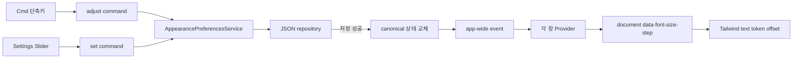

# 창 글꼴 크기 조정

## 범위

Agentic Workbench의 모든 WebView 창에서 읽을 수 있는 텍스트 크기를 `-2`, `-1`, `0`,
`+1`, `+2`의 다섯 단계로 조정한다. 단계 하나는 1px 오프셋이며 기본값은 `0`이다.

- `Cmd++` 또는 `Cmd+=`: 한 단계 크게
- `Cmd+-`: 한 단계 작게
- Settings > Appearance > 글꼴 크기: 원하는 절대 단계 선택
- `Cmd+,`: 기존 Settings 창 열기 동작 유지

글꼴 크기만 바뀌며 WebView zoom, 루트 글꼴 크기, spacing token, 아이콘과 이미지의
크기는 바뀌지 않는다. 다른 앱의 타이포그래피나 agent 실행 설정은 이 기능의 범위가
아니다.

## 동작 흐름



백엔드의 `AppearancePreferencesService`가 현재 값의 단일 권위다. 상대 변경과 절대 변경을
하나의 mutex 안에서 직렬화하며, JSON 저장이 성공한 뒤에만 메모리 값을 교체한다. 성공한
canonical 값은 `app://appearance-preferences-changed` 이벤트로 모든 창에 전달된다.

각 창의 Provider는 이벤트 listener를 먼저 등록한 뒤 현재 값을 조회한다. 초기 조회 중
이벤트가 오면 이벤트 값을 우선하므로 오래된 조회 응답이 최신 값을 덮지 않는다. 첫
dataset 적용 전에는 route child를 잠시 gate하고, 이후에는 dataset만 변경해 실행 session,
입력, 선택 상태를 재마운트하지 않는다.

## 저장과 복구

설정은 Tauri app-data의 `appearance-preferences.json`에 저장된다.

- 파일이 없으면 `{ "fontSizeStep": 0 }`을 만든다.
- 범위 밖 값은 `0`으로 정규화해 다시 쓴다.
- 현재 JSON이 깨졌으면 `.bak`을 먼저 복구한다.
- 현재 파일과 backup이 모두 깨졌으면 현재 파일을
  `appearance-preferences.corrupt-<timestamp>.json`으로 보존하고 기본 문서를 만든다.
- 실행 중 저장이 실패하면 기존 canonical 값과 화면 표시를 유지하고 Settings에 재시도
  가능한 오류를 표시한다.

## 구현 위치

- 순수 모델: `src-tauri/src/domain/appearance_preferences.rs`
- 저장 port와 adapter: `src-tauri/src/ports/appearance_preferences_repository.rs`,
  `src-tauri/src/infrastructure/json_appearance_preferences_repository.rs`
- application service: `src-tauri/src/application/appearance_preferences_service.rs`
- WebView 동기화: `src/app/providers/appearance-preferences-provider.tsx`
- 단축키: `src/features/font-size-adjustment/model/keyboard-shortcut.ts`
- Slider: `src/features/font-size-adjustment/ui/font-size-slider.tsx`
- typography token: `src/index.css`

## 검증

```bash
pnpm --filter @yoophi/agentic-workbench check-types
pnpm --filter @yoophi/agentic-workbench test
pnpm --filter @yoophi/agentic-workbench build-storybook
cargo test -p agentic-workbench
cargo check -p agentic-workbench
```

실행 앱에서는 `specs/035-adjust-font-size/quickstart.md`의 시나리오 A~D를 따른다. 특히
여러 session 창과 Settings를 동시에 열어 1초 이내 동기화, 재실행 첫 프레임, 입력 상태
유지, 다섯 단계의 clipping, 아이콘·이미지 크기 불변을 확인한다.
