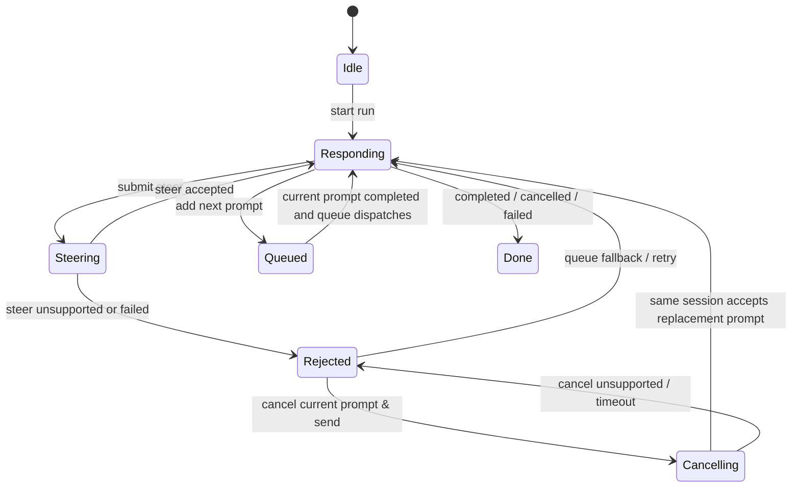

# AW Active-Turn Steer 설계

## 배경

GitHub issue #143은 Agentic Workbench의 기존 steer 동작이 사용자의 기대와 다르다는 점을 정리한다. 현재 UI의 steer 흐름은 실행 중인 run을 `cancelAgentRun`으로 종료한 뒤, 원래 prompt와 steering instruction을 합친 새 goal로 `startRun`을 호출한다. 따라서 사용자는 "현재 작업에 추가 지시를 넣었다"고 생각하지만 실제로는 기존 agent process와 run timeline이 끊긴다.

이번 기능의 목표는 steer, queue, cancel-and-send를 사용자 의미에 맞게 분리하는 것이다.

- steer: 현재 실행 중인 작업에 추가 입력을 주입한다.
- queue: 현재 작업이 끝난 뒤 다음 prompt로 실행한다.
- cancel-and-send: 현재 prompt request에 JSON-RPC cancel을 요청한 뒤 같은 ACP session에 steering prompt를 다시 보낸다.

## 현재 코드 기준선

- Frontend panel: `apps/agentic-workbench/src/features/agent-run/ui/agent-run-panel.tsx`
- Frontend state helpers: `apps/agentic-workbench/src/features/agent-run/model/run-panel-state.ts`
- Frontend repository: `apps/agentic-workbench/src/entities/agent-run/api/agent-run-repository.ts`
- Backend send prompt use case: `apps/agentic-workbench/src-tauri/src/application/send_prompt.rs`
- Backend cancel use case: `apps/agentic-workbench/src-tauri/src/application/cancel_agent_run.rs`
- Backend session port: `apps/agentic-workbench/src-tauri/src/ports/session_handle.rs`
- ACP adapter: `apps/agentic-workbench/src-tauri/src/infrastructure/acp/runner.rs`

## 조사 결과

기존 rejected steer fallback의 `Restart` 흐름은 같은 agent session에 새 prompt를 보내는 방식이 아니었다. 프론트엔드는 `cancelAgentRun(oldRunId)` 후 `startRun(nextGoal)`을 호출했고, 백엔드의 `AppState.cancel_run()`은 run slot을 제거한 뒤 `join_handle.abort()`를 호출했다. ACP runner의 abort 구현은 child process에 `start_kill()`을 호출하므로, AW 관점에서 이 동작은 현재 prompt만 취소하는 것이 아니라 현재 run과 agent process를 종료하는 동작이다.

ACP transport는 `agent-client-protocol` SDK의 `SentRequest` handle을 직접 사용하지 않고 자체 `RpcPeer` pending map으로 JSON-RPC request/response를 관리한다. 따라서 SDK의 `unstable_cancel_request` feature를 켜는 것만으로는 현재 prompt를 취소할 수 없다. AW transport에서 `session/prompt` request id를 저장하고 `$/cancel_request` notification을 직접 보내야 한다.

Claude Code ACP와 Codex ACP가 `$/cancel_request`를 실제 active turn 중단으로 처리하는지는 provider 구현에 달려 있다. provider가 cancel을 무시하거나 늦게 처리하면 AW는 일정 시간 동안 같은 session lock이 풀리기를 기다린 뒤 실패로 처리하고, 사용자는 queue 또는 명시적 full restart를 선택해야 한다.

## 목표 상태

## 구현 원칙

- `steer_prompt_to_run`은 `cancel_run`을 호출하지 않는다.
- provider가 active-turn steer를 지원하지 않으면 입력을 rejected steer로 보존한다.
- 현재 Claude Code ACP와 Codex ACP는 active-turn steer 주입 API를 제공하지 않으므로 unsupported로 응답한다. UI는 이를 전역 오류로 표시하지 않고 rejected steer fallback 카드로 보존한다. 실제 cancel-free steer는 provider adapter가 해당 capability를 노출할 때 `SessionHandle::steer_prompt` 구현으로 연결한다.
- rejected steer의 primary fallback은 `Cancel & send`이다. 이 흐름은 현재 `session/prompt` request id로 `$/cancel_request`를 보낸 뒤, 같은 `AcpSession`의 in-flight lock이 풀리면 합성 prompt를 `session/prompt`로 다시 보낸다.
- `Cancel & send`가 timeout 또는 provider 미지원으로 실패하면 rejected steer를 복원하고 사용자가 queue 또는 명시적 full restart를 선택할 수 있게 한다.
- queued prompt와 pending steer는 별도 목록으로 표시한다.
- `cancelAgentRun`은 여전히 명시적 run cancel, 패널 닫기, full restart 같은 run 종료 동작에만 사용한다.
- 늦게 도착한 이전 run event는 현재 run의 queue 또는 steer state를 지우면 안 된다.

## 완료 기준

- 지원 가능한 steer path에서 현재 run이 유지된다.
- unsupported steer path에서 입력이 사라지지 않는다.
- 사용자는 pending steer, rejected steer, queued prompt를 구분할 수 있다.
- quickstart의 정적 검증과 수동 시나리오가 통과한다.
