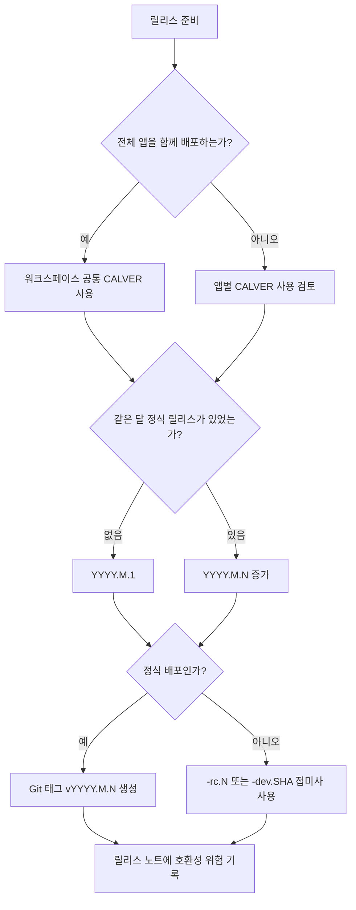

# CALVER 버전 관리 검토

## 배경

현재 프로젝트는 `Agentic Workbench`, `Git Explorer`, `Markdown Annotator`를 포함하는 모노레포이며, 루트 `package.json`, 각 앱의 `package.json`, Tauri 설정 파일의 버전이 모두 `0.1.0`으로 고정되어 있다.

최근 커밋 흐름을 보면 2026년 7월 1일부터 7월 11일까지 기능 추가, 버그 수정, 문서화, 릴리스 준비 작업이 짧은 간격으로 계속 누적되었다. 기능 브랜치도 번호 또는 이슈 단위로 운영되고 있어, 현재 단계에서는 "API 호환성 단계"보다 "언제 빌드된 앱인가"를 명확히 식별하는 가치가 크다.

## CALVER 적용이 잘 맞는 이유

- 설치된 앱의 빌드 시점을 빠르게 파악할 수 있다. 예를 들어 `2026.7.11` 버전은 해당 날짜 기준 산출물임을 바로 알 수 있다.
- 하루 또는 주 단위로 기능과 수정이 누적되는 현재 개발 속도와 잘 맞는다.
- 여러 앱을 같은 저장소에서 관리하므로, 전체 워크스페이스 릴리스 시점을 하나의 날짜 버전으로 묶기 쉽다.
- 사용자 지원 시 "어느 날짜 빌드에서 발생한 문제인가"를 기준으로 커밋 범위를 좁히기 쉽다.
- 아직 공개 API 안정성보다 데스크톱 앱 배포 식별성이 중요한 초기 제품 단계에 적합하다.

## 장점

### 릴리스 식별성 향상

`0.1.0`처럼 오래 유지되는 버전보다 `2026.7.1`, `2026.7.2` 같은 버전이 실제 설치 앱의 신선도를 더 명확히 보여준다.

### 빠른 개발 흐름과의 정합성

최근 커밋에는 `feat`, `fix`, `docs`, `chore`, `perf`, `refactor`가 짧은 기간에 섞여 있다. CALVER는 이런 흐름에서 매 릴리스를 의미 버전 증가 규칙에 억지로 맞추지 않아도 된다.

### 릴리스 브랜치 전략 단순화

현재 `release/0.1` 브랜치가 최신 `main`을 따라가고 있다. CALVER를 도입하면 `release/2026.07`처럼 월 단위 릴리스 브랜치를 쓰거나, 태그만으로 릴리스 이력을 관리하는 전략이 더 직관적일 수 있다.

### 모노레포 앱 배포에 유리

`Agentic Workbench`와 `Git Explorer`처럼 같은 릴리스 작업으로 빌드 및 설치되는 앱은 같은 CALVER를 공유하기 좋다. 다만 앱별 독립 릴리스가 필요해지면 앱별 버전 정책을 따로 정해야 한다.

## 단점

### 호환성 신호 약화

SemVer의 `MAJOR.MINOR.PATCH`는 깨지는 변경, 기능 추가, 패치의 의미를 어느 정도 전달한다. 반면 CALVER의 `2026.7.2`만으로는 변경 위험도를 알기 어렵다.

### 하루 여러 번 릴리스할 때 추가 규칙 필요

`YYYY.MM.DD`만 사용하면 같은 날 두 번 이상 정식 릴리스를 만들 때 충돌한다. 현재처럼 하루에 커밋이 여러 개 쌓이는 프로젝트에서는 이 문제가 실제로 발생할 가능성이 있다.

### 생태계 버전 제약 고려 필요

`package.json`, Cargo, Tauri, macOS 번들 버전은 SemVer 형태와 호환되는 숫자 버전을 쓰는 편이 안전하다. 따라서 `2026.07.11`처럼 앞자리에 `0`이 들어가는 형식은 도구별 해석을 확인해야 한다.

### 안정성 채널 표현 부족

날짜 버전만으로는 stable, rc, nightly, dev 빌드를 구분하기 어렵다. 사전 릴리스 접미사 또는 빌드 메타데이터 규칙이 필요하다.

## 권장 버전 형식

이 프로젝트에는 `YYYY.M.N` 형식을 권장한다.

- `YYYY`: 릴리스 연도
- `M`: 릴리스 월
- `N`: 해당 월의 정식 릴리스 순번

예시는 다음과 같다.

- `2026.7.1`: 2026년 7월 첫 번째 정식 릴리스
- `2026.7.2`: 2026년 7월 두 번째 정식 릴리스
- `2026.7.2-rc.1`: 두 번째 정식 릴리스 후보 1
- `2026.7.2-dev.0d93d2e`: 특정 커밋 기반 개발 빌드

`YYYY.M.DD`도 직관적이지만, 같은 날 여러 정식 릴리스를 만들 때 버전 충돌이 생긴다. 현재 커밋 밀도를 고려하면 월별 순번 방식이 더 안정적이다.

## 운영 제안

1. 루트 패키지, 앱 패키지, Tauri 설정의 버전을 같은 값으로 동기화한다.
2. 정식 배포 시 `v2026.7.1` 같은 Git 태그를 생성한다.
3. 릴리스 노트에는 호환성 위험도를 별도로 기록한다.
4. 앱별 독립 배포가 필요해지기 전까지는 모노레포 전체 버전을 공유한다.
5. 데이터 저장 포맷이나 플러그인 API가 생기면 별도 `schemaVersion` 또는 `compatibilityVersion`을 둔다.

## 의사결정 흐름

## 결론

현재 프로젝트는 빠른 기능 추가와 데스크톱 앱 설치 산출물 식별이 중요한 단계이므로 CALVER 도입 가치가 높다. 다만 CALVER만으로는 호환성 위험을 표현하기 어렵기 때문에, 릴리스 노트와 별도 호환성 버전 정책을 함께 운영하는 것이 좋다.
