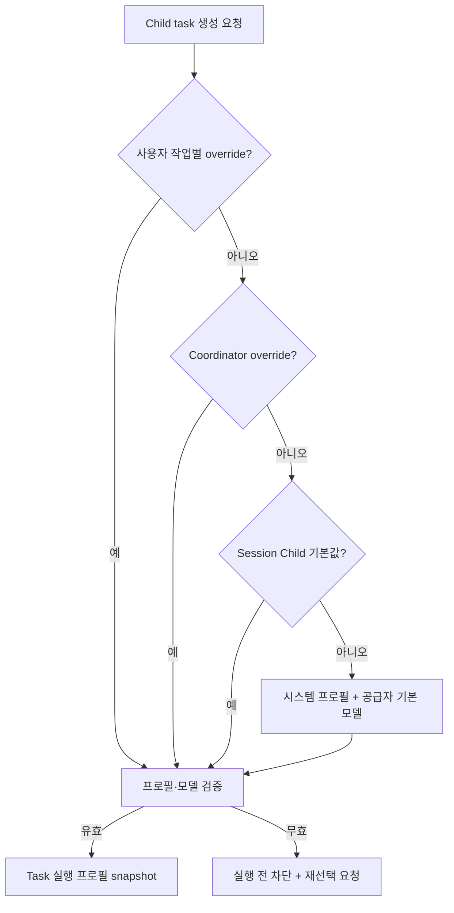
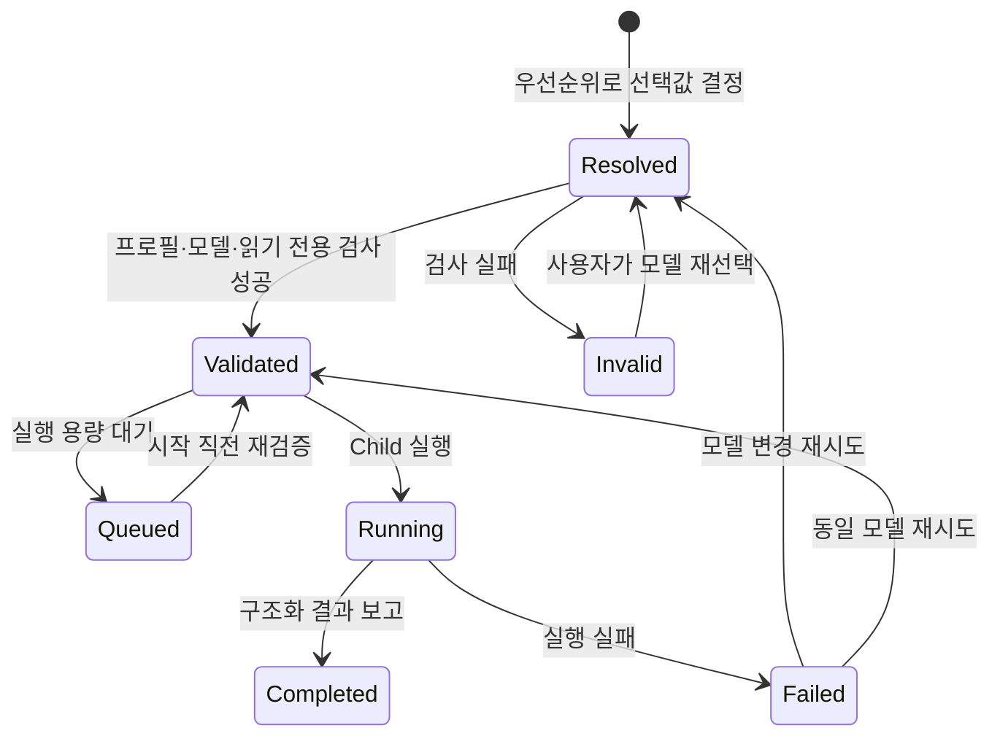

# Child Agent 모델 선택 기능 명세

**문서 상태**: Draft  
**작성일**: 2026-07-27  
**대상 앱**: Agentic Workbench  
**기능 이름**: Child Agent Model Selection

## 배경

현재 Main Coordinator가 생성하는 Child task는 기본적으로 `codex` agent profile을 사용하고,
모델 식별자는 지정하지 않는다. 따라서 실제 모델은 ACP 공급자의 기본값으로 결정된다.
도메인에는 Child 실행 프로필과 선택 모델을 표현할 필드가 있지만, 사용자가 기본 모델이나
작업별 모델을 선택하는 입력 경로와 검증 흐름은 연결되어 있지 않다.

이 상태에서는 사용자가 작업 성격에 따라 비용, 속도, 추론 품질을 조절할 수 없고, 실행 후에도
어떤 모델이 선택되었는지 명확히 확인하기 어렵다.

## 목표

- 사용자가 Worktree Session에서 새 Child task에 적용할 기본 에이전트 프로필과 모델을
  선택할 수 있게 한다.
- 필요한 경우 특정 Child task에 기본값과 다른 모델을 지정할 수 있게 한다.
- 실행 전에 선택값의 유효성과 읽기 전용 실행 호환성을 검증한다.
- 생성, 대기, 실행, 재시도, 재할당과 복구 과정에서 선택한 실행 프로필을 일관되게 유지한다.
- Activity Rail과 Child 패널에서 요청 모델과 실제 적용 모델을 확인할 수 있게 한다.

## 비목표

- Main Coordinator 자체의 실행 모델을 이 기능에서 변경하지 않는다.
- 실행 중인 Child run의 모델을 hot swap하지 않는다.
- 여러 모델에 같은 작업을 자동 복제하거나 결과 품질을 자동 비교하지 않는다.
- 모델 가격표, 사용료 예측 또는 비용 결제를 제공하지 않는다.
- 공급자가 광고하지 않은 임의 모델 식별자의 강제 실행을 허용하지 않는다.
- 첫 버전에서는 역할별 자동 모델 추천이나 성능 기반 자동 라우팅을 제공하지 않는다.

## 사용자 시나리오 및 테스트

### 사용자 스토리 1 — Child 기본 모델 선택 (P1)

사용자는 Worktree Session에서 Coordinator가 앞으로 생성할 Child task의 기본 에이전트
프로필과 모델을 선택한다. 이후 별도 override가 없는 Child는 해당 선택으로 실행된다.

**우선순위 이유**: 사용자가 Child의 비용과 품질을 통제할 수 있게 하는 최소 기능이다.

**독립 테스트**: 기본 프로필과 모델을 선택하고 Child task를 하나 생성하여, 실행 전 표시와
실제 실행 정보가 선택값과 일치하는지 확인한다.

**인수 시나리오**:

1. **Given** 선택 가능한 프로필과 모델이 존재할 때, **When** 사용자가 Child 기본 모델을
   저장하고 새 task를 위임하면, **Then** task는 저장된 프로필과 모델을 요청값으로 가진다.
2. **Given** 모델을 `공급자 기본값`으로 선택했을 때, **When** Child를 실행하면,
   **Then** 특정 모델 식별자를 강제하지 않으며 UI에 `공급자 기본값`으로 표시한다.
3. **Given** 기본값을 저장한 Worktree Session을 다시 열었을 때, **When** 설정을 확인하면,
   **Then** 마지막으로 저장한 Child 기본값이 복원된다.

---

### 사용자 스토리 2 — 작업별 모델 override (P1)

사용자는 특정 목표를 Coordinator에 위임할 때 해당 목표에서 생성되는 Child에 적용할
프로필과 모델을 지정할 수 있다. Coordinator도 Child task 생성 시 허용된 선택지 안에서
작업별 override를 명시할 수 있다.

**우선순위 이유**: 조사, 리뷰, 간단한 검사처럼 서로 다른 작업 특성에 하나의 모델만
사용하는 제약을 제거한다.

**독립 테스트**: Session 기본 모델과 다른 모델을 작업별로 선택한 뒤, 해당 task에만
override가 적용되고 다음 일반 task에는 기본값이 유지되는지 확인한다.

**인수 시나리오**:

1. **Given** Session 기본 모델이 설정되어 있을 때, **When** 사용자가 특정 위임에 다른
   모델을 지정하면, **Then** 해당 위임에서 생성된 Child에만 override가 적용된다.
2. **Given** Main Coordinator가 Child task를 생성할 때, **When** 허용된 프로필과 모델을
   명시하면, **Then** 시스템은 선택값을 검증한 뒤 task 실행 프로필로 고정한다.
3. **Given** Coordinator가 모델을 명시하지 않았을 때, **When** task가 생성되면,
   **Then** 해당 시점의 Session Child 기본값을 snapshot하여 사용한다.

---

### 사용자 스토리 3 — 모델 확인과 안전한 실패 (P2)

사용자는 task가 요청한 모델, 실제 적용된 모델과 선택 실패 사유를 Activity Rail에서
확인한다. 선택 모델을 사용할 수 없으면 시스템은 다른 모델로 조용히 대체하지 않는다.

**우선순위 이유**: 모델 선택 기능이 신뢰할 수 있으려면 실행 결과가 사용자 의도와
일치하는지 확인할 수 있어야 한다.

**독립 테스트**: 저장 후 제거된 모델로 task 실행을 시도하여, 프로세스가 시작되지 않고
해결 가능한 오류와 대체 선택 동작이 제공되는지 확인한다.

**인수 시나리오**:

1. **Given** Child가 실행 중이거나 완료되었을 때, **When** Activity Rail 또는 Child 패널을
   확인하면, **Then** agent profile과 요청 모델을 볼 수 있다.
2. **Given** 공급자가 실제 적용 모델을 보고했을 때, **When** 요청 모델과 다르면,
   **Then** 요청값과 실제값을 모두 표시하고 불일치를 알린다.
3. **Given** 선택 모델이 더 이상 제공되지 않을 때, **When** task 실행을 시도하면,
   **Then** 실행 전에 차단되고 사용자가 모델을 다시 선택할 수 있다.

---

### 사용자 스토리 4 — 재시도·재할당 시 모델 정책 유지 (P2)

사용자는 실패한 Child를 재시도하거나 다른 Child node에 재할당할 때 기존 모델을 유지하거나
명시적으로 새 모델을 선택한다.

**우선순위 이유**: 복구 과정에서 의도하지 않은 모델 변경과 결과 비교의 혼란을 방지한다.

**독립 테스트**: 실패 task를 기본 재시도한 경우와 모델 변경 재시도한 경우를 각각 실행하여
attempt별 선택 이력이 보존되는지 확인한다.

**인수 시나리오**:

1. **Given** Child task가 실패했을 때, **When** 모델을 변경하지 않고 재시도하면,
   **Then** 이전 attempt의 실행 프로필을 그대로 사용한다.
2. **Given** Child task가 실패 또는 차단되었을 때, **When** 사용자가 새 모델을 선택해
   재시도하면, **Then** 새 attempt에만 새 모델이 적용되고 이전 attempt 기록은 유지된다.
3. **Given** task를 다른 node에 재할당할 때, **When** 대상 프로필이 선택 모델을 지원하지
   않으면, **Then** 재할당은 실행 전에 거부되고 기존 task와 결과는 보존된다.

## 모델 선택 우선순위

모델과 agent profile은 task 생성 시 다음 순서로 결정한다.

1. 사용자가 해당 위임에 지정한 작업별 override
2. Coordinator가 Child 생성 요청에 명시한 허용된 작업별 override
3. Worktree Session에 저장된 Child 기본값
4. 시스템 기본 agent profile과 해당 공급자의 기본 모델

낮은 우선순위 값은 높은 우선순위 값이 없을 때만 사용한다. 최종 선택값은 task가 생성되는
시점에 snapshot한다. 이후 Session 기본값을 변경해도 이미 생성된 task의 모델은 바뀌지 않는다.

## 기능 요구사항

- **FR-001**: 시스템은 Worktree Session별 Child 기본 agent profile을 선택하고 저장할 수
  있어야 한다.
- **FR-002**: 시스템은 선택한 agent profile이 제공하는 모델 목록과 `공급자 기본값`을
  Child 기본 모델 선택지로 제공해야 한다.
- **FR-003**: 사용자는 Coordinator 위임 시 선택적으로 작업별 agent profile과 모델
  override를 지정할 수 있어야 한다.
- **FR-004**: Coordinator의 Child task 생성 인터페이스는 선택적으로 agent profile과
  model을 명시할 수 있어야 한다.
- **FR-005**: Coordinator가 지정할 수 있는 값은 해당 Worktree Session에서 사용자가
  허용한 프로필과 공급자가 광고하는 모델로 제한해야 한다.
- **FR-006**: 시스템은 `작업별 override → Session 기본값 → 시스템/공급자 기본값`
  우선순위를 결정적으로 적용해야 한다.
- **FR-007**: 시스템은 최종 선택된 실행 프로필을 task 생성 시 snapshot하고 task와 함께
  영속화해야 한다.
- **FR-008**: Session 기본값 변경은 이미 생성됐거나 실행 중인 task에 소급 적용하지
  않아야 한다.
- **FR-009**: 시스템은 Child 실행 전에 agent profile 존재 여부, 모델 지원 여부와 읽기
  전용 실행 지원 여부를 다시 검증해야 한다.
- **FR-010**: 선택값이 유효하지 않으면 시스템은 임의의 다른 모델로 fallback하지 않고,
  task를 실행 전 차단 상태로 전환하며 원인과 해결 방법을 제공해야 한다.
- **FR-011**: Activity Rail은 각 Child의 agent profile, 요청 모델, 실제 적용 모델을
  표시해야 한다. 실제 모델을 알 수 없으면 이를 명확히 표시해야 한다.
- **FR-012**: 재시도와 재할당은 기본적으로 기존 task의 실행 프로필을 유지해야 하며,
  사용자가 명시적으로 변경한 경우에만 새 attempt에 다른 값을 적용해야 한다.
- **FR-013**: 모델 변경 재시도는 이전 attempt의 프로필, 결과, 오류와 모델 정보를
  덮어쓰지 않아야 한다.
- **FR-014**: Main generation handoff와 앱 재시작 후에도 열린 task의 선택 모델과
  attempt별 이력이 보존되어야 한다.
- **FR-015**: 다른 Worktree Session이나 권한 없는 Child는 Session 기본 모델 및 다른
  task의 실행 프로필을 변경할 수 없어야 한다.
- **FR-016**: 사용자가 보는 모델명과 내부 식별자가 다를 경우 둘을 구분해 저장하고,
  실행에는 안정적인 식별자를 사용해야 한다.
- **FR-017**: 모델 목록을 불러오지 못한 경우 기존의 유효한 저장값을 표시할 수는 있지만,
  검증되지 않은 새 모델을 선택하거나 실행해서는 안 된다.
- **FR-018**: 모델 선택과 검증 실패는 task 이벤트와 감사 가능한 상태 이력에 남아야 한다.

## 주요 엔티티

### Child Runtime Preference

Worktree Session의 신규 Child에 적용할 기본값이다.

- agent profile
- 모델 선택: 특정 모델 또는 공급자 기본값
- 사용자가 허용한 모델 범위
- 마지막 갱신 시각

### Task Runtime Selection

task 생성 시 확정된 실행 선택이다.

- 선택 출처: 사용자 override, Coordinator override, Session 기본값, 시스템 기본값
- agent profile
- 공급자
- 요청 모델
- 접근 정책
- 검증 상태와 실패 사유

### Child Run Attempt

한 번의 실제 실행과 모델 적용 결과를 나타낸다.

- attempt 번호
- 요청 실행 선택
- 공급자가 보고한 실제 모델
- 시작 및 종료 시각
- 실행 결과와 모델 불일치 여부

## UI 요구사항

### Session Child 기본값

- Worktree Session의 통합 Composer 주변에서 Child 기본 프로필과 모델을 확인할 수 있어야 한다.
- 기본 설정 변경은 명시적 저장 동작을 사용한다.
- agent profile을 변경하면 모델 선택지는 해당 프로필 기준으로 갱신된다.
- 저장된 모델이 새 프로필에 없으면 자동 선택하지 않고 사용자에게 재선택을 요구한다.

### 위임별 override

- `Main 위임` 모드에서 선택 가능한 고급 실행 설정으로 제공한다.
- 기본 상태에서는 Session Child 기본값을 요약해 보여 주고, 사용자가 펼쳐서 override할
  수 있게 한다.
- override는 현재 위임에만 적용된다는 점을 표시한다.

### Activity Rail과 패널

- 최소 표시값은 `프로필 · 요청 모델`이다.
- 공급자 기본값이면 특정 모델명처럼 보이지 않게 `공급자 기본값`으로 표시한다.
- 실제 적용 모델을 공급자가 보고한 경우 요청값 옆에 표시한다.
- 모델 오류가 발생하면 재선택 후 재시도할 수 있는 동작을 제공한다.

## 오류 및 경계 조건

- 저장된 모델이 catalog에서 제거되거나 이름이 변경된 경우
- 모델 catalog를 불러오지 못했으나 이전 선택값이 남아 있는 경우
- agent profile은 존재하지만 모델 목록을 제공하지 않는 경우
- 특정 모델이 읽기 전용 모드나 현재 인증 상태를 지원하지 않는 경우
- task가 FIFO queue에서 기다리는 동안 모델 제공 상태가 변경된 경우
- 동일 요청 ID로 서로 다른 모델을 지정한 중복 요청이 들어오는 경우
- 재시도 요청과 취소 요청이 동시에 도착하는 경우
- Main handoff 중 이전 Coordinator가 모델 변경을 시도하는 경우
- 공급자가 요청 모델과 다른 실제 모델을 적용하거나 실제 모델을 보고하지 않는 경우

## 상태 및 흐름

## 아키텍처 정렬

- **모노레포 경계**: 기능은 AW에 한정한다. 두 번째 소비자가 생기기 전에는 공유
  package나 crate로 추출하지 않는다.
- **프론트엔드 계층**: 화면 조합은 `app/pages`, 모델 선택과 재시도 상호작용은
  `features`, 실행 프로필 타입·검증 결과·저장 API adapter는 `entities`, 범용 UI primitive는
  `components/ui`에 둔다.
- **백엔드 경계**: 선택 우선순위와 유효성 규칙은 domain/application이 소유하고,
  inbound는 입력 검증 후 use case에 위임한다. catalog, ACP launch와 JSON 저장은
  infrastructure adapter가 담당한다.
- **영속성과 안전**: Session과 task owner scope, Coordinator generation, revision,
  idempotency를 검증한다. 모델 변경은 실행 중 run에 소급하지 않는다.
- **공유 코어와 UI**: 현재는 AW 전용 순수 모델을 우선한다. 재사용 가능한 선택 UI는
  Storybook에 loading, empty, unavailable, long-name 상태를 등록한다.
- **문서화**: 구현 시 본 문서와 `docs/agent-orchestration-workspace.md`의 실행 프로필 및
  복구 설명을 동기화한다.

## 구현 단계

### 1단계 — 도메인과 저장 계약

- Session Child 기본값, task runtime selection과 attempt별 실제 모델을 정의한다.
- 선택 우선순위, snapshot, 재시도와 handoff 불변식을 테스트한다.
- 기존 저장 데이터에는 `codex + 공급자 기본값`을 적용하는 하위 호환 마이그레이션을
  정의한다.

### 2단계 — 모델 검색과 실행 전 검증

- agent catalog의 프로필·모델 정보를 Child 선택 후보로 제공한다.
- task 생성 시와 queue에서 실제 실행 직전에 검증한다.
- 선택 모델을 Child launch 요청까지 전달하고 실제 적용 모델 보고를 수집한다.

### 3단계 — 사용자 설정과 작업별 override

- Session Child 기본 선택 UI를 추가한다.
- `Main 위임` Composer에 작업별 override를 추가한다.
- Coordinator가 사용할 수 있는 모델 선택 범위를 사용자 설정과 일치시킨다.

### 4단계 — 관찰과 복구

- Activity Rail과 Child 패널에 요청/실제 모델을 표시한다.
- 모델 재선택 후 재시도, 재할당, Main handoff와 앱 재시작 복구를 연결한다.
- unavailable, mismatch와 catalog loading failure 상태를 Storybook과 통합 테스트로 검증한다.

## 검증 계획

- 선택 우선순위, snapshot, idempotency와 attempt 이력을 순수 단위 테스트로 검증한다.
- 다른 window/run/generation에서의 모델 변경 거부를 backend 테스트로 검증한다.
- catalog에서 사라진 모델과 읽기 전용 미지원 profile의 실행 전 차단을 검증한다.
- 특정 모델 선택이 Child 실행 요청까지 전달되는 통합 테스트를 추가한다.
- Composer override와 Activity Rail 재선택 흐름을 UI 테스트로 검증한다.
- 기존 provider-default Child 실행, 패널 승격/분리, 취소/재시도와 결과 수집 회귀 테스트를
  유지한다.
- 관련 AW TypeScript typecheck/test와 Tauri Rust test/check를 통과시킨다.

## 성공 기준

- **SC-001**: 사용자는 Worktree Session에서 Child 기본 profile과 모델을 30초 이내에
  선택하고 저장할 수 있다.
- **SC-002**: 자동화된 검증에서 신규 Child task의 100%가 정의된 우선순위와 동일한
  실행 선택을 갖는다.
- **SC-003**: 특정 모델을 선택한 task의 100%가 실행 전에 유효성 검사를 거치며,
  unavailable 모델이 다른 모델로 조용히 대체되는 사례가 없다.
- **SC-004**: 재시도, 재할당, Main handoff와 앱 재시작 후에도 task 및 attempt별 모델
  이력이 100% 보존된다.
- **SC-005**: 사용자는 실행 중·완료·실패한 Child의 요청 모델을 두 번 이하의 UI 동작으로
  확인할 수 있다.
- **SC-006**: 기존 모델을 지정하지 않는 Child task와 패널 기반 agent-run의 자동 테스트가
  모두 회귀 없이 통과한다.

## 완료 기준

- Session 기본값과 작업별 override가 모두 실제 Child launch에 반영된다.
- 모델 검증 실패가 실행 전 typed error와 해결 가능한 UI 상태로 나타난다.
- Activity Rail에서 요청 모델과 확인 가능한 실제 모델을 구분해 볼 수 있다.
- 재시도, 재할당, handoff와 복구 과정에서 선택 이력이 유지된다.
- 다른 window, stale Coordinator와 Child의 권한 없는 변경이 거부된다.
- 저장 마이그레이션, 도메인, backend, UI, 통합 및 회귀 테스트가 통과한다.

## 가정

- 모델 후보는 기존 agent catalog가 제공하는 정보를 신뢰 가능한 기준으로 사용한다.
- 모델 목록을 제공하지 않는 프로필은 `공급자 기본값`만 선택할 수 있다.
- 첫 버전의 자동 Child는 기존과 같이 읽기 전용으로 실행한다.
- Session 기본값은 Worktree Session 단위이며 프로젝트 전체나 전역 기본값은 후속 범위다.
- Coordinator는 사용자가 허용한 범위 안에서만 작업별 모델을 선택할 수 있다.
- 실제 적용 모델은 공급자가 보고하는 경우에만 확정할 수 있다.

