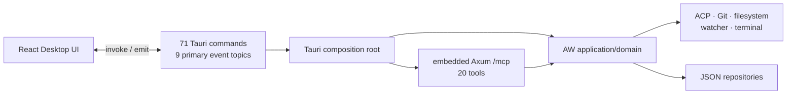
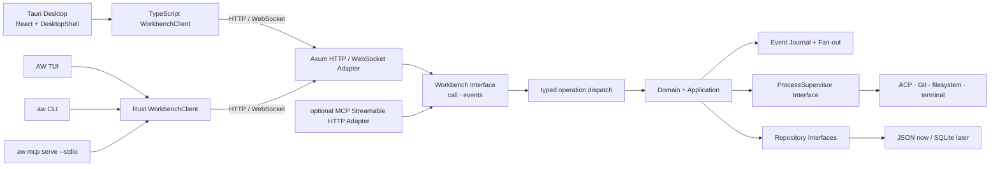
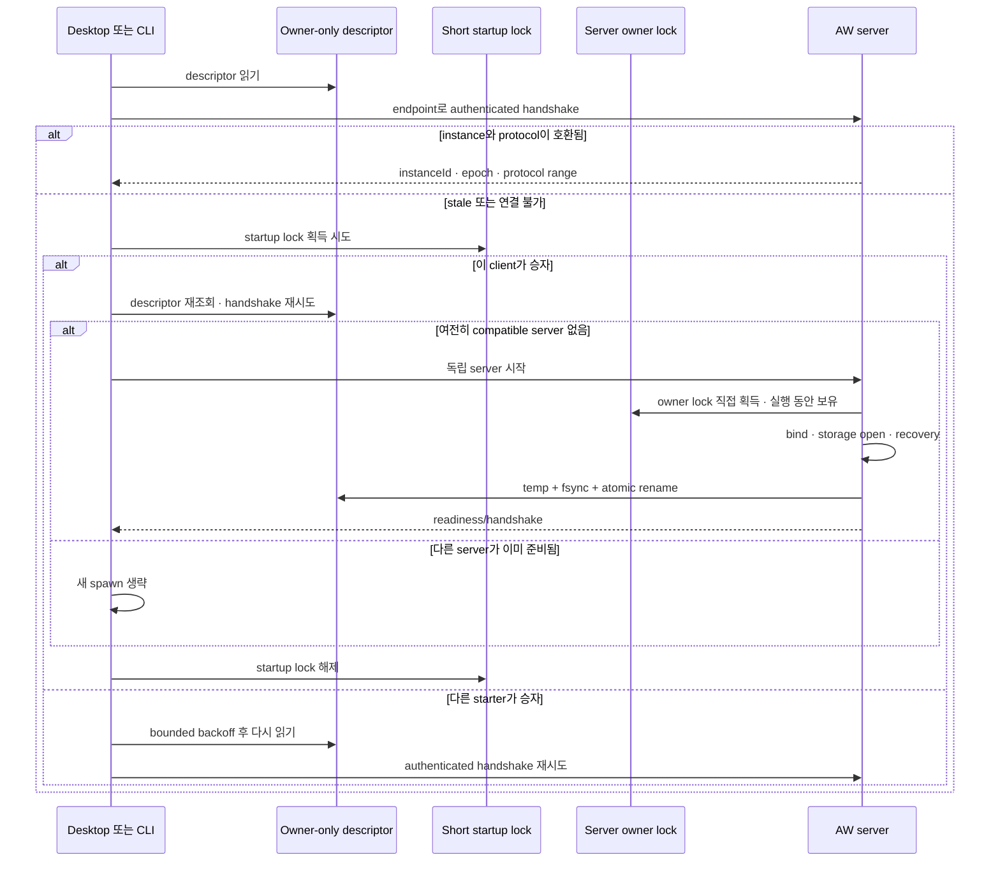

# Agentic Workbench 서버-클라이언트 전환 조사와 마이그레이션 제안

> 조사 기준일: 2026-08-18
> 범위: Agentic Workbench(AW)의 Tauri 기반 단일 데스크톱 앱 구조를 독립 서버 + 데스크톱/TUI/CLI 클라이언트 구조로 전환하고, 에이전트가 호출할 수 있는 CLI 및 MCP Interface를 제공하는 방안
> 재점검: 같은 날짜의 공식 Tauri·MCP·OpenAPI 자료와 현재 저장소를 다시 대조하고 독립 비판 검토를 거쳐 daemon 생명주기, 저장 내구성, event race, process containment, agent 권한, 업데이트·배포, loopback 보안, 계약 생성의 누락을 보완했다.

## 결론

권장 구조는 **로컬 우선 독립 AW 서버**다. 서버가 프로젝트·Git·파일 감시·ACP 에이전트·터미널 등 네이티브 프로세스와 영속 상태를 단독 소유하고, 데스크톱·TUI·CLI는 HTTP 요청과 클라이언트당 하나의 WebSocket 이벤트 스트림만 사용한다. Tauri는 서버의 배포·부트스트랩과 창·메뉴·다이얼로그 같은 데스크톱 고유 기능만 맡는다.

한 번에 71개 Tauri command를 HTTP로 치환하면 위험하다. 현재 `domain`·`application`·`ports`가 이미 Tauri에서 대체로 분리되어 있다는 장점을 이용해, 먼저 작은 `Workbench` Interface 뒤로 기존 Implementation을 모은다. 그다음 기존 Tauri Adapter와 새 HTTP/WebSocket Adapter를 한동안 함께 운영하면서 기능별로 클라이언트를 전환해야 한다.

핵심 권고는 다음과 같다.

1. 서버의 외부 Seam은 HTTP/WebSocket 자체가 아니라 typed `call`·`events` 두 동작의 깊은 `Workbench` Module로 둔다. 기능 목록은 별도 추상화가 아니라 `system.describe` read operation으로 조회한다.
2. HTTP는 명령·조회·스냅샷, WebSocket은 순서가 있는 이벤트와 재연결 후 replay에만 사용한다. 연결 끊김은 실행 취소를 뜻하지 않는다.
3. 브라우저 WebSocket 인증에는 장기 bearer token을 URL에 넣지 않고, 인증된 HTTP 요청으로 단발성·단기 WS ticket을 발급한다.
4. Rust `workbench-protocol`의 typed operation registry를 계약의 기준으로 삼고 HTTP용 OpenAPI 3.1, TypeScript `OperationMap`, event용 JSON Schema를 함께 생성한다. generic `/v1/calls`의 request/output 상관 타입은 OpenAPI client generation만으로 보장되지 않으므로 generated typed facade를 둔다. AsyncAPI는 외부 공개가 필요해질 때 추가한다.
5. CLI는 유한 명령의 안정적인 JSON 출력과 스트리밍 출력 계약을 제공한다. `aw mcp serve --stdio`는 같은 서버 클라이언트 위에 얹는 별도 MCP Adapter로 만든다.
6. 현재 손으로 구현한 MCP 프로토콜은 확장하지 말고 공식 Rust SDK `rmcp` Adapter로 교체한다. 다만 AW 서버 분리와 MCP protocol revision 변경은 같은 milestone로 묶지 않는다. 2026-08-18 현재 `rmcp` 3.1.3은 `2025-11-25`와 `2026-07-28` 날짜 버전의 공식 conformance suite를 모두 100% 통과한다. 남은 gate는 SDK 완성도가 아니라 AW가 실제 지원할 host 조합과 dual-era 동작이다.
7. `externalBin`은 바이너리를 번들에 넣는 기능이지 독립 daemon 생명주기를 제공하는 기능이 아니다. Tauri shell plugin의 frontend/IPC `spawn`이 추적하는 child는 앱 `Exit` 때 종료되고, Rust `ShellExt::sidecar().spawn()`은 반대로 daemon 관리 기능을 제공하지 않는다. 데스크톱 종료 뒤에도 서버를 유지하려면 서버 고유의 single-instance·discovery·upgrade owner를 둬야 한다.

재점검에서 설계 방향을 뒤집을 문제는 찾지 못했지만, 첫 mutation을 HTTP로 전환하기 전에 해결해야 할 누락은 확인했다.

| 심각도 | 새로 확인한 누락 | 이 문서에 반영한 결정 |
|---|---|---|
| P0 | JSON 상태·event·멱등성 결과를 원자적으로 commit할 수 없음 | read-only 전환은 JSON으로 시작하되 mutation 전에는 shared `StorageCoordinator`와 durable operation ledger를 만들고, 다중 문서·outbox가 필요한 기능은 SQLite/WAL을 앞당긴다. |
| P0 | replay high-water 측정과 live 구독 등록 사이 event 유실 가능 | receiver 등록·high-water capture·replay·buffer drain을 하나의 subscription coordinator가 수행한다. |
| P0 | 자식 handle 취소와 실제 process tree 종료가 같지 않음 | Unix process group, Windows Job Object 등 containment와 `cancelRequested` → reap 확인 → `cancelled` 상태 전이를 release gate로 둔다. |
| P0 | agent CLI/MCP가 사람 승인을 대리할 가능성 | agent capability와 human principal을 분리하고, 위험 동작은 사람이 발급한 단기 confirmation grant와 durable audit를 요구한다. |
| P1 | daemon starter와 server lifetime lock의 인계, 임시 bundle 경로 | startup lock과 server-owned lifetime lock을 분리하고, 필요 target은 서명된 server를 versioned per-user 실행 경로로 materialize한다. |
| P1 | path canonicalize 뒤 symlink swap, WebView token 탈취, protocol 선택 규칙 | handle-relative filesystem access, 짧은 WebView token, 명시적 protocol negotiation을 추가한다. |
| P1 | 운영·복구 기준 부족 | log/diagnostics/backup, disk-full, stale descriptor, update rollback, target build·installed artifact test를 완료 조건에 넣는다. |

## 현재 상태

### 이미 분리되어 있어 재사용할 수 있는 부분

- AW의 Rust `domain`·`application`·`ports` 디렉터리에는 실질적인 Tauri 타입 의존이 없다. Tauri 결합은 주로 [조립부 `lib.rs`](../apps/agentic-workbench/src-tauri/src/lib.rs), [2,084줄의 `tauri_commands.rs`](../apps/agentic-workbench/src-tauri/src/inbound/tauri_commands.rs), `infrastructure`의 window/event Adapter에 몰려 있다. 즉 핵심 로직을 다시 작성하기보다 조립 위치와 inbound/outbound Adapter를 바꾸는 추출이 가능하다.
- [공유 `acp-agent-core`](../crates/acp-agent-core/src/lib.rs)는 이미 실행 domain, application, ports와 ACP process Implementation을 Tauri에서 떼어냈다. 서버가 이 crate를 그대로 소비하는 것이 자연스럽다.
- [현재 ACP runner](../crates/acp-agent-core/src/infrastructure/acp/runner.rs)는 `tokio::process::Command`, piped stdio, 출력 크기 제한, `kill_on_drop(true)`, 종료 대기를 이미 사용한다. 서버의 `ProcessSupervisor` Module로 흡수할 기반이지만, process tree containment와 server crash 이후 orphan 정리는 아직 제공하지 않는다.
- [현재 runtime event journal](../apps/agentic-workbench/src-tauri/src/infrastructure/in_memory_runtime_event_journal.rs)은 run별 증가 sequence, 512개 retention, `gap_detected`, terminal 상태를 이미 제공한다. 다만 제한은 **run별 event 수**일 뿐 전체 run 수·payload byte는 제한하지 않고, production에서 `remove`도 호출하지 않아 전역 메모리는 bounded가 아니다. 개념은 공통 envelope로 승격하되 구현은 그대로 재사용하면 안 된다.

### 현재 Tauri 결합과 전환 대상

- [Tauri 조립부](../apps/agentic-workbench/src-tauri/src/lib.rs)는 71개의 `#[tauri::command]`를 등록하고, `AppState`, agent workspace registry, runtime journal, watcher, MCP server를 WebView/창 생명주기와 함께 소유한다.
- AW 프런트엔드의 production TypeScript 파일 19개와 공유 [`packages/agent-client`](../packages/agent-client/src/repository.ts)가 Tauri `invoke` 또는 `listen`을 직접 import한다. 이 패키지는 이름과 달리 Tauri 전용이며 Hushline·Ask Code에서도 사용하므로, AW의 전체 network contract를 여기에 덮어쓰지 말고 새 `workbench-client`를 만드는 편이 안전하다.
- [run event sink](../apps/agentic-workbench/src-tauri/src/infrastructure/tauri_run_event_sink.rs), [orchestration event sink](../apps/agentic-workbench/src-tauri/src/infrastructure/tauri_orchestration_event_sink.rs), [agent exchange registry](../apps/agentic-workbench/src-tauri/src/infrastructure/in_memory_agent_workspace_registry.rs)는 `window_label`과 `AppHandle`에 묶여 있고, Tauri event 외에 `window.eval(CustomEvent(...))` fallback도 발행한다.
- primary event topic은 run 1, orchestration 3, exchange 2, worktree/appearance/MCP title 각 1개로 총 9개다. run journal은 authoritative sequence를 만들지만 live Tauri event에는 그 sequence를 싣지 않고, [`agent-run-runtime-host.tsx`](../apps/agentic-workbench/src/features/agent-run/ui/agent-run-runtime-host.tsx)가 `lastSequence + 1`을 추정한다. network reconnect에서는 누락·중복을 판별할 수 없으므로 live와 replay가 같은 envelope를 써야 한다.
- 세션 창이 파괴되면 그 창이 소유한 run을 취소한다. 다중 클라이언트 구조에서는 데스크톱 연결 종료가 서버 작업 종료를 뜻하면 안 된다. run 소유권을 서버의 workspace/session으로 옮기고 취소는 명시적 command 또는 정책화된 lease 만료로 처리해야 한다.
- `window_label`은 event delivery에만 있는 값이 아니라 orchestration domain, worker binding, `SessionRegistry` owner까지 침투해 있다. transport 교체보다 이 identity를 `workspace_id`·`run_id`·`client_instance_id`로 분해하는 일이 더 큰 migration이다.
- 외관 설정, 창 위치·크기, workspace panel layout, `open_*_window`, 외부 URL 열기는 서버 domain이 아니라 데스크톱 presentation 상태다. 반면 프로젝트, Git, worktree 파일, 목표, agent run, permission, orchestration, provider session, watcher는 서버로 옮겨야 한다.
- Tauri command 71개 중 54개 signature가 `AppHandle`, `Window`, `State` 중 하나에 직접 결합한다. inbound command는 대부분 `Result<_, String>`으로 오류를 평탄화해 transport가 바뀌면 안정적인 error code를 제공할 수 없다.
- generated [OpenWiki AW 문서](../openwiki/agentic-workbench.md)는 아직 `~40개` command로 설명해 실제 71개와 차이가 있다. baseline inventory를 source-of-truth로 만들고 OpenWiki는 원본 코드·문서 변경 뒤 자동 재생성해야 한다.
- 현재 JSON repository의 mutation은 대체로 `load -> mutate -> save`이며 aggregate revision이나 shared lock이 없다. HTTP 동시 요청과 여러 client가 생기면 lost update가 발생할 수 있으므로 서버를 유일한 writer로 만들고 aggregate별 직렬화 또는 optimistic revision을 도입해야 한다. read-only slice는 저장 형식을 유지할 수 있지만 다중 문서·event outbox·외부 side effect를 원자화해야 하는 mutation은 SQLite/WAL 도입을 transport 전환보다 앞당긴다.
- single-writer **process**도 그 내부의 병렬 HTTP handler를 직렬화하지 않는다. 현재 JSON helper는 store별 고정 `.tmp` 파일을 쓰고 Windows에서는 기존 파일을 삭제한 뒤 rename하며, [ACP session store](../apps/agentic-workbench/src-tauri/src/infrastructure/json_acp_session_store.rs)는 공통 atomic helper를 사용하지 않는다. read/check/mutate/write 전체를 공유 lock/CAS 경계에 넣지 않으면 같은 server 안에서도 update가 사라질 수 있다.
- [현재 permission broker](../crates/acp-agent-core/src/infrastructure/permission_broker.rs)는 waiter가 memory에만 있고, [permission flow](../crates/acp-agent-core/src/infrastructure/acp/permission_flow.rs)는 timeout 없이 응답을 기다린다. 승인 담당 client가 사라졌을 때 deny·handoff·timeout 중 무엇을 할지 server policy가 필요하다.
- [현재 terminal manager](../crates/acp-agent-core/src/infrastructure/acp/terminal.rs)는 `kill_on_drop`이나 process group 없이 child handle을 보관하며 `release`는 reader task와 handle만 drop한다. Windows에서는 Unix `SIGTERM` 분기가 실행되지 않아도 성공 event를 낼 수 있다. run cancel도 join handle abort와 실제 descendant 종료/reap을 구분하지 않는다.
- [`acp-agent-core`의 PATH 보강 코드](../crates/acp-agent-core/src/infrastructure/acp/util.rs)는 `:` separator, `/`, `SHELL`, Unix permission bit를 전제하고, [agent catalog](../crates/acp-agent-core/src/infrastructure/agent_catalog.rs)는 외부 `curl` executable에도 의존한다. 서버 binary를 Windows/Linux로 배포하려면 UI packaging보다 먼저 native crate의 target compile, HTTP client 대체, process semantics audit가 필요하다.
- Rust [`AgentRunRequest`](../crates/acp-agent-core/src/domain/run.rs)와 TypeScript [`AgentRunRequest`](../packages/agent-client/src/types.ts)는 이미 필드가 어긋나 있다. wire DTO와 schema 생성을 한곳에 두지 않으면 데스크톱·TUI·CLI가 추가될수록 contract drift가 커진다.
- 현재 [`tauri.conf.json`](../apps/agentic-workbench/src-tauri/tauri.conf.json)에는 `externalBin`, CSP, updater artifact 설정이 없고, [`Cargo.toml`](../apps/agentic-workbench/src-tauri/Cargo.toml)에도 shell·updater·single-instance plugin이 없다. 현재 릴리스 기준도 [Apple Silicon macOS DMG 우선](first-release-plan.md)이며 updater는 준비되지 않았다. GitHub Actions에도 OpenWiki 갱신 외 release/signing/updater workflow가 없다. 따라서 5단계의 sidecar/daemon은 기존 배포 기능을 단순히 켜는 일이 아니라 서명·업데이트·플랫폼 행렬까지 새로 만드는 작업이다.

### 현재 구조

Tauri가 내부적으로 core process와 WebView process를 분리하더라도, 현재 제품 구조에서는 Tauri core가 유일한 composition root이자 business/native runtime이다. WebView 이외의 TUI·CLI가 재사용할 독립 서버 경계는 없다. [Tauri process model](https://v2.tauri.app/concept/process-model/)과 [Tauri IPC](https://v2.tauri.app/concept/inter-process-communication/)도 core만 운영체제 접근 권한을 가지고 command/event message passing으로 WebView와 통신한다고 설명한다.



### 이미 존재하는 HTTP 조각과 한계

[현재 MCP Module](../apps/agentic-workbench/src-tauri/src/infrastructure/mcp/mod.rs)은 이미 다음을 수행한다.

- `127.0.0.1:0`에 Axum listener를 열고 `/mcp`를 제공한다.
- run별 capability token을 발급하고 Bearer 인증을 적용한다.
- MCP tool을 application 로직과 연결한다.

따라서 Axum/Tokio 채택 여부는 사실상 결정되어 있다. 다만 이 Module은 `AppHandle`, WebView window, Tauri event sink에 직접 의존하며 일반 AW 기능을 제공하지 않는다. 또한 [protocol.rs](../apps/agentic-workbench/src-tauri/src/infrastructure/mcp/protocol.rs)는 MCP 버전을 `2025-11-25`로 고정하고 `initialize`, `tools/list`, `tools/call` 일부만 직접 구현한다. `notifications/initialized`, 버전 협상, 최신 discovery/subscription, 표준 transport 동작을 계속 손으로 따라가는 것은 Locality가 낮다.

보안상 바로 고쳐야 할 선례도 있다. [현재 `origin_allowed`](../apps/agentic-workbench/src-tauri/src/infrastructure/mcp/title_tool.rs)는 문자열 prefix로 origin을 허용하므로 `http://localhost.evil.example` 같은 값도 통과할 수 있다. 새 서버에서는 URL을 파싱해 scheme·host·port가 등록된 origin과 정확히 일치하는지 검사해야 한다.

### 기능 배치 제안

현재 71개 command를 감사한 분류는 데이터·설정 20개, Git·파일 16개, catalog·native shell·run 13개, agent exchange 4개, orchestration 18개다. 이를 그대로 route 수로 고정하지 않고 아래 소유권 기준으로 재구성한다.

| 현재 기능 | 목표 위치 | 이유 |
|---|---|---|
| 프로젝트, saved prompt, goal, agent 설정 | 서버 | 모든 클라이언트가 공유하는 지속 상태 |
| Git/worktree/file 읽기·쓰기·감시 | 서버 | 서버 파일시스템과 네이티브 프로세스의 단일 소유권 |
| ACP run, permission, terminal, orchestration, exchange | 서버 | 장기 작업, 자식 프로세스, 재연결이 필요한 상태 |
| run/orchestration/worktree change 이벤트 | 서버 event stream | 데스크톱 외 TUI/CLI도 같은 순서·replay 계약을 사용 |
| 창 생성/포커스/제목/메뉴/외부 URL/다이얼로그 | Tauri 데스크톱 셸 | 서버가 native window를 알지 않게 유지 |
| 글꼴, 창 bounds, panel layout | 클라이언트별 presentation 저장소 | TUI·CLI와 공유할 domain 상태가 아님 |
| 창 제목 변경 MCP tool | 서버의 `presentation.intent` 이벤트 | desktop은 적용, TUI는 title 표시, headless CLI는 무시 가능 |

## 공식 자료에서 확인한 구현 제약

### Axum, Tokio, tower-http

- Axum은 `Router::with_state`로 모든 handler가 공유하는 전역 state를 제공한다. 공식 문서는 request에서 파생되는 인증 정보는 global state가 아니라 request extension에 넣으라고 명시한다. 따라서 `Arc<ServerRuntime>`는 `State`, 검증된 `Principal`은 인증 middleware가 삽입한 `Extension`으로 분리한다. 서로 다른 router를 합칠 때 state type을 맞춰야 한다. [Axum `Router` 공식 문서](https://docs.rs/axum/latest/axum/struct.Router.html)
- Axum WebSocket은 `WebSocketUpgrade::on_upgrade`로 연결을 넘기고, 읽기와 쓰기를 동시에 처리할 때 stream을 split할 수 있다. `max_frame_size`, `max_message_size`, write buffer도 제한할 수 있다. [Axum WebSocket 공식 문서](https://docs.rs/axum/latest/axum/extract/ws/)
- Tokio process는 `Child` handle을 drop해도 기본적으로 자식이 계속 실행되며, Unix에서는 종료된 자식을 wait하지 않으면 zombie가 될 수 있다고 경고한다. 따라서 서버의 process supervisor는 `kill_on_drop`, 정상 종료 신호, 강제 종료, 최종 `wait`를 한곳에서 보장해야 한다. [Tokio `process::Command` 공식 문서](https://docs.rs/tokio/latest/tokio/process/struct.Command.html)
- `CorsLayer::new()`는 기본적으로 아무 CORS header도 보내지 않으며, 브라우저 접근에는 허용 origin을 지정해야 한다. `permissive()`는 origin·method·header를 모두 허용하므로 사용하지 않고 정확한 Tauri production/dev origin 목록만 등록한다. [tower-http `CorsLayer` 공식 문서](https://docs.rs/tower-http/latest/tower_http/cors/struct.CorsLayer.html)
- `TraceLayer`는 request/response/failure/stream 종료를 tracing span에 연결한다. request ID, operation ID, actor kind, latency만 기록하고 bearer token, agent env, prompt 원문은 redact해야 한다. [tower-http `TraceLayer` 공식 문서](https://docs.rs/tower-http/latest/tower_http/trace/struct.TraceLayer.html)

현재 Cargo는 Axum 0.7, tower-http 0.5, Tokio 1.48에 고정되어 있고 최신 공식 문서는 각각 더 새 버전을 설명한다. 추출과 major dependency upgrade를 같은 변경에 섞지 말고, 먼저 현재 version line에서 동작 parity를 만든 뒤 별도 단계에서 호환 matrix를 검증하는 편이 안전하다. WebSocket을 쓸 때는 Axum의 `ws`, tower-http의 `cors`·`trace` feature를 명시적으로 켜야 한다.

### Tauri sidecar, 앱 생명주기, updater, origin, CSP

- Tauri v2는 `bundle.externalBin`으로 외부 실행 파일을 함께 배포하고 이를 sidecar라고 부른다. 상대 경로는 `tauri.conf.json` 기준이며, 지원 target마다 같은 이름에 `-$TARGET_TRIPLE`을 붙인 실행 파일이 필요하다. 예를 들어 Apple Silicon은 `aarch64-apple-darwin`, Linux x64는 `x86_64-unknown-linux-gnu`다. Rust에서는 shell plugin의 `sidecar(...).spawn()`으로 실행할 수 있다. [Tauri 외부 바이너리 공식 문서](https://v2.tauri.app/develop/sidecar/)
- sidecar를 JavaScript에서 spawn할 때는 capability에 `shell:allow-spawn`을 명시해야 한다. AW는 서버를 Rust 셸에서 bootstrap하여 WebView에 process spawn 권한을 주지 않는 편이 더 작고 안전한 Interface다. [같은 Tauri sidecar 문서의 permission 설명](https://v2.tauri.app/develop/sidecar/#running-it-from-javascript)
- 중요한 생명주기 제약이 있다. Tauri shell plugin의 frontend command `spawn`은 child를 plugin `ChildStore`에 넣고, plugin의 실제 `on_event` 구현은 `RunEvent::Exit`에서 그 child들을 `kill()`한다. 반면 Rust `ShellExt::sidecar().spawn()`은 `CommandChild`를 caller에게 직접 반환해 같은 store에 자동 등록하지 않는다. 전자는 desktop과 함께 죽고 후자는 독립 daemon의 lock·restart·update를 제공하지 않으므로 어느 쪽도 최종 생명주기 설계를 대신하지 않는다. [frontend spawn의 ChildStore 등록](https://docs.rs/crate/tauri-plugin-shell/latest/source/src/commands.rs), [Exit cleanup 공식 소스](https://docs.rs/tauri-plugin-shell/latest/src/tauri_plugin_shell/lib.rs.html#132-144), [Rust spawn 공식 소스](https://docs.rs/tauri-plugin-shell/latest/src/tauri_plugin_shell/process/mod.rs.html#305-365)
- Tauri에는 `ExitRequested`를 가로채 `prevent_exit()`할 수 있는 생명주기 API가 있지만, 이는 창을 닫아도 Tauri core를 백그라운드에 유지하는 선택이다. 독립 server가 된 것은 아니다. embedded/desktop-child 중간 단계에서는 쓸 수 있어도 최종 TUI·CLI 독립성의 대안으로 삼지 않는다. [Tauri `App::run` 공식 API](https://docs.rs/tauri/latest/tauri/struct.App.html#method.run)
- Tauri single-instance plugin은 **Tauri 앱 인스턴스**만 하나로 만들며, 먼저 등록해야 한다. 독립 AW server의 profile/data-dir별 writer lock을 대신하지 못한다. 데스크톱 중복 실행 제어에는 이 plugin을 쓰고, server에는 별도의 lifetime lock을 둔다. [Tauri single-instance 공식 문서](https://v2.tauri.app/plugin/single-instance/)
- Tauri updater는 서명 검증을 끌 수 없고, Linux AppImage·macOS app archive·Windows NSIS/MSI 같은 플랫폼별 **앱 bundle** updater artifact를 만든다. `externalBin`은 그 앱 bundle 안의 구성물이므로 desktop과 bundled server는 같은 릴리스 artifact와 CALVER로 함께 검증해야 한다. 서버만 독립적으로 교체되는 것으로 가정하면 안 된다. [Tauri updater 공식 문서](https://v2.tauri.app/plugin/updater/)
- Tauri의 CSP는 설정했을 때만 활성화되며 가능한 한 신뢰하는 host만 허용하라고 공식 문서가 권고한다. 현재 AW `tauri.conf.json`에는 `app.security.csp`가 없으므로 서버 전환 전에 CSP를 추가해야 한다. HTTP와 WebSocket 목적지는 모두 `connect-src`에 들어가야 한다. [Tauri CSP 공식 문서](https://v2.tauri.app/security/csp/)
- Tauri v2 production origin은 target과 WebView 설정에 따라 달라진다. Windows 기본 origin은 `http://tauri.localhost`이며 `useHttpsScheme`을 켜면 `https`가 된다. 후자의 WebView에서 loopback `http://`/`ws://`가 mixed content로 차단될 수 있으므로 target별 installed-build test가 필요하다. [Tauri v2 migration 문서](https://v2.tauri.app/start/migrate/from-tauri-1/#new-origin-url-on-windows), [WebView `useHttpsScheme` 공식 문서](https://v2.tauri.app/reference/javascript/api/namespacewebview/#webviewoptions)

현재 릴리스는 Apple Silicon macOS만 검증했으므로 첫 server migration도 이 target을 먼저 통과시키되, 다음 packaging matrix를 CI 산출물 단위로 관리한다.

| target | bundled server 입력 | 설치·업데이트 검증 |
|---|---|---|
| macOS Apple Silicon / Intel | 각각 `aarch64-apple-darwin`, `x86_64-apple-darwin` sidecar | app/DMG 안의 server 포함 여부, nested code signature·notarization, app updater archive, 실행 중 daemon 교체 전 quiesce |
| Windows x64 | `x86_64-pc-windows-msvc.exe` | NSIS/MSI 설치·업데이트, 실행 파일 lock 상태에서 upgrade가 차단되는지, user-wide 설치 권한 |
| Linux x64 / ARM64 | target별 GNU 또는 별도 합의한 libc target | AppImage updater와 deb/rpm 설치를 구분하고, 배포판 libc baseline·실행 권한·sandbox package를 각각 검증 |

Tauri 문서는 target triple별 binary가 필요하고 updater artifact 형식이 OS마다 다름을 보장하지만, AW server의 서명·실행 중 교체·libc 호환성을 대신 검증하지 않는다. `bundle.targets: "all"` 하나가 위 행렬을 통과했다는 뜻은 아니다.

권장 production CSP 예시는 개념적으로 다음 범위다. 실제 port를 build 시 알 수 없으면 loopback wildcard port를 허용하되 host는 `127.0.0.1`로 고정한다. 다만 `127.0.0.1:*`은 **AW뿐 아니라 모든 loopback port**로 WebView의 연결을 허용하므로 보안 경계가 아니며, Host/Origin/auth 검증이 반드시 남아야 한다. remote mode에서는 `https://aw.example`과 `wss://aw.example`만 별도 설정으로 추가한다.

```json
{
  "app": {
    "security": {
      "csp": {
        "default-src": "'self'",
        "connect-src": "ipc: http://ipc.localhost http://127.0.0.1:* ws://127.0.0.1:*"
      }
    }
  }
}
```

CSP는 WebView가 어디로 연결할 수 있는지를 제한하고, CORS는 HTTP 응답을 브라우저가 읽을 수 있는지를 제한한다. 둘 다 인증을 대신하지 않는다. WebSocket에는 HTTP CORS 설정과 별개로 handshake의 `Origin`을 정확히 검증해야 한다. dev origin, Windows installed origin, macOS/Linux installed origin은 서로 다를 수 있으므로 추정 목록을 영구 wildcard로 두지 말고 각 target의 실제 요청 header를 E2E에서 캡처해 release별 exact allowlist fixture로 고정한다. `Origin: null`은 여러 opaque origin을 구분하지 못하므로 편의상 허용하지 않는다.

### HTTP 계약과 코드 생성

- OpenAPI는 언어 독립적인 HTTP Interface 설명과 client generation을 위한 표준이다. 최신 표준은 3.2지만, 현재 `utoipa`와 `openapi-typescript`가 공통으로 안정 지원하는 범위는 3.1이므로 첫 계약은 OpenAPI 3.1로 고정하는 것이 현실적이다. [OpenAPI 공식 명세](https://spec.openapis.org/oas/latest.html)
- `utoipa`는 Rust type/handler에서 OpenAPI 3.1 문서를 생성하고, `utoipa-axum`의 `OpenApiRouter`는 Axum route 등록과 문서 수집을 함께 수행한다. [utoipa 공식 crate 문서](https://docs.rs/utoipa/latest/utoipa/), [utoipa-axum 공식 crate 문서](https://docs.rs/utoipa-axum/latest/utoipa_axum/)
- `openapi-typescript`는 OpenAPI 3.0/3.1에서 runtime 없는 TypeScript type을 만들고, `openapi-fetch`는 그 type으로 URL·parameter·body·response를 검사하는 fetch client를 제공한다. [openapi-typescript 공식 저장소](https://github.com/openapi-ts/openapi-typescript/blob/main/packages/openapi-typescript/README.md), [openapi-fetch 공식 문서](https://openapi-ts.dev/openapi-fetch/)
- Rust TUI/CLI는 같은 workspace의 `workbench-protocol` crate를 직접 공유하고 `reqwest`로 HTTP를 호출하면 별도 Rust generation이 필요 없다. 외부 Rust SDK를 배포하게 되면 OpenAPI 3.0.x client를 만드는 Progenitor를 선택지로 검토할 수 있다. [Progenitor 공식 저장소](https://github.com/oxidecomputer/progenitor)
- `reqwest::Client`는 내부 connection pool을 가지므로 매 요청마다 만들지 말고 client process당 하나를 재사용한다. [reqwest `Client` 공식 문서](https://docs.rs/reqwest/latest/reqwest/struct.Client.html)
- Rust TUI/CLI의 WebSocket Adapter에는 Tokio와 결합하고 TLS를 지원하는 `tokio-tungstenite`를 사용할 수 있다. 연결 생성 옵션, TLS feature, frame 처리를 이 Adapter 내부에 숨겨 caller가 transport 세부사항에 의존하지 않게 한다. [`tokio-tungstenite` 공식 crate 문서](https://docs.rs/tokio-tungstenite/latest/tokio_tungstenite/)

여기에는 generic `POST /v1/calls` 특유의 함정이 있다. OpenAPI의 `operationId`는 HTTP path operation을 식별하므로 이 API에서는 `callWorkbench` 하나일 뿐, payload 내부의 `project.list`와 `run.start`를 각각의 HTTP operation으로 만들어 주지 않는다. request와 response를 각각 union으로 생성하면 일반 OpenAPI client는 “이 request variant에는 반드시 이 response variant”라는 상관관계를 보존하지 못하고 모든 response의 union을 반환할 수 있다. 이는 OpenAPI가 잘못된 것이 아니라 generic dispatch 위에 필요한 typed facade가 하나 더 있다는 뜻이다.

따라서 contract registry 한곳에서 다음 산출물을 함께 생성한다.

1. 각 variant에 required `operation` literal과 typed `input`이 있는 `oneOf` request schema
2. `operation` 또는 대응 descriptor key를 보존하는 typed result schema와 공통 Problem Details error
3. TypeScript `OperationMap`과 `call<K extends keyof OperationMap>(...)` facade
4. Rust의 `Operation` associated input/output type과 server dispatch table
5. MCP/CLI 노출 metadata와 독립 event JSON Schema

OpenAPI discriminator는 `oneOf`의 variant 선택을 돕는 hint이며 validation 결과 자체를 바꾸지 않는다. 그러므로 각 variant schema에도 `operation`의 literal/`const` 제약을 넣고, 누락·중복·잘못된 mapping을 golden contract test로 검사한다. `utoipa`의 discriminator derive에도 enum 형태 제약이 있으므로 첫 vertical slice에서 실제 생성 결과와 `openapi-typescript` 출력이 원하는 generic correlation을 만드는지 spike로 확인한다. [OpenAPI 3.1 Discriminator Object](https://spec.openapis.org/oas/v3.1.1.html#discriminator-object), [`utoipa::ToSchema` discriminator 문서](https://docs.rs/utoipa/latest/utoipa/derive.ToSchema.html)

OpenAPI는 HTTP 요청/응답용으로 사용하고 WebSocket 메시지를 억지로 넣지 않는다. event DTO는 Rust에서 JSON Schema를 생성해 TS와 공유하고, 문서·generation이 필요해질 때 WebSocket binding을 지원하는 [AsyncAPI 공식 명세](https://github.com/asyncapi/spec/blob/master/spec/asyncapi.md)를 추가한다. Rust type, OpenAPI, TypeScript type을 각각 손으로 관리하지 않고 registry 생성물의 diff를 CI에서 검증해야 한다.

### WebSocket, replay, 인증

- 브라우저의 표준 `WebSocket` constructor는 `url`과 subprotocol만 받으며 임의의 `Authorization` header를 지정하는 인자가 없다. [WHATWG WebSockets 표준](https://websockets.spec.whatwg.org/#the-websocket-interface)
- RFC 6455는 browser handshake의 `Origin`이 unauthorized cross-origin 사용을 막기 위한 값이며 서버가 허용하지 않는 origin을 403으로 거절해야 한다고 설명한다. non-browser client는 Origin을 위조할 수 있으므로 Origin은 인증 수단이 아니다. [RFC 6455](https://www.rfc-editor.org/rfc/rfc6455.html)
- bearer token을 query string에 넣으면 URL history와 log 등에 남기 쉽기 때문에 RFC 6750은 이를 권장하지 않는다. bearer token은 TLS로 보호하고 짧고 scope가 제한되어야 한다. [RFC 6750](https://www.rfc-editor.org/rfc/rfc6750.html)

따라서 desktop WebView의 연결 순서는 다음으로 고정한다.

1. `POST /v1/event-tickets`를 일반 HTTP `Authorization` header로 호출한다.
2. 서버는 actor, server instance/audience, 허용 stream·filter·cursor, 허용 Origin, 만료 시각이 들어간 충분한 entropy의 30초 이내 single-use ticket을 반환한다.
3. 브라우저는 `new WebSocket("ws://127.0.0.1:{port}/v1/events?ticket=...")`로 연결한다.
4. 서버는 Host·exact Origin을 검증하고 최종 upgrade 직전에 ticket을 원자적으로 소모한다. URI query의 ticket은 access/trace log에서 제거한다.
5. reconnect할 때는 새 ticket과 마지막 cursor를 사용한다. URL에는 장기 credential이 남지 않는다.

WebSocket 자체에는 영속 replay가 없다. 따라서 아래 application protocol을 AW가 명시적으로 소유해야 한다.

- 순서는 전역이 아니라 `stream_id`별로만 보장한다.
- 서버가 발행한 `sequence`는 stream 안에서 단조 증가한다.
- reconnect는 `(epoch, after_sequence)` cursor를 보낸다.
- 서버 재시작 또는 retention 초과로 cursor를 만족할 수 없으면 `replayGap`을 보내고 client는 HTTP snapshot을 다시 읽는다.
- live receiver를 먼저 등록하고 같은 coordinator에서 high-water를 확정한 뒤 replay한다. replay 동안 receiver에 쌓인 high-water 이후 event를 deduplicate해 drain하고 live로 전환한다.
- 전달 보장은 reconnect 구간에서 at-least-once다. client는 `(epoch, stream_id, sequence)`로 deduplicate한다.
- subscriber queue는 bounded다. slow consumer에게 `replayRequired`를 알리고 닫아 무제한 메모리 증가를 막는다.
- ping/pong, 최대 frame/message 크기, idle timeout, close code를 문서화한다.
- ticket의 filter는 연결 후 확대할 수 없다. dynamic subscribe가 필요하면 새 authorization을 수행하는 control message를 별도로 설계하고, v1은 새 ticket/reconnect 방식으로 단순화한다.
- 한 WebSocket에서 여러 stream을 multiplex하되 stream별 ordering만 약속하고, 한 stdout-heavy run이 다른 control/state event를 굶기지 않도록 queue class와 fairness를 둔다.

## 목표 구조



배포 단위는 다음처럼 나눈다.

- `crates/workbench-protocol`: wire DTO, error, event envelope, operation descriptor
- `crates/workbench-core`: domain, application, ports, `Workbench` Implementation
- `crates/workbench-server`: Axum HTTP/WS, auth, CORS, OpenAPI, event fan-out
- `crates/workbench-client`: reqwest + WebSocket Rust client
- `crates/workbench-mcp`: rmcp Adapter → `Workbench` 또는 `WorkbenchClient`
- `apps/agentic-workbench-server`: 독립 server binary
- `apps/agentic-workbench`: 얇은 Tauri desktop shell + React client
- `apps/agentic-workbench-cli`: `aw` CLI와 `aw mcp serve` 진입점
- `apps/agentic-workbench-tui`: TUI 진입점
- `packages/workbench-client`: generated TS contract + HTTP/WS Adapter

초기에는 crate 수를 줄이기 위해 `workbench-server`와 server binary, `workbench-client`와 CLI binary를 같은 package에 둘 수 있다. 중요한 것은 directory 수가 아니라 Interface와 Seam이다. root Cargo workspace는 `crates/*`만 glob이고 `apps/*`는 명시 목록이므로 새 server/CLI/TUI app package를 만들 때 workspace member도 함께 등록한다.

## 세 가지 Interface 설계 비교

같은 요구를 세 가지 방향으로 설계해 비교했다.

| 설계 | 외부 형태 | 장점 | 비용과 위험 | 판단 |
|---|---|---|---|---|
| A. Tauri command의 HTTP 일대일 이식 | command마다 route/method | 가장 빠른 기계적 이전 | 71개 shallow endpoint, `window_label`·문자열 error·중복 조립을 그대로 고정하고 모든 client SDK가 커짐 | 제외 |
| B. resource-oriented REST | `/projects`, `/runs`, `/worktrees` 등 | HTTP 관례, route별 문서·관측성, OpenAPI codegen이 자연스러움 | orchestration/permission/agent action을 억지로 resource화하고 CLI·MCP용 operation mapping을 별도로 유지해야 함 | 외부 공개 API가 필요할 때 재검토 |
| C. typed operation port | `call` + `events`, operation은 versioned union | Desktop/TUI/CLI/MCP가 같은 vocabulary를 쓰고 auth·멱등성·오류·replay를 한곳에 숨김 | HTTP cache 의미와 route별 discoverability가 약함 | **v1 권장** |

C안은 임의 JSON RPC가 아니다. `operation`은 contract crate가 정의한 discriminated union이고 input/output schema, scope, effect, idempotency, CLI/MCP 노출 여부를 가진다. generated typed helper가 `client.runs.start(...)` 같은 편의 API를 제공하되 실제 Seam은 늘리지 않는다. operation별 tracing field와 `system.describe`로 관측성과 발견 가능성을 보완한다.

동적 extension registry는 v1에 넣지 않는다. 현재 목표는 새 client 종류를 추가하는 것이지 제3자 code loading이 아니다. 실제로 두 번째 독립 extension이 생긴 뒤 정적 operation registry 뒤에 extension Seam을 추가할 수 있다.

## 권장 깊은 Module 설계

### 외부 Seam: `Workbench`

외부 caller와 모든 inbound Adapter가 배워야 하는 Interface는 두 동작뿐이다.

```rust
#[async_trait]
pub trait Workbench: Send + Sync {
    async fn call(
        &self,
        principal: AuthenticatedPrincipal,
        request: CallRequest,
    ) -> Result<CallReply, WorkbenchFault>;

    fn events(
        &self,
        principal: AuthenticatedPrincipal,
        request: Subscription,
    ) -> Result<EventStream, WorkbenchFault>;
}

pub struct CallRequest {
    pub protocol_version: u16,
    pub operation: OperationId,       // 예: "project.list", "run.start"
    pub request_id: RequestId,
    pub input: serde_json::Value,     // descriptor schema 검증 후 typed handler로 전달
    pub timeout_ms: Option<u64>,       // server가 상한을 적용하는 상대 시간
    pub idempotency_key: Option<IdempotencyKey>,
    pub expected_revision: Option<u64>,
}

pub enum CallReply {
    Complete { output: serde_json::Value, revision: Option<u64> },
    Accepted { execution_id: String, revision: Option<u64> },
}

pub struct Subscription {
    pub cursors: Vec<StreamCursor>,
    pub filters: EventFilter,
}

pub struct StreamCursor {
    pub stream_id: StreamId,
    pub epoch: ServerEpoch,
    pub after_sequence: u64,
}

pub struct EventEnvelope {
    pub event_id: EventId,
    pub stream_id: StreamId,
    pub epoch: ServerEpoch,
    pub sequence: u64,
    pub schema: EventSchemaId,
    pub occurred_at: DateTime<Utc>,
    pub correlation_id: Option<RequestId>,
    pub body: serde_json::Value,
}
```

wire 내부의 `serde_json::Value`는 untyped escape hatch가 아니다. request는 `OperationDescriptor`의 schema로 검증하고 private typed handler가 다시 deserialize한다. Rust/TypeScript client에는 같은 descriptor에서 생성한 typed helper를 제공한다. `system.describe`는 현재 principal에게 허용된 operation과 event schema만 반환한다. descriptor에는 다음이 포함된다.

- stable `operation_id`, contract version, query/command 종류
- input/output JSON Schema
- required scope와 effect(`read`, `modify`, `process`, `presentation`)
- idempotent 여부와 예상 latency class
- CLI command projection
- MCP tool로 노출 가능한지에 대한 명시적 opt-in과 tool metadata

모든 operation을 자동으로 MCP tool로 내보내면 안 된다. agent가 permission 승인, 임의 process 실행, desktop native 기능까지 발견하는 것을 막기 위해 별도 allowlist와 scope를 적용한다.

71개 command를 operation 71개로 보존할 필요도 없다. `start/stop_worktree_watcher`는 `events` subscription 수명에 흡수하고, replay command는 cursor 기반 `events`에 합친다. `open_*_window`와 외부 URL은 `DesktopShell`에 남긴다. 초기 화면이 여러 command를 연속 호출하는 곳은 `workspace.open` 같은 composite read로 묶어 network 왕복과 client 조립 책임을 줄인다.

### Interface의 전체 계약

#### Invariants

1. `AuthenticatedPrincipal`은 auth Module만 생성한다. inbound payload가 actor/scopes를 지정할 수 없다.
2. `system.describe`, `call`, `events`는 모두 같은 authorization 판단을 사용한다. catalog에 보이지 않는 operation은 호출도 거절된다.
3. input은 operation schema 검증을 통과한 뒤에만 application Implementation으로 들어간다. output도 debug/CI에서 schema를 검증한다.
4. `request_id`는 시도별 추적 ID이고 retry 때 새로 만든다. `idempotency_key`는 side effect deduplication ID이며 mutation retry 때만 재사용한다. 둘을 같은 값이나 같은 수명으로 취급하지 않는다.
5. mutation의 key namespace는 principal·operation contract revision·resource·key이고, typed-normalized payload hash가 같은 요청만 같은 execution으로 합친다. 다른 payload는 conflict다. `pending` 중복은 기존 execution을 가리키고, 완료 결과는 문서화한 TTL 동안 재조회할 수 있다.
6. mutation 성공 응답은 상태, revision, idempotency result, 필요한 state event/outbox가 같은 durability boundary에 commit된 뒤에만 반환한다. 이 원자성을 제공하지 못하는 JSON operation에는 이 보장을 표시하지 않으며 mutation HTTP 전환을 열지 않는다.
7. `window_label`은 domain identity가 아니다. `workspace_id`, `run_id`, `client_instance_id`를 구분한다.
8. client disconnect·HTTP deadline·MCP request 취소는 run cancel이 아니다. durable run cancel은 scope를 가진 명시적 operation이다.
9. path는 server filesystem 기준이다. 등록된 project/worktree root 밖의 임의 path를 client가 직접 지정하지 못하게 한다.
10. 일반 `run.start`는 raw executable·cwd·environment를 받지 않고 server가 관리하는 `workspace_id`와 agent profile을 받는다. 임의 process 실행은 별도의 privileged operation으로도 기본 노출하지 않는다.
11. terminal state는 다시 바뀌지 않는다. 취소는 `cancelRequested`를 먼저 기록하고 supervisor가 process tree 종료와 reap을 확인한 뒤에만 `cancelled`가 된다. 완료와 취소가 경합하면 먼저 commit된 terminal state가 이긴다.
12. 여러 client는 같은 run을 관찰할 수 있지만 control 권한은 principal scope와 선택적 control lease로 분리한다. permission/input prompt에는 stable prompt ID와 revision을 붙여 첫 유효 응답만 적용하고, 늦은 desktop/TUI/CLI 응답은 conflict로 거절한다.

#### Ordering

1. 한 stream 안에서 mutation revision과 event sequence는 증가한다.
2. 서로 다른 stream 간 총순서는 약속하지 않는다.
3. event subscription은 권한·filter를 확정하고 bounded live receiver를 **먼저** 등록한 뒤, journal과 같은 coordinator 아래에서 high-water를 잡는다. `replay <= high-water`를 보낸 다음 receiver에 쌓인 `sequence > high-water`를 deduplicate해 drain하고 live로 전환한다. 이 경계 사이에는 event가 빠지지 않는다.
4. client command의 응답과 그 command에서 나온 event는 `correlation_id`로 연결한다. 응답보다 event를 먼저 보아도 reducer가 안전해야 한다.
5. snapshot은 mutation과 같은 synchronization boundary에서 자신의 `revision`과 대응하는 stream cursor들을 함께 capture한다.
6. 같은 run/workspace의 충돌 가능한 command는 server mailbox 또는 aggregate lock에서 acceptance order를 부여한다. `prompt`·`steer`·`replace`·`cancel` 경합 결과와 accepted command sequence를 응답에 포함한다.
7. client는 event를 reducer에 성공적으로 적용한 뒤에만 cursor를 저장한다. `Lagged`, queue overflow, 알 수 없는 schema에서는 cursor를 임의로 전진시키지 않고 연결을 닫아 snapshot/replay로 돌아간다. Tokio broadcast도 lag 시 receiver cursor를 앞으로 옮기므로 `RecvError::Lagged`를 반드시 protocol gap으로 변환한다. [Tokio broadcast 공식 문서](https://docs.rs/tokio/latest/tokio/sync/broadcast/)

#### Errors

`WorkbenchFault`는 최소 `code`, 안전한 `message`, `retryable`, `outcome`, `request_id`, `trace_id`, 선택적 `details`를 가진다. `outcome`은 `notApplied`·`applied`·`unknown` 중 하나로, timeout이나 연결 단절 뒤 같은 idempotency key로 재확인할지를 client가 판단하게 한다. HTTP Adapter는 이를 [RFC 9457 Problem Details](https://www.rfc-editor.org/rfc/rfc9457.html)의 `application/problem+json`으로 변환한다.

| Workbench code | HTTP | 의미 |
|---|---:|---|
| `invalidArgument` | 400 | schema/semantic validation 실패 |
| `unauthenticated` | 401 | credential 없음·만료 |
| `forbidden` | 403 | scope 또는 resource 접근 거부 |
| `notFound` | 404 | resource/operation 없음 |
| `conflict` | 409 | idempotency 충돌, 이미 실행 중 |
| `interactionRequired` | 409 | human permission/confirmation 또는 추가 input 필요 |
| `preconditionFailed` | 412 | expected revision 불일치 |
| `unsupportedProtocol` | 409 | API/protocol revision 교집합 없음 |
| `unsupportedSchema` | 422 | 알 수 없는 operation/event contract variant |
| `rateLimited` | 429 | caller/operation 제한 |
| `draining` | 503 | server update/shutdown 중 새 mutation 거절 |
| `unavailable` | 503 | process pool 또는 dependency 일시 장애 |
| `deadlineExceeded` | 504 | deadline/timeout 초과 |
| `internal` | 500 | 내부 오류; 세부 구현은 숨김 |

WebSocket protocol fault는 같은 `code` 체계를 쓴다. `replayGap`은 일반 실패가 아니라 snapshot 재동기화를 요구하는 control frame이다.

#### 멱등성과 durability boundary

[IETF Idempotency-Key 초안](https://datatracker.ietf.org/doc/html/draft-ietf-httpapi-idempotency-key-header)이 구분하듯 key 재사용, payload fingerprint, expiry, 동시에 진행 중인 중복 요청의 정책을 공개 계약으로 둔다. 모든 mutation은 다음 상태를 가진 durable operation ledger를 통과한다.

| 상태 | 의미 | retry 처리 |
|---|---|---|
| `pending` | intent와 stable `execution_id`는 durable하지만 결과 미확정 | 같은 key는 새 side effect를 만들지 않고 같은 execution을 반환 |
| `applied` | state·revision·outbox·result commit 완료 | authorization을 다시 확인한 뒤 저장된 결과 반환 |
| `failed` | 적용되지 않은 확정 실패 | TTL 동안 같은 확정 error 반환 |
| `unknown` | 외부 side effect 뒤 crash 등으로 적용 여부 불명 | 자동 재실행하지 않고 recovery/reconcile 또는 사용자 확인 요구 |

key TTL과 결과 GC는 operation descriptor에 기록하고 응답에 `expires_at`을 준다. 진행 중인 record는 GC하지 않는다. `operation.get`, `operation.result`, `operation.cancel`은 `execution_id`를 사용하며, catalog의 `OperationId`와 이름을 공유하지 않는다. 권한 철회 뒤에는 과거 idempotency result 자체가 access token이 되지 않도록 매 조회에서 현재 authorization을 다시 판단한다.

worktree 생성, process spawn, Git 변경처럼 외부 side effect와 local DB를 한 transaction으로 묶을 수 없는 작업은 effect 전에 intent와 stable resource identity를 쓰고, 단계별 state machine과 startup reconciler를 둔다. 현재 orchestration aggregate가 revision과 idempotency record를 함께 저장하는 것은 좋은 선례지만 generic operation 전체에 적용되지 않고 record GC도 없다. JSON 파일 여러 개에서 이 경계를 흉내 내지 말고 작은 SQLite WAL ledger/outbox를 mutation transport보다 먼저 도입한다.

#### Performance 특성

- operation lookup은 registry key 기준 O(1)이어야 한다.
- `system.describe`는 principal scope와 protocol revision을 key로 cache할 수 있다.
- 한 client process는 `reqwest::Client` 하나와 WebSocket 하나를 재사용한다.
- 긴 작업은 HTTP handler를 점유하지 않고 `Accepted { execution_id }` 또는 run resource를 즉시 반환한다.
- event fan-out은 matching subscriber 수에 비례하되 각 queue는 bounded다.
- Git CLI, 대용량 파일 읽기, blocking JSON I/O는 async executor를 막지 않도록 bounded blocking pool로 보낸다.
- process stdout/stderr, WebSocket frame, HTTP body, event retention에는 모두 명시적 byte/count limit을 둔다.
- per-subscriber queue만이 아니라 전체 stream/run 수, journal byte, terminal TTL, client connection, principal별 rate/active execution에도 전역 budget을 둔다.
- 상태 복구에 필요한 state event와 유실을 허용할 diagnostic/output event를 분류한다. snapshot에 없는 agent message·thought·diff를 재시작 뒤에도 보존해야 한다면 memory journal이 아니라 durable journal에 둔다.

이 Interface의 **Depth**는 auth, validation, idempotency, dispatch, process ownership, event ordering/replay를 두 동작 뒤에 숨기는 데서 나온다. Desktop/TUI/CLI/MCP가 동일한 규칙을 다시 구현하지 않아도 되므로 **Leverage**가 높고, 규칙 변경과 버그 수정이 server core 한곳에 모여 **Locality**가 생긴다.

### caller 사용 예

Desktop TypeScript caller는 generated operation type과 handwritten event adapter를 사용한다.

```ts
const run = await workbench.call("run.start", {
  projectId,
  worktreeId,
  agentId,
  goal,
});

const ticket = await createEventTicket({
  subscriptions: [
    { streamId: `run:${run.id}`, cursor: savedCursors.run },
    { streamId: `worktree:${worktreeId}`, cursor: savedCursors.worktree },
  ],
});
const events = await connectWorkbenchEvents(ticket);

for await (const envelope of events) {
  applyEvent(envelope);          // sequence로 중복 제거
  await cursorStore.save(envelope);
}
```

Rust TUI/CLI caller는 같은 typed facade를 사용한다.

```rust
let client = HttpWorkbenchClient::connect(profile).await?;
let projects = client.call(ListProjects::default()).await?;
let mut events = client.events(WatchRun::after(run_id, cursor)).await?;

while let Some(event) = events.try_next().await? {
    model.apply(event)?;
}
```

테스트 caller는 network를 띄우지 않고 `InMemoryWorkbenchClient` Adapter로 같은 Interface를 통과한다. HTTP serialization을 검증하는 contract test만 실제 Axum listener를 사용한다.

### Seam 뒤에 숨길 Implementation

- typed operation registry와 schema compiler
- authorization, resource scope, rate limit, audit
- idempotency record와 optimistic revision 검사
- project/goal/prompt/settings/orchestration application 로직
- ACP/Git/filesystem/terminal process supervision
- read-only JSON repository, shared storage coordinator, SQLite operation ledger/outbox와 필요한 transactional repository
- event journal, replay, snapshot reconciliation, fan-out
- presentation intent와 client capability routing
- HTTP/OpenAPI, WebSocket, Tauri compatibility, MCP projection

삭제 테스트를 적용하면 이 Module을 없앴을 때 auth·schema·replay·idempotency·process 규칙이 모든 caller와 Adapter로 흩어진다. 따라서 단순 pass-through가 아니라 충분히 깊다.

### dependency와 Adapter

| Seam | Interface | Production Adapter | Test/대체 Adapter | dependency 분류 |
|---|---|---|---|---|
| 클라이언트→소유 서버 | `WorkbenchClient` | HTTP + WebSocket | in-memory gateway client | remote but owned |
| inbound→core | `Workbench` | registry-backed Implementation | fixture workbench | in-process |
| process 실행 | `ProcessSupervisor` | Tokio process Adapter | scripted fake process | true external(OS process) |
| 상태 저장 | repository ports | read-only JSON Adapter + transactional SQLite/WAL Adapter | in-memory repository | local-substitutable |
| event 저장 | `EventJournal` | memory+epoch, 향후 durable Adapter | deterministic journal | local-substitutable |
| event 발행 | `EventPublisher` | WebSocket fan-out | collecting publisher | in-process |
| ACP | 기존 `SessionLauncher` 등 | `acp-agent-core` Adapter | fake session Adapter | true external(agent process) |
| MCP→AW | `WorkbenchClient` | rmcp stdio/HTTP Adapter | rmcp worker/in-process transport | remote but owned |
| presentation intent | event stream | desktop/TUI projection Adapter | noop/recording Adapter | in-process/client-owned |

remote but owned dependency에는 HTTP Adapter와 in-memory Adapter가 실제로 존재하므로 Seam이 정당하다. 테스트는 Adapter를 겹쳐 mock하는 대신 목표 Module의 Interface에서 production Adapter를 in-memory Adapter로 **교체**한다.

### tradeoff

- 두 동작의 작은 Interface는 높은 Leverage를 주지만 wire의 `serde_json::Value`는 compile-time 안전성이 얇다. generated typed facade, discriminated schema, server-side output validation으로 보완한다.
- generic POST는 일반 REST cache와 route별 관측성이 약하다. AW는 local command/query 시스템이므로 client cache와 operation ID 기반 metrics가 우선이며, 외부 공개 API가 필요할 때 resource route를 Adapter로 추가할 수 있다.
- WebSocket replay는 Tauri event보다 Implementation이 크다. 그 대가로 desktop reconnect, TUI/CLI 동시 관찰, server 작업 지속성이 한 규칙으로 해결된다.
- 독립 daemon은 single-instance, port/token discovery, upgrade, idle shutdown이 필요하다. 하지만 desktop이 닫혀도 TUI/CLI가 같은 작업을 이어받을 수 있다.
- 모든 client가 HTTP를 쓰면 in-process Tauri invoke보다 직렬화 비용이 늘어난다. loopback keep-alive와 큰 payload pagination/streaming으로 완화하고, UI 편의 때문에 별도 business path를 만들지는 않는다.
- operation metadata로 CLI/MCP를 투영할 수 있지만 자동 노출은 권한 과다를 만들 수 있다. schema는 공유하되 노출은 명시적 opt-in으로 둔다.

## HTTP와 WebSocket Interface 제안

v1 route는 작게 유지한다.

| 목적 | 예시 |
|---|---|
| 상태 | `GET /health/live`, `GET /health/ready` |
| 인증된 호환성 협상 | `POST /v1/system/handshake` |
| 계약 | `GET /openapi.json` 또는 build artifact |
| unary operation | `POST /v1/calls` |
| WS ticket | `POST /v1/event-tickets` |
| event replay/live | `GET /v1/events?ticket=...` WebSocket upgrade |
| MCP | `/mcp`는 AW event WebSocket과 분리된 별도 protocol Adapter |

`POST /v1/calls`는 협상된 `protocolRevision`, `operation`, 시도별 `requestId`, `input`, mutation에 필수인 `idempotencyKey`, 선택적 `expectedRevision`과 `timeoutMs`를 받는다. HTTP status만으로 domain error를 구분하지 않고 stable machine code를 함께 제공한다. 긴 작업은 완료까지 요청을 유지하지 않고 durable `executionId` 또는 run/task ID를 반환한다. snapshot과 catalog도 각각 typed read operation으로 호출한다.

`/health/live`는 process가 응답한다는 사실 외에 port, path, project, version 정보를 노출하지 않는 최소 endpoint로 두고 인증 없이 사용할 수 있다. readiness, handshake, OpenAPI는 local mode에서도 인증하는 편이 안전하다. handshake request는 client가 지원하는 protocol revision들과 client artifact 정보를 보내고, server는 교집합에서 하나를 선택하거나 stable incompatibility error를 반환한다. 응답은 최소 `serverVersion`(CALVER), `apiMajor`, `selectedProtocolRevision`, `supportedProtocolRevisions`, `contractHash`, `instanceId`, `serverEpoch`, `storageSchemaVersion`, feature flags를 제공한다. 선택된 revision은 이후 모든 response와 WebSocket 첫 `hello` control frame에서 확인한다. `contractHash`는 drift 진단용이며 negotiation을 대신하지 않는다.

같은 protocol revision 안에서는 response의 additive object field를 client가 무시할 수 있어야 한다. input은 schema대로 엄격히 검증하고, 알 수 없는 operation/event union variant는 crash나 조용한 무시가 아니라 `unsupportedSchema` 또는 snapshot 재동기화로 처리한다. `additionalProperties: false`를 전 구간에 기계적으로 적용하면 field 추가도 breaking change가 되므로 input/output compatibility 정책을 따로 둔다. CALVER는 artifact 식별자이고 `/v1`, operation contract version, event schema version은 각각 compatibility 계약이므로 서로 대신 쓰지 않는다.

초기 event stream 예시는 다음과 같다.

```json
{
  "type": "event",
  "event": {
    "eventId": "evt_01...",
    "streamId": "run:run-123",
    "epoch": "server-epoch-456",
    "sequence": 42,
    "schema": "aw.run.agentMessage.v1",
    "occurredAt": "2026-08-18T10:00:00Z",
    "correlationId": "req_01...",
    "body": { "text": "..." }
  }
}
```

## server process와 native process 생명주기

### 두 가지 local mode를 구분한다

| mode | 시작 방식 | desktop 종료 | 용도 |
|---|---|---|---|
| embedded 또는 frontend-tracked sidecar | Tauri core 내부 router 또는 frontend shell `spawn` child | core와 함께 종료되거나 shell plugin이 child를 kill | 3~4단계 transport parity와 packaging spike |
| independent user daemon | `aw server ensure`가 짧은 startup lock 아래 server를 시작하고 server가 owner lock을 직접 보유 | client와 무관하게 active run/idle policy에 따라 유지 | 5단계 이후의 최종 구조 |

최종 권장은 두 번째다. `externalBin`은 설치본에 server executable을 공급할 수 있지만 frontend child tracking은 쓰지 않는다. Rust에서 child를 단순히 spawn한 뒤 handle을 버리는 것도 daemonization이 아니다. 플랫폼별로 안전한 독립 process 시작과 ownership을 직접 구현하거나 OS user service를 채택해야 한다. 이를 구현하기 전에는 “desktop을 닫고 CLI가 이어받는다”를 지원한다고 선언하지 않는다. 중간 단계에서 Tauri를 백그라운드에 남기는 선택은 가능하지만 제품 tray/종료 의미를 명시해야 한다.

### discovery와 single writer

lock과 descriptor는 app 전체가 아니라 `OS user + release channel + profile_id + canonical data_dir`별로 둔다. dev, preview, stable, test profile이 서로의 storage owner를 가로채지 않게 하기 위해서다. client가 잠깐 갖는 `startup.lock`과 server가 실행 내내 갖는 `owner.lock`은 다른 lock이다.



descriptor에는 format version, profile ID, canonical data-dir hash, `127.0.0.1` port, server instance ID, epoch, PID(진단용), supported protocol revisions, 시작 시각을 둔다. 장기 bearer token은 descriptor·argv·stdout log에 넣지 않고 OS credential store 또는 현재 OS user만 읽을 수 있는 별도 secret에 둔다. descriptor와 lock directory도 Unix owner-only mode와 Windows current-user ACL로 만들고 symlink를 따라가지 않으며 temp file + atomic rename으로 게시한다.

PID는 재사용될 수 있으므로 stale descriptor의 PID만 보고 process를 kill하면 안 된다. endpoint의 authenticated `instanceId` handshake가 일치할 때만 그 server로 인정한다. 둘이 불일치하면 기존 PID에 신호를 보내지 않고 startup lock 획득/timeout/recovery 절차로 돌아간다. client가 lifetime lock을 server에 “넘기는” 구현은 쓰지 않는다. server가 owner lock을 직접 획득하지 못하면 중복 instance로서 즉시 종료하고, owner lock holder만 stale descriptor를 교체할 수 있다. starter가 중간에 죽어도 owner lock이 correctness를 지킨다. Tauri single-instance plugin은 별도로 desktop 창 중복만 제어한다.

system-wide desktop 설치에서도 daemon, data, descriptor, credential은 OS user별이다. stable/preview/dev channel은 기본 data root와 executable cache를 분리하고 공유는 명시적 import로만 한다. elevated/sudo CLI는 owner가 다른 descriptor를 자동 사용하지 않고 거절한다. 여러 desktop process가 같은 daemon에 붙는 것은 허용할 수 있으므로 Tauri single-instance는 UX 정책일 뿐 correctness 조건이 아니다. uninstall은 실행 중 daemon을 drain한 뒤 binary/cache만 제거할지 사용자 data도 지울지 별도 확인하며, background daemon을 남겨 두지 않는다.

### version skew와 업데이트

버전 축을 하나로 합치지 않는다.

| 축 | 예 | 역할 |
|---|---|---|
| artifact version | `2026.8.1` | desktop/server/CLI release 식별과 서명 |
| API major | `/v1` | breaking HTTP 경계 |
| protocol revision | monotonic revision 목록 | generic call/event wire 호환성 |
| contract hash | schema content digest | 생성물 drift와 정확한 build 진단 |
| storage schema | 정수 migration version | 데이터 파일의 전·후방 호환성 |
| MCP revision | `2025-11-25`, `2026-07-28` | 외부 agent host와의 별도 협상 |

AW의 `YYYY.M.D`와 `YYYY.M.D-rc.N` CALVER는 Tauri updater가 요구하는 SemVer 문법으로 표현할 수 있지만, 숫자가 크다는 사실이 wire/storage 호환성을 뜻하지는 않는다. updater metadata의 version 비교와 handshake의 protocol/storage 판정을 분리한다. [Tauri updater version 형식](https://v2.tauri.app/plugin/updater/#static-json-file)

새 desktop이 이미 실행 중인 이전 server를 발견하면 우선 handshake로 호환성을 판정한다. compatible하면 기존 server를 사용하고, incompatible하더라도 active run이 있으면 두 번째 writer를 시작하거나 강제 종료하지 않는다. update-required 상태와 가능한 조치만 반환한다. active run이 없을 때만 `stop accepting mutations → child/run drain 또는 명시적 보존 → repository flush → server exit → bundle update → 새 server readiness` 순으로 교체한다.

Tauri updater가 desktop bundle을 교체하기 전 독립 daemon을 quiesce하는 preflight가 필요하다. 특히 Windows에서는 실행 중 executable 교체가 막힐 수 있다. updater는 artifact signature를 검증하지만 AW의 server drain이나 storage migration 안전성을 보장하지 않는다. [Tauri updater는 서명을 필수로 요구한다](https://v2.tauri.app/plugin/updater/#signing-updates). 최소 한 릴리스 동안 이전 client protocol을 지원하고 storage migration을 additive하게 유지하면 desktop·CLI·TUI의 짧은 version skew를 흡수할 수 있다. 이 호환 범위는 handshake와 CI matrix에 명시하며 무기한 호환을 약속하지 않는다.

binary rollback은 storage schema rollback과 같지 않다. 비가역 migration 전에는 backup과 disk-space 확인을 하고, 새 binary가 readiness를 통과하기 전 migration commit 여부를 구분한다. standalone CLI/server를 Tauri bundle과 별도로 배포한다면 별도의 서명된 update channel과 ownership 정책이 필요하며, 첫 릴리스에서는 bundled coordinated update만 지원하는 편이 안전하다.

storage migration은 단일 `.bak` 복사로 끝내지 않는다. `owner lock → 전체 domain store parse/preflight → schema/build/hash manifest가 있는 일관된 snapshot → staging migration → 검증·fsync → commit marker 또는 atomic switch` 순서를 따른다. 새 schema를 모르는 구버전 server는 write를 시도하지 않고 시작을 거부한다. rollback은 이전 binary 실행이 아니라 호환 snapshot restore이며, `aw backup list/create/restore`와 실제 restore test를 제공한다. backup에는 AW metadata만 포함하고 외부 Git/worktree 원본과 credential은 제외하며 restore 뒤 credential은 재발급한다.

Linux AppImage는 payload를 read-only 임시 mount에서 실행하고 종료 뒤 unmount할 수 있으므로 desktop보다 오래 사는 daemon이나 agent 설정이 bundle 내부 경로를 영구 참조하면 안 된다. [AppImage 동작 방식 공식 문서](https://docs.appimage.org/introduction/software-overview.html) 필요한 target에서는 bundled server/CLI를 `appLocalData/server-cache/<CALVER>/<hash>/` 같은 owner-only versioned 경로로 copy-out하고 manifest hash와 platform signature를 검증한 뒤 실행한다. N과 N+1을 rollback 기간 동안 함께 보관하고 inactive version만 GC한다. macOS nested signature/notarization, Windows 내부 executable code signature, Linux executable bit와 libc baseline을 각각 검증한다.

`externalBin`은 `aw`를 사용자의 `PATH`에 설치하지 않는다. 첫 릴리스는 desktop이 materialize한 private CLI 절대 경로를 agent configuration과 `AW_CLI_PATH`에 주입하되 `.app` 또는 AppImage 임시 mount 경로를 저장하지 않는다. standalone `aw`를 제공할 때는 별도 서명·업데이트·uninstall owner를 갖는 package로 취급한다. `aw --version --output json`은 artifact, protocol, storage 지원 범위를 machine-readable하게 반환한다.

### process supervisor invariants

- ACP, terminal, Git, watcher helper처럼 server가 만드는 모든 child는 공통 `ProcessSupervisor`를 통과한다. Adapter마다 서로 다른 kill semantics를 두지 않는다.
- executable/argv/env/cwd를 구조화된 `ProcessSpec`으로 받고 shell string concatenation을 금지한다.
- credential/env value는 log에 남기지 않는다.
- durable execution과 run/terminal/workspace owner를 먼저 reserve하고, spawn 직후 PID/handle을 supervisor에 adopt한 뒤에만 외부에 accepted/started를 노출한다.
- process 하나가 아니라 descendant tree를 containment 단위로 삼는다. Windows는 [Job Object](https://learn.microsoft.com/en-us/windows/win32/procthread/job-objects)의 kill-on-close 한계를 검증하고, Unix는 [process group](https://doc.rust-lang.org/std/os/unix/process/trait.CommandExt.html)과 parent-death pipe/watchdog 같은 target별 수단을 사용한다.
- graceful tree terminate → 제한 시간 → force tree kill → 모든 direct child `wait` 순서를 보장한다.
- stdout/stderr는 동시에 drain하고 bounded buffer/event로 변환한다. newline이 오지 않는 stderr에도 line/event byte와 rate limit을 적용한다.
- server shutdown 시 모든 child를 정책대로 정리하고 reap한다.
- remote mode에서 path와 process는 client machine이 아니라 server host에 속한다는 사실을 Interface에 명시한다.

### drain, idle, shutdown

daemon state는 `SERVING → DRAINING → STOPPING`으로 명시한다. `DRAINING`에서도 liveness는 true지만 readiness는 false이고 새 mutation은 stable `draining` error로 거절한다. reserved/active run, terminal child, pending permission, orchestration task, durable `pending`/`unknown` operation, migration/update/backup, 유효 client lease가 하나라도 있으면 idle shutdown할 수 없다. watcher는 subscriber reference count와 실제 active work에 따라 해제해 영구 blocker가 되지 않게 한다.

desktop quit은 자신의 client lease만 해제한다. `aw server stop`은 active work가 있으면 conflict, `--drain`은 완료를 기다리고, `--force`만 명시적 cancel policy를 실행한다. logout/reboot/SIGTERM/Windows close event는 제한 시간 안에 `interrupted` intent를 기록하고 graceful tree stop → force tree kill/wait → storage flush 순서로 처리한다. updater도 별도 종료 경로가 아니라 같은 drain state machine을 사용한다.

### server crash와 복구 의미

현재 event journal과 session registry가 memory 기반이므로 “client disconnect에는 run이 계속된다”와 “server crash에도 run이 복구된다”를 혼동하면 안 된다. v1의 명시적 보장은 다음처럼 제한한다.

- client/WebSocket/desktop 종료: server와 run은 계속된다.
- graceful server update/shutdown: 새 mutation을 막고 active run이 있으면 update를 연기하거나 사용자 선택으로 cancel한 뒤 flush한다.
- unexpected server crash: active ACP/terminal run은 resumable하다고 약속하지 않는다. 재시작 시 persisted non-terminal run을 `runtimeLost`/`interrupted`로 전이하고 사용자가 새 run을 시작하게 한다.
- memory event journal 소실: 새 `serverEpoch`으로 시작하고 기존 cursor에는 `replayGap`을 반환한다. persisted snapshot이 terminal/interrupted 상태까지 설명할 수 있어야 한다.

`tokio::process::Command::kill_on_drop(true)`는 정상적인 Rust handle drop에는 유용하지만 process crash/강제 종료 뒤의 cross-platform orphan 방지를 혼자 보장하지 않고 reap도 best-effort다. [Tokio process 공식 문서](https://docs.rs/tokio/latest/tokio/process/struct.Command.html) v1은 macOS·Windows·Linux 각각에서 parent 강제 종료 후 descendant가 남지 않는 containment 전략을 spike로 검증해야 한다. 보장할 수 없다면 startup recovery가 자신이 발급한 process nonce·start identity를 검증해 잔여 child를 정리해야 하며, PID만으로 kill해서는 안 된다.

crash 구간의 side effect 중복도 별도 문제다. `request_id`/idempotency 결과가 memory에만 있으면 “process spawn 또는 worktree 생성은 적용됐지만 HTTP response 전에 crash”한 뒤 retry가 이중 실행될 수 있다. 외부 side effect 전에 durable intent와 stable resource ID를 기록하고, 성공 state·revision·event/outbox·idempotency result를 가능한 한 같은 durability boundary에 commit한다. 기존 JSON 파일 여러 개로 이를 원자적으로 만들 수 없다면 JSON 유지 원칙보다 작은 WAL/command ledger 또는 SQLite 도입을 우선한다. 최소한 각 operation에 `notApplied`·`applied`·`unknown` crash point test와 recovery rule이 있어야 한다.

server startup recovery 순서는 `single-writer lock → storage schema 확인/복구 → 미완료 intent reconcile → non-terminal run을 interrupted 처리 → 새 epoch 생성 → readiness`다. recovery가 끝나기 전 `/health/ready`와 mutation을 열지 않는다.

### 저장 동시성 및 데이터 소유권

`ServerRuntime`은 canonical store path/aggregate별 lock과 revision CAS를 가진 singleton `StorageCoordinator`를 소유한다. lock 범위는 `load → authorization/precondition 재확인 → mutate → save` 전체이며, command마다 새 repository 객체를 만드는 것으로 lock을 대신하지 않는다. 서로 다른 aggregate와 idempotency result/outbox를 함께 바꾸는 operation은 SQLite transaction을 사용한다. JSON을 유지하는 문서는 `formatVersion`, revision, records를 가진 envelope로 읽고 쓰며 unique exclusive temp file과 target별 atomic replace 구현을 사용한다.

| 소유자 | 데이터 |
|---|---|
| server | `projects.json`, `saved-prompts.json`, `goals.json`, `agent-run-settings.json`, `acp-sessions.json`, `orchestration-sessions.json`, operation ledger/outbox |
| desktop-local | `appearance-preferences.json`, `session-window-states.json`, `worktree-workspace-layouts.json` |
| runtime-only | startup/owner lock, descriptor, credential, logs, versioned executable cache |
| backup 제외 | bearer/capability credential, 외부 Git repository와 worktree 원본 |

이 표는 추출 전에 실제 app-data inventory test로 고정한다. server-owned 파일을 desktop compatibility Adapter가 직접 쓰는 기간은 허용하지 않고 반드시 같은 `Workbench` instance를 통과시킨다.

### 관측성과 진단

[현재 ACP raw logger](../crates/acp-agent-core/src/infrastructure/acp/client.rs)는 workspace의 `.acp-raw-events` 아래에 유효 RPC를 append한다. prompt·파일 내용·tool 결과가 포함될 수 있고 rotation·명시적 file permission이 없으므로 독립 server의 기본 logging으로 가져가면 안 된다.

- raw protocol logging은 기본 off이며 명시적·시간 제한된 diagnostic opt-in으로만 켠다. workspace가 아니라 owner-only per-profile log directory에 기록하고 size/count/age로 rotate한다.
- structured log에는 `instance_id`, `request_id`, `execution_id`, `run_id`, `task_id`, `client_id`, operation, latency, outcome을 남긴다. authorization header, token, env, prompt, 파일 내용, ACP raw message는 기본 redact한다.
- client-visible diagnostic event와 operator log를 분리한다. stdout/stderr line·byte·rate를 제한해 event와 disk를 고갈시키지 못하게 한다.
- `/health/live`는 process loop만, authenticated `/health/ready`는 recovery/storage/process capacity를, `aw server status`는 state와 active blocker를 보여 준다. `aw doctor --output json`은 descriptor, version, storage permission, port, child supervisor를 안전하게 검사한다.
- `aw diagnostics export`는 기본 redacted manifest와 bounded log만 포함한다. 전체 path·prompt·파일 content는 항목별 사용자 동의 없이는 내보내지 않는다.
- disk full, read-only data dir, corrupt primary/backup, log sink failure를 fault-injection하고 secret이 log·diagnostic bundle에 없는지 release test로 확인한다.

## 인증과 보안 모델

### local mode

local mode의 기본 위협 모델은 remote website/DNS rebinding, 다른 OS user, 잘못된 profile 연결, credential의 log·argv 유출을 막는 것이다. 같은 OS user 권한으로 임의 코드를 실행하는 malware나 이미 compromise된 WebView/agent process까지 loopback bearer로 격리한다고 약속하지 않는다. 이보다 강한 격리가 필요하면 native client용 UDS/named pipe와 browser broker 또는 local TLS를 별도 milestone로 둔다. RFC 6750은 bearer에 TLS를 요구하므로 plain `http://127.0.0.1`은 범위를 명시한 local-only 절충이며 remote mode로 확대하지 않는다. [RFC 6750](https://www.rfc-editor.org/rfc/rfc6750.html)

- 기본 bind는 `127.0.0.1`만 허용하고 `0.0.0.0`은 명시적 remote mode에서도 TLS 앞단 없이는 거부한다. MCP 공식 transport 지침도 local HTTP 서버는 localhost bind, 모든 연결 인증, Origin 검증을 요구한다. [MCP Streamable HTTP 보안 지침](https://modelcontextprotocol.io/specification/2025-11-25/basic/transports#security-warning)
- daemon bootstrap credential은 OS user만 읽을 수 있는 runtime storage 또는 keychain에 둔다. argv와 장기 query parameter에는 두지 않는다.
- desktop, TUI, human CLI, agent CLI, MCP child는 서로 다른 principal kind와 scope를 받는다. observer, operator, human approver, agent, admin 역할을 구분하고 agent에는 `permission:respond`와 confirmation 발급 권한을 기본 부여하지 않는다.
- 예시 scope: `project:read`, `worktree:write`, `run:start`, `run:control`, `permission:respond`, `confirmation:issue`, `orchestration:control`, `presentation:write`.
- MCP/agent capability는 기존 task/run/workspace binding을 보존하되 explicit scopes, server-instance와 API/MCP audience, expiry, delegation parent, generation을 추가한다. 완료·취소·generation 교체·token rotation 때 revoke하고 그 credential로 연 WebSocket도 닫는다. [현재 capability registry](../apps/agentic-workbench/src-tauri/src/infrastructure/mcp/capability_registry.rs)는 이 metadata가 없으므로 그대로 보존하는 것이 아니라 확장 대상이다.
- 서버가 시작한 agent process에는 `AW_SERVER_URL`, `AW_CLI_PATH`, `AW_CAPABILITY_TOKEN`, `AW_WORKSPACE_ID`, `AW_RUN_ID`를 주입한다. token은 그 run/workspace와 allowlisted operation에만 유효해야 하며 사용자·desktop의 broad credential을 전달하지 않는다. sandbox가 loopback 또는 binary 실행을 막으면 preflight에서 명확한 machine error를 반환한다.
- broad bootstrap credential은 WebView JavaScript에 넘기지 않는다. Tauri Rust bootstrap이 OS credential로 server와 교환해 origin·client instance·server instance·scope에 묶인 짧은 desktop token만 JS memory에 전달한다. credential 응답은 `Cache-Control: no-store`이며 만료 전 다시 bootstrap한다.
- 가장 바깥 middleware에서 HTTP/1.1 `Host` 또는 HTTP/2 authority를 파싱하고 `127.0.0.1:{실제 port}`만 exact match한다. `localhost.evil.example`, 임의 hostname, 다른 port, malformed/multiple authority는 auth 전에 거절한다. IPv6를 지원할 때만 `[::1]:{port}`를 별도로 bind하고 allowlist한다.
- browser HTTP는 build/target별 `Origin` exact allowlist와 제한된 method/header의 CORS를 사용한다. `CorsLayer::permissive()`나 suffix/prefix 비교를 쓰지 않는다. preflight `OPTIONS`는 credential 없이 Host·Origin·요청 method/header만 검사할 수 있지만 실제 request는 반드시 auth한다. cookie를 쓰지 않으므로 `Access-Control-Allow-Credentials`도 켜지 않는다. [tower-http `CorsLayer` 공식 문서](https://docs.rs/tower-http/latest/tower_http/cors/struct.CorsLayer.html)
- WebSocket upgrade는 CORS middleware에 의존하지 않고 Host·Origin·single-use ticket을 모두 검사한다. CLI/TUI 같은 non-browser caller는 `Origin`이 없을 수 있으므로 강한 bearer/mTLS 정책으로 분기하며, `Origin` 자체를 인증 수단으로 취급하지 않는다.
- state-changing route는 `Authorization`과 `Content-Type: application/json`을 요구하고 GET에 mutation을 두지 않는다. random port와 CSP wildcard는 공격 난이도만 올릴 뿐 authorization boundary가 아니다.
- Rust loopback client는 endpoint가 local profile descriptor에서 나온 `127.0.0.1`인지 다시 검사하고 `reqwest::ClientBuilder::no_proxy()`와 redirect 거부를 사용한다. reqwest는 system proxy를 기본 사용하므로 이를 끄지 않으면 잘못된 proxy 환경에서 local bearer가 외부 proxy로 향할 수 있다. [reqwest proxy 공식 문서](https://docs.rs/reqwest/latest/reqwest/#proxies), [`ClientBuilder::no_proxy`](https://docs.rs/reqwest/latest/reqwest/struct.ClientBuilder.html#method.no_proxy)
- `rmcp` Streamable HTTP를 쓸 경우 최소 1.4.0 이상, 실제 권장은 검증한 최신 major를 고정한다. 공식 advisory에 따르면 1.4.0 미만은 `Host`를 검증하지 않아 loopback MCP server가 DNS rebinding에 노출됐다. 패치는 기본 loopback host allowlist를 추가했다. [GHSA-89vp-x53w-74fx](https://github.com/modelcontextprotocol/rust-sdk/security/advisories/GHSA-89vp-x53w-74fx)

각 방어가 막는 공격은 서로 다르다.

| 방어 | 막는 주된 경로 | 대신하지 못하는 것 |
|---|---|---|
| loopback bind | 외부 host의 직접 연결 | 같은 machine의 악성 process·브라우저 DNS rebinding |
| exact Host/authority | DNS rebinding hostname | IP로 직접 접근하는 local process 인증 |
| exact Origin/CORS | 허용하지 않은 browser page | Origin을 위조/생략할 수 있는 native client 인증 |
| bearer/capability | 권한 없는 process 요청 | XSS로 같은 desktop token이 탈취되는 상황 |
| CSP | WebView XSS와 임의 endpoint 연결의 범위 | server auth, wildcard port 아래의 다른 local service |
| scope·resource authorization | token 탈취 시 피해 범위 | credential 자체의 안전한 보관·회전 |

위험한 operation은 `--yes`나 agent 자신의 token만으로 승인하지 않는다. trusted desktop/TUI/human CLI principal이 operation, normalized payload hash, resource revision, requester, expiry에 묶인 one-time confirmation grant를 발급하고 mutation이 이를 원자적으로 소모한다. permission prompt도 stable ID/revision, 담당 approver 또는 handoff policy, timeout 후 deny/cancel 규칙을 가진다. agent가 요청자와 승인자를 동시에 가장할 수 없어야 한다.

local agent 호출부터 durable audit를 남긴다. principal/delegation chain, operation/resource, authorization decision, confirmation approver, before/after revision, execution outcome을 기록하되 token·prompt·파일 내용은 제외한다. audit retention과 export 권한은 일반 diagnostic log와 별도로 관리한다.

### filesystem 경계

[현재 file provider](../apps/agentic-workbench/src-tauri/src/infrastructure/fs_worktree_file_provider.rs)의 `canonicalize → metadata → read` 순서는 검증과 open 사이 symlink/ancestor rename 경쟁을 닫지 못한다. Rust `canonicalize`는 symlink를 해소한 path를 반환할 뿐 이후 path 사용을 원자화하지 않는다. [Rust `canonicalize` 공식 문서](https://doc.rust-lang.org/std/fs/fn.canonicalize.html)

- trusted human principal만 project/workspace root를 등록할 수 있고 agent는 기존 `workspace_id`만 받는다.
- `WorkspaceHandle` Adapter가 directory-relative open을 소유한다. Unix는 beneath/no-follow 성질의 `openat`/`openat2` 계열, Windows는 handle과 reparse-point 검증을 target spike로 확인한다.
- authorization은 path 문자열이 아니라 실제 열린 handle의 identity/root 관계에 적용한다.
- preview read는 파일 전체를 `fs::read`한 뒤 자르지 않고 `MAX + 1` byte까지만 streaming한다.
- create/write는 검증된 directory 안의 unique exclusive temp handle에 쓴 뒤 handle-relative replace를 사용한다.
- symlink swap, ancestor rename, Windows junction/reparse point, case normalization 경쟁을 security test에 넣는다.

### remote mode

remote mode는 local 전환과 별도 milestone로 둔다. 반드시 HTTPS/WSS, 정식 user authentication, token audience/scope, tenant별 resource authorization, rate limit, audit, secret storage, server filesystem sandbox가 필요하다. local bearer token을 그대로 network credential로 승격하지 않는다.

## CLI, TUI, MCP 확장

### 일반 CLI Interface

권장 형태는 하나의 `aw` binary다. shell 실행 권한이 있는 agent는 아래 명령을 직접 호출하고, MCP host만 사용할 수 있는 agent는 같은 binary의 `mcp serve` mode를 사용한다. 두 경로는 같은 operation catalog, authorization, idempotency, error contract를 공유한다.

```sh
aw project list --output json
aw run start --input - --output json
aw run watch run_123 --after 42 --output jsonl
aw run cancel run_123 --idempotency-key idem_123 --output json
aw call orchestration.task.list --input - --output json
aw operations run.start --output json
aw server status --output json
aw mcp serve --stdio --profile agent-readonly
```

machine contract는 다음처럼 고정한다.

- 유한 명령의 `--output json`은 성공 시 stdout에 `{ "ok": true, "data": ..., "requestId": ... }` [RFC 8259 JSON](https://www.rfc-editor.org/rfc/rfc8259.html) 값 하나만 쓴다. 실패 시 stdout은 비우고 stderr에 `{ "ok": false, "error": ..., "requestId": ... }` 하나를 쓴 뒤 stable non-zero exit code로 끝낸다.
- streaming `--output jsonl`은 `stream.open`, version/cursor를 가진 event 또는 control, `stream.end` record를 한 줄에 완전한 JSON object로 쓴다. `replayGap`도 control record이며 이후 snapshot 필요 여부를 명시한다. 엄격한 표준 stream이 필요한 caller에는 [RFC 7464 JSON text sequences](https://www.rfc-editor.org/rfc/rfc7464.html)용 `--output json-seq`를 제공할 수 있다.
- stream이 열리기 전 실패는 유한 명령과 같은 stderr JSON을 쓰고, 열린 뒤 실패는 stdout의 final `stream.end` error record와 non-zero exit로 끝낸다.
- human mode의 progress, warning, diagnostic은 stderr로 보낸다. POSIX utility 문서도 stderr를 diagnostic에 사용하고 성공은 0, 오류는 0보다 큰 status로 구분하는 관례를 정의한다. [POSIX `command` utility](https://pubs.opengroup.org/onlinepubs/9799919799.2024edition/utilities/command.html)
- machine mode에서는 color, spinner, prompt와 별도 progress line을 모두 끈다. warning은 result/control record에 구조화하고, 실패 stderr에는 위의 JSON error 하나 외의 log를 섞지 않는다. interactive confirmation이 필요하면 `interactionRequired` error와 재호출 가능한 command 정보를 JSON으로 반환한다.
- stable exit code family와 stable `error.code`를 함께 제공한다. script는 사람이 읽는 message를 parse하지 않는다.
- token은 flag/argv보다 환경변수 또는 profile credential store에서 읽는다. user profile과 server가 run에 발급한 agent capability profile을 구분한다.
- prompt, goal, file content, 큰 JSON은 shell history와 process list에 남는 argv보다 `--input -`, `--goal-stdin`, 제한된 file descriptor를 기본 경로로 받는다.
- `--request-id`는 추적용으로 invocation마다 새로 만들 수 있고 `--idempotency-key`는 mutation retry에만 같은 값을 재사용한다. 둘을 alias로 만들지 않는다.
- timeout과 SIGINT는 기본적으로 local wait만 끝낸다. 이미 accepted된 server run/task는 `--cancel-on-timeout` 또는 명시적 cancel operation 없이는 취소하지 않는다.
- destructive operation은 `--expected-revision`과 별도 human confirmation grant를 요구하고, agent용 capability에서는 기본적으로 제외한다. non-interactive agent가 `--yes`로 grant를 만들 수 없다.
- 일반 CLI와 `mcp serve`는 panic hook, tracing subscriber, dependency log까지 stdout을 오염시키지 않는 golden test를 공유한다.

권장 exit code는 다음처럼 고정한다.

| code | 의미 |
|---:|---|
| 0 | 성공 |
| 1 | internal 또는 분류되지 않은 실패 |
| 2 | CLI usage, schema, unsupported operation |
| 3 | unauthenticated 또는 forbidden |
| 4 | not found |
| 5 | conflict, stale revision, idempotency conflict |
| 6 | operation cancelled/rejected |
| 7 | deadline exceeded |
| 8 | server/transport unavailable |
| 9 | protocol version incompatibility |
| 10 | permission 또는 추가 input 필요 |
| 130 | SIGINT로 local wait 중단 |

### TUI Interface

TUI는 CLI subprocess를 반복 실행하지 않고 Rust `workbench-client`를 직접 사용한다. 시작할 때 snapshot을 읽고 하나의 WebSocket을 input/event loop와 multiplex하며, reducer에 적용한 cursor만 저장한다. 연결이 끊기면 현재 상태를 read-only로 표시하고 reconnect/replay 또는 snapshot resync 상태를 사용자에게 보여 준다.

Desktop의 React reducer와 domain event 해석 코드를 Rust에 억지로 공유하지 말고 wire invariant와 상태 전이 fixture를 공유해 양쪽 projection이 같은 결과인지 검증한다. observer/operator/human-approver scope에 따라 가능한 key action을 다르게 노출하고, presentation intent는 TUI title/status projection으로 처리한다. raw terminal mode와 alternate screen은 normal exit, panic, signal에서 복구하고 stdout을 UI renderer가 독점하도록 application log는 file sink로 보낸다. non-TTY에서는 명확히 실패하거나 일반 CLI mode로 전환하며 native process는 언제나 server가 소유한다.

### MCP Adapter

MCP는 일반 AW HTTP Interface의 대체물이 아니라 agent-facing Adapter다. 공식 MCP 구조에서 host는 server마다 전용 client 연결을 만들고, MCP server는 tools/resources/prompts를 제공하는 독립 program이다. local server는 흔히 stdio, remote server는 Streamable HTTP를 쓴다. [MCP 최신 architecture 공식 문서](https://modelcontextprotocol.io/docs/learn/architecture), [MCP `2026-07-28` transport 공식 문서](https://modelcontextprotocol.io/specification/2026-07-28/basic/transports)

권장 실행 흐름은 다음과 같다.

1. agent host가 `aw mcp serve --stdio --profile ...`를 child process로 실행한다.
2. 이 process는 MCP stdio를 말하는 server이면서 내부적으로는 `ServerLocator`로 compatible daemon을 찾거나 ensure한 뒤 연결하는 `WorkbenchClient` caller다. Tauri process가 떠 있다고 가정하지 않는다.
3. `tools/list`는 authorized catalog 중 `exposure.mcp == true`인 operation만 deterministic order로 투영한다.
4. `tools/call`은 input schema를 검증한 뒤 `Workbench.call`로 전달하고 structured result를 반환한다.
5. prompt/resource가 유용한 기능은 모든 것을 tool로 만들지 말고 MCP primitive에 맞게 별도 투영한다.
6. remote agent가 필요할 때만 동일 Module에 Streamable HTTP Adapter를 추가한다.

MCP stdio는 stdout에 valid MCP message 이외의 것을 쓰면 안 되고 log는 stderr로 보내야 한다. [MCP stdio 공식 규칙](https://modelcontextprotocol.io/specification/2025-11-25/basic/transports#stdio) 이는 일반 CLI의 human output mode와 `mcp serve` mode를 코드 경로에서 명확히 분리해야 하는 이유다.

현재 MCP 버전 상수는 `2025-11-25`지만 2026-08-18 현재 protocol release는 `2026-07-28`이다. 둘은 단순 필드 추가 수준이 아니라 서로 다른 era다.

| 항목 | `2025-11-25` legacy | `2026-07-28` modern |
|---|---|---|
| lifecycle | `initialize`/`notifications/initialized`, 선택적 protocol session | handshake 없는 stateless request, 매 request `_meta`에 version·capability |
| version 선택 | initialize 협상과 `MCP-Protocol-Version` header | `server/discover` 또는 unsupported-version 응답의 supported 목록 |
| Streamable HTTP | POST + 선택적 GET SSE, `MCP-Session-Id` 가능 | POST만, GET stream과 protocol session 제거 |
| server→client 상호작용 | session stream에서 server request 가능 | MRTR result와 request-scoped stream; server-initiated request 제거 |
| 장기 변경 알림 | GET SSE/resource subscription | `subscriptions/listen` POST-response stream |
| HTTP 취소 | disconnect를 cancel로 해석하지 않고 명시적 notification | 해당 request의 SSE response stream close가 취소 신호 |

공식 [2026-07-28 key changes](https://modelcontextprotocol.io/specification/2026-07-28/changelog)는 session과 initialize 제거, `server/discover`, `subscriptions/listen`을 명시하고, [Streamable HTTP 명세](https://modelcontextprotocol.io/specification/2026-07-28/basic/transports/streamable-http)는 GET endpoint 제거를 규정한다. 따라서 하나의 handler에 조건문 몇 개를 더하는 대신 SDK의 dual-era Adapter 경계 뒤에 격리해야 한다.

기존 문서의 “새 revision Tier 1 conformance가 아직 완전하지 않다”는 판단은 재점검 결과 사실이 아니다. 2026-08-18 현재 공식 [rmcp roadmap](https://github.com/modelcontextprotocol/rust-sdk/blob/main/ROADMAP.md)은 `2025-11-25` server/client와 `2026-07-28` server/client date-versioned suite를 모두 100%로 보고하고, 최신 공식 release는 [`rmcp` 3.1.3](https://github.com/modelcontextprotocol/rust-sdk/releases/tag/rmcp-v3.1.3)이다. 그러므로 SDK conformance를 이유로 새 revision을 미룰 필요는 없다. 다만 실제 Codex·Claude·기타 host가 어느 era와 transport를 지원하는지는 SDK suite와 별개이므로, 서버 분리의 첫 완료 조건에는 넣지 않고 host compatibility matrix로 활성화한다. stdio Adapter는 dual-era를 우선 제공하고 remote Streamable HTTP는 필요가 생긴 뒤 추가한다.

`rmcp` 3.1.3 workspace는 Rust 1.88을 최소 버전으로 선언한다. [rmcp 3.1.3 Cargo.toml](https://github.com/modelcontextprotocol/rust-sdk/blob/rmcp-v3.1.3/Cargo.toml) 현재 AW workspace에는 `rust-toolchain.toml`이나 `rust-version` pin이 없으므로, SDK 채택 전에 CI와 release toolchain을 명시하고 MSRV target compile을 고정한다.

MCP tool은 input/output JSON Schema와 structured content를 제공하고, 실행 오류와 protocol 오류를 구분한다. 민감한 동작은 human confirmation과 access control을 유지해야 한다. [MCP tools 공식 명세](https://modelcontextprotocol.io/specification/2026-07-28/server/tools) MCP request cancellation/disconnect는 기본적으로 Adapter의 응답 대기만 끝내며 이미 accepted된 durable AW execution을 자동 cancel하지 않는다. operation descriptor가 명시적으로 허용하고 caller에게 `run:control` scope가 있을 때만 AW cancel로 매핑한다.

## 단계별 마이그레이션

### 0. 기준선과 계약 inventory

- 71개 Tauri command를 server domain, desktop presentation, bootstrap으로 분류한다.
- request/response fixture, error 문자열이 아닌 machine code, 이벤트 fixture를 만든다.
- 기존 UI E2E에서 프로젝트 CRUD, worktree, agent lifecycle, permission, orchestration, watcher, reconnect 시나리오를 고정한다.
- 현재 run event 512 retention과 gap 동작을 characterization test로 보존한다.
- server/desktop/runtime-only 파일, backup 제외 항목, raw log를 포함한 app-data inventory를 고정한다.
- macOS·Windows·Linux에 대해 PATH/home/data dir, executable suffix, separator, symlink/case, signal/process tree, launcher environment를 감사하고 최소 target compile job을 만든다. 현재 Unix-only `acp-agent-core` 코드는 Windows 지원 blocker로 기록한다.
- principal role·scope·human confirmation·local threat model과 첫 지원 artifact matrix를 결정한다.

완료 조건: 모든 command에 목표 operation 또는 desktop 잔류 사유가 기록되어 있다.

### 1. protocol/core 추출과 깊은 Workbench 도입

- `workbench-protocol`에 wire DTO, `WorkbenchFault`, `EventEnvelope`, operation ID를 둔다.
- `workbench-core`로 AW domain/application/ports를 옮기되 `acp-agent-core`는 그대로 의존한다.
- `Json*Repository::from_app(&AppHandle)` 대신 `DataPaths`를 생성자 주입한다.
- `ServerRuntime` singleton `StorageCoordinator` 아래 read/check/mutate/write 전체 lock과 revision CAS를 추가한다. repository instance별 임시 lock은 쓰지 않는다.
- read-only JSON 형식은 우선 유지하되 모든 mutation의 durable operation ledger를 먼저 만든다. state·idempotency result·outbox를 같은 boundary로 만들 수 없는 operation은 SQLite/WAL transactional repository로 옮긴 뒤에만 network mutation으로 연다.
- `Workbench` Implementation을 만들고 기존 Tauri command를 얇은 compatibility Adapter로 바꾼다.
- operation registry에서 OpenAPI `oneOf`, TypeScript `OperationMap`, Rust dispatch를 생성하는 `project.list` spike로 generic request/response 상관관계를 검증한다.
- 이 단계에서는 frontend behavior를 바꾸지 않는다.

완료 조건: Tauri command가 repository/process를 직접 조립하지 않고 `Workbench`만 호출한다.

### 2. event 모델 통합

- run, orchestration, exchange, worktree change, presentation intent를 공통 `EventEnvelope`로 감싼다.
- live event에도 journal이 부여한 sequence를 실어 replay와 동일한 identity를 사용한다.
- `window_label` 기반 owner를 workspace/run/client instance로 분리한다.
- server epoch, snapshot revision, replay gap 계약과 server crash 뒤 `runtimeLost` projection을 구현한다.
- receiver-first subscribe/high-water/replay/buffer-drain을 하나의 coordinator로 구현하고 lag를 protocol gap으로 변환한다.
- state/diagnostic event를 분류하고 전체 journal byte·stream/run 수·subscriber 수·terminal TTL을 제한한다.
- 기존 Tauri event Adapter가 새 event publisher를 소비하도록 유지한다.

완료 조건: 동일 event fixture를 live와 replay 양쪽에서 reducer가 중복 없이 처리하고, subscribe 경계에 event를 주입하는 race test에서도 누락이 없다.

### 3. Axum HTTP/WebSocket Adapter를 같은 runtime에 추가

- 재사용 가능한 Axum router Module을 만들고 먼저 Tauri core의 **같은 `Workbench` instance**에 연결한다. 별도 server process와 Tauri가 같은 JSON을 동시에 쓰게 하지 않는다.
- `POST /v1/system/handshake`, read-only `POST /v1/calls`, auth middleware, exact authority/Origin/CORS, TraceLayer, body limits, `/health/*`, `/openapi.json`을 추가한다.
- 선택된 protocol revision을 response와 WebSocket `hello`에 고정하고, filter/cursor/origin에 묶인 WebSocket ticket과 atomic replay-live 전환을 구현한다.
- test에서는 같은 router를 random loopback port의 standalone harness로 실행하고 desktop은 아직 Tauri Adapter를 기본 사용한다.

완료 조건: in-memory caller와 real HTTP/WebSocket caller가 같은 Workbench contract suite를 통과하며 runtime/storage owner는 하나뿐이다. mutation route는 ledger/outbox crash test를 통과한 operation만 opt-in된다.

### 4. Desktop HTTP 전환

- `packages/workbench-client`에 generated OpenAPI type/openapi-fetch wrapper와 WS client를 만든다.
- FSD `entities/*/api/*-repository.ts`를 transport 선택 뒤에 두고 domain 하나씩 HTTP로 옮긴다.
- read-only vertical slice를 `project.list` → worktree status → Git history → file read 순으로 먼저 전환하고, run/orchestration mutation은 event 계약 검증 뒤에 옮긴다.
- TanStack Query key와 page/feature code는 유지한다.
- 창/메뉴/다이얼로그/외부 URL 같은 desktop operation만 Tauri invoke에 남긴다.
- Tauri bootstrap이 broad credential을 WebView에 노출하지 않고 짧은 origin/client-bound token만 전달하게 한다.
- feature flag로 Tauri Adapter와 HTTP Adapter의 결과를 비교하는 shadow/parity mode를 운영한다.

완료 조건: 일반 business `invoke/listen`이 제거되고 desktop은 bootstrap/native shell을 제외하면 HTTP/WebSocket만 사용한다.

### 5. sidecar 배포와 daemon 생명주기

- `agentic-workbench-server` binary와 독립 composition root를 만들고 3단계의 동일 router/runtime 조립을 사용한다.
- Tauri `externalBin`에 target triple별 server binary를 포함한다.
- frontend shell plugin이 추적하는 child, Rust가 단순 spawn한 child, 독립 daemon launcher를 구분한다. 짧은 startup lock과 server-owned lifetime lock, owner-only atomic descriptor, authenticated version handshake, startup recovery, readiness와 drain/idle state machine을 구현한다.
- 모든 ACP/terminal/Git child를 공통 `ProcessSupervisor`로 옮기고 target별 process-tree containment와 cancel/reap state machine을 통과시킨다.
- 기존 Tauri app-data의 domain 파일은 `DataPaths`로 그대로 열거나 one-time import하고 server만 쓰게 한다. appearance·window bounds·layout은 desktop-local에 남긴다.
- 전체 preflight/snapshot/staging/commit migration과 `aw backup ...` restore를 구현한다. Linux AppImage 등 임시 bundle target은 서명/hash 검증한 versioned executable cache에서 server를 실행한다.
- desktop close가 active run을 취소하지 않도록 바꾼다.
- desktop/server/CLI protocol compatibility와 storage schema를 handshake로 검사하고, active run이 있으면 updater가 daemon을 강제 교체하지 않게 한다.
- Apple Silicon macOS부터 target-triple sidecar 포함, 서명/notarization, daemon quiesce, update 후 readiness를 실제 설치본에서 검증하고 Windows·Linux packaging matrix를 별도 CI job으로 확장한다.

완료 조건: Tauri process가 실제로 종료된 뒤에도 CLI로 같은 run을 조회·관찰·취소할 수 있고, updater가 단일 writer와 storage schema를 깨지 않고 desktop/server를 함께 교체한다.

### 6. Rust client, CLI, TUI

- shared DTO를 쓰는 `workbench-client` crate를 만들고 redirect와 system proxy를 끈 loopback 전용 reqwest client를 재사용한다.
- CLI JSON/stdout/stderr/exit, stdin input, request/idempotency 분리, reconnect cursor를 구현한다.
- desktop-private CLI는 안정된 versioned cache 절대 경로와 `AW_CLI_PATH`로 agent에 전달하고, standalone 배포는 별도 installer/update owner가 있을 때만 선언한다.
- TUI는 snapshot + event projection으로 만든다.
- 세 client를 동시에 연결하는 concurrency test를 추가한다.

완료 조건: Desktop/TUI/CLI가 같은 프로젝트와 run을 동시에 보고 event cursor가 일치한다.

### 7. MCP 교체와 agent-facing 기능 노출

- 수제 MCP protocol Module을 `rmcp` 기반 `workbench-mcp` Adapter로 교체한다.
- `aw mcp serve --stdio`를 우선 제공하고 기존 run/task/workspace binding을 보존하되 scope·audience·expiry·delegation·generation과 human confirmation 분리를 추가한다.
- catalog에서 allowlist된 tool만 input/output schema와 structured content로 투영한다.
- 필요할 때만 authenticated Streamable HTTP를 server에 mount한다.
- rmcp 3.x의 날짜 버전 conformance CI를 유지하고 official MCP inspector와 여러 실제 host로 `2025-11-25`/`2026-07-28` dual-era compatibility를 검증한다.

완료 조건: stdout 오염 없이 stdio MCP가 동작하고 지원한다고 선언한 protocol/host compatibility matrix를 통과한다. `2026-07-28` SDK conformance는 이미 충족되었으므로 실제 host matrix와 AW semantics가 활성화 gate다.

### 8. compatibility Adapter 제거와 remote hardening

- HTTP parity가 확인된 domain부터 Tauri command/event fallback을 삭제한다.
- dead code와 과거 command-level test를 Workbench Interface test로 교체한다.
- remote mode가 실제 요구될 때 TLS/OAuth/tenant/storage sandbox를 별도 설계한다.

완료 조건: Tauri backend는 server bootstrap과 desktop native 기능만 포함한다.

### 권장 첫 구현 단위

첫 PR은 process split까지 가지 않고 다음만 수행하는 것이 가장 좁고 검증 가능하다.

1. `workbench-protocol`에 `project.list`와 `system.describe`, `WorkbenchFault`, `CallRequest/Reply` fixture 및 typed `OperationMap` 생성 spike를 추가한다.
2. `workbench-core`의 `Workbench`와 in-memory Adapter를 만들고 기존 project service를 연결한다.
3. 기존 `list_projects` Tauri command를 compatibility Adapter로 바꿔 같은 `Workbench.call`을 사용한다.
4. test-only Axum router의 `POST /v1/calls`로 동일 fixture를 실행한다.
5. Tauri·in-memory·HTTP Adapter가 같은 success/error/authorization contract test를 통과하고, 생성된 TS helper의 `project.list` input/output 상관 타입을 compile test로 고정한다.

이 단위에서는 frontend transport, app-data 형식, MCP version, daemon lifecycle을 바꾸지 않는다. 완료 후 read-only Git/file operation을 같은 방식으로 넓히면 architecture Seam이 실제로 충분한지 조기에 검증할 수 있다.

## 검증 전략

- **Workbench contract suite**: 동일 test를 production core와 fixture Implementation에 적용한다.
- **Adapter parity**: 같은 fixture request를 Tauri compatibility, HTTP, in-memory Adapter에 보내 observable result를 비교한다.
- **OpenAPI drift**: CI에서 OpenAPI 3.1, JSON Schema, generated TS `OperationMap`을 재생성하고 diff가 남으면 실패시킨다. 각 operation request/output 상관 타입도 compile test한다.
- **event property test**: duplicate, reorder, disconnect, retention overflow, epoch change와 server restart에서 projection이 snapshot 또는 명시적 `runtimeLost` 상태로 수렴하는지 확인한다.
- **process lifecycle**: spawn 실패, newline 없는 stdout/stderr 폭주, cancel/complete race, permission timeout, graceful terminate timeout, force tree kill, Tauri 종료, server 강제 종료 뒤 descendant 잔존 여부를 target별로 검증한다.
- **discovery/upgrade**: 동시에 20개 client가 `ensure`해도 server/storage writer가 하나인지, startup/owner lock race, descriptor publish 전 crash, stale descriptor/PID reuse, incompatible active server, update drain, disk full, storage migration 실패와 snapshot restore를 검증한다.
- **security**: exact authority/Origin, DNS rebinding hostname, CORS preflight, `Origin: null`, absent Origin native client, system proxy/redirect, expired/reused ticket, scope/audience mismatch, agent self-approval 거부, path traversal, symlink/junction swap, token/redaction을 검증한다.
- **crash consistency**: mutation 적용 전·intent 기록 후·외부 side effect 후·response 전 crash를 주입하고 같은 idempotency key의 결과가 `notApplied`·`applied`·`unknown` 계약과 일치하는지 확인한다.
- **multi-client E2E**: desktop에서 run 시작 → TUI 관찰 → human CLI permission → agent CLI command → cancel/complete race → desktop reconnect/replay를 검증한다.
- **MCP conformance**: official SDK/inspector로 discovery, tool schema, structured result, 오류, timeout, stdio framing을 검증한다.
- **installed artifact**: clean VM에서 install/start/desktop exit/daemon 지속/restart/update/rollback/uninstall을 검증한다. nested signature·notarization/updater signature와 artifact CALVER를 검사하고 N desktop↔N-1 server, N-1 CLI↔N server를 포함한다.
- **channel/user isolation**: stable/preview/dev와 서로 다른 OS user/profile이 descriptor, credential, data, executable cache를 공유하지 않는지 검증한다. elevated CLI가 다른 owner descriptor를 자동 사용하지 않게 한다.
- **operations**: `aw doctor`, log rotation, diagnostic export redaction, backup create/restore, idle blocker와 `SERVING/DRAINING/STOPPING` 전이를 검증한다.

## 우선 결정해야 할 사항

1. **서버가 desktop 종료 후에도 유지되는가?** TUI/CLI 확장을 진지하게 지원하려면 `예`가 권장값이다.
2. **첫 릴리스가 local-only인가?** 로컬 worktree와 native process가 핵심이므로 `예`가 권장값이다. remote mode는 별도 보안·저장 모델을 요구한다.
3. **presentation 설정의 동기화 범위는 무엇인가?** 기본은 client-local이고, 사용자 계정 동기화가 필요해질 때 server preference domain을 따로 추가한다.
4. **이벤트와 run 내구성 목표는 무엇인가?** 첫 단계는 memory journal + epoch + persisted snapshot + 명시적 `runtimeLost`로 충분하다. server restart를 넘어 run 재연결이나 완전 replay가 필요하면 process proxy와 durable journal이라는 별도 규모의 설계가 필요하다.
5. **snapshot에 없는 agent output을 재시작 뒤에도 보존하는가?** 보존한다면 memory journal은 맞지 않으므로 output event의 durable retention·redaction·quota를 먼저 결정한다. 보존하지 않는다면 UI와 CLI에 epoch gap 뒤 일부 transcript가 사라질 수 있음을 명시한다.
6. **agent CLI의 기본 권한은 무엇인가?** 기본은 read-only + 현재 run/workspace에 한정된 capability가 권장값이다. 필요한 write operation만 profile로 allowlist하되 worktree 삭제, 임의 process/env, permission 대리 승인, confirmation 발급은 agent에 노출하지 않는다.
7. **daemon의 설치·업데이트 owner는 누구인가?** 첫 릴리스는 Tauri bundle이 server binary를 공급하고 coordinated update하는 것이 권장값이다. 임시 bundle target은 versioned cache로 materialize한다. 독립 설치/자동 시작은 서명된 별도 channel과 uninstall ownership을 설계한 뒤 추가한다.
8. **지원 target은 어디까지인가?** 현재 검증된 Apple Silicon macOS를 첫 gate로 삼되, Windows/Linux를 지원한다고 선언하기 전 native crate target compile, sidecar target triple, 서명, updater, process containment matrix를 통과해야 한다.
9. **mutation 저장 경계는 무엇인가?** 권장값은 read-only JSON 유지 + SQLite WAL operation ledger/outbox 선도입이다. 모든 domain JSON을 한 번에 옮길 필요는 없지만 원자성을 제공하지 못하는 mutation을 먼저 HTTP로 열어서는 안 된다.

가장 중요한 순서 결정은 **Workbench/StorageCoordinator → durable mutation ledger → event envelope와 atomic subscription → embedded HTTP/WS → desktop 전환 → supervised standalone server → CLI/TUI → MCP**다. MCP나 TUI부터 만들면 현재 Tauri 결합을 각각 다시 포장하게 되어 Depth와 Locality를 얻지 못한다.
