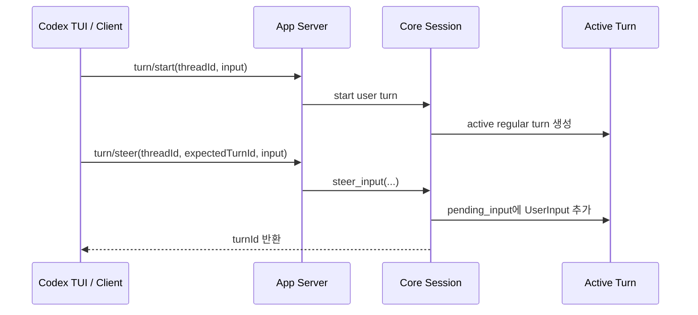
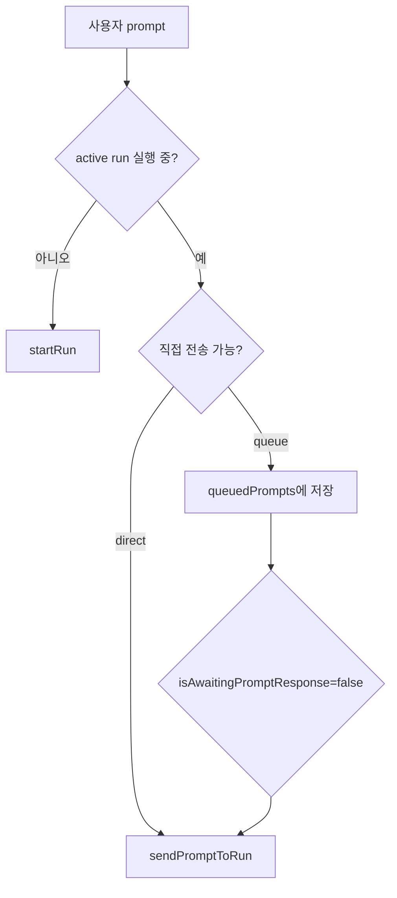
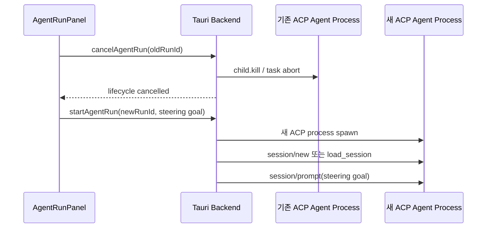
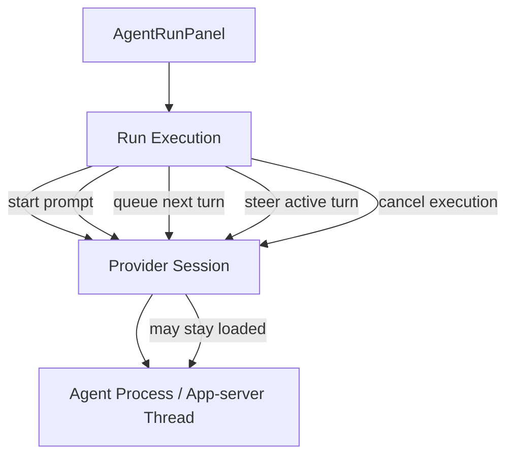

# Codex Steer/Queue 구조와 AW 개선 조사

## 조사 범위

이 문서는 OpenAI `openai/codex` 공개 저장소의 prompt steer/queue 구현을 확인하고, 현재 Agentic Workbench(AW)의 구현과 비교한 뒤, AW에서 steer 실행 중 진행 중인 agent session이 종료되는 원인과 개선 방향을 정리한다.

- Codex 조사 기준: `openai/codex` `aaa30f79c23e1c11a58394ff6edf1617d470c030` (`2026-07-07`)
- Codex 주요 경로:
  - `codex-rs/app-server/README.md`
  - `codex-rs/app-server/src/request_processors/turn_processor.rs`
  - `codex-rs/core/src/session/mod.rs`
  - `codex-rs/core/src/session/input_queue.rs`
  - `codex-rs/tui/src/chatwidget/input_queue.rs`
  - `codex-rs/tui/src/chatwidget/input_flow.rs`
  - `codex-rs/tui/src/chatwidget/input_submission.rs`
  - `codex-rs/tui/src/bottom_pane/pending_input_preview.rs`
- AW 주요 경로:
  - `apps/agentic-workbench/src/features/agent-run/ui/agent-run-panel.tsx`
  - `apps/agentic-workbench/src/features/agent-run/model/run-panel-state.ts`
  - `apps/agentic-workbench/src-tauri/src/infrastructure/acp/runner.rs`
  - `apps/agentic-workbench/src-tauri/src/application/cancel_agent_run.rs`
  - `apps/agentic-workbench/src-tauri/src/infrastructure/agent_session_registry.rs`

## 결론

Codex의 steer는 실행 중인 turn을 종료하지 않고, 같은 active turn 내부의 pending input queue에 사용자 입력을 주입하는 first-class 동작이다. 반면 AW의 steer는 현재 run을 `cancelAgentRun`으로 중단한 뒤 steering instruction을 포함한 새 goal로 `startRun`을 다시 호출한다. 따라서 AW에서 steer 중 agent session이 종료되는 것은 부수 효과가 아니라 현재 설계의 직접 결과다.

AW queue는 frontend-local 배열로 관리되며, backend는 queue/steer를 구분하지 않고 ACP `session/prompt`를 직렬 호출한다. Codex는 app-server/core 계층에서 `turn/start`, `turn/steer`, `turn/interrupt`를 분리하고, TUI에서도 `pending_steers`, `rejected_steers_queue`, `queued_user_messages`를 별도 상태로 관리한다.

## Codex 구현 방식

### App-server API 경계

Codex app-server 문서에는 세 동작이 분리되어 있다.

- `turn/start`: 새 turn을 시작한다.
- `turn/steer`: 이미 실행 중인 regular turn에 user input을 추가하고, 새 turn을 시작하지 않는다.
- `turn/interrupt`: 실행 중인 turn을 취소 요청한다.

`turn/steer`는 `expectedTurnId`를 요구한다. 서버의 active turn이 클라이언트가 알고 있는 turn과 다르면 mismatch error를 반환한다. 이 구조는 stale UI가 잘못된 turn에 steer를 보내는 것을 막는다.



### Core active-turn pending input

`codex-rs/core/src/session/mod.rs`의 `steer_input`은 다음 순서로 동작한다.

1. `active_turn`이 있는지 확인한다.
2. active task가 있는지 확인한다.
3. `expectedTurnId`가 현재 active turn id와 같은지 검증한다.
4. `Regular` turn만 허용하고, `Review`/`Compact` turn은 거절한다.
5. 입력이 비어 있지 않은지 검증한다.
6. `TurnInput::UserInput`을 active turn의 `pending_input`에 추가한다.
7. `InputQueueActivity::Steer`를 watch channel로 알린다.

즉 steer는 프로세스 kill, run 재시작, thread 새 시작이 아니라 active turn의 입력 큐에 합류하는 동작이다.

### Core input queue

`codex-rs/core/src/session/input_queue.rs`는 두 종류의 pending activity를 구분한다.

- `Mailbox`: inter-agent mailbox message 같은 일반 pending activity
- `Steer`: 사용자가 active turn에 주입한 입력

`InputQueue`는 turn-local `TurnInputQueue`와 session-scoped mailbox queue를 분리한다. active turn의 `pending_input`은 `get_pending_input` 또는 wait path에서 소비되고, steer 입력이 들어오면 watcher가 깨어난다.

### TUI queue와 pending steer

Codex TUI는 UI 상태에서도 queue와 steer를 분리한다.

- `queued_user_messages`: turn이 끝난 뒤 다음 turn으로 보낼 follow-up 입력
- `pending_steers`: core에 steer로 제출했지만 아직 transcript에 확정되지 않은 입력
- `rejected_steers_queue`: review/compact처럼 steer 불가능한 turn에서 거절된 steer를 다음 우선순위로 재시도할 입력
- `suppress_queue_autosend`: 자동 queue drain을 막는 플래그
- `submit_pending_steers_after_interrupt`: interrupt 후 pending steer를 새 user turn으로 재전송할지 결정하는 플래그

`PendingInputPreview`도 pending steer, rejected steer, queued follow-up inputs를 다른 섹션으로 렌더링한다. UI 차원에서 "다음 tool boundary 후 steer로 들어갈 메시지"와 "turn 완료 후 새 turn으로 실행할 메시지"를 분명히 다룬다.

## AW 현재 구현 방식

### Frontend queue

AW의 `AgentRunPanel`은 `queuedPrompts` React state와 ref를 갖는다. prompt가 실행 중이면 `enqueuePrompt`가 frontend 배열에 추가한다. 자동 전송은 다음 조건이 맞을 때만 실행된다.

- `activeRunId`가 있음
- `isRunning`이 true
- `isAwaitingPromptResponse`가 false
- queue 첫 항목이 `dispatchAfterRunStart`가 아님

조건이 맞으면 frontend가 `sendPromptToRun(activeRunId, nextPrompt.text)`를 호출한다. queue는 backend에 없고, app reload나 panel unmount가 있으면 사라지는 session-local 상태다.



### Backend prompt 전송

AW backend의 `AcpSession::send_prompt`는 `in_flight: Mutex<()>`를 `try_lock`으로 잡는다. 이미 prompt 응답 중이면 `"agent is still responding to the previous prompt"` 오류를 반환한다. 성공하면 ACP `PromptRequest::new(session_id, text)`를 보내고 응답이 끝날 때까지 기다린 뒤 `promptCompleted` lifecycle을 emit한다.

이는 queue/steer 의미를 backend가 알지 못한다는 뜻이다. backend가 제공하는 것은 "현재 ACP session에 prompt 하나를 보내고 완료까지 기다리는 직렬 prompt dispatch"다.

### AW steer

현재 AW steer는 두 함수가 같은 패턴을 쓴다.

- `steer()`
- `steerQueuedPrompt(queuedPrompt)`

둘 다 다음 순서다.

1. 현재 `directPrompt`와 steer prompt를 합쳐 `buildSteerPrompt`로 새 goal을 만든다.
2. 현재 `activeRunId`를 `cancelAgentRun(runIdToCancel)`로 취소한다.
3. `startRun(nextGoal, { queuedPrompts, displayPrompt })`로 새 run을 시작한다.



## Codex와 AW의 핵심 차이

| 항목 | Codex | AW |
| --- | --- | --- |
| steer 의미 | active turn에 입력 주입 | 기존 run 취소 후 새 run 시작 |
| queue 위치 | TUI 상태 + core/app-server turn 상태 | frontend `AgentRunPanel` state |
| backend API | `turn/start`, `turn/steer`, `turn/interrupt` 분리 | `start_agent_run`, `send_prompt_to_run`, `cancel_agent_run` |
| stale turn 방지 | `expectedTurnId` 검증 | `runId`만 사용, steer는 취소-재시작 |
| 실행 중 prompt | pending input으로 active turn에 전달 가능 | `in_flight.try_lock`으로 동시 dispatch 거절 |
| session 수명 | thread/turn 중심, steer가 session을 죽이지 않음 | run 중심, cancel이 child process와 run slot 제거 |
| queue drain | idle일 때 정확히 하나씩 제출, suppress 플래그 존재 | `isAwaitingPromptResponse` false일 때 frontend effect가 하나씩 제출 |
| non-steerable 상태 | review/compact에서 명시 오류 및 rejected steer queue | 별도 상태 없음 |

## AW에서 steer 중 session이 종료되는 원인

### 직접 원인

`AgentRunPanel.steer()`와 `steerQueuedPrompt()`가 steer를 구현하기 위해 `cancelAgentRun(runIdToCancel)`를 먼저 호출한다. backend `CancelAgentRunUseCase`는 registry의 `cancel_run`을 호출하고 `LifecycleStatus::Cancelled`를 emit한다. registry는 해당 run의 `JoinHandle`을 abort하고 owner/permission 상태를 제거한다.

또한 `AcpRunCommander::abort`는 child process에 `start_kill`을 호출하고 wait한 뒤 read/stderr task를 abort한다. 따라서 진행 중인 ACP agent process는 정상적으로 종료된다.

### 구조적 원인

AW는 ACP provider session과 AW run을 강하게 결합한다. `startRun`은 매번 새 `runId`를 만들고, backend는 새 child process를 spawn한다. `sessionMode === "reuse"`이고 `selectedSessionId`가 있어야 기존 provider session id를 `resumeSessionId`로 넘긴다. 그렇지 않으면 steer 후 새 ACP session이 생성된다.

즉 AW의 현재 steer는 "같은 세션에 방향 조정 입력을 주입"이 아니라 "현재 프로세스를 죽이고, 원래 prompt와 steer instruction을 합친 새 작업을 다시 시작"이다. 사용자가 보는 "진행 중인 agent session 종료"는 이 흐름에서 필연적이다.

### 부수 위험

- `listenRunEvents`는 envelope run id가 `activeRunIdRef.current`와 다르면 이벤트를 무시한다. steer 중 old run cancel event와 new run start event가 교차하면 UI가 old run의 마무리 이벤트를 일부 잃을 수 있다.
- lifecycle `completed`/`cancelled` 처리에서 `setQueuedPrompts([])`를 호출한다. steer 함수가 queue를 보존하려고 `queuedPromptsToKeep`을 넘기지만, old run의 늦은 lifecycle event가 들어오면 새 run queue를 지울 수 있는 race가 생긴다.
- backend `send_prompt`는 prompt 하나가 끝날 때까지 `in_flight`를 잡는다. 실행 중 steering 입력을 같은 ACP session에 직접 넣는 경로가 없다.
- cancel 직후 새 run이 `resumeIfAvailable`로 기존 session을 재사용하더라도, agent process는 새로 spawn되며 기존 실행 컨텍스트와 tool 진행 상태는 끊긴다.

## 개선 방향

### 1단계: 현재 동작을 명시하고 race를 줄이기

가장 작은 수정은 현재 steer를 "cancel and restart"로 명시하고, 상태 race를 줄이는 것이다.

- 버튼/함수 명칭 또는 내부 상태를 `restartWithSteer` 수준으로 분리한다.
- `cancelAgentRun` 후 old run의 lifecycle event가 새 run 상태를 지우지 않도록 `cancelledRunIds` 또는 `steerTransition` 상태를 둔다.
- lifecycle 처리에서 `completed/cancelled`가 들어와도 `envelope.runId !== activeRunIdRef.current`이면 이미 무시하고 있지만, `startRun` 직전/직후 `activeRunIdRef` 전환 구간을 테스트로 고정한다.
- steer 중 보존할 queue를 ref 기준으로 읽고, old lifecycle의 queue clear와 충돌하지 않도록 reducer 기반 상태 전이를 도입한다.

이 단계는 session 종료 자체를 없애지는 못한다. 다만 사용자가 "왜 종료됐는지"와 "queue가 왜 사라졌는지"를 겪는 문제를 줄인다.

### 2단계: queue를 panel reducer로 정리하기

현재 queue, direct prompt, running flag, awaiting flag가 여러 `useState`로 흩어져 있다. Codex TUI처럼 입력 상태를 한 곳에 모아야 한다.

권장 상태:

```ts
type PromptDispatchState = {
  activeRunId: string | null;
  activePrompt: string | null;
  phase: "idle" | "starting" | "awaiting" | "responding" | "cancelling" | "restarting";
  queuedPrompts: QueuedPrompt[];
  pendingSteers: QueuedPrompt[];
  suppressQueueAutosend: boolean;
};
```

이 reducer는 다음 이벤트만 통해 변경한다.

- `runStarted`
- `promptSent`
- `promptCompleted`
- `runCompleted`
- `runCancelled`
- `queueAdded`
- `queueDispatched`
- `steerRequested`
- `steerAccepted`
- `steerRejected`

### 3단계: backend에 steer capability를 별도 port로 추가하기

근본 개선은 AW backend에 `steer_prompt_to_run` 같은 별도 use case를 만들고, 가능한 agent에 대해서는 cancel 없이 steering 입력을 전달하는 것이다.

문제는 현재 AW가 ACP `session/prompt`를 쓰고 있고, ACP v1 `PromptRequest`는 AW 코드 기준으로 "prompt 하나를 보내고 완료 응답을 기다리는" 형태다. Codex app-server의 `turn/steer` 같은 active-turn injection API가 ACP adapter에 존재하지 않는다.

따라서 선택지는 두 가지다.

1. Codex app-server를 provider로 붙이는 경로를 만든다.
   - AW가 `codex app-server`를 실행하거나 연결한다.
   - Codex 계열 agent에는 `turn/start`, `turn/steer`, `turn/interrupt`를 사용한다.
   - 기존 ACP agent는 현 방식 유지.
2. ACP agent별 확장 capability를 정의한다.
   - `AgentCapabilities`에 `steerPrompt` 또는 `interruptAndContinue` 같은 capability를 탐지한다.
   - 지원 agent만 cancel 없는 steer를 활성화한다.
   - 미지원 agent는 현재처럼 restart steer로 fallback한다.

### 4단계: run과 provider session 수명 분리

AW의 `run`은 UI timeline execution 단위이고, provider session은 agent conversation 단위다. 현재는 run 취소가 child process 종료와 session 전환을 함께 일으킨다. 장기적으로는 다음처럼 나누는 편이 좋다.



분리 후 정책:

- `cancel run`: active turn만 interrupt하고 provider session/thread는 유지할 수 있다.
- `close panel`: owner가 사라지는 것이므로 run cancel 또는 session detach를 선택한다.
- `steer`: provider가 지원하면 active turn에 주입하고 run id를 유지한다.
- `restart with steer`: 명시적으로 새 run을 만들고 이전 run을 cancel한다.

## 권장 실행 순서

1. 현재 steer 버튼의 실제 의미를 `cancelAndRestart`로 코드상 분리하고, old run lifecycle이 새 run queue를 지우지 않는 회귀 테스트를 추가한다.
2. `run-panel-state.ts`에 reducer 기반 prompt dispatch state를 추가해 queue/steer/awaiting 전이를 한 곳으로 모은다.
3. Codex app-server adapter 가능성을 별도 spike로 검증한다. 최소 검증은 `thread/start -> turn/start -> turn/steer -> turn/completed` round trip이다.
4. backend port를 `sendPrompt`, `steerPrompt`, `interruptTurn`, `startTurn`처럼 의미 단위로 재정의한다.
5. UI에서 provider capability에 따라 버튼을 분리한다.
   - 지원: `Steer`는 세션을 유지한다.
   - 미지원: `Restart with steering`으로 표시한다.

## 테스트 포인트

- 실행 중 queue 추가 후 `promptCompleted`가 오면 queue가 하나씩만 dispatch되는지 확인한다.
- steer 중 old run `cancelled` event가 늦게 도착해도 new run queue와 `activeRunId`가 지워지지 않는지 확인한다.
- `sendPromptToRun` 동시 호출 시 `in_flight` 오류가 UI queue 복구로 이어지는지 확인한다.
- provider session reuse 모드에서 steer 후 실제 `resumeSessionId`가 유지되는지 확인한다.
- Codex app-server adapter를 붙일 경우 `expectedTurnId` mismatch를 UI가 retry 또는 queue fallback으로 처리하는지 확인한다.

## 참고 링크

- OpenAI Codex 저장소: https://github.com/openai/codex
- Codex app-server 문서: https://github.com/openai/codex/blob/main/codex-rs/app-server/README.md
- Codex core input queue: https://github.com/openai/codex/blob/main/codex-rs/core/src/session/input_queue.rs
- Codex TUI pending input preview: https://github.com/openai/codex/blob/main/codex-rs/tui/src/bottom_pane/pending_input_preview.rs
- 관련 공개 이슈: https://github.com/openai/codex/issues/17285
