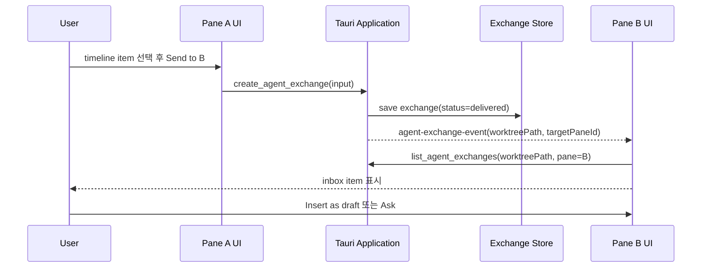

# Dual Pane Agent Session 데이터 교환 설계

## 배경

worktree 작업 윈도우에서 하나의 agent session만 열 수 있으면 사용자는 비교, 검토,
역할 분담 작업을 위해 창을 계속 바꾸거나 같은 timeline에 서로 다른 의도를 섞어야 한다.
dual pane 작업창은 같은 worktree를 기준으로 두 개의 독립 agent session을 나란히 열고,
필요한 정보만 명시적으로 전달할 수 있게 만드는 기능이다.

대표 사용 시나리오:

- 왼쪽 agent는 구현을 진행하고, 오른쪽 agent는 review/checklist를 유지한다.
- 한쪽 agent가 만든 diff 요약, 파일 목록, 실패 로그를 다른 agent에게 넘겨 분석시킨다.
- 같은 worktree에서 서로 다른 provider나 model을 비교한다.
- 하나의 session은 read-only/plan mode, 다른 session은 edit-capable mode로 둔다.

핵심 원칙은 두 session을 직접 연결하지 않는 것이다. session 간 데이터 이동은 앱이
소유한 구조화된 exchange store를 통해서만 일어난다. 이렇게 해야 권한, 감사 로그,
대상 session, 보존 범위, 재전송 여부를 앱이 통제할 수 있다.

## 현재 코드 기준 출발점

현재 앱에는 dual pane을 얹을 기반이 이미 있다.

- 화면: `apps/agentic-workbench/src/pages/project-worktree-session/ui/project-worktree-session-page.tsx`
  는 단일 `AgentRunPanel`을 worktree 작업 화면의 주 영역에 렌더링한다.
- agent panel: `apps/agentic-workbench/src/features/agent-run/ui/agent-run-panel.tsx`는 prompt,
  provider session reuse, permission mode, model/context size, timeline, goal, Ralph loop를
  한 panel 안에서 관리한다.
- run identity: `domain/run.rs`의 `AgentRunRequest`와 `AgentRun`은 `runId`, `cwd`,
  `resumeSessionId`, `resumePolicy`, `permissionMode`, `modelId`, `contextSize`를 이미
  포함한다.
- registry: `infrastructure/agent_session_registry.rs`는 run id별 active session을
  관리하고, 동시에 여러 run id를 보관할 수 있다. 환경 변수 `ACP_WORKBENCH_MAX_RUNS`로
  동시 실행 상한도 둘 수 있다.
- window owner: `start_agent_run` inbound command는 Tauri window label을 run owner로
  저장하고, permission response는 owner window에서만 보낼 수 있게 검사한다.
- event delivery: `TauriRunEventSink`가 run event를 window로 emit하고, frontend는
  `listenRunEvents`로 run id가 포함된 event envelope를 받는다.

즉 MVP는 agent process 실행 구조를 크게 바꾸기보다, worktree session page에 두 개의
panel instance를 띄우고 각 pane이 자기 run id와 timeline state를 갖도록 분리하는
것에서 시작할 수 있다.

## 관련 자료 조사 요약

조사는 2026-06-25 기준 공개 문서를 중심으로 했다.

- ACP에서 session은 client와 agent 사이의 독립 conversation/thread이며, 각 session은
  자신의 context, conversation history, state를 가진다. 따라서 dual pane은 두 개의
  독립 ACP session을 같은 worktree cwd로 여는 모델과 잘 맞는다.
- ACP `session/new`는 `cwd`와 `mcpServers`를 받아 새 session을 만들고 고유
  `sessionId`를 반환한다. `session/load`와 `session/resume`도 session id, cwd,
  MCP server 목록을 다시 받는다.
- ACP `cwd`는 session의 primary filesystem context이며 absolute path여야 하고,
  relative path resolution의 기준이다. dual pane에서 두 session이 같은 worktree를
  공유하려면 두 pane의 `cwd`는 동일한 worktree absolute path여야 한다.
- ACP `additionalDirectories`는 지원 capability가 있을 때 session root를 확장한다.
  dual pane의 기본 설계에서는 두 pane 모두 같은 worktree만 root로 두고, 별도 비교
  대상은 앱 exchange artifact로 전달하는 편이 안전하다.
- MCP tools는 model-controlled 호출 수단이며, tool 호출에는 human-in-the-loop,
  노출된 tool 표시, 호출 시각화, 확인 UI가 권장된다. session 간 데이터 전송은
  agent가 자동 호출할 수 있는 tool로 제공하되, 수신 session에 prompt로 주입하기
  전에는 사용자가 확인하도록 설계한다.
- MCP resources는 앱이 model context가 되는 데이터를 URI로 노출하는 방식이다.
  exchange artifact, pane snapshot, worktree diff summary는 resource로 읽히는 것이
  적합하다.
- MCP roots는 client가 filesystem boundary를 서버에 알려주는 모델이다. dual pane은
  같은 worktree root를 공유하되, cross-session artifact는 filesystem root 바깥의
  임시 파일 경로를 직접 노출하기보다 앱 URI로 노출하는 편이 권한 경계가 명확하다.
- React UI 쪽에서는 `react-resizable-panels`가 resizable split layout을 제공하고,
  shadcn/ui도 이를 감싼 Resizable 컴포넌트 문서를 제공한다. 현재 프로젝트에는
  `react-grab`이 이미 있지만, shadcn/ui 패턴에 맞추려면 `react-resizable-panels`
  기반 primitive를 `components/ui`에 추가하는 방식이 더 표준적이다.
- Tauri는 별도 `WebviewWindow` 생성 API가 있지만, 이 기능의 MVP는 한 webview 안의
  React split pane으로 충분하다. 별도 window/webview를 쓰면 state sync와 event routing
  복잡도가 커지므로 후속 단계로 미룬다.

참고 자료:

- ACP Session Setup: https://agentclientprotocol.com/protocol/v1/session-setup
- ACP Schema: https://agentclientprotocol.com/protocol/v1/schema
- MCP Tools: https://modelcontextprotocol.io/specification/2025-06-18/server/tools
- MCP Resources: https://modelcontextprotocol.io/specification/2025-06-18/server/resources
- MCP Roots: https://modelcontextprotocol.io/specification/2025-06-18/client/roots
- shadcn/ui Resizable: https://ui.shadcn.com/docs/components/radix/resizable
- Tauri WebviewWindow: https://v2.tauri.app/reference/javascript/api/namespacewebviewwindow/

## 목표

1. worktree 작업 윈도우를 single pane 또는 dual pane으로 전환한다.
2. dual pane에서는 left/right 각각 독립 agent session을 시작, 재사용, cancel할 수 있다.
3. 두 pane은 같은 worktree cwd를 기본 공유하지만, prompt/timeline/permission/model은
   독립 상태로 유지한다.
4. 한 pane의 사용자가 선택한 데이터만 다른 pane으로 전달한다.
5. 전달 데이터는 앱이 저장하고 감사 가능한 exchange record로 남긴다.
6. 수신 pane에 자동 prompt 실행을 하지 않고, draft 또는 inbox item으로 먼저 보여준다.

## 비목표

- 두 agent가 서로 직접 JSON-RPC나 MCP transport로 통신하게 만들지 않는다.
- 두 session의 conversation history를 자동 병합하지 않는다.
- 같은 파일을 동시에 편집하는 충돌 해결을 이 기능에서 자동화하지 않는다.
- MVP에서 별도 Tauri window 또는 별도 webview로 pane을 분리하지 않는다.
- agent가 보낸 임의 HTML을 pane 간 전달하거나 렌더링하지 않는다.

## UX 설계

### Layout

worktree session page의 본문을 다음 구조로 바꾼다.

```text
Project / Worktree header
┌──────────────────────────────────────────────────────────────┐
│ Worktree summary + changes, 접을 수 있는 공통 header          │
├─────────────────────────────┬────────────────────────────────┤
│ Pane A                      │ Pane B                         │
│ AgentRunPanel               │ AgentRunPanel                  │
│ timeline/prompt/permission  │ timeline/prompt/permission     │
└─────────────────────────────┴────────────────────────────────┘
```

기본 모드:

- 기존 사용자는 single pane 경험을 유지한다.
- toolbar의 split toggle을 켜면 오른쪽 pane을 생성한다.
- split 비율은 local UI state에 저장한다.
- 좁은 화면에서는 dual pane을 tabbed mode로 degrade한다. 두 pane을 억지로 좌우 배치하지
  않는다.

Pane header:

- pane label: `A`, `B` 또는 사용자가 지정한 이름
- agent/provider/model 표시
- active run status
- permission mode badge
- inbox count
- actions: `Send to other pane`, `Open inbox`, `Close pane`, `Swap panes`

### 데이터 보내기

각 pane에서 다음 데이터를 다른 pane으로 보낼 수 있다.

- 선택한 timeline item
- agent answer 일부 텍스트
- thought/plan 요약
- tool call/result 요약
- permission request input
- worktree changes summary
- 특정 파일 diff
- 직접 작성한 note

보내기 동작은 즉시 수신 agent에게 prompt를 보내지 않는다. 대신 target pane의 inbox에
exchange item을 만든다.

수신 pane에서는 다음 action을 제공한다.

- `Insert as draft`: prompt input에 삽입
- `Ask with this context`: 확인 후 `sendPromptToRun`
- `Pin as context`: pane-local pinned context로 보관
- `Dismiss`: inbox에서 숨김
- `Open source`: 원본 timeline item 또는 artifact로 이동

### 자동 전송 금지

agent A가 tool을 호출해 agent B에게 데이터를 보낼 수는 있지만, agent B의 session에
자동 prompt를 실행하면 안 된다. 최소 MVP에서는 반드시 사용자가 B pane inbox에서
명시적으로 실행해야 한다.

이 규칙은 다음 문제를 줄인다.

- agent끼리 무한 루프를 만드는 상황
- 수신 agent가 권한이 더 강한 pane에서 의도치 않은 작업을 시작하는 상황
- 사용자 확인 없이 private context가 다른 provider session으로 넘어가는 상황

## 핵심 도메인 모델

### Pane

Pane은 UI 영역이면서 session 실행 범위다.

```ts
type WorktreePaneId = "left" | "right";

type WorktreePaneState = {
  paneId: WorktreePaneId;
  label: string;
  workingDirectory: string;
  activeRunId: string | null;
  selectedAgentId: string | null;
  selectedProviderSessionId: string | null;
  permissionMode: PermissionMode;
  modelId: string;
  contextSize: ContextSizePreset;
  pinnedExchangeIds: string[];
};
```

`runId`는 pane id를 포함해 생성한다.

```text
worktree:{worktreeHash}:pane:{left|right}:run:{uuid}
```

run id에 pane id가 들어가면 event routing, 테스트 fixture, 로그 분석이 쉬워진다.
단 backend는 여전히 run id를 opaque string으로 취급한다.

### Exchange Record

session 간 데이터 전달은 `AgentExchange`로 저장한다.

```ts
type AgentExchangeStatus = "draft" | "delivered" | "consumed" | "dismissed";
type AgentExchangeKind =
  | "note"
  | "timelineSelection"
  | "agentMessageExcerpt"
  | "toolResult"
  | "worktreeChangesSummary"
  | "fileDiff"
  | "permissionContext";

type AgentExchange = {
  id: string;
  worktreePath: string;
  sourcePaneId: WorktreePaneId;
  targetPaneId: WorktreePaneId;
  sourceRunId: string | null;
  targetRunId: string | null;
  kind: AgentExchangeKind;
  title: string;
  summary: string;
  body: string;
  attachments: AgentExchangeAttachment[];
  status: AgentExchangeStatus;
  createdAt: string;
  consumedAt: string | null;
};

type AgentExchangeAttachment = {
  type: "file" | "diff" | "timelineItem" | "resource";
  label: string;
  uri: string;
  mimeType?: string;
  size?: number;
};
```

MVP 저장소는 JSON 파일로 충분하다.

```text
~/Library/Application Support/.../agent-exchanges/{worktree-hash}.json
```

기존 repository 패턴을 따르면 backend는 다음으로 나눈다.

- `domain/agent_exchange.rs`
- `domain/agent_exchange_repository.rs`
- `application/agent_exchange_service.rs`
- `infrastructure/json_agent_exchange_repository.rs`
- `inbound/tauri_commands.rs` commands

## 데이터 흐름

### 사용자 주도 전송



### MCP tool 기반 전송

agent가 "오른쪽 pane에 이 요약을 넘겨라"라는 사용자 지시를 받았을 때를 위해
앱 MCP server에 tool을 추가할 수 있다.

```text
agent_exchange.create
```

입력:

```json
{
  "worktreePath": "/abs/path/to/worktree",
  "sourcePaneId": "left",
  "targetPaneId": "right",
  "kind": "note",
  "title": "테스트 실패 원인 후보",
  "summary": "인증 mock 설정 누락 가능성",
  "body": "..."
}
```

tool 호출 결과:

```json
{
  "exchangeId": "ex_...",
  "status": "delivered"
}
```

중요한 제한:

- tool은 exchange item만 만든다.
- target pane의 prompt를 자동 실행하지 않는다.
- tool input의 `sourcePaneId`, `sourceRunId`는 run token과 대조한다.
- target pane이 없으면 `targetPaneIdMissing` 오류로 실패하거나 `pending` 상태로 저장한다.

## MCP Surface

기존 앱 MCP 설계가 도입된다면 dual pane은 같은 서버에 아래 resource/tool을 추가한다.

Resources:

- `app://worktrees/{worktreeHash}/panes/{paneId}/snapshot`
  - pane label, active run id, selected agent, permission mode, 최근 lifecycle 상태
- `app://worktrees/{worktreeHash}/exchanges/{exchangeId}`
  - exchange 본문과 attachment 목록
- `app://worktrees/{worktreeHash}/exchanges?targetPaneId=right&status=delivered`
  - 수신 대기 목록

Tools:

- `agent_exchange.create`
  - source pane에서 target pane으로 exchange item 생성
- `agent_exchange.summarize_selection`
  - 큰 timeline/tool result를 전달 전에 앱이 정한 길이로 요약 요청
- `agent_exchange.mark_consumed`
  - 사용자가 prompt에 넣거나 ask action으로 실행한 뒤 상태 갱신

권한:

- `agent_exchange.create`는 기본적으로 사용자 확인 대상이다.
- 같은 worktree 안에서만 허용한다.
- permission mode가 read-only여도 exchange 생성은 가능하지만, target pane prompt 실행은
  사용자가 직접 해야 한다.
- provider가 다른 두 pane 사이 전송은 UI에 명확히 표시한다.

## Frontend 설계

### FSD 배치

- `pages/project-worktree-session`
  - dual pane layout composition과 route-level state를 둔다.
- `features/agent-pane-layout`
  - split toggle, pane toolbar, pane close/swap, responsive degrade.
- `features/agent-exchange`
  - send dialog, inbox, insert as draft, ask with context.
- `features/agent-run`
  - 기존 `AgentRunPanel`을 pane-aware하게 확장하되, panel 내부가 다른 pane을 직접 알지
    않게 한다.
- `entities/agent-exchange`
  - API adapter, query keys, model types.
- `shared/ui`
  - shadcn/ui registry가 아니라면 thin split-pane primitive를 둔다. shadcn resizable을
    도입하면 generated component는 `components/ui`에 둔다.

### AgentRunPanel 변경

`AgentRunPanel`은 현재 내부 state가 많다. dual pane에서 재사용하려면 pane identity와
외부 draft 주입만 추가하고, exchange 기능은 별도 feature가 감싼다.

추가 props 예시:

```ts
type AgentRunPanelProps = {
  paneId?: "left" | "right";
  workingDirectory: string;
  scrollHeader?: ReactNode;
  onRunSettled?: () => void;
  initialInputMode?: AgentInputMode;
  externalDraft?: string | null;
  onExternalDraftConsumed?: () => void;
  panelToolbarSlot?: ReactNode;
};
```

주의:

- pane B의 inbox action이 pane B prompt state를 직접 mutate하려면 clean API가 필요하다.
- `externalDraft`는 append/replace 정책을 명확히 해야 한다.
- 기존 single pane 사용자는 `paneId` 없이 그대로 동작해야 한다.

### Event Routing

`listenRunEvents`는 모든 run event를 받고 panel 내부에서 active run id와 대조한다.
dual pane에서도 같은 방식이 가능하지만, 다음 규칙을 둔다.

- pane은 자신이 시작한 `activeRunId` 이벤트만 timeline에 반영한다.
- `runId -> paneId` mapping은 frontend pane state와 backend owner state 양쪽에 남긴다.
- permission response는 기존 window owner 검사를 유지하되, frontend에서는 해당 pane의
  permission card에서만 응답 버튼을 노출한다.

## Backend 설계

### Application Service

`AgentExchangeService`는 다음 use case를 제공한다.

- `create_exchange(input) -> AgentExchange`
- `list_exchanges(worktree_path, target_pane_id, status_filter) -> Vec<AgentExchange>`
- `get_exchange(id) -> AgentExchange`
- `mark_exchange_consumed(id, target_run_id)`
- `dismiss_exchange(id)`
- `delete_exchanges_for_worktree(worktree_path)`

검증:

- `worktree_path` trim 및 absolute path 검사
- `sourcePaneId != targetPaneId`
- `kind`별 body/attachments 크기 제한
- attachment URI scheme allowlist
- 같은 worktree scope 확인

### Tauri Commands

추가 command:

```text
create_agent_exchange
list_agent_exchanges
get_agent_exchange
mark_agent_exchange_consumed
dismiss_agent_exchange
```

event:

```text
agent-exchange-event
```

payload:

```ts
type AgentExchangeEvent = {
  worktreePath: string;
  exchangeId: string;
  sourcePaneId: "left" | "right";
  targetPaneId: "left" | "right";
  status: AgentExchangeStatus;
};
```

### Session Registry

현 registry는 run id 기준으로 여러 run을 관리할 수 있다. dual pane MVP에서 필요한
backend 변경은 크지 않다.

권장 보강:

- `owner_window_label` 외에 optional `pane_id`를 `AgentRunRequest`에 추가한다.
- permission broker와 run event에는 여전히 run id를 primary key로 사용한다.
- close pane 시 해당 pane active run만 cancel한다.
- window close 시 기존 `cancel_runs_owned_by(window)`는 그대로 모든 pane run을 정리한다.

## Conflict와 Safety

두 session이 같은 worktree를 공유하면 파일 편집 충돌이 핵심 위험이다.

MVP 정책:

- dual pane에서는 기본 권장 permission mode를 `readOnly` 또는 `plan`으로 둔다.
- 두 pane 모두 edit-capable mode일 때 warning banner를 표시한다.
- 한 pane이 running 중이고 다른 pane에서 edit-capable run을 시작하려 하면 확인 dialog를
  띄운다.
- run 종료 시 worktree changes panel을 refresh하고, 다른 pane에는 "worktree changed"
  indicator를 표시한다.
- 파일 충돌 해결 자동화는 하지 않는다.

추후 정책:

- pane별 temporary branch/worktree를 둘 수 있다.
- 한 pane은 implementation worktree, 다른 pane은 review-only main worktree로 분리할 수 있다.
- exchange artifact에 diff snapshot hash를 넣어 stale diff를 감지한다.

## Persistence

저장할 항목:

- pane layout mode: single/dual
- split ratio
- pane labels
- pane별 last selected agent/model/context/permission
- pane별 provider session reuse preference
- exchange records

저장 위치:

- layout/settings: 기존 `AgentRunSettings`를 확장하거나 별도
  `WorktreePaneLayoutSettingsRepository`를 둔다.
- exchange: 별도 repository를 둔다. timeline보다 오래 보존될 수 있고, 사용자 삭제
  정책이 필요하기 때문이다.

보존 정책:

- exchange는 기본적으로 worktree별로 보존한다.
- 사용자가 worktree를 삭제하면 함께 삭제한다.
- 큰 diff/body는 크기 제한을 두고 truncate flag를 저장한다.
- 민감 정보가 있을 수 있으므로 export/log에는 exchange body를 자동 포함하지 않는다.

## 구현 단계

### 1단계: UI dual pane shell

- shadcn resizable 또는 `react-resizable-panels` 기반 split primitive 추가.
- `ProjectWorktreeSessionPage`를 single/dual layout으로 변경.
- `AgentRunPanel` 두 개를 같은 worktree path로 렌더링.
- pane별 run/timeline state가 섞이지 않는지 확인.
- Storybook page story 추가.

### 2단계: Pane-aware run identity

- frontend에서 pane id가 포함된 run id 생성.
- `AgentRunRequest`에 optional `paneId` 추가.
- backend는 run owner와 함께 pane id를 저장하거나 event metadata로 남긴다.
- close pane, swap pane, window close lifecycle 테스트 추가.

### 3단계: Manual exchange

- `entities/agent-exchange` 타입/API/query key 추가.
- backend domain/application/infrastructure repository 추가.
- send dialog와 target pane inbox 구현.
- `Insert as draft`와 `Ask with this context` 구현.
- exchange event로 target pane inbox invalidate.

### 4단계: MCP exchange tool/resource

- 앱 MCP server가 준비된 뒤 `agent_exchange.create`와 exchange resources 추가.
- run token으로 source run/pane scope 검증.
- tool 호출 UI와 confirmation 정책 연결.
- agent가 tool로 만든 exchange가 target pane inbox에 나타나는지 E2E 확인.

### 5단계: 충돌 완화와 고급 흐름

- simultaneous edit warning.
- worktree changed indicator.
- diff snapshot stale detection.
- provider-to-provider transfer warning.
- pane별 pinned context.

## 테스트 전략

Frontend:

- split mode toggle이 single pane state를 보존하는지 테스트.
- 두 `AgentRunPanel`이 서로 다른 run id event만 반영하는지 테스트.
- inbox item을 draft로 넣을 때 target pane에만 반영되는지 테스트.
- 좁은 viewport에서 tabbed mode로 전환되는지 Storybook/visual test.

Backend:

- exchange create/list/consume/dismiss repository 테스트.
- source/target pane이 같으면 reject.
- blank/relative worktree path reject.
- body/attachment size limit 테스트.
- run owner/window close cancel 동작이 dual pane run 둘 다 정리하는지 회귀 테스트.

Integration:

- pane A run 시작, pane B run 시작, pane A cancel이 pane B에 영향 없는지 확인.
- pane A exchange 생성 후 pane B inbox invalidate 확인.
- pane B `Ask with this context`가 pane B run으로만 prompt를 보내는지 확인.
- permission response가 non-owner window에서 거부되는 기존 보안 규칙 유지 확인.

## 설계 결정

MVP의 권장 방향은 다음과 같다.

1. 한 Tauri webview 안에서 React split pane으로 구현한다.
2. 두 pane은 같은 worktree cwd를 쓰는 독립 ACP session/run으로 둔다.
3. session 간 데이터 전달은 앱 소유 `AgentExchange` 저장소로 중재한다.
4. 수신 pane prompt 자동 실행은 금지하고, inbox/draft 기반으로 사용자 확인을 둔다.
5. MCP tool은 후속 단계에서 같은 exchange store에 쓰는 얇은 adapter로 추가한다.

이 방향은 현재 코드의 run registry와 `AgentRunPanel` 재사용성을 살리면서도, agent 간
무한 루프와 권한 혼선을 피한다. 또한 나중에 별도 worktree per pane, background review
agent, MCP 기반 자동 전달로 확장할 수 있다.
