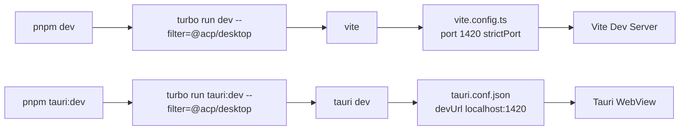
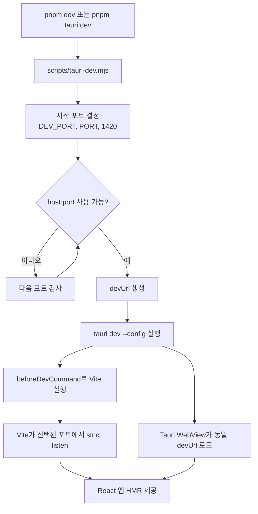
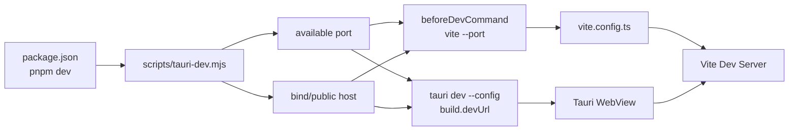

# 개발 서버 및 앱 실행 시 동적 포트 적용 전략

## 배경

현재 Tauri 개발 실행은 `apps/desktop/src-tauri/tauri.conf.json`의 `build.devUrl`과 `apps/desktop/vite.config.ts`의 Vite 개발 서버 포트를 `1420`에 맞춰 둔다. Vite 설정은 `VITE_DEV_SERVER_PORT`를 읽지만 `strictPort: true`이므로 해당 포트가 이미 사용 중이면 실행이 실패한다.

이 방식은 단순하지만, 여러 Tauri/Vite 프로젝트를 동시에 실행하거나 이전 dev server가 남아 있으면 `pnpm dev` 또는 `pnpm tauri:dev`가 실패한다. 이 프로젝트를 다른 앱으로 이식 가능한 template 또는 module source로 쓰려면 개발 실행 방식도 host 앱에 쉽게 옮길 수 있어야 한다.

핵심은 실행 시점에 하나의 포트를 먼저 결정하고, 그 포트를 Vite와 Tauri `devUrl`에 동시에 전달하는 것이다.

## 목표

- 기본 포트 `1420`을 유지하되 사용 중이면 다음 사용 가능한 포트를 자동 선택한다.
- 선택된 포트를 Vite dev server와 Tauri WebView `devUrl`에 동시에 반영한다.
- Turbo workspace 구조에서도 root script와 desktop package script가 같은 실행 경로를 사용하게 한다.
- 설정 파일을 매번 수정하지 않고 Tauri CLI `--config` runtime override로 처리한다.
- target 앱에 복사하기 쉬운 단일 launcher script와 문서화된 환경 변수 계약을 제공한다.

## 비목표

- production build 포트나 배포 설정을 바꾸지 않는다.
- Vite가 임의 포트로 fallback하도록 두지 않는다.
- 실행 중 port conflict를 완전히 제거하지 않는다. probe와 listen 사이 경쟁 구간은 남을 수 있다.
- mobile/LAN 디바이스 테스트까지 한 번에 자동 설정하지 않는다.

## 현재 설정



문제는 `pnpm dev`와 `pnpm tauri:dev`가 서로 다른 경로를 탄다는 점이다. Tauri 앱을 띄우는 실제 개발 경로는 `tauri dev`이며, 이때 Tauri가 `devUrl`을 알아야 한다. Vite만 자동 포트로 이동하면 WebView는 여전히 기존 URL을 바라볼 수 있다.

## 적용 방식

루트 `pnpm dev`와 `pnpm tauri:dev`가 같은 launcher를 사용하도록 만든다.

권장 파일:

- `scripts/tauri-dev.mjs`: 빈 포트 탐색 및 Tauri dev 실행 래퍼
- `package.json`: root `dev`, `tauri:dev` 진입점을 launcher로 연결
- `apps/desktop/vite.config.ts`: `DEV_HOST`, `DEV_PORT` 또는 `VITE_DEV_SERVER_PORT` 기반 Vite 서버 설정
- `apps/desktop/src-tauri/tauri.conf.json`: fallback `devUrl`만 유지

실행 흐름:



## Launcher 계약

`scripts/tauri-dev.mjs`는 다음 책임만 가진다.

1. host와 시작 포트를 결정한다.
2. 제한된 범위에서 사용 가능한 포트를 찾는다.
3. 선택된 포트로 Tauri runtime config를 만든다.
4. desktop package cwd에서 `pnpm exec tauri dev --config <json>`을 실행한다.
5. child process exit code를 그대로 반환한다.

Tauri override 예시:

```json
{
  "build": {
    "devUrl": "http://127.0.0.1:<port>",
    "beforeDevCommand": "pnpm exec vite --host 127.0.0.1 --port <port> --strictPort"
  }
}
```

`--strictPort`를 유지하는 이유는 launcher가 이미 포트를 결정했기 때문이다. Vite가 다시 다른 포트로 이동하면 Tauri `devUrl`과 불일치할 수 있으므로, 선택된 포트에서 실행할 수 없으면 실패하는 편이 안전하다.

## 환경 변수

- `DEV_PORT`: 탐색을 시작할 포트다. 없으면 `PORT`를 보고, 둘 다 없으면 `1420`을 사용한다.
- `PORT`: `DEV_PORT`가 없을 때 대체 시작 포트로 사용한다.
- `DEV_HOST`: Vite listen host다. 없으면 `127.0.0.1`을 사용한다.
- `TAURI_DEV_HOST`: Tauri/WebView가 접속할 host가 별도로 필요할 때 사용한다.
- `DEV_PORT_SCAN_LIMIT`: 시작 포트부터 몇 개까지 검사할지 정한다. 기본값은 `50`을 권장한다.

host와 public URL을 분리해야 하는 경우가 있다. 예를 들어 Vite는 `0.0.0.0`에 bind하되 WebView는 `127.0.0.1` 또는 LAN IP로 접속해야 한다. 이 경우 launcher 내부에서는 다음 개념을 분리한다.

```text
bindHost: Vite가 listen할 host
publicHost: Tauri WebView가 접속할 host
```

## package script 변경안

현재 root script:

```json
{
  "dev": "turbo run dev --filter=@acp/desktop",
  "tauri:dev": "turbo run tauri:dev --filter=@acp/desktop --"
}
```

권장 변경:

```json
{
  "dev": "node scripts/tauri-dev.mjs",
  "tauri:dev": "node scripts/tauri-dev.mjs"
}
```

desktop package에는 기존 script를 유지하되, 사람이 직접 실행하는 주 경로는 root launcher로 통일한다.

```json
{
  "dev": "vite",
  "tauri:dev": "tauri dev"
}
```

이렇게 하면 target 앱에서 desktop package만 분리해 쓰는 경우에도 fallback 경로는 남아 있고, root workspace에서는 동적 포트 경로가 표준이 된다.

## Vite 설정 변경안

현재는 `VITE_DEV_SERVER_PORT`만 읽는다. launcher와 호환되도록 다음 순서를 권장한다.

```ts
const devServerPort = Number.parseInt(
  process.env.DEV_PORT ?? process.env.VITE_DEV_SERVER_PORT ?? "1420",
  10,
);

const devServerHost = process.env.DEV_HOST ?? "127.0.0.1";
```

server config:

```ts
server: {
  host: devServerHost,
  port: Number.isInteger(devServerPort) ? devServerPort : 1420,
  strictPort: true,
}
```

## Tauri 설정 관계



`tauri.conf.json`의 `build.devUrl`은 fallback으로 남긴다. 실제 root `pnpm dev` 실행에서는 launcher가 `--config`로 runtime 설정을 덮어쓴다.

## 이식 체크리스트

- root package manager가 `pnpm`인지 확인한다. 다르면 launcher의 command를 host 앱에 맞춘다.
- desktop package 경로가 `apps/desktop`인지 확인한다. 다르면 launcher의 cwd를 바꾼다.
- Tauri CLI가 desktop package dependency에 있는지 확인한다.
- `tauri.conf.json`의 `beforeDevCommand`가 launcher override로 덮여도 `beforeBuildCommand`, `frontendDist`가 보존되는지 확인한다.
- 모든 개발 진입점이 launcher를 쓰는지 확인한다.
  - `pnpm dev`
  - `pnpm tauri:dev`
  - IDE run configuration
  - README 문서
- Tauri v2 capability 설정이 command 실행과 window 생성에 필요한 권한을 포함하는지 확인한다.
- `DEV_HOST=0.0.0.0` 사용 시 WebView 접속 host를 별도로 설정한다.

## 검증 계획

정적 검증:

```sh
pnpm check-types
pnpm test
pnpm build
cargo check --manifest-path apps/desktop/src-tauri/Cargo.toml
git diff --check
```

수동 검증:

1. 아무 프로세스도 `1420`을 쓰지 않는 상태에서 `pnpm dev` 실행
2. 별도 프로세스가 `1420`을 점유한 상태에서 `pnpm dev` 실행
3. `DEV_PORT=1500 pnpm dev` 실행
4. Tauri window가 실제 Vite dev server와 같은 포트에 접속하는지 확인
5. HMR이 동작하는지 확인

## 한계와 주의점

포트 탐색과 실제 Vite listen 사이에는 짧은 경쟁 구간이 있다. 일반적인 로컬 개발에서는 충분히 실용적인 방식이지만, 같은 순간 다른 프로세스가 동일 포트를 선점하면 Vite가 `--strictPort`로 실패할 수 있다. 이 경우 launcher가 명확한 오류 메시지를 보여주고 다시 실행하도록 안내해야 한다.

동적 포트 전략은 ACP workbench core의 이식성과 직접 연결되지는 않는다. 다만 이 프로젝트를 다른 Tauri 앱의 출발점으로 쓰려면 개발 실행 실패가 반복되지 않아야 하므로, portable architecture plan의 “host adapter와 실행 환경” 보조 문서로 관리한다.
