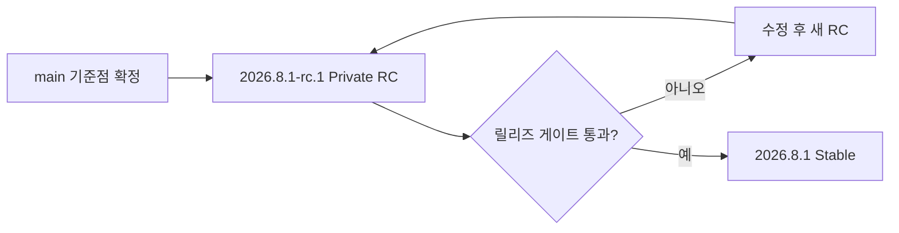
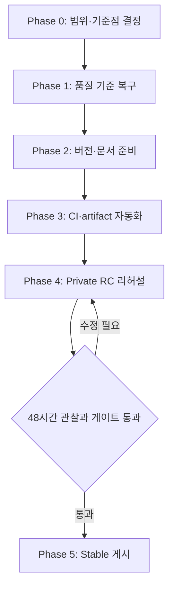

# 최초 릴리즈 계획

> 상태 기준: 2026-07-31 KST, `main`의 `cb0e12c` (`feat(aw): add agent orchestration workspace (#168)`).
>
> 이 문서는 기존 `first-release-plan.md`의 실행 계획과 `initial-release-research.md`의 조사 결과를 통합하고, 현재 GitHub·빌드·번들 상태를 다시 점검한 단일 기준 문서다.

## 결론

최초 릴리즈는 **Agentic Workbench(AW) 단독, Apple Silicon macOS용 Private RC**로 시작한다. 제품 핵심 흐름과 단위 테스트 기반은 충분하지만, 현재 `main` 또는 기존 `release/2026.31.0`을 바로 Stable로 게시할 수는 없다.

Stable 승격 전에 다음 네 가지를 완료해야 한다.

1. permission 결과 중복을 다루는 [#157](https://github.com/yoophi/agentic-workspace/issues/157)을 해결하고 회귀 테스트를 추가한다.
2. Rust 포맷과 strict clippy를 green으로 만들고, 이를 GitHub Actions PR 게이트로 고정한다.
3. macOS에서 검증 가능한 최종 DMG와 유효한 코드 서명 흐름을 만든다.
4. 실제 사용자 흐름과 데이터 업그레이드를 Private RC에서 검증한다.

권장 버전은 문서상 기존 CALVER 결정인 `YYYY.M.N`을 따른다. 첫 후보는 `2026.8.1-rc.1`, 정식 버전은 `2026.8.1`, 원격 annotated 태그는 각각 `v2026.8.1-rc.1`, `v2026.8.1`로 한다. 이는 제안된 제품 버전 정책이며, constitution 자체의 SemVer는 거버넌스 문서 버전에만 적용된다.



## 릴리즈 범위

### 포함

- `Agentic Workbench` macOS Apple Silicon `.app` 및 `.dmg`
- 프로젝트 등록, Git worktree 조회·생성·삭제
- worktree 세션에서의 ACP 실행, 출력·도구·권한 요청 확인, 후속 프롬프트 전송
- 파일·Markdown·SpecKit 미리보기와 Git 변경사항·diff 검토
- 버전·commit·tag를 보여 주는 About 정보
- GitHub Release, checksum, 설치·제약·Known Issues 문서

Codex와 Claude Code는 공식 지원 대상으로 한다. 두 ACP adapter는 각각 고정된 버전으로 실행된다. `pi-coding-agent`, `opencode`, Ralph Loop와 복잡한 child-agent orchestration은 **Experimental**로 표시한다.

### 제외

- Markdown Annotator, Git Explorer, Hushline의 독립 artifact
- Intel macOS, Windows, Linux의 공식 지원
- 자동 업데이트와 외부 레지스트리 패키지 배포
- 새 기능 이슈 구현과 저장 데이터 `schemaVersion` 전면 도입

열린 PR [#119](https://github.com/yoophi/agentic-workspace/pull/119)은 Markdown Annotator 및 공유 Markdown 패키지를 변경하며 현재 `DIRTY`, checks 0건이다. AW RC에는 병합하지 않고 범위 밖으로 명시한다.

## 현재 준비 상태

### 기준점·버전·이력

| 항목 | 현재 사실 | 릴리즈 영향 | 근거 |
| --- | --- | --- | --- |
| 기본 브랜치 | public 저장소의 `main`, HEAD `cb0e12c`, 총 198 커밋 | 최근 AW orchestration 변경 직후이므로 안정화 창이 필요 | `git log`, `git rev-list --count main` |
| 기존 RC 태그 | 로컬 경량 태그 `0.1.0-rc`는 `fe23607`을 가리키며 `main`의 조상이 아님 | 승격 기준으로 사용할 수 없음 | `git rev-list --left-right --count 0.1.0-rc...main` → `1 39` |
| 원격 release branch | `release/2026.31.0`은 `main`의 직접 자식 `c37bd44` | AW 단독 후보이나 Stable로 바로 승격 금지 | `git rev-list --left-right --count release/2026.31.0...main` → `1 0` |
| 버전 | `main`은 루트·모든 앱·crate가 `0.1.0`; `release/2026.31.0`은 루트와 AW의 네 manifest만 `2026.31.0` | 버전 정책과 동기화 대상 확정 필요 | `package.json`, `apps/agentic-workbench/{package.json,src-tauri/Cargo.toml,src-tauri/tauri.conf.json}` |
| 원격 릴리즈 | GitHub Release와 원격 tag 모두 0건 | 첫 배포 이력과 artifact 흐름이 없음 | `gh release list`, `git ls-remote --tags origin` |

`release/2026.31.0`은 버전만 준비한 오래된 branch가 아니라 현재 `main`의 바로 다음 커밋이다. 그러나 버전 형식이 ISO week 성격의 `2026.31.0`이고, 이 문서의 월별 순번 방침과 다르다. 이 branch를 채택·수정·폐기 중 하나로 명시적으로 결정한 뒤, 최종 기준점에서 새 RC 태그를 만들어야 한다.

### 코드와 제품 흐름

`openwiki/quickstart.md`와 `openwiki/agentic-workbench.md` 기준으로 AW에는 프로젝트·Git worktree 관리, ACP 세션 생성·재개, 권한 처리, 파일/Markdown/Mermaid/SpecKit 미리보기, 변경사항 검토, goal·saved prompt·agent profile 영속화가 구현되어 있다. 최근 병합 PR #163~#168도 Hushline 편입을 제외하면 AW workspace·렌더링·orchestration에 집중되어 있다.

저장 데이터는 JSON이지만 단순 덮어쓰기가 아니다. `apps/agentic-workbench/src-tauri/src/infrastructure/json_store.rs`는 임시 파일, backup, atomic rename, 손상 파일의 backup 복구와 단위 테스트를 제공한다. 다만 이전 설치본에서 새 앱으로 업그레이드하는 실제 E2E 증거는 없으므로 업그레이드 검증은 여전히 필수다.

기본 ACP 명령은 `npx -y`로 adapter를 실행한다(`crates/acp-agent-core/src/infrastructure/agent_catalog.rs`). 따라서 Git 외에도 Node/npm 네트워크, agent CLI 인증과 PATH에 런타임 의존성이 있다. `docs/acp-agent-command-override.md`에 환경변수와 PATH 결합 정책은 문서화되어 있으나, 깨끗한 사용자 계정에서의 실측은 남아 있다.

### 자동 검증과 품질 게이트

2026-07-31 현재 실행 결과는 다음과 같다.

| 검증 | 결과 | 해석 |
| --- | --- | --- |
| `pnpm run check-types` | 통과 | 11개 workspace 패키지의 TypeScript 타입 검사가 green |
| `pnpm run test` | 통과 | AW와 shared package, Hushline Rust test를 포함한 현재 Turbo test가 green |
| `pnpm run build` | 통과 | 프론트엔드 production build는 생성됨. AW의 1.28 MB entry chunk 등 500 KB 초과 경고는 별도 성능 관찰 대상 |
| `cargo test --workspace --all-targets` | 통과 | 현재 Rust 테스트는 green |
| `cargo fmt --check` | 실패 | 여러 Rust 파일이 포맷 기준과 다름 |
| `cargo clippy --workspace --all-targets` | 통과 | 기본 warning 수준에서는 성공 |
| `cargo clippy --workspace --all-targets -- -D warnings` | 실패 | `crates/git-core/src/git_cli.rs` test literal의 `\\02026` 관련 clippy error 8건이 warning을 error로 승격 |
| `git diff --check` | 통과 | 문서 변경에 공백 오류 없음 |

따라서 “전체 검증 통과”는 TypeScript·현재 테스트 범위에는 맞지만, 최초 릴리즈 CI의 strict quality gate까지 green이라는 뜻으로 쓰면 안 된다.

### macOS artifact와 신뢰 상태

`apps/agentic-workbench/src-tauri/tauri.conf.json`은 `bundle.active: true`, `targets: "all"`, `icon.icns`를 설정한다. 이번 점검에서 Apple Silicon `.app`은 생성되었고, 25 MB의 임시 `rw.*.dmg` 이미지도 생성되었다. 하지만 이는 배포 완료가 아니다.

- DMG 생성 명령이 Finder 기반 패키징 단계에서 종료하지 않아 최종 배포 파일이 남지 않았다. headless GitHub macOS runner에서의 DMG 생성 방식을 검증해야 한다.
- 생성된 앱은 ad-hoc 서명이며 `codesign --verify --deep --strict`와 `spctl -a -vv`가 모두 실패했다.
- signing identity, entitlements, notarization credential, stapling, updater 설정이 저장소와 workflow에 없다.
- `Info.plist`는 Apple Silicon thin binary와 기본 `LSMinimumSystemVersion` 10.13을 보여 준다. 실제 지원 최소 macOS와 Intel 지원 여부는 선언·검증되지 않았다.

따라서 현재 artifact는 내부 빌드 확인용일 뿐 Private RC 배포본도 아니다. 최종 DMG, 유효한 서명 검증, 설치 smoke를 RC 게이트로 둔다.

### GitHub 운영 상태

| 영역 | 현재 사실 | 조치 |
| --- | --- | --- |
| Actions | `.github/workflows/openwiki-update.yml` 하나만 존재 | PR 검증과 릴리즈 workflow 추가 |
| Actions 건강도 | 7월 27~30일 scheduled OpenWiki run 4회 연속 실패 | 수정하거나 schedule을 의도적으로 중단 |
| 실패 원인 | workflow는 빈 `OPENROUTER_API_KEY`를 전달하지만 전역 `openwiki`가 non-interactive `OPENAI_API_KEY`를 요구 | 설치 버전·secret 이름·실행 provider를 정합화 |
| 이슈 | 열린 이슈 11건: bug 1, enhancement 9, 무라벨 1; milestone·assignee 없음 | #157을 RC blocker로 triage하고 나머지는 v2 이후로 분류 |
| 법적·지원 | public repo이나 `LICENSE`, `CHANGELOG.md`, `SECURITY.md` 없음 | Stable 공개 전 추가 |

[#157](https://github.com/yoophi/agentic-workspace/issues/157)은 permission 요청을 사용자 선택 결과로 갱신하지 못해 중복 행이 표시되는 결함이다. 완료 조건에는 승인·거부·취소, 복수 요청, 재연결·복원과 테스트가 포함된다. 권한은 AW의 핵심 안전 경계이므로 Private RC 이전 차단 이슈로 처리한다.

10개 SpecKit `tasks.md`에는 체크되지 않은 항목이 총 26개 남아 있다. 대부분은 auto refresh, session performance, agent profile/PATH, workspace panel 격리, SDD controls 등의 수동 GUI·성능·호환성 확인이다. 모두를 일반적인 기능 미구현으로 간주하지는 않되, 아래 RC 사용자 시나리오와 겹치는 항목은 검증 기록으로 닫아야 한다.

## 릴리즈 단계



### Phase 0 — 릴리즈 계약과 기준점 결정, 반나절

1. AW 단독·Apple Silicon macOS·Private RC라는 범위를 고정한다.
2. `release/2026.31.0`을 기준 branch로 채택·수정·폐기 중 하나로 결정한다. 어떤 선택이든 final `main` 기준에서 새 release branch를 만들고 `0.1.0-rc`는 역사적 로컬 태그로만 남긴다.
3. 버전 규칙을 `YYYY.M.N`으로 확정하고 `2026.8.1-rc.1`의 package version, Cargo version, Tauri version, Git tag 관계를 기록한다.
4. signing 정책을 결정한다. Private RC는 유효한 ad-hoc signature와 설치 제한으로 운영할 수 있지만, public Stable은 Developer ID signing·notarization을 필수로 한다.
5. #119를 이번 기준점에서 제외하고, #157을 release blocker로 지정한다.

### Phase 1 — 품질 기준 복구, 1일

1. `cargo fmt --all` 결과를 검토·적용하고 `cargo fmt --all -- --check`를 green으로 만든다.
2. `git_cli.rs` test fixture의 null delimiter literal을 의도에 맞게 `\\x00` 등으로 수정해 strict clippy를 green으로 만든다.
3. 깨끗한 checkout에서 다음 명령을 다시 실행해 결과를 릴리즈 PR에 남긴다.

```sh
corepack enable
pnpm install --frozen-lockfile
pnpm run check-types
pnpm run test
pnpm run build
cargo fmt --all -- --check
cargo clippy --workspace --all-targets -- -D warnings
cargo test --workspace --all-targets
```

4. `git-graph`의 테스트 부재와 대형 frontend chunk는 Stable 차단으로 보지 않되, Known Issues 또는 후속 성능 작업으로 등록한다.

### Phase 2 — 버전·문서·지원 기반, 1일

1. `scripts/sync-version.mjs`를 추가해 루트 `package.json`, AW `package.json`, AW `src-tauri/Cargo.toml`, AW `tauri.conf.json`을 한 명령으로 갱신한다.
2. About 화면이 RC의 version·commit·tag를 정확히 보이는지 검증한다. 버전은 AW `package.json`, commit/tag는 CI 환경 또는 Git에서 주입된다(`apps/agentic-workbench/src-tauri/build.rs`).
3. `LICENSE`, `CHANGELOG.md`, README의 설치 요구사항·지원 macOS/아키텍처·ACP 사전 조건을 추가한다.
4. Release Notes 템플릿에 지원 범위, Experimental 기능, Known Issues, 로컬 데이터·permission 모델, 지원과 보안 신고 경로를 넣는다.

### Phase 3 — CI와 신뢰 가능한 artifact, 1~2일

PR workflow는 macOS runner에서 아래를 실행하고 artifact를 업로드한다.

```sh
pnpm install --frozen-lockfile
pnpm run check-types
pnpm run test
pnpm run build
cargo fmt --all -- --check
cargo clippy --workspace --all-targets -- -D warnings
cargo test --workspace --all-targets
pnpm --filter @yoophi/agentic-workbench exec tauri build --bundles app,dmg
```

tag workflow는 동일한 검증 뒤 다음을 수행한다.

- non-interactive macOS에서 완료되는 DMG 생성 방식을 사용한다.
- RC에는 검증 가능한 ad-hoc signing, Stable에는 Developer ID signing·notarization·stapling을 수행한다.
- `hdiutil verify`, `codesign --verify --deep --strict --verbose=2`, Stable의 `spctl` 평가를 통과시킨다.
- DMG, SHA-256, 빌드 commit, tag와 release notes를 GitHub prerelease 또는 release에 게시한다.

OpenWiki workflow는 release workflow와 분리한다. 다만 현재 red 상태를 그대로 둘 수 없으므로, OpenAI/OpenRouter provider 설정을 수정하거나 schedule을 명시적으로 중단한다.

### Phase 4 — Private RC 리허설, 2일 + 48시간 관찰

새 macOS 사용자 계정 또는 별도 Mac에서 `v2026.8.1-rc.1` artifact를 검증하고 결과를 릴리즈 PR에 남긴다.

| 시나리오 | 통과 기준 |
| --- | --- |
| 설치·첫 실행 | DMG에서 Applications로 복사, 서명 정책에 맞는 Gatekeeper 동작과 앱 기동 |
| 기본 업무 흐름 | 프로젝트 등록 → worktree 생성 → 세션 → 파일 변경 → diff 검토 |
| ACP 지원 | Codex·Claude Code 각각 새 세션과 재개 세션, 인증·npx·PATH 실패 안내 |
| permission | 승인·거부·취소·선택 없음, 복수 요청, 재시작/복원 후 중복 없음 (#157) |
| 경로·창 | 한글·공백·특수문자 경로, 다중 창 이벤트/권한 격리, About/Window 메뉴 |
| 장기 동작 | auto refresh, 장시간 idle, 기본 orchestration delegation·cancel·retry |
| 데이터 | 이전 RC의 project, prompt, agent settings, session, layout 유지 및 손상 backup 복구 |

관찰 기간에 permission·데이터 손상·실행 불가 결함이 나오면 Stable을 만들지 않고 `rc.2`를 만든다.

### Phase 5 — Stable 게시, 반나절

모든 게이트가 green이면 `v2026.8.1` annotated tag를 push하고 GitHub Release를 게시한다. Stable artifact와 release note에는 SHA-256, 빌드 commit, 지원 환경, 설치 지침, Known Issues, rollback/지원 경로를 포함한다.

## 완료 기준

다음 조건을 모두 만족할 때 최초 Stable 릴리즈를 완료로 판단한다.

- [ ] 최신 릴리즈 기준점과 RC/Stable annotated tag가 원격에 존재하고 계보가 명확하다.
- [ ] AW의 네 version manifest와 About 표시, Git tag가 의도한 CALVER 값으로 일치한다.
- [ ] #157이 해결되고 permission 회귀 테스트와 수동 검증 기록이 있다.
- [ ] frozen install, TypeScript, build, fmt, strict clippy, Rust test가 PR CI에서 green이다.
- [ ] non-interactive macOS CI가 최종 DMG를 생성하고 artifact·checksum을 업로드한다.
- [ ] `codesign --verify --deep --strict`와 DMG 무결성 검증이 통과한다.
- [ ] public Stable은 Developer ID signing, notarization, stapling 및 Gatekeeper 평가를 통과한다.
- [ ] 별도 환경의 핵심 E2E·업그레이드·복구 시나리오가 통과한다.
- [ ] LICENSE, CHANGELOG, 설치·지원·보안·Known Issues 문서와 GitHub Release가 준비되어 있다.

## 근거와 재현 명령

주요 상태는 다음 1차 자료에서 확인했다.

- `openwiki/quickstart.md`, `openwiki/agentic-workbench.md`
- `.github/workflows/openwiki-update.yml` 및 [최신 실패 run](https://github.com/yoophi/agentic-workspace/actions/runs/30534927689)
- `apps/agentic-workbench/src-tauri/tauri.conf.json`, `build.rs`, `infrastructure/json_store.rs`
- [#157](https://github.com/yoophi/agentic-workspace/issues/157), [#119](https://github.com/yoophi/agentic-workspace/pull/119), `release/2026.31.0`의 [`c37bd44`](https://github.com/yoophi/agentic-workspace/commit/c37bd44a0f025ddc61afe9e3690857d79685c1a4)

```sh
git rev-list --left-right --count 0.1.0-rc...main
git rev-list --left-right --count release/2026.31.0...main
git ls-remote --tags origin
gh issue list --state open --limit 100
gh release list --limit 100
gh run view 30534927689 --log-failed
find specs -name tasks.md -print0 | xargs -0 rg -n '^- \[ \]'
```
