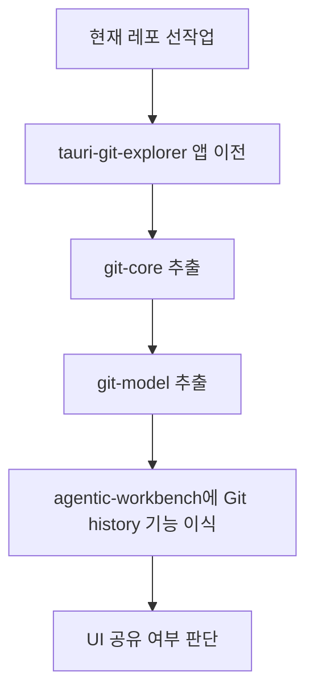
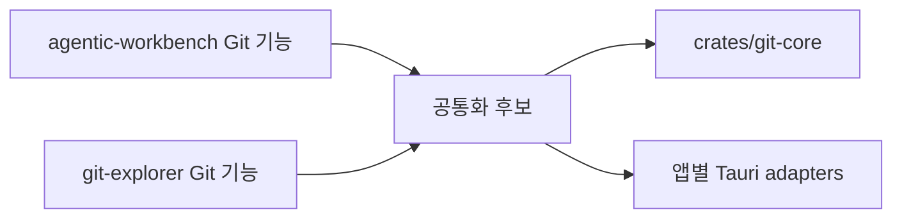
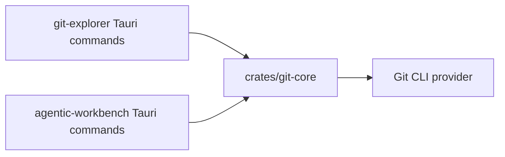

# tauri-git-explorer 모노레포 이전 선행 작업

## 배경

`../tauri-git-explorer` 프로젝트를 현재 `agentic-workspace` 모노레포로 이전한 뒤, Git history, commit graph, commit detail, file diff 기능을 Agentic Workbench 앱에 이식하려고 한다. 참고 문서인 `/Users/yoophi/project/tauri-git-explorer/docs/monorepo-common-module-management.md`는 두 앱을 단일 pnpm/Turbo workspace로 관리하고, 초기에는 Rust Git core와 TypeScript graph model을 먼저 공유하는 방향을 제안한다.

현재 레포는 이미 pnpm workspace와 Turbo를 사용하지만, `tauri-git-explorer`를 그대로 가져오기 전에 정리해야 할 항목이 있다. 이 문서는 현재 레포에서 선작업해야 하는 항목만 식별한다.

## 현재 레포 상태

현재 `agentic-workspace` 레포의 주요 구조는 다음과 같다.

```text
apps/
  agentic-workbench/
    src/
    src-tauri/
docs/
package.json
pnpm-workspace.yaml
turbo.json
```

확인된 특징:

- 루트 `pnpm-workspace.yaml`은 이미 `apps/*`, `packages/*`를 포함한다.
- 루트 `package.json`은 Turbo 기반 `build`, `check-types`, `test`, `tauri:dev` script를 가진다.
- 현재 앱 package 이름은 `@yoophi/agentic-workbench`다.
- Rust는 `apps/agentic-workbench/src-tauri` 내부 단일 crate다.
- 루트 `Cargo.toml` workspace는 아직 없다.
- 현재 레포에도 Git branch, worktree, remote, worktree changes 기능이 있다.
- 루트에 untracked `acp-minimal-app-main/` 디렉터리가 있다.

## 이전 대상 프로젝트 상태

`tauri-git-explorer`의 주요 구조는 다음과 같다.

```text
apps/
  desktop/
    src/
    src-tauri/
packages/
  ui/
```

확인된 특징:

- pnpm workspace를 사용한다.
- 앱 package 이름은 현재 `desktop`이다.
- `packages/ui`에 `@yoophi/ui` 공통 UI package가 있다.
- Rust는 `apps/desktop/src-tauri` 내부 단일 crate다.
- Git 기능은 Rust `domain`, `application`, `adapters`로 나뉘어 있지만 재사용 crate는 아직 없다.
- Git history, graph, commit detail, diff, repository watcher 기능을 가진다.

## 선작업 개요

권장 진행은 다음과 같다.



현재 레포에서 먼저 해야 하는 일은 `tauri-git-explorer` 코드를 옮기는 작업 자체가 아니라, 옮겼을 때 충돌하지 않을 workspace 기준과 공통 모듈 경계를 만드는 것이다.

## 1. Untracked 디렉터리 처리

현재 루트에 `acp-minimal-app-main/` 디렉터리가 untracked 상태로 존재한다. 이전 작업 중 `apps/*`, package lock, Turbo task를 만질 때 혼동을 만들 수 있다.

선택지는 셋이다.

- 삭제한다.
- `.gitignore`에 명시적으로 추가한다.
- 정식 앱 또는 reference source로 편입한다.

이전 작업 전에 이 디렉터리의 용도를 결정해야 한다. 현재 문맥에서는 `tauri-git-explorer` 이전과 직접 관련이 없으므로, 최소한 PR diff에 섞이지 않도록 관리해야 한다.

## 2. 앱 이름과 경로 기준 확정

현재 앱은 `apps/agentic-workbench`이고 package 이름은 `@yoophi/agentic-workbench`다. 참고 문서의 예시는 `apps/acp-minimal` 또는 `apps/acp-app` 기준이라 현재 레포와 다르다.

선행 결정:

- 현재 앱 경로를 `apps/agentic-workbench`로 유지할지 결정한다.
- `tauri-git-explorer`를 `apps/git-explorer`로 가져올지, 원래 이름에 가까운 `apps/tauri-git-explorer`로 가져올지 결정한다.
- 앱 package 이름 규칙을 정한다.

권장안:

```text
apps/
  agentic-workbench/
  git-explorer/
```

```json
{
  "name": "@yoophi/git-explorer"
}
```

현재 앱 이름은 유지하고, 이전 대상 앱만 `apps/git-explorer`와 `@yoophi/git-explorer`로 정리하는 방식이 가장 작은 변경이다.

## 3. 루트 workspace 이름 정리

루트 `package.json`의 이름은 `agentic-workspace`로 둔다. `agentic-workbench`는 통합 앱 이름으로 유지하고, 루트 workspace는 Git explorer, Markdown annotator, Mermaid annotator 같은 미니앱과 공통 모듈을 함께 담는 상위 단위로 표현한다.

결정된 방향:

- 루트 package 이름은 `agentic-workspace`로 사용한다.
- `apps/agentic-workbench`와 `@yoophi/agentic-workbench`는 통합 앱 identity로 유지한다.
- 이후 추가되는 미니앱은 `apps/git-explorer`, `apps/markdown-annotator`, `apps/mermaid-annotator`처럼 앱 단위 이름을 사용한다.

루트 `package.json`:

```json
{
  "name": "agentic-workspace",
  "private": true
}
```

이 구분은 repo와 통합 앱의 이름을 분리한다. 따라서 root README와 root package는 `Agentic Workspace`를 설명하고, Tauri product name, bundle identifier, Rust crate, app package는 `Agentic Workbench`를 유지한다.

## 4. 루트 script 확장

현재 루트 script는 `@yoophi/agentic-workbench`만 대상으로 하는 script가 있다.

현재 예:

```json
{
  "dev": "turbo run dev --filter=@yoophi/agentic-workbench",
  "tauri:dev": "turbo run tauri:dev --filter=@yoophi/agentic-workbench --"
}
```

두 앱 체제로 가기 전에 앱별 script 이름을 분리해야 한다.

권장 script:

```json
{
  "dev:workbench": "turbo run dev --filter=@yoophi/agentic-workbench",
  "dev:git": "turbo run dev --filter=@yoophi/git-explorer",
  "tauri:workbench": "turbo run tauri --filter=@yoophi/agentic-workbench --",
  "tauri:git": "turbo run tauri --filter=@yoophi/git-explorer --",
  "tauri:dev:workbench": "turbo run tauri:dev --filter=@yoophi/agentic-workbench --",
  "tauri:dev:git": "turbo run tauri:dev --filter=@yoophi/git-explorer --"
}
```

기존 `dev`, `tauri`, `tauri:dev`를 유지할지 여부는 별도 결정이다. 유지한다면 기본 앱이 `agentic-workbench`임을 문서화해야 한다.

## 5. pnpm workspace 설정 병합 준비

현재 레포의 `pnpm-workspace.yaml`은 이미 기본 구조를 만족한다.

```yaml
packages:
  - "apps/*"
  - "packages/*"
```

`tauri-git-explorer` 쪽 workspace에는 `allowBuilds` 설정이 있다.

```yaml
allowBuilds:
  esbuild: true
  msw: false
```

이전 전에 이 설정을 현재 루트에 병합할지 확인해야 한다. lockfile 재생성 과정에서 build script 허용 정책이 달라질 수 있기 때문이다.

## 6. packages 디렉터리 운영 기준 수립

현재 레포에는 `packages` 디렉터리가 없다. `tauri-git-explorer`는 `packages/ui`를 가지고 있다.

초기에는 UI package를 바로 공통화하지 않는 것이 좋다. 두 앱의 화면 목적과 UI primitive가 다르기 때문이다.

선행 기준:

- `packages/git-model`은 초기 공유 대상으로 허용한다.
- `packages/ui`는 이전 앱이 빌드되기 위해 필요하면 가져오되, 곧바로 `agentic-workbench`에서 사용하지 않는다.
- `packages/git-ui`는 Git history UI가 실제로 얼마나 같은지 확인한 뒤 만든다.

초기 후보:

```text
packages/
  git-model/
  ui/
```

`git-model`에는 UI framework 의존이 약한 타입과 graph layout helper만 둔다.

## 7. Rust workspace 전략 결정

두 프로젝트 모두 현재는 Tauri 앱 내부에 독립 Rust crate가 있다. Git 기능을 제대로 공유하려면 `crates/git-core`를 둘 수 있는 Rust workspace 전략이 필요하다.

선행 결정:

- 루트 `Cargo.toml` workspace를 도입할지 결정한다.
- `apps/*/src-tauri` crate를 workspace member로 넣을지 결정한다.
- `crates/git-core`를 workspace member로 둘지 결정한다.
- Cargo lockfile을 루트로 통합할지, 앱별 lockfile을 유지할지 결정한다.

권장 방향:

```text
crates/
  git-core/
apps/
  agentic-workbench/
    src-tauri/
  git-explorer/
    src-tauri/
Cargo.toml
```

공통 crate는 Tauri에 의존하지 않고, 앱별 Tauri command adapter는 각 앱의 `src-tauri`에 유지한다.

## 8. Git domain 충돌 맵 작성

현재 `agentic-workbench`에도 Git 관련 domain과 provider가 있다.

현재 보유 기능:

- branch
- worktree
- remote
- worktree changes
- file-level worktree change

`tauri-git-explorer` 보유 기능:

- repository
- branch
- worktree
- history
- commit
- graph
- commit detail
- diff
- repository watcher

이전 전에 같은 이름의 개념을 어떻게 다룰지 정해야 한다.



초기 공통화 후보:

- history query
- commit graph parser
- commit detail parser
- diff parser

초기에는 앱별로 남길 후보:

- worktree 생성/삭제 UX
- repository persistence
- Tauri command DTO
- watcher lifecycle
- permission/capability 정책

## 9. Tauri command namespace 정책

단일 레포가 되어도 공통 crate가 Tauri command를 직접 제공하면 안 된다. command 이름, request DTO, capability, validation은 앱별로 다를 수 있다.

선행 규칙:

- `crates/git-core`는 순수 domain, parser, service, provider port만 제공한다.
- `apps/git-explorer/src-tauri`는 git explorer 전용 command adapter를 유지한다.
- `apps/agentic-workbench/src-tauri`는 agentic workbench 전용 command adapter를 유지한다.
- command 이름 충돌은 앱별 binary 내부 문제로 제한한다.

구조는 다음과 같다.



## 10. Turbo와 CI 영향 범위 설계

현재 `turbo.json`은 기본 task만 정의한다. 앱이 두 개가 되고 공통 package가 생기면 영향 범위 기준을 정해야 한다.

권장 기준:

- `packages/git-model/**` 변경: 양쪽 앱 typecheck
- `crates/git-core/**` 변경: `git-core` test와 양쪽 Tauri 앱 cargo check
- `apps/git-explorer/**` 변경: git explorer 앱 검증
- `apps/agentic-workbench/**` 변경: agentic workbench 앱 검증
- `packages/ui/**` 변경: 해당 package를 사용하는 앱만 검증

초기에는 복잡한 affected rule을 만들기보다 Turbo filter와 CI job을 명시적으로 나누는 편이 안전하다.

## 11. Git 기능 이식 전 추출 순서

현재 앱에 Git 기능을 바로 복사하지 말고, 먼저 재사용 경계를 만든다.

권장 추출 순서:

1. `tauri-git-explorer`를 `apps/git-explorer`로 이전한다.
2. `crates/git-core`를 만든다.
3. history, graph, commit detail, diff domain과 parser를 `git-core`로 옮긴다.
4. `apps/git-explorer`가 먼저 `git-core`를 사용하게 한다.
5. `packages/git-model`을 만든다.
6. commit graph type, query option type, `computeGitGraphRows`, layout fixture를 `git-model`로 옮긴다.
7. `apps/agentic-workbench`에 history command와 Git history UI를 추가한다.
8. UI 공유가 실제로 필요한지 판단한다.

## 선행 작업 체크리스트

- [ ] `acp-minimal-app-main/` 처리 방향 결정
- [ ] 현재 앱 경로와 package 이름 유지 여부 결정
- [ ] `tauri-git-explorer` 이전 대상 경로와 package 이름 결정
- [x] 루트 package 이름을 `agentic-workspace`로 사용
- [ ] 앱별 root script 이름 추가
- [ ] `pnpm-workspace.yaml`의 `allowBuilds` 병합 여부 확인
- [ ] `packages/git-model` 운영 기준 문서화
- [ ] `packages/ui`를 이전 앱 빌드용으로만 둘지 결정
- [ ] 루트 Rust workspace 도입 여부 결정
- [ ] `crates/git-core` 책임 범위 확정
- [ ] 현재 Git domain과 git explorer Git domain 충돌 맵 작성
- [ ] 앱별 Tauri command adapter 유지 원칙 확정
- [ ] Turbo/CI 검증 범위 기준 확정

## 결론

현재 레포는 이미 pnpm workspace와 Turbo를 사용하므로 `tauri-git-explorer`를 앱 단위로 이전할 기본 골격은 갖춰져 있다. 그러나 Rust workspace, 공통 Git core, TypeScript git model, 앱별 script, package naming은 아직 준비되어 있지 않다.

가장 중요한 선작업은 `tauri-git-explorer` 코드를 가져오기 전에 현재 레포의 workspace 정체성과 공통화 경계를 확정하는 것이다. 초기 공유 대상은 UI가 아니라 `crates/git-core`와 `packages/git-model`이어야 한다. Git explorer 앱 이전 후에는 해당 앱이 먼저 공통 core/model을 사용하게 만들고, 그 다음 `agentic-workbench`에 Git history와 diff 관련 기능을 이식하는 순서가 안전하다.
