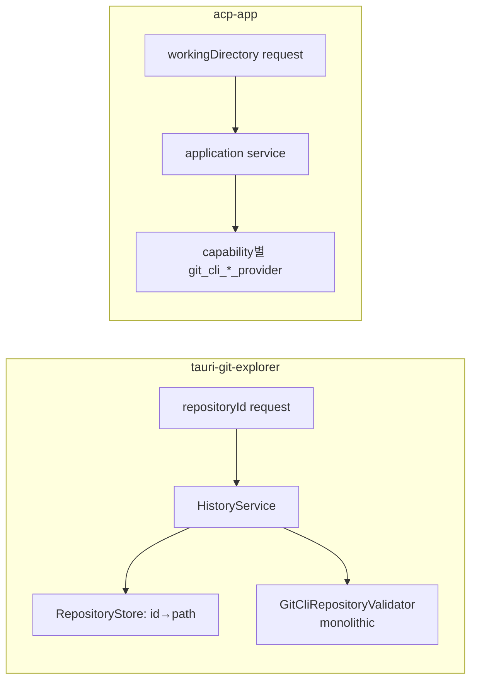
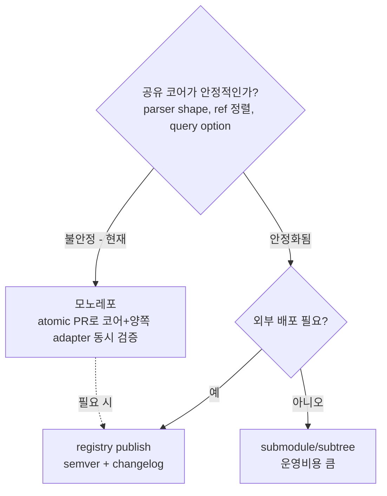
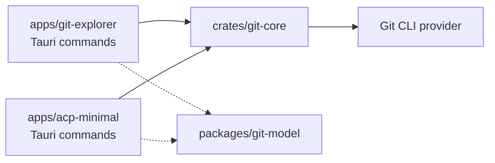
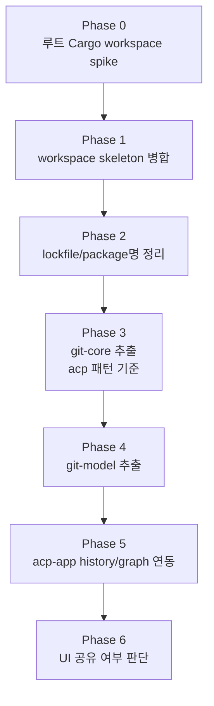

# Git 기능 공유 및 모노레포 전략 (종합 결정 문서)

## 문서 위치와 목적

이 문서는 `tauri-git-explorer`의 다음 두 문서를 종합하고 검토 의견을 더한 결정 문서다.

- `tauri-git-explorer/docs/git-feature-module-export-plan.md` (이하 **모듈화 계획**)
- `tauri-git-explorer/docs/monorepo-common-module-management.md` (이하 **모노레포 검토**)

목표는 `tauri-git-explorer`의 Git history / commit graph / commit detail / file diff 기능을 `acp-app`(이 레포, `acp-minimal-app`)에 재사용 가능한 형태로 제공하는 것이다. 이 문서는 "무엇을 공유할지", "어떤 방식으로 공유할지", "어떤 순서로 실행할지"를 확정한다.

> 두 원본 문서는 방향이 옳고 서로 일관된다. 이 문서는 그 결론을 유지하되, **공유 방식 선택을 재프레이밍**하고 **실행 순서를 일원화**하며 **과소평가된 리스크를 격상**하는 데 초점을 둔다. 검토자 의견은 `> 의견` 블록으로 표시한다.

## 현재 상태 (실측 기준)

`acp-minimal-app` 레포를 실제로 확인한 결과는 다음과 같다. 원본 문서의 서술과 일치한다.

### acp-app (`acp-minimal-app`)

- pnpm workspace + Turbo. 루트 package 이름은 `acp-minimal-app`, 앱은 `@acp/desktop`.
- `packages/` 디렉터리 없음. 루트 `Cargo.toml` workspace 없음 (`apps/desktop/src-tauri/Cargo.toml` 독립).
- Rust는 hexagonal: `domain / application / inbound / infrastructure / ports`.
- Git provider가 **capability별로 이미 분리**되어 있음.
  - `git_cli_branch_provider`, `git_cli_remote_provider`, `git_cli_worktree_provider`, `git_cli_worktree_changes_provider`
- Git 조회는 대부분 `workingDirectory` 기반. project id를 요구하지 않음.
- worktree 생성/삭제, worktree 변경사항/diff 기능이 이미 있음.
- commit history / graph / commit detail / historical file diff 기능은 **없음** → 제공 대상.

### tauri-git-explorer

- pnpm workspace, `packages/ui`(`@yoophi/ui`) 보유. 루트 Cargo workspace 없음.
- Rust hexagonal이지만 Git port 경계가 다름: `GitCliRepositoryValidator` 하나가 validator/branch/worktree/history reader를 모두 구현.
- Git 조회가 `repositoryId` 중심. `RepositoryStore`에서 path를 찾음.
- commit graph layout helper(`computeGitGraphRows`)가 React 순수 함수로 존재.
- history/graph/detail/diff UI가 거대한 `ChangesPanel` 한 파일에 집중.



> **의견 — git-core 설계 템플릿은 acp-app이 이긴다.** acp-app의 capability별 provider 분리가 더 성숙하다. 공통 crate는 tauri-git-explorer의 monolithic validator를 쪼개는 방향이 아니라, **acp-app의 분리 패턴을 기준 설계로 삼아** tauri-git-explorer를 거기에 맞춰야 한다. 이식 비용이 최소가 되고, 뒤의 "병합 먼저" 결론을 강화한다.

## 무엇을 공유하는가 (공유 경계)

앱 전체가 아니라, **Tauri와 UI 디자인 시스템에 묶이지 않은 코어만** 공유한다.

| 대상 | 공유 단위 | 시점 |
|---|---|---|
| Git history/graph/detail/diff domain + query + CLI parser | `crates/git-core` (Rust) | 1순위 |
| commit graph 타입 + `computeGitGraphRows` + query option normalizer | `packages/git-model` (TS) | 2순위 |
| 공통 UI primitive | `packages/ui` | 중복 확인 후 |
| history graph view/row, commit file tree, diff viewer | `packages/git-ui` (TS) | 디자인 시스템 정리 후 |
| ACP workbench core | `crates/acp-workbench-core` | 타 앱 수요 확정 후 |

공유에서 **명시적으로 제외**하는 것:

- branch/worktree 타입 (양쪽 shape가 다름 — tauri-git-explorer `fullName`/`worktreePath` vs acp-app `name`/`isCurrent`/`isRemote`)
- 파일 watcher (앱별 invalidation 정책이 다름)
- Tauri command / capability / persistence schema / permission 정책 (앱별 inbound adapter에 유지)

### path 기반 port 재설계 (핵심)

`repositoryId` 중심 API를 `working_directory`(path) 기반으로 바꾼다. 이것이 두 앱을 동시에 만족시키는 유일한 경계다.

```rust
pub trait GitHistoryProvider {
    fn list_history(&self, working_directory: &str, options: GitCommitQuery)
        -> Result<GitCommitHistory, GitError>;
    fn get_commit_graph(&self, working_directory: &str, options: GitCommitQuery)
        -> Result<GitCommitGraph, GitError>;
    fn get_commit_detail(&self, working_directory: &str, commit_hash: &str)
        -> Result<GitCommitDetail, GitError>;
    fn get_file_diff(&self, working_directory: &str, commit_hash: &str, file_path: &str)
        -> Result<GitCommitFileDiff, GitError>;
}

pub struct GitCommitQuery {
    pub limit: usize,
    pub offset: usize,
    pub included_refs: Vec<String>,
    pub excluded_refs: Vec<String>,
}
```

- `tauri-git-explorer`: repository id를 path로 변환하는 **facade**만 남기고 provider 호출.
- `acp-app`: worktree path를 바로 넣어 호출. registry 검증 불필요, `workingDirectory` blank/limit clamp만 application service에서 수행.
- crate 내부 에러는 `GitError` enum으로 두되, 각 앱 command는 `error.to_string()`으로 변환해 외부 API를 흔들지 않는다.

## 공유 방식: 외부 모듈화 vs 모노레포

원본 문서들은 이를 동급 대안처럼 비교하지만, 실제로는 **양자택일이 아니라 단계 전환**이다.

### 모듈화 계획의 균열

모듈화 계획 Phase 3-5는 acp-app이 공유 코드를 **"복사 또는 workspace dependency로 연결"**한다고 적었다. 그러나:

- **복사** → 버전 skew/드리프트로 직행. 공유 목적 자체가 사라진다.
- **workspace dependency** → 그건 이미 모노레포라는 뜻. 별도 레포로는 성립하지 않는다.

별도 레포를 유지하며 Rust crate를 공유하는 현실적 수단은 **git submodule/subtree** 또는 **registry publish**뿐인데, 공유 페이로드(파서 하나 + 타입 몇 개)에 비해 운영 비용이 과하다.

### 재프레이밍: 지금은 모노레포, 안정화·배포 수요가 생기면 publish



지금 공유 표면은 **작지만 불안정**하다. ref 정렬 규칙, query option, commit graph response shape가 두 앱을 붙이는 과정에서 반드시 출렁인다. 이 단계에서 가장 가치 있는 속성이 **atomic PR**(코어 + 양쪽 Tauri adapter + 양쪽 typecheck를 한 PR에서 검증)이다.

> **의견 — 현 시점 결론: 모노레포가 명확히 우세.** 단일 유지보수자, 작지만 불안정한 공유 표면, 외부 배포 수요 없음 → 모노레포의 atomic PR 이점이 비용을 압도한다. 별도 레포 + submodule은 (a) release 주기 독립, (b) 한 앱만 공개/권한 분리, (c) 제3 프로젝트에 stable version 제공 중 하나가 **가까운 시일 내** 필요할 때만 정당화된다. 그 시점이 오면 안정화된 `git-core`를 publish로 승격하면 된다.

### 모노레포의 실질 이점 (원본 문서 정리 + 동의)

1. Rust path dependency가 단순해짐: `git-core = { path = "../../crates/git-core" }`.
2. TS workspace dependency 공유: `"@workspace/git-model": "workspace:*"`.
3. **원자적 PR**: 공통 변경 + 양쪽 adapter + 양쪽 검증을 한 PR에서.
4. 단일 CI/Turbo 파이프라인에서 영향 범위 추적, 공통 test fixture 공유.
5. Git CLI parser 중복을 단계적으로 비교·통합.
6. 설계 문서를 한 `docs` 체계에서 관리.

### 모노레포의 비용 (인지하고 진행)

- 레포 책임 증가(issue/PR/CI/release tag 혼재).
- 과한 공통화 압력 → branch/worktree 타입을 성급히 합치면 optional field로 비대해짐.
- 공통 crate 1건 수정에 두 Tauri 앱 검증 필요 → CI 시간 증가(affected task로 완화).
- release 전략 복잡(앱별 배포 주기 상이).
- lockfile 하나에서 React/Vite/TS/Tauri 버전 차이 관리.
- 루트 Cargo workspace 도입 결정 필요 (아래 리스크 참조).

## 권장 결정

1. 두 앱을 **단일 pnpm/Turbo workspace**로 관리한다.
2. **중립 신규 workspace**로 병합한다. 한 앱 레포에 다른 앱을 흡수시키지 않는다.
   - 워크스페이스명: 제품명이 아닌 중립명(예: `yoophi-desktop-workspace`).
   - 앱 폴더: `apps/git-explorer`, `apps/acp-minimal`.
   - 앱 package명: `@workspace/git-explorer`, `@workspace/acp-minimal`.
3. Rust는 `crates/git-core`부터 추출한다 (acp-app provider 분리 패턴 기준).
4. TS는 `packages/git-model`(graph layout helper)부터 추출한다.
5. UI package는 실제 중복이 확인된 뒤 늦게 추출한다.
6. 앱별 Tauri command adapter / capability / persistence / permission은 독립성을 유지한다.



### 공통 모듈 승격 기준

다음 중 **둘 이상**을 만족할 때만 `packages`/`crates`로 올린다. "같은 레포니까 일단 공유"하는 과분리를 막는다.

- 두 앱이 같은 코드 변경을 반복해서 필요로 한다.
- 타입/동작 불일치가 버그를 만들고 있다.
- 앱별 adapter만 다르고 core 로직은 거의 같다.
- 공통 test fixture로 검증할 수 있다.
- UI primitive 의존 없이 headless하게 만들 수 있다.

## 실행 순서 (일원화)

> **의견 — 추출보다 병합이 먼저다.** 모듈화 계획은 "tauri-git-explorer 안에서 git-core 추출 → 이후 acp-app 연동" 순인데, 모노레포로 갈 거라면 그건 **tauri-git-explorer 레이아웃에 맞춰 추출했다가 병합 후 다시 재배치**하는 이중 작업이다. 모노레포 검토의 "skeleton 먼저 → 추출" 순서로 통일한다.



### Phase 0. 루트 Cargo workspace spike (선행 검증)

> **의견 — 이게 최대 리스크이고, 원본 문서에서 반 문단으로 가볍게 다뤄졌다.** 두 앱 모두 루트 `Cargo.toml`이 없고 `src-tauri/Cargo.toml`이 독립이다. Tauri의 generated 파일/`target` 위치/`tauri build`가 기대하는 레이아웃 때문에 루트 workspace 도입은 기계적으로 가장 위험한 단계다. **다른 작업 전에 spike로 검증**한다.

- 옵션 A: 루트 Cargo workspace에 `git-core`와 두 `src-tauri`를 모두 member로 등록.
- 옵션 B(절충): `git-core`만 member로 두고 두 앱은 path dependency로 참조 (workspace 미도입).
- spike 산출물: 두 앱이 `tauri:dev`/`tauri build` 모두 통과하는지, `target` 디렉터리/lockfile 정책이 깨지지 않는지 확인.

### Phase 1. workspace skeleton 병합

1. 중립 워크스페이스를 만들고 두 앱을 `apps/git-explorer`, `apps/acp-minimal`로 이동.
2. **git history 보존 병합**: `git subtree add`(또는 `read-tree` 기반 merge)로 양쪽 커밋 이력을 살려 합친다. 단순 파일 복사 금지.
3. 앱 내부 import는 최소 변경으로 유지.
4. 루트 `pnpm-workspace.yaml`에 `apps/*`, `packages/*` 등록. Turbo를 루트 표준으로.

### Phase 2. lockfile / package명 정리

1. 앱 package명을 `@workspace/git-explorer`, `@workspace/acp-minimal`로 구분.
2. React/Tauri/Vite/TS 버전 차이를 즉시 강제 통일하지 않는다. 중복 의존성은 lockfile에서 공존시키고 안정화 후 정리.

### Phase 3. `git-core` 추출

1. `crates/git-core`(domain/application/infrastructure 내부 module) 생성.
2. history/graph/detail/diff domain + query + CLI parser 이동. **branch/worktree 타입은 1차 제외**, history graph에 필요한 ref 타입부터.
3. provider는 acp-app의 capability 분리 패턴을 따른다.
4. `tauri-git-explorer`가 **먼저** `git-core`를 사용하도록 전환(facade로 id→path 변환).
5. Tauri/app path/JSON store/watcher는 crate에 넣지 않는다.

검증: `cargo test -p git-core`, 두 앱 `cargo check`, `pnpm typecheck`.

### Phase 4. `git-model` 추출

1. `computeGitGraphRows`와 `GitCommitGraph`/`GitGraphCommit`/`GitGraphRef` 타입, `GitCommitQueryOptions`를 `packages/git-model`로 이동.
2. graph layout unit test/fixture 추가.
3. `git-explorer` import를 package import로 전환.

### Phase 5. acp-app history/graph 연동

백엔드:

1. `acp-minimal/src-tauri`에 `git-core` 연결.
2. `application/git_history_service.rs` 추가 (`workingDirectory` blank 검증, limit clamp).
3. `inbound/tauri_commands.rs`에 command 추가 후 invoke handler 등록.
   - `list_git_history`, `get_git_commit_graph`, `get_git_commit_detail`, `get_git_commit_file_diff`

```ts
invoke<GitCommitGraph>("get_git_commit_graph", {
  workingDirectory,
  options: { maxCount: 300, offset: 0, includedRefs: [], excludedRefs: [] },
});
```

프론트엔드:

1. `entities/project/model/git-history.ts` 타입, `entities/project/api/git-history-repository.ts` invoke wrapper 추가.
2. query key는 **working directory 중심**으로.
   ```ts
   gitHistoryQueryKeys.graph(workingDirectory, options)
   gitHistoryQueryKeys.detail(workingDirectory, commitHash)
   gitHistoryQueryKeys.fileDiff(workingDirectory, commitHash, filePath)
   ```
3. `features/git-history/ui/git-history-panel.tsx` 생성.
4. **worktree session 화면**에 패널 연결(`WorktreeChangesPanel` 옆/아래). ACP run이 특정 worktree에서 실행되므로 history/diff도 같은 worktree 기준이 일관적이다.
5. Storybook: loading / empty / error / long branch·ref / merge commit 샘플.

### Phase 6. UI 공유 여부 판단

1. 두 앱의 history graph UI 실제 중복도 비교.
2. 같으면 `packages/git-ui` 후보(`HistoryGraphView`, `HistoryGraphRow`, `CommitFileTree`, `CommitDiffViewer`).
3. 다르면 **headless hook + model만 공유**, UI는 앱별 유지.

> **의견 — UI 과분리 경계.** `ChangesPanel`은 history tab/graph rendering/commit detail/file tree/diff viewer/branch tree/query orchestration을 한 파일에 담고 있다. 디자인 시스템도 `@yoophi/ui` vs shadcn local로 다르다. 통째 package화하면 스타일 adapter가 먼저 복잡해진다. 순수 helper와 작은 view부터 분해한다.

## 리스크와 대응

| 리스크 | 대응 |
|---|---|
| **루트 Cargo workspace 도입** (최대 리스크) | Phase 0 spike로 선행 검증. 절충안(옵션 B) 준비 |
| 타입 shape 불일치 (branch/worktree) | history ref 타입부터 공통화, branch/worktree는 보류 |
| `repositoryId` vs `workingDirectory` | 공통 crate는 path 기반, 각 앱 service가 자기 방식으로 path 검증 |
| Git CLI parser 중복 | history/graph parser부터 추출, worktree/status/remote는 별도 이슈 |
| git history 손실 | subtree/read-tree 기반 병합으로 양쪽 이력 보존 |
| CI 시간 증가 | affected task: 코어 변경 시 양쪽 검증, 앱 전용 변경 시 해당 앱만 |
| 파일 watcher 정책 상이 | 초기 제외, 필요 시 `GitRepositoryWatchProvider`를 별도 모듈로 |

### affected task 매핑

- `packages/git-model/**` → 두 앱 typecheck
- `crates/git-core/**` → `git-core` test + 두 Tauri 앱 `cargo check`
- `apps/git-explorer/**` → git-explorer 앱 검증
- `apps/acp-minimal/**` → acp 앱 검증

## 완료 기준

- `tauri-git-explorer`의 기존 기능이 동일하게 동작한다.
- `acp-app`에서 선택한 worktree 기준 commit graph를 조회할 수 있다.
- commit 선택 시 파일 목록과 historical file diff를 볼 수 있다.
- 공통 Rust Git history 기능이 Tauri에 의존하지 않는다.
- 공통 graph layout helper가 두 앱에서 같은 test fixture로 동일한 lane 결과를 낸다.
- 두 앱 모두 `pnpm typecheck`, Rust `test`/`check`가 통과한다.
- 두 앱의 `tauri:dev` / `tauri build`가 통과한다 (루트 workspace 회귀 없음).

## 의사결정 요약

| 질문 | 결정 |
|---|---|
| 앱 전체 공유? | 아니오. Tauri/UI에 안 묶인 코어만 |
| 공유 방식? | **지금은 모노레포(atomic PR)**. 안정화·배포 수요 시 publish로 승격 |
| 병합 vs 추출 순서? | **병합 먼저**, 그다음 추출 (이중 작업 방지) |
| git-core 설계 기준? | acp-app의 capability별 provider 분리 패턴 |
| 1차 공유 단위? | `crates/git-core`, `packages/git-model` |
| UI 공유? | 중복 확인 후. 초기엔 headless hook + model만 |
| 최대 리스크? | 루트 Cargo workspace 도입 → Phase 0 spike 선행 |
