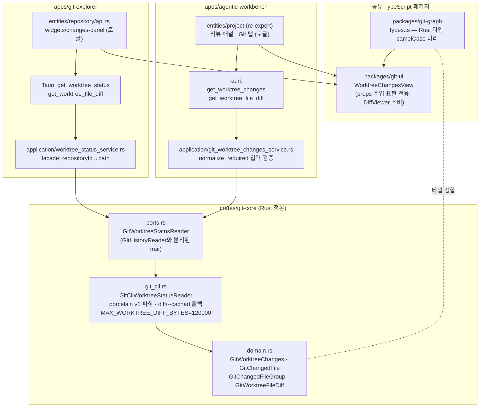
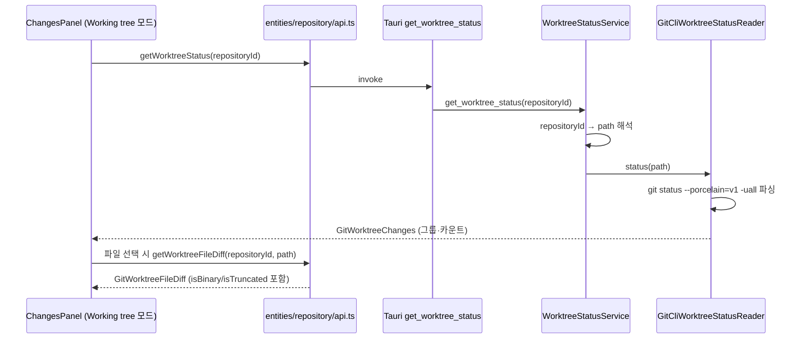

# 워킹 트리(미커밋) 변경사항 조회 공유 아키텍처

## 목적과 범위

agentic-workbench(AW)에만 있던 미커밋(working-tree) status/diff 조회 기능을 공유 계층으로 승격해, git-explorer(GE)와 AW가 동일한 정본 구현을 소비하도록 한 구조를 기록한다.

- **범위**: git-core의 worktree status/diff 도메인·포트·CLI 어댑터, git-graph 타입 미러, git-ui의 `WorktreeChangesView`, 두 앱의 소비 경로.
- **비범위**: stage/unstage/discard 등 쓰기 동작(포트 자체가 reader 전용), diff 뷰어 렌더링 방식 변경, 파일 시스템 감시 기반 실시간 갱신.

관련 spec: `specs/006-shared-worktree-changes/` (spec/plan/research/data-model/contracts/quickstart)

## 계층 구조

## 핵심 설계 결정

상세 근거는 `specs/006-shared-worktree-changes/research.md` 참조. 요약:

| 결정 | 내용 |
|---|---|
| 정본 위치 | AW 자체 구현을 git-core로 이관하고 AW provider 2종 삭제. 소비 앱 2개(GE·AW) 조건 충족으로 공유 승격 |
| 포트 분리 | `GitWorktreeStatusReader { status, diff }`를 `GitHistoryReader`와 별도 trait으로 정의(인터페이스 분리) |
| 식별자 규약 | 포트는 경로(working_directory)만 받는다. repositoryId 등 앱별 식별자는 각 앱 application 계층 facade가 경로로 변환 |
| status 파싱 | `git status --porcelain=v1 -uall`. 그룹 판정 우선순위: conflicted → untracked → staged → unstaged |
| diff 조회 | `git diff` → 비면 `git diff --cached` 폴백(스테이징 전용 변경 대응). 둘 다 비면(untracked 등) 안내 문구를 content로 반환 — untracked 내용 diff는 미생성(구 AW 동작 승계) |
| 응답 상한 | diff 본문 120,000바이트 초과 시 잘라내고 `isTruncated: true`. 바이너리는 `isBinary: true` |
| diff 타입 | `GitWorktreeFileDiff`는 커밋 `GitFileDiff`와 필드 정렬(commitHash 없음) → 공유 `DiffViewer`가 동일 소비 |
| 공유 UI | `WorktreeChangesView`는 데이터·콜백 전부 props 주입(`CommitDetailView` 패턴). Tauri/react-query/앱 셸 비의존 |

## 조회 흐름 (GE 기준)

AW는 커맨드 이름(`get_worktree_changes`)과 식별자(workingDirectory 직접 전달)만 다르고 나머지 흐름은 동일하다.

## 호환성 규칙

직렬화 필드명(camelCase)은 두 앱이 동시에 소비하는 계약이다. 필드 추가는 하위 호환(optional)으로만 하고, 제거·의미 변경 시에는 git-core → git-graph 미러 → git-ui → 양 앱을 한 변경 단위로 함께 갱신한다(헌법 원칙 V).

## 구현 단계 (완료)

1. git-core에 도메인·포트·CLI 어댑터 + 단위 테스트 — 커밋 `474d923`
2. git-graph 타입 미러 + git-ui `WorktreeChangesView` — 커밋 `c54faa0`
3. GE 신규 탑재(facade·커맨드·api·ChangesPanel 토글) — 커밋 `34b0d65`
4. AW 마이그레이션(자체 구현 삭제, 공유 채택, Git 탭 토글) — 커밋 `183f9c0`
5. Storybook 등록(GE organisms: 기본·clean·로딩·오류·바이너리·잘림) + 본 문서

## 완료 기준과 검증

- `cargo test -p git-core -p git-explorer -p agentic-workbench` 통과 (git-core 7 · GE 32 · AW 118)
- `pnpm -r check-types` 통과
- 파싱 구현 단일 정본: `grep -rn "porcelain" --include='*.rs' apps/ crates/`가 `crates/git-core/src/git_cli.rs`만 매치
- 수동 검증 시나리오: `specs/006-shared-worktree-changes/quickstart.md`
