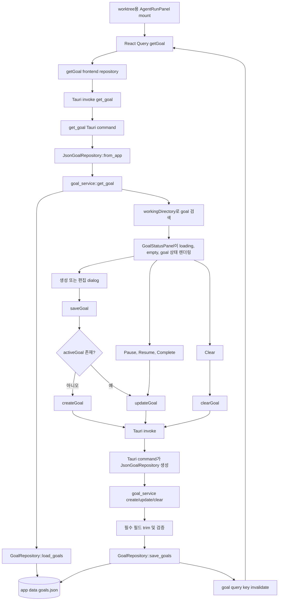

# Goal 기능 구현

이 문서는 `origin/main`의 commit `c2eb75b` 기준으로 goal 기능이 어떻게
구현되어 있는지 설명한다.

이 기능은 worktree마다 하나의 장기 goal을 저장한다. goal은 agent run panel 안에
표시되지만, 현재는 agent run request에 자동으로 연결되지는 않는다. 개별 agent
run을 시작하는 prompt는 별도의 `AgentRunRequest.goal` 필드가 계속 담당한다.

## 전체 흐름



## 프론트엔드 모델과 API

프론트엔드 모델은 `apps/agentic-workbench/src/entities/agent-run/model/types.ts`에 정의되어
있다.

`GoalStatus`는 다음 값을 지원한다.

- `active`
- `paused`
- `blocked`
- `usageLimited`
- `budgetLimited`
- `complete`

`ThreadGoal`은 다음 값을 저장한다.

- `workingDirectory`
- `objective`
- `status`
- `tokenBudget`
- `tokensUsed`
- `timeUsedSeconds`
- `createdAt`
- `updatedAt`

프론트엔드 API adapter는
`apps/agentic-workbench/src/entities/agent-run/api/goal-repository.ts`이다. 이 adapter는
UI를 네 개의 Tauri command에 매핑한다.

- `get_goal`
- `create_goal`
- `update_goal`
- `clear_goal`

React Query key는 `apps/agentic-workbench/src/entities/agent-run/api/query-keys.ts`에
모여 있다. goal cache key는 `["goal", workingDirectory]`이므로 각 worktree가
독립적인 cached goal을 가진다.

## Agent Run Panel 통합

goal UI는 `apps/agentic-workbench/src/features/agent-run/ui/agent-run-panel.tsx`에
구현되어 있다.

mount 시 `AgentRunPanel`은 React Query를 통해 `getGoal(workingDirectory)`를
호출한다. 반환된 goal은 `GoalStatusPanel`이 렌더링한다.

`GoalStatusPanel`은 세 가지 표시 상태를 가진다.

- loading: spinner와 loading text를 보여준다.
- empty: 해당 worktree에 goal이 없음을 보여주고 `Goal 생성` 버튼을 제공한다.
- populated: objective, status badge, optional token budget, action button을
  보여준다.

사용 가능한 action은 다음과 같다.

- Create: 빈 필드로 goal dialog를 연다.
- Edit: 현재 objective와 token budget을 채워 goal dialog를 연다.
- Pause: 현재 status가 `active`이면 status를 `paused`로 바꾼다.
- Resume: 현재 status가 `paused` 또는 `blocked`이면 status를 `active`로 바꾼다.
- Complete: 이미 complete 상태가 아니면 status를 `complete`로 바꾼다.
- Clear: worktree goal을 제거한다.

create, update, clear 이후 mutation은 해당 worktree의 goal query key를
invalidate한다. 그러면 panel이 최신 persisted value를 다시 불러온다.

completed goal을 편집할 때 새 objective를 저장하면 `status: active`도 함께
전송한다. 사용자가 완료된 goal을 수정하면 다시 active 상태로 되돌리는 동작이다.

## Tauri Command 경계

command는 `apps/agentic-workbench/src-tauri/src/lib.rs`에 등록되어 있고,
`apps/agentic-workbench/src-tauri/src/inbound/tauri_commands.rs`에 구현되어 있다.

inbound layer는 다음 타입을 정의한다.

- `GoalInput`: `workingDirectory`, `objective`, `tokenBudget`
- `GoalUpdateInput`: optional `objective`, optional `status`, optional
  `tokenBudget`

`GoalUpdateInput.token_budget`은 `Option<Option<usize>>`이다. 이를 통해 command
layer는 다음 경우를 구분할 수 있다.

- field omitted: 현재 budget을 변경하지 않는다.
- `null`: 현재 budget을 제거한다.
- number: budget을 해당 값으로 교체한다.

각 command는 Tauri app handle에서 `JsonGoalRepository`를 만들고, business
behavior를 `goal_service`에 위임한다.

## Domain과 Application Service

백엔드 domain type은 `apps/agentic-workbench/src-tauri/src/domain/goal.rs`에 있다.

repository port는 `apps/agentic-workbench/src-tauri/src/domain/goal_repository.rs`이다.

- `load_goals() -> Vec<ThreadGoal>`
- `save_goals(goals)`

application service는 `apps/agentic-workbench/src-tauri/src/application/goal_service.rs`이다.

이 service가 business rule을 가진다.

- `get_goal`은 worktree path를 trim 및 검증한 뒤 matching goal을 찾는다.
- `create_goal`은 필수 필드를 trim하고, `active` goal을 만들며, usage counter를
  0으로 초기화하고, 같은 worktree의 기존 goal을 교체한다.
- `update_goal`은 기존 goal이 있어야 성공하며, 제공된 필드만 업데이트한다.
- `clear_goal`은 기존 goal이 있어야 성공하며 해당 goal을 제거한다.

`working_directory`와 `objective`는 모두 trim되며 비어 있으면 안 된다.
`created_at`과 `updated_at`은 `Utc::now()`에서 만든 RFC 3339 timestamp를
사용한다.

## Persistence

outbound adapter는
`apps/agentic-workbench/src-tauri/src/infrastructure/json_goal_repository.rs`이다.

goal은 Tauri app data directory 아래 다음 파일에 저장된다.

```text
goals.json
```

이 파일은 `ThreadGoal` record의 pretty-printed JSON array를 담는다. 파일이
없으면 `load_goals`는 빈 list를 반환한다. repository가 생성되기 전에 app data
directory가 필요하면 먼저 생성된다.

현재 구현은 각 operation마다 파일 전체를 읽고 파일 전체를 다시 쓴다.

## Agent Run과의 관계

persisted `ThreadGoal`은 worktree metadata이다. run을 시작할 때
`AgentRunRequest.goal`로 자동 복사되지 않는다.

agent run prompt는 여전히 prompt input에서 오며, `startRun(goal: string)`을 거쳐
`startAgentRun({ goal, ... })`로 전달된다.

따라서 사용자는 저장된 goal을 어떤 작업을 실행할지 결정하는 context로 사용할 수
있지만, 현재 코드는 goal 실행을 강제하거나, token usage를 갱신하거나, elapsed
time을 추적하거나, agent output을 기반으로 goal을 complete 처리하지 않는다.

## 테스트 커버리지

`apps/agentic-workbench/src-tauri/src/application/goal_service.rs`에는 다음 동작에 대한
focused unit test가 있다.

- goal 생성 및 같은 worktree의 기존 goal 교체
- user-managed field 업데이트
- worktree goal 제거
