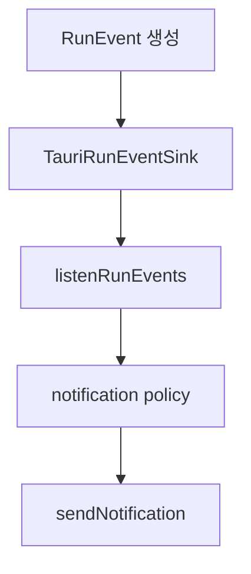
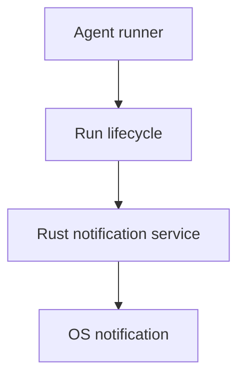

# macOS 데스크탑 알림 제공 방법 조사

## 배경

agent run은 사용자가 다른 창이나 다른 앱을 보고 있는 동안 오래 실행될 수 있다.
따라서 run 완료, 실패, permission 요청, 장기 goal 제한 도달 같은 이벤트는 앱 내부
timeline만으로는 부족하다. macOS 데스크탑 알림을 제공하면 사용자가 작업창을 계속
주시하지 않아도 중요한 상태 변화를 놓치지 않을 수 있다.

이 문서는 macOS만 우선 지원해도 되는 전제에서, 현재 Tauri v2 desktop 앱에 알림을
추가하는 방법을 정리한다.

## 결론

MVP는 Tauri 공식 notification plugin을 사용하는 것이 가장 적합하다.

- Rust dependency: `tauri-plugin-notification = "2"`
- JS dependency: `@tauri-apps/plugin-notification`
- Tauri builder: `.plugin(tauri_plugin_notification::init())`
- capability: `notification:default` 또는 최소 권한 조합 추가
- frontend에서 `isPermissionGranted`, `requestPermission`, `sendNotification` 사용

macOS 네이티브 API(`UNUserNotificationCenter`)를 직접 감싸는 방식은 가능하지만,
현재 앱이 이미 Tauri v2 플러그인 모델을 쓰고 있고 dialog plugin도 같은 방식으로
등록되어 있으므로, 직접 Swift/Objective-C bridge를 만들 이유는 작다.

## 관련 자료 조사 요약

조사는 2026-06-25 기준 공식 문서 위주로 했다.

- Tauri notification plugin은 native notification을 보내기 위한 공식 플러그인이다.
  공식 문서 기준 macOS를 지원하며, Rust 1.77.2 이상이 필요하다.
- Tauri 공식 사용 흐름은 다음 세 단계다.
  1. 권한이 이미 있는지 확인한다.
  2. 권한이 없으면 요청한다.
  3. 권한이 있으면 알림을 보낸다.
- JS API에는 `isPermissionGranted`, `requestPermission`, `sendNotification`이 있다.
- Rust 쪽에서도 `tauri_plugin_notification::NotificationExt`를 통해 notification
  builder를 사용할 수 있다.
- Tauri v2 capability에는 notification 권한을 명시해야 한다. plugin의 default
  permission set은 permission check/request, notify, active/pending 조회, cancel 등
  알림 관련 기능을 허용한다.
- Apple의 UserNotifications 프레임워크는 macOS에서 로컬/원격 사용자 알림을 처리하는
  표준 프레임워크이며, 앱은 `UNUserNotificationCenter`를 통해 권한을 요청한다.
  Tauri plugin은 이 계층을 직접 다루지 않게 해 주는 wrapper로 보는 것이 맞다.

참고 자료:

- Tauri Notification Plugin: https://v2.tauri.app/plugin/notification/
- Tauri Notification JS API: https://v2.tauri.app/reference/javascript/notification/
- Tauri notification plugin repository: https://github.com/tauri-apps/tauri-plugin-notification
- Tauri notification default permissions: https://github.com/tauri-apps/tauri-plugin-notification/blob/v2/permissions/default.toml
- Apple UserNotifications: https://developer.apple.com/documentation/usernotifications
- Apple notification authorization: https://developer.apple.com/documentation/usernotifications/asking-permission-to-use-notifications

## 현재 프로젝트 상태

현재 프로젝트는 Tauri v2 기반이다.

- `apps/agentic-workbench/src-tauri/Cargo.toml`
  - `tauri = { version = "2", features = [] }`
  - `tauri-plugin-dialog = "2"`만 등록되어 있다.
- `apps/agentic-workbench/package.json`
  - `@tauri-apps/plugin-dialog`만 등록되어 있다.
- `apps/agentic-workbench/src-tauri/src/lib.rs`
  - `.plugin(tauri_plugin_dialog::init())`만 호출한다.
- `apps/agentic-workbench/src-tauri/capabilities/default.json`
  - 현재 permission은 `["core:default", "dialog:default"]`이다.
- `apps/agentic-workbench/src-tauri/tauri.conf.json`
  - macOS bundle identifier는 `com.yoophi.agentic-workbench`이다.

따라서 notification plugin을 추가하려면 Rust dependency, JS dependency, plugin init,
capability permission을 모두 추가해야 한다.

## 설치 및 설정

### 자동 추가

Tauri CLI를 쓰면 다음 명령으로 플러그인 추가가 가능하다.

```bash
cd apps/agentic-workbench
pnpm tauri add notification
```

자동 명령이 프로젝트 설정을 충분히 수정하지 못하면 아래 수동 변경을 적용한다.

### 수동 변경

`apps/agentic-workbench/src-tauri/Cargo.toml`:

```toml
[dependencies]
tauri-plugin-notification = "2"
```

`apps/agentic-workbench/package.json`:

```json
{
  "dependencies": {
    "@tauri-apps/plugin-notification": "^2"
  }
}
```

`apps/agentic-workbench/src-tauri/src/lib.rs`:

```rust
pub fn run() {
    tauri::Builder::default()
        .plugin(tauri_plugin_dialog::init())
        .plugin(tauri_plugin_notification::init())
        // ...
}
```

`apps/agentic-workbench/src-tauri/capabilities/default.json`:

```json
{
  "permissions": [
    "core:default",
    "dialog:default",
    "notification:default"
  ]
}
```

최소 권한으로 줄이고 싶으면 MVP 기준으로 아래만 허용할 수 있다.

```json
{
  "permissions": [
    "core:default",
    "dialog:default",
    "notification:allow-is-permission-granted",
    "notification:allow-request-permission",
    "notification:allow-notify"
  ]
}
```

단, active notification 제거, pending 조회, listener 등 후속 기능을 쓸 계획이면
`notification:default`가 단순하다.

## Frontend API 설계

FSD 기준으로 notification adapter는 cross-domain utility에 가깝다.

권장 위치:

```text
apps/agentic-workbench/src/shared/api/desktop-notification.ts
```

초기 API:

```ts
import {
  isPermissionGranted,
  requestPermission,
  sendNotification,
} from "@tauri-apps/plugin-notification";

export type DesktopNotificationInput = {
  title: string;
  body?: string;
};

export async function ensureNotificationPermission() {
  if (await isPermissionGranted()) {
    return true;
  }

  const permission = await requestPermission();
  return permission === "granted";
}

export async function notifyDesktop(input: DesktopNotificationInput) {
  const granted = await ensureNotificationPermission();
  if (!granted) {
    return { delivered: false as const, reason: "permissionDenied" as const };
  }

  sendNotification({
    title: input.title,
    body: input.body,
  });

  return { delivered: true as const };
}
```

주의:

- `requestPermission()`은 사용자에게 OS 권한 prompt를 띄울 수 있으므로 앱 시작 시
  자동으로 호출하지 않는다.
- 첫 알림이 필요한 시점 또는 설정 화면에서 사용자가 켠 시점에 요청한다.
- 알림 실패를 run 실패로 취급하지 않는다. 알림은 best-effort side effect다.

## Backend Trigger와 연결 방식

현재 agent run 이벤트는 backend에서 `RunEvent`로 만들어져 frontend timeline으로 전달된다.
알림을 어느 계층에서 보낼지는 두 가지 선택지가 있다.

### 선택지 A: frontend에서 run event를 보고 알림 전송

흐름:



장점:

- 구현이 가장 작다.
- 사용자 설정, 현재 화면 focus, active pane 등 UI context를 판단하기 쉽다.
- JS plugin API의 permission flow를 그대로 쓴다.

단점:

- frontend가 열려 있고 event listener가 살아 있어야 한다.
- 앱이 background 상태일 때도 webview가 살아 있기는 하지만, 모든 정책이 UI에 모인다.

MVP 권장 방식이다.

### 선택지 B: backend application service에서 알림 전송

흐름:



장점:

- agent lifecycle에 가까운 곳에서 처리한다.
- frontend listener 누락과 무관하게 보낼 수 있다.

단점:

- permission 요청은 사용자의 UI action과 연결하기가 더 어렵다.
- 알림 preference나 현재 화면 focus 상태를 판단하려면 frontend state를 다시 전달해야 한다.
- application/domain 계층에 Tauri plugin 세부사항이 새지 않도록 port를 추가해야 한다.

후속 단계에서 필요한 방식이다. 이 경우 hexagonal 구조에 맞춰 다음처럼 둔다.

- `ports/desktop_notifier.rs`
- `domain/notification.rs`
- `application/notification_service.rs`
- `infrastructure/tauri_desktop_notifier.rs`

단, Tauri plugin 타입은 infrastructure에만 둔다.

## 알림 대상 이벤트

MVP에서 추천하는 알림 이벤트:

- agent run 완료
  - 제목: `Agent run completed`
  - 본문: agent label 또는 worktree branch
- agent run 실패
  - 제목: `Agent run failed`
  - 본문: 짧은 오류 메시지
- permission 요청
  - 제목: `Permission required`
  - 본문: tool/request title
- Ralph loop 중단
  - 제목: `Ralph loop stopped`
  - 본문: error, permission, max iteration 등 중단 이유

처음부터 알림을 보내지 않는 것이 좋은 이벤트:

- 모든 tool call
- 모든 agent message chunk
- usage update
- raw event
- 사용자가 현재 같은 window를 보고 있는 동안 발생한 짧은 lifecycle event

## Notification Policy

알림은 너무 많으면 바로 꺼진다. 따라서 policy 계층을 둔다.

권장 위치:

```text
apps/agentic-workbench/src/features/agent-run/model/notification-policy.ts
```

정책 입력:

```ts
type NotificationPolicyInput = {
  event: RunEvent;
  runId: string;
  activeRunId: string | null;
  documentVisible: boolean;
  windowFocused: boolean;
  userEnabled: boolean;
};
```

정책 출력:

```ts
type NotificationDecision =
  | { notify: false; reason: string }
  | { notify: true; title: string; body?: string };
```

기본 규칙:

- 사용자가 설정에서 알림을 꺼두면 보내지 않는다.
- permission 요청은 window가 focus 상태여도 보낼 수 있다. 사용자의 즉시 응답이 필요하기
  때문이다.
- completed/failed는 앱 window가 background이거나 document가 hidden일 때만 보낸다.
- 같은 run에서 같은 종류의 알림은 짧은 시간 내 중복 전송하지 않는다.
- body에는 file diff나 prompt 전문을 넣지 않는다.

## Settings

사용자 설정은 worktree별보다 앱 전역 설정이 적합하다.

예시:

```ts
type NotificationSettings = {
  enabled: boolean;
  notifyOnRunCompleted: boolean;
  notifyOnRunFailed: boolean;
  notifyOnPermissionRequired: boolean;
  notifyOnRalphStopped: boolean;
};
```

기본값:

```ts
{
  enabled: false,
  notifyOnRunCompleted: true,
  notifyOnRunFailed: true,
  notifyOnPermissionRequired: true,
  notifyOnRalphStopped: true
}
```

`enabled` 기본값은 `false`를 추천한다. 사용자가 설정에서 켜거나 첫 prompt 실행 시
"agent run 완료 알림을 받을까요?" 같은 명시적 UI에서 켜는 방식이 낫다.

저장소는 기존 JSON repository 패턴에 맞춰 둘 수 있다.

- frontend only MVP: local storage 또는 zustand persist
- 정식 구현: backend `NotificationSettingsRepository`

## macOS 동작 주의점

- macOS는 앱별 알림 권한을 시스템 설정에서 관리한다.
- 사용자가 한 번 거부하면 앱 안에서 다시 prompt를 띄워도 기대대로 보이지 않을 수 있다.
  이 경우 설정 화면에서 macOS 시스템 설정으로 안내해야 한다.
- 개발 빌드와 번들된 앱은 알림 표시 이름/icon이 다를 수 있다.
- 알림은 앱이 foreground일 때 표시 방식이 제한될 수 있다. 그래서 foreground 상태에서는
  앱 내부 toast나 timeline indicator를 병행하는 것이 좋다.
- macOS 사운드는 Tauri JS API의 `sound` 옵션에 시스템 사운드 이름 또는 번들 내 파일을
  줄 수 있다. MVP에서는 sound를 사용하지 않는 것이 안전하다.

## 구현 단계

### 1단계: plugin 설치

- `pnpm tauri add notification` 실행 또는 수동 dependency 추가.
- `lib.rs`에 plugin init 추가.
- capability에 `notification:default` 추가.
- `pnpm install` 및 Cargo lock 갱신.

### 2단계: shared notification adapter

- `shared/api/desktop-notification.ts` 추가.
- permission check/request/send wrapper 작성.
- 실패 시 throw보다 typed result 반환.

### 3단계: agent run notification policy

- `features/agent-run/model/notification-policy.ts` 추가.
- lifecycle/error/permission/ralphLoop 이벤트별 decision 테스트 작성.
- `AgentRunPanel`의 event handling 경로에서 decision을 평가하고 `notifyDesktop` 호출.

### 4단계: settings UI

- 설정 surface에 "Desktop notifications" toggle 추가.
- 권한 상태 확인 버튼 추가.
- 테스트 알림 버튼 추가.
- 권한 거부 상태면 macOS System Settings 안내 문구 표시.

### 5단계: backend service로 승격할지 판단

MVP 사용 후 다음 조건이면 backend notifier port를 추가한다.

- frontend listener 누락으로 알림이 빠지는 문제가 있다.
- window별/pane별 알림 라우팅보다 backend lifecycle 기준 알림이 더 중요해진다.
- scheduled notification 또는 앱 background 상태에서 더 강한 보장이 필요하다.

## 테스트 전략

Unit:

- notification policy가 완료/실패/permission 이벤트를 올바르게 분류하는지 테스트.
- foreground 상태에서 completed 알림을 억제하는지 테스트.
- permission 요청은 foreground에서도 허용되는지 테스트.

Integration:

- `notifyDesktop`에서 permission denied일 때 오류가 UI를 깨지 않는지 확인.
- `sendNotification` 호출을 mock 처리해 중복 전송 방지 확인.

Manual macOS QA:

1. 앱 설정에서 알림을 켠다.
2. macOS 권한 prompt에서 허용한다.
3. 테스트 알림이 Notification Center에 뜨는지 확인한다.
4. agent run 완료 시 background 상태에서 알림이 뜨는지 확인한다.
5. permission request 발생 시 알림이 뜨는지 확인한다.
6. macOS System Settings에서 알림을 끈 뒤 앱이 조용히 실패 처리하는지 확인한다.

## 권장 MVP

1. Tauri notification plugin을 추가한다.
2. JS wrapper를 `shared/api`에 둔다.
3. 알림 전송은 frontend의 `AgentRunPanel` event listener에서 시작한다.
4. 알림 대상은 `completed`, `error`, pending `permission`, Ralph loop stopped로 제한한다.
5. 사용자가 명시적으로 켜기 전에는 OS 권한을 요청하지 않는다.

이 방식은 현재 코드 변경량이 작고, macOS만 우선 지원해도 충분히 동작한다. 추후 필요하면
같은 plugin을 유지한 채 backend notifier port로 옮길 수 있다.
