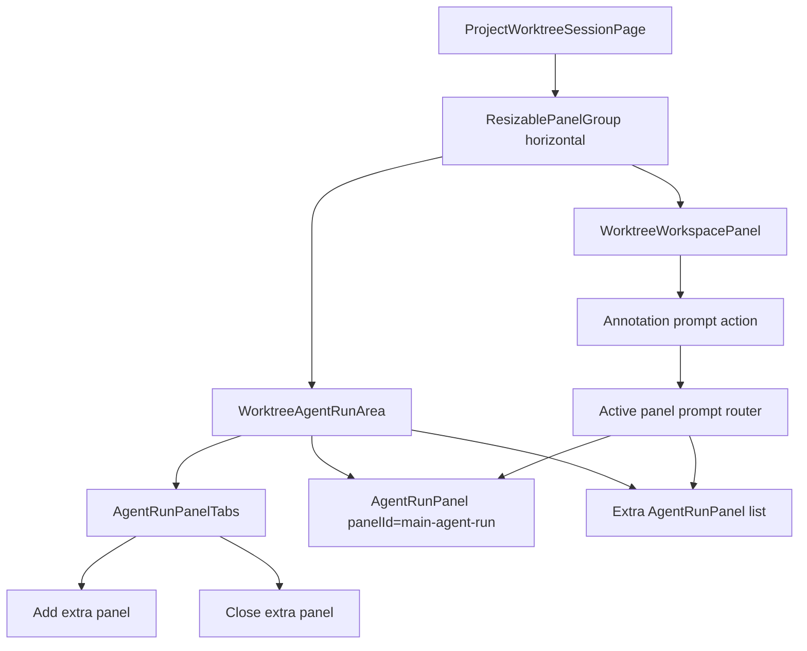
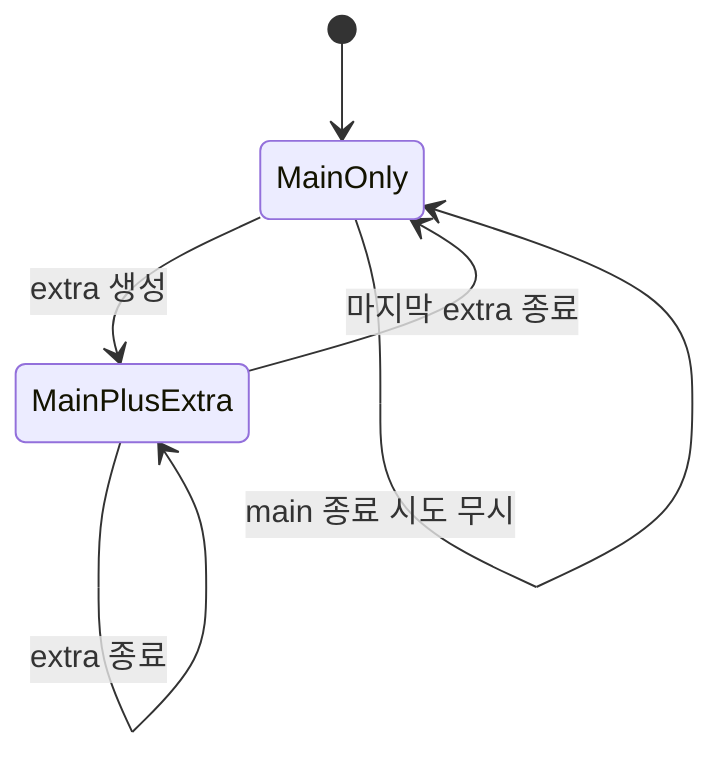
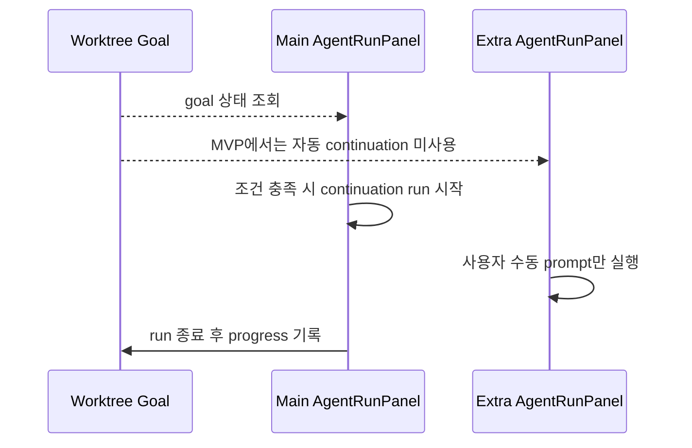
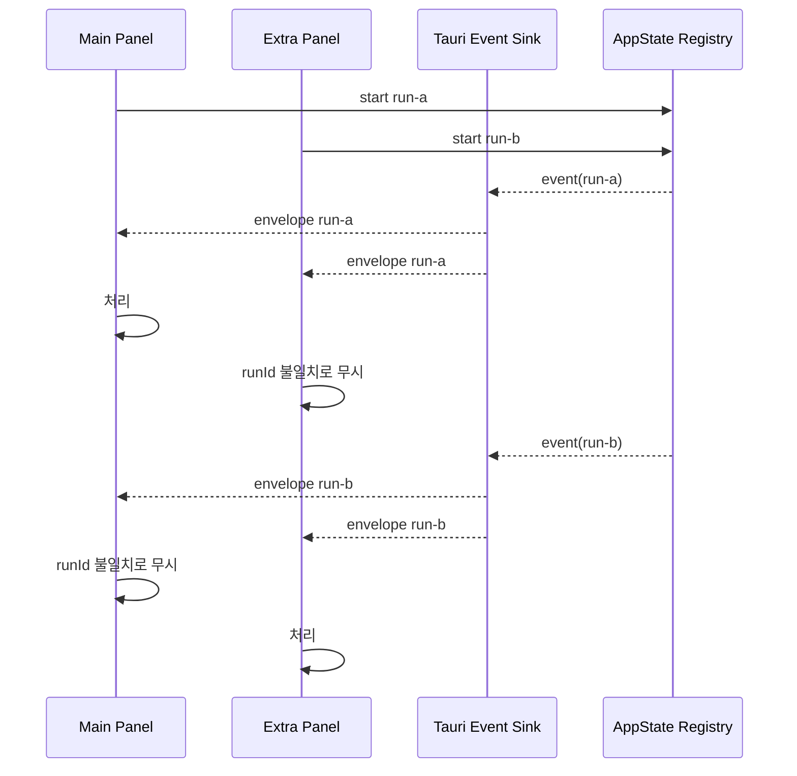
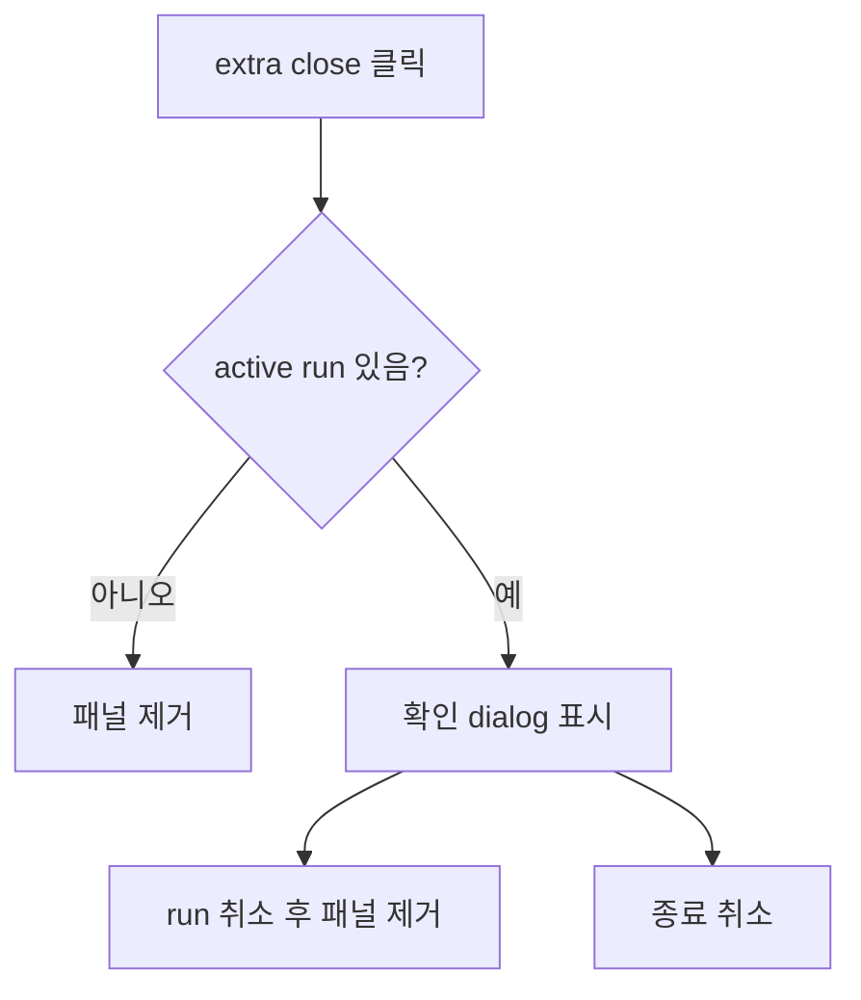

# Main/Extra Agent Run Panel 설계

## 배경

현재 `ProjectWorktreeSessionPage`는 선택한 worktree에 대해 하나의 `AgentRunPanel`만
렌더링한다. 이 구조는 단순하지만, 사용자가 같은 worktree에서 구현 agent와 검토 agent,
실험 agent, read-only agent를 병렬로 운용하고 싶을 때 하나의 timeline에 의도가 섞이는
문제가 있다.

이 문서는 `main-agent-run` 패널은 항상 1개 유지하고 삭제할 수 없게 하며, 필요할 때
추가 `extra-agent-run` 패널을 동적으로 생성하고 종료할 수 있게 만드는 설계를 정의한다.

## 현재 코드 기준 출발점

- 화면 조립: `apps/agentic-workbench/src/pages/project-worktree-session/ui/project-worktree-session-page.tsx`
- agent 실행 UI: `apps/agentic-workbench/src/features/agent-run/ui/agent-run-panel.tsx`
- agent run API: `apps/agentic-workbench/src/entities/agent-run/api/agent-run-repository.ts`
- backend registry: `apps/agentic-workbench/src-tauri/src/infrastructure/agent_session_registry.rs`
- event sink: `apps/agentic-workbench/src-tauri/src/infrastructure/tauri_run_event_sink.rs`

현재 백엔드 `AppState`는 run id가 다르면 여러 run을 동시에 보관할 수 있다.
`AgentRunPanel`도 frontend에서 `activeRunId` 기준으로 이벤트를 필터링한다. 따라서
MVP는 backend 구조를 크게 바꾸지 않고, page에서 여러 `AgentRunPanel` 인스턴스를
관리하는 방식으로 시작할 수 있다.

## 목표

1. worktree session에는 삭제 불가능한 `main-agent-run` 패널이 항상 1개 존재한다.
2. 사용자는 `extra-agent-run` 패널을 동적으로 추가하고 종료할 수 있다.
3. 각 패널은 독립적인 prompt, timeline, active run id, queue, permission 응답 상태를 가진다.
4. goal 자동 이어가기와 session의 기본 작업 흐름은 `main-agent-run`에만 둔다.
5. extra 패널은 초기에는 수동 prompt 실행 용도로 제한한다.
6. 패널 종료 시 active run이 있으면 사용자가 취소 또는 종료 취소를 명시적으로 선택한다.

## 비목표

- 여러 agent run의 conversation history를 자동 병합하지 않는다.
- 같은 worktree에서 발생한 파일 충돌을 자동 해결하지 않는다.
- extra 패널끼리 또는 main/extra 간 자동 prompt 전달을 구현하지 않는다.
- MVP에서 별도 Tauri window 또는 webview를 만들지 않는다.
- extra 패널별 영구 session layout 복원을 1차 범위에 포함하지 않는다.

## UX 설계

### 기본 구조

왼쪽 agent 영역은 `main`과 `extra` 패널을 탭으로 전환한다. main 패널은 항상 첫 번째
탭이며 close 버튼이 없다. extra 패널에는 close 버튼이 있다.

```text
┌────────────────────────────────────────────────────────────────────────┐
│ Agent tabs: [Main] [Extra 1 x] [Extra 2 x] [+]                         │
├────────────────────────────────────┬───────────────────────────────────┤
│ Active AgentRunPanel               │ WorktreeWorkspacePanel            │
│ - timeline                         │ - git/files/markdown workspace    │
│ - prompt                           │ - annotation prompt actions       │
└────────────────────────────────────┴───────────────────────────────────┘
```

권장 동작:

- 새 extra 패널을 만들면 해당 패널을 active tab으로 전환한다.
- extra 패널 기본 이름은 `Extra 1`, `Extra 2`처럼 부여한다.
- extra 패널이 실행 중이면 tab에 running 상태를 표시한다.
- main 패널은 `Main` 또는 worktree branch/context를 드러내는 이름을 사용한다.
- 좁은 화면에서도 좌우 split은 유지하되 agent 영역 내부는 항상 탭으로 전환한다.

### Annotation Prompt 라우팅

workspace에서 annotation prompt를 agent로 보낼 때는 대상 패널 정책이 필요하다.

MVP 권장 정책:

- 기본 대상은 현재 active agent panel이다.
- 사용자가 main을 명시적으로 기본 대상에 고정할 수 있는 옵션은 후속 단계로 둔다.
- prompt 전송 시 대상 패널 이름을 toast 또는 짧은 상태 메시지로 표시한다.

대상 패널이 실행 중이면 기존 `AgentRunPanel` 동작처럼 queue에 넣는다. 대상 패널이
대기 중이고 agent/profile/session 조건이 준비되어 있으면 바로 run을 시작한다.

## 컴포넌트 구조



권장 파일 배치:

- `pages/project-worktree-session/ui/project-worktree-session-page.tsx`
  - page level split과 worktree 전달
- `features/agent-run/ui/worktree-agent-run-area.tsx`
  - main/extra 패널 목록, active tab, prompt routing 관리
- `features/agent-run/ui/agent-run-panel-tabs.tsx`
  - 탭 UI와 추가/종료 버튼
- `features/agent-run/ui/agent-run-panel.tsx`
  - 기존 패널. `panelId`, `enableGoalContinuation`, `onRunStateChange` 같은 props 추가

## 상태 모델

page 또는 `WorktreeAgentRunArea`에서 다음 상태를 관리한다.

```ts
type AgentRunPanelKind = "main" | "extra";

type AgentRunPanelSlot = {
  id: string;
  kind: AgentRunPanelKind;
  title: string;
  externalPromptRequest: AgentPromptRequest | null;
  isRunning: boolean;
};

const MAIN_AGENT_RUN_PANEL_ID = "main-agent-run";
```

main 패널은 상태 목록에서 제거할 수 없다. extra 패널만 추가/삭제 대상이다.



## AgentRunPanel Props 변경

`AgentRunPanel`은 현재 단일 인스턴스 전제를 일부 갖고 있다. 여러 인스턴스가 같은 page에
존재하려면 다음 props를 추가한다.

```ts
type AgentRunPanelProps = {
  panelId: string;
  workingDirectory: string;
  scrollHeader?: ReactNode;
  onRunSettled?: () => void;
  onRunStateChange?: (state: { isRunning: boolean; activeRunId: string | null }) => void;
  initialInputMode?: AgentInputMode;
  externalPromptRequest?: AgentPromptRequest | null;
  enableGoalContinuation?: boolean;
  persistSettings?: boolean;
  onOpenSettings?: () => void;
};
```

권장 기본값:

- `enableGoalContinuation = false`
- main 렌더링 시에만 `enableGoalContinuation={true}`
- `persistSettings = true`는 main에만 적용하고, extra는 MVP에서 `false`로 둔다.

`ResizablePanel` id는 고정 문자열 대신 `panelId`를 포함해야 한다.

```tsx
<ResizablePanel id={`${panelId}-timeline`} minSize="220px">
<ResizablePanel id={`${panelId}-prompt`} defaultSize="300px">
```

이 변경은 여러 `AgentRunPanel` 인스턴스가 같은 React tree에 있을 때 panel id 충돌을
막기 위한 필수 작업이다.

## Goal 정책

goal은 worktree 단위 상태다. 여러 패널이 같은 `workingDirectory`의 goal을 동시에
관찰하면 자동 continuation이 중복 실행될 수 있다.

정책:

- goal 표시와 편집은 main 패널에서만 제공한다.
- goal 자동 continuation effect는 `enableGoalContinuation`이 true일 때만 실행한다.
- extra 패널에서는 goal UI를 숨기거나 read-only summary만 표시한다.
- extra 패널의 실행 결과는 기본적으로 goal progress에 누적하지 않는다.



## Settings 정책

현재 agent run settings는 `workingDirectory` 기준으로 저장된다. 같은 worktree의 main과
extra가 모두 설정을 저장하면 마지막 저장이 다른 패널 설정을 덮어쓸 수 있다.

MVP 정책:

- main 패널만 settings를 hydrate/save한다.
- extra 패널은 생성 시 main의 현재 기본값을 초기값으로 받을 수 있지만 자동 저장하지 않는다.
- extra 패널에서 변경한 agent/model/permission은 해당 패널 생명주기 동안만 유지한다.

후속 개선안:

- settings key를 `workingDirectory + panelProfileId`로 확장한다.
- extra panel template을 별도 저장한다.
- `readOnly extra`, `review extra`, `test extra` 같은 preset을 제공한다.

## Backend 및 Event 정책

backend `AppState`는 이미 여러 run id를 동시에 관리할 수 있다. 추가로 확인해야 할 점은
동시 실행 제한과 창 종료 정책이다.

- `ACP_WORKBENCH_MAX_RUNS`가 설정되어 있으면 extra run 시작 시 limit 오류가 발생할 수 있다.
- 같은 Tauri window 안의 모든 run은 같은 owner window label을 가진다.
- 창 닫기 시 owner window label에 속한 run을 모두 취소하는 정책은 유지한다.
- event envelope는 `runId`를 포함하므로 각 패널은 자기 `activeRunId`만 처리한다.



## Extra 패널 종료 정책

extra 패널 종료는 다음 상태에 따라 분기한다.



구현 선택지:

1. `AgentRunPanel` 외부에서 `isRunning` 상태를 받아 close confirm을 처리한다.
2. `AgentRunPanel` 내부 header에 close 버튼을 넣고 내부 `cancel()` 흐름을 재사용한다.

MVP는 1번이 page 구조에 덜 침투적이다. 다만 내부 `cancel()` 함수를 외부에서 호출할 수
없으므로, 실행 중인 extra 패널을 닫을 때는 외부가 `activeRunId`를 알고 `cancelAgentRun`
API를 호출해야 한다. 이를 위해 `onRunStateChange`로 `activeRunId`를 상위에 보고한다.

## 동시 실행 충돌

같은 worktree에서 여러 agent가 동시에 실행되면 다음 문제가 발생할 수 있다.

- 같은 파일을 동시에 수정해 diff가 섞인다.
- 한 run의 formatter/test/install 작업이 다른 run의 작업 중간 상태를 변경한다.
- permission 요청이 여러 패널에서 동시에 떠서 사용자가 대상을 혼동할 수 있다.
- worktree changes panel이 패널별 변경이 아니라 전체 worktree 변경을 보여준다.
- goal progress가 중복 기록되면 예산 사용량이 과대 계산될 수 있다.

완화 정책:

- extra 패널 생성 시 같은 worktree 병렬 실행임을 UI에 표시한다.
- extra 패널 기본 permission mode를 `readOnly` 또는 `plan`으로 둘지 검토한다.
- 실행 중인 패널 수를 tab badge로 표시한다.
- main과 extra가 동시에 edit-capable permission으로 실행될 때 경고를 표시한다.
- goal progress 기록은 main만 수행한다.

## 구현 단계

### 1단계: UI 구조 추가

- `WorktreeAgentRunArea` 컴포넌트 생성
- main 패널 고정 렌더링
- extra 패널 추가/삭제 상태 구현
- active tab 전환 구현
- Storybook page/organism story 추가

### 2단계: AgentRunPanel 다중 인스턴스 대응

- `panelId` prop 추가
- `ResizablePanel` id를 panel별로 분리
- `enableGoalContinuation` prop 추가
- main에서만 goal 자동 continuation 활성화
- `persistSettings` prop 추가 후 extra 자동 저장 비활성화

### 3단계: Prompt 라우팅

- workspace annotation prompt를 active panel로 전달
- active panel이 실행 중이면 queue에 추가
- active panel이 대기 중이면 기존 external prompt 흐름 사용
- 대상 panel 표시 UX 추가

### 4단계: 종료 안전장치

- `onRunStateChange`로 상위가 `isRunning`, `activeRunId` 추적
- extra close 시 active run 확인 dialog 표시
- 확인 시 `cancelAgentRun(activeRunId)` 후 패널 제거
- main close 액션은 제공하지 않음

### 5단계: 충돌 완화

- 동시 실행 경고 표시
- extra 기본 permission mode 정책 결정
- `ACP_WORKBENCH_MAX_RUNS` limit 오류 메시지 개선
- goal progress main-only 정책 테스트 추가

## 테스트 계획

- `WorktreeAgentRunArea` model test
  - main 패널은 항상 존재한다.
  - main 패널은 삭제할 수 없다.
  - extra 패널 생성 시 unique id를 가진다.
  - extra 패널 삭제 후 active tab이 main 또는 남은 extra로 이동한다.
- `AgentRunPanel` test
  - `panelId`별 resizable id가 충돌하지 않는다.
  - `enableGoalContinuation=false`일 때 goal continuation run을 시작하지 않는다.
  - `persistSettings=false`일 때 settings save mutation을 호출하지 않는다.
- integration/story test
  - main + extra 탭 렌더링
  - annotation prompt가 active panel로 전달됨
  - 실행 중 extra close confirm 표시
- backend 기존 test 유지
  - 여러 distinct run id 예약 가능
  - duplicate run id 거부
  - concurrent limit 동작

## 열린 결정 사항

- extra 패널 기본 permission mode를 `readOnly`로 강제할지, main 설정을 복사할지 결정해야 한다.
- extra 패널에서 goal summary를 완전히 숨길지 read-only로 보여줄지 결정해야 한다.
- annotation prompt 기본 대상을 active panel로 둘지 main으로 고정할지 사용자 설정이 필요할 수 있다.
- extra 패널 상태를 session reload 후 복원할지 여부는 MVP 이후 결정한다.

## 권장 MVP 결론

가장 안전한 MVP는 다음 범위다.

- main 패널 1개 고정
- extra 패널 동적 생성/종료
- active tab 기반 prompt routing
- main만 goal continuation과 settings persistence 수행
- extra는 수동 실행, panel-local 설정, 실행 중 close confirm 제공

이 범위는 현재 backend의 다중 run 지원을 활용하면서도 goal/settings/worktree 충돌을
통제할 수 있다. 이후 사용 패턴이 확인되면 extra preset, panel 복원, pane 간 exchange,
read-only 기본 정책을 단계적으로 추가한다.
