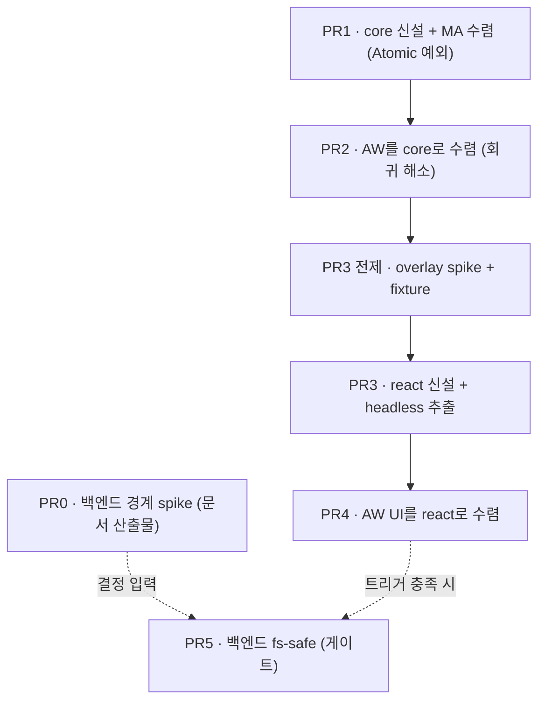

# Markdown Annotation 공유 모듈화 — Task List

> 이 task list는 정본 `markdown-annotation-shared-module-extraction-plan.md`의 실행 계획(본문 §6 PR0–PR5)을 체크리스트로 분해한 것이다. 전략·근거·완료 기준의 출처는 정본 문서이며, 충돌 시 정본이 우선한다.
>
> 표기: `[ ]` 미완 · `[~]` 진행 중 · `[x]` 완료. 각 작업에 검증 방법(명령/수동)을 붙였다.

## 의존 그래프

- **PR0와 PR1은 병행 가능**(독립). PR5는 PR0 결정 + git-core Cargo workspace spike 결과에 정렬.
- 패키지 네이밍은 기존 `@yoophi/ui` 컨벤션을 따른다(빌드 없는 source-direct export, vitest `^4.1.9`).

---

## PR0 · 백엔드 경계 spike (필수 · 산출물 = 문서)

> 코드 추출 없음. "무엇이 export 가능한가 + 왜 지금 추출을 진행/보류하는가"를 검증해 문서로 확정한다. 정본 §4.3.

- [x] **0-1. export 가능 경계 인벤토리 작성** — MA/AW `src-tauri`에서 Tauri 비의존 순수 함수를 전수 표로 정리.
  - 최소 후보: `canonical_root`/`resolve_worktree_path`/`relative_path` (`fs_worktree_file_provider.rs:109-145`), `read_text_file_safe` (`:87-98`), MA `resolve_markdown_file`/`is_markdown_file`.
  - 각 함수의 시그니처·Tauri 의존 여부·중복도 기재.
- [x] **0-2. 공유 불가 경계 확정** — Window/Tab 관리, `AppState`/세션 registry, CLI launcher, `#[tauri::command]` 래퍼가 앱-로컬에 남는 이유를 1줄씩 근거화.
- [x] **0-3. 추출 트리거 결정 기록** — (a) 지금 독립 도입 / (b) git-core Cargo workspace spike 편승 / (c) 보류 중 하나를 명시 선택. 권장은 (b).
- [x] **0-4. annotation 파싱 Rust 이전 판정** — 현재 백엔드 파싱 소비자(CLI 등) 부재 확인 + 발생 시 트리거 기록.
- [x] **0-5. 산출물 위치 확정** — 위 1~4를 정본 §4.3 보강 또는 별도 ADR로 커밋.
- **검증(DoD)**: 경계 인벤토리·공유 불가 근거·추출 트리거 결정·Rust 이전 판정이 문서로 존재한다(보류여도 "검증된 결정").

---

## PR1 · core 패키지 신설 + MA 수렴 〔Atomic 예외: 단일 소비자〕

> 부트스트랩 PR. AW는 건드리지 않는다(기존 복제본으로 계속 빌드). PR2를 연속 착수해 분기를 장기화하지 않는다.

- [ ] **1-1. `packages/markdown-annotation-core` 생성** — `@yoophi/ui` 구조 복제.
  - `package.json`: `name: @yoophi/markdown-annotation-core`, `type: module`, `private: true`.
  - `exports`: `"." → ./src/index.ts`, `"./types" → ./src/types/index.ts`.
  - `scripts`: `check-types: tsc --noEmit`, `test: vitest run`.
  - `devDependencies`: `typescript ^5`, `vitest ^4.1.9`.
  - 폴더: `src/{index.ts, types/{index.ts,annotation.ts,markdown-block.ts,document.ts}, parse/, format/, annotate/}`.
- [ ] **1-2. 순수 로직 이동(정본=MA)** — MA의 `parseMarkdownToBlocks`, `formatAnnotationsForAgent`, 3개 type을 그대로 이관. AW 열화본은 채택하지 않는다.
- [ ] **1-3. 순수 helper 승격** — `isFullBlockAnnotation`(MA `formatAnnotationsForAgent.ts:67-70`)과 `buildInlineAnnotationsByBlock`(AW `panel.tsx:157`)을 `annotate/annotation-helpers.ts`로 모아 core 단일 소유.
- [ ] **1-4. `types/index.ts` barrel 작성** — `./types` export가 실재 파일로 해석되게.
- [ ] **1-5. 테스트 동반 이동** — MA `parseMarkdownToBlocks.test.ts`(3) + `formatAnnotationsForAgent.test.ts`(4)를 core로 이동.
- [ ] **1-6. MA를 core 소비로 전환** — `apps/markdown-annotator/package.json`에 `"@yoophi/markdown-annotation-core": "workspace:*"`. import 경로 `@/features/...` → `@yoophi/markdown-annotation-core`. **MA 기존 파일 삭제.**
- [ ] **1-7. core 런타임 의존 0 확인** — react/dom/tauri import 없음(리뷰 또는 ESLint).
- **검증(DoD)**:
  - `pnpm --filter @yoophi/markdown-annotation-core check-types && pnpm --filter @yoophi/markdown-annotation-core test` 통과.
  - MA `pnpm typecheck` 통과, MA `dev`/`tauri` 기동 회귀 없음.
  - core `./`·`./types` export가 실재 파일로 해석.

---

## PR2 · AW를 core로 수렴 (열화 복제본 제거) 〔Atomic〕

> 부록 B가 문서화한 회귀(열화 parser/formatter, 죽은 타입, 테스트 0개)를 이 PR이 해소한다.

- [ ] **2-1. AW 의존성 추가** — `apps/agentic-workbench/package.json`에 `"@yoophi/markdown-annotation-core": "workspace:*"`.
- [ ] **2-2. AW 열화본 삭제** — `features/markdown-annotation/model/{parse-markdown-to-blocks,format-annotations-for-agent,types}.ts` 제거, 모든 참조를 core로 교체(인라인 helper도 core 것으로).
- [ ] **2-3. 타입 확장 정책 적용(확정)** — core 5종 보존. AW는 **"표시 가능 · 신규 생성만 제한"**:
  - `worktree-workspace-panel.tsx`의 badge/highlight/instruction 분기를 **5종 모두 처리**.
  - 생성 UI(블록 hover 버튼·selection 카드)는 기존 3종(`note`/`change-request`/`delete`)만 노출.
  - 외부에서 들어온 `question`/`approve`는 렌더·prompt에 정상 포함(데이터 무손실).
- [ ] **2-4. 블록 렌더 분기 검증** — `MarkdownBlock`에 `ordered/checked` 복원 + parser가 list/table/blockquote 블록 생성 시작 → 패널의 해당 렌더 분기가 실제 동작하는지 확인(죽은 분기 해소).
- **검증(DoD)**:
  - AW `pnpm typecheck` 통과, `dev`/`tauri` 기동.
  - Markdown 탭 수동 시나리오: **frontmatter / 표 / 중첩 리스트 / blockquote** 문서가 MA와 동일하게 블록 분할.
  - 동일 입력에서 MA·AW의 `formatAnnotationsForAgent` 출력이 동일.
  - `question`/`approve` annotation 주입 시 AW가 렌더·prompt에 포함(생략 안 됨).

---

## PR3 · react 패키지 신설 + headless 추출 〔Atomic〕

### PR3 전제 (필수 선행) — overlay 실현성 spike

- [ ] **3-0. overlay spike + acceptance fixture** — "ReactMarkdown AST 위 inline `<mark>` overlay" 실현성 검증.
  - fixture 최소: `**bold**` 내부 부분 선택, `` `code` `` 경계 선택, `[link]` 텍스트 일부 선택, 중첩 annotation 4종.
  - 성공 → overlay 채택. 실패 → 절충안(아래) 채택. **overlay 성공은 PR4 차단 요인이 아니다.**

### 본 작업

- [ ] **3-1. `packages/markdown-annotation-react` 생성** — `peerDependencies`: react/react-dom `^19`, react-markdown, remark-gfm.
  - 폴더: `src/{index.ts, MarkdownViewer.tsx, AnnotatedText.tsx, use-selection-anchors.ts, types.ts}`.
- [ ] **3-2. MarkdownViewer 이관 + 키트 비종속화** — Button/Tooltip/아이콘을 props 주입(`renderBlockToolbar?`, `components?: { Button; Tooltip }`)으로 전환(`@yoophi/ui` 강제 의존 금지).
- [ ] **3-3. core 순수 API 재사용** — `isFullBlockAnnotation`/`buildInlineAnnotationsByBlock` 등은 core에서 import(중복 금지). **react → core 단방향, core → react 역방향 의존 금지.**
- [ ] **3-4. DOM 선택 로직 headless화** — `getSelectionAnchors`/`getTextOffsetWithin`을 `useSelectionAnchors(rootRef)` 훅으로 추출, **offset 기준(렌더 텍스트) 명문화**.
- [ ] **3-5. inline annotation 렌더 구현** — spike 결과에 따라 (a) overlay 또는 (b) 절충안(inline 문법은 ReactMarkdown 보존 + 하이라이트는 별도 레이어/툴팁). **하이라이트 자체를 생략하지 않는다.**
- [ ] **3-6. acceptance fixture를 패키지 테스트로 고정.**
- [ ] **3-7. MA를 react 패키지 소비로 전환.**
- **검증(DoD)**:
  - viewer가 annotation 유무와 무관하게 Markdown inline 문법 보존.
  - annotation 시각 표시가 overlay 또는 별도 레이어/툴팁 중 하나로 반드시 제공(생략은 불가).
  - PR3 acceptance fixture(`bold`/`code`/`link`/중첩) 패키지 테스트 통과.
  - MA `pnpm typecheck`/기동 회귀 없음.

---

## PR4 · AW UI를 react 패키지로 수렴 〔Atomic〕

- [ ] **4-1. 인라인 컴포넌트 제거** — `worktree-workspace-panel.tsx`의 인라인 `MarkdownAnnotationBlock`/`AnnotatedInlineText`를 `@yoophi/markdown-annotation-react`의 컴포넌트 + `useSelectionAnchors`로 교체.
- [ ] **4-2. AW 고유부 유지** — worktree 파일 트리, 선택 카드, `onSendAnnotationPrompt → agent run`은 앱-로컬 유지(viewer/selection만 공유로 대체).
- [ ] **4-3. 편집·delete 토글·영속성 보강** — note 편집 flow, full-block delete 토글, worktree session 범위 내 저장(부록 B-2.7 결함 해소). 공유 컴포넌트는 react 패키지에서.
- **검증(DoD)**:
  - 양쪽 앱에서 동일 문서에 대해 동일 annotation prompt(공통 fixture).
  - 앱 간 직접 import(`apps/* → apps/*`) 0, 공유는 `@yoophi/*` 경유만.
  - AW `pnpm typecheck`/`tauri build` 회귀 없음.

---

## PR5 · 백엔드 fs-safe (게이트 · 선택)

> **착수 조건**: PR0의 (b) 결정 + git-core용 루트 Cargo workspace Phase 0 spike 성공. 미충족 시 보류.

- [ ] **5-1. `crates/fs-safe` 추출** — path 보안(`canonical_root`/`resolve_worktree_path`/`relative_path`) + 안전 텍스트 읽기(`read_text_file_safe`, UTF-8 + size).
- [ ] **5-2. MA·AW가 path dependency로 동일 소비** — 각 `src-tauri/Cargo.toml`에 `fs-safe = { path = "../../../crates/fs-safe" }`.
- [ ] **5-3. 앱-로컬 래퍼만 남기기** — `#[tauri::command]`/window/AppState는 각 앱 유지.
- **검증(DoD)**: MA·AW가 `crates/fs-safe` 동일 소비, 양쪽 Rust `test`/`check` 통과, 루트 workspace 회귀(`tauri build`) 없음.

---

## 전역 완료 기준 (정본 §7 미러)

- [ ] core `parseMarkdownToBlocks`/`formatAnnotationsForAgent`가 양쪽 앱에서 동일 입력→동일 출력(공통 fixture).
- [ ] core 단위 테스트(`vitest run`)가 통과하고 AW도 core 소비로 보증받는다(테스트 0개 해소).
- [ ] core `./`·`./types` export가 실재 파일로 해석.
- [ ] AW Markdown 탭에서 frontmatter/표/리스트/blockquote가 MA와 동일하게 블록 분할(회귀 해소).
- [ ] 타입 정책: AW 생성 UI는 3종만 노출하되 `question`/`approve`는 렌더·prompt에 포함(무손실).
- [ ] react viewer가 inline 문법 보존 + 하이라이트(overlay 또는 별도 레이어/툴팁) 제공. PR3 fixture 통과.
- [ ] MA·AW 모두 `pnpm typecheck` + `dev`/`tauri build` 회귀 없음.
- [ ] 앱 간 직접 import 0, 공유는 `@yoophi/*` 경유.
- [ ] 백엔드: PR0 경계 결정 문서 존재. (PR5 착수 시) `crates/fs-safe` 동일 소비 + Rust `test`/`check` + 루트 workspace 회귀 없음.

## 리스크 게이트 (정본 §8 미러)

- [ ] 타입 3→5종 확장 시 분기 누락 없음(PR2 전수 점검).
- [ ] list/table 블록 생성 시 기존 렌더 가정 깨짐 없음(PR2 수동 시나리오).
- [ ] react headless 과도 설계 방지(최소 주입만).
- [ ] overlay 난도 — PR3 전 spike 통과 또는 절충안 확정(PR4 비차단).
- [ ] 루트 Cargo workspace는 git-core Phase 0에 위임(PR5 독립 선행 금지).
- [ ] 공유 패키지 첫 소비자 검증 — PR1에서 MA 단독 source-direct 소비 경로 먼저 확인.
