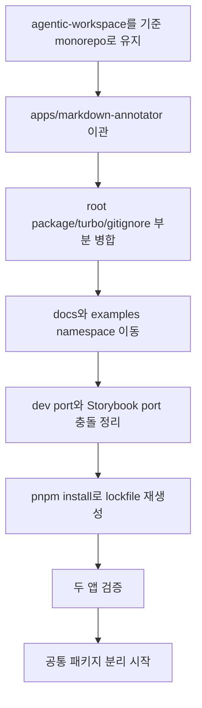
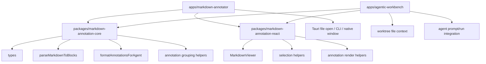
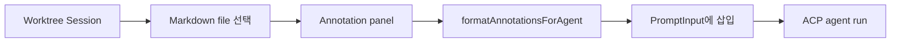
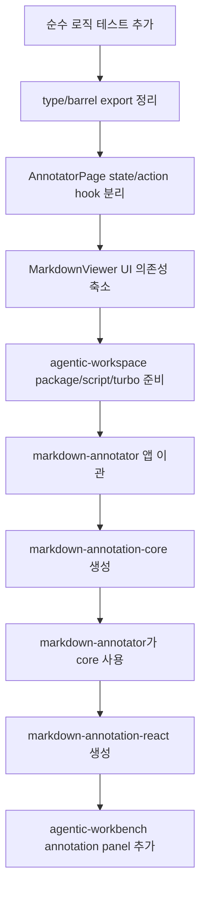

# Markdown Annotation 공통 모듈 준비 계획

## 목적

`markdown-annotator`의 Markdown annotation 기능을 `agentic-workspace` 안으로 가져오고, 이후 `agentic-workbench`에서도 같은 annotation 기능을 사용할 수 있도록 현재 코드베이스에서 미리 할 수 있는 준비 작업을 정리한다.

핵심 목표는 기능을 바로 합치는 것이 아니라, 먼저 공통화 가능한 단위를 식별하고 앱 의존성을 낮춰 이후 이관 비용을 줄이는 것이다.

## 현재 관찰

### 코드베이스 비교 요약

두 코드베이스는 이미 같은 기술 스택과 비슷한 구조를 사용한다.

| 항목 | agentic-workspace | markdown-annotator | 판단 |
| --- | --- | --- | --- |
| 루트 구조 | pnpm workspace + Turborepo | pnpm workspace + Turborepo | `agentic-workspace`를 상위 monorepo로 삼기 적합하다. |
| workspace 패턴 | `apps/*`, `packages/*` | `apps/*`, `packages/*` | 앱 디렉터리를 그대로 이관할 수 있다. |
| 앱 패키지명 | `@yoophi/agentic-workbench` | `@yoophi/markdown-annotator` | 패키지명 충돌이 없다. |
| frontend | React 19, Vite, TypeScript, FSD | React 19, Vite, TypeScript, FSD | 공통 패키지 소비 방식이 맞다. |
| backend | Tauri v2, hexagonal architecture | Tauri v2, hexagonal architecture | backend adapter 경계가 유사하다. |
| dev server | `localhost:1420` | `localhost:1420` | 병렬 실행을 위해 port 분리가 필요하다. |
| Storybook | 존재, root turbo task 없음 | 존재, root turbo task 있음 | `agentic-workspace` turbo task 확장이 필요하다. |
| docs/examples | agentic-workbench 중심 docs | annotation docs와 examples 보유 | namespace를 나눠 이관해야 한다. |

### agentic-workspace

- 루트는 이미 `pnpm workspace`와 Turborepo 기반 monorepo다.
- `apps/agentic-workbench`는 Tauri v2, Vite, React 19, TypeScript 기반이다.
- frontend는 Feature-Sliced Design 구조를 사용한다.
- backend는 domain/application/inbound/infrastructure 중심의 hexagonal architecture를 사용한다.
- Markdown 렌더링은 `apps/agentic-workbench/src/components/ui/markdown.tsx`에 있으며, agent timeline 출력용에 가깝다.
- agent prompt 입력은 `features/agent-run/ui/agent-run-panel.tsx`에 강하게 모여 있다.

### markdown-annotator

- annotation 핵심 기능은 작지만, `AnnotatorPage`에 상태와 UI interaction이 많이 모여 있다.
- 순수 로직 후보가 이미 분리되어 있다.
  - `parseMarkdownToBlocks`
  - `formatAnnotationsForAgent`
  - annotation/document/markdown-block type
- `MarkdownViewer`는 재사용 가능성이 높지만 현재 app UI 의존성이 있다.
  - `@/components/ui/button`
  - `@/components/ui/tooltip`
  - `@/lib/utils`
  - `lucide-react`
- Tauri 파일 열기, CLI, native window/tab 기능은 annotation core와 분리해야 한다.

## Monorepo 편입 방향

`agentic-workspace`를 단일 상위 monorepo로 유지하고, `markdown-annotator`는 `apps/markdown-annotator` 앱 패키지로 편입한다.

권장 구조:

```text
agentic-workspace/
  apps/
    agentic-workbench/
    markdown-annotator/
  packages/
    markdown-annotation-core/
    markdown-annotation-react/
  docs/
    agentic-workbench 관련 문서
    markdown-annotator/
  examples/
    markdown-annotator/
```

이 구조는 `markdown-annotator`를 독립 앱으로 유지하면서도, annotation core를 `agentic-workbench`에서 재사용할 수 있게 한다. 즉, 최종 목표는 앱 흡수가 아니라 기능의 공유다.

### 편입할 항목

`markdown-annotator` 저장소에서 가져올 항목:

```text
apps/markdown-annotator/
docs/annotation-architecture.md
docs/cli-open-markdown-plan.md
docs/multi-window-support-plan.md
docs/tauri-native-dual-pane-investigation.md
docs/tauri-native-window-management.md
docs/plannotator/
examples/
README.md
```

편입 후 권장 위치:

```text
apps/markdown-annotator/
docs/markdown-annotator/
examples/markdown-annotator/
apps/markdown-annotator/README.md
```

### 병합할 항목

루트 설정은 `agentic-workspace`를 기준으로 유지하고 필요한 항목만 병합한다.

- `package.json`: app별 script 추가
- `turbo.json`: Storybook task 추가
- `pnpm-lock.yaml`: `pnpm install`로 재생성
- `.gitignore`: Markdown Annotator에서 필요한 Tauri/Rust ignore 패턴 보강
- `AGENTS.md`: `apps/markdown-annotator`와 공통 패키지 작업 규칙 추가

### 그대로 가져오면 안 되는 항목

다음 파일은 `markdown-annotator` 루트의 것을 `agentic-workspace` 루트에 덮어쓰면 안 된다.

- `package.json`
- `pnpm-workspace.yaml`
- `turbo.json`
- `pnpm-lock.yaml`
- `AGENTS.md`
- `.gitignore`

이 파일들은 이미 `agentic-workspace`의 루트 역할을 하고 있으므로, 필요한 설정만 부분 병합한다.

### 피해야 할 방식

`agentic-workspace/markdown-annotator`처럼 저장소 전체를 하위 디렉터리로 넣는 방식은 피한다.

이 방식은 다음 문제를 만든다.

- monorepo 안에 또 다른 monorepo가 생긴다.
- lockfile과 turbo 설정이 중복된다.
- `docs`, `examples`, `AGENTS.md`의 기준 위치가 흐려진다.
- 공통 패키지 분리가 늦어지고 앱 간 코드 공유가 어려워진다.

따라서 앱은 `apps/markdown-annotator`로, 공유 코드는 `packages/*`로, 문서는 `docs/markdown-annotator/*`로 넣는 방식을 권장한다.

### Monorepo 편입 흐름



## 목표 아키텍처



## 선행 작업 분류

### 1. 바로 할 수 있는 낮은 위험 작업

이 단계는 기능 변경 없이 경계를 선명하게 만드는 작업이다.

#### 1.1 markdown-annotator 순수 로직 테스트 추가

대상:

- `parseMarkdownToBlocks`
- `formatAnnotationsForAgent`

이유:

- 이후 `packages/markdown-annotation-core`로 이동할 때 동작 회귀를 확인할 기준이 필요하다.
- 현재 parser는 frontmatter, table, code fence, list, blockquote, line number 계산을 직접 구현한다.
- prompt formatter는 annotation grouping, line range, raw markdown context 생성 규칙을 갖고 있어 회귀 위험이 있다.

권장 테스트:

- frontmatter가 있는 문서의 `startLine` 보정
- fenced code block의 `rawContent`, `content`, `language`
- table block 인식
- 여러 block 선택 annotation의 group line range
- `delete`, `change-request`, `note`, `question`, `approve` prompt 출력
- annotation이 없는 경우 prompt 출력

#### 1.2 type import 경로를 core 후보 기준으로 정리

현재 `markdown-annotator`의 순수 로직은 app alias `@/...`를 사용한다.

예:

```ts
import type { MarkdownBlock } from "@/entities/markdown-block/model/types";
```

준비 방향:

- 같은 앱 안에서 먼저 barrel export를 만든다.
- 이후 패키지 이동 시 import 변경 범위를 줄인다.

후보:

```text
apps/markdown-annotator/src/entities/annotation/index.ts
apps/markdown-annotator/src/entities/document/index.ts
apps/markdown-annotator/src/entities/markdown-block/index.ts
```

장기적으로는 다음 패키지 export로 치환한다.

```ts
import type { AnnotationDraft, MarkdownBlock } from "@yoophi/markdown-annotation-core";
```

#### 1.3 AnnotatorPage의 headless state/action 분리

현재 `AnnotatorPage`는 다음 책임을 함께 가진다.

- 문서 선택 및 로딩
- selection anchor 계산
- annotation draft 생성/수정/삭제
- prompt goal/instruction 상태
- CLI 설치 상태
- native window highlight 이벤트
- 전체 화면 layout

준비 방향:

- annotation 상태와 action을 hook으로 분리한다.
- Tauri/CLI/window 관련 코드는 page에 남긴다.

후보:

```text
apps/markdown-annotator/src/features/markdown-annotation/model/use-annotation-session.ts
apps/markdown-annotator/src/features/markdown-annotation/lib/selection-anchor.ts
apps/markdown-annotator/src/features/markdown-annotation/lib/annotation-index.ts
```

분리 대상:

- `getSelectionAnchors`
- `isFullBlockAnnotation`
- annotation 생성/취소/수정
- block별 inline annotation map 생성
- block별 note annotation map 생성
- deleted block id 계산

이 작업은 이후 `agentic-workbench`가 같은 session model을 가져다 쓰기 쉽게 한다.

#### 1.4 MarkdownViewer의 app UI 의존성 낮추기

현재 `MarkdownViewer`는 재사용 후보지만 앱 내부 UI primitive에 직접 의존한다.

준비 방향:

- `MarkdownViewer`를 바로 패키지로 옮기기 전에 props로 UI action renderer를 받을 수 있게 한다.
- 최소한 `Button`, `Tooltip`, `cn` 의존을 감싼 adapter layer를 만든다.

예상 방향:

```ts
type MarkdownViewerComponents = {
  InlineAnnotationActions?: React.ComponentType<InlineAnnotationActionProps>;
  BlockActions?: React.ComponentType<BlockActionProps>;
  NoteTooltip?: React.ComponentType<NoteTooltipProps>;
};
```

처음부터 완전 headless로 만들 필요는 없다. 우선 `MarkdownViewer` 내부에서 annotation rendering과 toolbar rendering을 분리하는 것이 충분하다.

### 2. agentic-workspace에서 미리 할 수 있는 작업

#### 2.1 packages 디렉터리 정책 확정

`pnpm-workspace.yaml`은 이미 `packages/*`를 포함한다. 따라서 공통 패키지 추가 준비는 되어 있다.

선행 결정:

- TypeScript package build 방식을 정한다.
- 앱 내부 Vite가 TS source를 직접 consume할지, 패키지별 `tsc` build output을 consume할지 결정한다.

권장:

- 초기에는 source package로 시작한다.
- `package.json`에 `exports`를 명시한다.
- 별도 번들러 없이 `tsc --noEmit` 또는 declaration build만 둔다.

예:

```text
packages/markdown-annotation-core/
  package.json
  tsconfig.json
  src/index.ts
```

#### 2.2 turbo task 확장

`markdown-annotator`는 Storybook task가 있다. `agentic-workspace`의 `turbo.json`에는 현재 Storybook task가 없다.

추가 후보:

```json
{
  "storybook": {
    "cache": false,
    "persistent": true
  },
  "build-storybook": {
    "outputs": ["storybook-static/**"]
  }
}
```

#### 2.3 app별 dev script 이름 정리

현재 루트 script는 `agentic-workbench` 중심이다. `markdown-annotator`가 들어오면 앱별 script를 명확히 나누는 것이 좋다.

권장:

```json
{
  "dev:workbench": "turbo run dev --filter=@yoophi/agentic-workbench",
  "dev:annotator": "turbo run dev --filter=@yoophi/markdown-annotator",
  "tauri:workbench": "turbo run tauri --filter=@yoophi/agentic-workbench --",
  "tauri:annotator": "turbo run tauri --filter=@yoophi/markdown-annotator --",
  "tauri:dev:workbench": "turbo run tauri:dev --filter=@yoophi/agentic-workbench",
  "tauri:dev:annotator": "turbo run tauri:dev --filter=@yoophi/markdown-annotator"
}
```

기존 `dev`, `tauri:dev`는 기본 앱인 `agentic-workbench`를 계속 가리키게 두는 편이 기존 사용성을 덜 깨뜨린다.

#### 2.4 dev port 충돌 방지

두 앱 모두 Tauri dev server port 기본값이 `1420`이다.

권장:

- `agentic-workbench`: `1420` 유지
- `markdown-annotator`: `1421`로 변경

`markdown-annotator`의 `ma-dev`는 `tauri.conf.json`의 `build.devUrl`을 읽으므로, `devUrl`만 바꾸면 dev server port도 같이 따라간다.

#### 2.5 agentic-workbench의 annotation 진입점 설계

`agentic-workbench`에 바로 annotation UI를 붙이기 전에, 어느 화면에서 annotation을 시작할지 정해야 한다.

추천 1차 진입점:

- worktree session 화면의 보조 panel
- 대상 Markdown 파일 path를 입력하거나 worktree 변경 파일에서 선택
- annotation prompt를 현재 agent prompt 입력창에 삽입



저장 기능은 1차 범위에서 제외하는 것이 좋다. 먼저 session-local annotation으로 시작하고, 사용성이 확인되면 repository를 추가한다.

### 3. 이관 시점에 해야 할 작업

#### 3.1 markdown-annotator 앱 이관

소스:

```text
/Users/yoophi/project/markdown-annotator/apps/markdown-annotator
```

대상:

```text
/Users/yoophi/project/agentic-workspace/apps/markdown-annotator
```

이관 후 조정:

- 루트 `pnpm-lock.yaml` 재생성
- `turbo.json` task 병합
- `package.json` script 병합
- `README.md` 위치 결정
- `docs/markdown-annotator/`로 문서 이동
- example path alias 조정
- `apps/markdown-annotator/tauri.conf.json`의 `build.devUrl` port 조정
- Storybook port 조정

이관 검증:

```bash
pnpm install
pnpm --filter @yoophi/markdown-annotator check-types
pnpm --filter @yoophi/markdown-annotator build
pnpm --filter @yoophi/agentic-workbench check-types
pnpm --filter @yoophi/agentic-workbench test
cargo check --manifest-path apps/markdown-annotator/src-tauri/Cargo.toml
cargo check --manifest-path apps/agentic-workbench/src-tauri/Cargo.toml
```

#### 3.2 markdown-annotation-core 패키지 생성

첫 이관 대상:

```text
AnnotationType
AnnotationAnchor
AnnotationDraft
MarkdownBlock
MarkdownDocument
parseMarkdownToBlocks
formatAnnotationsForAgent
```

패키지 조건:

- React 의존 없음
- Tauri 의존 없음
- DOM 의존 없음
- shadcn/ui 의존 없음
- app alias 의존 없음

#### 3.3 markdown-annotation-react 패키지 생성

두 번째 이관 대상:

```text
MarkdownViewer
InlineAnnotationMark
AnnotatedText
InlineMarkdown
```

패키지 조건:

- core package type만 import
- app-specific UI는 slot/render prop으로 주입
- 기본 styling은 className/unstyled 옵션으로 조정 가능하게 설계

## 권장 작업 순서



## 작업 단위 제안

### PR 1. agentic-workspace monorepo 수용 준비

목표:

- `agentic-workspace`가 두 번째 Tauri 앱과 공통 package를 받기 좋은 상태가 되도록 root 설정을 준비한다.

작업:

- `turbo.json`에 Storybook task 추가
- root `package.json`에 app별 script 추가
- `.gitignore`의 Tauri/Rust ignore 패턴 확인
- `AGENTS.md`에 `apps/markdown-annotator`, `packages/markdown-annotation-*` 작업 규칙 추가
- port 정책 문서화

검증:

- `pnpm run check-types`
- `pnpm run test`
- `pnpm run build`

### PR 2. markdown-annotator 회귀 테스트 추가

목표:

- core 분리 전 동작 기준선을 확보한다.

검증:

- `pnpm --filter @yoophi/markdown-annotator check-types`
- parser/formatter unit test

### PR 3. markdown-annotator annotation session 분리

목표:

- `AnnotatorPage`에서 annotation state/action을 hook과 lib로 분리한다.

검증:

- UI 동작 동일
- `pnpm --filter @yoophi/markdown-annotator check-types`
- `pnpm --filter @yoophi/markdown-annotator build`

### PR 4. markdown-annotator 앱 이관

목표:

- `apps/markdown-annotator`를 `agentic-workspace` 안에 포함한다.

검증:

- `pnpm install`
- `pnpm --filter @yoophi/markdown-annotator check-types`
- `pnpm --filter @yoophi/markdown-annotator build`
- `cargo check --manifest-path apps/markdown-annotator/src-tauri/Cargo.toml`
- 기존 `agentic-workbench` 검증 유지

### PR 5. core 패키지 분리

목표:

- 순수 annotation 로직을 `packages/markdown-annotation-core`로 이동한다.

검증:

- core test
- 두 앱 typecheck
- Markdown Annotator prompt 출력 snapshot 또는 문자열 검증

### PR 6. agentic-workbench annotation MVP

목표:

- worktree session에서 Markdown annotation 결과를 agent prompt로 삽입한다.

초기 범위:

- Markdown 파일 path 입력
- 문서 preview
- annotation 생성
- prompt 삽입
- 저장 없음

## 위험 요소와 대응

| 위험 요소 | 대응 |
| --- | --- |
| `AnnotatorPage`가 너무 많은 책임을 갖고 있어 이관 중 회귀가 생길 수 있음 | core test와 hook 분리를 먼저 수행한다. |
| `MarkdownViewer`가 app UI에 묶여 있어 공통 패키지로 바로 이동하기 어렵다 | 먼저 render prop/slot 경계를 만든 뒤 이동한다. |
| 두 Tauri 앱의 dev port가 충돌한다 | Markdown Annotator dev port를 `1421`로 분리한다. |
| 두 Storybook dev server가 모두 `6006`을 사용한다 | Markdown Annotator Storybook port를 `6007`처럼 별도 값으로 둔다. |
| 루트 파일을 덮어써 monorepo 설정이 깨질 수 있음 | `agentic-workspace` 루트 파일은 유지하고 필요한 설정만 부분 병합한다. |
| docs/examples 경로가 충돌하거나 의미가 흐려질 수 있음 | `docs/markdown-annotator`, `examples/markdown-annotator`로 namespace를 둔다. |
| agentic-workbench에 저장 모델을 너무 일찍 붙이면 설계가 커진다 | 1차 MVP는 session-local annotation과 prompt 삽입만 다룬다. |
| package 분리와 앱 이관을 한 PR에 넣으면 리뷰가 어려워진다 | 이관, core 분리, workbench 통합을 별도 PR로 나눈다. |

## 현재 코드베이스에서 먼저 시작할 작업

가장 먼저 할 작업은 `markdown-annotator`의 순수 로직 테스트와 `AnnotatorPage` 분리다. 이 작업은 `agentic-workspace`를 건드리지 않아도 진행할 수 있고, 나중에 공통 패키지로 옮길 때 회귀 방지 효과가 크다.

그 다음 `agentic-workspace`에서는 root script/turbo/port 정책을 먼저 정리한다. 이 작업은 앱 이관 전에 해도 안전하며, 이관 PR의 변경 범위를 줄인다.
