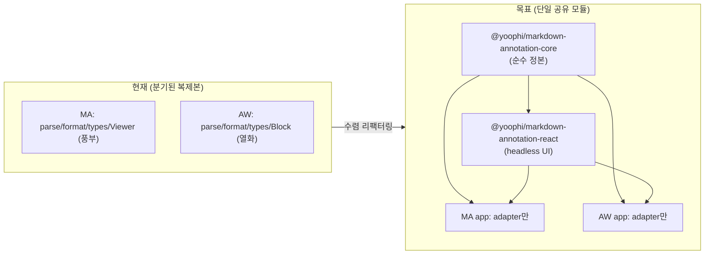
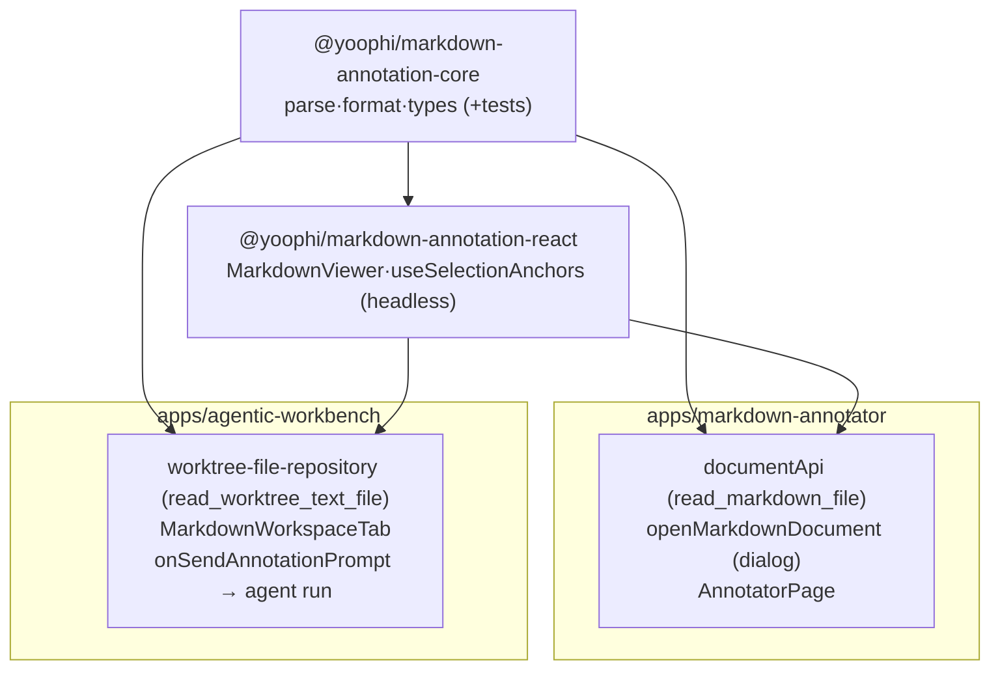
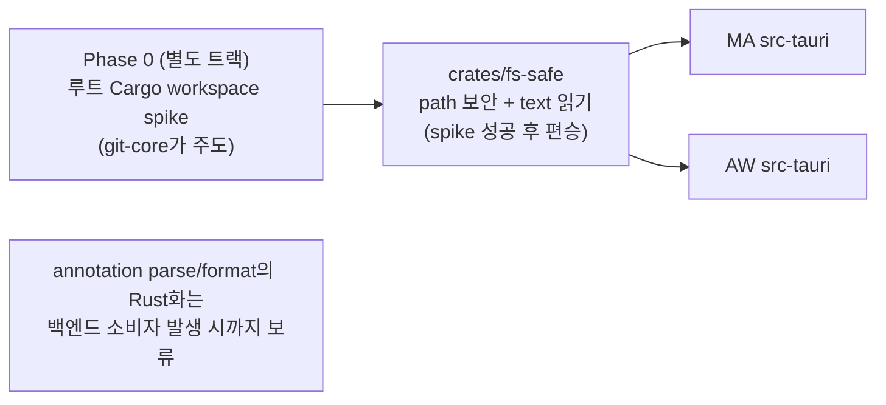
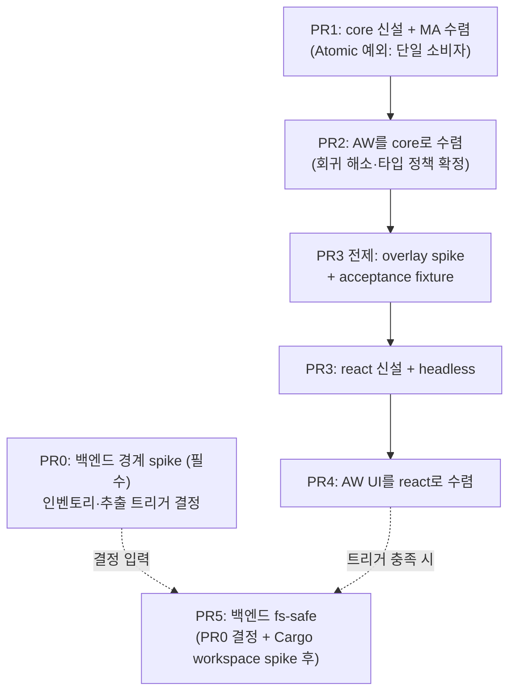
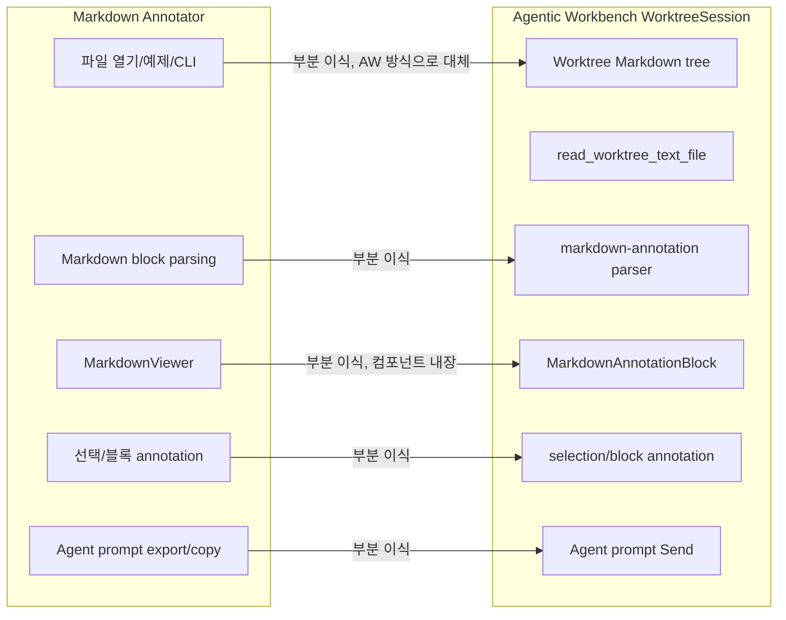
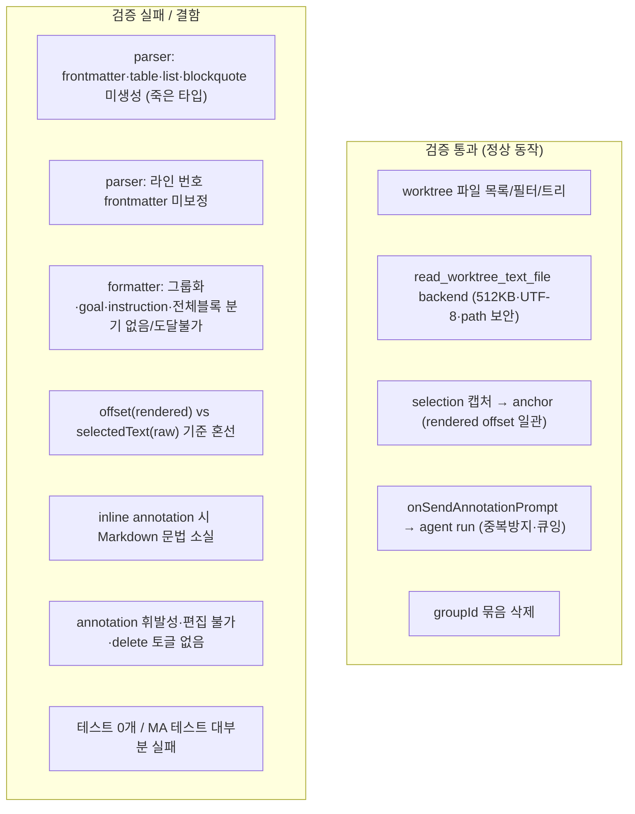
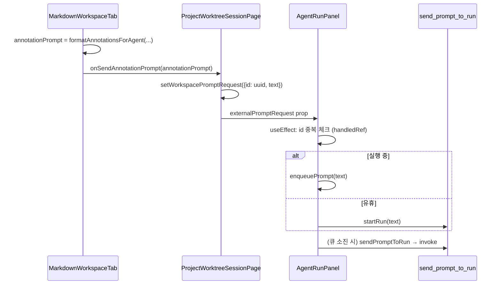

# Markdown Annotation 공유 모듈화 진행 계획

> **이 문서가 Markdown Annotation 마이그레이션의 단일 문서(single source of truth)다.** 전략·실행 계획·패키지 경계·PR 순서(본문 §0–§9)와 그 근거 분석(부록 A·B)을 모두 담는다. 이전에 분리돼 있던 평가/감사/초안 문서는 이 문서로 **통합·이관**되었고 원본은 삭제되었다.
>
> 구성:
> - **본문(§0–§9)**: 전략과 실행 계획 — 이 부분만이 실행 지침이다.
> - **부록 A**: 기능 이식 평가(MA→AW 매핑·누락) — *근거 분석*.
> - **부록 B**: 구현 정확성 감사(AW 코드 검증·재현 시나리오·테스트 대조) — *근거 분석*.
> - 부록은 "왜 이 계획이 필요한가"의 증거이며, 실행 순서·완료 기준은 본문 §6–§7을 따른다.

## 0. 이 문서의 목적과 방향 전환

이 문서의 **부록 A·B는 "이미 AW에 들어간 복사본이 MA와 얼마나 같은가"**를 분석한 근거 자료다(실행 지침은 본문을 따른다).

- **부록 A** — MA→AW 기능 매핑/누락 평가
- **부록 B** — AW 복사본의 동작 정확성 감사 (parser/formatter 열화, 테스트 0개 확인)

이 문서는 **방향 자체를 바꾼다.** 진행 방향은:

> MA의 기능을 복붙으로 재구현하지 않는다. **외부에서 쓸 수 있는 모듈로 분리(export)하고, MA와 AW가 모두 그 모듈을 import** 한다. 백엔드·프론트엔드 모두 이 원칙을 따른다.

### 0.1 현재 상태가 만드는 제약 (중요)

audit이 밝혔듯 **AW에는 이미 MA의 열화 복제본이 존재**한다:

- `apps/agentic-workbench/src/features/markdown-annotation/model/parse-markdown-to-blocks.ts` — frontmatter/table/list/blockquote 미지원
- `.../format-annotations-for-agent.ts` — group/goal/instruction/options 없음
- `.../types.ts` — annotation 3종(MA는 5종), `MarkdownBlock`에서 `ordered/checked` 제거
- `worktree-workspace-panel.tsx` 내부에 인라인 재구현된 `MarkdownAnnotationBlock`/`AnnotatedInlineText`

따라서 이 작업은 신규 이식이 아니라 **"분기된 2개 복제본을 단일 공유 모듈로 수렴(converge)"** 시키는 리팩터링이다. 부수 효과로 audit이 지적한 AW의 회귀(열화)가 **자동으로 해소**된다 — 공유 core가 MA의 풍부한 구현을 정본(canonical)으로 삼기 때문이다.



---

## 1. 조사로 확정한 현재 인프라 사실

새 계획이 발 딛는 사실 기반(모두 코드 근거 확인).

### 1.1 모노레포 공유 인프라 (가능, 선례 존재)

| 항목 | 사실 | 근거 |
|---|---|---|
| 패키지 매니저 | pnpm 9.10.0 workspaces | `package.json:6` |
| workspace glob | `apps/*`, `packages/*` | `pnpm-workspace.yaml:1-3` |
| 태스크 러너 | Turbo, `build`는 `dependsOn: ["^build"]` | `turbo.json:4-6` |
| 기존 공유 패키지 | **`@yoophi/ui`** (1개) | `packages/ui/package.json:2` |
| 공유 방식 | **빌드 없는 source-direct export** (exports 와일드카드, `dist` 없음) | `packages/ui/package.json:9-12` |
| 소비 선례 | `git-explorer`가 `"@yoophi/ui": "workspace:*"`로 사용 | `apps/git-explorer/package.json:22` |
| 네이밍 컨벤션 | `@yoophi/<pkg>` (앱도 `@yoophi/git-explorer`) | 기존 패키지/앱 |
| TS 모듈 해석 | `moduleResolution: "bundler"`, exports 인식, project references 미사용 | `tsconfig.base.json` |
| import 경계 규칙 | 없음 (eslint boundary 미설정) | 루트에 eslint config 부재 |

> 결론: **새 `packages/*` 패키지를 추가하면 pnpm/Turbo가 자동 인식**한다. `@yoophi/ui`가 그대로 따라 할 템플릿이다. 단, AW·MA는 현재 어떤 공유 패키지도 소비하지 않으므로 첫 소비자가 된다.

### 1.2 Rust 백엔드 인프라 (공유 기반 부재)

| 항목 | 사실 | 근거 |
|---|---|---|
| 루트 Cargo workspace | **없음** | 루트 `Cargo.toml` 부재 |
| 각 앱 crate | 독립 (`markdown-annotator`, `agentic-workbench`) | 각 `src-tauri/Cargo.toml` |
| 공유 crate | **없음** (`crates/` 디렉토리 자체가 없음) | 조사 결과 |
| edition | 양쪽 `2024` | 각 Cargo.toml |

> 결론: 백엔드는 **공유 기반이 아직 없다.** 공유 crate를 도입하려면 루트 Cargo workspace 결정이 선행돼야 하는데, 이는 `git-feature-sharing-monorepo-strategy.md`가 "최대 리스크, Phase 0 spike 선행"으로 못박은 사안이다.

### 1.3 이미 확립된 결정과의 정합 (반드시 준수)

| 기존 결정 | 출처 | 이 계획의 준수 방법 |
|---|---|---|
| `packages/markdown-annotation-core` + `-react` 분리 | `markdown-annotation-preparation-plan.md` | 그대로 채택 (이름에 `@yoophi/` scope 부여) |
| core는 React/Tauri/DOM/app-alias 의존 0 | 동 문서 | §3.1 경계로 강제 |
| react는 core의 순수 API(타입+helper)만 import, UI는 slot/render prop 주입 | 동 문서 | §3.2 headless 설계 |
| 공유 승격은 "둘 이상" 조건 충족 시 | `git-feature-sharing-monorepo-strategy.md` | §5에서 항목별 판정 |
| Tauri/AppHandle/Window/JSON 경로는 core에서 분리 | `portable-architecture-plan.md` | §3, §4 adapter 경계 |
| path/scope 기반 API (repositoryId 아님) | `portable-architecture-plan.md`, git 전략 | core 함수는 순수 입력만 받음 (이미 그러함) |
| 루트 Cargo workspace는 Phase 0 spike 후 | git 전략 | §4에서 백엔드를 spike 뒤로 정렬 |
| Atomic PR (공통+양쪽 adapter+검증 한 PR) | git 전략 | §6 단계별 PR 정의 |

---

## 2. 무엇을 공유하고 무엇을 남기나 (의존성 기준 분류)

조사에서 각 파일의 import 의존성을 추적해 3계층으로 분류했다.

### 2.1 프론트엔드

| 파일 (MA 기준) | 외부 의존 | 분류 | 목적지 |
|---|---|---|---|
| `features/markdown-renderer/parseMarkdownToBlocks.ts` | 없음 (타입만) | **순수** | `@yoophi/markdown-annotation-core` |
| `features/export-annotations/formatAnnotationsForAgent.ts` | 없음 (타입만) | **순수** | core |
| `entities/annotation/model/types.ts` | 없음 | **순수 타입** | core |
| `entities/markdown-block/model/types.ts` | 없음 | **순수 타입** | core |
| `entities/document/model/types.ts` | 없음 | **순수 타입** | core |
| `shared/ui/MarkdownViewer.tsx` | react, react-markdown, remark-gfm, lucide, 내부 Button/Tooltip | **React UI** | `@yoophi/markdown-annotation-react` (headless화) |
| `getSelectionAnchors`/`getTextOffsetWithin` (현재 `AnnotatorPage`·AW 패널에 인라인) | `window.getSelection`, `Range`, DOM | **DOM helper** | react 패키지의 headless 함수 |
| `pages/annotator/AnnotatorPage.tsx` | @tauri-apps/event, React state, DOM | **앱-로컬** | `apps/markdown-annotator` 유지 |
| `features/open-document/openMarkdownDocument.ts` | @tauri-apps/plugin-dialog, file input | **앱-로컬(어댑터)** | MA 유지 |
| `entities/document/api/documentApi.ts` | @tauri-apps/api/core invoke | **앱-로컬(IPC)** | MA 유지 |
| (AW) `worktree-file/api/worktree-file-repository.ts` | invoke | **앱-로컬(IPC)** | AW 유지 |

### 2.2 백엔드 (Rust)

| 후보 | 출처 라인 | 분류 | 판정 |
|---|---|---|---|
| `canonical_root` / `resolve_worktree_path` / `relative_path` (path traversal 방어) | AW `fs_worktree_file_provider.rs:109-145` | 순수 함수 | 공유 가능하나 ~80줄 (저수익) |
| `read_text_file_safe` (UTF-8+512KB) | AW `fs_worktree_file_provider.rs:87-98` | 순수 함수 | 공유 가능하나 ~40줄 |
| `parseMarkdownToBlocks`/`formatAnnotationsForAgent`의 Rust 판 | **존재하지 않음** (TS만 있음) | — | Rust 재구현은 고비용·저이득 (★★) |
| Window/Tab 관리, AppState, CLI launcher, `#[tauri::command]` | MA/AW 각각 | Tauri 종속 | **공유 불가, 앱 유지** |

> **백엔드 핵심 사실**: annotation 도메인 로직(파싱·포맷)은 **백엔드에 없다. 프론트엔드 TS에만 있다.** 그래서 "백엔드 영역 모듈화"의 실질 대상은 annotation이 아니라 *파일 입출력 안전 로직*뿐이며, 그 양은 ~120줄에 불과하고 MA/AW가 이미 각자 헥사고날 레이어로 잘 분리해 둔 상태다(application/domain이 Tauri 비의존). 따라서 백엔드는 **지금 당장 별도 패키지를 만들 만큼의 압력이 없다.** §4에서 정직하게 다룬다.

---

## 3. 프론트엔드 공유 패키지 설계

### 3.1 `@yoophi/markdown-annotation-core` (순수 로직 정본)

`@yoophi/ui`와 동일한 source-direct 패턴(빌드 없음).

```
packages/markdown-annotation-core/
  package.json
  tsconfig.json
  src/
    index.ts                       # barrel (parse/format/helpers + types re-export)
    types/
      index.ts                     # 타입 barrel (export map ./types 의 진입점)
      annotation.ts                # AnnotationType(5종), AnnotationAnchor, AnnotationDraft
      markdown-block.ts            # MarkdownBlockType(7종), MarkdownBlock(ordered/checked 복원)
      document.ts                  # MarkdownDocument
    parse/
      parse-markdown-to-blocks.ts  # MA의 풍부한 구현(frontmatter/table/list/blockquote)
      parse-markdown-to-blocks.test.ts
    format/
      format-annotations-for-agent.ts  # MA 구현(group/goal/instruction/context)
      format-annotations-for-agent.test.ts
    annotate/
      annotation-helpers.ts        # 순수 helper: isFullBlockAnnotation, buildInlineAnnotationsByBlock 등
```

> `./types` export는 `src/types/index.ts` barrel을 가리킨다(폴더에 반드시 동반). 또한 parser/formatter에 흩어져 있던 순수 helper(`isFullBlockAnnotation` — MA `formatAnnotationsForAgent.ts:67-70`, `buildInlineAnnotationsByBlock` — AW `worktree-workspace-panel.tsx:157`)를 `annotate/`로 모아 core가 단일 소유한다. react 패키지·양쪽 앱이 모두 이 helper를 재사용해 중복을 막는다.

`package.json` (템플릿: `@yoophi/ui` + vitest):

```json
{
  "name": "@yoophi/markdown-annotation-core",
  "version": "0.1.0",
  "private": true,
  "type": "module",
  "exports": {
    ".": "./src/index.ts",
    "./types": "./src/types/index.ts"
  },
  "scripts": {
    "check-types": "tsc --noEmit",
    "test": "vitest run"
  },
  "devDependencies": {
    "typescript": "^5",
    "vitest": "^4.1.9"
  }
}
```

- **외부 런타임 의존 0.** react/dom/tauri 금지(ESLint 또는 리뷰로 강제). `vitest`/`typescript`는 devDependency이므로 런타임 의존 0 원칙과 무관하다.
- 정본은 **MA 버전**을 채택한다. AW의 열화 버전은 폐기. 이로써 audit의 회귀 7건이 소멸.
- **테스트 동반 이동**: MA의 `parseMarkdownToBlocks.test.ts`(3 케이스), `formatAnnotationsForAgent.test.ts`(4 케이스)를 이 패키지로 옮긴다. `pnpm --filter @yoophi/markdown-annotation-core test`로 실행된다. audit이 "AW 테스트 0개"라 지적한 부분을 공유 패키지가 흡수한다.

공개 API(양쪽 앱이 import):

```ts
import {
  parseMarkdownToBlocks,
  formatAnnotationsForAgent,
  isFullBlockAnnotation,
  buildInlineAnnotationsByBlock,
} from "@yoophi/markdown-annotation-core";
import type {
  AnnotationType, AnnotationAnchor, AnnotationDraft,
  MarkdownBlock, MarkdownBlockType, MarkdownDocument,
} from "@yoophi/markdown-annotation-core/types";
```

### 3.2 `@yoophi/markdown-annotation-react` (headless UI)

MA의 `MarkdownViewer`를 정본으로 하되, **UI 키트 종속을 주입(slot/render prop)으로 추상화**한다(prep plan의 "UI는 slot/render prop으로 주입" 원칙).

```
packages/markdown-annotation-react/
  package.json
  src/
    index.ts
    MarkdownViewer.tsx          # block map 렌더 (react-markdown + remark-gfm)
    AnnotatedText.tsx           # offset 기반 <mark> 분할
    use-selection-anchors.ts    # headless: getSelectionAnchors/getTextOffsetWithin (DOM)
    types.ts                    # MarkdownViewerInlineAnnotation 등 viewer 전용 타입
```

```json
{
  "name": "@yoophi/markdown-annotation-react",
  "type": "module",
  "exports": { ".": "./src/index.ts" },
  "peerDependencies": {
    "react": "^19", "react-dom": "^19",
    "react-markdown": "*", "remark-gfm": "*"
  }
}
```

설계 원칙:

- **core의 순수 API(타입 + helper)만 import한다.** `type만`으로 좁히지 않는다 — `isFullBlockAnnotation`, `buildInlineAnnotationsByBlock` 같은 순수 helper도 core에서 가져와 재사용해 중복을 막는다. 단방향 규칙은 **react → core 의존만 허용, core → react 역방향 의존 금지**다.
- **아이콘/버튼/툴팁은 props로 주입**한다. 예: `renderBlockToolbar?: (block) => ReactNode`, `components?: { Button; Tooltip }`. 이렇게 해야 MA(자체 shadcn)와 AW(자체 UI)가 각자 키트를 꽂을 수 있다 — `@yoophi/ui` 강제 의존을 피한다.
- DOM 선택 로직을 `useSelectionAnchors(rootRef)` 훅으로 headless화. offset 기준(렌더 텍스트)을 명문화해 audit의 offset 혼선을 한 곳에서 관리.
- inline annotation 렌더의 목표는 audit이 지적한 "annotation을 달면 Markdown 문법(`**bold**`·`` `code` ``·`[link]`)이 평문으로 소실"되는 문제 해결이다. 다만 **ReactMarkdown AST 위에 `<mark>`를 삽입하는 것은 구현 난도가 높다** — 현재 offset anchor가 *렌더 텍스트* 기준이라, AST 위에 얹으려면 text node traversal, `em`/`code`/`link` 내부에서의 offset split, 중첩 annotation 정책이 필요하다. 따라서 이 항목은 **PR3 착수 전 spike + acceptance fixture로 실현 가능성을 먼저 검증**한다(§6 PR3 전제). spike 실패 시 대안으로 "annotation이 걸린 블록도 inline 문법은 ReactMarkdown으로 보존하고, 하이라이트는 텍스트 위 `<mark>` 대신 **별도 레이어/툴팁으로 제공**" 하는 절충안을 택한다(하이라이트 자체를 생략하지는 않는다) — 즉 "overlay 성공"을 PR4의 전제 조건으로 강제하지 않는다.

### 3.3 앱-로컬에 남는 것 (어댑터)

각 앱이 자기 플랫폼 바인딩만 구현:

- **MA**: `documentApi.ts`(`read_markdown_file` invoke), `openMarkdownDocument.ts`(dialog), `AnnotatorPage.tsx`(오케스트레이션) — 공유 core/react를 import해서 조립.
- **AW**: `worktree-file-repository.ts`(`read_worktree_text_file` invoke), `MarkdownWorkspaceTab`(worktree tree + 선택 + prompt 전송) — 공유 core/react를 import. 기존 `features/markdown-annotation/model/*`는 **삭제**하고 core를 가리키게 교체.



---

## 4. 백엔드 전략 (정직한 범위 설정)

### 4.1 실태

annotation의 핵심 도메인 로직(파싱·포맷)은 **Rust 백엔드에 없다.** 양쪽 앱 모두 파일을 텍스트로 읽어 프론트엔드로 넘기고, 파싱·포맷·annotation은 전부 TS에서 한다. 그러므로 "백엔드 영역도 같은 방향" 요구를 만족시키는 길은 두 가지다.

- **(a) 파일 입출력 안전 로직 공유 crate** — `path-safe-file`(~80줄), `text-file-reader`(~40줄). 실재하는 중복이지만 작고, 이미 각 앱이 헥사고날로 분리해 둠.
- **(b) annotation 파싱/포맷을 Rust로 끌어올려 공유** — 현재 TS 구현을 Rust로 재작성. 고비용(언어 전환, 테스트 재이식), 저이득(프론트가 이미 동작). **권장하지 않음.**

### 4.2 권장: 백엔드는 "git-core Phase 0"에 편승, 독립 선행하지 않음

`git-feature-sharing-monorepo-strategy.md`는 이미 **`crates/git-core` + 루트 Cargo workspace 도입(Phase 0 spike)**을 계획했고, 이를 "최대 리스크"로 분류해 spike 선행을 의무화했다. 파일 안전 로직(`path-safe-file`/`text-file-reader`)은 git-core와 **같은 인프라 결정(루트 workspace 또는 path dependency)** 을 필요로 한다.

따라서:

1. **지금 별도 annotation용 backend 패키지를 만들지 않는다.** (승격 기준 "둘 이상" 중 강한 항목을 만족하지 못함 — 중복은 있으나 작고 버그를 만들고 있지 않음.)
2. 루트 Cargo workspace가 git-core를 위해 **이미 도입되는 시점에**, 파일 안전 로직을 `crates/fs-safe`(가칭)로 함께 추출한다. 그때 MA·AW가 동시 소비.
3. annotation 파싱의 Rust 이전(옵션 b)은 **CLI 모드 등 백엔드 파싱이 실제로 필요한 소비자가 생길 때**로 보류한다(현재 미충족).



### 4.3 필수 산출물: 백엔드 경계 인벤토리와 결정 (PR0, 보류가 아니라 "검증된 결정")

사용자 요구는 **"백엔드·프론트엔드 모두 이 방향"**이다. 따라서 백엔드를 단순히 "PR5로 미룸"으로 두지 않는다. 코드 추출은 Cargo workspace 결정에 종속되어 뒤로 갈 수 있어도, **"무엇이 export 가능한 경계인가"와 "왜 지금 추출을 보류/진행하는가"를 검증한 산출물은 지금 필수로 만든다.** 이것이 백엔드 영역에서도 "복붙 대신 모듈 경계로 사고한다"는 방향을 충족시키는 최소 단위다.

PR0(백엔드 경계 spike)의 **필수 산출물**:

1. **export 가능 경계 인벤토리**: MA/AW src-tauri에서 Tauri 비의존 순수 함수를 전수 목록화한다. 최소 후보는 `canonical_root`/`resolve_worktree_path`/`relative_path`(AW `fs_worktree_file_provider.rs:109-145`)와 `read_text_file_safe`(동 `:87-98`), MA `resolve_markdown_file`/`is_markdown_file`. 각 함수의 시그니처·Tauri 의존 여부·중복도를 표로 남긴다.
2. **공유 불가 경계 확정**: Window/Tab 관리, `AppState`/세션 registry, CLI launcher, `#[tauri::command]` 래퍼가 왜 앱-로컬로 남아야 하는지 1줄씩 근거를 기록한다.
3. **추출 트리거 결정**: 파일 안전 로직을 `crates/fs-safe`로 빼는 것을 (a) 지금 독립 도입할지, (b) git-core Phase 0 Cargo workspace spike에 편승할지, (c) 보류할지 — 셋 중 하나를 **명시적으로 선택하고 그 조건을 적는다**. 본 계획의 권장은 (b)다(아래 근거). 단, 이 선택 자체가 PR0의 산출물이며 "검증 없이 보류"가 아니다.
4. **annotation 파싱의 Rust 이전 판정**: 현재 백엔드 소비자(CLI 파싱 등)가 없음을 확인하고, 생길 경우의 트리거를 적는다.

> 권장 결정 근거 (b): `crates/fs-safe`는 git-core와 **같은 인프라 결정(루트 workspace 또는 path dependency)** 을 요구하고, 그 도입은 git 전략이 "최대 리스크 → Phase 0 spike 선행"으로 못박았다. 파일 안전 로직(~120줄)만을 위해 동일 리스크를 **중복 부담**하는 것은 비효율이므로, git-core용 workspace가 서는 시점에 함께 추출한다. PR0은 이 결정을 *문서로 확정*하는 산출물이고, 실제 코드 추출은 PR5다.

> 요약: **프론트엔드가 이번 모듈화의 본진**이고, 백엔드는 "PR0에서 경계와 추출 트리거를 검증해 확정(필수)"하되 "코드 추출(PR5)은 Cargo workspace 결정에 정렬"한다. 백엔드는 보류가 아니라 **결정이 산출물인 단계**를 가진다.

#### 4.3.1 PR0 산출물 — export 가능 경계 인벤토리

| 앱 | 함수/경계 | 현재 위치 | 시그니처 | Tauri 의존 | 중복도/공유성 | 판정 |
|---|---|---|---|---|---|---|
| AW | `canonical_root` | `apps/agentic-workbench/src-tauri/src/infrastructure/fs_worktree_file_provider.rs:101` | `fn canonical_root(path: &str) -> Result<PathBuf, String>` | 없음. `std::fs`, `PathBuf`만 사용 | MA에는 동일 함수가 없지만, 경로 루트 정규화 정책은 `fs-safe`의 공통 기반이 될 수 있음 | `crates/fs-safe` 후보 |
| AW | `resolve_worktree_path` | `apps/agentic-workbench/src-tauri/src/infrastructure/fs_worktree_file_provider.rs:112` | `fn resolve_worktree_path(root: &Path, relative_path: &str) -> Result<PathBuf, String>` | 없음. `std::fs`, `Path`, `Component`만 사용 | path traversal 방어의 핵심. MA의 파일 열기 경로 검증과 목적이 유사하나 worktree-relative 입력을 전제로 함 | `crates/fs-safe` 후보 |
| AW | `relative_path` | `apps/agentic-workbench/src-tauri/src/infrastructure/fs_worktree_file_provider.rs:134` | `fn relative_path(root: &Path, path: &Path) -> Result<String, String>` | 없음. `Path`만 사용 | worktree 내부 경로 표시/응답 변환에 재사용 가능 | `crates/fs-safe` 후보 |
| AW | 안전 텍스트 읽기 블록 | `apps/agentic-workbench/src-tauri/src/infrastructure/fs_worktree_file_provider.rs:70-98` | `WorktreeFileProvider::read_text_file(&self, working_directory: &str, requested_relative_path: &str) -> Result<WorktreeTextFile, String>` 내부 | Tauri 없음. domain trait 구현체이며 `std::fs`/UTF-8 검증만 사용 | 디렉터리 거부, 512KB preview 제한, UTF-8 검증은 MA에도 유효한 정책 | `read_text_file_safe` 형태로 추출 후보 |
| MA | `resolve_markdown_file` | `apps/markdown-annotator/src-tauri/src/inbound/tauri_commands.rs:268` | `fn resolve_markdown_file(raw_path: &str) -> Result<PathBuf, String>` | 함수 자체는 Tauri 없음. 호출부는 window/tab command와 결합 | 절대 경로 정규화 + 파일 존재/확장자 검증. AW의 worktree-relative 경로 방어와 정책 일부가 겹침 | 확장자 검증 helper와 path 검증 정책 분리 후보 |
| MA | CLI launcher `resolve_markdown_file` | `apps/markdown-annotator/src-tauri/src/cli_launcher.rs:67` | `fn resolve_markdown_file(raw_target: &str, cwd: &Path) -> Result<PathBuf, String>` | Tauri 없음. CLI argv/cwd 입력만 사용 | inbound 쪽 `resolve_cli_path` + `is_markdown_file`와 중복 성격. 공통 path resolver가 생기면 정리 가능 | `fs-safe` 이후 정리 후보 |
| MA | `is_markdown_file` | `apps/markdown-annotator/src-tauri/src/inbound/tauri_commands.rs:341`, `apps/markdown-annotator/src-tauri/src/cli_launcher.rs:421` | `fn is_markdown_file(path: &Path) -> bool` | 없음 | MA 내부에서도 중복. AW 프론트엔드의 `isMarkdownPath`와 정책이 분산됨 | 확장자 정책 helper 후보 |

#### 4.3.2 PR0 산출물 — 공유 불가 경계

| 경계 | 앱-로컬 유지 근거 |
|---|---|
| Window/Tab 관리 | `WebviewWindowBuilder`, native tab attach, focus/highlight event는 Tauri window runtime과 OS별 동작에 직접 결합되어 순수 crate API가 될 수 없다. |
| `AppState`/세션 registry | AW의 provider session, run/session registry, event sink는 앱의 실행 상태와 lifecycle을 소유하므로 파일 안전 로직과 함께 공유하면 crate 책임이 섞인다. |
| CLI launcher | MA 전용 `ma` 실행 스크립트 설치, argv 해석, 앱 실행 파일 위치 계산은 배포 형태와 앱 이름에 묶여 있어 공유 도메인이 아니다. |
| `#[tauri::command]` 래퍼 | IPC 시그니처와 serde payload, `AppHandle`/window 주입은 각 앱 inbound adapter다. 공유할 수 있는 것은 command 안쪽의 순수 path/text 정책뿐이다. |

#### 4.3.3 PR0 산출물 — 추출 트리거 결정

결정은 **(b) git-core Phase 0 Cargo workspace spike에 편승**이다. `crates/fs-safe`는 루트 Cargo workspace 또는 안정적인 path dependency 정책이 필요하고, 그 인프라 리스크는 이미 git-core 공유화 전략의 Phase 0에서 검증하기로 되어 있다. 따라서 지금은 독립 crate를 만들지 않고, 아래 조건이 모두 충족될 때 PR5를 착수한다.

1. git-core용 루트 Cargo workspace Phase 0 spike가 Tauri dev/build 레이아웃을 깨뜨리지 않는다는 검증을 통과한다.
2. `crates/fs-safe`가 AW의 worktree-relative path 방어와 MA의 absolute markdown file 검증을 함께 담아도 앱 책임을 침범하지 않는 API 모양이 확정된다.
3. MA와 AW가 같은 PR에서 path dependency로 동시 소비하고, 양쪽 Rust `test`/`check`와 앱 `tauri build`가 통과한다.

#### 4.3.4 PR0 산출물 — annotation 파싱 Rust 이전 판정

현재 annotation 파싱·포맷 소비자는 프론트엔드 TS뿐이다. MA CLI도 파일을 앱으로 여는 launcher 역할이며, markdown block parsing이나 annotation prompt formatting을 Rust에서 수행하지 않는다. 따라서 `parseMarkdownToBlocks`/`formatAnnotationsForAgent`의 Rust 이전은 **보류**한다.

Rust 이전 트리거는 다음 중 하나가 실제 요구로 생길 때다.

- GUI 없이 CLI에서 annotation prompt를 생성해야 한다.
- Tauri backend에서 markdown block id/offset을 생성해 프론트엔드와 공유해야 한다.
- 파일 저장/patch 적용 use case가 Rust에서 annotation 구조를 직접 해석해야 한다.

---

## 5. 공유 승격 판정 (기존 "둘 이상" 기준 적용)

`git-feature-sharing-monorepo-strategy.md`의 승격 조건으로 각 후보를 채점.

| 후보 | ①반복 변경 | ②불일치가 버그 유발 | ③adapter만 다름 | ④공통 fixture 검증 | ⑤headless 가능 | 판정 |
|---|:--:|:--:|:--:|:--:|:--:|:--:|
| parse/format/types (core) | ✓ | ✓(audit이 입증) | ✓ | ✓ | ✓ | **즉시 승격** |
| MarkdownViewer (react) | ✓ | ✓ | ✓ | △ | ✓(주입화 후) | **승격(주입화 선행)** |
| path-safe-file / text-file-reader | △ | △ | ✓ | ✓ | ✓ | **보류(Cargo workspace 편승)** |
| annotation 파싱 Rust화 | ✗ | ✗ | — | — | ✓ | **보류(소비자 부재)** |

core는 다섯 조건을 모두 만족 — 특히 ②는 audit이 "AW 복제본이 열화되어 frontmatter/table/list/group 등에서 다른 결과를 낸다"고 이미 증명했다. 이것이 이번 모듈화의 가장 강한 정당성이다.

---

## 6. 단계별 실행 계획

**Atomic PR 원칙과 그 예외(명시)**: 공통 코드를 *변경*하는 PR은 한 PR 안에서 양쪽 소비자(adapter)와 양쪽 검증까지 닫는 것을 원칙으로 한다. 단, **공유 패키지를 처음 만드는 부트스트랩 PR(PR1)은 정본을 안전하게 세우기 위해 단일 소비자(MA)로 제한할 수 있으며, 이를 Atomic 원칙의 명시적 예외로 둔다.** 예외가 허용되는 이유는 PR1 시점에 AW는 자신의 기존 복제본으로 계속 빌드되어 깨지지 않고, **PR1 직후 PR2를 연속 착수**해 분기 상태를 한 단계 이상 장기화하지 않기 때문이다(분기는 PR1~PR2 사이에만 일시적으로 존재한다). 이후 PR2~PR4는 모두 Atomic 원칙을 따른다.

### PR 0 — 백엔드 경계 spike (필수, 산출물 = 문서)

§4.3의 4개 필수 산출물(경계 인벤토리 / 공유 불가 근거 / 추출 트리거 결정 / Rust 이전 판정)을 만든다. 코드 추출은 하지 않으며, 결과를 본 문서 또는 별도 ADR에 기록한다. PR1과 병행 가능(프론트엔드와 독립).

### PR 1 — core 패키지 신설 + 정본 확정 + MA 소비 〔Atomic 예외: 단일 소비자〕

1. `packages/markdown-annotation-core` 생성(`@yoophi/ui` 구조 복제 + vitest devDependency·`test` 스크립트).
2. MA의 `parseMarkdownToBlocks`, `formatAnnotationsForAgent`, 순수 helper(`isFullBlockAnnotation` 등), 3개 type을 **그대로** 이 패키지로 이동(정본). `types/index.ts` barrel 작성.
3. MA의 두 test 파일도 동반 이동. `pnpm --filter @yoophi/markdown-annotation-core check-types && pnpm --filter @yoophi/markdown-annotation-core test` 통과.
4. MA가 새 패키지를 `workspace:*`로 소비하도록 import 경로 교체(`@/features/...` → `@yoophi/markdown-annotation-core`). MA 기존 파일 삭제.
5. 검증: MA `pnpm typecheck`, MA dev/tauri 기동 회귀 없음.

> **Atomic 예외 명시**: 이 PR은 AW를 건드리지 않는다(부트스트랩). AW는 기존 복제본으로 계속 빌드되며, PR2를 연속 착수해 수렴시킨다. AW의 분기는 PR1~PR2 사이에만 일시적으로 존재하고 한 단계 이상 장기화되지 않으므로 안전하다.

### PR 2 — AW를 core로 수렴 (열화 복제본 제거) 〔Atomic〕

1. AW `apps/agentic-workbench/package.json`에 `"@yoophi/markdown-annotation-core": "workspace:*"` 추가.
2. AW `features/markdown-annotation/model/{parse-markdown-to-blocks,format-annotations-for-agent,types}.ts` **삭제**, 모든 참조를 core로 교체(인라인 helper도 core의 것으로 대체).
3. **annotation 타입 확장 정책(확정, Open Question 2 해소)**: core 정본은 5종(`note`/`change-request`/`delete`/`question`/`approve`)을 모두 보존한다. AW는 **"표시는 가능, 신규 생성만 제한"** 정책을 따른다 — 즉 AW UI의 annotation *생성* 버튼은 기존 3종만 노출하되, 외부(공유 prompt fixture·다른 소비자·향후 import)에서 들어온 `question`/`approve` annotation은 badge/highlight/prompt에 **정상 렌더·포함**한다. 따라서 `worktree-workspace-panel.tsx`의 타입별 분기(badge/highlight/instruction)는 5종 모두를 처리하고, 생성 UI에서만 2종을 숨긴다. (생성 자체를 막는 "비노출 타입 생성 불가" 안은 채택하지 않는다 — 표시 누락이 데이터 손실로 보이기 때문.)
4. `MarkdownBlock`에 `ordered/checked` 복원되어 parser가 list/table/blockquote 블록을 만들기 시작 → 패널의 block 렌더 분기가 실제로 동작하는지 확인(audit의 죽은 분기 해소).
5. 검증: AW `pnpm typecheck`, AW dev/tauri 기동, Markdown 탭에서 frontmatter/표/리스트 문서가 올바르게 블록 분할되는지 수동 확인.

> 완료 시 audit이 지적한 parser/formatter 회귀가 사라진다.

### PR 3 — react 패키지 신설 + headless 추출 〔Atomic, overlay spike 선행〕

**전제(필수)**: 본 PR 착수 전, §3.2의 "ReactMarkdown 위 inline annotation overlay" 실현 가능성을 **spike + acceptance fixture**로 검증한다. fixture는 최소 `**bold**` 내부 부분 선택, `` `code` `` 경계 선택, link 텍스트 일부 선택, 중첩 annotation 4종을 포함한다. spike 실패 시 §3.2의 절충안(하이라이트를 별도 레이어/툴팁으로 분리)을 채택하며, 이는 PR4의 차단 요인이 아니다.

1. `packages/markdown-annotation-react` 생성(peerDeps react/react-markdown/remark-gfm).
2. MA `MarkdownViewer`를 이동하되 Button/Tooltip/아이콘을 **props 주입**으로 전환(키트 비종속화). core의 순수 helper를 재사용.
3. DOM 선택 로직을 `useSelectionAnchors` 훅으로 추출, offset 기준(렌더 텍스트) 명문화.
4. inline annotation 렌더를 spike 결과에 따라 overlay 또는 절충안으로 구현. acceptance fixture를 패키지 테스트로 고정.
5. MA가 react 패키지를 소비하도록 교체.

### PR 4 — AW UI를 react 패키지로 수렴

1. AW `worktree-workspace-panel.tsx`의 인라인 `MarkdownAnnotationBlock`/`AnnotatedInlineText`를 제거하고 `@yoophi/markdown-annotation-react`의 컴포넌트 + `useSelectionAnchors`로 교체.
2. AW 고유 부분(worktree 파일 트리, 선택 카드, `onSendAnnotationPrompt` → agent run)은 앱-로컬로 유지하되 viewer/selection만 공유로 대체.
3. 검증: 양쪽 앱에서 동일 문서에 대해 동일 annotation prompt가 나오는지 공통 fixture로 확인.

### PR 5 (선택, 보류 가능) — 백엔드 fs-safe

- **전제**: git-core용 루트 Cargo workspace Phase 0 spike가 성공한 이후에만 착수.
- `crates/fs-safe`로 path 보안 + 안전 텍스트 읽기 추출, MA·AW가 path dependency로 소비.
- spike 미완 또는 git-core 일정과 충돌 시 **무기한 보류**(현재 중복이 작고 위험하지 않으므로 비용 정당화 안 됨).



> PR0과 PR1은 병행 가능(독립). PR5는 PR0의 결정과 git-core Cargo workspace spike 결과에 정렬된다.

---

## 7. 완료 기준 (검증 표준)

기존 git 전략의 완료 기준 형식을 따른다.

- core: `parseMarkdownToBlocks`/`formatAnnotationsForAgent`가 **양쪽 앱에서 동일 입력에 동일 출력**을 낸다(공통 test fixture로 확인).
- core의 두 단위 테스트(MA에서 이전)가 `pnpm --filter @yoophi/markdown-annotation-core test`로 통과하며, AW도 이 테스트의 보증을 받는다(audit "테스트 0개" 해소).
- core의 `./` 와 `./types` export가 모두 실재 파일(`src/index.ts`, `src/types/index.ts`)로 해석된다.
- AW Markdown 탭에서 frontmatter/표/리스트/blockquote 문서가 MA와 동일하게 블록 분할된다(audit 회귀 해소).
- 타입 정책: AW 생성 UI는 3종만 노출하되, `question`/`approve` annotation이 주어지면 렌더·prompt에 정상 포함된다(데이터 무손실).
- react: viewer가 annotation 유무와 무관하게 Markdown inline 문법을 보존한다. 그리고 **annotation의 시각 표시는 두 방식 중 하나로 반드시 제공한다 — (a) ReactMarkdown 위 inline `<mark>` overlay, 또는 (b) 별도 레이어/툴팁 하이라이트.** "문법 보존을 위해 하이라이트를 아예 생략"하는 것은 완료로 보지 않는다(절충안이라도 표시는 유지). PR3 acceptance fixture(`bold`/`code`/`link`/중첩)가 패키지 테스트로 통과한다.
- MA·AW 모두 `pnpm typecheck` 통과, dev/`tauri build` 회귀 없음.
- 앱 간 직접 import(`apps/* → apps/*`)이 0이고, 공유는 `@yoophi/*`를 통해서만 이뤄진다.
- **백엔드(필수)**: PR0의 경계 인벤토리·공유 불가 근거·추출 트리거 결정이 문서로 존재한다(보류여도 "검증된 결정"이어야 함).
- 백엔드(PR5 착수 시): MA·AW가 `crates/fs-safe`를 동일 소비, 양쪽 Rust `test`/`check` 통과, 루트 workspace 회귀 없음.

---

## 8. 리스크와 대응

| 리스크 | 영향 | 대응 |
|---|---|---|
| AW가 core 정본 채택 시 타입 확장(3→5종)으로 분기 코드 깨짐 | 중 | PR2에서 타입별 분기 전수 점검, 미사용 타입 명시적 처리 |
| `MarkdownBlock`에 list/table 블록이 실제 생성되며 기존 렌더 가정이 깨짐 | 중 | PR2 수동 검증 시나리오(frontmatter/표/중첩리스트) 포함 |
| react 패키지 headless화 과도 설계 | 중 | 최소 주입(Button/Tooltip/아이콘)만, 나머지는 기본 제공 |
| ReactMarkdown AST 위 inline overlay 구현 난도(text node split·중첩·offset 기준) | 높음 | PR3 전 spike + acceptance fixture 선행, 실패 시 절충안(별도 레이어/툴팁) 채택, overlay 성공을 PR4 차단 요인으로 두지 않음 |
| 백엔드 모듈화가 "보류"로만 읽혀 요구 미충족으로 보임 | 중 | PR0을 필수 단계로 두어 경계·추출 트리거를 *문서로 확정*(§4.3) — 코드 추출 시점만 Cargo workspace에 정렬 |
| 루트 Cargo workspace 도입이 Tauri 빌드 레이아웃을 깨뜨림 | 높음 | git-core Phase 0 spike에 위임, 독립 선행 금지(§4.2) |
| 공유 패키지 첫 소비자가 AW·MA(둘 다 미소비 상태) — 빌드/HMR 경로 미검증 | 중 | PR1에서 MA 단독으로 source-direct 소비 경로를 먼저 검증 후 AW 확장 |
| `@yoophi/ui` 강제 의존 유입 | 중 | react 패키지는 UI 키트를 import하지 않고 props로만 주입 |

---

## 9. 결론

이번 작업의 본질은 **복붙 재구현을 공유 모듈로 수렴**시키는 것이며, 그 1차 효과는 재사용성 향상이고 2차 효과는 audit이 문서화한 AW 회귀(열화 parser/formatter, 테스트 0개)의 자동 해소다.

- **프론트엔드가 본진**: `@yoophi/markdown-annotation-core`(순수, 정본=MA 구현) + `@yoophi/markdown-annotation-react`(headless UI). MA·AW 모두 소비, 양쪽의 중복·분기 제거. 기존 `markdown-annotation-preparation-plan.md`가 정한 분리안을 현 상태에 맞춰 실행 단계로 구체화했다.
- **백엔드도 같은 방향이되 산출물 단위가 다르다**: annotation 도메인 로직이 백엔드에 없으므로 공유 대상은 파일 안전 로직(~120줄)뿐이다. 그래서 백엔드는 "코드 추출"보다 먼저 **PR0(경계 인벤토리 + 추출 트리거 결정)을 필수 산출물로** 만든다 — 이것이 백엔드 영역에서도 "복붙 대신 모듈 경계로 사고한다"는 요구를 충족시키는 최소 단위다. 실제 추출(PR5)은 `crates/git-core`용 루트 Cargo workspace 결정에 정렬한다(중복 리스크 부담 회피). 즉 백엔드는 "보류"가 아니라 "결정이 산출물인 단계 + 정렬된 추출 단계"를 가진다.

권장 시작점은 병행 가능한 **PR0(백엔드 경계 spike)**와 **PR1(core 신설 + MA 수렴, Atomic 예외)**이다. PR1로 정본을 안전하게 세운 뒤 PR2에서 AW의 열화 복제본을 제거하며 회귀를 함께 해소하고, PR3~4로 UI를 공유 react 패키지로 수렴한다. 백엔드 코드 추출(PR5)은 PR0 결정과 Cargo workspace spike 결과에 따라 착수한다.

---

# 부록 A — 기능 이식 평가 (MA→AW 매핑·누락, 근거)

> 이 부록은 본 계획의 **근거 분석**이다. AW가 MA 대비 무엇을 축소/누락/대체했는지 함수 단위로 대조한 자료이며, 실행 지침은 본문 §6을 따른다.
> ※ 이 부록 내부의 절 제목·표는 부록 자체를 가리킨다(본문 §0–§9와 별개).

평가 기준:

- **완전 이식**: MA의 사용자 기능과 핵심 동작이 AW에서 동일하거나 동등하게 동작한다.
- **부분 이식**: 유사 기능은 있으나 타입, UI, 포맷, 예외 처리, 편의 기능 중 일부가 빠졌다.
- **미이식**: AW에 대응 기능이 없다.
- **대체 설계**: MA 기능을 그대로 가져오지 않고 AW의 worktree/session 구조에 맞게 다른 방식으로 구현했다.



### A-총평

MA의 핵심 목적인 "Markdown을 block 단위로 표시하고, 선택 영역 또는 블록에 annotation을 달아 agent prompt로 넘기는 흐름"은 AW에 **부분 이식**되어 있다. AW는 독립 문서 앱이 아니라 worktree session 내부 도구이므로 파일 열기 방식은 worktree Markdown tree로 대체되었고, clipboard 복사 대신 session prompt 전송 버튼이 추가되었다.

다만 MA의 기능 전체가 "잘 이식되었다"고 보기에는 부족하다. 특히 `question`, `approve` annotation 타입, prompt goal과 사용자 지침, frontmatter/table/list/blockquote parsing, note 편집, 선택 영역 floating toolbar와 highlight, CLI/window/tab 기능은 빠졌거나 축소되었다.

### A-1. 파일 단위 대응

| MA 파일 | AW 대응 파일 | 판정 | 비고 |
|---|---|---:|---|
| `src/pages/annotator/AnnotatorPage.tsx` | `src/features/worktree-workspace/ui/worktree-workspace-panel.tsx` | 부분 이식 | MA의 페이지 상태와 UI가 AW Markdown 탭 내부 상태로 재구성됨 |
| `src/shared/ui/MarkdownViewer.tsx` | `MarkdownAnnotationBlock`, `MarkdownBlockContent`, `AnnotatedInlineText` | 부분 이식 | 별도 재사용 컴포넌트로 이식되지 않고 패널 파일에 내장됨 |
| `src/features/markdown-renderer/parseMarkdownToBlocks.ts` | `src/features/markdown-annotation/model/parse-markdown-to-blocks.ts` | 부분 이식 | heading/code/hr/paragraph 중심만 이식됨 |
| `src/features/export-annotations/formatAnnotationsForAgent.ts` | `src/features/markdown-annotation/model/format-annotations-for-agent.ts` | 부분 이식 | goal, instruction, grouping, context, question/approve 처리 누락 |
| `src/features/open-document/openMarkdownDocument.ts` | worktree file tree + `readWorktreeTextFile` | 대체 설계 | 로컬 파일 dialog/window/tab 대신 worktree 내부 파일 선택 |
| `src/entities/document/api/documentApi.ts` | `src/entities/worktree-file/api/worktree-file-repository.ts` | 대체 설계 | 문서 전용 API가 worktree 파일 API로 대체됨 |
| `src-tauri/src/domain/document.rs` 등 문서 reader 계층 | `src-tauri/src/domain/worktree_file.rs`, `fs_worktree_file_provider.rs` | 대체 설계 | Markdown 파일만 읽는 서비스에서 worktree 텍스트 파일 preview 서비스로 변경 |
| `src-tauri/src/inbound/tauri_commands.rs` window/CLI 함수 | 없음 | 미이식 | AW 앱 구조상 독립 Markdown 창/CLI 설치 기능 없음 |

### A-2. 함수 단위 평가

#### A-2.1 MA `AnnotatorPage.tsx`

| MA 함수/상태 | AW 대응 | 판정 | 세부 평가 |
|---|---|---:|---|
| `annotationTypes` | `AnnotationType = "note"｜"change-request"｜"delete"` 및 버튼 UI | 부분 이식 | MA의 `question`, `approve` 타입이 AW에 없다. |
| `promptGoals` | 없음 | 미이식 | `edit-document`, `review-reference`, `custom` 목표 선택이 AW에 없다. |
| `annotationCommentLabel` | `Textarea` placeholder 분기 | 부분 이식 | label 개념은 축소되고 placeholder만 남았다. |
| `annotationCommentPlaceholder` | `Textarea` placeholder 분기 | 부분 이식 | `question`, `approve` placeholder 없음. |
| `requiresComment` | `saveAnnotation` guard | 완전 이식 | delete는 comment 선택, 나머지는 필수라는 제약은 유지된다. |
| `isUsefulSelectionRect` | 없음 | 미이식 | AW는 선택 영역 시각 highlight rect를 만들지 않는다. |
| `isFullBlockAnnotation` | 동일 이름 함수 | 부분 이식 | 판정 로직은 같지만 AW의 full block anchor selectedText는 `rawContent`이고 offset은 `content.length`라 의미가 섞인다. |
| `containsNode` | `Node.contains` 직접 사용 | 완전 이식 | helper는 사라졌지만 동작은 대체됨. |
| `isTauriRuntime` | 없음 | 미이식 | AW는 Tauri runtime 분기 없이 worktree Tauri API를 전제로 한다. |
| `getSelectionAnchors` | 동일 이름 함수 | 부분 이식 | 다중 block anchor 생성은 유지. AW는 `textContent`와 `getTextOffsetWithin`으로 계산해 rendered/raw offset 불일치 위험이 더 크다. |
| `resetSelectionState` | 동일 이름 내부 함수 | 부분 이식 | selection text/anchor와 browser selection은 초기화하나 highlight rect, toolbar position 개념은 없다. |
| `loadDocumentIntoWindow` | `selectMarkdownFile` | 대체 설계 | 문서 교체 시 reset 처리와 유사하지만 worktree 상대 경로 선택으로 바뀌었다. |
| `activeSelectionAnchors` | 직접 `selectionAnchors` 사용 | 부분 이식 | 단일 `selectionAnchor` fallback 상태가 사라졌다. |
| `makeAnnotationsFromSelection` | `createAnnotationFromAnchor` + `saveAnnotation` | 부분 이식 | groupId 생성과 다중 anchor annotation 생성은 유지. fallback 소스가 다르다. |
| `loadExample` | 없음 | 미이식 | MA 예제 문서 선택 기능 없음. |
| `handleOpenFileAsTab` | Markdown tree 파일 선택 | 대체 설계 | 외부 파일 dialog/tab 대신 worktree 내부 Markdown만 선택한다. |
| `handleInstallCli` | 없음 | 미이식 | AW에 `ma` CLI 설치 기능 없음. |
| `blockAnchor` | `fullBlockAnchor` | 부분 이식 | MA는 `selectedText: block.content`, AW는 `selectedText: block.rawContent`를 사용한다. |
| `requestBlockComment` | block toolbar `onAnnotate("note")` | 부분 이식 | dialog 대신 side panel draft로 처리하고 status 메시지는 없다. |
| `requestBlockDelete` | block toolbar `onAnnotate("delete")` + `saveAnnotation` | 부분 이식 | MA는 기존 full-block delete가 있으면 토글 취소. AW는 즉시 토글 취소 없음. |
| `captureSelection` | 동일 이름 내부 함수 | 부분 이식 | anchor capture는 있으나 floating toolbar 위치/highlight rect 저장이 없다. |
| `scheduleCaptureSelection` | 동일 이름 내부 함수 | 완전 이식 | `setTimeout(..., 10)` 방식 유지. |
| document `mouseup` effect | preview pane `onMouseUp` | 부분 이식 | MA는 document 전역 listener, AW는 preview pane mouseup만. |
| query path 로드 effect | 없음 | 미이식 | `index.html?path=` 문서 창 흐름 없음. |
| window highlight event effect | 없음 | 미이식 | 중복 문서 창 focus 이벤트 없음. |
| CLI installed check effect | 없음 | 미이식 | CLI 상태 UI 없음. |
| `requestSelectionNote` | selection card의 `Note` 버튼 | 부분 이식 | floating toolbar가 아니라 side card 버튼이다. |
| `requestSelectionDelete` | selection card의 `Delete` 버튼 + `saveAnnotation` | 부분 이식 | MA는 즉시 delete, AW는 draft 후 Add 필요. |
| `editInlineAnnotation` | 없음 | 미이식 | AW는 note 편집 없음. 삭제 후 재작성만. |
| `closeNoteDialog` | Cancel 버튼 | 부분 이식 | draft 취소는 있으나 dialog/editing state 없음. |
| `saveDialogAnnotation` | `saveAnnotation` | 부분 이식 | 신규 저장만, 기존 수정 미지원. |
| `addAnnotation` | `saveAnnotation` | 부분 이식 | editing branch 없음. |
| `deleteAnnotation` | `removeAnnotation` | 완전 이식 | groupId 묶음 삭제 유지. |
| `copyExport` | Agent prompt `Send` 버튼 | 대체 설계 | clipboard 복사 대신 `onSendAnnotationPrompt`로 session 전송. |

#### A-2.2 MA `MarkdownViewer.tsx`

| MA 함수/컴포넌트 | AW 대응 | 판정 | 세부 평가 |
|---|---|---:|---|
| `MarkdownViewerInlineAnnotation` | `AnnotationDraft` 직접 사용 | 부분 이식 | viewer 전용 타입 없이 전체 draft 사용. |
| `MarkdownViewerBlockNote` | `noteAnnotations` 필터 | 부분 이식 | MA는 우측 note icon tooltip, AW는 하단 note 목록. |
| `InlineAnnotationMark` | `AnnotatedInlineText`의 `<mark>` | 부분 이식 | hover action/tooltip/inline edit 없음. |
| `AnnotatedText` | `AnnotatedInlineText` | 부분 이식 | overlap skip·clamp 유사. annotation별 action 없음. |
| `InlineMarkdown` | `MarkdownBlockContent` | 부분 이식 | block 종류별 raw/content 처리 차이. |
| `BlockShell` | `MarkdownAnnotationBlock` | 부분 이식 | note icon tooltip/block delete 토글 다름. |
| `MarkdownBlockRenderer` | `MarkdownBlockContent` | 부분 이식 | AW parser가 list/table/blockquote 미생성이라 대응 범위 축소. |
| `MarkdownViewer` | Markdown 탭 block map | 부분 이식 | 재사용 컴포넌트가 아니라 패널 내부 map. |

#### A-2.3 MA `parseMarkdownToBlocks.ts`

| MA 함수 | AW 대응 | 판정 | 세부 평가 |
|---|---|---:|---|
| `extractFrontmatter` | 없음 | 미이식 | frontmatter 미제외 → delimiter가 hr/paragraph로 표시, line number 미보정. |
| `isTableStart` | 없음 | 미이식 | table block 미감지. |
| `pushBlock` | `pushBlock` | 완전 이식 | id/order 동등. |
| `flushParagraph` | 내부 `flushParagraph` | 완전 이식 | 동작 동일. |
| heading parsing | heading parsing | 완전 이식 | `#{1,6}` 유지. |
| fenced code parsing | fenced code parsing | 완전 이식 | fence/language/rawContent 유지. |
| table parsing | 없음 | 미이식 | table이 paragraph로 합쳐질 가능성. |
| hr parsing | hr parsing | 완전 이식 | `---`/`***` 유지(단 frontmatter 없을 때만 안전). |
| list item parsing | 없음 | 미이식 | 타입엔 `list-item` 있으나 parser 미생성, checkbox/ordered 정보도 제거. |
| blockquote parsing | 없음 | 미이식 | 타입엔 `blockquote` 있으나 parser 미생성. |
| final paragraph flush | final paragraph flush | 완전 이식 | 유지. |

#### A-2.4 MA `formatAnnotationsForAgent.ts`

| MA 함수 | AW 대응 | 판정 | 세부 평가 |
|---|---|---:|---|
| `AgentPromptGoal` | 없음 | 미이식 | AW는 항상 수정 요청 중심 문구. |
| `FormatAnnotationsOptions` | 없음 | 미이식 | `filePath`/`goal`/`instruction` option 없음. |
| `promptGoalLabels` | 없음 | 미이식 | 목표 설명 라인 없음. |
| `formatLineRange` | inline 조건문 | 부분 이식 | helper화 안 됨, undefined 대응 약함. |
| `formatGroupLineRange` | 없음 | 미이식 | group line range 합산 없음. |
| `groupAnnotations` | 없음 | 미이식 | groupId 있어도 prompt는 개수만큼 분리. |
| `annotationBlock` | 없음 | 미이식 | block raw context 조회 없음. |
| `isFullBlockAnnotation` (formatter) | 없음 | 미이식 | full-block delete 특수 처리 없음. |
| `formatContext` | 없음 | 미이식 | 짧은 선택의 원문 문맥 추가 없음. |
| `formatRawMarkdownContext` | 모든 annotation에 selectedText 출력 | 부분 이식 | change-request 전용 raw block context 없음. |
| `formatInstructionLine` | `formatAnnotationInstruction` | 부분 이식 | question/approve 타입 자체 없음. |
| `formatUserInstruction` | 없음 | 미이식 | 사용자 지침 포함 불가. |
| `formatAnnotationsForAgent` | 동일 이름 함수 | 부분 이식 | goal/instruction/group/context/full-block 제목/question/approve 누락. |
| `formatAnnotationTitle` | 신규 helper | 대체 설계 | AW 전용 단순 제목. |
| `formatAnnotationInstruction` | 신규 helper | 대체 설계 | AW 3종 단순 지시. |

#### A-2.5 MA 문서 열기 · Tauri/CLI 계층

| MA 함수/계층 | AW 대응 | 판정 | 세부 평가 |
|---|---|---:|---|
| `openMarkdownDocumentFromBrowser` | 없음 | 미이식 | 브라우저 file input fallback 없음. |
| `openMarkdownDocument` | Markdown tree 선택 | 대체 설계 | worktree 파일 목록으로 제한. |
| `openMarkdownDocumentTab` | 없음 | 미이식 | native tab/window 생성 없음. |
| `getDocumentPathFromWindowQuery` | 없음 | 미이식 | URL query 문서 로딩 없음. |
| `selectMarkdownDocumentPath` | `filterMarkdownTreeEntries` | 대체 설계 | dialog filter 대신 worktree 확장자 필터. |
| `readMarkdownDocument`/`read_markdown_file` | `readWorktreeTextFile`/`read_worktree_text_file` | 대체 설계 | worktree 내부 UTF-8 preview, 512KB truncate. |
| `installCli`/`checkCliInstalled` | 없음 | 미이식 | CLI 설치/상태 없음. |
| `requestOpenDocumentWindow`/`Tab` | 없음 | 미이식 | 중복 창 focus, macOS tab attach 없음. |
| `open_welcome_window` | AW 앱 라우팅 | 대체 설계 | project/worktree session 라우팅. |
| `open_document_from_cli_args`/`initial_cli_args` | 없음 | 미이식 | CLI path 문서 열기 없음. |
| `resolve_markdown_file` | `resolve_worktree_path` + `isMarkdownPath` | 부분 이식 | 경로 보안은 backend, 확장자 검증은 frontend만. |
| `label_for_document` 등 창 관리 | 없음 | 미이식 | 독립 문서 창 관리 없음. |
| `cli_launcher.rs` 전체 | 없음 | 미이식 | CLI launcher/dev server 자동 시작 없음. |

#### A-2.6 AW에 새로 추가된 worktree 통합 기능

| AW 함수/기능 | MA 대응 | 판정 | 평가 |
|---|---|---:|---|
| `MarkdownWorkspaceTab` | `AnnotatorPage` 일부 | 대체 설계 | tree·preview·annotation·send를 한 탭에 통합. |
| `filterMarkdownTreeEntries` | dialog 확장자 filter | 대체 설계 | md 파일 + parent folder만 tree에 남김. |
| `buildFileTreeRows`/`isEntryVisible`/`pathDepth` | 없음 | 신규 | worktree tree navigation. |
| `readWorktreeTextFile` | `readMarkdownDocument` | 대체 설계 | 경로 제한·UTF-8·size 제한. |
| `onSendAnnotationPrompt` | `copyExport` | 대체 설계 | session에 바로 prompt 전송. |

### A-3. 주요 누락 및 리스크

1. **Annotation 타입 축소** — MA의 `question`, `approve`가 AW에서 사라졌다.
2. **Markdown parser 축소** — frontmatter/table/list/checkbox/ordered/blockquote 미분리. 타입엔 남아 "이식된 듯" 보이나 parser가 생성하지 않는다.
3. **Prompt formatter 축소** — group/goal/사용자 지침/원문 문맥/full-block delete 특수 처리 없음. 다중 block 선택의 groupId가 prompt에서 풀린다.
4. **선택 UX 축소** — highlight/floating toolbar 없이 aside card 버튼 방식.
5. **Annotation 편집 미지원** — 삭제 후 재작성만.
6. **Full-block delete 토글 미지원** — 중복 delete annotation 누적 가능.
7. **Inline annotation과 Markdown 렌더 충돌** — annotation 있으면 `block.content`를 평문 렌더해 inline 문법 소실.
8. **독립 앱 기능 미이식** — 파일 dialog/browser fallback/native tab·window/CLI/query path/duplicate window focus 부재(제품 방향상 일부는 의도적 제외).

> → 이 격차들의 해소는 본문 §6 PR 계획(공유 core/react 수렴)으로 수행한다. "AW 내부 직접 복원"이 아님에 유의.

---

# 부록 B — 구현 정확성 감사 (AW 코드 검증, 근거)

> 이 부록은 본 계획의 **근거 분석**이다. AW에 실제 존재하는 코드가 정확히 동작하는지 코드 라인 근거로 감사한 결과이며, 실행 지침은 본문 §6을 따른다.
> ※ 이 부록 내부의 절 번호(B-1, B-2.1 등)와 상호참조는 모두 이 부록 안을 가리킨다(본문 §0–§9와 무관).

조사 대상 핵심 파일: `worktree-workspace-panel.tsx`(이하 `panel.tsx`), `markdown-annotation/model/{parse-markdown-to-blocks,format-annotations-for-agent,types}.ts`, `entities/worktree-file/**`, `src-tauri/**worktree_file**`, `project-worktree-session-page.tsx`, `agent-run-panel.tsx`.

### B-총평

AW에 이식된 markdown annotation 기능은 **"파일 선택 → 블록/선택 annotation → agent prompt 전송"의 골격은 끝까지 연결되어 동작**한다. 특히 worktree 파일 읽기 backend와 agent run 전송 경로는 보안·중복 방지까지 갖춘 완성도 높은 통합이다. 그러나 **annotation의 의미 정확성을 담당하는 두 모델 함수(parser, formatter)는 검증 관점에서 결함이 있다.** 핵심 4가지:

1. **죽은 코드가 타입/분기에 남아 "구현된 것처럼" 보인다.** `MarkdownBlockType` 7종 중 4종(`blockquote`/`list-item`/`table`/frontmatter)은 parser가 절대 만들지 않는다. formatter의 "전체 블록" 분기도 도달 불가능.
2. **offset과 rawContent의 기준이 섞여 있다.** anchor offset은 *렌더 텍스트* 기준인데 `selectedText`/`rawContent`는 *원본 Markdown*이라 prompt의 `선택 offset: 0-N`과 fence 내용 길이가 불일치.
3. **테스트 0개**이며 MA 기존 테스트를 적용하면 대부분 실패(parser 1/3 부분, formatter 0/4).
4. **annotation 상태가 휘발성이며 편집 불가.** `annotationsByFile`는 메모리 state.



### B-1. AW 구현 함수 인벤토리 (실제로 존재하는 것)

**모델 계층**

| 함수/심볼 | 위치 | 동작 |
|---|---|---|
| `parseMarkdownToBlocks()` | `parse-markdown-to-blocks.ts:14-108` | heading/code/hr/paragraph만 분류 |
| `pushBlock()` | `:3-12` | `id="block-N"`, `order` 부여 |
| `flushParagraph(endLine)` | `:20-33` | paragraph 버퍼 flush |
| `formatAnnotationsForAgent()` | `format-annotations-for-agent.ts:3-53` | annotation → Markdown prompt |
| `formatAnnotationTitle()` | `:55-63` | type → 제목 |
| `formatAnnotationInstruction()` | `:65-73` | type별 지시 라인 |
| `AnnotationType` | `types.ts:22` | 3종 (`note`/`change-request`/`delete`) |
| `MarkdownBlockType` | `types.ts:1-9` | 7종 선언 |

**UI 계층 (`panel.tsx`)**

| 함수/컴포넌트 | 위치 | 동작 |
|---|---|---|
| `MarkdownWorkspaceTab` | `982-1457` | Markdown 탭 루트 |
| `getSelectionAnchors(root)` | `193-246` | 블록별 anchor 추출 |
| `getTextOffsetWithin(...)` | `248-253` | `Range.toString().length` = **렌더 텍스트** offset |
| `fullBlockAnchor(block)` | `110-119` | 블록 전체 anchor (offset=rendered, selectedText=raw) |
| `createAnnotationFromAnchor(...)` | `121-148` | anchor → `AnnotationDraft` |
| `buildInlineAnnotationsByBlock(...)` | `157-176` | inline 대상만 추림(full-block 제외) |
| `isFullBlockAnnotation(a, block)` | 모듈/컴포넌트 내부 | `startOffset===0 && endOffset===block.content.length` |
| `captureSelection()` | `1119-1129` | anchor 추출 후 state 세팅 |
| `scheduleCaptureSelection()` | `1131-1133` | `setTimeout(...,10)` |
| `saveAnnotation()` | `1050-1091` | draftTarget → annotation 저장 |
| `removeAnnotation(id)` | `1093-1111` | groupId 묶음 삭제 |
| `resetSelectionState()` | `1113-1117` | selection + DOM range 초기화 |
| `selectMarkdownFile(path)` | `1030-1036` | 파일 전환 시 초기화 |
| `MarkdownAnnotationBlock` | `1504-1625` | 블록 셸 |
| `MarkdownBlockContent` | `1627-1676` | 블록 본문 렌더(annotation 분기) |
| `AnnotatedInlineText` | `1678-1730` | offset 기준 `<mark>` 분할 |
| `filterMarkdownTreeEntries` | `1875-1896` | md 파일 + 부모 폴더 |
| `isMarkdownPath` | `1898-1905` | `.md/.markdown/.mdx` |
| `buildFileTreeRows` | `1845-1856` | 가시 행 + depth |
| `isEntryVisible` | `1858-1873` | 부모 expand 시만 표시 |
| `pathDepth` | `1907-1909` | 들여쓰기 깊이 |

**파일 읽기 entity / backend**

| 심볼 | 위치 | 동작 |
|---|---|---|
| `listWorktreeFiles(dir)` | `worktree-file-repository.ts:8-10` | `invoke("list_worktree_files")` |
| `readWorktreeTextFile(dir, path)` | `:12-20` | `invoke("read_worktree_text_file")` |
| `WorktreeTextFile` | `worktree-file/model/types.ts:10-16` | `content`/`size`/`truncated` |
| `read_worktree_text_file` (Rust) | `inbound/tauri_commands.rs:308-313` | service 위임 |
| `fs_worktree_file_provider::read_text_file` | `:69-107` | 512KB truncate, UTF-8 검증 |
| `resolve_worktree_path` | `:120-139` | path traversal 방어 |

> 인벤토리 요점: AW에 실제 코드가 있는 함수는 위가 전부다. `groupAnnotations`, `extractFrontmatter`, `formatContext`, note 편집, CLI는 코드 자체가 부재하다.

### B-2. 동작 정확성 감사 (재현 시나리오 포함)

#### B-2.1 [결함] parser가 만들지 않는 죽은 블록 타입

`types.ts:1-9`는 7종을 선언하지만 `parseMarkdownToBlocks()`는 **4종만** 생성한다(heading `:45-57` / code `:59-86` / hr `:88-98` / paragraph `:100-103`). `blockquote`/`list-item`/`table` 분기는 존재하지 않는다.

- **재현 A (리스트)**: `- Buy onions\n- Keep receipt` → 빈 줄이 없어 하나의 `paragraph`로 합쳐짐. `list-item` 0개.
- **재현 B (표)**: 3줄이 `paragraph` 한 덩어리, `| --- |` 구분선도 본문화. (단 annotation 없을 때 `ReactMarkdown+remarkGfm`가 `rawContent`를 표로 렌더 → 시각과 블록 모델 불일치.)

`MarkdownBlock`에서 `ordered/orderedStart/checked`도 제거되어, list 파싱을 살려도 순서/체크박스 정보를 담을 곳이 없다.

#### B-2.2 [결함] frontmatter 미처리로 인한 라인 번호 오차

`lineNumber = index + 1`(`:38`)만 쓰고 `extractFrontmatter` 부재. `---\ntitle: x\n---\n# H` 입력에서 `---`가 hr 블록화되고 frontmatter가 별도 블록으로 남아 annotation 대상과 `- 행:` 표기 의미가 흔들린다.

#### B-2.3 [결함] offset(rendered) ↔ selectedText/rawContent(raw) 기준 혼선

`getTextOffsetWithin`(`:248-253`)은 렌더 텍스트 기준. `fullBlockAnchor`(`:110-119`)는 `endOffset=block.content.length`(렌더 길이)인데 `selectedText=block.rawContent`(원본). formatter(`:38-44`)는 `선택 offset: …`을 찍고 fence에 `selectedText`를 넣는다.

- **재현 D**: `**bold text**` (content 9자 / raw 13자) 전체 삭제 →

````
- 선택 offset: 0-9
- 원본 Markdown:
```markdown
**bold text**
```
````

`0-9`가 13자 원본과 불일치. full-block과 부분-선택의 fence 의미(raw vs rendered)가 서로 달라 prompt 내 일관성이 없다.

#### B-2.4 [결함] formatter의 "전체 블록" 분기는 도달 불가능

`format-annotations-for-agent.ts:38-40`의 `else "선택 범위: 전체 블록"`은 offset이 `undefined`일 때만 나온다. 그러나 `fullBlockAnchor`와 `getSelectionAnchors` 두 경로 모두 offset을 항상 채우므로 **죽은 코드**다. 블록 전체 삭제도 `선택 offset: 0-N`으로만 표기된다.

#### B-2.5 [결함] 다중 블록 선택의 groupId가 prompt에서 풀린다

`saveAnnotation`(`:1056-1075`)은 groupId 부여, `removeAnnotation`(`:1093-1111`)은 묶음 삭제하지만 `formatAnnotationsForAgent`에는 그룹화 로직이 없다(`:18-22` 단순 정렬). groupId 동일 2개 → MA는 "1개 피드백", AW는 `## 1.`·`## 2.` 2개. **UI는 1개처럼·prompt는 2개처럼** 다루는 비대칭.

#### B-2.6 [결함] inline annotation 시 Markdown inline 문법 소실

`MarkdownBlockContent`(`:1627-1676`)는 annotation이 있으면 `AnnotatedInlineText(block.content)`(렌더 텍스트)를 `slice`로 잘라 `<mark>` 씌운다 — ReactMarkdown을 거치지 않아 `**bold**`·`` `code` ``·`[link]`가 평문화. 단 offset 기준은 일관(`getTextOffsetWithin`도 `AnnotatedInlineText` clamp `:1700-1707`도 렌더 텍스트)이라 **하이라이트 위치는 정확**하고, 문제는 표시 방식의 raw 퇴화다.

#### B-2.7 [결함] annotation 휘발성 · 편집 불가 · delete 토글 없음

- 휘발성: `annotationsByFile`(`:992`) 메모리 state. 탭 언마운트/새로고침/worktree 이동 시 소실.
- 편집 불가: 수정 핸들러 없음(`onRemoveAnnotation`만).
- delete 토글 없음: hover 휴지통(`onAnnotate("delete")` `:1244`)이 매번 새 draft → 중복 delete 누적 가능.

#### B-2.8 [정상] 검증을 통과한 부분

- selection 캡처 일관성(`:233-235` clamp → `AnnotatedInlineText` 재-clamp 모두 렌더 텍스트).
- groupId 묶음 삭제(`:1101-1108`).
- selection 카드 버튼은 실제 `setDraftTarget` 핸들러 존재(`:1278-1326`).
- 파일 트리 필터(`filterMarkdownTreeEntries`/`isEntryVisible`).

### B-3. 테스트 커버리지 대조

**AW 자체 테스트: 0개** (`markdown-annotation/` 하위 `*.test.ts` 없음).

**MA 테스트를 AW 구현에 적용 시 (논리 판정)**

parser (`parseMarkdownToBlocks.test.ts`):

| MA 케이스 | AW 판정 | 근거 |
|---|---|---|
| frontmatter skip + 라인 번호 | ❌ FAIL | `extractFrontmatter` 부재 (B-2.2) |
| fenced code + language | ⚠️ 부분 | code 분기 동일하나 frontmatter 입력 시 라인 오차 |
| table + 중첩 체크리스트 + blockquote | ❌ FAIL | 분기 부재 → 전부 paragraph (B-2.1) |

→ **1/3 부분 통과.**

formatter (`formatAnnotationsForAgent.test.ts`):

| MA 케이스 | AW 판정 | 근거 |
|---|---|---|
| 빈 annotation + goal + instruction | ❌ FAIL | AW 3인자 시그니처, `options` 없음 → 호출 불가 |
| change-request + raw context + offset | ❌ FAIL | 라벨/옵션/raw 처리 차이 |
| 다중 블록 group 합산 | ❌ FAIL | 그룹화 없음 (B-2.5) |
| full-block delete + raw markdown | ❌ FAIL | "블록 삭제" 구분/`isFullBlockAnnotation` 부재 (B-2.4) |

→ **0/4 통과.** MA 테스트를 그대로 붙이면 즉시 7~8건 적색 — "이식 완료"가 아니라 "출력 포맷 단순화 재작성"임을 보여준다.

### B-4. 파일 읽기 · 통합 경로 검증 (정상)

**backend 읽기 안전성**: `MAX_PREVIEW_BYTES=512*1024` truncate(`:89-94`), `std::str::from_utf8` UTF-8 검증(`:95-96`), 디렉터리 거부(`:83-85`), `resolve_worktree_path` traversal 방어(`:120-139`). 확장자 검증은 frontend(`isMarkdownPath`)에만.

**agent 전송 경로** (중복 방지 포함):



- Send 버튼(`panel.tsx:1438`) → `{id, text}` 래핑(`project-worktree-session-page.tsx:72-74`) → `AgentRunPanel` useEffect(`agent-run-panel.tsx:741-768`)가 `handledExternalPromptRequestIdRef`로 재처리 방지, 실행 중 `enqueuePrompt`/유휴 `startRun`, 빈 prompt 무시 → `invoke("send_prompt_to_run")`. MA `copyExport`의 상위 호환.

### B-5. 이식 충실도 점수

판정: **정상**(검증 통과) / **결함**(동작하나 의미·정확성 문제) / **부재**(코드 없음).

| 영역 | 함수/기능 | 판정 | 근거 |
|---|---|:--:|---|
| parser | heading/code/hr/paragraph | 정상 | 분기 동등 |
| parser | frontmatter/table/list/blockquote | 부재 | B-2.1, B-2.2 |
| parser | 라인 번호 보정 | 결함 | frontmatter 미보정 |
| types | `blockquote/list-item/table` | 결함 | 죽은 타입 |
| types | `ordered/orderedStart/checked` | 부재 | 필드 제거 |
| formatter | 기본 섹션 출력 | 정상 | 동작 |
| formatter | 그룹화 | 부재 | B-2.5 |
| formatter | goal/instruction/options | 부재 | 3인자 시그니처 |
| formatter | "전체 블록" 분기 | 결함 | 도달 불가 (B-2.4) |
| formatter | offset/raw 일관성 | 결함 | B-2.3 |
| annotation | note/change-request/delete | 정상 | 3종 동작 |
| annotation | question/approve | 부재 | 타입 없음 |
| annotation | 편집 | 부재 | 핸들러 없음 |
| annotation | full-block delete 토글 | 부재 | B-2.7 |
| annotation | groupId 묶음 삭제 | 정상 | `removeAnnotation` |
| annotation | 영속성 | 결함 | 메모리 휘발 |
| 렌더 | selection 하이라이트 위치 | 정상 | offset 일관 |
| 렌더 | inline Markdown 보존 | 결함 | B-2.6 |
| 렌더 | 블록 hover toolbar | 정상 | 동작 |
| 선택 UX | selection 카드 버튼 | 정상 | 핸들러 존재 |
| 선택 UX | floating toolbar/문서 위 rect | 부재 | aside 카드 대체 |
| 파일 | worktree 트리/필터/preview | 정상 | B-4 |
| backend | 512KB·UTF-8·path 보안 | 정상 | B-4 |
| 통합 | agent prompt 전송 | 정상 | B-4 |
| 테스트 | 단위 테스트 | 부재 | B-3 |

집계: **정상 11 · 결함 7 · 부재 9** (총 27개 점검 항목).

> → 위 결함의 해소 *방향*은 본문 §6, *실행 순서*는 본문 §6(PR0~PR5)을 따른다. 공유 core 수렴 → AW 복제본 제거 경로로 결함들이 한 번에 해소된다.
