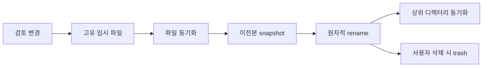

# Markdown Annotator 데이터와 복구

MA는 원문을 수정하지 않고 검토 세션과 설정을 사용자 app-data에만 저장한다. `reviews/sessions`에는 현재 세션, `reviews/snapshots/<session-id>`에는 최근 5개 snapshot, `trash`에는 삭제 대기 데이터가 있다. 전역 설정은 `preferences.json`에 저장한다.

현재 파일이 손상되면 가장 최근의 읽을 수 있는 snapshot을 사용한다. 미래 schema는 덮어쓰지 않고 앱 업데이트를 요구한다. 삭제 항목은 7일 동안 복구 대상으로 유지한 뒤 정리한다. 복구하려면 앱을 종료하고 `trash`의 해당 항목을 원래 위치로 이동한 다음 앱을 다시 연다.

모든 데이터 삭제는 원문 Markdown 파일을 건드리지 않는다.
