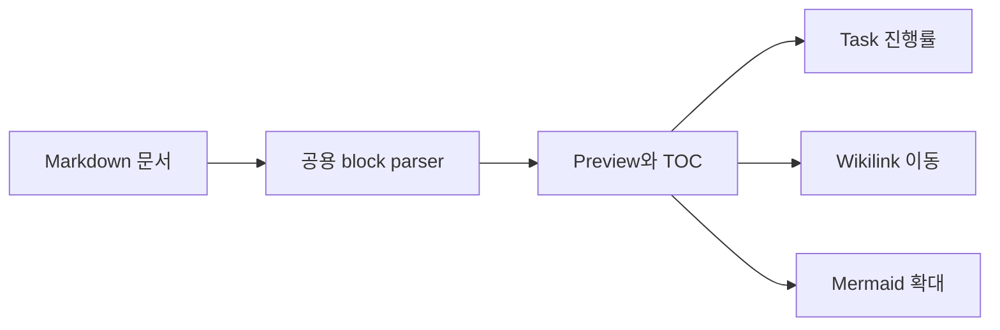
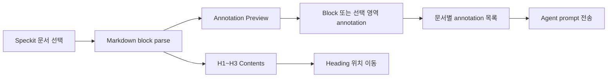

# Markdown Annotator Preview

## 개요

Markdown Annotator(MA)는 SpecKit 산출물을 읽기 중심 화면으로 표시한다. 제목 기반 Table of Contents, task 상태와 H1 chapter별 진행률, Mermaid 확대, 상대 wikilink 문서 이동을 제공한다.

## Wikilink

- `[[plan]]`은 현재 문서와 같은 디렉터리의 `./plan.md`로 연결된다.
- `[[plan | 구현 계획]]`은 화면에 `구현 계획`으로 표시된다.
- 사용자가 링크를 클릭하거나 키보드로 활성화할 때만 이동한다.
- 상위 또는 하위 디렉터리 이동, 절대 경로와 Markdown 이외의 확장자는 차단한다.
- 예제 문서 사이의 링크는 내장 예제 목록에서 대상을 찾는다.

## Task와 Table of Contents

`- [ ]`는 미완료, `- [x]`와 `- [X]`는 완료 상태다. Preview는 상태별 아이콘과 텍스트를 표시하지만 읽기 모드에서 상태를 변경하지 않는다. H1부터 다음 H1 직전까지의 task를 집계하여 제목 아래와 TOC H1 항목에 완료·미완료 수를 표시한다.

## HTML5 주석

한 줄 또는 여러 줄 `<!-- ... -->` 주석은 Preview에서 숨긴다. inline code와 fenced code 내부의 동일한 문자열은 문서 예시나 source code이므로 그대로 보존한다. 닫히지 않은 주석은 이후 본문을 숨기지 않고 일반 텍스트로 유지한다.

## SpecKit 예제

예제 목록에서 feature specification, implementation plan, data model, tasks, requirements checklist를 선택할 수 있다. 예제는 읽기 전용이며 로컬 파일 변경 감시 대상이 아니다.

## 검증

자동 검증과 browser/Tauri 수동 시나리오는 `specs/029-ma-spec-markdown-preview/quickstart.md`를 따른다. 공용 Markdown package를 수정하면 MA와 Agentic Workbench(AW)를 함께 검증한다.

## AW Speckit Preview

AW의 Speckit panel에서도 일반 Markdown workspace와 같은 block·선택 영역 annotation을 사용할 수 있다. Annotation은 Speckit 문서 상대 경로별로 분리되며 문서를 전환해도 기존 작업을 보존한다. 현재 문서의 annotation만 목록과 agent prompt에 포함된다.

Contents에는 H1~H3 제목이 표시되며 task가 있는 H1은 완료·미완료 개수를 함께 보여준다. 문서를 바꾸면 열린 annotation dialog, selection과 highlight는 초기화되지만 경로별 annotation은 유지된다.
