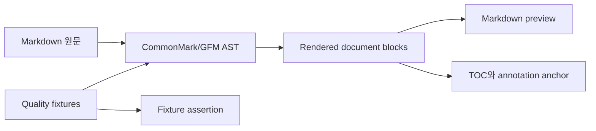
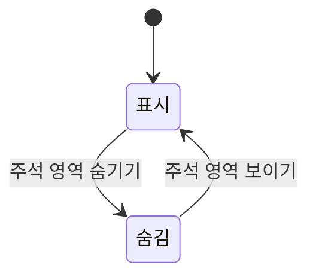

# Markdown 렌더링 품질

## 범위

공유 Markdown core는 CommonMark/GFM AST에서 heading, paragraph, list item, code,
table 등 주석 가능한 의미 블록과 source range·부모 관계를 만든다. renderer와
annotation 소비자는 이 block metadata를 이용해 목록·TOC·선택 위치를 일관되게 다룬다.

## 품질 코퍼스

`packages/markdown-annotation-core/src/quality/fixtures.ts`는 다음 사례를 버전 관리한다.

- 목록 이어쓰기, 빈 줄, 중첩, 시작 번호 등 구조 사례 20개
- block/부분 선택 annotation 결합 사례 10개
- 불완전 문법, 줄바꿈, 활성 콘텐츠 입력을 포함한 복원력·안전 사례 10개

fixture 실행은 실패한 fixture ID와 기대 block type 또는 텍스트를 함께 표시한다.

## AW 주석 영역

AW Markdown 및 SpecKit 미리보기는 주석 보조 영역을 기본 표시한다. 사용자가 이를
숨기면 본문 열이 가로 공간을 사용하고, 다시 보이면 주석 목록·agent prompt·TOC를
표시한다. 이 화면 상태는 AW workspace에만 존재하며 annotation 데이터, 현재 선택,
draft 또는 편집 상태를 변경하지 않는다.

## 검증

`specs/033-markdown-rendering-quality/quickstart.md`의 core, React, MA, AW 타입 검사와
테스트를 실행한다. AW에서는 주석 영역 전환 전후 문서·주석·agent prompt가 유지되는지
확인한다.
