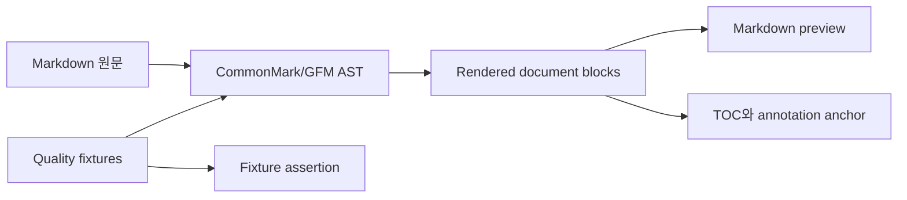
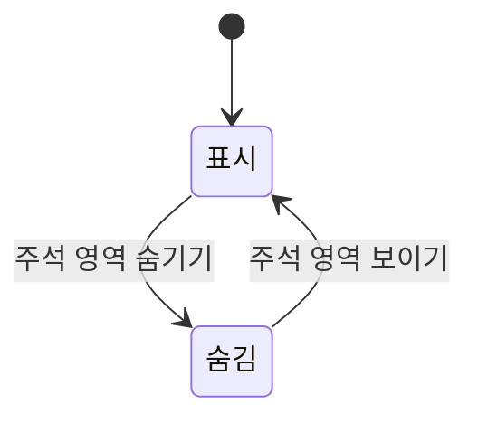
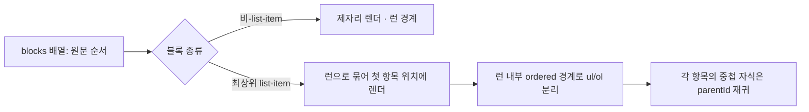

# Markdown 렌더링 품질

## 범위

공유 Markdown core는 CommonMark/GFM AST에서 heading, paragraph, list item, code,
table 등 주석 가능한 의미 블록과 source range·부모 관계를 만든다. renderer와
annotation 소비자는 이 block metadata를 이용해 목록·TOC·선택 위치를 일관되게 다룬다.

## 품질 코퍼스

`packages/markdown-annotation-core/src/quality/fixtures.ts`는 다음 사례를 버전 관리한다.

- 목록 이어쓰기, 빈 줄, 중첩, 시작 번호 등 구조 사례 20개
- block/부분 선택 annotation 결합 사례 10개
- 불완전 문법, 줄바꿈, 활성 콘텐츠 입력을 포함한 복원력·안전 사례 10개

fixture 실행은 실패한 fixture ID와 기대 block type 또는 텍스트를 함께 표시한다.

## AW 주석 영역

AW Markdown 및 SpecKit 미리보기는 주석 보조 영역을 기본 표시한다. 사용자가 이를
숨기면 본문 열이 가로 공간을 사용하고, 다시 보이면 주석 목록·agent prompt·TOC를
표시한다. 이 화면 상태는 AW workspace에만 존재하며 annotation 데이터, 현재 선택,
draft 또는 편집 상태를 변경하지 않는다.

## 목록 렌더링 순서 보존

공유 `MarkdownViewer`는 최상위 목록을 **문서 순서(blocks 배열)를 기준으로 제자리**에
렌더한다. 최상위 목록 항목이 이어지는 최대 구간을 "런(run)"으로 묶어 그 첫 항목 위치에서
렌더하며, 다음 규칙을 따른다.

- **런 경계는 비-`list-item` 블록만이다**(heading·paragraph·code·table·blockquote·hr).
  중간에 이런 블록이 있으면 두 목록은 병합되지 않고 각자 원문 위치에 렌더된다.
- **중첩 `list-item`은 런을 끊지 않는다.** 예: `- A` / `  - A1` / `- B`에서 A와 B는
  하나의 목록으로 유지되고 A1은 A 안에 중첩된다.
- 런 내부에서 순서/비순서(`ordered`)가 바뀌면 별도의 `ul`/`ol`(순서 목록은 `start`)로
  분리한다.
- 각 목록 항목은 안정적인 `key`(블록 id)로 렌더해 재조정을 안정화한다.
- **마커는 커스텀 렌더**한다(비순서 `-`, 순서 `N.`(증가), 작업 항목 체크박스). 주석
  toolbar 정렬을 위한 flex 레이아웃에 마커를 직접 그리므로, `styles.css`에서 네이티브
  목록 마커를 끈다(`list-style: none`). 끄지 않으면 `• -`, `1. 1.`처럼 마커가 중복된다.
  순서 번호는 각 항목의 목록 내 위치(`orderedStart + index`)로 증가시킨다.

이 규칙으로 "제목 → 목록 → 제목 → 목록"이 반복되는 문서(spec/plan/tasks 등)에서 각
목록이 자신의 제목 아래 원문 순서대로 표시된다. MA(markdown-annotator)와 AW는 동일한
`MarkdownViewer`를 사용하므로 규칙이 두 앱에 동일하게 적용된다.

> 범위 밖: 한 목록 항목 안에서 문단으로 분리된 여러 하위 목록은 파서가 부모 항목 본문으로
> 병합한다(항목 content 병합 특성). 이는 최상위 순서 보존과 별개다.

## 검증

`specs/033-markdown-rendering-quality/quickstart.md`의 core, React, MA, AW 타입 검사와
테스트를 실행한다. AW에서는 주석 영역 전환 전후 문서·주석·agent prompt가 유지되는지
확인한다. 목록 순서 보존은 `specs/034-fix-list-render-order/quickstart.md`의 계약 테스트
(CT-1~CT-9)와 MA Storybook `SeparatedListsOrder` 사례로 검증한다.
