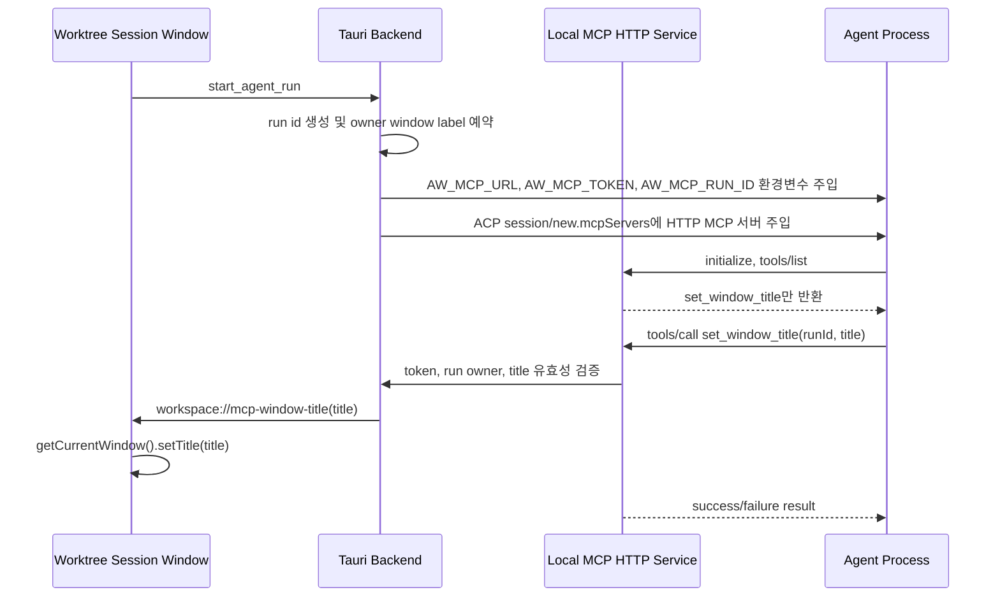

# MCP Session Title Control

## 개요

Agentic Workbench는 Worktree Session에서 agent를 실행할 때 로컬 MCP HTTP 서비스를 함께 제공한다. 이번 구현에서 MCP 서비스가 노출하는 기능은 `set_window_title` 하나뿐이며, agent는 자기 실행 세션이 소유한 Worktree Session 윈도우의 제목만 변경할 수 있다.

파일 표시, Markdown preview 제어, Git 변경사항 표시, 파일 수정, staging, commit, permission approval은 이번 범위에 포함하지 않는다.

## 흐름



## 보안 경계

- MCP 서버는 `127.0.0.1`에만 바인딩한다.
- 모든 title control 요청은 runtime token을 요구한다.
- agent 세션에는 ACP `mcpServers` HTTP 설정으로 `Authorization: Bearer <token>` 헤더가 함께 전달된다.
- 브라우저 `Origin` 헤더가 신뢰되지 않으면 요청을 거부한다.
- agent가 window label을 직접 지정할 수 없고, backend가 `runId`로 owner window를 조회한다.
- run이 종료되었거나 owner window가 닫힌 경우 title 변경 요청은 실패한다.
- token, prompt, 파일 내용은 diagnostic log에 기록하지 않는다.

## 노출 Capability

초기 MCP tool 목록은 다음 하나만 포함한다.

```text
set_window_title
```

`set_window_title`은 `runId`와 `title`을 받는다. 제목은 앞뒤 공백을 제거한 뒤 비어 있지 않고, 제어 문자를 포함하지 않으며, 80자 이하여야 한다. 유효하지 않은 제목은 기존 윈도우 제목을 변경하지 않고 실패 결과를 반환한다.

## Agent 주입 방식

Agent 실행 요청은 두 경로로 MCP 정보를 받는다.

- 호환용 환경변수: `AW_MCP_URL`, `AW_MCP_TOKEN`, `AW_MCP_RUN_ID`
- ACP 세션 설정: `session/new` 요청의 `mcpServers`에 `type: "http"`, `name: "agentic_workbench"`, `url`, `Authorization` 헤더를 포함

Codex ACP adapter처럼 ACP `mcpServers`를 지원하는 agent는 별도 전역 설정 파일 수정 없이 실행 세션에서 MCP 서버를 자동 인식한다. 환경변수는 tool argument의 `runId`를 구성하거나 fallback client에서 사용할 수 있도록 유지한다.

## Frontend 동작

Worktree Session route는 기존 기본 제목(`Project / worktree`)을 유지한다. MCP title event가 도착하면 runtime override 제목을 적용하고, project 또는 worktree 경로가 바뀌면 override를 초기화한다. 이 상태는 저장하지 않는다.

## 검증

필수 검증은 다음과 같다.

- Rust unit test: title validation, MCP tool boundary, token/origin validation, run owner lookup
- TypeScript unit test: default title, runtime override, invalid override
- 수동 검증: active run에서 valid title 변경, invalid title 거부, cross-session 거부, closed-session 거부
