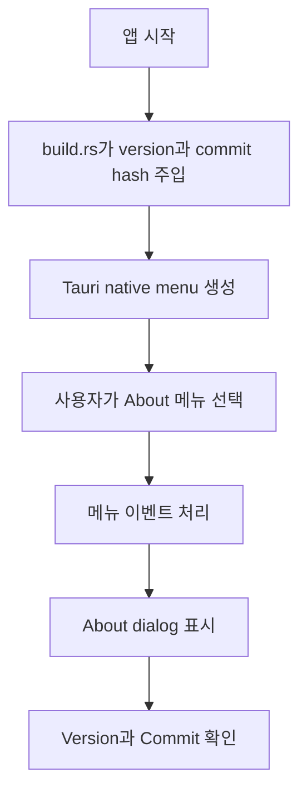

# Native About 메뉴 검증 절차

## 대상

- 앱: `agentic-workbench`
- 기능: native menu의 About 항목과 앱 정보 dialog

## 표시 정보

- Version은 `apps/agentic-workbench/package.json`의 `version` 값을 빌드 시점에 주입한다.
- Commit은 빌드 시점의 `GITHUB_SHA`, `COMMIT_SHA`, 또는 `git rev-parse HEAD` 결과를 사용한다.
- commit hash를 확인할 수 없으면 `unknown`을 표시한다.

## 동작 흐름

## 수동 검증

1. `pnpm --filter @yoophi/agentic-workbench tauri:dev`로 앱을 실행한다.
2. macOS에서는 앱 메뉴의 `About Agentic Workbench`를 선택한다.
3. Windows/Linux에서는 `Help > About Agentic Workbench`를 선택한다.
4. dialog에 `Version: 0.1.0`처럼 `package.json` 버전이 표시되는지 확인한다.
5. dialog에 `Commit: <hash>`가 표시되는지 확인한다.
6. Git 정보를 사용할 수 없는 빌드 환경에서는 `Commit: unknown`이 표시되고 dialog가 정상적으로 열리는지 확인한다.

## 자동 검증

- Rust 컴파일 검증: `cargo check -p agentic-workbench`
- 프론트엔드 타입 검증: `pnpm --filter @yoophi/agentic-workbench check-types`

## 2026-07-02 검증 기록

- `cargo fmt --package agentic-workbench`: 통과
- `cargo check -p agentic-workbench`: 통과
  - 기존 코드의 dead code 경고 2건은 유지됨
- `pnpm --filter @yoophi/agentic-workbench check-types`: 통과
  - 최초 실행 시 `node_modules`가 없어 `tsc`를 찾지 못했으나, `pnpm install --frozen-lockfile` 후 통과함
- `pnpm --filter @yoophi/agentic-workbench tauri:dev`: Vite dev server 시작, Rust dev build 완료, `target/debug/agentic-workbench` 실행 단계 도달
- native menu 클릭 확인은 데스크톱 세션에서 위 수동 검증 절차에 따라 확인한다.
