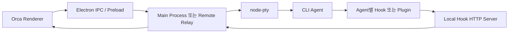
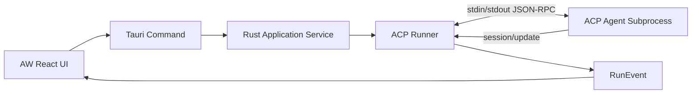
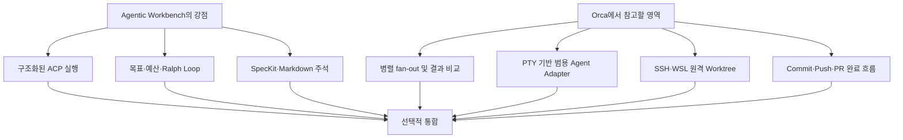

# Orca와 Agentic Workbench 비교 분석

## 분석 범위

- 분석일: 2026-07-13
- Orca 저장소: [stablyai/orca](https://github.com/stablyai/orca)
- Orca 분석 커밋: `8abe093e86e58eb2f5a1d506ae0dd091b25cb280`
- 체크아웃 방식: 임시 디렉터리에 shallow clone
- Agentic Workbench 분석 대상: 현재 저장소의 `apps/agentic-workbench` 소스와 OpenWiki 문서

두 프로젝트 모두 AI 코딩 에이전트를 Git worktree 단위로 격리해 운영하지만 제품의 중심은 다르다. Orca는 터미널, 편집기, 브라우저, Git, 원격 실행 및 외부 서비스까지 포괄하는 에이전트 중심 IDE이고, Agentic Workbench(이하 AW)는 ACP 기반의 구조화된 에이전트 세션과 목표 중심 실행에 집중한 워크벤치다.

| 구분 | Orca | Agentic Workbench |
|---|---|---|
| 제품 성격 | 에이전트 중심 병렬 개발 IDE | ACP 에이전트 세션 및 worktree 워크벤치 |
| 에이전트 연결 | 범용 PTY/TUI와 에이전트별 hook | ACP JSON-RPC |
| 주요 강점 | 넓은 에이전트 지원, IDE·원격·외부 서비스 통합 | 구조화된 이벤트, 권한 제어, 목표·예산·Ralph Loop |
| Git 범위 | 생성부터 stage, commit, push, PR까지 | worktree 생성·삭제, diff와 히스토리 중심 |
| 데스크톱 기반 | Electron/Node.js | Tauri/Rust |

## 제품 목표

### Orca

Orca는 여러 CLI 코딩 에이전트를 병렬로 실행하고 결과를 한곳에서 추적하는 완성형 개발 환경을 지향한다.

- 각 작업을 별도 Git worktree로 격리한다.
- 동일한 프롬프트를 여러 에이전트에 분배하고 결과를 비교한다.
- 터미널, 코드 편집, 브라우저, Git, PR 및 이슈 관리를 한 앱에서 처리한다.
- 로컬, SSH, WSL, ephemeral VM에서 유사한 실행 경험을 제공한다.
- 모바일에서 에이전트 상태를 확인하고 후속 지시를 보낼 수 있게 한다.

즉, 에이전트 채팅 클라이언트보다 코드 편집기, 터미널 멀티플렉서, Git 클라이언트와 에이전트 오케스트레이터를 결합한 IDE에 가깝다.

### Agentic Workbench

AW는 다음과 같은 ACP 기반 개발 흐름에 집중한다.

- 로컬 프로젝트와 Git worktree를 관리한다.
- worktree마다 ACP 에이전트 세션을 실행한다.
- 메시지, 사고, 계획, 도구 호출 및 토큰 사용량을 구조적으로 표시한다.
- 권한 요청과 실행 중 steering을 처리한다.
- 목표와 토큰 예산을 추적하고 Ralph Loop로 반복 실행한다.
- Markdown 및 SpecKit 문서를 검토하고 주석을 에이전트 프롬프트로 돌려보낸다.

## 핵심 기능 비교

### 공통 기능

- 로컬 프로젝트 등록
- Git worktree 생성 및 삭제
- worktree별 격리된 에이전트 실행
- 여러 실행 또는 탭 관리
- 변경사항 diff 확인
- Markdown 미리보기
- 실행 중 추가 지시
- Codex, Claude Code, OpenCode, Pi 지원

### Orca의 핵심 기능

- 동일 프롬프트를 여러 worktree와 에이전트로 fan-out
- WebGL 기반 터미널, split pane 및 영속적인 scrollback
- Monaco 기반 코드 편집과 autosave
- 내장 Chromium 브라우저와 Design Mode
- GitHub, GitLab, Bitbucket, Gitea, Azure DevOps 연동
- Linear와 Jira 이슈 및 프로젝트 연동
- SSH, WSL, 원격 relay 및 포트 포워딩
- 모바일 companion과 상태 알림
- 에이전트 계정 전환, 사용량 및 rate-limit 추적
- 앱 UI를 자동화하는 Orca CLI와 Computer Use

### AW의 핵심 기능

- ACP 이벤트의 구조화된 렌더링
- 세밀한 권한 모드와 권한 요청 다이얼로그
- 실행 중 steer 및 cancel-and-send
- ACP 세션 resume
- ThreadGoal 상태와 토큰 예산 추적
- Ralph Loop
- 실행 미니맵과 저장 프롬프트
- 프롬프트 `/` 명령 자동완성
- SpecKit 파일 전용 탐색
- Markdown/Mermaid 및 문서 주석을 에이전트 프롬프트로 변환
- run-scoped MCP 서버와 세션 창 제목 제어

## 에이전트 연결 구조

### Orca: PTY와 hook 기반

Orca는 에이전트를 일반 터미널 프로그램으로 실행한다. 따라서 터미널에서 실행되는 CLI 에이전트라면 전용 프로토콜 없이도 기본적인 실행이 가능하다.

연결은 두 계층으로 구성된다.

1. PTY/TUI 계층
   - stdin으로 프롬프트와 키 입력을 전달한다.
   - stdout과 ANSI 출력을 xterm에 렌더링한다.
   - 터미널 세션, pane 및 scrollback을 관리한다.
2. 에이전트별 hook 계층
   - 에이전트 설정에 Orca 관리 hook 또는 plugin을 설치한다.
   - hook이 localhost HTTP 서버로 상태 이벤트를 보낸다.
   - working, waiting, done, tool activity와 assistant message를 pane에 연결한다.
   - SSH/WSL에서는 relay가 hook 이벤트를 JSON-RPC notification으로 호스트에 전달한다.

hook 대상으로 Claude, OpenClaude, Codex, Gemini, Antigravity, Amp, Cursor, Droid, Command Code, Grok, Copilot, Hermes, Devin, Kimi 등이 등록되어 있다. OpenCode, Pi, MiMo 등에도 별도 hook 또는 plugin 서비스가 존재한다.

이 방식은 지원 범위와 TUI 호환성이 뛰어나지만, 에이전트마다 hook 구현이나 출력 해석이 필요하며 모든 이벤트와 권한 요청을 하나의 공통 타입으로 보장하기 어렵다.

### AW: ACP 기반

AW는 ACP의 `initialize`, `session/new`, `session/load`, `session/prompt`, `session/update`, `session/request_permission` 등을 이용한다. 메시지, thought, plan, tool call, permission 및 usage가 정형화된 `RunEvent`로 변환된다.

이 구조는 권한 승인, 계획 UI, 세션 resume와 실행 상태 추적에 일관성을 제공한다. 반면 ACP 어댑터가 없는 임의의 CLI 에이전트는 Orca처럼 즉시 연결하기 어렵다. 현재 내장 카탈로그는 Codex, Claude Code, OpenCode와 Pi를 제공한다.

## Git 관리 비교

두 앱 모두 Git CLI를 인프라 어댑터로 사용한다.

### Orca

Orca의 Git 기능은 IDE 수준으로 구성되어 있다.

- 저장소 clone 및 감지
- base ref와 default remote 탐색
- 일반 및 sparse worktree 생성
- worktree 이동과 안전 삭제
- 브랜치 생성, checkout, rename 및 삭제
- status, submodule, upstream 및 remote drift 확인
- stage, unstage와 discard
- commit, fetch, pull, rebase, fast-forward와 push
- merge/rebase 충돌 감지와 abort
- branch 및 commit 비교와 diff
- fork 기본 브랜치 동기화
- GitHub CLI와 GitLab CLI 연계
- WSL/SSH relay를 통한 원격 Git 작업

에이전트 결과를 비교하고 선택한 결과를 commit, push 및 PR로 연결하는 과정이 제품 흐름에 포함된다.

### Agentic Workbench

AW의 Git 기능은 worktree와 변경 검토에 집중한다.

- remote와 branch 조회
- worktree 목록, 생성 및 삭제
- 변경 파일 감지와 자동 갱신
- diff 리뷰
- 커밋 히스토리와 그래프
- 파일 트리 및 파일 읽기

현재 AW 자체에는 Orca 수준의 stage, unstage, commit, discard, pull, push, merge/rebase 충돌 처리 및 PR 생성 UI가 없다. 에이전트가 터미널 명령으로 Git을 실행하는 것과 AW가 네이티브 Git 기능을 제공하는 것은 구분해야 한다.

## 기술 스택

| 영역 | Orca | Agentic Workbench |
|---|---|---|
| 데스크톱 셸 | Electron 43 | Tauri 2 |
| 백엔드 | Node.js 24, TypeScript | Rust, Tokio |
| 프론트엔드 | React 19.2, TypeScript | React 19, TypeScript |
| 빌드 | electron-vite, Vite 7, electron-builder | Vite, Cargo, Tauri |
| 상태 관리 | Zustand | TanStack Query와 React state |
| 터미널 | node-pty, xterm 6 beta, WebGL | ACP 이벤트 UI 중심 |
| 편집기 | Monaco Editor | 파일 읽기와 Markdown 미리보기 중심 |
| UI | Tailwind CSS 4, Radix/shadcn 계열 | Tailwind CSS 4, shadcn/ui |
| 에이전트 통신 | PTY/TUI, hook, 일부 native chat | ACP JSON-RPC |
| 원격 통신 | SSH2, WebSocket, 자체 JSON-RPC relay | 로컬 ACP subprocess 중심 |
| 검증 | Vitest, Playwright E2E, 성능 benchmark | TypeScript 및 Rust 테스트 |
| 패키지 관리 | pnpm 10 | pnpm/Turbo와 Cargo workspace |

Orca는 `main`, `preload`, `renderer`, `relay`, `cli`, `shared`로 나뉜 대형 TypeScript 제품이다. AW는 Feature-Sliced Design 기반 React 프론트엔드와 헥사고날 아키텍처 기반 Rust 백엔드를 분리한다.

## AW에 없는 Orca 기능

### 범용 CLI 에이전트 실행

ACP 어댑터 없이도 터미널에서 동작하는 에이전트를 실행할 수 있어 지원 가능한 에이전트 종류가 훨씬 많다.

### 프롬프트 fan-out과 결과 선택

한 요청으로 여러 worktree와 에이전트를 만들고 병렬 실행한 뒤 결과를 비교하고 승자를 병합하는 흐름을 제공한다. AW는 여러 run과 tab을 지원하지만 이 전체 과정을 하나의 orchestration 작업으로 제공하지 않는다.

### 완전한 터미널 멀티플렉서

split pane, WebGL 렌더링, TUI, scrollback 영속화, 재연결, shell theme 및 terminal history를 제공한다.

### 실제 코드 편집기

Monaco 편집기, autosave, 검색 및 파일 drag-to-prompt를 제공한다. AW는 파일 탐색, Markdown과 변경 검토에 더 가깝다.

### 내장 브라우저와 Design Mode

Chromium 페이지의 요소를 클릭해 DOM, CSS와 스크린샷을 에이전트에게 전달할 수 있다.

### 원격 개발

SSH worktree, WSL, 원격 relay, 자동 재연결, 포트 포워딩, headless server 및 ephemeral VM을 지원한다.

### 모바일 companion

모바일에서 실행 완료 또는 대기 알림을 받고 상태 확인과 후속 지시 전송이 가능하다.

### 네이티브 Git 쓰기 작업

stage, unstage, discard, commit, fetch, pull, rebase, push와 충돌 처리를 앱에서 수행한다.

### Git 호스팅 및 업무 도구 통합

GitHub/GitLab 등의 PR과 issue, Linear/Jira 작업을 탐색하고 worktree에 연결한다.

### 계정 및 사용량 관리

Codex, Claude와 OpenCode 계정 전환, 사용량 및 rate-limit reset 추적 기능을 제공한다.

### Orca CLI와 Computer Use

에이전트가 snapshot, click, fill 등의 명령으로 Orca UI를 조작할 수 있으며 데스크톱 앱 제어 기능도 포함한다.

### 제품 운영 기능

자동 업데이트, crash report, renderer recovery, unread badge, 시스템 알림, 다국어 UI와 telemetry가 폭넓게 구현되어 있다.

## 도입 관점의 결론

AW가 Orca에서 우선 참고할 가치가 높은 영역은 다음과 같다.

1. 프롬프트 fan-out에서 병렬 worktree 생성과 결과 비교·선택으로 이어지는 흐름
2. ACP를 보완하는 PTY 기반 범용 agent adapter
3. SSH/WSL 원격 worktree와 relay
4. stage, commit, push 및 PR까지 이어지는 네이티브 Git 흐름

다만 Orca 전체를 IDE 수준으로 따라가기보다 AW의 ACP 기반 구조적 실행, 권한 제어와 목표 관리라는 강점을 유지하면서 병렬 orchestration과 Git 완료 흐름을 선택적으로 도입하는 편이 제품 정체성에 적합하다.
