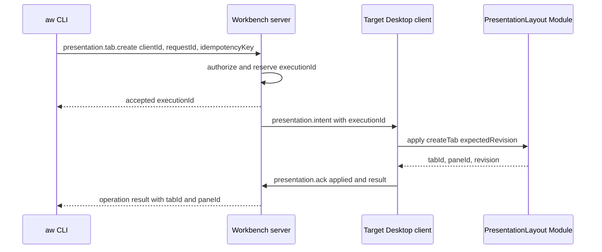

# AW pane·tab 식별자 설계

> 작성일: 2026-08-29
>
> 범위: 독립 AW 서버와 Desktop client 구조에서 presentation tab·pane에 고유 ID를 발급하고, Desktop UI와 `aw` CLI가 생성·조회·후속 mutation에 안전하게 사용하는 방식
>
> 상위 결정: 서버는 ACP Run·TerminalSession·오케스트레이션과 native process를 소유하고, tab·pane layout과 focus는 Desktop presentation 상태로 둔다. ([서버-클라이언트 전환 조사](client-server-architecture-research.md#기능-배치-제안))

## 결론

`tabId`와 `paneId`에는 순번이 아니라 **type prefix를 붙인 UUID v4 opaque ID**를 사용한다.

```text
tab_6bb69e7f-c82c-4c54-a7bc-f10b5b6db742
pan_f3bf6a43-909c-4f30-bfed-bf39884cb48a
```

다만 UUID가 전역 충돌 가능성을 충분히 낮춘다는 사실과 resource의 소유 범위는 별개다. tab과 pane은 Desktop presentation resource이므로 durable reference에는 `presentationId`를 함께 보존하고, CLI로 UI를 변경할 때는 현재 연결된 `clientInstanceId`를 명시한다.

핵심 규칙은 다음과 같다.

1. ID는 Desktop의 `PresentationLayout` Module이 실제 layout commit 시 발급한다.
2. CLI가 presentation mutation을 요청하면 서버는 intent를 전달하고, Desktop ACK가 돌아온 뒤에만 생성된 `tabId`·`paneId`를 성공 결과로 반환한다.
3. ID는 이름, 순서, workspace path, agent 종류, run ID, orchestration node ID를 포함하지 않는다.
4. rename·focus·같은 presentation 안의 move·content 교체에는 ID가 유지된다.
5. 닫힌 ID는 다시 사용하지 않는다. 다른 presentation이나 workspace로 복제할 때는 새 ID를 발급한다.
6. `requestId`, `idempotencyKey`, `executionId`, layout `revision`, tab/pane ID는 서로 다른 목적과 수명을 갖는다.
7. ID 소유만으로 권한이 생기지 않는다. server와 Desktop은 principal, presentation, workspace, revision을 별도로 검증한다.

## 상위 아키텍처와 소유권

서버-클라이언트 전환 문서는 `window_label`을 domain identity로 사용하지 않고 `workspace_id`, `run_id`, `client_instance_id`로 분리하며, panel layout은 Desktop presentation 상태로 남기도록 결정한다. ([현재 전환 대상](client-server-architecture-research.md#현재-tauri-결합과-전환-대상), [Workbench invariant](client-server-architecture-research.md#invariants))

이에 따라 ID issuer와 resource owner를 다음처럼 구분한다.

| resource | 소유자 | ID issuer | 수명 |
|---|---|---|---|
| Workspace | AW 서버 | 서버 | worktree workspace가 삭제될 때까지 |
| AgentNode·Run | AW 서버 | 서버 | orchestration/run lifecycle |
| TerminalSession | AW 서버 | 서버 | terminal process/session lifecycle |
| Presentation document | Desktop client | 최초 생성한 Desktop | local layout 저장소 수명 |
| Tab | Desktop client | `PresentationLayout` Module | tab close까지 |
| Pane | Desktop client | `PresentationLayout` Module | pane close까지 |
| Client instance | 연결한 Desktop process | Desktop bootstrap | process/connection 수명 |

Desktop가 종료되어도 서버의 Run이나 TerminalSession은 계속될 수 있다. 반대로 pane이 존재해도 아직 live ACP Run이 없을 수 있다. 따라서 `paneId`를 `runId`로 사용하거나 둘의 수명을 묶지 않는다.

### durable presentation과 ephemeral connection

재시작 뒤 같은 local layout을 복원하려면 presentation 저장소의 identity와 현재 network connection identity를 분리해야 한다.

```ts
type PresentationId = Brand<string, "PresentationId">;
type ClientInstanceId = Brand<string, "ClientInstanceId">;
type TabId = Brand<string, "TabId">;
type PaneId = Brand<string, "PaneId">;
```

| ID | 의미 | 재시작 시 |
|---|---|---|
| `prs_<uuid>` | 한 Desktop presentation document의 stable owner | 저장소 복원 시 유지 |
| `cli_<uuid>` | 현재 Desktop process/connection | 매 process 시작 시 새로 발급 |
| `tab_<uuid>` | presentation 안 tab | layout 복원 시 유지 |
| `pan_<uuid>` | presentation 안 pane | layout 복원 시 유지 |

한 Desktop window가 하나의 presentation document를 연다고 가정한다. 같은 document에 동시에 writer가 둘 이상 붙는 경우 Desktop bootstrap이 하나의 presentation writer lease를 정하고, 나머지는 observer 또는 별도 `presentationId`를 사용한다. `clientInstanceId`를 tab/pane의 durable parent로 저장하면 Desktop 재시작마다 모든 ID가 무효화되므로 그렇게 하지 않는다.

backup을 정상 restore한 같은 presentation은 ID를 유지할 수 있지만, snapshot을 다른 profile/device의 새 layout으로 import하거나 duplicate할 때는 `presentationId`, tab, pane, split ID를 모두 다시 발급한다. 동시에 서로 다른 설치가 같은 `presentationId`로 writer 등록을 시도하면 server discovery가 자동 merge하지 않고 한쪽을 read-only로 두거나 명시적 `presentation.fork`를 요구한다.

## ID 형식

### 공개 형식

| 종류 | 형식 | 예시 |
|---|---|---|
| Presentation | `prs_<lowercase UUID>` | `prs_063f46e4-b22f-401d-aeb2-6fed58485484` |
| Client instance | `cli_<lowercase UUID>` | `cli_04917688-27b8-4b76-8726-8b143c0e6346` |
| Tab | `tab_<lowercase UUID>` | `tab_6bb69e7f-c82c-4c54-a7bc-f10b5b6db742` |
| Pane | `pan_<lowercase UUID>` | `pan_f3bf6a43-909c-4f30-bfed-bf39884cb48a` |
| Split node | `spl_<lowercase UUID>` | `spl_8e16df2a-f30d-404b-b476-238333104feb` |

v1 issuer는 UUID v4를 사용한다. 현재 Rust workspace와 browser code가 이미 `Uuid::new_v4()`와 `crypto.randomUUID()`를 사용하므로 새 ID package를 추가하지 않고 production과 test fixture의 간극을 줄일 수 있다. ([ACP Run ID 생성](../crates/acp-agent-core/src/domain/run.rs), [AW UUID dependency](../apps/agentic-workbench/src-tauri/Cargo.toml))

wire schema는 prefix 뒤를 UUID로 parse하고 다음을 강제한다.

- ASCII lowercase canonical UUID string
- type과 prefix 일치
- leading/trailing whitespace 금지
- 최대 길이 고정
- 빈 문자열과 nil UUID 금지
- caller가 creation payload로 ID를 직접 지정하는 기능 금지

caller는 prefix 외 suffix의 UUID version, timestamp, lexical order를 해석하지 않는다. 향후 issuer가 UUID v7로 바뀌어도 이를 정렬·시간 추정에 사용한 caller를 지원하지 않는다. 생성 순서와 UI 순서는 `createdAt`, `tabOrder`, layout tree가 제공한다.

issuer는 새 ID가 open resource와 retained tombstone 어디에도 없는지 확인한다. 충돌하면 새 UUID로 bounded retry하고, 계속 충돌하면 layout을 commit하지 않은 채 `identifierGenerationFailed`로 끝낸다. 충돌 검사는 UUID 확률을 보완하는 불변식이며 deterministic fake Adapter로 반드시 테스트한다.

### 순차 번호를 사용하지 않는 이유

`tab-1`, `pane-2`, `extra-agent-run-3` 같은 counter ID는 사용하지 않는다.

- 여러 Desktop client와 offline local commit에서 중앙 counter가 필요하다.
- restore·clone·import·삭제 뒤 counter rollback이 ID 재사용과 ABA 문제를 만든다.
- UI 순서 변경이 identity 변경처럼 보인다.
- 숫자 하나만으로 presentation owner와 workspace scope를 검증할 수 없다.
- title이나 ordinal을 ID로 사용하면 rename과 reorder가 reference를 깨뜨린다.

사람에게 보이는 “Tab 2”, “Pane 3”은 `ordinal` 또는 title projection이고 public identity가 아니다.

## 데이터 모델

```ts
type PresentationDocument = {
  id: PresentationId;
  workspaceId: WorkspaceId;
  revision: number;
  tabOrder: TabId[];
  activeTabId: TabId | null;
  focusedPaneId: PaneId | null;
  epoch: string;
};

type PresentationTab = {
  id: TabId;
  presentationId: PresentationId;
  workspaceId: WorkspaceId;
  title: string;
  root: PresentationLayoutNode;
  createdAt: string;
  closedAt: string | null;
};

type PresentationPane = {
  id: PaneId;
  presentationId: PresentationId;
  workspaceId: WorkspaceId;
  tabId: TabId;
  title: string;
  content:
    | { kind: "agent"; nodeId: string | null; runId: RunId | null }
    | { kind: "terminal"; terminalSessionId: TerminalSessionId }
    | { kind: "empty" };
  createdAt: string;
  closedAt: string | null;
};

type PresentationLayoutNode =
  | { type: "pane"; paneId: PaneId }
  | {
      type: "split";
      splitId: SplitId;
      direction: "horizontal" | "vertical";
      first: PresentationLayoutNode;
      second: PresentationLayoutNode;
    };
```

`presentationId`, `workspaceId`, `tabId`가 중복으로 보이더라도 authorization과 corrupt snapshot 검증에 필요하다. load 시 다음 불변식을 검사한다.

- document의 모든 tab/pane은 같은 `presentationId`와 `workspaceId`를 가진다.
- `tabOrder`의 ID는 중복되지 않고 존재하는 open tab과 정확히 일치한다.
- tab tree의 모든 pane leaf는 정확히 한 번 등장하고 해당 `tabId`를 가리킨다.
- open pane은 한 tab에만 속한다.
- main AgentNode나 Run ID를 tab/pane ID로 재사용하지 않는다.
- 동일 Run 또는 TerminalSession을 여러 pane이 projection하는 것은 허용한다.

마지막 규칙 때문에 `runId → paneId`는 1:1 mapping이 아니라 `runId → PaneRef[]` projection이다.

### wire reference

UUID가 사실상 전역 unique여도 durable command와 저장소에서는 소유 scope를 객체로 표현한다.

```ts
type TabRef = {
  presentationId: PresentationId;
  tabId: TabId;
};

type PaneRef = {
  presentationId: PresentationId;
  paneId: PaneId;
};
```

CLI의 `--client <client-instance-id>`는 현재 intent를 전달할 connection을 고르는 routing hint다. ACK 결과에는 해당 client가 실제로 연 `presentationId`를 함께 반환한다. authorization과 저장된 reference는 `presentationId`를 사용하고 ephemeral `clientInstanceId`에 종속되지 않는다.

## 발급과 mutation Interface

ID generator를 caller마다 노출하지 않고 `PresentationLayout` Module 안에 숨긴다.

```ts
interface PresentationLayout {
  snapshot(): PresentationSnapshot;
  apply(command: PresentationCommand): PresentationResult;
}
```

`apply` implementation은 다음을 한 local commit으로 처리한다.

- expected revision 검사
- tab·pane·split ID 발급
- layout 불변식 검증
- presentation snapshot 변경
- idempotency 결과와 새 revision 저장
- ACK payload 생성

production Desktop Adapter는 `crypto.randomUUID()`를 사용하고 contract test는 collision과 retry를 재현하는 deterministic ID Adapter를 주입한다. ID generator는 `PresentationLayout`의 internal seam이며 외부 Interface에 `nextPaneId()` 같은 shallow method를 추가하지 않는다.

### tab 생성

tab은 root pane 없이 존재할 수 없으므로 두 ID를 원자적으로 발급한다.

```json
{
  "presentationId": "prs_063f46e4-b22f-401d-aeb2-6fed58485484",
  "tab": {
    "id": "tab_6bb69e7f-c82c-4c54-a7bc-f10b5b6db742",
    "title": "Research"
  },
  "rootPane": {
    "id": "pan_f3bf6a43-909c-4f30-bfed-bf39884cb48a",
    "content": { "kind": "agent", "nodeId": null, "runId": null }
  },
  "revision": 18
}
```

tab ID와 root pane ID 중 하나만 저장되는 partial result를 허용하지 않는다. 현재 AW는 모든 panel이 ACP-capable이므로 일반 `tab create`의 root pane은 agent launcher projection을 기본으로 한다. terminal 전용 convenience command는 root pane을 `{ kind: "terminal" }`로 같은 transaction에서 생성하고, future generic layout에서만 명시적 empty pane을 사용한다.

### pane split

기존 pane을 split할 때 기존 pane ID는 유지하고 새 sibling pane과 split node에만 새 ID를 발급한다.

```json
{
  "presentationId": "prs_063f46e4-b22f-401d-aeb2-6fed58485484",
  "sourcePaneId": "pan_f3bf6a43-909c-4f30-bfed-bf39884cb48a",
  "createdPane": {
    "id": "pan_56d339df-6876-4135-934f-6850b5d5ff23",
    "content": { "kind": "empty" }
  },
  "splitId": "spl_8e16df2a-f30d-404b-b476-238333104feb",
  "revision": 19
}
```

split ratio와 pixel size는 client geometry이며 ID나 shared resource identity에 넣지 않는다.

## CLI와 Desktop ACK 계약

서버는 tab/pane layout owner가 아니므로 CLI 요청을 받았다는 사실만으로 `tabId`나 `paneId` 생성 성공을 반환하면 안 된다.



CLI convenience 명령은 다음처럼 투영한다.

```sh
aw tab create \
  --client cli_04917688-27b8-4b76-8726-8b143c0e6346 \
  --workspace wsp_... \
  --title Research \
  --idempotency-key idem_... \
  --wait \
  --output json

aw pane split \
  --client cli_04917688-27b8-4b76-8726-8b143c0e6346 \
  --pane pan_f3bf6a43-909c-4f30-bfed-bf39884cb48a \
  --direction right \
  --expected-revision 18 \
  --idempotency-key idem_... \
  --wait \
  --output json
```

규칙은 다음과 같다.

- target Desktop이 없으면 ID를 미리 만들지 않고 `noPresentationTarget`으로 실패한다.
- `--wait`가 없으면 `executionId`만 반환하며 생성 ID는 `aw operation result <execution-id>`로 조회한다.
- `--wait`는 Desktop ACK 또는 명시적 reject/timeout만 기다린다.
- local timeout이나 SIGINT는 presentation intent를 자동 취소하지 않는다.
- Desktop가 layout을 commit한 뒤 ACK 전에 연결이 끊겨도 같은 idempotency key 재전달에 같은 tab/pane ID를 반환해야 한다.
- 서버는 ACK 전 execution을 `pending`, 전달 결과를 모르면 `unknown`, ACK 뒤에만 `applied`로 기록한다.

### idempotency ledger

Desktop의 layout snapshot, 새 revision, idempotency result는 같은 local durability boundary에 저장한다.

```ts
type PresentationOperationResult = {
  executionId: string;
  idempotencyKeyHash: string;
  normalizedCommandHash: string;
  outcome: "applied" | "rejected";
  resourceIds: Array<TabId | PaneId | SplitId>;
  revision: number;
};
```

같은 key와 같은 normalized command는 기존 결과를 반환한다. 같은 key와 다른 command는 `idempotencyConflict`다. 이 ledger가 없이 retry 때 새 UUID를 발급하면 사용자는 같은 tab/pane을 두 개 얻게 된다.

`requestId`는 매 전송 시도, `idempotencyKey`는 logical mutation, `executionId`는 server operation, `tabId/paneId`는 생성된 resource, `revision`은 presentation aggregate concurrency를 식별한다. 서로 alias로 만들지 않는다.

## ID 수명 규칙

| operation | 기존 ID 처리 |
|---|---|
| rename | 유지 |
| focus·visibility 변경 | 유지 |
| 같은 tab 안 reorder | 유지 |
| 같은 presentation/workspace 안 다른 tab으로 pane move | pane ID 유지 |
| pane content attach/detach | pane ID 유지, content reference만 변경 |
| 같은 Run을 다른 pane에도 표시 | 새 pane ID 발급, Run ID 공유 |
| pane close 후 reopen | 새 pane ID 발급 |
| tab close 후 같은 title로 생성 | 새 tab과 root pane ID 발급 |
| 다른 presentation/client로 copy | 새 tab/pane ID 발급 |
| 다른 workspace로 move | v1 거부; copy가 필요하면 새 ID 발급 |
| snapshot restore | 동일 presentation의 정상 snapshot이면 ID 유지 |
| export/import 또는 duplicate | 새 presentation/tab/pane ID 발급 |

closed ID는 영구 재사용하지 않는다. tombstone은 최소한 해당 idempotency result TTL과 지원하는 presentation event replay cursor보다 오래 유지한다. tombstone GC 뒤에는 `gone` 대신 `notFound`가 될 수 있지만 같은 ID가 새 resource를 가리키는 일은 없다.

## 현재 AW에서의 migration

현재 frontend는 `main-agent-run`과 `extra-agent-run-<sequence>`를 panel ID로 사용한다. extra panel을 만들 때 counter 기반 ID를 생성하고, orchestration도 panel ID와 node ID를 연결해 사용한다. ([현재 panel model](../apps/agentic-workbench/src/entities/agent-run/model/agent-run-workspace.ts), [manual child ID 생성](../apps/agentic-workbench/src-tauri/src/application/orchestration_service.rs))

목표 migration은 다음과 같다.

1. `main-agent-run`은 Main `AgentNodeId` 호환 identity로만 남기고 pane ID 역할을 제거한다.
2. 모든 현재 panel slot에 별도 `pan_<uuid>`를 발급하고 `content.nodeId`로 기존 node를 참조한다.
3. `extra-agent-run-N`도 orchestration node 또는 legacy mapping에만 남기고 새 wire `paneId`로 노출하지 않는다.
4. 현재 `AgentRunViewMode.tabs`는 실제 tab entity가 아니므로 `single` presentation mode로 rename한다.
5. 실제 tab 모델을 도입할 때 기존 전체 tile tree를 하나의 `tab_<uuid>` 아래로 migration한다. 현재 tab button 하나마다 가짜 Tab ID를 만들지 않는다.
6. client-local snapshot에 `presentationId`, `revision`, ID migration version을 기록한다.
7. Tauri compatibility Adapter만 `legacyPanelId ↔ paneId` mapping을 알고, Workbench Interface와 CLI는 새 typed ID만 사용한다.
8. 같은 pane에 연결된 run이 종료되거나 successor로 바뀌어도 pane ID는 유지하고 content reference만 갱신한다.

old panel ordinal을 UUID에 포함하거나 deterministic hash로 변환하지 않는다. migration을 다시 실행해도 같은 결과가 필요하면 migration transaction이 발급한 mapping을 snapshot에 먼저 기록하고 재사용한다.

## agent context와 target 규칙

Run은 pane 없이 headless로 존재하거나 여러 Desktop pane에 동시에 표시될 수 있다. 따라서 agent process에 단일 `AW_TAB_ID`·`AW_PANE_ID`를 authoritative context로 주입하지 않는다.

기본 context는 다음과 같다.

```sh
AW_WORKSPACE_ID=wsp_...
AW_RUN_ID=run_...
AW_NODE_ID=node_...
```

특정 Desktop presentation에서 시작한 경우에만 다음 optional hint를 추가할 수 있다.

```sh
AW_PRESENTATION_ID=prs_...
AW_CLIENT_INSTANCE_ID=cli_...
AW_SOURCE_TAB_ID=tab_...
AW_SOURCE_PANE_ID=pan_...
```

이 hint는 launch origin일 뿐 현재 유일한 pane을 뜻하지 않는다. agent resource operation은 `runId`/`nodeId`를 target하고, tab/pane mutation은 명시적으로 presentation/client를 target한다. focus된 pane으로 암묵 fallback하지 않는다.

## 오류 계약

| code | 의미 | retry |
|---|---|---|
| `invalidPresentationId` | prefix/UUID 형식 오류 | 아니오 |
| `invalidTabId` | tab ID 형식 또는 type 불일치 | 아니오 |
| `invalidPaneId` | pane ID 형식 또는 type 불일치 | 아니오 |
| `noPresentationTarget` | 지정 client가 연결되어 있지 않음 | client 연결 후 |
| `presentationMismatch` | ID가 다른 presentation에 속함 | 아니오 |
| `workspaceMismatch` | ID가 다른 workspace에 속함 | 아니오 |
| `presentationConflict` | expected revision 불일치 | snapshot 후 |
| `idempotencyConflict` | 같은 key에 다른 command | 새 key 필요 |
| `resourceGone` | ID가 닫힌 tombstone임 | 새 resource 생성 |
| `presentationOutcomeUnknown` | Desktop commit 여부를 server가 확정할 수 없음 | 같은 key로 결과 재확인 |

ID parse 실패와 `notFound`를 authorization 전에 상세히 구분해 다른 presentation의 resource 존재 여부를 노출하지 않는다. 권한 없는 principal에는 일관된 `notFound` 또는 `forbidden` 정책을 적용한다.

## 검증 전략

### domain contract

- production UUID Adapter와 deterministic fake Adapter가 같은 `PresentationLayout` contract suite 통과
- tab 생성이 tab+root pane을 한 revision에 만들거나 아무것도 만들지 않음
- split이 source pane ID를 유지하고 sibling/split ID만 새로 발급
- rename, move, attach/detach가 ID를 바꾸지 않음
- close 후 같은 title/ordinal로 만들어도 ID를 재사용하지 않음
- 같은 Run을 여러 pane에서 projection 가능
- cross-presentation/workspace reference 거부
- duplicate ID를 주입한 corrupt snapshot load 거부

### client/server contract

- server accepted만으로 resource 생성 성공을 반환하지 않음
- Desktop ACK에 `clientInstanceId`, `presentationId`, resource ID, revision 포함
- commit 후 ACK 전 disconnect와 동일 idempotency retry가 같은 ID로 수렴
- 같은 key·다른 payload는 conflict
- no target, reject, timeout, unknown outcome 구분
- direct Desktop UI mutation과 server intent mutation이 같은 `PresentationLayout` 결과 fixture 생성

### migration

- `main-agent-run` node와 새 main pane ID가 분리됨
- 모든 legacy panel에 정확히 한 새 pane ID가 발급됨
- migration 재시작·crash 뒤 mapping 중복 생성 없음
- 기존 tile leaf order와 focused legacy panel projection 보존
- current `tabs` view에 가짜 Tab 여러 개를 만들지 않고 한 tab tree로 migration
- legacy Adapter 제거 뒤 새 wire에서 `extra-agent-run-N` pane target 거부

## 쉽게 이해하기

AW를 큰 놀이방으로 비유할 수 있다.

- 서버는 agent 로봇과 terminal 컴퓨터를 보관하고 계속 움직이게 하는 창고다.
- Desktop 앱은 로봇과 컴퓨터를 보여 주는 책상이다.
- tab은 책상 위의 파일철이다.
- pane은 파일철 안에서 로봇이나 컴퓨터를 보여 주는 작은 창문이다.

agent와 pane은 서로 다른 물건이다. agent는 로봇이고 pane은 그 로봇을 보는 창문이므로 같은 agent를 여러 pane에서 볼 수 있고, pane을 닫아도 agent는 서버에서 계속 일할 수 있다. 그래서 `runId`를 `paneId`로 사용하지 않는다.

`tab-1`, `pane-2`처럼 짧은 순번을 쓰면 Desktop을 여러 개 열거나 화면을 복구했을 때 같은 번호가 생길 수 있다. 대신 다음처럼 종류 표시와 긴 무작위 이름표를 사용한다.

```text
tab_6bb69e7f-c82c-4c54-a7bc-f10b5b6db742
pan_f3bf6a43-909c-4f30-bfed-bf39884cb48a
```

사람에게는 계속 “Tab 2”, “Pane 3”처럼 짧은 이름을 보여 줄 수 있지만, 프로그램끼리 통신할 때는 이 고유 ID를 사용한다.

CLI로 pane을 만들 때는 다음 순서로 처리한다.

1. CLI가 서버에 새 pane을 요청한다.
2. 서버가 대상 Desktop에 presentation intent를 전달한다.
3. Desktop가 pane을 실제로 만들고 ID를 붙인다.
4. Desktop가 생성 ID와 새 revision을 ACK한다.
5. 서버가 확인된 ID를 CLI에 반환한다.

Desktop의 ACK가 오기 전에는 서버가 pane 생성에 성공했다고 말하지 않는다. 같은 요청이 재전송되면 idempotency ledger에서 처음 만든 ID를 다시 반환해 pane이 두 개 생기지 않게 한다.

ID는 주소이지 열쇠가 아니다. ID를 안다는 사실만으로 조작 권한이 생기지 않으며 서버와 Desktop은 principal, presentation, workspace와 revision을 별도로 확인한다.

## 최종 결정 요약

| 항목 | 결정 |
|---|---|
| ID algorithm | type prefix + UUID v4 |
| issuer | owning Desktop의 `PresentationLayout` Module |
| uniqueness | random global uniqueness + explicit presentation ownership 검증 |
| ordering | ID가 아니라 tab order/layout tree |
| CLI success | Desktop ACK 뒤에만 tab/pane ID 반환 |
| retry | Desktop-local atomic idempotency ledger |
| move | 같은 presentation/workspace에서는 유지 |
| close/recreate | 새 ID |
| run/node 관계 | 별도 ID, 다대다 projection 허용 |
| current tabs mode | 실제 Tab이 아니므로 ID 미발급, `single`로 rename |
| authority | ID는 capability가 아니며 principal/scope/revision 별도 검증 |
