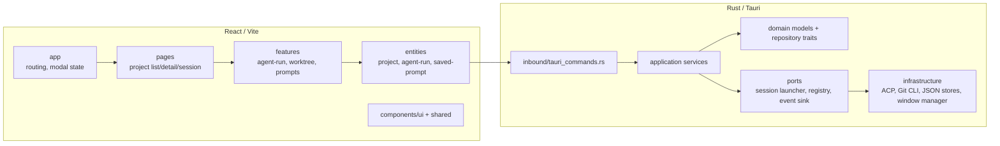
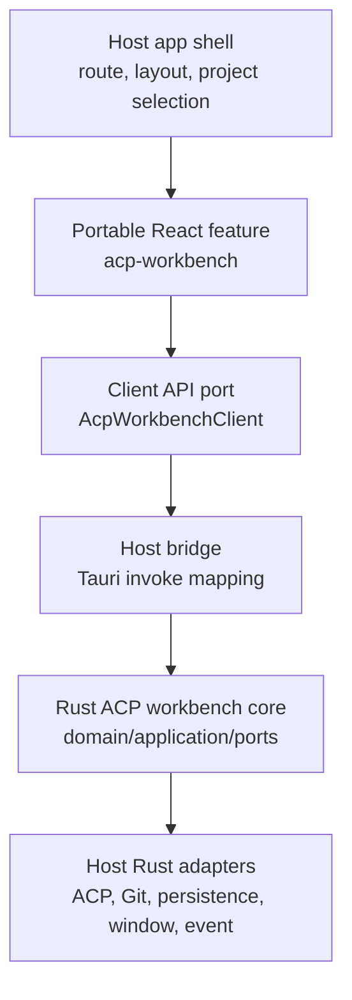
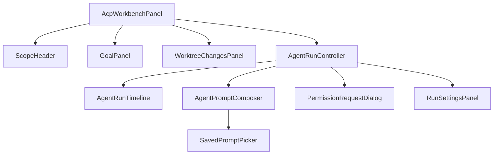

# ACP Minimal App 이식 용이성 개선 계획

## 배경

이 프로젝트의 핵심 기능은 프로젝트의 작업 디렉터리를 등록하고, Git worktree를 선택한 뒤, 선택한 worktree에서 ACP 기반 agentic coding session을 실행하는 것이다. 이후 같은 기능을 다른 Tauri/React 앱이나 더 큰 제품 안으로 옮길 가능성이 있다.

현재 앱은 `Project`, `workingDirectory`, `GitWorktree`, `AgentRun`, `ThreadGoal`, `SavedPrompt`가 한 화면 흐름 안에서 잘 맞물려 있다. 그러나 이 상태로 다른 앱에 옮기려면 다음 결합이 이식 비용을 만든다.

- React route와 app shell이 project CRUD, worktree 선택, agent run 실행을 함께 소유한다.
- `AgentRunPanel`이 ACP 실행, goal 관리, saved prompt, provider session 재사용, worktree changes 표시를 한 컴포넌트 안에서 조립한다.
- Tauri command 이름과 React `invoke` wrapper가 앱 내부 도메인 이름에 맞춰져 있다.
- Rust application service는 잘 분리되어 있지만 inbound command가 repository, git provider, ACP runner, event sink 조립을 직접 알고 있다.
- JSON persistence 위치와 Tauri `AppHandle` 기반 생성 방식이 host 앱의 저장 정책과 묶여 있다.

따라서 목표는 전체 앱을 그대로 복사 가능한 형태로 만드는 것이 아니라, ACP workbench 기능을 재사용 가능한 core와 host adapter로 나누는 것이다.

## 목표

- ACP agent run, goal, saved prompt, worktree session 기능을 host 앱 shell에서 분리한다.
- React UI는 Feature-Sliced Design을 유지하되, route와 app-level modal 상태에 직접 의존하지 않는 panel 단위로 만든다.
- Tauri command 이름과 React API 호출부를 client adapter에 모아 host 앱에서 쉽게 mapping할 수 있게 한다.
- Rust domain/application 로직을 Tauri, JSON 저장소, 특정 window layout, agent catalog 환경 변수 세부사항에서 분리한다.
- 다른 앱이 이미 `Workspace`, `Project`, `Repository`, `Task` 같은 상위 도메인을 갖고 있어도 최소한의 adapter로 ACP workbench를 붙일 수 있게 한다.
- 현재 앱의 동작을 한 번에 크게 바꾸지 않고 단계적으로 모듈 경계를 만든다.

## 비목표

- 즉시 별도 npm/crate 패키지로 배포하지 않는다.
- 기존 UI를 완전히 headless library로 바꾸지 않는다.
- 모든 host 앱이 같은 route, 같은 project 저장 모델, 같은 디자인 시스템을 쓰도록 강제하지 않는다.
- ACP provider 구현 전체를 일반-purpose SDK로 만들지 않는다.
- target 앱 코드를 이 문서 단계에서 직접 수정하지 않는다.

## 현재 구조 요약



공통 이식 단위로 볼 수 있는 기능:

- project/workspace 등록 및 선택
- Git remote/branch/worktree 조회와 worktree 생성/삭제
- worktree 변경 파일 및 diff 조회
- ACP agent 목록, provider session 조회, run 시작/중단/추가 prompt 전송
- run event timeline 표시
- permission request 응답
- worktree별 goal 저장과 진행 기록
- saved prompt 관리
- agent run settings 저장

host 앱마다 달라질 가능성이 큰 기능:

- route 구조와 navigation
- project/workspace 저장 모델
- window/tab 열기 정책
- 디자인 시스템과 layout 밀도
- agent catalog 설정 방식
- permission 기본값과 보안 정책
- JSON 외 persistence

## 목표 구조

ACP workbench를 다음 계층으로 나눈다.



### Portable React feature

위치 후보:

- 단기: `apps/desktop/src/features/acp-workbench`
- 장기: `packages/acp-workbench-react`

포함할 것:

- `AcpWorkbenchPanel`: worktree 기준 agent run 화면
- `AgentRunTimeline`: run event timeline
- `AgentPromptComposer`: prompt, queued prompt, Ralph loop 입력
- `GoalPanel`: worktree goal 조회/생성/수정/진행 표시
- `SavedPromptPicker`: saved prompt 선택과 삽입
- `WorktreeChangesPanel`: 변경 파일과 diff 표시
- query hooks와 mutation hooks
- `AcpWorkbenchClient` interface
- `WorkbenchScope` 타입

포함하지 않을 것:

- 앱 전체 route 정의
- project CRUD modal state
- Tauri `invoke` 직접 호출
- window 생성 정책
- host 앱의 project/workspace persistence 형식
- host 디자인 시스템의 전역 theme 정의

### Portable Rust core

위치 후보:

- 단기: `apps/desktop/src-tauri/src/acp_workbench`
- 장기: workspace crate `crates/acp-workbench-core`

포함할 것:

- domain model: agent descriptor, run request/event, goal, saved prompt, provider session, worktree changes
- application use case: start/cancel run, send prompt, respond permission, list sessions, manage goals, manage prompts, save settings
- ports: `SessionLauncher`, `SessionRegistry`, `EventSink`, `PermissionBroker`, `AgentCatalog`, `GoalRepository`, `SavedPromptRepository`, `AgentRunSettingsRepository`, `WorktreeChangeProvider`
- request normalization과 Ralph loop safety rule
- ACP event mapping test와 domain-level unit test

포함하지 않을 것:

- `tauri::command`
- `AppHandle`, `Window`, `State`
- Tauri event emit 세부사항
- JSON 파일 경로
- host 앱의 `Project` 또는 `Workspace` 저장 형식
- OS별 window 생성 구현

## 핵심 설계 결정

### 1. `workingDirectory` 대신 `WorkbenchScope`를 public 입력으로 둔다

현재 대부분 기능은 `workingDirectory: string`을 직접 받는다. 이 방식은 현재 앱에는 단순하지만, 다른 앱에서는 workspace id, project id, checkout id, container id 같은 상위 식별자가 함께 필요할 수 있다.

portable React feature의 표준 입력은 다음처럼 둔다.

```ts
export type WorkbenchScope = {
  kind: "localWorktree";
  workingDirectory: string;
  projectId?: string;
  projectName?: string;
  worktreeLabel?: string;
};
```

장기적으로는 다음 변형을 추가할 수 있다.

```ts
export type WorkbenchScope =
  | { kind: "localWorktree"; workingDirectory: string; projectId?: string }
  | { kind: "registeredProject"; projectId: string; worktreePath?: string }
  | { kind: "remoteWorkspace"; workspaceId: string; checkoutId: string };
```

Rust application 계층에서는 host-specific scope를 직접 해석하지 않고 resolver port를 둔다.

```rust
pub struct WorkbenchScopeRef {
    pub working_directory: String,
    pub project_id: Option<String>,
    pub worktree_label: Option<String>,
}

pub trait WorkbenchScopeResolver {
    fn resolve(&self, input: WorkbenchScopeInput) -> Result<WorkbenchScopeRef, ScopeError>;
}
```

### 2. React UI는 `AcpWorkbenchClient`만 바라본다

현재 `entities/*/api`는 Tauri command를 직접 호출한다. portable feature에서는 client interface를 먼저 정의하고, 현재 앱은 Tauri adapter를 제공한다.

```ts
export type AcpWorkbenchClient = {
  listAgents(): Promise<AgentDescriptor[]>;
  listProviderSessions(input: ProviderSessionInput): Promise<ProviderSession[]>;
  getSettings(scope: WorkbenchScope): Promise<AgentRunSettings | null>;
  saveSettings(settings: AgentRunSettings): Promise<AgentRunSettings>;
  startRun(request: AgentRunRequest): Promise<AgentRun>;
  sendPrompt(input: SendPromptInput): Promise<void>;
  setPermissionMode(input: PermissionModeInput): Promise<void>;
  cancelRun(runId: string): Promise<void>;
  respondPermission(input: PermissionResponseInput): Promise<void>;
  listenRunEvents(callback: (event: RunEventEnvelope) => void): () => void;
  getGoal(scope: WorkbenchScope): Promise<ThreadGoal | null>;
  createGoal(input: GoalInput): Promise<ThreadGoal>;
  updateGoal(input: GoalUpdateRequest): Promise<ThreadGoal>;
  clearGoal(scope: WorkbenchScope): Promise<void>;
  recordGoalProgress(input: GoalProgressRequest): Promise<ThreadGoal>;
  listSavedPrompts(): Promise<SavedPrompt[]>;
  listWorktreeChanges(scope: WorkbenchScope): Promise<WorktreeChange[]>;
};
```

host 앱은 이 client를 구현하면서 command 이름, HTTP API, mocked backend 중 하나를 선택한다. portable UI는 `invoke`와 command 이름을 알지 않는다.

### 3. Agent run panel을 조립 가능한 하위 컴포넌트로 나눈다

`AgentRunPanel`은 현재 기능이 풍부하지만 이식 단위로는 너무 크다. 다음처럼 책임을 나눈다.



분리 기준:

- data fetching은 hooks에 둔다.
- run lifecycle state는 `AgentRunController`가 소유한다.
- timeline rendering은 event model만 받는다.
- prompt composer는 run 실행 여부를 모르고 submit callback만 받는다.
- goal과 saved prompt는 독립 기능으로 유지하되 workbench에서 조립한다.

### 4. Tauri command는 host adapter로 남긴다

공통 core가 command 이름을 소유하면 host 앱의 command naming, capability, security policy와 충돌한다. command는 host 앱에서 얇게 구현한다.

예:

```rust
#[tauri::command]
pub async fn start_agent_run(
    app: AppHandle,
    window: tauri::Window,
    state: State<'_, AppState>,
    request: AgentRunRequest,
) -> Result<AgentRun, String> {
    let core = build_acp_workbench_core(&app, state.inner().clone(), window.label());
    core.start_run(request).await.map_err(String::from)
}
```

다른 host 앱에서는 같은 use case를 HTTP handler, CLI subcommand, plugin command로 감쌀 수 있다.

### 5. Persistence는 repository port 뒤에 둔다

현재 앱은 JSON 파일 저장소를 사용한다. 이식 가능한 core에서는 다음 저장소를 port로 유지한다.

- `ProjectRepository`는 host 앱 소유로 남긴다.
- `GoalRepository`
- `SavedPromptRepository`
- `AgentRunSettingsRepository`
- `AcpSessionStore`
- `ProviderSessionRepository`

portable workbench는 `Project` CRUD를 소유하지 않고, host가 넘기는 `WorkbenchScope`를 기준으로 goal/settings/session을 저장한다.

### 6. Event routing은 owner window 정책과 분리한다

현재 backend는 window label을 run owner로 저장하고 permission response도 owner window에서만 받는다. 이 정책은 desktop Tauri host에는 좋지만, 다른 host에서는 tab id, web session id, user id, workspace id가 owner가 될 수 있다.

core에는 다음 개념만 둔다.

```rust
pub struct RunOwner {
    pub id: String,
}

pub trait RunEventSink {
    async fn emit(&self, owner: &RunOwner, event: RunEventEnvelope) -> Result<(), EventSinkError>;
}
```

Tauri adapter는 `RunOwner.id == window.label()`로 mapping하고, web host adapter는 socket id나 channel id로 mapping한다.

## 단계별 변경 계획

### Phase 1. React client port 도입

목표: UI 동작 변경 없이 Tauri invoke 의존성을 feature 밖으로 밀어낸다.

작업:

1. `features/acp-workbench/api/client.ts`에 `AcpWorkbenchClient`와 `WorkbenchScope`를 정의한다.
2. 현재 `entities/*/api` invoke wrapper를 감싼 `tauriAcpWorkbenchClient`를 만든다.
3. `AgentRunPanel`이 직접 repository 함수를 import하지 않고 client를 props 또는 context로 받게 한다.
4. query key를 `workingDirectory` raw string이 아니라 `WorkbenchScope` helper에서 생성한다.
5. Storybook fixture용 fake client를 만든다.

완료 기준:

- `AgentRunPanel`과 하위 컴포넌트가 `@tauri-apps/api/core`를 import하지 않는다.
- fake client로 loading/error/success 상태 story를 만들 수 있다.
- 기존 worktree session 화면의 사용자 동작은 동일하다.

### Phase 2. Workbench panel 추출

목표: route와 session page에서 portable panel을 분리한다.

작업:

1. `features/acp-workbench/ui/acp-workbench-panel.tsx`를 public entry로 둔다.
2. `ProjectWorktreeSessionPage`는 project/worktree header와 host navigation만 소유한다.
3. worktree changes, goal, saved prompt, run timeline을 workbench panel 내부 조립으로 이동한다.
4. host-specific header는 `headerSlot`, `toolbarSlot`, `onRunSettled` 같은 props로 받는다.
5. Storybook `organisms` 또는 `pages` story로 등록한다.

완료 기준:

- target 앱은 `AcpWorkbenchPanel`에 `scope`와 `client`만 넘겨 기본 agent session 화면을 붙일 수 있다.
- project route, Tauri window, current app layout을 몰라도 panel을 렌더링할 수 있다.

### Phase 3. Rust workbench core module 분리

목표: ACP 실행 use case를 Tauri inbound와 JSON store 조립에서 분리한다.

작업:

1. `domain/run.rs`, `goal.rs`, `saved_prompt.rs`, `agent_run_settings.rs`, `provider_session.rs`를 `acp_workbench/domain`으로 모을 수 있는지 검토한다.
2. `application/start_agent_run.rs`, `send_prompt.rs`, `cancel_agent_run.rs`, `set_permission_mode.rs`, `goal_service.rs`, `saved_prompt_service.rs`를 workbench application boundary로 묶는다.
3. `AcpWorkbenchServices` factory를 만든다.
4. Tauri command는 DTO 변환과 service 호출만 담당하게 줄인다.
5. request normalization과 Ralph loop sanitize test를 core module에 둔다.

완료 기준:

- application use case는 `AppHandle`, `Window`, JSON store concrete type을 모른다.
- Tauri command 변경은 adapter 조립 코드에 국한된다.
- core module 단위 테스트가 Tauri 없이 실행된다.

### Phase 4. Host adapter 목록 정리

목표: 다른 앱에 이식할 때 필요한 adapter를 체크리스트화한다.

작업:

1. client method와 Tauri command mapping 표를 작성한다.
2. Rust port별 current adapter와 target 앱에서 필요한 adapter를 표로 정리한다.
3. Tauri v2 capability/permission 설정 항목을 문서화한다.
4. event 이름과 payload contract를 고정한다.
5. window/tab owner policy를 host adapter 책임으로 분리한다.

완료 기준:

- target 앱에서 추가해야 할 command, capability, persistence adapter, UI slot 목록이 명확하다.
- current app의 project model을 target app에 강제하지 않는다.

### Phase 5. 패키지화 여부 결정

목표: 복사 가능한 module로 충분한지, workspace package/crate가 필요한지 결정한다.

판단 기준:

- 여러 앱에서 agent run 기능을 동시에 수정해야 하면 `packages/acp-workbench-react`와 `crates/acp-workbench-core`로 승격한다.
- host별 UI와 보안 정책이 빠르게 갈라지면 복사 가능한 feature module로 유지한다.
- Rust ACP client/runner가 여러 앱에서 거의 동일하면 Rust core를 먼저 crate로 승격한다.
- React UI가 디자인 시스템 때문에 갈라지면 headless hooks와 model helper만 package화한다.

## 권장 최종 파일 구조

단기 React 구조:

```text
apps/desktop/src/
  features/
    acp-workbench/
      api/
        client.ts
        tauri-client.ts
        query-keys.ts
      model/
        run-state.ts
        timeline.ts
        goal-continuation.ts
      ui/
        acp-workbench-panel.tsx
        agent-run-controller.tsx
        agent-run-timeline.tsx
        agent-prompt-composer.tsx
        goal-panel.tsx
        saved-prompt-picker.tsx
        worktree-changes-panel.tsx
      index.ts
  pages/
    project-worktree-session/
      ui/project-worktree-session-page.tsx
```

단기 Rust 구조:

```text
apps/desktop/src-tauri/src/
  acp_workbench/
    domain/
    application/
    ports/
    infrastructure/
      acp/
      git/
    mod.rs
  inbound/
    tauri_commands.rs
  infrastructure/
    json_goal_repository.rs
    json_saved_prompt_repository.rs
    tauri_run_event_sink.rs
```

장기 구조:

```text
packages/
  acp-workbench-react/
crates/
  acp-workbench-core/
apps/
  desktop/
    src/features/acp-workbench-host/
    src-tauri/src/inbound/acp_workbench_commands.rs
```

## Command mapping 초안

| 기능 | 현재 command | portable client method | host adapter 책임 |
| --- | --- | --- | --- |
| agent 목록 | `list_agents` | `listAgents()` | agent catalog source 결정 |
| provider session 목록 | `list_provider_sessions` | `listProviderSessions(input)` | provider별 session repository |
| run 설정 조회 | `get_agent_run_settings` | `getSettings(scope)` | scope key normalize |
| run 설정 저장 | `save_agent_run_settings` | `saveSettings(settings)` | persistence adapter |
| run 시작 | `start_agent_run` | `startRun(request)` | owner, permission, event sink 연결 |
| 추가 prompt | `send_prompt_to_run` | `sendPrompt(input)` | active session lookup |
| permission mode 변경 | `set_run_permission_mode` | `setPermissionMode(input)` | provider capability 반영 |
| run 취소 | `cancel_agent_run` | `cancelRun(runId)` | registry cleanup |
| permission 응답 | `respond_agent_permission` | `respondPermission(input)` | owner 검증 |
| goal 조회/변경 | `get_goal`, `create_goal`, `update_goal`, `clear_goal`, `record_goal_progress` | goal methods | worktree scope 저장 key |
| saved prompt CRUD | `list/create/update/delete_saved_prompt` | saved prompt methods | host 저장 정책 |
| worktree 변경 조회 | `list_worktree_changes` | `listWorktreeChanges(scope)` | Git provider 또는 remote diff provider |

## 리스크와 대응

- 컴포넌트 비대화: `AgentRunPanel`을 그대로 portable entry로 삼으면 이식 후 수정 비용이 크다. controller, timeline, composer, goal, changes로 분리한다.
- host scope 혼동: `workingDirectory`만 쓰면 target 앱의 workspace/project/checkouts와 충돌할 수 있다. `WorkbenchScope`를 public 입력으로 둔다.
- event routing 결합: Tauri window label 정책은 adapter에 둔다. core는 `RunOwner`만 안다.
- permission 보안: permission response owner 검증과 `dangerouslySkipAllPermissions` 기본값은 host policy로 문서화한다.
- persistence 충돌: JSON store를 core에 넣지 않고 repository port로 둔다.
- 디자인 시스템 차이: shadcn/ui generated component는 current app 내부에 두고, portable feature는 필요한 slot 또는 작은 shared primitive만 사용한다.
- provider 차이: Codex, Claude Code, 기타 ACP provider의 option/model/context capability 차이를 `AgentDescriptor` contract로 흡수한다.

## 검증 계획

- Rust
  - request normalization과 Ralph loop sanitize test
  - session launcher fake 기반 start/cancel/send prompt use case test
  - permission response owner mismatch test
  - goal/settings repository fake test
  - ACP event mapping test
- React
  - fake `AcpWorkbenchClient` 기반 panel rendering test
  - run event timeline append/grouping test
  - loading/error/empty/success 상태 test
  - permission request dialog interaction test
  - query key가 scope를 안정적으로 구분하는지 test
- 통합
  - 현재 앱에서 project 선택, worktree 선택, run 시작/취소, prompt 전송, permission 응답, goal 저장, saved prompt 삽입이 기존처럼 동작하는지 확인
  - target 앱 dry-run에서 추가 adapter 코드가 host feature 폴더에 갇히는지 확인

## 권장 진행 순서

1. `AcpWorkbenchClient`와 `WorkbenchScope`를 React에 먼저 도입한다.
2. 기존 `AgentRunPanel`을 client 기반으로 바꾼다.
3. `AcpWorkbenchPanel`을 만들고 `ProjectWorktreeSessionPage`를 host wrapper로 줄인다.
4. Rust에 `AcpWorkbenchServices` factory와 core module boundary를 만든다.
5. Tauri command를 얇은 adapter로 정리한다.
6. event owner, permission policy, persistence adapter를 이식 체크리스트로 고정한다.
7. 이후 workspace package/crate 승격 여부를 판단한다.

이 순서가 좋은 이유는 이식성에 가장 큰 영향을 주는 React 호출부와 Rust use case 조립 경계를 먼저 고정하기 때문이다. UI 레이아웃이나 dual pane 같은 확장 기능은 이 구조 위에서 구현해야 나중에 다시 옮기는 비용이 줄어든다.
