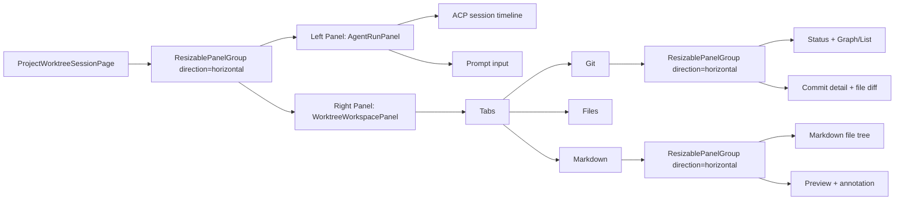
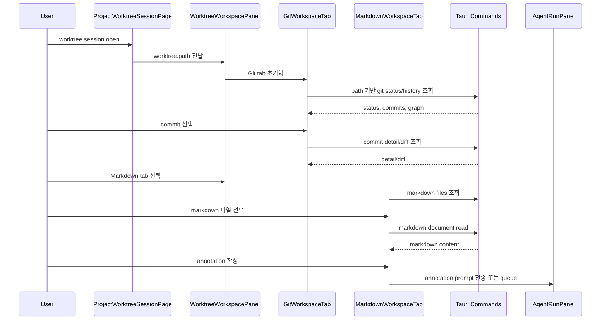
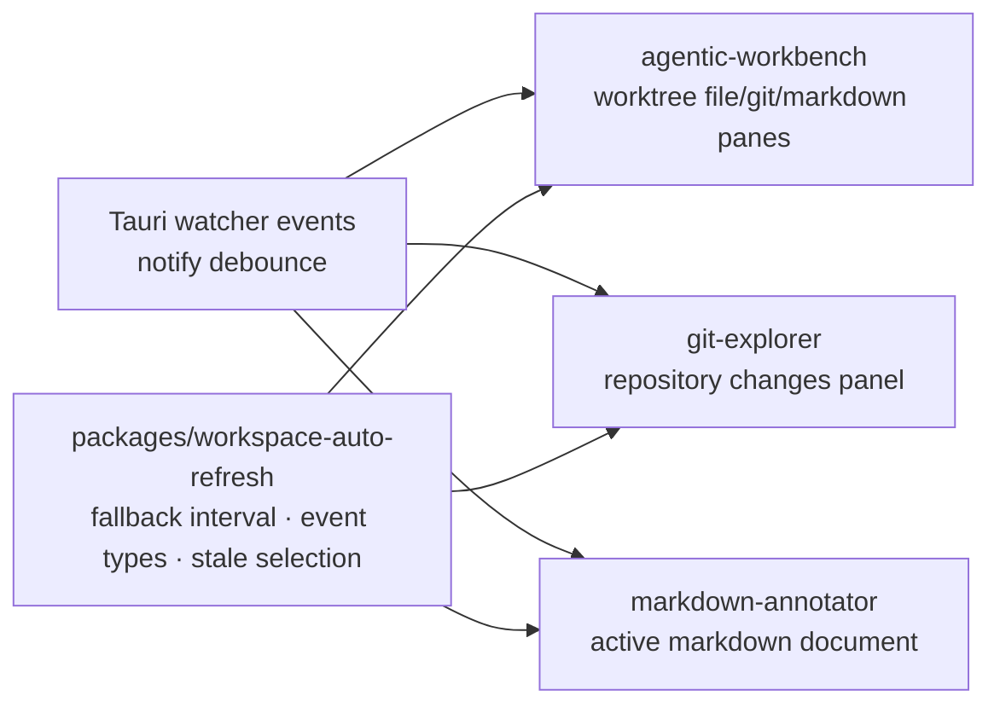

# ProjectWorktreeSessionPage Workspace 통합 계획

## 목적

`ProjectWorktreeSessionPage`를 ACP agent 실행 화면에서 작업 검토 워크스페이스로 확장한다. 왼쪽에는 현재처럼 agent session timeline과 prompt를 유지하고, 오른쪽에는 탭 기반 작업 패널을 추가한다.

초기 통합 대상은 `git-explorer`의 git graph/commit list/commit detail이다. 이후 file tree와 markdown file tree를 추가하고, markdown 파일 선택 시 `markdown-annotator`의 preview 및 annotation 기능을 연결한다.

## 현재 구조

현재 `ProjectWorktreeSessionPage`는 선택한 worktree 경로를 `AgentRunPanel`에 전달하는 얇은 page 컴포넌트다.

- 화면: `apps/agentic-workbench/src/pages/project-worktree-session/ui/project-worktree-session-page.tsx`
- 주요 구성: `AgentRunPanel`
- 현재 레이아웃: 단일 column 안에서 agent session timeline과 prompt를 `AgentRunPanel` 내부 resizable pane으로 구성

```text
------------+
acp session |
            |
            |
------------|
prompt      |
------------+
```

## 목표 구조

`ProjectWorktreeSessionPage`에서 최상위 `ResizablePanelGroup`을 구성하고, 왼쪽 agent 영역과 오른쪽 workspace 영역을 분리한다.

```text
------------+--- TAB: git tree / file tree / markdown file tree ----------------
acp session | git status                | commit detail / file data / markdown
            | git graph or commit list  | markdown preview / annotate
            |                           |
------------|                           |
prompt      |                           |
------------+---------------------------+----------------------------------------
```

## 화면 구성 원칙

- 왼쪽 `AgentRunPanel`은 기존 기능을 최대한 유지한다.
- 오른쪽 workspace는 `react-resizable-panels` 기반으로 구성한다.
- workspace 상단에는 탭을 두고, 탭별로 왼쪽 탐색 pane과 오른쪽 detail pane을 가진다.
- `git tree` 탭은 먼저 구현한다.
- `file tree` 탭은 shell/filesystem 탐색 API가 준비된 뒤 구현한다.
- `markdown file tree` 탭은 markdown 파일만 표시하고, 선택한 파일을 markdown preview/annotation detail pane에 렌더링한다.

## 제안 컴포넌트 구조

```text
pages/project-worktree-session
└── ui
    └── ProjectWorktreeSessionPage
        ├── AgentRunPanel
        └── WorktreeWorkspacePanel
            ├── WorktreeWorkspaceTabs
            ├── GitWorkspaceTab
            │   ├── GitStatusPanel
            │   ├── GitHistoryPanel
            │   └── GitCommitDetailPanel
            ├── FileWorkspaceTab
            │   ├── FileTreePanel
            │   └── FileDetailPanel
            └── MarkdownWorkspaceTab
                ├── MarkdownFileTreePanel
                └── MarkdownAnnotatorPanel
```

FSD 기준으로는 page 자체 조립은 `pages/project-worktree-session`, git/file/markdown 업무 기능은 `features` 또는 `entities`로 분리한다.

- `features/worktree-workspace/ui/worktree-workspace-panel.tsx`
- `features/git-history/ui/git-history-panel.tsx`
- `features/git-history/ui/git-commit-detail-panel.tsx`
- `features/markdown-workspace/ui/markdown-annotator-panel.tsx`
- 공용 타입/API는 필요 시 `entities/repository`, `entities/worktree-file`, `entities/markdown-document`로 이동

## 레이아웃 설계



권장 기본 크기:

- 전체 horizontal split: agent `40%`, workspace `60%`
- agent 최소 폭: `360px`
- workspace 최소 폭: `480px`
- workspace 내부 split: 탐색 `42%`, detail `58%`
- 작은 화면에서는 workspace를 숨기거나 tab drawer로 전환하는 responsive 정책을 별도 정의

## Git 통합 계획

### 기존 재사용 후보

`apps/git-explorer/src/widgets/changes-panel/ui/ChangesPanel.tsx` 안에 다음 기능이 이미 있다.

- commit graph 계산 및 표시
- commit list 표시
- branch filter/hide
- commit detail 조회
- changed file tree/list
- file diff 표시

다만 현재 `ChangesPanel`은 repository selection, worktree list, branch controls, history, detail, diff까지 한 파일에 결합되어 있다. `agentic-workbench`에 그대로 가져오면 화면 요구사항에 맞게 일부만 쓰기 어렵다.

### 권장 분리 단위

먼저 `git-explorer` 내부에서 다음 단위로 추출한 뒤 `agentic-workbench`가 가져가도록 한다.

- `GitHistoryGraphView`: graph rows 렌더링
- `GitHistoryListView`: commit list 렌더링
- `GitCommitDetailView`: 선택 commit의 metadata와 changed files
- `GitFileDiffView`: 선택 파일 diff
- `gitGraphLayout`: 이미 `features/history-tree/model/graph-layout.ts`에 있으므로 공용화 후보
- `repositoryApi`: `listHistory`, `getCommitGraph`, `getCommitDetail`, `getFileDiff`

공유 방식은 두 단계로 나눈다.

1. 빠른 통합: `agentic-workbench` 안에 필요한 코드와 타입을 feature 단위로 복사하되, public API를 작게 유지한다.
2. 안정화 후: `packages/git-workspace` 같은 공용 패키지로 추출해 `git-explorer`와 `agentic-workbench`가 함께 사용한다.

### Repository 식별

`git-explorer` API는 `repositoryId` 중심이고, `agentic-workbench`의 현재 화면은 `worktree.path` 중심이다. 통합 전에 다음 중 하나가 필요하다.

- `worktree.path`로 repository/worktree context를 만드는 adapter 추가
- `agentic-workbench` 프로젝트 모델에 `repositoryId`를 저장
- Tauri command에서 path 기반 git history/detail API를 별도로 제공

초기 구현은 `worktree.path` 기반 API가 가장 단순하다. 이후 monorepo repository 모델이 안정되면 `repositoryId` 기반으로 정규화한다.

## File Tree 계획

초기에는 placeholder 탭으로 둔다.

필요한 기능:

- 선택 worktree의 파일 목록 조회
- `.git`, `node_modules`, `target`, `coverage`, build output 제외
- 파일/폴더 tree 렌더링
- 선택 파일 내용 표시
- binary/large file 처리
- git ignored 파일 표시 정책

예상 위치:

- `entities/worktree-file/api`
- `features/worktree-file-tree/ui/file-tree-panel.tsx`
- `features/worktree-file-viewer/ui/file-detail-panel.tsx`

## Markdown Tree 및 Annotation 계획

### 기존 재사용 후보

`markdown-annotator`에는 다음 기능이 있다.

- `readMarkdownDocument(path)`
- `parseMarkdownToBlocks(markdown)`
- `MarkdownViewer`
- annotation prompt export helper

### 통합 방향

markdown file tree는 file tree의 필터링 버전으로 시작한다.

- 확장자: `.md`, `.markdown`, `.mdx`
- 선택 시 파일을 읽고 markdown block으로 파싱
- 오른쪽 detail pane에서 `MarkdownViewer` 렌더링
- annotation 생성/삭제/수정은 기존 `MarkdownViewer` callback을 연결
- annotation을 agent prompt로 전송하는 액션은 prompt queue 또는 일반 prompt 전송과 연결

### 공용화 후보

`MarkdownViewer`는 현재 `apps/markdown-annotator/src/shared/ui`에 있다. 장기적으로 다음 중 하나를 선택한다.

- `packages/markdown-annotator-ui`로 추출
- `packages/ui`에 넣지 않고 markdown 전용 package로 분리
- 단기적으로 `agentic-workbench`에 feature 단위 복사 후 API 확정

`packages/ui`는 범용 UI 컴포넌트용이므로 annotation domain 로직까지 넣지 않는 편이 좋다.

## 데이터 흐름



## 단계별 구현 계획

### 1단계: 레이아웃 shell 추가

- `ProjectWorktreeSessionPage` 최상위에 horizontal `ResizablePanelGroup` 추가
- 왼쪽 panel에 기존 `AgentRunPanel` 유지
- 오른쪽 panel에 `WorktreeWorkspacePanel` placeholder 추가
- Storybook page story에 넓은 화면/좁은 화면 case 추가
- 기존 agent session 동작 회귀 테스트

완료 기준:

- 기존 prompt/timeline 동작이 유지된다.
- 오른쪽 workspace panel이 resize 가능하다.
- 최소 폭 이하에서 UI가 깨지지 않는다.

### 2단계: Git workspace 1차 통합

- git tab 추가
- `worktree.path` 기반 git status 표시
- commit list 또는 graph 중 하나를 먼저 표시
- commit 선택 상태를 workspace 내부 state로 관리
- commit detail placeholder 또는 최소 metadata 표시

완료 기준:

- 선택 worktree의 commit history가 표시된다.
- commit 선택 시 오른쪽 detail pane이 갱신된다.

### 3단계: Git graph/detail 완성

- `git-explorer`의 graph layout 및 graph row UI 재사용
- commit list/graph segmented control 추가
- commit detail의 changed files tree/list 표시
- file diff 표시
- branch filter/hide는 필요 시 후순위로 유지

완료 기준:

- git-explorer의 핵심 graph/list/detail 사용 경험이 workbench 안에서 동작한다.
- 기존 git-explorer와 중복된 로직의 공용화 대상이 명확히 분리된다.

### 4단계: Markdown file tree 1차

- markdown tab 추가
- 선택 worktree 내 markdown 파일만 tree로 표시
- markdown 파일 선택 시 raw text 또는 preview 표시
- large file/error/empty 상태 처리

완료 기준:

- `.md`, `.markdown`, `.mdx` 파일이 tree에 표시된다.
- 선택 파일 preview가 detail pane에 표시된다.

### 5단계: Markdown annotation 통합

- `MarkdownViewer`와 `parseMarkdownToBlocks` 연결
- block/inline annotation state 추가
- annotation prompt export 연결
- agent prompt queue 또는 send 액션과 연결

완료 기준:

- markdown preview에서 annotation을 추가/삭제할 수 있다.
- annotation 내용을 agent에게 보낼 수 있다.

### 6단계: 공용 패키지 정리

- git graph/list/detail 공용 컴포넌트 추출 여부 결정
- markdown viewer/annotation 공용 패키지 추출 여부 결정
- `git-explorer`, `markdown-annotator`, `agentic-workbench` 간 중복 제거

완료 기준:

- cross-app 재사용 코드가 `packages/*` 또는 명확한 app-local feature로 정리된다.
- Storybook에서 각 공용 컴포넌트가 독립 검증된다.

### 7단계: Cross-app auto reload

`agentic-workbench`, `git-explorer`, `markdown-annotator`는 열린 작업 대상이 외부에서
변경되었을 때 Tauri watcher event로 최신 상태를 반영한다. React Query polling은
event 누락과 focus 복귀를 보정하는 30초 fallback으로 둔다. 세 앱이 같은 fallback/stale
정책을 쓰도록 순수 refresh helper는 `packages/workspace-auto-refresh`에 둔다.



구현 기준:

- 공통 fallback interval은 30초이며 window focus 복귀 시에도 갱신한다.
- `agentic-workbench`는 active worktree root와 Git metadata path를 watch하고, event 수신 시 active `worktree.path` query만 갱신한다.
- `git-explorer`는 selected repository query만 갱신하고 기존 repository watcher
  invalidation을 유지한다.
- `markdown-annotator`는 Tauri에서 열린 active markdown file을 watch하고, event 수신 시 해당 문서만 다시 읽는다.
- refresh 실패 시 마지막 성공 데이터를 유지하고 stale/error 상태를 표시한다.
- 선택 파일/commit/document가 refresh 후에도 유효하면 선택과 scroll 맥락을 유지한다.
- 선택 대상이 사라지면 stale 상태로 표시하고 재선택 또는 retry 경로를 제공한다.

완료 기준:

- 파일 변경은 `agentic-workbench` file/markdown pane과 `markdown-annotator` preview에
  3초 이내 반영된다.
- commit/branch/ref 변경은 `agentic-workbench` Git pane과 `git-explorer` changes panel에
  3초 이내 반영된다.
- 세 앱이 app-to-app import 없이 `packages/workspace-auto-refresh`만 공유한다.

## 테스트 및 검증

- `ProjectWorktreeSessionPage` Storybook story 추가/수정
- `WorktreeWorkspacePanel` story 추가
- git history empty/loading/error story
- markdown file tree empty/loading/error story
- resize interaction은 Playwright 또는 Storybook interaction test로 확인
- Tauri command는 path/repository 식별 실패 case 테스트
- markdown annotation formatter는 기존 테스트 유지 및 agentic-workbench 연동 case 추가
- auto reload helper: `pnpm --filter @yoophi/workspace-auto-refresh test`
- workbench: `pnpm --filter @yoophi/agentic-workbench check-types && pnpm --filter @yoophi/agentic-workbench test`
- git-explorer: `pnpm --filter @yoophi/git-explorer check-types && pnpm build-storybook:git`
- markdown-annotator: `pnpm --filter @yoophi/markdown-annotator check-types && pnpm --filter @yoophi/markdown-annotator test`

## 리스크와 결정 필요 사항

- `git-explorer`의 `repositoryId` 모델과 `agentic-workbench`의 `worktree.path` 모델이 다르다.
- `ChangesPanel`이 큰 단일 컴포넌트라 직접 재사용보다 분리가 먼저 필요하다.
- `markdown-annotator`의 UI는 app 내부 alias와 shadcn 컴포넌트에 묶여 있어 바로 import하기 어렵다.
- 오른쪽 workspace 추가로 작은 화면에서 agent prompt 사용성이 낮아질 수 있다.
- git/file/markdown 탐색이 모두 filesystem 접근을 쓰므로 Tauri command 권한과 성능 정책이 필요하다.

우선 결정할 항목:

- git 통합을 `worktree.path` 기반 API로 시작할지, repository 모델을 먼저 정규화할지
- 공용화 시점을 1차 통합 전으로 둘지, 동작 구현 후로 둘지
- mobile/small width에서 workspace를 숨김 처리할지, 세로 stack으로 전환할지
