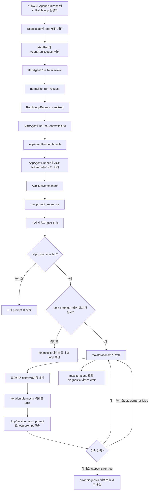

# Ralph Mode 구현

이 문서는 `origin/main`의 commit `c2eb75b` 기준으로 Ralph mode가 어떻게
구현되어 있는지 설명한다.

현재 코드베이스에서 사용자에게 노출되는 기능명은 Ralph mode가 아니라
**Ralph loop**이다. 이 기능은 agent run을 사용자의 직접 프롬프트로 시작한
뒤, 정해진 반복 횟수 안에서 동일한 follow-up loop prompt를 자동으로 다시
전송한다.

## 전체 흐름

## 프론트엔드 구현

프론트엔드 모델은 `apps/agentic-workbench/src/entities/agent-run/model/types.ts`에서
`RalphLoopRequest`를 정의한다. payload는 camelCase로 직렬화되며 다음 필드를
포함한다.

- `enabled`
- `maxIterations`
- `promptTemplate`
- `stopOnError`
- `stopOnPermission`
- `delayMs`

UI는 `apps/agentic-workbench/src/features/agent-run/ui/agent-run-panel.tsx`에 있다. 이
panel은 Ralph loop 설정을 local React state로 관리한다.

- `ralphLoopEnabled`, default `false`
- `ralphMaxIterations`, default `5`
- `ralphDelaySeconds`, default `0`
- `ralphStopOnError`, default `true`
- `ralphPromptTemplate`, 기본값은 한국어 follow-up instruction

`startRun`이 `AgentRunRequest`를 만들 때, 사용자가 Ralph loop를 활성화한
경우에만 `ralphLoop`를 포함한다. 프론트엔드는 초 단위 입력을 밀리초로
변환하며, 현재는 `stopOnPermission: false`를 보낸다.

run이 진행 중일 때 Ralph loop control은 비활성화된다. 따라서 loop 설정은
run 시작 시점에 고정되며 실행 중에는 수정할 수 없다.

## 백엔드 요청 정규화

Tauri command layer는 `apps/agentic-workbench/src-tauri/src/inbound/tauri_commands.rs`에서
요청을 받는다.

실행 전에 `normalize_run_request`는 다음 작업을 수행한다.

- `run_id`를 보장한다.
- 아직 지원하지 않는 `workspace_id`와 `checkout_id`를 비운다.
- `RalphLoopRequest::sanitized`로 `ralph_loop`를 sanitize한다.

domain model은 `apps/agentic-workbench/src-tauri/src/domain/run.rs`에 정의되어 있다. 백엔드
안전 제한은 다음과 같다.

- `MAX_RALPH_ITERATIONS = 100`
- `MAX_RALPH_DELAY_MS = 60_000`

`RalphLoopRequest::sanitized`는 `prompt_template`의 앞뒤 공백을 제거하고,
`max_iterations`를 `1..=100` 범위로 clamp하며, `delay_ms`를 최대 60초로
제한한다.

## 실행 경로

`StartAgentRunUseCase`는 run registry bookkeeping을 담당하고 run task를
spawn한다. process/session 관련 세부 작업은 `SessionLauncher` port에 위임한다.

ACP 구현은 `apps/agentic-workbench/src-tauri/src/infrastructure/acp/runner.rs`에 있다.

1. `AcpAgentRunner::launch`가 ACP session을 시작하거나 재개한다.
2. `request.ralph_loop`를 `AcpRunCommander`에 저장한다.
3. `AcpRunCommander::run_to_completion`이 `run_prompt_sequence`를 호출한다.
4. `run_prompt_sequence`가 먼저 초기 goal을 전송한다.
5. Ralph loop가 활성화되어 있으면 설정된 `prompt_template`을 반복 전송한다.

각 prompt는 `AcpSession::send_prompt`를 통해 전송된다. 이 함수는 `in_flight`
mutex를 사용한다. 이전 prompt가 아직 처리 중이면 전송은
`agent is still responding to the previous prompt` 오류로 실패한다.

## 중단 조건

Ralph loop는 다음 조건 중 하나를 만나면 중단된다.

- 초기 prompt 전송이 실패한다.
- `ralph_loop`가 없거나 `enabled`가 false이다.
- sanitize된 loop prompt가 비어 있다.
- follow-up prompt 전송이 실패했고 `stopOnError`가 true이다.
- loop가 `maxIterations`에 도달한다.

`stopOnError`가 false이면 prompt 전송 실패 시 error event를 emit하지만 loop는
다음 iteration으로 계속 진행한다.

## 이벤트와 사용자 가시성

runner는 loop 중에 diagnostic event와 lifecycle event를 emit한다.

- prompt가 제출되면 `PromptSent` lifecycle event를 emit한다.
- ACP prompt가 반환되면 ACP stop reason을 포함한 `PromptCompleted` lifecycle
  event를 emit한다.
- 각 Ralph loop iteration이 시작될 때 diagnostic event를 emit한다.
- loop가 `maxIterations`에 도달해 멈추면 diagnostic event를 emit한다.
- prompt 전송이 실패하면 error event를 emit한다.

이 이벤트들은 일반 agent message와 같은 run event pipeline을 통해 흐른다. 따라서
프론트엔드 timeline은 별도 event channel 없이 Ralph loop 진행 상황을 렌더링할
수 있다.

## 현재 제약

`stopOnPermission`은 프론트엔드와 백엔드 request type에 존재하지만, 현재
runner는 이 값으로 분기하지 않는다. 프론트엔드는 항상
`stopOnPermission: false`를 보낸다.

loop는 goal 완료 감지가 아니라 iteration count로 제한된다. 기본 prompt는
목표를 완료했다면 멈추라고 agent에게 요청하지만, runner 자체가 agent response를
파싱해 완료 여부를 판단하지는 않는다.

Ralph loop 설정은 run 시작 시점에만 적용된다. 실행 중 설정 변경은 현재
지원하지 않는다.

## 테스트 커버리지

백엔드에는 핵심 동작에 대한 focused test가 있다.

- request normalization이 Ralph loop 범위와 prompt 공백을 sanitize한다.
- `run_prompt_sequence`가 초기 prompt와 follow-up prompt를 `maxIterations`까지
  전송한다.
- `stopOnError`가 활성화되어 있으면 dispatch failure가 loop를 중단한다.
