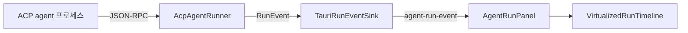
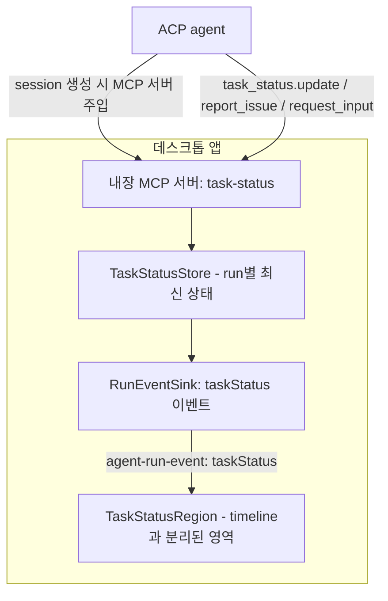
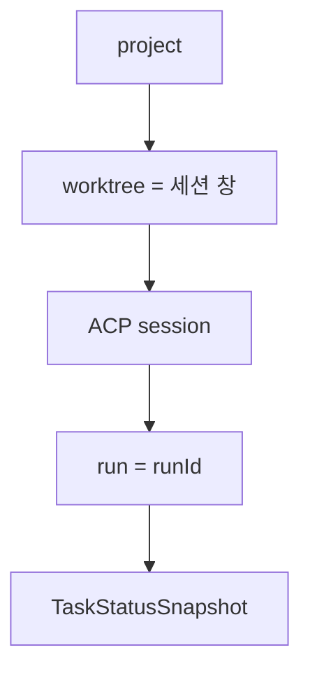
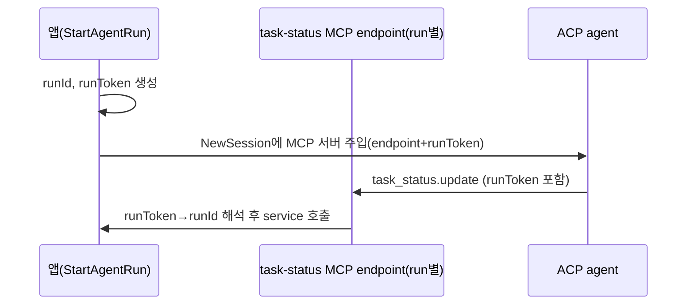
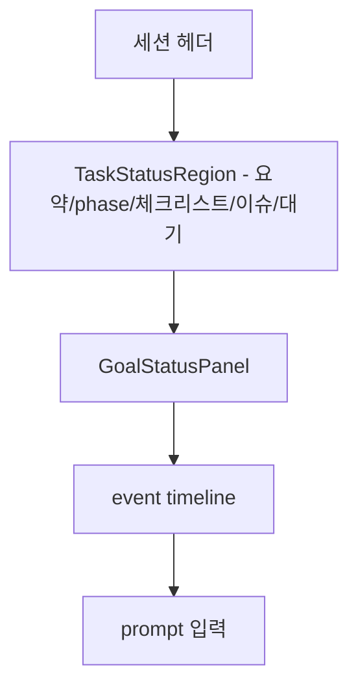
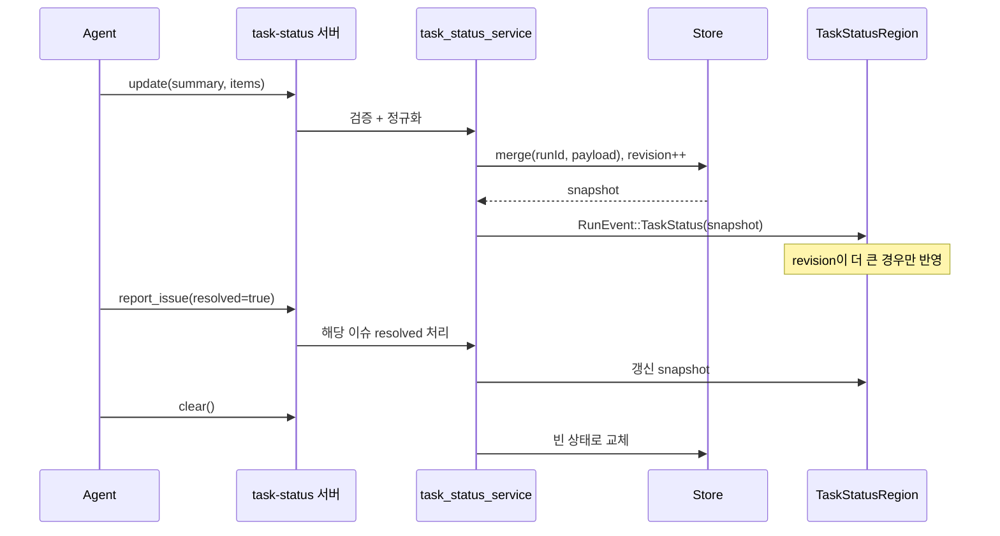

# Agent 작업 요약·발견 이슈 표시용 MCP 인터페이스 설계

이 문서는 이슈 #77에 대한 설계안이다. Agent가 진행 중인 작업 요약, 진행 단계,
발견한 이슈, 사용자 확인이 필요한 항목을 **MCP 인터페이스**를 통해 앱에 전달하고,
앱이 이를 timeline/log와 분리된 별도 영역에 지속적으로 표시하기 위한 구조를 정의한다.

구현은 포함하지 않으며, tool/resource 이름·스키마·lifecycle·데이터 모델·scope·
UI 배치·충돌 전략·MVP 범위를 확정하는 것을 목표로 한다.

## 1. 배경과 현재 구조

현재 앱은 ACP **client**로서 agent 프로세스를 실행하고, agent가 보내는 이벤트를
`RunEvent`로 변환해 프론트엔드에 전달한다(`apps/agentic-workbench/src-tauri/src/domain/events.rs`).



`RunEvent`는 `lifecycle`, `agentMessage`, `thought`, `plan`, `tool`, `usage`,
`permission`, `fileSystem`, `terminal`, `diagnostic`, `raw`, `error`를 포함하며 모두
timeline(log)에 시간 순으로 누적된다. 즉, "지금 무슨 작업을 하고 있는지"를 한눈에
보여주는 **누적되지 않는 최신 상태 영역**이 없다.

이 설계는 그 빈틈을 MCP 기반 인터페이스로 채운다.

## 2. 설계 개요

ACP는 session을 만들 때 agent에게 **MCP 서버 목록**을 전달할 수 있다
(`NewSessionRequest`의 MCP 서버 설정). 이 점을 활용해 앱이 작은 **MCP 서버**를
호스팅하고, 그 서버가 `task_status/*` tool을 노출한다. Agent는 이 tool을 호출해
구조화된 작업 상태를 push한다.



핵심 아이디어:

- 상태는 timeline에 누적되는 것이 아니라 **run 단위의 단일 최신 스냅샷**으로 보관된다.
- 앱은 그 스냅샷을 별도 UI 영역에 렌더링한다.
- agent가 임의 HTML/script를 보내지 못하도록 **structured content만** 허용한다.

## 3. MCP 인터페이스

서버 이름: `task-status` (agent에 주입되는 MCP 서버 식별자).

### 3.1 Tools

| Tool | 목적 | 갱신 방식 |
| --- | --- | --- |
| `task_status.update` | 작업 요약·진행 단계·체크리스트를 갱신 | partial merge |
| `task_status.report_issue` | 발견한 이슈/위험 추가·해소 | append / resolve |
| `task_status.request_input` | 사용자 확인 필요 항목 추가·취소 | append / cancel |
| `task_status.set_phase` | 현재 phase와 next action/대기 상태 갱신 | replace |
| `task_status.clear` | 현재 run의 상태를 초기화 | replace(empty) |

> partial update와 full replacement를 혼용한다. 요약/phase처럼 단일 값은
> replace, 체크리스트/이슈/입력요청처럼 컬렉션은 id 기반 merge로 다룬다.
> 컬렉션을 통째로 갈아끼우고 싶으면 `task_status.update`에 `replaceItems: true`를 준다.

### 3.2 입력 스키마 (개념)

`task_status.update` 입력:

```jsonc
{
  "summary": "현재 작업 한 줄 요약",         // string, optional
  "phase": "implementing",                  // string, optional
  "items": [                                 // 체크리스트, optional
    { "id": "step-1", "label": "스키마 정의", "status": "done" },
    { "id": "step-2", "label": "서비스 구현", "status": "inProgress" }
  ],
  "replaceItems": false                      // true면 items 전체 교체
}
```

`task_status.report_issue` 입력:

```jsonc
{
  "id": "issue-1",                           // 동일 id 재전송 시 갱신
  "severity": "warning",                     // info | warning | error
  "title": "마이그레이션 누락 가능성",
  "detail": "...",                            // optional
  "filePath": "src/db/schema.ts",            // optional
  "resolved": false                          // true면 해소 처리
}
```

`task_status.request_input` 입력:

```jsonc
{
  "id": "ask-1",                             // 동일 id 재전송 시 갱신
  "prompt": "이 파일을 삭제해도 될까요?",
  "options": ["삭제", "보존"],                // optional
  "cancelled": false                         // true면 요청 취소
}
```

`task_status.set_phase` 입력:

```jsonc
{
  "phase": "awaitingReview",                 // optional
  "nextAction": "사용자 검토 후 PR 생성",      // optional
  "waiting": true                            // 사용자/외부 입력 대기 여부, optional
}
```

모든 tool은 성공 시 갱신된 스냅샷의 `updatedAt`을 반환한다. 입력은 JSON Schema로
검증하며, 문자열 필드는 길이 상한과 plain text 강제(아래 8장)를 적용한다.

### 3.3 Resources (선택)

읽기 용도로 `task-status://current` resource를 노출해 agent가 자신이 보낸 최신
상태를 다시 조회할 수 있게 한다. MVP에서는 생략 가능하며, tool의 반환값으로 충분하다.

## 4. 데이터 모델

run 단위 스냅샷:

```ts
type TaskStatusItemState = "pending" | "inProgress" | "done" | "skipped";
type TaskIssueSeverity = "info" | "warning" | "error";

type TaskStatusItem = { id: string; label: string; status: TaskStatusItemState };
type TaskIssue = {
  id: string;
  severity: TaskIssueSeverity;
  title: string;
  detail?: string;
  filePath?: string;
  resolved: boolean;
};
type TaskInputRequest = {
  id: string;
  prompt: string;
  options?: string[];
  cancelled: boolean;
};

type TaskStatusSnapshot = {
  scope: TaskStatusScope;     // 5장 참조
  summary: string | null;
  phase: string | null;
  nextAction: string | null;
  waiting: boolean;
  items: TaskStatusItem[];
  issues: TaskIssue[];
  needsUserInput: TaskInputRequest[];
  updatedAt: string;          // RFC3339
  revision: number;           // 단조 증가, 늦게 도착한 갱신 무시용
};
```

백엔드(domain)에서는 동일 구조를 `serde(rename_all = "camelCase")`로 정의한다.

## 5. Scope와 lifecycle

### 5.1 귀속 scope

상태는 **run**에 1차 귀속되고, run이 속한 **session/worktree**로 투영된다.



- 1차 키: `runId`. MCP tool 호출은 호출 출처 run으로 매핑된다(6.2 참조).
- 표시 단위: 세션 창(worktree)에는 항상 **현재 활성 run의 스냅샷 1개**만 보여준다.
- Ralph loop처럼 한 run이 여러 iteration을 도는 경우 같은 `runId`를 유지하므로
  스냅샷도 누적/갱신된다.

### 5.2 lifecycle

| 시점 | 동작 |
| --- | --- |
| run 시작(`startAgentRun`) | 해당 runId의 스냅샷을 빈 상태로 초기화 |
| agent가 tool 호출 | 스냅샷 갱신, `revision` 증가, 이벤트 emit |
| `promptCompleted` | 스냅샷 유지(다음 prompt까지 최신 상태로 노출) |
| `completed`/`cancelled`/`error`(terminal) | 스냅샷을 "완료됨"으로 표시하되 보존 |
| 새 run 시작 | 이전 run 스냅샷은 보관소에서 archive, 표시 영역은 새 run 기준으로 갱신 |

terminal 이후에도 스냅샷을 보존하므로 사용자는 실행이 끝난 뒤에도 마지막 상태를
확인할 수 있다(이슈 #75의 "완료 후 재확인"과 동일한 원칙).

## 6. 백엔드 설계 (hexagonal)

`apps/agentic-workbench/src-tauri/src` 아래 기존 헥사고날 구조를 따른다.

### 6.1 모듈

- `domain/task_status.rs` — `TaskStatusSnapshot` 등 모델과, **순수 갱신 로직**
  `apply_update`/`apply_issue`/`apply_input`/`clear`(merge 규칙, revision 증가).
- `ports/task_status_store.rs` — `TaskStatusStore` 트레잇(runId별 스냅샷 get/put).
- `application/task_status_service.rs` — tool 호출 페이로드를 검증·정규화하고
  도메인 갱신 로직을 호출, 갱신된 스냅샷을 `RunEventSink`로 emit.
- `infrastructure/mcp/task_status_server.rs` — 내장 MCP 서버. tool 호출을
  application service로 위임. run 매핑은 6.2.
- `infrastructure/in_memory_task_status_store.rs` — 메모리 보관소(MVP).

상태 갱신 로직(merge, revision)은 도메인의 순수 함수로 두어 단위 테스트가 쉽도록 한다
(`goal_service`/`run-panel-state`와 동일한 테스트 전략).

### 6.2 run 매핑 (충돌 방지의 핵심)

여러 agent/run이 동시에 존재할 수 있으므로, MCP tool 호출을 **정확한 run에**
연결해야 한다. 각 run에 대해 별도의 MCP 서버 endpoint(또는 토큰)를 발급한다.



- run마다 고유 `runToken`을 발급하고 MCP 서버 설정에 환경변수/헤더로 주입한다.
- tool 호출은 `runToken`으로 runId를 역참조하므로, 다른 run의 상태를 덮어쓸 수 없다.
- 잘못된/만료된 token 호출은 거부한다.

### 6.3 이벤트 전달

새 `RunEvent` variant를 추가한다.

```rust
TaskStatus { snapshot: TaskStatusSnapshot },
```

`TauriRunEventSink`가 기존 `agent-run-event` 채널로 emit하므로 창 격리
(`emit_to(label, ...)`) 규칙을 그대로 재사용한다. 프론트엔드는 이 이벤트를
timeline에 쌓지 않고 **상태 영역**으로만 라우팅한다(7장).

## 7. 프론트엔드 설계 (FSD)

`apps/agentic-workbench/src` 아래 Feature-Sliced Design을 따른다.

- `entities/agent-run/model/types.ts` — `TaskStatusSnapshot` 등 타입 추가.
- `entities/agent-run` — `RunEvent`에 `taskStatus` variant 추가, 이벤트 라우팅에서
  timeline 대상에서 제외(현재 `usage`를 timeline에서 제외하는 것과 동일 패턴).
- `features/task-status/model` — 스냅샷 reducer(`revision` 기준 최신만 반영)와
  파생 셀렉터(미해소 이슈 수, 대기 중 입력 수 등) + 단위 테스트.
- `features/task-status/ui/task-status-region.tsx` — 표시 컴포넌트.

### 7.1 UI 배치와 우선순위

표시 영역은 timeline/log와 **물리적으로 분리**한다. `AgentRunPanel`에서 다음 우선순위:

1. 1순위(MVP): timeline 카드 **위의 고정 status region**. 요약 1줄 + phase 배지 +
   진행 체크리스트 요약(완료/전체) + 미해소 이슈 배지 + 대기 입력 배지.
2. 사용자 확인 필요 항목은 가장 강조해 노출하고, 기존 permission dialog 흐름과
   시각적으로 구분한다.
3. 넓은 화면에서는 worktree 작업 창의 right panel로 승격 가능(후속).



긴 목록은 접기/스크롤하고, 빈 상태(아직 보고 없음)는 안내 문구로 처리한다.

## 8. 보안·검증

- 모든 텍스트 필드는 **plain text**로 취급하고 렌더링 시 마크다운/HTML을 해석하지
  않는다(요약/이슈 제목/detail). 링크·스크립트·이미지 임베드 금지.
- 입력은 JSON Schema로 검증하고 길이 상한(예: summary 500자, detail 4,000자,
  컬렉션 항목 수 상한)을 적용한다. 초과분은 잘라내고 표시에 truncated를 알린다.
- `filePath`는 표시 용도로만 쓰고 파일 접근에 사용하지 않는다.
- 알 수 없는 필드는 무시한다(forward-compatible).

## 9. 업데이트 / 초기화 / 완료 흐름



## 10. 충돌 방지 전략 요약

- **run별 token 매핑**으로 tool 호출이 항상 올바른 run에만 적용된다(6.2).
- **창 격리 emit**으로 세션 창 간 상태가 섞이지 않는다(6.3).
- **revision 기반 last-writer 처리**로 늦게 도착한 갱신이 최신 상태를 덮어쓰지 않는다.
- 표시 영역은 **활성 run 1개**만 보여주고, 다른 run의 스냅샷은 archive로 분리한다.

## 11. 범위 구분

### MVP

- 내장 MCP 서버 + `task_status.update`/`report_issue`/`request_input`/`set_phase`/`clear`.
- run별 token 매핑, 메모리 보관소, `RunEvent::TaskStatus` emit.
- timeline 위 고정 status region(요약/phase/체크리스트/이슈/대기) 표시.
- revision 기반 최신 반영, plain text 강제 + 스키마 검증.

### 후속 확장

- `task-status://current` resource, run archive 영구 저장(JSON store).
- right panel 승격, 이슈 클릭 시 변경 파일(#75)·permission 흐름 연계.
- 사용자 확인 항목을 실제 prompt/permission 응답과 연동.
- 다중 활성 run 동시 표시(run 선택 탭).
