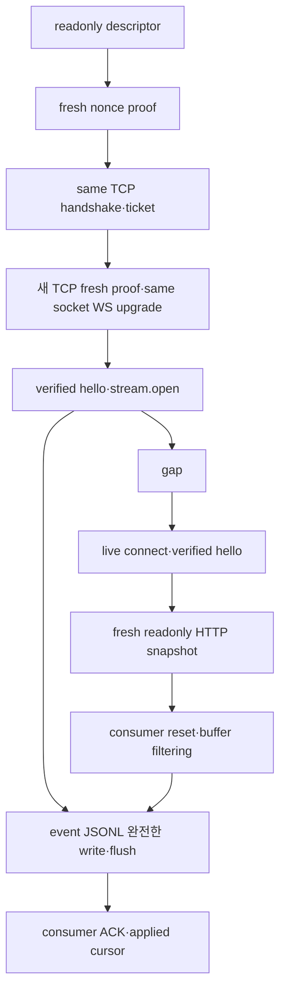

# Rust client와 aw CLI (047)

`workbench-client`는 기존 Workbench 서버에 연결하는 독립 Rust crate다. `aw-cli`의 `aw` binary는 이 crate의 호출·event port를 사용한다. 서버/Tauri/host/core는 production dependency가 아니다. 이번 완료 범위는 047 client/CLI이며 전체 HTTP/WS 서버·thin desktop 전환 완료와 구분한다.

## 실행

macOS 15.6.1 arm64에서 검증했다. macOS14+, 설치본·서명/notarization·update·desktop/TUI 동시 사용은 미검증이며 Linux/Windows는 이번 범위에서 제외한다.

```sh
cargo build -p aw-cli
target/debug/aw operations
target/debug/aw operations project.create
target/debug/aw project list --descriptor /private/path/workbench/server/server.json
target/debug/aw server status --descriptor /private/path/workbench/server/server.json
```

실제 existing server의 owner-only descriptor 경로를 지정한다. 경로 전체를 no-follow FD로 열고 owner/mode/type/link/size, literal loopback URL, identity/epoch/protocol/schema를 검증한다. missing server는 unavailable이다. CLI는 daemon을 자동 시작하거나 ensure/migrate/restore하지 않는다. token/ticket/prompt/goal은 argv로 전달하지 않는다. catalog 출력은 operation 계약 목록이며 production 활성화 증거가 아니다.

mutation은 첫 전송 전에 caller 전용 private retry state를 durable publish한다. 이 디렉터리는 서버 사용자 데이터/백업 대상 store와 분리하며 owner0700이 필요하다.

```sh
AW_CLI_STATE=$(mktemp -d /private/tmp/aw-cli-state.XXXXXX)
chmod 700 "$AW_CLI_STATE"
printf '%s' '{"name":"example","workingDirectory":"/private/example","description":null}' |
  target/debug/aw call project.create --input - \
    --descriptor /private/path/workbench/server/server.json \
    --state-dir "$AW_CLI_STATE" --idempotency-key example-create-1
```

input은 stdin `-`만 지원하며 EOF까지 최대1MiB/UTF8/typed schema를 검사한다. `--expected-revision N`은 필요한 mutation의 서버 precondition을 전달한다. state publication 실패는 command 전송0이다. 파일 fsync→rename→directory fsync를 사용하며 경계 오류 주입 시험은 실제 재부팅 durability 증거와 구분한다.

응답 유실/SIGINT/deadline 후 error의 `attempt.retryState`를 보존한다. 이후 명시적 재시도는 해당 파일만 사용한다.

```sh
target/debug/aw call --retry-state /private/caller-state/attempt.json \
  --descriptor /private/path/workbench/server/server.json
```

원 operation/input/key/request/instance/epoch를 유지한다. `--retry-state`와 input/key/revision/state-dir 변경은 거절한다. epoch/instance mismatch나 descriptor/auth/connect preflight 실패가 기존 Unknown/receipt를 NotApplied로 덮지 않는다. Applied/nonretryable fault 및 accepted/complete 결과는 완료 cache로 반환한다. retryable Unknown/NotApplied fault만 explicit retry 대상이다. 같은 state-dir에서 이미 완료한 key를 새로운 invocation의 최초 publish로 덮지 않는다. `--idempotency-key`만으로 이전 Unknown 작업의 identity를 복원했다고 주장하지 않는다. 자동 resubmit/서버 cancel은 없다.

## 출력과 종료 코드

finite 성공은 stdout JSON1개+newline, 실패는 stdout0/stderr JSON1개다. 성공 envelope는 `ok,data,requestId,revision?,replayed?`, 오류는 안전한 `error.code,outcome,retryable` 및 필요한 receipt만 포함한다. library는 full fault를 보존하지만 arbitrary private details/credential/panic payload를 console에 덤프하지 않는다.

| exit | 의미 |
|---|---|
| 0 | 성공 |
| 1 | internal |
| 2 | usage/schema/unsupported |
| 3 | auth/forbidden |
| 4 | not found |
| 5 | conflict/precondition |
| 6 | cancel rejected: 현재 RunCancel prerequisite 미충족으로 production 미검증/이연 |
| 7 | local deadline |
| 8 | unavailable/prerequisite unavailable |
| 9 | version/identity compatibility |
| 10 | interaction required |
| 130 | SIGINT local 종료 |

출력 채널이 broken/blocked이면 JSON 전달을 보장할 수 없으며 outputUnavailable(exit8)로 bounded 종료한다. argv·signal 초기화 오류 출력은1초, 그 이후 finite 출력은 request timeout으로 제한한다.

exit만으로 서버 작업의 Applied/Unknown/NotApplied를 추정하지 않는다. transport에 이미 제출한 작업은 외부 future drop에도 Unknown으로 남고 동일 identity의 explicit retry를 허용한다. local 종료가 원 서버 작업을 취소하지 않는다.

## 이벤트와 recovery

서버가 반환한 **eventStreamId**를 사용한다. `benchId`나 `workspaceId`로 주소를 조립하지 않는다.

```sh
printf '%s' '{"streamId":"orchestration:returned-binding-id","epoch":"verified-epoch","afterSequence":0}' |
  target/debug/aw events watch --input - \
    --descriptor /private/path/workbench/server/server.json
```

open 전 오류는 finite stderr JSON이다. 이후 stdout은 `stream.open`, `event`/`stream.reset`, 가능한 `stream.end`의 JSONL이다. newline까지 write_all 및 flush가 성공한 consumer completion만 ACK한다. 같은 revision의 서로 다른 sequence를 중복 제거하지 않는다. old owner/stream/epoch/generation completion은 cursor를 변경하지 못한다.



recovery snapshot은 fresh owner readonly bench.list→orchestration.get으로 반환 stream을 찾는다. 적용 cursor와 live boundary를 구분하며 저장 revision을 stream sequence로 사용하지 않는다. Bench notification snapshot은 비보존 신호임을 명시한다. reader/pending-send/channel/reducer/inflight는 같은 aggregate item/byte budget을 공유한다. 기본 body8MiB/input1MiB/frame·message1MiB/queue256·8MiB, recovery5회/backoff250ms..10s다. hello만으로 retry budget을 초기화하지 않고 완전한 snapshot/reset Live 성공 또는 Live delivery ACK에서 새 budget을 시작한다. transient 연결 실패는 bounded 재연결하며 identity/protocol/auth는 terminal 정책이다. command는 자동 재시도하지 않는다.

SIGINT는 reader/socket/callback/snapshot task를 취소하고 bounded join한 뒤 가능한 최종 end를 쓴다. broken/partial output은 ACK 없이 sink를 retire하며 end를 부분 JSON에 덧붙이지 않는다. pipe/socket/TTY는 nonblocking readiness로 쓰고 원 공유 FD flags를 Drop/취소/registration 실패에서도 복구한다. `/dev/null`은 kqueue 비등록 discard 경로다. unknown character device는 거절한다. regular file의64KiB syscall cap은 byte cap이며 syscall 시간 상한을 보장하지 않는다.

## Production gate 및 인계

현재 owner readonly와 source 확인된 비실행 closed operation만 허용한다. run start/watch/cancel, orchestration recover, agent/terminal/Git/helper·server ensure/stop·migration/freeze/restore는 필요한045/046 등의 proof 없이 활성화하지 않는다. 편의 명령과 generic call/watch는 같은 gate를 적용한다. typed cancel input은 준비돼 있지만 현재 explicit/generic 모두 prerequisiteUnavailable이다.

045/046 보완, TUI/MCP, macOS production process containment, backup/restore, CALVER signed/notarized package/update, desktop business fallback 제거는 후속 미완료다. 047 완료 후 해당 구현을 시작하지 않는다. 종료·재개 기록은 `docs/047-completion-handoff.md`에 남긴다.

## 검증

```sh
cargo test -p workbench-client -p aw-cli
cargo clippy -p workbench-client -p aw-cli --all-targets -- -D warnings
scripts/test-workbench-client-wire.sh
```

마지막 script는 exact merged044 `20fcd5fdcf633ae06792d51a9b963e3857909440` archive의 실제 서버를 별도 directory에 locked build하고 binary/archive/lock SHA를 남긴 뒤 ignored actual_server 시험을 명시적으로 실행한다. 기존 daemon/user root를 쓰지 않는다. private fixture에서 project CRUD/same-key replay, empty Main bootstrap, 실제 CLI와 독립 Rust consumer의 두 recover event/ACK/snapshot을 대조한다. test-only empty recover authority는 production client에 포함되지 않는다.

시험용 seatbelt의 private sentinel 성공/home 권한 거절/fork 거절 대조 및 process guard의 startup/cancel/panic/error kill·bounded wait/reap는 045 production containment proof가 아니다. actual `server.status`의 acceptedCalls1은 조회 자신을 포함하며 다른 accepted call0·business reservation0과 구분한다. 상세 실행 명령/개수/exit/실패·수정/남은 gate는 [047 validation](../specs/047-rust-client-cli/validation.md)에 기록한다.
