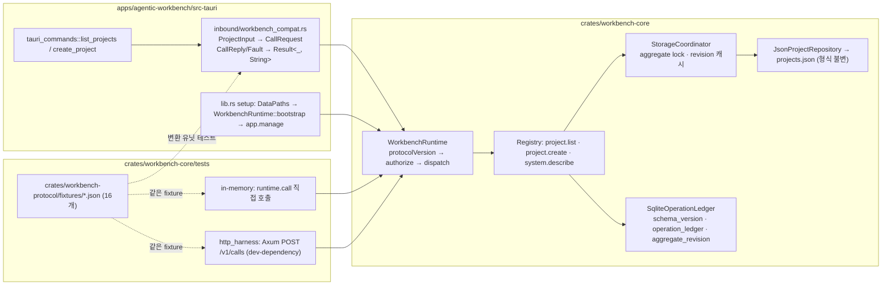
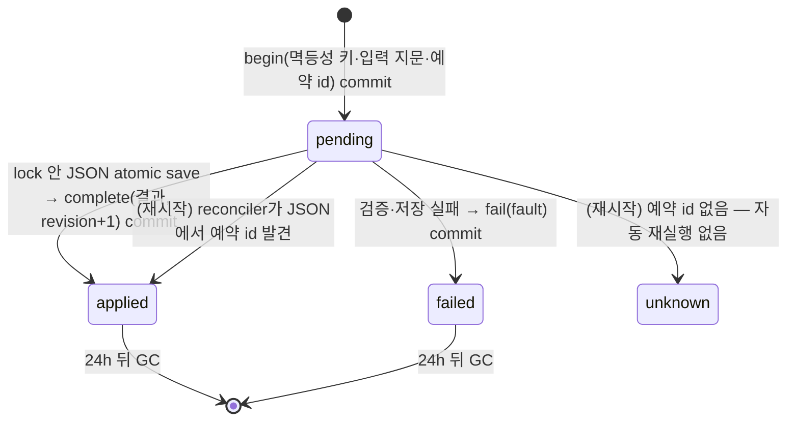
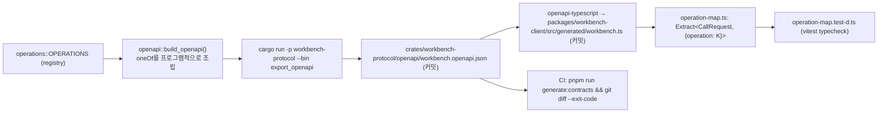

# Workbench Seam (서버-클라이언트 전환 1a)

> 상태: 2026-09-26 구현 완료(`specs/037-workbench-seam`). 정본 설계는 [서버-클라이언트 전환 조사](client-server-architecture-research.md)이며, 이 문서는 그 1단계 첫 세로 slice가 실제 코드에서 어떻게 성립했는지와 이후 단계가 따를 규칙을 기록한다.

## 범위

- `crates/workbench-protocol`: wire 계약 — `CallRequest`/`CallReply`/`WorkbenchFault`, principal·scope, operation descriptor, OpenAPI 3.1 생성.
- `crates/workbench-core`: `Workbench` 구현 — operation registry, authorization, 멱등성, `StorageCoordinator`, SQLite operation ledger, 프로젝트 도메인(AW에서 이동).
- `apps/agentic-workbench/src-tauri`: `list_projects`/`create_project` Tauri command가 `Workbench.call`을 쓰는 호환 어댑터가 됨. `update_project`/`delete_project`는 같은 lock·repository로 저장 배선만 조정.
- `packages/workbench-client`: 생성 타입(`src/generated/workbench.ts`)과 조건부 타입 `OperationMap`. 아직 어떤 앱도 import하지 않는다.

## 비범위

프론트엔드 통신 방식(여전히 Tauri `invoke`), 나머지 Tauri command 69개(038), 이벤트 봉투·구독(2단계), 운영 HTTP/WS 노출과 토큰(3단계), Desktop 전환(4단계), daemon(5단계 이후).

## 세 호출 경로와 Seam

세 경로는 같은 `AuthenticatedPrincipal`·`CallRequest`를 `WorkbenchRuntime::call`에 넘기고 같은 `CallReply`/`WorkbenchFault`를 받는다. contract suite(`tests/contract_suite.rs`)가 fixture마다 in-memory와 HTTP 결과를 서로 비교한다.

## 호출 규칙

| 항목 | 규칙 |
|---|---|
| `protocolVersion` | 1만 허용. 다른 값은 `unsupportedProtocol`(HTTP 409) |
| 미존재 operation | `notFound`. 존재하지만 scope 부족 → `forbidden`. 둘 다 `system.describe` 목록에 없다 |
| 입력 검증 | typed 역직렬화(`deny_unknown_fields`) 통과 후에만 handler로. 실패는 `invalidArgument` |
| `requestId` / `idempotencyKey` | 별개. 전자는 시도별, 후자는 mutation 재시도에만 재사용. command는 키 필수 |
| query | ledger를 거치지 않지만 **aggregate lock은 잡는다**(복구 쓰기와 직렬화) |
| 오류 message | 사람이 읽는 한 문장. Tauri 호환 어댑터는 이 문자열만 화면에 돌려준다 |

principal은 037에서 두 종류다: 데스크톱(`project:read`·`project:write`·`system:describe`)과 테스트용 조회 전용. 입력으로 정체를 지정할 수 없다.

## intent-first 변경과 ledger

`project.create`는 부작용 전에 의도를 남기고, 적용 뒤 결과를 확정한다. 프로젝트(JSON)와 ledger(SQLite)는 한 트랜잭션이 아니므로 **순서**가 계약이다.

같은 키 재요청의 응답:

| 기존 상태 | 지문 동일 | 응답 |
|---|---|---|
| 없음 | — | 새 실행 |
| `applied` | 예 | 저장된 결과·revision 그대로 |
| `applied` | 아니오 | `conflict`, outcome `applied` |
| `failed` | 예 | 저장된 Fault |
| `failed` | 아니오 | `conflict`, outcome `notApplied` |
| `pending` | 무관 | `conflict`, outcome `unknown`, retryable |
| `unknown` | 무관 | `conflict`, outcome `unknown`, not retryable |

지문은 정규화(trim)된 입력의 canonical JSON(키 정렬) SHA-256이다. `" AW "`와 `"AW"`는 같은 지문이다.

### revision과 복구 — 설계 리뷰 반영

- **revision의 정본은 `aggregate_revision` 테이블**이다. `applied` 전이와 같은 SQLite 트랜잭션에서 +1 하고, TTL GC가 ledger row를 지워도 유지된다. ledger의 `MAX(revision)`으로 유도하면 GC 뒤 재시작에서 0으로 되돌아가 stale `expectedRevision`이 통과한다.
- **읽기 경로는 저장 파일에 쓰지 않는다.** `json_store::load`는 손상 시 오류만 내고, `.bak` 복구(`recover_from_backup::<T>`, temp+rename)는 `StorageCoordinator`가 aggregate lock을 잡은 채로만 수행한다. 그래서 손상을 발견한 조회가 동시에 진행된 생성 결과를 덮어쓸 수 없다. 복구 검증은 `load`와 같은 문서 타입으로 한다 — `serde_json::Value`로 보면 필드가 빠진 파일을 정상으로 오판한다. AW 원본 `json_store.rs`는 읽기 경로에서 `fs::copy`로 복구하므로 038에서 저장소를 옮길 때 같은 분리를 적용한다.
- **저장 뒤 확정 실패는 `unknown`이다.** JSON 저장 후 ledger `complete`가 실패하면 row를 `pending`으로 남기고 `outcome: unknown`으로 응답한다. `failed`로 닫으면 저장된 프로젝트가 "적용 안 됨"으로 영구 기록되어 재시도가 거짓 실패를 재생하고 새 키로 중복이 생긴다. 다음 기동의 reconciler가 `applied`로 확정한다.
- **generic `CallReply.output`은 임의 JSON이다.** `project.list`가 배열을 돌려주므로 200 응답 스키마의 `output`에 `type: object`를 두지 않는다. operation별 typed 결과는 `CallReplyByOperation`이 제공한다.

## 계약 생성과 drift 검사

- `pnpm run generate:contracts`가 두 생성물을 다시 만든다. 계약을 바꾸면 반드시 실행해 커밋한다.
- Rust 쪽 golden test(`openapi.rs::committed_openapi_matches_registry`)도 커밋 파일과 코드를 비교한다.
- `discriminator` object를 쓰지 않고 variant마다 `operation` 단일값 `enum`을 둔다. `openapi-typescript`가 이를 판별 union으로 읽는다.

## 검증

- `cargo test -p workbench-protocol -p workbench-core -p agentic-workbench`: contract suite(fixture 16개 × in-memory·HTTP), crash point 3지점, 동시 20건, GC 뒤 revision 연속, 손상 복구 lock, compat 변환.
- `pnpm --filter @yoophi/workbench-client check-types test`: `OperationMap` 상관 타입과 `@ts-expect-error`.
- 수동: 앱에서 프로젝트 목록·생성이 이전과 같고, 이름 누락 시 문구가 `Project name is required.`이며, `<app data dir>/workbench/ledger.sqlite`에 `applied` row가 남는다. 절차는 `specs/037-workbench-seam/quickstart.md`.

## 038 이후 이관 절차 (도메인 이동 템플릿)

037이 프로젝트 도메인에 한 순서를 도메인마다 반복한다.

1. `domain/*.rs`, `application/*_service.rs`, port를 `workbench-core`로 이동하고 오류를 `String`에서 enum으로 바꾼다. `Display`는 기존 문구를 유지한다.
2. `Json*Repository::from_app(&AppHandle)`을 `new(&DataPaths)`로 바꾸고 `load`(읽기 전용)/`recover_from_backup`(lock 안)을 분리한다.
3. `workbench-protocol/operations/`에 input/output 타입과 `OPERATIONS` 항목을 추가한다. 스키마는 `schema_for`에.
4. handler를 만들고 `build_registry`에 등록한다. mutation은 `project_create.rs`의 intent-first 순서를 따른다.
5. fixture를 추가하고 contract suite로 세 경로를 검증한다.
6. Tauri command를 `workbench_compat` 경유로 바꾸고, 이동한 AW 파일을 삭제한다.
7. `pnpm run generate:contracts`로 생성물을 갱신해 커밋한다.

## 완료 기준

spec의 SC-001~SC-006이 모두 테스트 또는 수동 절차로 확인되었고, 프론트엔드 `apps/agentic-workbench/src/**` 변경이 0건이며, CI에 drift 검사 단계가 있다.
