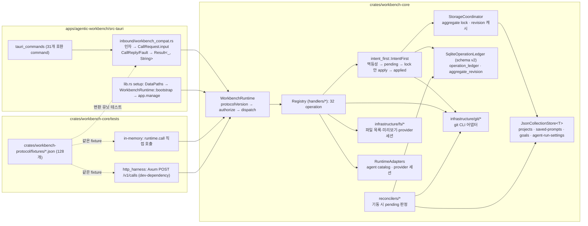
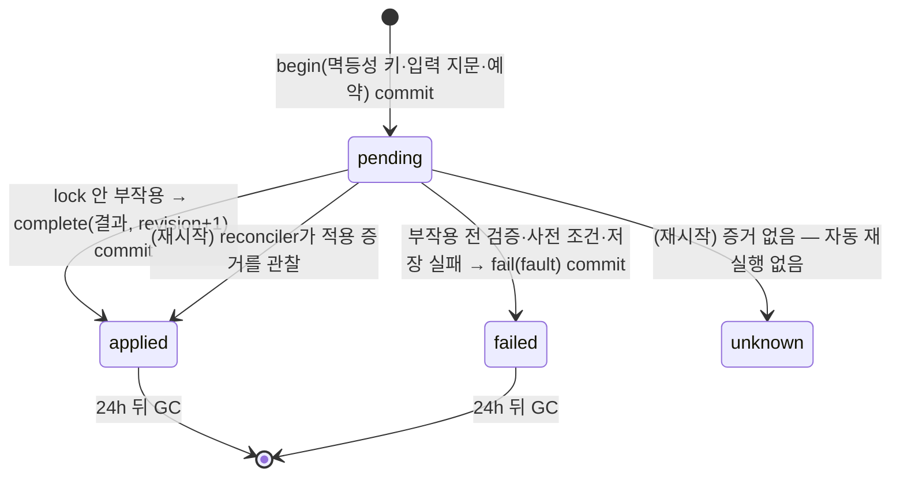
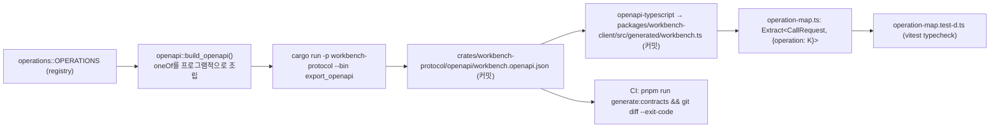

# Workbench Seam (서버-클라이언트 전환 1단계)

> 상태: 037·038 구현 완료(`specs/037-workbench-seam` 2026-09-26, `specs/038-workbench-domains` 2026-09-27). 정본 설계는 [서버-클라이언트 전환 조사](client-server-architecture-research.md)이며, 이 문서는 1단계(1a Seam, 1b 도메인 이관)가 실제 코드에서 어떻게 성립했는지와 이후 단계가 따를 규칙을 기록한다.

## 범위

- `crates/workbench-protocol`: wire 계약 — `CallRequest`/`CallReply`/`WorkbenchFault`, principal·scope, operation descriptor, OpenAPI 3.1 생성. operation **32개**.
- `crates/workbench-core`: `Workbench` 구현 — operation registry, authorization, 멱등성, intent-first runner, 재시작 판정(reconciler), `StorageCoordinator`, SQLite operation ledger, 그리고 AW에서 옮겨 온 도메인·서비스·어댑터.
- `apps/agentic-workbench/src-tauri`: Tauri command **31개**가 `Workbench.call`을 쓰는 호환 어댑터다(`inbound/workbench_compat.rs`). 옮긴 도메인의 코드는 AW에 남아 있지 않다.
- `packages/workbench-client`: 생성 타입(`src/generated/workbench.ts`)과 조건부 타입 `OperationMap`. 아직 어떤 앱도 import하지 않는다.

038이 옮긴 도메인과 operation(29개):

| 도메인 | operation | 저장·부작용 |
|---|---|---|
| 프로젝트 | `project.update` · `project.delete` | `projects.json` |
| saved prompt | `savedPrompt.list` · `create` · `update` · `delete` | `saved-prompts.json` |
| goal | `goal.get` · `create` · `update` · `clear` · `recordProgress` | `goals.json` |
| agent 실행 설정 | `agentRunSettings.get` · `save` | `agent-run-settings.json` |
| Git(저장소 단위) | `git.listRemotes` · `listBranches` · `listWorktrees` · `createWorktree` · `deleteWorktree` | 사용자 저장소(생성·삭제는 외부 부작용) |
| worktree(체크아웃 디렉터리 단위) | `worktree.listChanges` · `getChanges` · `getFileDiff` · `listFiles` · `readTextFile` · `listHistory` · `getGraph` · `getCommitDetail` · `getCommitFileDiff` | 사용자 저장소·파일시스템(읽기) |
| agent | `agent.list` · `agent.listProviderSessions` | 실행 환경(환경 변수 catalog, provider 로컬 파일) |

## 비범위

프론트엔드 통신 방식(여전히 Tauri `invoke`), **이벤트·창 정체에 묶인 command 32개**(run 8·exchange 4·orchestration 18·watcher 2 — 2단계, [ADR 0001](adr/0001-defer-event-bound-commands-to-stage-2.md)), **데스크톱 표현 상태 command 8개**(글꼴·layout·창 열기·외부 URL — 데스크톱에 유지), 이벤트 봉투·구독(2단계), 운영 HTTP/WS 노출과 토큰(3단계), Desktop 전환(4단계), daemon(5단계 이후). 전체 목록은 아래 [command 인벤토리](#command-인벤토리-71).

## 세 호출 경로와 Seam

```mermaid
flowchart LR
    subgraph AW["apps/agentic-workbench/src-tauri"]
        TC["tauri_commands (31개 호환 command)"]
        Compat["inbound/workbench_compat.rs<br/>인자 → CallRequest.input<br/>CallReply/Fault → Result&lt;_, String&gt;"]
        Setup["lib.rs setup: DataPaths → WorkbenchRuntime::bootstrap → app.manage"]
    end
    subgraph Core["crates/workbench-core"]
        RT["WorkbenchRuntime<br/>protocolVersion → authorize → dispatch"]
        Reg["Registry (handlers/*): 32 operation"]
        IF["intent_first::IntentFirst<br/>멱등성 → pending → lock 안 apply → applied"]
        Rec["reconcilers/*<br/>기동 시 pending 판정"]
        Coord["StorageCoordinator<br/>aggregate lock · revision 캐시"]
        Ledger["SqliteOperationLedger (schema v2)<br/>operation_ledger · aggregate_revision"]
        JSON["JsonCollectionStore&lt;T&gt;<br/>projects · saved-prompts · goals · agent-run-settings"]
        Git["infrastructure/git/*<br/>git CLI 어댑터"]
        FS["infrastructure/fs/*<br/>파일 목록·미리보기·provider 세션"]
        Ad["RuntimeAdapters<br/>agent catalog · provider 세션"]
    end
    subgraph Tests["crates/workbench-core/tests"]
        Mem["in-memory: runtime.call 직접 호출"]
        HTTP["http_harness: Axum POST /v1/calls (dev-dependency)"]
        Fx["crates/workbench-protocol/fixtures/*.json (128개)"]
    end
    TC --> Compat --> RT
    Setup --> RT
    Mem --> RT
    HTTP --> RT
    RT --> Reg
    Reg --> IF --> Coord --> JSON
    IF --> Ledger
    IF --> Git
    Reg --> Git
    Reg --> FS
    Reg --> Ad
    Rec --> Ledger
    Rec --> JSON
    Rec --> Git
    Fx -.같은 fixture.-> Mem
    Fx -.같은 fixture.-> HTTP
    Fx -.변환 유닛 테스트.-> Compat
```

세 경로는 같은 `AuthenticatedPrincipal`·`CallRequest`를 `WorkbenchRuntime::call`에 넘기고 같은 `CallReply`/`WorkbenchFault`를 받는다. contract suite(`tests/contract_suite.rs`)가 fixture마다 in-memory와 HTTP 결과를 서로 비교한다. Git fixture는 경로마다 결정적인 임시 저장소를 만들고(`seed.gitRepo`, 고정 author·날짜 → 같은 커밋 해시), 비교 전 저장소 경로를 자리표시자로 되돌린다.

## 호출 규칙

| 항목 | 규칙 |
|---|---|
| `protocolVersion` | 1만 허용. 다른 값은 `unsupportedProtocol`(HTTP 409) |
| 미존재 operation | `notFound`. 존재하지만 scope 부족 → `forbidden`. 둘 다 `system.describe` 목록에 없다 |
| 입력 검증 | typed 역직렬화 통과 후에만 handler로. 최상위 input만 `deny_unknown_fields`(중첩 객체는 허용). 실패는 `invalidArgument` |
| `requestId` / `idempotencyKey` | 별개. 전자는 시도별, 후자는 mutation 재시도에만 재사용. command는 키 필수, query에 키를 보내면 `invalidArgument` |
| 저장 단위를 읽는 query | ledger를 거치지 않지만 **aggregate lock은 잡는다**(복구 쓰기와 직렬화) |
| Git·파일·agent query | lock 없이 blocking pool에서 실행(사용자 저장소는 외부 프로세스도 바꾸므로 lock이 정합성을 보장하지 못한다) |
| `expectedRevision` | 저장 단위 변경만. Git 변경에 보내면 `invalidArgument` |
| 오류 message | 사람이 읽는 한 문장. Tauri 호환 어댑터는 이 문자열만 화면에 돌려준다. Git이 비정상 종료하면 Git이 낸 문장 그대로(`internal`, 해석하지 않음) |

principal은 두 종류다: 데스크톱(scope 13개 전부)과 테스트용 조회 전용(`*:read`·`system:describe`). scope는 도메인별 조회/변경(`project`·`savedPrompt`·`goal`·`agentRunSettings`·`git`)과 조회 전용(`worktree:read`·`agent:read`)이다. 입력으로 정체를 지정할 수 없다. `system.describe`는 데스크톱에 32개, 조회 전용에 19개를 보여 준다.

## intent-first 변경과 ledger

변경 13개(`project.create` 포함)는 부작용 전에 의도를 남기고, 적용 뒤 결과를 확정한다. 저장 파일·사용자 저장소와 ledger(SQLite)는 한 트랜잭션이 아니므로 **순서**가 계약이다. 절차는 `application/intent_first.rs`의 `IntentFirst::run` 하나이고, 각 handler는 `MutationSpec`(aggregate, 예약 정책, lock 안 부작용, 오류 매핑)만 채운다.

```mermaid
stateDiagram-v2
    [*] --> pending : begin(멱등성 키·입력 지문·예약) commit
    pending --> applied : lock 안 부작용 → complete(결과, revision+1) commit
    pending --> failed : 부작용 전 검증·사전 조건·저장 실패 → fail(fault) commit
    pending --> applied : (재시작) reconciler가 적용 증거를 관찰
    pending --> unknown : (재시작) 증거 없음 — 자동 재실행 없음
    applied --> [*] : 24h 뒤 GC
    failed --> [*] : 24h 뒤 GC
```

같은 키 재요청의 응답:

| 기존 상태 | 지문 동일 | 응답 |
|---|---|---|
| 없음 | — | 새 실행 |
| `applied` | 예 | 저장된 결과·revision 그대로(Git 변경은 revision 없음) |
| `applied` | 아니오 | `conflict`, outcome `applied` |
| `failed` | 예 | 저장된 Fault |
| `failed` | 아니오 | `conflict`, outcome `notApplied` |
| `pending` | 무관 | `conflict`, outcome `unknown`, retryable |
| `unknown` | 무관 | `conflict`, outcome `unknown`, not retryable |

지문은 정규화(trim)된 입력의 canonical JSON(키 정렬) SHA-256이다. `" AW "`와 `"AW"`는 같은 지문이다. `git.createWorktree`는 기본 branch·경로를 채우기 **전**의 입력으로 지문을 만든다(기본 branch 이름이 시각에서 만들어지므로).

### 저장 단위(aggregate)

| aggregate | 대상 | revision |
|---|---|---|
| `projects` · `saved-prompts` · `goals` · `agent-run-settings` | 저장 파일 하나 | 각자 독립. 응답과 `expectedRevision`에 쓰인다 |
| `git-worktrees:<canonical repo root>` | 한 사용자 저장소의 worktree 생성·삭제 | 응답에 싣지 않는다. 같은 저장소 안에서만 직렬화 |

### ledger schema v2 — 예약 수명

예약(`reserved_resource_id`)은 두 역할을 한다: 같은 자원에 대한 **동시 진행 배제**와 재시작 판정의 **증거**. v2는 unique index를 `state = 'pending'`인 행에만 걸어, 배제는 진행 중에만 두고 증거(값)는 남긴다. 037이 만든 v1 파일은 첫 기동에서 자동 승격된다(행 데이터 불변).

| 상태 | 예약 배타 | 근거 |
|---|---|---|
| `pending` | 유지 | 같은 자원의 두 실행이 동시에 부작용을 내면 안 됨 |
| `applied` | 해제 | 같은 자원의 다음 변경(삭제 뒤 재생성 등)은 새 실행 |
| `failed` | 해제 | 부작용 없음. 같은 자원으로 새 키 재시도는 정당 |
| `unknown` | 해제 | 어느 쪽이든 새 실행을 막을 이유가 없음 |

| operation | 예약 값 | 충돌(다른 `pending`이 잡음) 시 |
|---|---|---|
| `project.create` · `savedPrompt.create` | 서버가 만든 새 id | 새 id로 최대 3회 재시도 |
| `project.delete` · `savedPrompt.delete` · `goal.clear` | 대상 id(`goal.clear`는 `workingDirectory`) | `conflict` outcome `unknown`, retryable |
| `git.createWorktree` · `git.deleteWorktree` | 해석된 worktree 절대 경로 | `conflict` outcome `unknown`, retryable("Another change to this worktree path is still in progress.") |
| upsert(`goal.create` · `agentRunSettings.save`)·수정 | 없음 | — |

### 재시작 판정 규칙

기동 시 `pending` 기록마다 operation에 등록된 reconciler에게 묻는다(`application/reconcilers/`). 자동 재실행은 없다.

| operation | `applied` 조건 | 규칙 |
|---|---|---|
| `project.create` · `savedPrompt.create` | 예약 id가 파일에 있음 | 예약 증거(이 실행만 만들 수 있는 id) |
| `project.delete` · `savedPrompt.delete` · `goal.clear` | 대상이 파일에 없음 | 종료 상태 |
| `git.createWorktree` | 경로가 `git worktree list`에 있음 | 종료 상태([ADR](../crates/workbench-core/docs/adr/0001-end-state-reconciliation-for-external-side-effects.md)) |
| `git.deleteWorktree` | 경로가 목록에 없음(저장소를 읽을 수 없으면 `unknown`) | 종료 상태 |
| upsert 2개 · 수정 4개 | — | 관찰로 구별 불가 → 항상 `unknown` |

디렉터리만 생기고 Git 등록이 안 된 부분 상태는 `unknown`이며, 시스템은 그것을 정리하거나 다시 만들지 않는다.

### revision과 복구 — 설계 리뷰 반영

- **revision의 정본은 `aggregate_revision` 테이블**이다. `applied` 전이와 같은 SQLite 트랜잭션에서 +1 하고, TTL GC가 ledger row를 지워도 유지된다. ledger의 `MAX(revision)`으로 유도하면 GC 뒤 재시작에서 0으로 되돌아가 stale `expectedRevision`이 통과한다.
- **읽기 경로는 저장 파일에 쓰지 않는다.** `JsonCollectionStore::load`는 손상 시 오류만 내고, `.bak` 복구(`recover_from_backup::<T>`, temp+rename)는 `StorageCoordinator::with_aggregate`가 lock을 잡은 채로만 수행한다(손상 → 복구 → 한 번 재시도). 복구 검증은 `load`와 같은 문서 타입으로 한다. 저장 단위 4개 모두 이 경로만 쓴다.
- **저장 뒤 확정 실패는 `unknown`이다.** 부작용 뒤 ledger `complete`가 실패하면 row를 `pending`으로 남기고 `outcome: unknown`으로 응답한다. 다음 기동의 reconciler가 판정한다.
- **generic `CallReply.output`은 임의 JSON이다.** 목록·`null`·단일 객체가 섞이므로 200 응답 스키마의 `output`에 타입을 두지 않는다. operation별 typed 결과는 `CallReplyByOperation`이 제공한다.

### Git·파일 오류 분류

Git이 낸 오류 문장은 해석하지 않고 사전 검증만 분류한다(grill Q5, [ADR 0002](adr/0002-git-adapters-live-in-workbench-core.md)).

| 상황 | FaultCode |
|---|---|
| 필수 입력 공백(`Working directory is required.` 등) | `invalidArgument` |
| worktree 밖 경로(`File path must stay inside the worktree.`) | `forbidden` |
| 디렉터리 아님·일반 파일 아님·경로 없음·삭제 대상 worktree 없음 | `notFound` |
| 삭제 전 검사 실패(변경 있음·상태 미확정) | `preconditionFailed`, outcome `notApplied` |
| git 실행 파일 없음 | `unavailable`, retryable |
| git 비정상 종료·기타 실행 실패 | `internal`, 문장 그대로 |

저장소가 아닌 디렉터리에 대한 원격·브랜치·worktree 목록은 오늘처럼 빈 목록이다.

## 계약 생성과 drift 검사

```mermaid
flowchart LR
    Reg["operations::OPERATIONS (registry)"] --> OAS["openapi::build_openapi()<br/>oneOf를 프로그램적으로 조립"]
    OAS --> Bin["cargo run -p workbench-protocol --bin export_openapi"]
    Bin --> JSON["crates/workbench-protocol/openapi/workbench.openapi.json (커밋)"]
    JSON --> TS["openapi-typescript → packages/workbench-client/src/generated/workbench.ts (커밋)"]
    TS --> Map["operation-map.ts: Extract&lt;CallRequest, {operation: K}&gt;"]
    Map --> TD["operation-map.test-d.ts (vitest typecheck)"]
    JSON --> CI["CI: pnpm run generate:contracts && git diff --exit-code"]
```

- `pnpm run generate:contracts`가 두 생성물을 다시 만든다. 계약을 바꾸면 반드시 실행해 커밋한다.
- Rust 쪽 golden test(`openapi.rs::committed_openapi_matches_registry`)도 커밋 파일과 코드를 비교한다.
- `discriminator` object를 쓰지 않고 variant마다 `operation` 단일값 `enum`을 둔다. `openapi-typescript`가 이를 판별 union으로 읽는다.
- 도메인 타입은 protocol에 **DTO 미러**로 정의되고 core `application/*dto.rs`가 변환한다. 원본 타입의 serde JSON과 DTO JSON이 같음을 wire parity 테스트가 도메인마다 고정한다.

## 검증

- `cargo test -p workbench-protocol -p workbench-core -p agentic-workbench`: contract suite(fixture 128개 × in-memory·HTTP), 저장 단위별 crash point·동시성·GC 뒤 revision·손상 복구, Git 종료 상태 판정(`git_reconcile.rs`), 예약 수명(`reservation_lifecycle.rs`), compat 변환(fixture 입력 대조).
- `pnpm --filter @yoophi/workbench-client check-types test`: `OperationMap` 32키 상관 타입과 `@ts-expect-error`.
- 수동: `specs/038-workbench-domains/quickstart.md` §4(프로젝트·saved prompt·goal·설정·Git·worktree·agent 화면이 이전과 같고, ledger가 schema 2로 승격됨).

## 적용된 이관 절차 (038)

037의 템플릿을 도메인마다 반복했고, 038에서 다음이 공통 부품이 되었다.

1. 도메인·서비스·포트·어댑터를 `workbench-core`로 이동하고 오류를 `String`에서 enum으로 바꾼다. `Display`는 기존 문구를 바이트 단위로 유지한다(골든 테스트).
2. 저장 파일은 `JsonCollectionStore<T>` 위의 repository로 만들고 `Repositories`에 넣는다. aggregate 이름을 `STORE_AGGREGATES`에 추가해 revision을 복원한다.
3. `workbench-protocol/operations/`에 input(최상위 `deny_unknown_fields`)·DTO와 `OPERATIONS` 항목, `schema_for`, `openapi.rs`의 component·이름을 추가한다.
4. handler: 조회는 `query_handler`(lock 없음) 또는 aggregate lock 안 읽기, 변경은 `MutationSpec` + `IntentFirst::run`. 예약 정책과 reconciler를 함께 등록한다(`build_registry`).
5. DTO 변환과 wire parity 테스트, fixture(성공·실패, 변경은 재생·충돌·키 누락·stale revision)를 추가한다.
6. Tauri command를 `workbench_compat` 경유로 바꾸고(`Option::None`은 필드 생략, 서버 기본값 = 오늘의 command 기본값), 이동한 AW 파일을 삭제한다.
7. `pnpm run generate:contracts`로 생성물을 갱신해 커밋한다.

실행 환경을 읽는 어댑터(agent catalog, provider 세션)는 `RuntimeAdapters`로 주입한다. 테스트는 stub을 넣어 실제 환경 변수·홈 디렉터리를 읽지 않는다.

### 039(2단계) 이관 안내

남은 이연 32개는 창 label로 소유자를 정하고 Tauri 이벤트로 결과를 흘린다. 2단계는 먼저 정본의 이벤트 봉투(`Workbench::events`)와 소유자 식별자(`window_label` 분해)를 정한 뒤, run → exchange → orchestration → watcher 순으로 같은 절차를 적용한다. orchestration의 조회 2개도 도메인을 쪼개지 않도록 함께 옮긴다([ADR 0001](adr/0001-defer-event-bound-commands-to-stage-2.md)).

## command 인벤토리 (71)

연번은 `lib.rs` `generate_handler!` 등록 순서다. 합계: 이관됨 31(037 2 + 038 29), 2단계로 이연 32, 데스크톱 유지 8.

| # | command | 분류 | operation / 이유 |
|---|---|---|---|
| 1 | `list_projects` | 이관됨(037) | `project.list` |
| 2 | `create_project` | 이관됨(037) | `project.create` |
| 3 | `update_project` | 이관됨(038) | `project.update` |
| 4 | `delete_project` | 이관됨(038) | `project.delete` |
| 5 | `list_saved_prompts` | 이관됨(038) | `savedPrompt.list` |
| 6 | `create_saved_prompt` | 이관됨(038) | `savedPrompt.create` |
| 7 | `update_saved_prompt` | 이관됨(038) | `savedPrompt.update` |
| 8 | `delete_saved_prompt` | 이관됨(038) | `savedPrompt.delete` |
| 9 | `get_goal` | 이관됨(038) | `goal.get` |
| 10 | `create_goal` | 이관됨(038) | `goal.create` |
| 11 | `update_goal` | 이관됨(038) | `goal.update` |
| 12 | `clear_goal` | 이관됨(038) | `goal.clear` |
| 13 | `record_goal_progress` | 이관됨(038) | `goal.recordProgress` |
| 14 | `get_agent_run_settings` | 이관됨(038) | `agentRunSettings.get` |
| 15 | `save_agent_run_settings` | 이관됨(038) | `agentRunSettings.save` |
| 16 | `get_appearance_preferences` | 데스크톱 유지 | 클라이언트별 표현 상태(정본 배치표) |
| 17 | `set_font_size_step` | 데스크톱 유지 | 클라이언트별 표현 상태 |
| 18 | `adjust_font_size_step` | 데스크톱 유지 | 클라이언트별 표현 상태 |
| 19 | `get_worktree_workspace_layout` | 데스크톱 유지 | panel layout은 클라이언트별 표현 상태 |
| 20 | `save_worktree_workspace_layout` | 데스크톱 유지 | panel layout은 클라이언트별 표현 상태 |
| 21 | `list_git_remotes` | 이관됨(038) | `git.listRemotes` |
| 22 | `list_git_branches` | 이관됨(038) | `git.listBranches` |
| 23 | `list_git_worktrees` | 이관됨(038) | `git.listWorktrees` |
| 24 | `list_worktree_changes` | 이관됨(038) | `worktree.listChanges` |
| 25 | `create_git_worktree` | 이관됨(038) | `git.createWorktree` |
| 26 | `delete_git_worktree` | 이관됨(038) | `git.deleteWorktree` |
| 27 | `get_worktree_changes` | 이관됨(038) | `worktree.getChanges` |
| 28 | `get_worktree_file_diff` | 이관됨(038) | `worktree.getFileDiff` |
| 29 | `list_worktree_files` | 이관됨(038) | `worktree.listFiles` |
| 30 | `read_worktree_text_file` | 이관됨(038) | `worktree.readTextFile` |
| 31 | `start_worktree_watcher` | 2단계로 이연 | 창 label로 이벤트 대상 결정, Tauri 이벤트 발행 |
| 32 | `stop_worktree_watcher` | 2단계로 이연 | 창 label로 watcher 소유 결정 |
| 33 | `list_worktree_git_history` | 이관됨(038) | `worktree.listHistory` |
| 34 | `get_worktree_git_graph` | 이관됨(038) | `worktree.getGraph` |
| 35 | `get_worktree_commit_detail` | 이관됨(038) | `worktree.getCommitDetail` |
| 36 | `get_worktree_commit_file_diff` | 이관됨(038) | `worktree.getCommitFileDiff` |
| 37 | `list_agents` | 이관됨(038) | `agent.list` |
| 38 | `list_agent_tool_command_candidates` | 2단계로 이연 | `window.label()`로 소유 run 결정(run 도메인) |
| 39 | `list_provider_sessions` | 이관됨(038) | `agent.listProviderSessions` |
| 40 | `open_external_url` | 데스크톱 유지 | OS 셸(정본 배치표) |
| 41 | `open_worktree_window` | 데스크톱 유지 | 네이티브 창 |
| 42 | `open_settings_window` | 데스크톱 유지 | 네이티브 창 |
| 43 | `start_agent_run` | 2단계로 이연 | run 소유자 = 창 label, `TauriRunEventSink` |
| 44 | `cancel_agent_run` | 2단계로 이연 | run 소유자 = 창 label |
| 45 | `send_prompt_to_run` | 2단계로 이연 | run 소유자 = 창 label |
| 46 | `steer_prompt_to_run` | 2단계로 이연 | run 소유자 = 창 label |
| 47 | `cancel_current_prompt_and_send_to_run` | 2단계로 이연 | run 소유자 = 창 label |
| 48 | `set_run_permission_mode` | 2단계로 이연 | run 소유자 = 창 label |
| 49 | `respond_agent_permission` | 2단계로 이연 | 권한 요청은 run 이벤트 흐름의 일부 |
| 50 | `sync_agent_workspace` | 2단계로 이연 | 창 label 기반 workspace registry |
| 51 | `send_agent_exchange` | 2단계로 이연 | 창 label 기반 registry, 이벤트 발행 |
| 52 | `acknowledge_agent_exchange` | 2단계로 이연 | 창 label 기반 registry |
| 53 | `list_agent_exchanges` | 2단계로 이연 | exchange 도메인을 쪼개지 않음 |
| 54 | `bootstrap_orchestration_workspace` | 2단계로 이연 | 창 label·MCP 상태·메모리 journal 결합 |
| 55 | `list_recoverable_orchestration_workspaces` | 2단계로 이연 | 조회지만 orchestration 도메인을 쪼개지 않음 |
| 56 | `get_orchestration_workspace` | 2단계로 이연 | orchestration 도메인 |
| 57 | `bind_main_coordinator_run` | 2단계로 이연 | orchestration 도메인 |
| 58 | `delegate_orchestration_goal` | 2단계로 이연 | orchestration 도메인 |
| 59 | `adopt_manual_orchestration_child` | 2단계로 이연 | orchestration 도메인 |
| 60 | `list_orchestration_tasks` | 2단계로 이연 | orchestration 도메인 |
| 61 | `collect_orchestration_reports` | 2단계로 이연 | orchestration 도메인 |
| 62 | `set_orchestration_presentation` | 2단계로 이연 | orchestration 도메인 |
| 63 | `replay_orchestration_runtime_events` | 2단계로 이연 | 조회지만 메모리 journal에 결합 |
| 64 | `respond_orchestration_input` | 2단계로 이연 | orchestration 도메인 |
| 65 | `send_orchestration_child_command` | 2단계로 이연 | orchestration 도메인 |
| 66 | `cancel_orchestration_task` | 2단계로 이연 | orchestration 도메인 |
| 67 | `retry_orchestration_task` | 2단계로 이연 | orchestration 도메인 |
| 68 | `reassign_orchestration_task` | 2단계로 이연 | orchestration 도메인 |
| 69 | `handoff_orchestration_coordinator` | 2단계로 이연 | orchestration 도메인 |
| 70 | `dispatch_orchestration_prompt` | 2단계로 이연 | orchestration 도메인 |
| 71 | `recover_orchestration_workspace` | 2단계로 이연 | orchestration 도메인 |

## 결정 기록

- [ADR 0001 — 이벤트·창 정체에 묶인 command는 2단계로 이연](adr/0001-defer-event-bound-commands-to-stage-2.md)
- [ADR 0002 — Git 어댑터는 workbench-core에 둔다](adr/0002-git-adapters-live-in-workbench-core.md)
- [workbench-core ADR 0001 — 외부 부작용의 종료 상태 판정](../crates/workbench-core/docs/adr/0001-end-state-reconciliation-for-external-side-effects.md)

## 완료 기준

037·038 spec의 성공 기준이 테스트 또는 수동 절차로 확인되었고, 프론트엔드 `apps/agentic-workbench/src/**` 변경이 0건이며, `crates/git-core`·`crates/acp-agent-core` 변경이 0건이고, CI에 drift 검사 단계가 있다.
