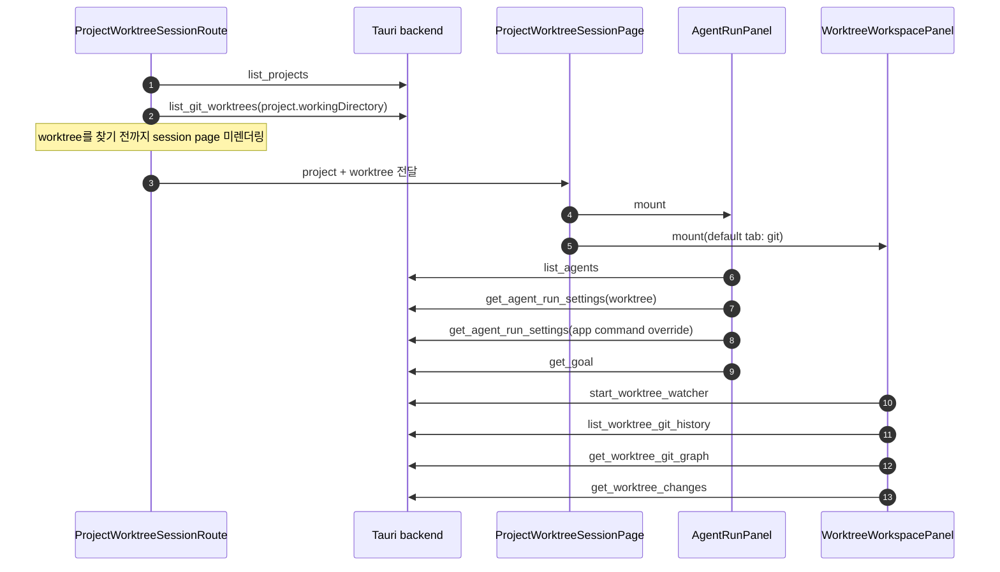
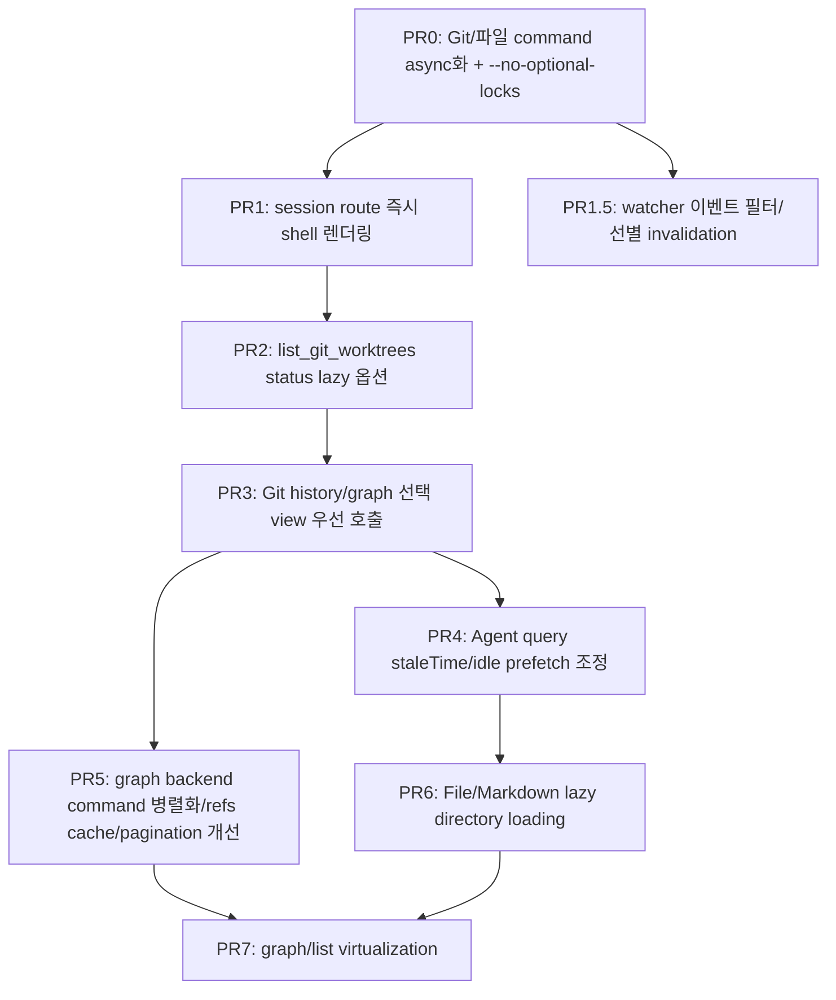

# Worktree Session 페이지 로딩 성능 점검

## 목적

`apps/agentic-workbench`의 worktree session 페이지는 진입 시 프로젝트, worktree, agent, Git 상태, Git history/graph 데이터를 짧은 시간 안에 함께 요청한다. 이 문서는 현재 코드 기준으로 초기 로딩을 늦출 수 있는 지점과 비동기 호출·지연 호출·캐시 전략으로 개선할 수 있는 후보를 식별한다.

범위는 다음 화면 흐름이다.

- `App.tsx`의 `ProjectWorktreeSessionRoute`
- `ProjectWorktreeSessionPage`
- `AgentRunPanel`
- `WorktreeWorkspacePanel`의 Git/File/Markdown 탭
- 관련 Tauri command와 Rust provider

## 현재 로딩 흐름



현재 구조의 핵심 특징은 다음과 같다.

- session route는 `list_git_worktrees` 결과에서 URL의 `worktreePath`와 같은 항목을 찾아야 페이지를 렌더링한다.
- 페이지가 렌더링되면 왼쪽 agent 패널과 오른쪽 workspace Git 탭이 동시에 mount된다.
- Agent 패널은 mount 시 `list_agents`, `get_agent_run_settings`(worktree용과 app command override용 2회), `get_goal` 총 4개 query를 시작한다.
- Workspace 패널은 mount 시 `start_worktree_watcher`로 worktree 전체를 recursive watch하는 파일 watcher를 백엔드에 등록한다. watcher 시작 자체가 `git rev-parse --git-dir/--git-common-dir` 2회를 실행한다.
- Git 탭은 기본 화면이며 `history`, `graph`, `status` query를 모두 시작한다.
- File/Markdown 탭은 선택 전에는 mount되지 않아 초기 진입 호출에는 포함되지 않는다.
- **모든 Git/파일 command는 동기 `#[tauri::command]`다.** Tauri 2에서 동기 command는 main thread에서 실행되므로, 위 다이어그램에서 "동시에" 시작된 invoke들은 실제로는 main thread에서 순차 처리된다.

## 병목 후보

| 우선순위 | 병목 후보 | 근거 | 영향 | 개선 방향 |
|---|---|---|---|---|
| P0 | 모든 Git/파일 command가 동기 `#[tauri::command]`라 main thread에서 실행됨 | `tauri_commands.rs`의 `list_git_worktrees`, `get_worktree_git_graph`, `list_worktree_files` 등이 전부 동기 fn이다. Tauri 2는 동기 command를 main thread에서 실행한다. | `git status`, `rev-list`, `WalkDir` 같은 blocking 작업이 main thread를 점유해 모든 IPC가 직렬화되고, 하나가 느리면 나머지 query와 window 이벤트 처리가 전부 밀린다. | command를 `async fn`(Tauri async runtime) 또는 `#[tauri::command(async)]`로 전환한다. 코드 변경량 대비 효과가 가장 크다. |
| P0 | session route가 `list_git_worktrees` 완료 전까지 페이지를 렌더링하지 않음 | `ProjectWorktreeSessionRoute`가 `worktreesQuery.data?.find(...)` 결과가 있어야 `ProjectWorktreeSessionPage`를 반환한다. | worktree 수가 많거나 각 worktree status가 느리면 전체 화면 진입이 막힌다. | URL의 `worktreePath`를 우선 신뢰해 즉시 shell 렌더링 후 worktree 메타데이터를 비동기로 보강한다. |
| P0 | `list_git_worktrees`가 각 worktree마다 `git status --porcelain` 실행 | Rust `GitCliWorktreeProvider::to_worktree`가 모든 record에 `has_changes(&record.path)`를 호출한다. | worktree N개일 때 `git worktree list` 1회 + `git status` N회가 route blocking path에 놓인다. 이 조합이 3초 interval로 반복된다. | route용 lightweight command를 추가하거나 status 계산을 optional/lazy로 분리한다. |
| P1 | worktree watcher 이벤트가 file list 전체 rescan과 Git query 전면 invalidation을 유발 | `WorktreeWorkspacePanel`의 watcher listener가 이벤트마다 file list/text-file/worktreeChanges를 invalidate하고, `kind=git`이면 history/graph/commit-detail/file-diff까지 invalidate한다. | agent 실행처럼 파일이 계속 바뀌는 동안 500ms rate-limit 간격으로 `WalkDir` 전체 스캔과 무거운 graph query 세트가 반복 실행된다. 이 비용이 agent 실행 성능과 경쟁한다. | 활성 탭에 필요한 query만 invalidate, 변경 경로 기반 부분 invalidation, agent 실행 중 refresh 간격 완화. |
| P1 | 주기적 `git status`가 `.git/index`를 갱신해 watcher를 되먹임할 가능성 | `git status`는 index refresh 결과를 `.git/index`에 다시 쓸 수 있다. 3초 interval `list_git_worktrees`와 30초 autoRefresh `get_worktree_changes`가 status를 반복 실행하고, watcher는 `.git` 경로 변화를 `kind=git` 이벤트로 발행한다. | idle 상태에서도 status 실행 → index 갱신 → watcher 이벤트 → graph/history 전체 refetch가 주기적으로 반복될 수 있다(실측 검증 필요). | status 계열 명령에 `--no-optional-locks` 추가, watcher에서 `.git/index`·`*.lock` 단독 변화는 무시하고 `HEAD`/`refs/` 변화만 Git 이벤트로 취급. |
| P1 | Git 탭에서 history와 graph를 동시에 가져옴 | `GitWorkspaceTab`이 `listWorktreeGitHistory(maxCount: 100)`와 `getWorktreeGitGraph(maxCount: 300)`를 동시에 시작한다. | 기본 view가 graph여도 list history까지 즉시 호출되어 Git 프로세스와 rev-list count가 중복된다. | 현재 선택된 view만 우선 호출하고 다른 view는 idle prefetch 또는 탭 전환 시 호출한다. |
| P1 | graph 조회가 여러 Git command를 직렬 실행 | `git-core`의 `get_commit_graph`는 count, head hash, log, refs 조회를 순차 수행한다. | 큰 repo에서 graph 초기 응답이 느려질 수 있다. | count 지연, refs 캐시, head/log/refs 병렬 실행 또는 응답 분리. |
| P1 | agent 패널 초기 query가 Git query와 동시에 몰림 | `AgentRunPanel`이 mount 시 `list_agents`, `get_agent_run_settings` 2회(worktree + app command override), `get_goal` 총 4개 query를 호출한다. | 모두 가벼운 JSON 파일 읽기지만, 동기 command 구조에서는 앞선 무거운 Git command 뒤로 줄을 서서 입력 폼 초기화가 지연될 수 있다. | command async화가 우선. 이후 `list_agents`/settings staleTime 부여, goal idle prefetch. |
| P2 | infinite query가 페이지마다 count/refs/head를 재계산하고 `--skip` 페이지네이션이 깊어질수록 느려짐 | `list_history`/`get_commit_graph`는 매 페이지 `rev-list --count`를 다시 실행하고, graph는 `rev-parse HEAD`와 `for-each-ref` 전체도 페이지마다 반복한다. 페이지 이동은 `git log --skip=N`이라 O(offset)이다. | 무한 스크롤로 뒤 페이지를 로드할수록 각 페이지 비용이 커지고, 바뀌지 않은 count/refs를 반복 계산한다. | count는 첫 페이지만 계산, refs는 캐시 또는 첫 페이지만, `--skip` 대신 마지막 commit hash 기반 cursor 페이지네이션. |
| P2 | `get_worktree_changes`가 `git status -uall`로 untracked 파일을 개별 나열 | git-core의 `GitCliWorktreeStatusReader`가 `--porcelain=v1 -uall`을 사용한다. | untracked 파일이 많은 디렉터리(생성된 산출물 등)가 있으면 status 비용과 응답 크기가 커진다. 이 command는 30초 autoRefresh와 watcher invalidation로 반복 실행된다. | 개수 badge 용도에는 `-unormal`(디렉터리 단위 요약)로 충분한지 검토하고, 파일 목록이 필요한 화면과 command를 분리한다. |
| P2 | watcher의 사후 이벤트 필터가 `EXCLUDED_DIRS`와 불일치 | `should_ignore_event`는 `node_modules`/`target`만 무시한다. file list 스캔의 제외 목록(`.next`, `dist`, `build` 등)과 다르다. | 빌드 산출물 변경이 file 이벤트로 통과해 불필요한 file list rescan을 유발한다. | watcher 무시 목록을 `EXCLUDED_DIRS`와 단일 소스로 공유한다. |
| P2 | File/Markdown 탭 진입 시 전체 파일 트리 스캔 | `listWorktreeFiles`는 `WalkDir`로 worktree 전체를 순회한다. | 큰 repo에서 탭 전환 시 긴 대기와 메모리 사용 증가가 가능하다. | 디렉터리 단위 lazy loading, markdown 전용 목록 command, 파일 수 제한/검색 기반 로딩. |
| P2 | Git graph 렌더링이 모든 로드 commit row를 한 번에 그림 | graph/list view가 `commits.map`으로 전체 row를 렌더링한다. | 300개 이상 로드 후 DOM/SVG 노드가 증가한다. | row virtualization 도입 또는 초기 graph page 크기 축소. agent timeline의 `VirtualizedRunTimeline` 패턴을 재사용할 수 있다. |
| P2 | 3초 interval worktree refresh가 background에서도 계속 실행 | `gitStateRefreshQueryOptions`는 `refetchIntervalInBackground: true`이다. | session route의 worktree query가 background에서도 반복되어 Git status 비용을 계속 발생시킬 수 있다. TanStack Query structural sharing 덕분에 리렌더는 없지만 Git 프로세스 비용은 그대로 남는다. | session page에서는 더 긴 interval, focus 기반 refresh, status lazy 옵션 사용. |
| P2 | workspace 탭 전환 시 탭 컴포넌트가 unmount되어 상태와 DOM을 폐기 | `WorktreeWorkspacePanel`이 탭을 조건부 렌더링한다. | Git↔Files↔Markdown 전환마다 재마운트되어 선택 commit/파일 상태가 유실되고, stale query refetch와 graph layout 재계산이 다시 발생한다. | 탭 상태 lift 또는 hidden 유지 방식(keep-mounted) 검토. |

## 상세 분석

### 1. Route blocking worktree 조회

`ProjectWorktreeSessionRoute`는 `projectId`와 query string의 `worktreePath`를 읽은 뒤 `listGitWorktrees(project.workingDirectory)`를 호출한다. 이후 응답 배열에서 같은 path를 찾은 경우에만 `ProjectWorktreeSessionPage`를 렌더링한다.

문제는 URL에 이미 worktree path가 있는데도, 전체 worktree 목록과 각 worktree 상태 계산이 끝나기 전까지 session 화면 shell이 뜨지 않는다는 점이다. 특히 standalone window로 열 때 사용자는 특정 worktree를 이미 선택한 상태이므로, 전체 목록 조회를 blocking gate로 두는 비용이 크다.

개선안:

- `ProjectWorktreeSessionRoute`에서 `decodedWorktreePath`가 있으면 minimal worktree 객체를 만들어 즉시 `ProjectWorktreeSessionPage`를 렌더링한다.
- `list_git_worktrees`는 background query로 유지하고, 응답이 도착하면 branch/status/canDelete 같은 메타데이터를 보강한다.
- 잘못된 path 검증은 별도 lightweight command로 처리한다. 예: `get_worktree_summary(working_directory, worktree_path)` 또는 `validate_worktree_path`.

예상 효과:

- 첫 화면 렌더링이 `git worktree list`와 N회 `git status`에서 분리된다.
- worktree가 많은 프로젝트에서 route 진입 대기 시간이 크게 줄어든다.

주의:

- 잘못된 URL path일 때 즉시 shell이 뜰 수 있으므로, 검증 실패 상태를 페이지 내부에서 표시해야 한다.
- `worktree.status`가 늦게 들어올 수 있으므로 badge는 `unknown/loading` 상태를 허용해야 한다.

### 2. Worktree 목록과 status 계산 분리

Rust `GitCliWorktreeProvider::list_worktrees`는 `git worktree list --porcelain`을 파싱한 뒤 각 worktree마다 `has_changes(path)`를 호출한다. `has_changes`는 `git -C path status --porcelain`을 실행한다.

이 방식은 프로젝트 상세 페이지에서는 유용하지만, session route에서는 특정 worktree 하나를 찾기 위해 모든 worktree의 dirty 여부까지 계산한다.

개선안:

- `list_git_worktrees`에 `includeStatus?: boolean` 옵션을 추가한다.
- route에서는 `includeStatus: false`로 호출하고, project detail card처럼 status badge가 필요한 화면에서만 true를 쓴다.
- 더 나은 구조는 command를 분리하는 것이다.
  - `list_git_worktree_refs`: path/head/branch/prune 정도만 반환
  - `get_git_worktree_status`: 특정 path의 clean/dirty만 반환
  - `list_git_worktrees_with_status`: 기존 호환 command

예상 효과:

- session route의 blocking Git command 수가 `1 + worktree 수`에서 `1` 또는 `특정 path 1회`로 줄어든다.

### 3. Git history와 graph 중복 초기 호출

`GitWorkspaceTab`은 기본 view가 `graph`인데도 `historyQuery`와 `graphQuery`를 모두 생성한다. TanStack Query는 둘 다 enabled 상태이므로 초기 mount 때 동시에 실행된다.

또한 두 backend provider는 각각 commit count를 계산한다.

- history: `git rev-list --count HEAD` 후 `git log ... HEAD`
- graph: `git rev-list --count --all` 후 `git rev-parse HEAD`, `git log --all`, `git for-each-ref`

개선안:

- `historyQuery`에 `enabled: historyView === "list"`를 둔다.
- `graphQuery`에 `enabled: historyView === "graph"`를 둔다.
- 사용자가 graph를 보고 있을 때 list는 `requestIdleCallback` 또는 queryClient prefetch로 낮은 우선순위에서 가져온다.
- history/list가 단순 commit 목록이면 graph 응답에서 list view에 필요한 필드를 재사용할 수 있는지 검토한다.

예상 효과:

- 초기 Git 탭 진입 시 Git history command 세트 하나를 제거한다.
- 큰 repo에서 CPU/IO 경쟁이 줄고 graph 표시가 빨라진다.

권장 적용 순서:

1. 선택 view만 enabled 처리한다.
2. view 전환 직전 또는 idle prefetch를 추가한다.
3. graph/history 응답 통합은 API 계약 영향이 크므로 후순위로 둔다.

### 4. Graph backend command 직렬화

`get_commit_graph`는 다음 작업을 순차 실행한다.

1. commit count
2. `HEAD` hash
3. graph log
4. refs

각 단계가 독립적인 부분이 있다. 특히 `head_hash`, `log`, `refs`는 같은 repository path를 읽지만 서로의 결과를 기다릴 필요가 거의 없다.

개선안:

- Rust provider 내부에서 `std::thread::scope` 또는 async command 실행으로 독립 Git command를 병렬화한다.
- `totalCount`가 UI에서 보조 정보일 뿐이라면 count를 첫 응답에서 생략하거나 별도 query로 지연한다.
- refs는 짧은 TTL 캐시를 둘 수 있다. branch/tag가 자주 바뀌지 않는 동안 graph page 요청마다 refs 전체를 다시 읽을 필요가 없다.

예상 효과:

- graph query 자체의 wall-clock 시간이 줄어든다.
- 단, Git command 병렬 실행이 디스크 경쟁을 만들 수 있으므로 repo 크기별 측정이 필요하다.

### 5. Agent 패널 초기 query 우선순위 조절

`AgentRunPanel`은 mount 즉시 다음 데이터를 조회한다.

- agent 목록 (`list_agents`)
- worktree별 agent run settings (`get_agent_run_settings(workingDirectory)`)
- app 전역 command override settings (`get_agent_run_settings(APP_COMMAND_OVERRIDE_SETTINGS_KEY)`)
- worktree별 goal (`get_goal`)
- reuse mode와 selected agent가 있을 때 provider sessions

현재 sessions query는 조건부라 초기 기본값에서는 실행되지 않지만, 나머지 4개 query는 Git 탭 query와 동시에 시작된다. 이 중 settings 2건은 입력 폼 초기값에 필요하지만, goal은 goal UI를 열거나 goal 상태 badge를 표시할 때만 즉시 필요할 수 있다.

백엔드에서 이 4개는 모두 JSON 파일 읽기라 개별 비용은 작다. 문제는 동기 command 구조(상세 분석 8)에서 이 가벼운 호출들이 앞서 시작된 무거운 Git command 뒤로 줄을 선다는 점이다. command async화가 되면 이 항목의 체감 영향은 크게 줄어들 것으로 예상되므로, 계측 후 우선순위를 재평가한다.

개선안:

- `list_agents`는 앱 전역에서 staleTime을 길게 준다. agent 목록은 session마다 즉시 새로고침할 필요가 낮다.
- `get_agent_run_settings`도 worktree path 기준 캐시에 staleTime을 둔다.
- `get_goal`은 화면에서 반드시 즉시 보여야 하는지 판단해 idle prefetch 또는 goal UI open 시점 호출로 늦춘다.
- Agent 패널과 Git workspace 중 사용자가 먼저 보는 영역을 기준으로 query 우선순위를 정한다. 기본 focus가 prompt 입력이면 settings 우선, Git graph는 idle prefetch로 늦출 수 있다.

### 6. File/Markdown 탭 파일 스캔

File/Markdown 탭은 선택 전에는 mount되지 않는다. 따라서 초기 session 진입의 직접 병목은 아니다. 하지만 탭 진입 시 `listWorktreeFiles`가 전체 worktree를 `WalkDir`로 순회한다.

현재 제외 디렉터리는 `.git`, `.next`, `.turbo`, `build`, `coverage`, `dist`, `node_modules`, `target`이다. 큰 monorepo에서는 이 목록만으로 부족할 수 있고, Markdown 탭도 전체 파일 목록을 받은 뒤 frontend에서 markdown만 필터링한다.

개선안:

- `list_worktree_files`에 `kind: "all" | "markdown"` 옵션을 추가해 Markdown 탭은 backend에서 확장자 필터링한다.
- 디렉터리 단위 lazy loading command를 추가한다. 예: `list_worktree_directory(workingDirectory, relativePath)`.
- 파일 수 상한과 "더 보기" 전략을 둔다.
- `.venv`, `.pnpm-store`, `.cache`, `vendor`, `out` 등 repo별 대형 디렉터리 제외 정책을 확장한다.

### 7. 렌더링 비용

Git graph/list는 로드된 commit을 모두 `map`으로 렌더링한다. 초기 page는 graph 300개, history 100개다. 현재는 무한 스크롤로 추가 로딩되며, 많이 로드한 뒤에는 DOM row와 SVG path 수가 누적된다.

개선안:

- `@tanstack/react-virtual` 같은 virtualization을 graph/list에 도입한다. `AgentRunPanel`의 timeline은 이미 자체 virtualization(`VirtualizedRunTimeline`)을 쓰고 있으므로 같은 패턴을 재사용할 수 있다.
- graph 초기 page size를 300에서 100~150으로 낮추고, viewport 근처에서 추가 로딩한다.
- `computeGitGraphRows` 비용이 커지면 Web Worker 또는 incremental layout을 검토한다.

### 8. 동기 Tauri command와 main thread 직렬화

`tauri_commands.rs`의 Git/파일 계열 command는 모두 동기 함수다.

```rust
#[tauri::command]
pub fn list_git_worktrees(working_directory: String) -> Result<Vec<GitWorktree>, String> { ... }

#[tauri::command]
pub fn get_worktree_git_graph(...) -> Result<GitCommitGraph, String> { ... }

#[tauri::command]
pub fn list_worktree_files(working_directory: String) -> Result<Vec<WorktreeFileEntry>, String> { ... }
```

Tauri 2에서 동기 command는 main thread에서 실행된다. 즉 `git status`, `rev-list`, `git log`, `WalkDir` 순회 같은 blocking 작업이 실행되는 동안:

- 같은 시점에 도착한 다른 invoke가 전부 대기한다. 프론트가 여러 query를 "동시에" 시작해도 백엔드에서는 순차 처리된다.
- window 이벤트 처리(리사이즈, 메뉴 등)까지 밀릴 수 있다.

이 구조에서는 앞선 병목 항목들의 비용이 단순 합산이 아니라 직렬 합산으로 누적된다. session 진입 시 `list_git_worktrees`(1 + N회 git) → graph(4회 git) → history(2회 git) → status(1회 git) → 파일 스캔이 하나의 thread에서 차례로 실행되는 셈이다.

개선안:

- Git/파일 command를 `async fn`으로 전환한다. Tauri 2는 async command를 별도 async runtime에서 실행하므로 main thread 점유가 사라지고 command 간 병렬 실행이 가능해진다. blocking 작업은 내부에서 `tauri::async_runtime::spawn_blocking`으로 감싼다.
- 단순 signature 변경만으로 대부분 적용 가능해 코드 변경량 대비 효과가 가장 크다. 다른 개선(PR1~PR7)보다 먼저 적용할 가치가 있다.

주의:

- async 전환 후에는 같은 worktree에 대한 Git command가 실제로 동시 실행될 수 있다. `git status`와 `git worktree list`는 동시 실행에 안전하지만 index lock 경쟁이 생길 수 있으므로 `--no-optional-locks`(상세 분석 9)와 함께 적용한다.
- provider 계층은 이미 순수 함수 스타일이라 `Send` 제약 문제는 크지 않을 것으로 예상된다.

### 9. worktree watcher invalidation과 status 되먹임

`WorktreeWorkspacePanel`은 mount 시 `start_worktree_watcher`를 호출하고, `workspace://worktree-changed` 이벤트를 받으면 다음을 invalidate한다.

- 항상: file list(`WalkDir` 전체 rescan), text-file, worktreeChanges(git status + diff)
- `kind=git`일 때 추가로: history, graph, commit-detail, file-diff

문제가 되는 지점은 세 가지다.

첫째, **agent 실행 중 이벤트 폭주**다. agent가 파일을 계속 수정하면 watcher rate-limit(500ms) 간격으로 위 invalidation 세트가 반복 실행된다. 특히 커밋이 생기면 `kind=git`으로 무거운 graph query 세트(count/head/log/refs)까지 재실행된다. 이 비용은 동기 command 구조에서 agent 응답 처리와 main thread를 두고 경쟁한다.

둘째, **주기적 `git status`와의 되먹임 가능성**이다. `git status`는 index refresh 결과를 `.git/index`에 다시 쓸 수 있다(optional locks). 현재 3초 interval `list_git_worktrees`와 30초 autoRefresh `get_worktree_changes`가 status를 반복 실행하므로, status 실행 → `.git/index` 변경 → watcher `kind=git` 이벤트 → graph/history refetch → (3초 후 다시 status)라는 주기 루프가 idle 상태에서도 돌 수 있다. 실제 발생 여부는 계측으로 확인해야 하지만, 구조상 가능성이 있다.

셋째, **watcher 무시 목록과 스캔 제외 목록의 불일치**다. `should_ignore_event`는 `node_modules`/`target`만 무시하는데, file list 스캔의 `EXCLUDED_DIRS`는 `.next`, `.turbo`, `build`, `coverage`, `dist`도 제외한다. 빌드 산출물 디렉터리의 변경이 file 이벤트로 통과해 화면에 보이지도 않는 파일 때문에 전체 rescan이 일어난다.

개선안:

- status 계열 git 명령(`has_changes`, git-core `GitCliWorktreeStatusReader`)에 `--no-optional-locks`를 추가해 status가 `.git/index`를 다시 쓰지 않게 한다. git-core는 git-explorer와 공유되므로 두 앱이 함께 혜택을 받는다.
- watcher에서 `.git` 내부 이벤트를 세분화한다. `HEAD`, `refs/`, `MERGE_HEAD` 변화만 `kind=git`으로 취급하고 `index`, `*.lock`, `FETCH_HEAD` 단독 변화는 무시한다.
- watcher 무시 목록을 `EXCLUDED_DIRS`와 단일 상수로 공유한다.
- 변경 경로를 이벤트에 이미 담고 있으므로(`changed_path`), file list 전체 invalidation 대신 활성 탭 여부와 경로를 보고 선별 invalidation하는 구조를 검토한다.
- 현재 rate-limit은 leading-edge 방식이라 500ms 창 안의 마지막 변경이 이벤트 없이 유실될 수 있다. trailing debounce로 바꾸면 유실이 사라지고 이벤트 수도 줄어든다(성능과 정확성 동시 개선).

### 10. Infinite query 페이지네이션 비용

history/graph는 `useInfiniteQuery` 기반이고 백엔드는 `--skip=offset` 페이지네이션을 쓴다. 페이지를 로드할 때마다 다음이 반복된다.

- history: `git rev-list --count HEAD`(전체 재계산) + `git log --skip=N`
- graph: `git rev-list --count --all` + `git rev-parse HEAD` + `git log --skip=N` + `git for-each-ref` 전체

두 가지 비용이 있다.

- **불변 데이터의 반복 계산**: totalCount와 refs는 페이지 사이에 거의 변하지 않는데 매 페이지 다시 계산한다.
- **`--skip`의 O(offset) 비용**: git은 skip한 commit도 순회하므로 뒤 페이지일수록 log 자체가 느려진다. 무한 스크롤로 수천 개를 로드하면 페이지당 비용이 선형 증가한다.

개선안:

- count는 첫 페이지(offset 0)에서만 계산하고 이후 페이지는 이전 값을 그대로 반환하거나 생략한다.
- refs는 첫 페이지만 조회하고, 이후 페이지 응답에서 제외한다(프론트는 이미 페이지별 refs를 병합하지 않고 최신 것을 쓰는 구조인지 확인 필요).
- `--skip` 대신 마지막으로 로드한 commit hash를 cursor로 넘겨 `git log <cursor>^ ...` 형태로 이어받는 방식을 검토한다. rebase로 cursor가 사라진 경우의 fallback(offset 재시도)이 필요하다.

## 적용 현황 (2026-07-02)

`specs/007-worktree-session-performance`로 구현되었다. 상세 계약은 spec의 contracts, 검증 절차는 quickstart 참조.

| 계획 | 상태 | 비고 |
|---|---|---|
| PR0: command async화 + `--no-optional-locks` | 적용 | 모든 Git/파일 command `async fn` + `spawn_blocking`, `AW_PERF_LOG=1` 계측 포함 |
| PR1: session route 즉시 shell 렌더링 | 적용 | placeholder worktree(`status: unknown`) + 검증 실패 상태 UI |
| PR1.5: watcher 이벤트 필터/선별 invalidation | 적용 | `EXCLUDED_DIRS` 공유, `.git` 이벤트 세분화, trailing debounce, 활성 탭 기준 refetch |
| PR2: `list_git_worktrees` status lazy 옵션 | 적용 | `includeStatus: false` + 별도 query key(`git-worktree-refs`) |
| PR3: 선택 view 우선 호출 | 적용 | `enabled: historyView === ...` |
| PR4: Agent query staleTime | 적용 | agents 5분 / settings 30초 / goal 10초 |
| PR5: graph backend 최적화 | 적용(일부 변형) | count/refs 첫 페이지 한정 + 첫 페이지 count/head/log/refs 병렬화. cursor는 `--skip` 대체가 아니라 **이력 재작성 감지**로 채택 — `--all --topo-order` 순서를 단일 cursor로 이어받으면 merge frontier에서 누락/중복이 생길 수 있어 페이지 자체는 `--skip`을 유지하고, 무효 cursor는 `cursorInvalidated`로 목록을 초기화한다 |
| PR6: File/Markdown lazy loading | 적용 | `scope { kind, dir, depth }` — markdown 서버 필터, Files 탭 디렉터리 단위 조회 |
| PR7: graph/list virtualization | 적용 | git-ui `useVirtualRows`(자체 구현, 신규 의존성 없음) |

실측 수치는 `specs/007-worktree-session-performance/baseline.md`에 기록한다(개선 전 수치는 PR0 이전 커밋에서 측정 필요).

## 권장 실행 계획



### PR0. Git/파일 command async화

- Git/파일 계열 동기 command를 `async fn` + `spawn_blocking`으로 전환한다.
- status 계열 git 명령에 `--no-optional-locks`를 추가해 async 전환 후 index lock 경쟁과 watcher 되먹임을 함께 차단한다.

검증:

- 큰 repo에서 graph 로딩 중에도 다른 invoke(agent settings 등)가 지연 없이 응답한다.
- 여러 query 동시 시작 시 총 로딩 시간이 직렬 합산보다 짧아진다.
- idle 상태에서 watcher `kind=git` 이벤트가 주기적으로 발생하지 않는다.

### PR1. Session route shell 우선 렌더링

- `decodedWorktreePath`가 있으면 minimal `GitWorktree`를 구성해 페이지를 먼저 표시한다.
- branch/status는 `list_git_worktrees` 응답이 도착하면 보강한다.
- worktree 검증 실패 UI를 `ProjectWorktreeSessionPage` 내부 상태로 처리한다.

검증:

- worktree 목록 조회가 느려도 session shell과 agent/workspace layout이 먼저 렌더링된다.
- 잘못된 worktree path에서는 명확한 오류 상태가 표시된다.

### PR1.5. Watcher 이벤트 필터와 선별 invalidation

- watcher 무시 목록을 file provider의 `EXCLUDED_DIRS`와 공유한다.
- `.git` 내부 이벤트를 세분화해 `index`/`*.lock` 단독 변화는 무시한다.
- leading-edge rate-limit을 trailing debounce로 바꾼다.
- 활성 탭 기준으로 invalidation 범위를 줄인다.

검증:

- agent가 파일을 수정하는 동안 file list rescan과 graph refetch 빈도가 눈에 띄게 줄어든다.
- 500ms 창 마지막 변경도 UI에 반영된다(유실 없음).

### PR2. Worktree status lazy option

- backend command에 status 포함 여부를 추가한다.
- route는 status 없는 목록 또는 단일 summary command를 사용한다.
- project detail의 기존 status UI는 유지한다.

검증:

- session route 진입 시 `git status`가 모든 worktree마다 실행되지 않는다.
- project detail의 clean/dirty/prunable 표시가 기존과 동일하다.

### PR3. Git 탭 query 우선순위 조정

- `historyQuery.enabled = historyView === "list"`
- `graphQuery.enabled = historyView === "graph"`
- 반대 view는 idle prefetch로 전환한다.

검증:

- 기본 graph view 진입 시 `list_worktree_git_history`가 즉시 호출되지 않는다.
- list 전환 시 history가 정상 로드된다.

### PR4. Agent query 캐시 정책

- `list_agents`, `get_agent_run_settings`에 적절한 staleTime을 둔다.
- `get_goal` 즉시 호출 필요성을 UI 기준으로 재검토한다.

검증:

- 같은 session 재진입 시 agent/settings query가 불필요하게 반복되지 않는다.
- agent 실행 시작 UX가 느려지지 않는다.

### PR5. Graph backend 최적화 실험

- graph query 내부 Git command별 시간을 계측한다.
- count/head/log/refs 병렬화 또는 count 지연의 효과를 비교한다.
- refs TTL cache를 실험한다.
- count/refs를 첫 페이지만 계산하고, `--skip` 대신 cursor 기반 페이지네이션을 실험한다.

검증:

- 큰 repo fixture에서 graph query wall-clock 시간이 감소한다.
- 뒤 페이지 로드 시간이 offset에 비례해 늘어나지 않는다.
- branch/tag 변경 후 refs가 stale하게 오래 남지 않는다.

### PR6. File/Markdown lazy loading

- Markdown 탭 전용 backend 필터를 추가한다.
- 디렉터리 단위 파일 로딩을 검토한다.

검증:

- 큰 repo에서 Markdown 탭 진입 시 전체 파일 트리를 전부 순회하지 않는다.
- 기존 file preview와 markdown annotation 흐름이 유지된다.

### PR7. Graph/list virtualization

- commit row virtualization을 도입한다.
- SVG graph cell이 virtualization과 함께 올바르게 표시되는지 확인한다.

검증:

- 1,000개 이상 commit을 로드해도 스크롤과 선택 반응성이 유지된다.

## 계측 제안

실제 병목을 확정하려면 다음 계측을 먼저 추가한다.

| 위치 | 계측 항목 | 방법 |
|---|---|---|
| frontend route | session shell first render 시간 | `performance.mark` |
| TanStack Query | query별 시작/완료/에러 시간 | query wrapper 또는 dev logger |
| Tauri command | command별 실행 시간과 대기 시간(invoke 도착 → 실행 시작) | command boundary에서 `Instant::now()` 로그. 대기 시간이 크면 main thread 직렬화 증거다. |
| Git provider | Git subcommand별 실행 시간 | provider 내부 helper로 `git status`, `rev-list`, `log`, `for-each-ref` 계측 |
| file provider | WalkDir 방문 entry 수와 소요 시간 | `list_files` 내부 카운터 |
| worktree watcher | 이벤트 발생 빈도와 kind 분포, 이벤트 유발 경로 | watcher callback 로그. idle 상태에서 `kind=git` 이벤트가 주기적으로 찍히면 status 되먹임이 실재하는 것이다. |

권장 메트릭:

- route 진입부터 shell 렌더링까지 시간
- route 진입부터 Git graph 첫 row 표시까지 시간
- `list_git_worktrees` 총 시간과 내부 `git status` 실행 횟수
- `get_worktree_git_graph` 총 시간과 command별 시간
- session 진입 직후 첫 5초간 command별 실행 시간과 대기 시간 분포(직렬화 정도 확인)
- idle 10분간 watcher 이벤트 수와 그로 인한 refetch 횟수
- agent 실행 중 file list rescan/graph refetch 횟수
- File/Markdown 탭 첫 목록 표시 시간

## 우선 결론

가장 먼저 손볼 부분은 **동기 Tauri command의 async화(PR0)** 다. 현재 모든 Git/파일 command가 main thread에서 순차 실행되므로, 이 구조가 남아 있는 한 개별 query를 아무리 줄여도 하나의 느린 command가 나머지 전부를 막는다. signature 변경 위주의 저비용 작업이면서 이후 모든 개선의 효과를 배가시킨다. `--no-optional-locks`를 함께 적용해 status 되먹임 가능성도 차단한다.

두 번째는 session route의 blocking worktree 목록 조회다. URL에 이미 worktree path가 있는데도 전체 worktree 목록과 모든 worktree status를 기다리는 구조라서, worktree 수와 repository 상태에 따라 페이지 진입 자체가 느려질 수 있다.

세 번째는 지속 비용, 즉 watcher invalidation과 주기적 refresh의 조합이다. 초기 로딩이 빨라져도 agent 실행 중 500ms 간격의 전면 invalidation과 3초 간격의 worktree status 폭이 세션 내내 비용을 만든다. idle 상태 계측(watcher 이벤트 빈도)으로 status 되먹임 여부를 먼저 확인한다.

네 번째는 Git 탭의 history/graph 동시 호출이다. 기본 view가 graph라면 history는 첫 화면에 필요하지 않다. 선택된 view만 먼저 호출하고 반대 view를 idle prefetch로 늦추면 초기 Git command 수를 줄일 수 있다.

마지막으로 backend Git command 계측이다. 특히 graph 조회는 여러 Git command를 순차 실행하고 페이지마다 count/refs를 재계산하므로, 실제 repo에서 어느 단계가 느린지 확인한 뒤 병렬화·캐시·cursor 페이지네이션을 결정하는 것이 안전하다.
